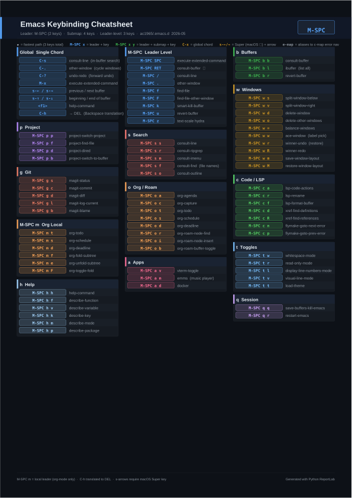

# -*- mode: org; coding: utf-8; -*-
#+TITLE: Modern Emacs Configuration
#+AUTHOR: YAMASHITA, Takao
#+EMAIL: tjy1965@gmail.com
#+LANGUAGE: en
#+OPTIONS: toc:3 num:t
#+STARTUP: overview
#+PROPERTY: header-args :results silent :exports code :mkdirp yes :padline no :tangle no
#+PROPERTY: header-args:emacs-lisp :lexical t :noweb no-export :mkdirp yes :comments no
#+LATEX_COMPILER: lualatex
#+LATEX_CLASS_OPTIONS: [11pt]
#+LATEX_HEADER: \usepackage[a4paper,margin=20mm]{geometry}
#+LATEX_HEADER: \usepackage{luatexja}
#+LATEX_HEADER: \usepackage{luatexja-fontspec}
#+LATEX_HEADER_EXTRA: \newfontfamily\EmojiFont{Apple Color Emoji}
#+LATEX_HEADER_EXTRA: \sloppy

* Overview
:PROPERTIES:
:CUSTOM_ID: overview
:END:

This repository implements a modern, deterministic Emacs configuration.

The configuration is structured as a literate programming system using Org Mode and Babel.
Source blocks are tangled into Emacs Lisp modules.

[[file:tangle-flow.svg]]

=README.org= is the single source of truth; all =.el= files are generated artifacts.
Divergence between documentation and code is structurally impossible.

Primary design goals:

- Deterministic startup (identical inputs always produce identical results)
- Explicit dependency management (no implicit auto-discovery)
- Delete-safe module architecture (removing any module leaves the rest functional)
- Forward compatibility with Emacs 31+
- Maintainability for long-term evolution
- LSP backend agnosticism (eglot / lsp-mode / lsp-bridge are interchangeable)

[[file:demo.png]]

** Architecture
:PROPERTIES:
:CUSTOM_ID: architecture
:END:

The configuration follows a strict 10-layer architecture.
Each layer owns a distinct responsibility domain; dependencies flow in one direction only.

#+begin_example
layer 10: personal      (user-specific; must not modify lower layers)
layer  9: utils         (general-purpose utilities)
layer  8: dev           (language modes, LSP, AI assistance)
layer  7: vcs           (Magit, Forge, diff-hl)
layer  6: orgx          (Org extensions)
layer  5: completion    (vertico/corfu/consult/embark)
layer  4: auth          (auth-source, EasyPG)
layer  3: ui            (themes, fonts, windows)
layer  2: core          (runtime foundations + policy)
layer  1: early-init    (disable package.el, GC optimisation)
#+end_example

Load order (top to bottom; dependencies flow downward only):

1. early-init
2. core (includes policy sub-layer)
3. ui
4. auth
5. completion
6. orgx
7. vcs
8. dev
9. utils
10. personal

Invariants:

- Upper layers may depend on lower layers
- Lower layers must never depend on upper layers
- No auto-discovery of dependencies
- All side effects are explicit
- The LSP backend (eglot / lsp-mode / lsp-bridge) is selected via =core-switches=

** Boot Process
:PROPERTIES:
:CUSTOM_ID: boot
:END:

Startup follows the standard Emacs initialisation sequence in three stages.

*** early-init.el

Runs before package initialisation and before the frame is rendered, preventing flicker.

Responsibilities:

- Disable =package.el= auto-initialisation
- Optimise GC and file-handler-alist for startup
- Configure directory layout (=my:d:var=, =my:d:cache=, =my:d:etc=)
- Prepare native compilation paths
- Prepare tree-sitter grammar paths
- Apply early UI defaults (disable toolbar, etc.)

*** init.el

Minimal bootstrap file.

Responsibilities:

- Bootstrap =straight.el=
- Import macOS login-shell environment variables
- Initialise =leaf=
- Apply runtime performance settings
- Load personal overlay (=personal/<user>.el=)
- Start =modules.el=

*** modules.el

Orchestration layer.  This file defines the single authoritative load order.

Responsibilities:

- Define the canonical load order (=core → ui → auth → completion → orgx → vcs → dev → utils=)
- Per-module error isolation via =condition-case= (one failure does not abort the rest)
- Safe module skipping via =my:modules-skip=
- Per-module load-time reporting when =my:modules-verbose= is non-nil
- Prevent dependency inversion between layers

** Directory Layout
:PROPERTIES:
:CUSTOM_ID: directory-layout
:END:

The repository follows this layout.

#+begin_example
.emacs.d/
├── early-init.el
├── init.el
├── modules.el
├── README.org
├── lisp/
│   ├── core/
│   ├── ui/
│   ├── auth/
│   ├── completion/
│   ├── orgx/
│   ├── vcs/
│   ├── dev/
│   └── utils/
├── .var/        (runtime state)
├── .cache/      (transient caches)
└── .etc/        (external resources)
#+end_example

Directory roles:

| Directory  | Role |
|------------+------|
| =lisp/=    | Module source code |
| =.var/=    | Runtime state (data written by packages) |
| =.cache/=  | Transient caches (safe to delete; regenerated automatically) |
| =.etc/=    | External resources (theme files, etc.) |

** Layer Definitions
:PROPERTIES:
:CUSTOM_ID: layers
:END:

*** core

Runtime foundation.  The lowest functional layer; all other layers depend on it.

Responsibilities:

- Establish environment configuration and directory layout
- Path management and =load-path= construction
- Native compilation and =eln-cache= configuration
- Tree-sitter grammar management
- Session persistence and history management
- GC tuning and startup performance

Core modules must not depend on the ui layer.

*** policy

Global behavioural policy (loaded as part of the core layer).

Responsibilities:

- Whitespace and trailing-whitespace rules
- Indentation standards and tab policy
- Editor safety constraints (=require-final-newline=, etc.)

Policy modules must not activate UI or package features.

*** ui

Visual appearance and user interaction.

Responsibilities:

- Themes and fonts
- Window behaviour
- UI helpers and leader key infrastructure

*** completion

Completion framework and minibuffer UX.

Responsibilities:

- Minibuffer UI (vertico, marginalia)
- Popup completion (corfu, cape)
- Search and navigation (consult, embark)
- Icon integration (nerd-icons, kind-icon)
- Org SRC block completion integration

The =capf-org-src= family works cooperatively to provide language-specific completion inside Org source blocks.

*** auth

Authentication and secrets management.

Responsibilities:

- Configure =auth-source= backends
- EasyPG file encryption support
- =pass=-based credential lookup
- Environment variable verification

Auth modules must not depend on the ui layer.

*** orgx

Extended Org Mode functionality.

Responsibilities:

- Agenda and TODO configuration
- Journaling (org-journal) and note capture
- org-roam knowledge graph integration
- Export backends (ox-hugo, LaTeX/LuaLaTeX)
- Visual enhancements (org-modern)
- Auto-tangle on save

*** vcs

Version control integration.

Responsibilities:

- Magit configuration
- Gutter diff indicators (diff-hl)
- GitHub/GitLab Forge integration

VCS modules must not depend on the dev layer.

*** dev

Development tooling.

Responsibilities:

- LSP backends (eglot, lsp-mode, lsp-bridge)
- AI-assisted editing (aidermacs, gptel)
- Terminal integration (vterm)
- Code formatting (apheleia)

Org Babel + Claude API workflow integration lives in =personal/personal-ai.el= and depends on =utils/utils-claude.el= for HTTP transport.

*** utils

General-purpose utilities used across layers.

Responsibilities:

- Path and directory helpers
- Async shell command utilities
- Buffer management and ibuffer configuration
- dired and dirvish integration
- Claude API HTTP client (utils-claude)

*** personal

User-specific customisation.

Rules:

- Optional (the system functions without it)
- Loaded last
- Must not modify lower layers

** Module Structure
:PROPERTIES:
:CUSTOM_ID: module-structure
:END:

Each module follows a predictable structure.

#+begin_example
;;; module-name.el --- description -*- lexical-binding: t; -*-

;;; Commentary:

Explanation of responsibilities.

;;; Code:

(require ...)

(defgroup ...)

(defcustom ...)

(defun ...)

(provide 'module-name)

;;; module-name.el ends here
#+end_example

Module requirements:

- Deterministic (identical inputs produce identical outputs)
- Idempotent (repeated evaluation does not duplicate side effects)
- Safe under byte compilation
- Safe under daemon mode

** Package Management
:PROPERTIES:
:CUSTOM_ID: packages
:END:

Packages are declared using the =leaf= macro.

#+begin_src emacs-lisp
  (leaf vertico
    :straight t
    :custom
    ((vertico-count . 15)))
#+end_src

=leaf= keyword order (Coding Rule 4):

#+begin_example
:straight → :ensure → :after → :require →
:pre-setq → :custom → :bind → :hook → :init → :config
#+end_example

** Tangle
:PROPERTIES:
:CUSTOM_ID: tangling
:END:

Org Babel expands Emacs Lisp blocks into module files.

- Each module is tangled to =lisp/<layer>/<module>.el=
- Directories are created automatically (=:mkdirp yes=)

*Tangling can be performed vi*:

#+begin_example
1. EMACS=/Applications/Emacs.app/Contents/MacOS/Emacs make -C ~/.emacs.d/ reload   # clean + tangle
2. Restart Emacs
#+end_example

The =reload= target purges =*.elc= files before re-tangling, preventing the failure mode of tangling from a stale =README.org= because the =cp= step was skipped.

** Design Principles
:PROPERTIES:
:CUSTOM_ID: design-tenets
:END:

*** Deterministic Behaviour

Startup must produce identical results on every invocation.
The =my:modules= list is the single authoritative load order.

*** Explicit Dependencies

Modules =require= their dependencies explicitly.  No implicit auto-discovery.

*** Layer Ownership

Each layer owns its domain and does not modify other layers.

*** Delete Safety

Removing a module must not break the system.
=condition-case= error isolation implements this guarantee.

*** Forward Compatibility

Anticipate changes in Emacs 31+.
Prefer =setopt=, =keymap-set=, =if-let*=, and =when-let*=.

** Coding Rules
:PROPERTIES:
:CUSTOM_ID: conventions
:END:

All files declare lexical binding; =provide= symbols match file names.
Built-in packages use =:straight nil=.  Observe the =leaf= keyword order.
All public =defun= carry a docstring.  Use =setopt= for =defcustom=, =setq= for =defvar=.
Observe naming conventions (=my/=, =<module>-=, =<module>--=, =my:d:*=).
Use the =keymap-set= API (Emacs 29+).

See [[#modular-loader-and-core-suite][Modular Loader & Core Suite]] for full details.

** License

This configuration is released under the GNU General Public License v3.

See the LICENSE file for details.

** Installation
:PROPERTIES:
:CUSTOM_ID: installation
:END:

*** Prerequisites
:PROPERTIES:
:CUSTOM_ID: prerequisites
:END:

*Required*
- Emacs 30+ (with native compilation)
- Git
- GNU Make
- GCC 10+ (=libgccjit=)

*Recommended*
- ripgrep (=rg=)
- aspell or hunspell
- pass + GnuPG
- Homebrew (macOS)

* Configuration
:PROPERTIES:
:CUSTOM_ID: structure
:END:

This Emacs configuration uses a *modular design* targeting **Emacs 30+**.
Each layer has a clearly defined responsibility domain, ensuring behavioural predictability, UI replaceability, and isolation of personal customisation.

- =early-init.el= → earliest bootstrap (performance, paths, UI defaults)
- =init.el=       → package bootstrap, global defaults, module entrypoint
- =lisp/=         → shared, versioned modules (core, ui, completion, orgx, dev, vcs, utils)
- =personal/=     → user- and device-specific overlays (not shared policy)

** Core Bootstrap — early-init.el & init.el
:PROPERTIES:
:CUSTOM_ID: core-bootstrap
:END:

*** Overview

**** Purpose

Provide a clean, fast bootstrap that prepares Emacs before any feature is activated.

Initialisation is split into two stages:

- =early-init.el= — pre-package bootstrap (directories, performance guards, early UI).
- =init.el= — package bootstrap (*straight.el + leaf*), runtime setup, and module entrypoint.

Infrastructure is established first; feature logic is activated afterwards.

**** Responsibilities

This bootstrap layer:

- Disables =package.el=; uses *straight.el* exclusively.
- Optimizes startup (temporary GC/file-handler relaxation with safe restoration).
- Normalizes state under =.cache/=, =.etc/=, =.var/= (including native-comp artifacts).
- Prepares Homebrew toolchain variables on macOS before native compilation.
- Applies early UI defaults to avoid flicker.
- Configures URL state paths before =url.el= loads.
- Initializes *leaf* and conservative runtime helpers (GCMH, IO buffers).
- Provides two entrypoints:
  - =personal/<login-name>.el=
  - =lisp/modules.el=

**** Reproducibility

Shared layers are reproducible:

- =early-init.el=
- =init.el=
- =lisp/=

Personal overlays are intentionally user-scoped:

: personal/<login-name>.el

This prioritises isolation and multi-user safety over byte-for-byte reproducibility.

**** Module Map

| File            | Role |
|-----------------+--------------------------------------------|
| =early-init.el= | Pre-init infrastructure & performance guards |
| =init.el=       | Package bootstrap & module activation      |

**** Boot Flow

1. =early-init.el=
   - Establish directories
   - Disable =package.el=
   - Relax GC/file handlers
   - Apply early UI defaults
   - Prepare macOS toolchain (if applicable)

2. =init.el=
   - Configure URL state
   - Bootstrap *straight.el*
   - Import macOS login environment (GUI/daemon)
   - Initialize *leaf*
   - Apply runtime performance knobs
   - Declare =my:modules-extra= (before personal overlay loads)
   - Load personal overlay (personal/user.el appends to =my:modules-extra=)
   - Require =modules.el=

3. After startup:
   - Print elapsed time and GC count.

**** Key Configuration Values

- =package-enable-at-startup= :: =nil=
- =straight-base-dir= :: under =.cache/=
- =native-comp-eln-load-path= :: =.cache/eln-cache=
- =read-process-output-max= :: 4 MiB (temporary)
- =gcmh-high-cons-threshold= :: 16 MiB

**** Usage Guidelines

- Keep =early-init.el= infrastructure-only.
- Put shared behavior in modules via =modules.el=.
- Put user/device glue in =personal/=.
- Restart Emacs after toolchain upgrades.
- The configuration root is relocatable; state directories regenerate automatically.

**** Troubleshooting

- Native compilation fails on macOS →
  Ensure Homebrew =libgccjit= is installed and visible.

- Straight bootstrap fails →
  Usually a transient network issue; retry.

- Startup echo warning →
  =inhibit-startup-echo-area-message= must be a string.

*** early-init.el
:PROPERTIES:
:header-args:emacs-lisp: :tangle early-init.el
:END:

**** early-init.el Design Notes

Runs before =package.el= initialisation and before the frame is rendered, preventing flicker.
As the first phase of the startup sequence, it establishes infrastructure only and loads no features.

**Establishing Directory Foundations**

=file-chase-links= resolves symbolic links, making the configuration relocatable regardless of whether =~/.emacs.d= is itself a symlink.
Honouring =XDG_CACHE_HOME= follows the Linux XDG specification (on macOS this resolves to =~/.emacs.d/.cache/emacs/=).
=defconst= is used because these values must not be changed after initialisation.

**straight.el Base Directory Configuration**

Including the Emacs version in =straight-build-dir= (e.g. =build-31.0=) prevents built packages from different Emacs versions from mixing.
This must be set in =early-init.el= because =straight.el= reads this variable before its own bootstrap runs.

**GC Tuning Strategy**

Clearing =file-name-handler-alist= at startup is a significant optimisation: every =require= and =load= call consults this list, so the overhead accumulates across many modules.
The list includes the TRAMP handler and must be restored in =after-init-hook= from =core--orig-file-name-handler-alist=; failure to restore it breaks TRAMP.

A second stage of GC management uses gcmh in =core-runtime.el= to handle idle-time garbage collection.

**Compatibility with no-littering**

=no-littering.el= reads these path variables at load time to configure its directories.
Setting them in =early-init.el= ensures that =no-littering= uses the correct paths from the moment it loads.
If the order were reversed, =no-littering= would place files under the default =~/.emacs.d/=.

**Early UI Configuration (Flicker Prevention)**

Both =default-frame-alist= and =initial-frame-alist= must be set because Emacs applies different parameter sets to the first frame (initial) and subsequent frames (default).
Disabling the toolbar in =early-init.el= prevents it from appearing briefly before disappearing, which would produce a visible flicker.

#+begin_src emacs-lisp
  ;;; early-init.el --- Early bootstrap and runtime foundations -*- lexical-binding: t; -*-
  ;;
  ;; Copyright (c) 2021-2026
  ;; Author: YAMASHITA, Takao
  ;; License: GNU GPL v3 or later
  ;;
  ;; Category: core
  ;;
  ;;; Commentary:
  ;; Early initialization executed before regular init.el.
  ;;
  ;; This file:
  ;; - disables package.el and quickstart
  ;; - performs startup optimizations (GC, file-name-handlers)
  ;; - defines base configuration directories (.var / .etc / .cache / lisp)
  ;; - configures native compilation and Tree-sitter paths
  ;; - prepares macOS Homebrew toolchain environment
  ;; - establishes early UI defaults and frame parameters
  ;;
  ;;; Code:

  ;;
  ;; Optimized version (macOS-focused, low I/O, fast startup)

  (eval-when-compile
    (require 'subr-x))

  ;; ---------------------------------------------------------------------------
  ;; Internal utilities
  ;; ---------------------------------------------------------------------------

  (defun core--ensure-directory (dir)
    "Ensure DIR exists, creating it recursively if needed."
    (unless (file-directory-p dir)
      (condition-case err
          (make-directory dir t)
        (error
         (warn "early-init: failed to create %s (%s)"
               dir (error-message-string err))))))

  (defun core--login-username ()
    "Return login username or nil."
    (ignore-errors (user-login-name)))

  (defalias 'my/ensure-directory-exists #'core--ensure-directory)

  ;; ---------------------------------------------------------------------------
  ;; 1) Disable package.el
  ;; ---------------------------------------------------------------------------

  (setq package-enable-at-startup nil
        package-quickstart nil)

  ;; ---------------------------------------------------------------------------
  ;; 2) Base directories
  ;; ---------------------------------------------------------------------------

  (defvar my:d
    (file-name-as-directory
     (or (and load-file-name
              (file-name-directory (file-chase-links load-file-name)))
         user-emacs-directory))
    "Root directory of this Emacs configuration.")

  (setq user-emacs-directory my:d)

  (defconst my:d:var  (expand-file-name ".var/" my:d))
  (defconst my:d:etc  (expand-file-name ".etc/" my:d))
  (defconst my:d:lisp (expand-file-name "lisp/" my:d))

  (when (file-directory-p my:d:lisp)
    (add-to-list 'load-path my:d:lisp)
    (let ((default-directory my:d:lisp))
      (normal-top-level-add-subdirs-to-load-path)))

  ;; ---------------------------------------------------------------------------
  ;; 3) State directories
  ;; ---------------------------------------------------------------------------

  (defconst my:d:cache
    (expand-file-name
     "emacs/"
     (or (getenv "XDG_CACHE_HOME")
         (expand-file-name ".cache/" my:d))))
  (defconst my:d:eln-cache
    (expand-file-name "eln-cache/" my:d:cache))

  (defconst my:d:treesit
    (expand-file-name "tree-sitter/" my:d:var))

  (defconst my:d:url (expand-file-name "url/" my:d:var))
  (defconst my:d:eww (expand-file-name "eww/" my:d:var))

  (dolist (dir (list my:d:var my:d:etc my:d:lisp my:d:cache
                     my:d:eln-cache my:d:treesit my:d:url my:d:eww))
    (core--ensure-directory dir))

  (when (boundp 'treesit-install-dir)
    (setopt treesit-install-dir my:d:treesit))
  (when (boundp 'treesit-extra-load-path)
    (setopt treesit-extra-load-path (list my:d:treesit)))

  ;; ---------------------------------------------------------------------------
  ;; 4) straight.el base
  ;; ---------------------------------------------------------------------------

  (setopt straight-base-dir my:d:cache
          straight-use-package-by-default t
          straight-vc-git-default-clone-depth 1
          straight-build-dir
          (format "build-%d.%d" emacs-major-version emacs-minor-version)
          straight-profiles '((nil . "default.el")))

  ;; ---------------------------------------------------------------------------
  ;; 5) macOS Homebrew toolchain
  ;; ---------------------------------------------------------------------------

  (when-let* ((brew (or (getenv "HOMEBREW_PREFIX")
                        (and (file-directory-p "/opt/homebrew") "/opt/homebrew")
                        (and (file-directory-p "/usr/local")   "/usr/local")))
              (bin  (expand-file-name "bin" brew)))
    (when (file-directory-p bin)
      (let ((path (or (getenv "PATH") "")))
        (unless (string-prefix-p bin path)
          (setenv "PATH" (concat bin ":" path))))
      (let ((gcc (car (directory-files bin t "^gcc-[0-9]+$" t))))
        (when gcc (setenv "CC" gcc)))))

  ;; ---------------------------------------------------------------------------
  ;; 6) Native compilation
  ;; ---------------------------------------------------------------------------

  (when (and (boundp 'native-comp-eln-load-path)
             (listp native-comp-eln-load-path))
    (setopt native-comp-eln-load-path
            (cons my:d:eln-cache
                  (delq my:d:eln-cache native-comp-eln-load-path))
            native-comp-async-report-warnings-errors 'silent))

  (setq native-comp-deferred-compilation t)

  ;; ---------------------------------------------------------------------------
  ;; 7) no-littering compatibility
  ;; ---------------------------------------------------------------------------

  (defvar no-littering-etc-directory (file-name-as-directory my:d:etc))
  (defvar no-littering-var-directory (file-name-as-directory my:d:var))

  ;; ---------------------------------------------------------------------------
  ;; 8) Startup performance
  ;; ---------------------------------------------------------------------------

  (defvar core--orig-file-name-handler-alist file-name-handler-alist)

  (defun core--restore-startup-state ()
    "Restore GC and file handler settings after startup."
    (setq file-name-handler-alist core--orig-file-name-handler-alist
          gc-cons-threshold (* 128 1024 1024)
          gc-cons-percentage 0.1))

  (setq file-name-handler-alist nil
        gc-cons-threshold (* 512 1024 1024)
        gc-cons-percentage 0.6)

  (add-hook 'after-init-hook #'core--restore-startup-state)

  ;; ---------------------------------------------------------------------------
  ;; 9) Backups / auto-save
  ;; ---------------------------------------------------------------------------

  (setq make-backup-files nil
        version-control nil
        delete-old-versions nil
        backup-by-copying nil
        auto-save-default nil
        auto-save-list-file-prefix nil)

  ;; ---------------------------------------------------------------------------
  ;; 10) Early UI defaults
  ;; ---------------------------------------------------------------------------

  (setopt frame-resize-pixelwise t
          frame-inhibit-implied-resize t
          cursor-in-non-selected-windows nil
          x-underline-at-descent-line t
          window-divider-default-right-width 16
          window-divider-default-places 'right-only)

  (setq inhibit-compacting-font-caches t)

  (dolist (it '((internal-border-width . 8)
                (tool-bar-lines . 0)))
    (add-to-list 'default-frame-alist it)
    (add-to-list 'initial-frame-alist it))

  (setq default-frame-alist
        (assq-delete-all 'fullscreen default-frame-alist))
  (setq initial-frame-alist
        (assq-delete-all 'fullscreen initial-frame-alist))

  (defvar core--did-fullscreen nil)

  (defun core--fullscreen-once ()
    (unless core--did-fullscreen
      (setq core--did-fullscreen t)
      (set-frame-parameter nil 'fullscreen 'fullboth)))

  (add-hook 'window-setup-hook #'core--fullscreen-once)

  (when (fboundp 'menu-bar-mode)   (menu-bar-mode -1))
  (when (fboundp 'tool-bar-mode)   (tool-bar-mode -1))
  (when (fboundp 'scroll-bar-mode) (scroll-bar-mode -1))

  ;; ---------------------------------------------------------------------------
  ;; 11) Startup echo
  ;; ---------------------------------------------------------------------------

  (when-let* ((u (core--login-username)))
    (setq inhibit-startup-echo-area-message u))

  (provide 'early-init)
  ;;; early-init.el ends here
#+end_src

*** init.el
:PROPERTIES:
:header-args:emacs-lisp: :tangle init.el
:END:

**** init.el Design Notes

Activates feature logic after infrastructure (=early-init.el=) has been established.
Responsibilities are cleanly separated: this file performs bootstrap only and delegates configuration to =modules.el=.

**URL State Directory (must precede =url.el= load)**

=url.el= attempts to create files using the default values of these variables on first load.
The variables must be set before any =(require 'url)= call, otherwise files are created under =~/.emacs.d/url/=.
Load order is critical here, as the inline comment notes.

**straight.el Bootstrap**

=(bound-and-true-p straight-base-dir)= respects the value set in =early-init.el=.
Plain =boundp= returns =t= even for variables bound to =nil=, so =bound-and-true-p= is the correct predicate.
Network access occurs only on the first startup; subsequent starts load the local =bootstrap.el= directly.

**macOS Environment Variable Import**

macOS GUI applications do not read shell profiles, so =PATH= is typically limited to =/usr/bin:/bin=.
=exec-path-from-shell= launches a login shell to retrieve environment variables.
The =(daemonp)= condition is important: the same import is required when Emacs starts as a daemon.

**Startup Time Reporting**

=before-init-time= records when Emacs started; =after-init-time= records when =after-init-hook= completed.
=gcs-done= counts garbage collection cycles; a high value suggests the GC threshold in =early-init.el= is set too low.

#+begin_src emacs-lisp
  ;;; init.el --- Main initialization entry point -*- lexical-binding: t; -*-
  ;;
  ;; Copyright (c) 2021-2026
  ;; Author: YAMASHITA, Takao <tjy1965@gmail.com>
  ;; License: GNU GPL v3 or later
  ;;
  ;; Category: core
  ;;
  ;;; Commentary:
  ;;
  ;; Primary initialization sequence for Emacs 30+.
  ;;
  ;; Responsibilities of this file:
  ;;   1. Bootstrap straight.el, leaf, and Org
  ;;   2. Establish URL state directory layout (must precede `url' load)
  ;;   3. Import macOS login environment on GUI/daemon sessions
  ;;   4. Temporarily expand process I/O and GC thresholds for startup
  ;;   5. Configure core built-ins at policy level
  ;;   6. Safely load personal overlays
  ;;   7. Delegate feature activation to modules.el
  ;;   8. Report startup metrics
  ;;
  ;; Internal helpers carry the `bootstrap--' prefix, not `utils--', because
  ;; they are defined before the utils layer exists.  `bootstrap--safe-load-file'
  ;; is aliased as `my/safe-load-file' for callers in other layers.
  ;;
  ;;; Code:

  (eval-when-compile
    (require 'subr-x)
    (require 'seq)
    (require 'cl-lib))

  ;;; -------------------------------------------------------------------------
  ;;; Internal helpers
  ;;; -------------------------------------------------------------------------

  (defun bootstrap--safe-load-file (file &optional noerror)
    "Safely load FILE.  Report but do not raise errors by default."
    (when (and (stringp file) (file-exists-p file))
      (condition-case err
          (load file nil 'nomessage)
        (error
         (funcall (if noerror #'message #'user-error)
                  "[load] failed: %s (%s)"
                  file (error-message-string err))))))

  (defalias 'my/safe-load-file #'bootstrap--safe-load-file)

  ;;; -------------------------------------------------------------------------
  ;;; 1. URL state directory (must precede url load)
  ;;; -------------------------------------------------------------------------

  (defvar core--url-state-dir
    (file-name-as-directory
     (or (bound-and-true-p my:d:url)
         (expand-file-name "url/" user-emacs-directory))))

  (setopt url-configuration-directory core--url-state-dir
          url-cookie-file              (expand-file-name "cookies" core--url-state-dir)
          url-history-file             (expand-file-name "history" core--url-state-dir)
          url-cache-directory          (expand-file-name "cache/" core--url-state-dir)
          url-queue-timeout            5
          url-request-timeout          5)

  (dolist (d (list url-configuration-directory url-cache-directory))
    (make-directory d t))

  (require 'url)

  ;;; -------------------------------------------------------------------------
  ;;; 2. straight.el bootstrap
  ;;; -------------------------------------------------------------------------

  (defvar bootstrap-version 7)

  (let* ((base (or (bound-and-true-p straight-base-dir)
                   user-emacs-directory))
         (bootstrap-file
          (expand-file-name
           "straight/repos/straight.el/bootstrap.el" base)))
    (unless (file-exists-p bootstrap-file)
      ;; Network access only on first run
      (let ((buf (url-retrieve-synchronously
                  "https://raw.githubusercontent.com/radian-software/straight.el/develop/install.el"
                  'silent 'inhibit-cookies)))
        (unless (buffer-live-p buf)
          (user-error "[straight] bootstrap failed"))
        (with-current-buffer buf
          (goto-char (point-max))
          (eval-print-last-sexp))))
    (load bootstrap-file nil 'nomessage))

  ;;; -------------------------------------------------------------------------
  ;;; 3. leaf bootstrap
  ;;; -------------------------------------------------------------------------

  (dolist (pkg '(leaf leaf-keywords))
    (straight-use-package pkg))

  (eval-and-compile
    (require 'leaf))

  (eval-when-compile
    (require 'leaf-keywords))

  (when (fboundp 'leaf-keywords-init)
    (leaf-keywords-init))

  ;;; -------------------------------------------------------------------------
  ;;; 4. Org bootstrap
  ;;; -------------------------------------------------------------------------

  (straight-use-package 'org)
  (require 'org)

  ;;; -------------------------------------------------------------------------
  ;;; 5. macOS environment import
  ;;; -------------------------------------------------------------------------

  (leaf exec-path-from-shell
    :straight t
    :when (and (eq system-type 'darwin)
               (or (daemonp) (memq window-system '(mac ns))))
    :config
    (setopt exec-path-from-shell-check-startup-files nil
            exec-path-from-shell-arguments '("-l"))

    (exec-path-from-shell-copy-envs
     '("PATH" "LANG"
       "OPENAI_API_KEY"
       "OPENROUTER_API_KEY")))

  ;;; -------------------------------------------------------------------------
  ;;; 6. Startup performance knobs
  ;;; -------------------------------------------------------------------------

  ;; LSP and subprocess optimization
  (setq read-process-output-max (* 4 1024 1024))
  (setq process-adaptive-read-buffering nil)

  ;; GCMH
  ;; NOTE: `gcmh-high-cons-threshold' requires a runtime expression
  ;; `(* 128 1024 1024)'.  `leaf :custom' quotes cdr positions verbatim, so
  ;; a sexp placed there is assigned as a list literal and triggers
  ;;   Wrong type argument: integerp, nil
  ;; inside `gcmh-mode'.  Set via `setopt' in `:config' instead.
  (leaf gcmh
    :straight t
    :config
    (setopt gcmh-idle-delay 5)
    (setopt gcmh-high-cons-threshold (* 128 1024 1024))
    (gcmh-mode 1))

  ;;; -------------------------------------------------------------------------
  ;;; 7. Core built-in policy
  ;;; -------------------------------------------------------------------------

  (leaf emacs
    :straight nil
    :custom
    ((inhibit-startup-screen    . t)
     (inhibit-startup-message   . t)
     (initial-scratch-message   . nil)
     (initial-major-mode        . 'fundamental-mode)
     (use-short-answers         . t)
     (create-lockfiles          . nil)
     (idle-update-delay         . 0.2)
     (ring-bell-function        . #'ignore)
     (display-line-numbers-type . 'relative)
     (frame-title-format        . t)
     (confirm-kill-emacs        . #'y-or-n-p))
    :hook
    ((prog-mode-hook . display-line-numbers-mode))
    :config
    (when (fboundp 'window-divider-mode)
      (window-divider-mode 1))
    (when (fboundp 'pixel-scroll-precision-mode)
      (pixel-scroll-precision-mode 1))
    (when (fboundp 'electric-pair-mode)
      (electric-pair-mode 1))
    (dolist (k '("C-z" "C-x C-z" "C-x C-c"))
      (keymap-global-unset k)))

  ;;; -------------------------------------------------------------------------
  ;;; 8. Personal overlay
  ;;; -------------------------------------------------------------------------

  (defvar my:modules-extra nil)

  (let* ((root     (or (bound-and-true-p my:d) user-emacs-directory))
         (personal (expand-file-name "personal/" root))
         (user     (ignore-errors (user-login-name))))
    (when (file-directory-p personal)
      (add-to-list 'load-path personal))
    (my/safe-load-file (expand-file-name "user.el" personal) t)
    (when user
      (my/safe-load-file
       (expand-file-name (concat user ".el") personal) t)))

  ;;; -------------------------------------------------------------------------
  ;;; 9. Modules entrypoint
  ;;; -------------------------------------------------------------------------

  (let* ((root     (or (bound-and-true-p my:d) user-emacs-directory))
         (lisp-dir (expand-file-name "lisp/" root)))
    (when (file-directory-p lisp-dir)
      (add-to-list 'load-path lisp-dir))
    (require 'modules nil t))

  ;;; -------------------------------------------------------------------------
  ;;; 10. Startup metrics
  ;;; -------------------------------------------------------------------------

  (defun core--announce-startup ()
    (message "Emacs ready in %.2f seconds with %d GCs."
             (float-time (time-subtract after-init-time before-init-time))
             gcs-done))

  (run-with-idle-timer 0 nil #'core--announce-startup)

  (provide 'init)
  ;;; init.el ends here
#+end_src

** Modular Loader & Core Module Suite
:PROPERTIES:
:CUSTOM_ID: modular-loader-and-core-suite
:END:

*** Overview

The configuration uses a strictly layered, explicitly ordered module-loading architecture.

Shared behaviour is activated only from the centralised entry point.
Modules are never discovered implicitly or loaded by directory scanning.

The goal is a deterministic, reproducible, and inspectable startup.

**** Architecture

Initialization is segmented into three stages:

1. Infrastructure — =early-init.el=
2. Runtime setup   — =init.el=
3. Feature activation — =modules.el=

Only =modules.el= enables shared configuration modules.
Earlier stages prepare the environment but do not activate features.

**** Responsibility Model

Directories define bounded responsibility domains:

| Directory     | Responsibility |
|---------------+----------------|
| =core/=       | Runtime invariants and global policy |
| =ui/=         | Visual presentation and interaction |
| =completion/= | Completion frameworks |
| =orgx/=       | Org extensions |
| =dev/=        | Development tooling |
| =vcs/=        | Version control |
| =utils/=      | Narrow helpers |

Dependencies flow strictly downward.
Upper layers may depend on lower layers; the reverse is prohibited.

**** Authoritative Entry Point

=modules.el= defines:

- The ordered module list
- Error-isolated loading
- Skip and extension mechanisms
- Load timing diagnostics

Contains orchestration only.
Feature logic resides inside the individual module files.

**** Load Order

1. =core=
2. =ui=
3. =completion=
4. =orgx=
5. =dev=
6. =vcs=
7. =utils=

This order encodes the dependency direction.

**** Module Constraints

To preserve determinism:

- No directory scanning
- No wildcard expansion
- No environment-based conditionals
- No personal or host-specific logic

Each module must:

- Provide exactly one feature
- Be idempotent
- Avoid uncontrolled global side effects
- Remain safe under batch, byte-compilation, native-comp, and daemon contexts

**** Loader Non-Responsibilities

The loader does not:

- Perform bootstrap or package initialization
- Establish runtime foundations
- Define hooks, advice, keybindings, or UI behavior
- Encode user- or host-specific policy

Its sole role is orchestration.

**** Benefits

- Inspectable startup
- Predictable dependency flow
- Controlled diagnostics
- Stable compilation
- Safe layer removal (convenience lost, correctness preserved)

*** modules.el
:PROPERTIES:
:CUSTOM_ID: modules-el
:header-args:emacs-lisp: :tangle lisp/modules.el
:END:

**** modules.el Design Notes

Central orchestration layer.  This file's design implements the core of delete-safety and deterministic startup.

**Module Definition and Skip Mechanism**

Declaring =my:modules-skip= and =my:modules-extra= as =defcustom= allows them to be set from the =customize= UI or overridden with =setopt= in =personal/<user>.el=.
Adding ='(dev-docker dev-music)= to =my:modules-skip= skips those modules silently.
=my:modules-extra= appends personal modules at the end of the load sequence.

**Error-Isolated Loading (core implementation of delete-safety)**

=condition-case= catches =error= signals so that one module failure does not abort subsequent loading.
Note: =condition-case= catches only =error= signals.  =quit= (=C-g=) propagates — user interruption is intentionally respected.

**Load Measurement and Diagnostics**

When =my:modules-verbose= is non-nil, load time is reported for each module in milliseconds.
=%-24s= left-aligns the module name in a 24-character field for readable alignment.
Combining =(current-time)=, =float-time=, and =time-subtract= yields sub-millisecond precision.

#+begin_src emacs-lisp
  ;;; lisp/modules.el --- Modular configuration loader -*- lexical-binding: t; -*-
  ;;
  ;; Copyright (c) 2021-2026
  ;; Author: YAMASHITA, Takao
  ;; License: GNU GPL v3 or later
  ;;
  ;; Category: core
  ;;
  ;;; Commentary:
  ;; Central entry point for loading modular configuration under lisp/.
  ;;
  ;;; Code:

  (eval-when-compile (require 'subr-x))
  (require 'seq)

  (defgroup my:modules nil
    "Loader options for modular Emacs configuration."
    :group 'convenience)

  (defcustom my:modules-verbose t
    "If non-nil, print per-module load time and a summary."
    :type 'boolean
    :group 'my:modules)

  (defcustom my:modules-skip nil
    "List of module features to skip during loading."
    :type '(repeat symbol)
    :group 'my:modules)

  (defcustom my:modules-extra nil
    "List of extra module features to append after `my:modules`."
    :type '(repeat symbol)
    :group 'my:modules)

  (defconst my:modules
    '(
      ;; -----------------------------------------------------------------------
      ;; Core (runtime invariants, infrastructure, policy)
      ;; -----------------------------------------------------------------------
      core-fixes
      core-policy
      core-session
      core-session-private
      core-gc
      core-persistence
      core-buffers
      core-runtime
      core-tools
      core-treesit
      core-history
      core-editing
      core-switches
      core-custom
      core-api
      core-native

      ;; -----------------------------------------------------------------------
      ;; UI (UX only; delete-safe)
      ;; -----------------------------------------------------------------------
      ui-font
      ui-theme
      ui-window
      ui-utils
      ui-health-modeline
      ui-imenu
      ui-leader
      ui-hydra
      ui-which-key
      ui-keymap
      ui-global-keys

      ;; -----------------------------------------------------------------------
      ;; Auth (secrets, auth-source; delete-safe)
      ;; -----------------------------------------------------------------------
      auth-core

      ;; -----------------------------------------------------------------------
      ;; Completion
      ;; -----------------------------------------------------------------------
      completion-core
      completion-vertico
      completion-consult
      completion-embark
      completion-corfu
      completion-icons
      completion-capf
      completion-capf-org-src
      completion-capf-org-src-lang
      completion-corfu-org-src
      completion-orderless-org-src
      completion-lsp

      ;; -----------------------------------------------------------------------
      ;; Org ecosystem
      ;; -----------------------------------------------------------------------
      orgx-core
      orgx-visual
      orgx-extensions
      orgx-fold
      orgx-export
      orgx-notes-markdown
      orgx-auto-tangle
      orgx-auto-hugo

      ;; -----------------------------------------------------------------------
      ;; VCS
      ;; -----------------------------------------------------------------------
      vcs-magit
      vcs-gutter
      vcs-forge

      ;; -----------------------------------------------------------------------
      ;; Dev
      ;; -----------------------------------------------------------------------
      ;; dev-lsp-bridge is the LSP abstraction facade (backend-agnostic dispatch
      ;; wrappers for code-actions, rename, format).  Loaded first so that
      ;; ui-keymap and personal overlays can bind dev-lsp-* commands
      ;; without depending on a specific backend (dev-lsp-eglot, dev-lsp-mode).
      ;; Concrete backends are activated lazily by core-switches via after-init-hook.
      dev-lsp-bridge
      dev-ai
      dev-term
      dev-web-core
      dev-build
      dev-format
      dev-infra-modes
      dev-docker
      dev-music
      dev-sql
      dev-rest
      dev-navigation
      dev-tools

      ;; -----------------------------------------------------------------------
      ;; Utils
      ;; -----------------------------------------------------------------------
      utils-path
      utils-async
      utils-buffers
      utils-edit
      utils-dired
      utils-functions
      utils-org-agenda
      utils-lint
      utils-diagnostics
      utils-scratch
      )
    "Default set of modules to load in order.")

  (defun modules--should-load-p (feature)
    "Return non-nil if FEATURE should be loaded."
    (not (memq feature my:modules-skip)))

  (defun modules--require-safe (feature)
    "Require FEATURE with error trapping."
    (condition-case err
        (progn (require feature) t)
      (error
       (message "[modules] Failed to load %s: %s"
                feature (error-message-string err))
       nil)))

  ;; [R6 FIX] Renamed my:modules--format-seconds → modules--format-seconds.
  ;; Rationale: `my:` prefix is reserved for directory/path variables (my:d,
  ;; my:d:var, etc.).  All functions use `my/` prefix.  Consistent naming
  ;; eliminates confusion when grepping for either convention.
  (defun modules--format-seconds (sec)
    "Format SEC in a compact human-readable form."
    (cond
     ((< sec 0.001) (format "%.3fms" (* sec 1000.0)))
     ((< sec 1.0)   (format "%.1fms"  (* sec 1000.0)))
     (t             (format "%.2fs"   sec))))

  (defun my/modules-load ()
    "Load all modules defined by `my:modules`, respecting options."
    (let* ((all (append my:modules my:modules-extra))
           (final (seq-remove (lambda (m) (not (modules--should-load-p m))) all))
           (skipped (seq-remove (lambda (m) (memq m final)) all))
           (ok 0) (ng 0)
           (failed '())
           (t0 (and my:modules-verbose (current-time))))
      (dolist (mod final)
        (let ((m0 (and my:modules-verbose (current-time))))
          (if (modules--require-safe mod)
              (setq ok (1+ ok))
            (setq ng (1+ ng))
            (push mod failed))
          (when my:modules-verbose
            (message "[modules] %-24s %s"
                     mod
                     (modules--format-seconds
                      (float-time (time-subtract (current-time) m0)))))))
      (when my:modules-verbose
        (message "[modules] loaded=%d skipped=%d failed=%d total=%s"
                 ok (length skipped) ng
                 (modules--format-seconds
                  (float-time (time-subtract (current-time) t0))))
        (when skipped
          (message "[modules] skipped (%d): %s"
                   (length skipped)
                   (mapconcat #'symbol-name (nreverse skipped) " ")))
        (when failed
          (message "[modules] failed  (%d): %s"
                   (length failed)
                   (mapconcat #'symbol-name (nreverse failed) " "))))
      ok))

  (my/modules-load)

  (provide 'modules)
  ;;; modules.el ends here
#+end_src

*** core/
:PROPERTIES:
:CUSTOM_ID: core-modules
:END:

**** core/core-fixes.el
:PROPERTIES:
:CUSTOM_ID: core-fixes
:header-args:emacs-lisp: :tangle lisp/core/core-fixes.el
:END:

***** core-fixes.el

Compatibility fix layer.  No active fix code exists at this time; the module serves as a placeholder for future version-specific corrections.

=core-fixes--emacs>== is also defined under the same name in =core-tools.el= (intentional duplication).
=core-fixes= is the first module loaded, so =core-tools= symbols do not yet exist.
Using =defalias= would raise a void-function error; the duplicate definition is therefore the correct choice to respect load-order constraints.

#+begin_src emacs-lisp
  ;;; core/core-fixes.el --- Compatibility & hotfix layer -*- lexical-binding: t; -*-
  ;;
  ;; Copyright (c) 2021-2026
  ;; Author: YAMASHITA, Takao
  ;; License: GNU GPL v3 or later
  ;;
  ;; Category: core
  ;;
  ;;; Commentary:
  ;; Minimal and version-scoped compatibility fixes for Emacs.
  ;;
  ;; Load-order note:
  ;; core-fixes is the FIRST module loaded (see modules.el).  core-tools loads
  ;; at position 9.  Therefore this file must NOT defalias to core-tools-emacs>=
  ;; — that symbol is not yet defined at load time and would raise void-function.
  ;;
  ;; core-fixes--emacs>= is defined independently here.  core-tools.el defines
  ;; its own core-tools-emacs>= separately.  Both are identical one-liners, and
  ;; the duplication is deliberate: the two functions serve different namespaces
  ;; (internal vs public) and avoiding the duplication via defalias requires
  ;; a load-order inversion that would break the deterministic module sequence.
  ;;
  ;;; Code:

  (defun core-fixes--emacs>= (major minor)
    "Return non-nil if running Emacs version is at least MAJOR.MINOR."
    (or (> emacs-major-version major)
        (and (= emacs-major-version major)
             (>= emacs-minor-version minor))))

  ;;;; Forward-compatibility notes --------------------------------------------
  ;;
  ;; - This module intentionally contains no active fixes at this time.
  ;; - Add fixes here only when guarded by explicit version checks.
  ;; - Prefer deleting fixes over accumulating them.
  ;;

  (provide 'core-fixes)
  ;;; core/core-fixes.el ends here
#+end_src

**** core/core-policy.el
:PROPERTIES:
:CUSTOM_ID: core-policy
:header-args:emacs-lisp: :tangle lisp/core/core-policy.el
:END:
#+begin_src emacs-lisp
  ;;; core/core-policy.el --- Global editing policy -*- lexical-binding: t; -*-
  ;;
  ;; Copyright (c) 2021-2026
  ;; Author: YAMASHITA, Takao
  ;; License: GNU GPL v3 or later
  ;;
  ;; Category: core
  ;;
  ;;; Commentary:
  ;;
  ;; Global editing policy: enforces lexical-binding in configuration files.
  ;;
  ;; This file:
  ;; - defines the `core-policy` customization group
  ;; - auto-inserts a `;;; -*- lexical-binding: t; -*-` header in any
  ;;   Emacs Lisp file under `no-littering-var-directory` on `find-file-hook`
  ;;; Code:

  (defgroup core-policy nil
    "Global editing policy for internal configuration."
    :group 'convenience)

  (defun my/auto-insert-lexical-binding ()
    "Insert lexical-binding header in internal configuration files."
    (when (and buffer-file-name
               (derived-mode-p 'emacs-lisp-mode)
               (string-prefix-p
                (expand-file-name no-littering-var-directory)
                (expand-file-name buffer-file-name)))
      (save-excursion
        (goto-char (point-min))
        (unless (search-forward "lexical-binding:" nil t)
          (insert ";;; -*- lexical-binding: t; -*-\n\n")))))

  (add-hook 'find-file-hook #'my/auto-insert-lexical-binding)

  (provide 'core-policy)
  ;;; core/core-policy.el ends here
#+end_src

**** core/core-native.el
:PROPERTIES:
:CUSTOM_ID: core-native
:header-args:emacs-lisp: :tangle lisp/core/core-native.el
:END:
#+begin_src emacs-lisp
  ;;; core/core-native.el --- Native compilation diagnostics & reporting -*- lexical-binding: t; -*-
  ;;
  ;; Copyright (c) 2021-2026
  ;; Author: YAMASHITA, Takao
  ;; License: GNU GPL v3 or later
  ;;
  ;; Category: core
  ;;
  ;;; Commentary:
  ;;
  ;; Native compilation diagnostics, warning collection, and reporting.
  ;;
  ;; This file:
  ;; - defines `core-native-comp-report-mode` (silent | collect | verbose)
  ;; - collects native-comp warnings up to `core-native-comp-collect-limit`
  ;; - emits a notice when the count exceeds `core-native-comp-warn-threshold`
  ;; - forces verbose output in CI when `core-native-comp-ci-force-verbose` is set
  ;; - optionally auto-saves collected warnings to a file on exit
  ;;
  ;; Load-order note:
  ;; Loaded last in the core/ section (after core-api) so that all core
  ;; infrastructure is available.  Native compilation is asynchronous and
  ;; initialisation is deferred to after-init-hook, so late load order is safe.
  ;;; Code:

  (eval-when-compile
    (require 'subr-x))

  (defgroup core-native nil
    "Native compilation diagnostics and reporting policy."
    :group 'convenience)

  (defcustom core-native-comp-report-mode 'collect
    "Native compilation reporting mode: silent, collect, or verbose."
    :type '(choice (const silent) (const collect) (const verbose))
    :group 'core-native)

  (defcustom core-native-comp-ci-force-verbose t
    "If non-nil, force verbose mode under CI."
    :type 'boolean
    :group 'core-native)

  (defcustom core-native-comp-collect-limit 2000
    "Maximum number of collected native-comp warning entries."
    :type 'integer
    :group 'core-native)

  (defcustom core-native-comp-warn-threshold 25
    "Emit a notice when collected warnings exceed this number."
    :type 'integer
    :group 'core-native)

  (defcustom core-native-comp-auto-save-file nil
    "If non-nil, auto-save collected warnings to this file at Emacs exit."
    :type '(choice (const :tag "Disabled" nil) (file :tag "Path"))
    :group 'core-native)

  (defvar core-native--warnings nil)
  (defvar core-native--warned-threshold nil)
  (defvar core-native--installed-hook nil)
  (defvar core-native--last-collect-at 0.0)
  ;; Maintained in sync with (length core-native--warnings).
  ;; Eliminates repeated O(n) length traversals in the hot collect path.
  (defvar core-native--count 0)

  (defcustom core-native-comp-collect-min-interval 0.0
    "Minimum interval in seconds between successive collection runs."
    :type 'number
    :group 'core-native)

  (defun core-native--ci-p ()
    (and core-native-comp-ci-force-verbose
         (let ((v (getenv "CI")))
           (and (stringp v) (not (string-empty-p v))))))

  (defun core-native--mode-effective ()
    (if (core-native--ci-p) 'verbose core-native-comp-report-mode))

  (defun core-native--cap-collect ()
    ;; Uses core-native--count instead of (length ...) to avoid O(n) traversal.
    ;; nthcdr still traverses to position limit-1, but only executes when
    ;; truncation is actually needed (count > limit), not on every call.
    (when (and (integerp core-native-comp-collect-limit)
               (> core-native-comp-collect-limit 0)
               (> core-native--count core-native-comp-collect-limit))
      (setcdr (nthcdr (1- core-native-comp-collect-limit) core-native--warnings) nil)
      (setq core-native--count core-native-comp-collect-limit)))

  (defun core-native--maybe-notice-threshold ()
    ;; Uses core-native--count instead of (length ...).
    (when (and (not core-native--warned-threshold)
               (integerp core-native-comp-warn-threshold)
               (> core-native-comp-warn-threshold 0)
               (>= core-native--count core-native-comp-warn-threshold))
      (setq core-native--warned-threshold t)
      (message "[core-native] collected %d native-comp warnings; use M-x core-native-show-warnings"
               core-native--count)))

  (defun core-native--normalize-entry (x)
    (cond ((stringp x) x)
          ((and (consp x) (stringp (car x))) (format "%S" x))
          (t (format "%S" x))))

  (defun core-native--collect (warnings)
    "Collect native-comp WARNINGS into the internal warning list.
Respects `core-native-comp-collect-min-interval' to avoid flooding the list.
WARNINGS may be a single warning entry or a list of entries.
Called as the `native-comp-async-report-warnings-errors' handler."
    (condition-case _err
        (let* ((now (float-time))
               (min-iv core-native-comp-collect-min-interval))
          (when (or (<= min-iv 0.0)
                    (>= (- now core-native--last-collect-at) min-iv))
            (setq core-native--last-collect-at now)
            (cond
             ((null warnings) nil)
             ((listp warnings)
              (dolist (w warnings)
                (push (core-native--normalize-entry w) core-native--warnings)
                (cl-incf core-native--count)))
             (t
              (push (core-native--normalize-entry warnings) core-native--warnings)
              (cl-incf core-native--count)))
            (core-native--cap-collect)
            (core-native--maybe-notice-threshold)))
      (error nil)))

  (defun core-native--install-collector ()
    (unless core-native--installed-hook
      (setq core-native--installed-hook t)
      (when (boundp 'comp-async-report-warnings-errors-hook)
        (add-hook 'comp-async-report-warnings-errors-hook #'core-native--collect))))

  (defun core-native--apply-report-setting (mode)
    "Apply native-comp warning reporting MODE to the live Emacs session.
MODE is one of `silent', `collect', `verbose', or any other value
(treated as verbose with collector installed).
[Fix H] native-comp-async-report-warnings-errors is a defcustom; setopt
is used to respect its setter and type validation."
    ;; Step 1: set the variable — silent gets 'silent, everything else t.
    ;; Consolidates the identical (when (boundp ...) (setopt ...)) block
    ;; that previously appeared in all four pcase arms.
    (when (boundp 'native-comp-async-report-warnings-errors)
      (setopt native-comp-async-report-warnings-errors
              (if (eq mode 'silent) 'silent t)))
    ;; Step 2: install the collector for modes that aggregate warnings.
    (when (memq mode '(collect))
      (core-native--install-collector))
    ;; Unknown modes (catch-all) also install the collector.
    (unless (memq mode '(silent collect verbose))
      (core-native--install-collector)))

  (defun core-native--save-to-file (path)
    (when (and (stringp path) (not (string-empty-p path)))
      (let ((dir (file-name-directory path)))
        (when (and dir (not (file-directory-p dir)))
          (make-directory dir t)))
      (with-temp-file path
        (insert ";; Native compilation warnings (collected)\n\n")
        (if core-native--warnings
            (dolist (w (reverse core-native--warnings))
              (insert w "\n\n"))
          (insert "No warnings collected.\n")))))

  (defun core-native--maybe-auto-save ()
    "Save collected native-comp warnings to file if auto-save is configured.
Checks `core-native-comp-auto-save-file'; logs errors on failure rather than
raising them.  Registered on `kill-emacs-hook' by `core-native--startup-init'."
    (when (and core-native-comp-auto-save-file
               (stringp core-native-comp-auto-save-file))
      (condition-case err
          (core-native--save-to-file core-native-comp-auto-save-file)
        (error
         (message "[core-native] failed to save warnings: %s"
                  (error-message-string err))))))

  ;;;###autoload
  (defun core-native-clear-warnings ()
    "Clear all collected native-comp warnings and reset the threshold flag."
    (interactive)
    (setq core-native--warnings nil
          core-native--warned-threshold nil
          core-native--count 0)
    (message "[core-native] cleared"))

  ;;;###autoload
  (defun core-native-warnings-count ()
    "Return and display the number of collected native-comp warnings."
    (interactive)
    (message "[core-native] warnings=%d" core-native--count)
    core-native--count)

  ;;;###autoload
  (defun core-native-show-warnings ()
    "Display collected native-comp warnings in a *native-comp-warnings* buffer."
    (interactive)
    (if (null core-native--warnings)
        (message "[core-native] no native-comp warnings recorded")
      (with-current-buffer (get-buffer-create "*native-comp-warnings*")
        (setq buffer-read-only nil)
        (erase-buffer)
        (insert (format "Native compilation warnings (count=%d)\n\n"
                        core-native--count))
        (dolist (w (reverse core-native--warnings))
          (insert w "\n\n"))
        (goto-char (point-min))
        (view-mode 1)
        (display-buffer (current-buffer)))))

  ;;;###autoload
  (defun core-native-save-warnings (path)
    "Save collected native-comp warnings to PATH."
    (interactive "FSave native-comp warnings to file: ")
    (core-native--save-to-file path)
    (message "[core-native] wrote %d warnings to %s"
             core-native--count (expand-file-name path)))

  ;;;###autoload
  (defun core-native-set-mode (mode)
    "Set the native-comp reporting MODE (silent, collect, or verbose)."
    (interactive
     (list (intern (completing-read "core-native mode: "
                                    '("silent" "collect" "verbose")
                                    nil t nil nil
                                    (symbol-name (core-native--mode-effective))))))
    ;; [Fix R] core-native-comp-report-mode is a defcustom; use setopt
    ;; so its setter and type validation are respected, consistent with
    ;; the principle applied throughout this configuration.
    (setopt core-native-comp-report-mode mode)
    (core-native--apply-report-setting (core-native--mode-effective))
    (message "[core-native] mode=%s (effective=%s)"
             core-native-comp-report-mode (core-native--mode-effective)))

  (defun core-native--startup-init ()
    "Initialize native-comp reporting and register the auto-save hook.
Applies the effective report mode via `core-native--apply-report-setting'
and hooks `core-native--maybe-auto-save' into `kill-emacs-hook'.
Runs via `after-init-hook' once all modules are loaded."
    (core-native--apply-report-setting (core-native--mode-effective))
    (add-hook 'kill-emacs-hook #'core-native--maybe-auto-save))

  (add-hook 'after-init-hook #'core-native--startup-init)

  (provide 'core-native)
  ;;; core/core-native.el ends here
#+end_src

**** core/core-session.el
:PROPERTIES:
:CUSTOM_ID: core-session
:header-args:emacs-lisp: :tangle lisp/core/core-session.el
:END:

***** core-session.el — Facade Pattern

Provides a public API facade for external modules, hiding the implementation details in =core-session-private.el=.

#+begin_example
external modules → core-session (public API)
                         ↓ require
                 core-session-private (implementation details)
#+end_example

Timer management uses a two-channel design: =run-at-time= for periodic jobs (every 600 s) and =run-with-idle-timer= for idle-triggered work (after 120 s of inactivity).
Prohibiting external callers from issuing =(require 'core-session-private)= directly preserves implementation encapsulation.

#+begin_src emacs-lisp
  ;;; core/core-session.el --- Session orchestration (public facade) -*- lexical-binding: t; -*-
  ;;
  ;; Copyright (c) 2021-2026
  ;; Author: YAMASHITA, Takao
  ;; License: GNU GPL v3 or later
  ;;
  ;; Category: core
  ;;
  ;;; Commentary:
  ;;
  ;; Session orchestration: public facade for background job scheduling.
  ;;
  ;; This file (public API):
  ;; - exposes `core-session-start` / `core-session-stop` lifecycle commands
  ;; - provides `core-session-register-job` / `core-session-unregister-job`
  ;;   for registering idle-lane or periodic-lane background tasks
  ;; - delegates all implementation to `core-session-private`
  ;;
  ;; NOTE: External modules should require this file only; never load
  ;; `core-session-private` directly.
  ;;
  ;;; Code:

  (eval-when-compile
    (require 'subr-x)
    (require 'seq))

  (require 'core-session-private)

  (defgroup core-session nil
    "Session orchestration and background hygiene."
    :group 'core)

  (defcustom core-session-enable-p t
    "Master switch for core-session jobs."
    :type 'boolean
    :group 'core-session)

  (defcustom core-session-idle-delay 120
    "Seconds of idle time before idle-lane jobs may run."
    :type 'integer
    :group 'core-session)

  (defcustom core-session-periodic-interval 600
    "Seconds between periodic-lane job runs."
    :type 'integer
    :group 'core-session)

  (defvar core-session--started-p nil
    "Non-nil when session scheduler has started.")

  (defun core-session--ensure-started ()
    "Ensure the scheduler is running."
    (when (and core-session-enable-p (not core-session--started-p))
      (core-session--start)
      (setq core-session--started-p t)))

  (defun core-session-start ()
    "Start the core-session scheduler."
    (interactive)
    (core-session--ensure-started)
    (message "core-session: started"))

  (defun core-session-stop ()
    "Stop the core-session scheduler."
    (interactive)
    (core-session--stop)
    (setq core-session--started-p nil)
    (message "core-session: stopped"))

  (defun core-session-register-job (name fn &rest plist)
    "Register background job NAME with function FN.

  PLIST may contain additional metadata such as :enabled."
    (let ((meta (core-session--normalize-job-meta name fn plist)))
      (core-session--register meta)
      (core-session--ensure-started)
      name))

  (defun core-session-unregister-job (name)
    "Unregister background job NAME."
    (core-session--unregister name)
    name)

  (defun core-session-run-job (name)
    "Run job NAME immediately."
    (core-session--run-job name))

  (provide 'core-session)

  ;;; core/core-session.el ends here
#+end_src

**** core/core-session-private.el
:PROPERTIES:
:CUSTOM_ID: core-session-private
:header-args:emacs-lisp: :tangle lisp/core/core-session-private.el
:END:
#+begin_src emacs-lisp
  ;;; core/core-session-private.el --- Session orchestration (private) -*- lexical-binding: t; -*-
  ;;
  ;; Copyright (c) 2021-2026
  ;; Author: YAMASHITA, Takao
  ;; License: GNU GPL v3 or later
  ;;
  ;; Category: core
  ;;
  ;;; Commentary:
  ;;
  ;; Private implementation of the session job scheduler.
  ;;
  ;; This file:
  ;; - owns the job registry hash-table
  ;; - manages idle and periodic timers
  ;; - normalises job metadata
  ;; - executes registered jobs
  ;;
  ;; NOTE:
  ;; This module is an internal detail of core-session.el.
  ;; External modules must not depend on it.
  ;;
  ;;; Code:

  (eval-when-compile
    (require 'subr-x)
    (require 'seq))

  ;; Forward declarations for byte-compiler safety.
  (defvar core-session-idle-delay)
  (defvar core-session-periodic-interval)

  (defvar core-session--jobs-table (make-hash-table :test 'eq)
    "Hash table storing registered jobs.")

  (defvar core-session--periodic-timer nil
    "Periodic scheduler timer.")

  (defvar core-session--idle-timer nil
    "Idle scheduler timer.")

  (defun core-session--normalize-job-meta (name fn plist)
    "Return normalized job metadata."
    (unless (symbolp name)
      (error "Job name must be a symbol"))
    (unless (functionp fn)
      (error "Job function must be callable"))
    (append (list :name name :fn fn :enabled t) plist))

  (defun core-session--register (meta)
    "Register META job entry."
    (puthash (plist-get meta :name) meta core-session--jobs-table))

  (defun core-session--unregister (name)
    "Remove job NAME."
    (remhash name core-session--jobs-table))

  (defun core-session--jobs ()
    "Return all registered jobs."
    (let (out)
      (maphash
       (lambda (_k v)
         (push v out))
       core-session--jobs-table)
      (nreverse out)))

  (defun core-session--run-job (name)
    "Execute job NAME."
    (let ((meta (gethash name core-session--jobs-table)))
      (when meta
        (condition-case _err
            (funcall (plist-get meta :fn))
          (error nil)))))

  (defun core-session--run-all ()
    "Run all enabled jobs.
Iterates the hash table directly with `maphash' to avoid allocating
an intermediate list on every timer tick."
    (maphash (lambda (_name meta)
               (when (plist-get meta :enabled)
                 (condition-case _err
                     (funcall (plist-get meta :fn))
                   (error nil))))
             core-session--jobs-table))

  (defun core-session--start ()
    "Start timers for background jobs."
    (setq core-session--periodic-timer
          (run-at-time
           core-session-periodic-interval
           core-session-periodic-interval
           #'core-session--run-all))

    (setq core-session--idle-timer
          (run-with-idle-timer
           core-session-idle-delay
           t
           #'core-session--run-all)))

  (defun core-session--stop ()
    "Stop scheduler timers."
    (when (timerp core-session--periodic-timer)
      (cancel-timer core-session--periodic-timer))

    (when (timerp core-session--idle-timer)
      (cancel-timer core-session--idle-timer))

    (setq core-session--periodic-timer nil
          core-session--idle-timer nil))

  (provide 'core-session-private)

  ;;; core/core-session-private.el ends here
#+end_src

**** core/core-gc.el
:PROPERTIES:
:CUSTOM_ID: core-gc
:header-args:emacs-lisp: :tangle lisp/core/core-gc.el
:END:

***** core-gc.el — Staged GC Management

GC runs when focus leaves Emacs (switching to another application) and when the minibuffer closes (after command completion).
These moments correspond to natural pauses in user activity, minimising perceived latency from garbage collection.

Division of responsibility with gcmh in =core-runtime.el=:
- =core-gc.el= — GC at explicit trigger points
- =gcmh= — idle-timer-based automatic GC management (=focus-out-hook= and =minibuffer-exit-hook=)

#+begin_src emacs-lisp
  ;;; core/core-gc.el --- Safe garbage collection helpers -*- lexical-binding: t; -*-
  ;;
  ;; Copyright (c) 2021-2026
  ;; Author: YAMASHITA, Takao
  ;; License: GNU GPL v3 or later
  ;;
  ;; Category: core
  ;;
  ;;; Commentary:
  ;;
  ;; Safe garbage-collection hooks for long-running Emacs sessions.
  ;;
  ;; This file:
  ;; - triggers `garbage-collect` on `focus-out-hook` and `minibuffer-exit-hook`
  ;; - wraps collection in `condition-case` so errors are silently discarded
  ;; - respects `core-gc-enable-p` as a master on/off switch
  ;;; Code:

  (defgroup core-gc nil
    "Garbage collection helpers."
    :group 'convenience)

  (defcustom core-gc-enable-p t
    "Enable GC hooks for long-running sessions."
    :type 'boolean :group 'core-gc)

  (defun core-gc--collect ()
    "Run garbage collection safely."
    (when core-gc-enable-p
      (condition-case _err (garbage-collect) (error nil))))

  (add-hook 'focus-out-hook #'core-gc--collect)
  (add-hook 'minibuffer-exit-hook #'core-gc--collect)

  (provide 'core-gc)
  ;;; core/core-gc.el ends here
#+end_src

**** core/core-persistence.el
:PROPERTIES:
:CUSTOM_ID: core-persistence
:header-args:emacs-lisp: :tangle lisp/core/core-persistence.el
:END:
#+begin_src emacs-lisp
  ;;; core/core-persistence.el --- Backup and auto-save helpers -*- lexical-binding: t; -*-
  ;;
  ;; Copyright (c) 2021-2026
  ;; Author: YAMASHITA, Takao
  ;; License: GNU GPL v3 or later
  ;;
  ;; Category: core
  ;;
  ;;; Commentary:
  ;;
  ;; Backup file hygiene: automatic removal of stale backup files.
  ;;
  ;; This file:
  ;; - deletes backup files older than 7 days from the backup directory
  ;; - resolves the directory from `my:d:var`, falling back to
  ;;   `no-littering-var-directory`
  ;; - runs `my/delete-old-backups` on `emacs-startup-hook`
  ;;; Code:

  (defun my/delete-old-backups ()
    "Delete backup files older than 7 days."
    (interactive)
    (let ((backup-dir (concat (or (bound-and-true-p my:d:var)
                                  no-littering-var-directory)
                              "backup/"))
          (threshold (- (float-time (current-time)) (* 7 24 60 60))))
      (when (file-directory-p backup-dir)
        (dolist (file (directory-files backup-dir t))
          (when (and (file-regular-p file)
                     (< (float-time
                         (file-attribute-modification-time
                          (file-attributes file)))
                        threshold))
            (delete-file file))))))

  (add-hook 'emacs-startup-hook #'my/delete-old-backups)

  (provide 'core-persistence)
  ;;; core/core-persistence.el ends here
#+end_src

**** core/core-buffers.el
:PROPERTIES:
:CUSTOM_ID: core-buffers
:header-args:emacs-lisp: :tangle lisp/core/core-buffers.el
:END:
#+begin_src emacs-lisp
  ;;; core/core-buffers.el --- Persistent *scratch* buffer helper -*- lexical-binding: t; -*-
  ;;
  ;; Copyright (c) 2021-2026
  ;; Author: YAMASHITA, Takao
  ;; License: GNU GPL v3 or later
  ;;
  ;; Category: core
  ;;
  ;;; Commentary:
  ;;
  ;; Persistent *scratch* buffer: recreate it automatically when killed.
  ;;
  ;; This file:
  ;; - watches `kill-buffer-hook` to detect *scratch* being killed
  ;; - schedules recreation via `run-with-idle-timer 0` so the kill
  ;;   fully completes before the new buffer is created
  ;; - initialises the replacement buffer in `lisp-interaction-mode`
  ;;
  ;; Design notes:
  ;; - `defun` forms are at top level, not inside `leaf` blocks.
  ;;   Leaf is a declaration macro; embedding function definitions inside it
  ;;   is semantically confusing and inhibits byte-compiler analysis.
  ;; - The hook function is named (core-buffers--maybe-recreate-scratch) rather
  ;;   than anonymous, making it debuggable and safely removable.
  ;;; Code:

  (defun my/create-scratch-buffer ()
    "Create a fresh `*scratch*' buffer, or return the existing one unchanged.
Only populates the buffer when it is newly created (empty and still in
`fundamental-mode').  Avoids erasing content the user may have typed in a
pre-existing *scratch* buffer, or content restored by `desktop-save'."
    (let* ((buf   (get-buffer-create "*scratch*"))
           (fresh (with-current-buffer buf
                    (and (eq major-mode 'fundamental-mode)
                         (= (buffer-size) 0)))))
      (when fresh
        (with-current-buffer buf
          (lisp-interaction-mode)
          (insert ";; This is a new *scratch* buffer\n\n")))
      buf))

  (defun my/kill-scratch-buffer-advice (buf)
    "If BUF is *scratch*, recreate it shortly after kill."
    (when (string= (buffer-name buf) "*scratch*")
      ;; idle-timer ensures recreation happens after kill fully completes.
      (run-with-idle-timer 0 nil #'my/create-scratch-buffer)))

  ;; [R3 FIX] Extracted anonymous lambda → named defun.
  ;; Rationale: named hooks are debuggable (M-x describe-function),
  ;; safely removable (remove-hook works), and prevent duplicate registration.
  (defun core-buffers--maybe-recreate-scratch ()
    "Recreate *scratch* if it was just killed."
    (my/kill-scratch-buffer-advice (current-buffer)))

  (add-hook 'kill-buffer-hook #'core-buffers--maybe-recreate-scratch)

  (provide 'core-buffers)
  ;;; core/core-buffers.el ends here
#+end_src

**** core/core-runtime.el
:PROPERTIES:
:CUSTOM_ID: core-runtime
:header-args:emacs-lisp: :tangle lisp/core/core-runtime.el
:END:

*Modifier keys used on macOS*:

|Key|Symbol|Name|
|--|-------|----|
| Command | ⌘ | Command Sign |
| Option/Alt | ⌥ | Option Key |
| Control | ⌃ | Up Arrowhead |
| Shift | ⇧ | Upwards White Arrow |
| Caps Lock | ⇪ | Helm Symbol |
| Delete/Backspace | ⌫ | Erase to the Left |
| Return | ↩ | Return Symbol |
| Escape | ⎋ | Broken Circle with Northwest Arrow |
| Tab | ⇥ | Rightwards Arrow to Bar |

#+begin_src emacs-lisp
  ;;; lisp/core/core-runtime.el --- Core runtime invariants (no UX) -*- lexical-binding: t; -*-
  ;;
  ;; Copyright (c) 2021-2026
  ;; Author: YAMASHITA, Takao
  ;; License: GNU GPL v3 or later
  ;;
  ;; Category: core
  ;;
  ;;; Commentary:
  ;;
  ;; Core runtime invariants: OS-level variables and startup sequencing.
  ;;
  ;; This file:
  ;; - configures modifier-key variables per OS (macOS, Windows, other)
  ;;   without registering any keybindings — UX belongs in the ui/ layer
  ;; - defines `core-runtime--startup-init` called from `emacs-startup-hook`
  ;; - sets performance variables (GC threshold, subprocess read chunk size)
  ;;
  ;; NOTE: This module must not introduce user-visible side effects.
  ;;; Code:

  (eval-when-compile (require 'subr-x))

  (defgroup core-runtime nil
    "Runtime invariants and OS-level variable configuration."
    :group 'convenience)

  (defcustom core-runtime-configure-modifiers-p t
    "If non-nil, configure modifier key variables for the current OS."
    :type 'boolean :group 'core-runtime)

  (defun core-runtime--configure-modifiers ()
    "Configure OS-specific modifier variables (variables only, no bindings)."
    (when core-runtime-configure-modifiers-p
      (pcase system-type
        ('darwin
         (when (boundp 'mac-option-modifier) ;; ⌥
           (setq mac-option-modifier 'meta))
         (when (boundp 'mac-command-modifier) ;; ⌘
           (setq mac-command-modifier 'super))
         (when (boundp 'mac-control-modifier) ;; ⌃
           (setq mac-control-modifier 'control)))
        ('windows-nt
         (when (boundp 'w32-lwindow-modifier)
           (setq w32-lwindow-modifier 'super))
         (when (boundp 'w32-rwindow-modifier)
           (setq w32-rwindow-modifier 'super)))
        (_ nil))))

  (defun core-runtime--startup-init ()
    "Apply runtime configuration that must run after all modules are loaded.
Configures modifier key bindings via `core-runtime--configure-modifiers'.
Runs via `after-init-hook'."
    (core-runtime--configure-modifiers))

  (add-hook 'after-init-hook #'core-runtime--startup-init)

  (provide 'core-runtime)
  ;;; core-runtime.el ends here
#+end_src

**** core/core-tools.el
:PROPERTIES:
:CUSTOM_ID: core-tools
:header-args:emacs-lisp: :tangle lisp/core/core-tools.el
:END:
#+begin_src emacs-lisp
  ;;; core/core-tools.el --- Internal core helper utilities -*- lexical-binding: t; -*-
  ;;
  ;; Copyright (c) 2021-2026
  ;; Author: YAMASHITA, Takao
  ;; License: GNU GPL v3 or later
  ;;
  ;; Category: core
  ;;
  ;;; Commentary:
  ;;
  ;; Low-level helper utilities shared across all configuration layers.
  ;;
  ;; This file:
  ;; - `core-tools-emacs>=`: version predicate for guarded feature code
  ;; - `core-tools-ensure-directory`: stable alias for `my/ensure-directory-exists`
  ;;   (defined in early-init.el)
  ;; - `core-tools-feature-present-p` / `core-tools-function-present-p`:
  ;;   presence predicates that avoid hard `require` calls
  ;; - `core-tools-require-if-present` / `core-tools-call-if-present`:
  ;;   safe wrappers that no-op when a feature or function is absent
  ;; - `core-tools-check-provide`: warns when a file omits `(provide ...)`
  ;; - `core-tools-user-file-p`: true for files under `user-emacs-directory`
  ;;
  ;; Deduplication note:
  ;; `core-fixes--emacs>=` (internal to core-fixes.el) is aliased here as the
  ;; public `core-tools-emacs>=`.  This eliminates two identical implementations
  ;; without breaking any existing call sites.
  ;;; Code:

  ;; [R9 FIX] Added docstring (public API must document its contract).
  ;; [R9 FIX] De-duplicated: core-fixes--emacs>= and core-tools-emacs>= were
  ;; identical implementations.  Define once here; core-fixes can defalias.
  (defun core-tools-emacs>= (major minor)
    "Return non-nil if running Emacs version is at least MAJOR.MINOR."
    (or (> emacs-major-version major)
        (and (= emacs-major-version major)
             (>= emacs-minor-version minor))))

  ;; Canonical: my/ensure-directory-exists is defined in early-init.el.
  ;; Provide core-tools-ensure-directory as a stable alias so existing
  ;; call sites in other modules continue to work without modification.
  (defalias 'core-tools-ensure-directory #'my/ensure-directory-exists)

  (defun core-tools-feature-present-p (feature)
    "Return non-nil if FEATURE is loaded or locatable on `load-path'."
    (or (featurep feature) (locate-library (symbol-name feature))))

  (defun core-tools-function-present-p (fn)
    "Return non-nil if FN is a bound function symbol."
    (and (symbolp fn) (fboundp fn)))

  (defun core-tools-require-if-present (feature)
    "Require FEATURE only if it is present; return the feature or nil."
    (when (core-tools-feature-present-p feature)
      (require feature nil t)))

  (defun core-tools-call-if-present (fn &rest args)
    "Call FN with ARGS if it is bound; return nil otherwise."
    (when (core-tools-function-present-p fn)
      (apply fn args)))

  (defun core-tools-check-provide (feature file)
    "Warn if FEATURE was not provided after loading FILE."
    (when (and feature file)
      (unless (featurep feature)
        (warn "[core-tools] %s loaded from %s but did not provide `%s`"
              feature file feature))))

  (defun core-tools-user-file-p (file)
    "Return non-nil if FILE is under `user-emacs-directory'."
    (and (stringp file)
         (string-prefix-p
          (expand-file-name user-emacs-directory)
          (expand-file-name file))))

  (provide 'core-tools)
  ;;; core/core-tools.el ends here
#+end_src

**** core/core-treesit.el
:PROPERTIES:
:CUSTOM_ID: core-treesit
:header-args:emacs-lisp: :tangle lisp/core/core-treesit.el
:END:
#+begin_src emacs-lisp
  ;;; core/core-treesit.el --- Tree-sitter infrastructure layer -*- lexical-binding: t; -*-
  ;;
  ;; Copyright (c) 2021-2026
  ;; Author: YAMASHITA, Takao
  ;; License: GNU GPL v3 or later
  ;;
  ;; Category: core
  ;;
  ;;; Commentary:
  ;;
  ;; Tree-sitter infrastructure: availability, grammar management, mode remapping.
  ;;
  ;; This file:
  ;; - guards all Tree-sitter usage behind `core-treesit-enable-p`
  ;; - remaps legacy major modes to `-ts-mode` variants when grammars are
  ;;   available, via `core-treesit-apply-remap`
  ;; - registers grammar source URLs with `core-treesit-register-sources`
  ;; - provides `core-treesit-install-grammar` and `core-treesit-install-all`
  ;;   for on-demand or bulk grammar installation
  ;; - auto-installs missing grammars on startup when
  ;;   `core-treesit-auto-install-p` is non-nil
  ;;; Code:

  (eval-when-compile (require 'leaf) (require 'subr-x))

  (defgroup core-treesit nil
    "Tree-sitter infrastructure layer."
    :group 'convenience)

  (defcustom core-treesit-enable-p t
    "Enable Tree-sitter based major modes when available."
    :type 'boolean :group 'core-treesit)

  (defcustom core-treesit-auto-install-p nil
    "Automatically install missing Tree-sitter grammars on startup."
    :type 'boolean :group 'core-treesit)

  (defcustom core-treesit-install-languages
    '(python javascript typescript tsx json css yaml bash toml)
    "Languages considered by `core-treesit-install-all` and auto-install."
    :type '(repeat symbol) :group 'core-treesit)

  (defun core-treesit--available-p ()
    (and core-treesit-enable-p
         (fboundp 'treesit-available-p)
         (ignore-errors (treesit-available-p))))

  (defun core-treesit--language-available-p (lang)
    (and (fboundp 'treesit-language-available-p)
         (ignore-errors (treesit-language-available-p lang))))

  (defvar core-treesit--mode-remap-alist
    '((python-mode      . python-ts-mode)
      (js-mode          . js-ts-mode)
      (js-json-mode     . json-ts-mode)
      (json-mode        . json-ts-mode)
      (css-mode         . css-ts-mode)
      (typescript-mode  . typescript-ts-mode)
      (tsx-mode         . tsx-ts-mode)
      (yaml-mode        . yaml-ts-mode)
      (sh-mode          . bash-ts-mode)
      (toml-mode        . toml-ts-mode)))

  (defun core-treesit-apply-remap ()
    "Remap legacy major modes to their Tree-sitter `-ts-mode` variants.
Merges `core-treesit--mode-remap-alist' into `major-mode-remap-alist'
using `cl-union' with `:test #'equal', avoiding the O(n) duplicate-check
performed by each individual `add-to-list' call in a dolist loop."
    (interactive)
    (when (core-treesit--available-p)
      (setq major-mode-remap-alist
            (cl-union core-treesit--mode-remap-alist
                      major-mode-remap-alist
                      :test #'equal))))

  (defvar core-treesit--language-sources
    '((python     . ("https://github.com/tree-sitter/tree-sitter-python"))
      (javascript . ("https://github.com/tree-sitter/tree-sitter-javascript" "master" "src"))
      (typescript . ("https://github.com/tree-sitter/tree-sitter-typescript" "master" "typescript/src"))
      (tsx        . ("https://github.com/tree-sitter/tree-sitter-typescript" "master" "tsx/src"))
      (json       . ("https://github.com/tree-sitter/tree-sitter-json"))
      (css        . ("https://github.com/tree-sitter/tree-sitter-css"))
      (yaml       . ("https://github.com/ikatyang/tree-sitter-yaml"))
      (bash       . ("https://github.com/tree-sitter/tree-sitter-bash"))
      (toml       . ("https://github.com/tree-sitter/tree-sitter-toml"))))

  (defun core-treesit-register-sources ()
    "Register known Tree-sitter grammar source URLs in `treesit-language-source-alist'.
Uses `cl-union' to merge `core-treesit--language-sources' in one pass,
avoiding the O(n) duplicate check that `add-to-list' performs per entry."
    (interactive)
    (when (boundp 'treesit-language-source-alist)
      (setq treesit-language-source-alist
            (cl-union (mapcar (lambda (it) (cons (car it) (cdr it)))
                              core-treesit--language-sources)
                      treesit-language-source-alist
                      :test #'equal))))

  (defun core-treesit-install-grammar (lang)
    "Install the Tree-sitter grammar for LANG."
    (interactive
     (list (intern (completing-read "Install grammar: "
                                    (mapcar (lambda (x) (symbol-name (car x)))
                                            core-treesit--language-sources)
                                    nil t))))
    (unless (core-treesit--available-p)
      (user-error "Tree-sitter is not available or disabled"))
    (unless (fboundp 'treesit-install-language-grammar)
      (user-error "treesit-install-language-grammar is not available"))
    (core-treesit-register-sources)
    (if (core-treesit--language-available-p lang)
        (message "[treesit] already available: %s" lang)
      (message "[treesit] installing: %s" lang)
      (treesit-install-language-grammar lang)
      (if (core-treesit--language-available-p lang)
          (message "[treesit] installed: %s" lang)
        (message "[treesit] install finished but not detected: %s" lang))))

  (defun core-treesit-install-all (&optional force)
    "Install all grammars listed in `core-treesit-install-languages'.
With prefix arg FORCE, reinstall grammars that are already present."
    (interactive "P")
    (unless (core-treesit--available-p)
      (user-error "Tree-sitter is not available or disabled"))
    (core-treesit-register-sources)
    (dolist (lang core-treesit-install-languages)
      (when (or force (not (core-treesit--language-available-p lang)))
        (ignore-errors (core-treesit-install-grammar lang)))))

  (defun core-treesit-report ()
    "Report Tree-sitter availability and grammar status to the echo area."
    (interactive)
    (message "[treesit] available=%s, extra-load-path=%S"
             (if (core-treesit--available-p) "yes" "no")
             (when (boundp 'treesit-extra-load-path) treesit-extra-load-path))
    (when (core-treesit--available-p)
      (dolist (lang core-treesit-install-languages)
        (message "[treesit] %s: %s" lang
                 (if (core-treesit--language-available-p lang) "ok" "missing")))))

  (defun core-treesit--startup-init ()
    "Initialize tree-sitter support after Emacs startup.
Applies major-mode remappings via `core-treesit-apply-remap' and, when
`core-treesit-auto-install-p' is non-nil, silently installs all configured
grammars via `core-treesit-install-all'.  Errors during grammar installation
are suppressed so a missing grammar does not abort startup.
Runs via `emacs-startup-hook'."
    (when (core-treesit--available-p)
      (core-treesit-apply-remap)
      (when core-treesit-auto-install-p
        (ignore-errors (core-treesit-install-all)))))

  (add-hook 'emacs-startup-hook #'core-treesit--startup-init)

  (provide 'core-treesit)
  ;;; core/core-treesit.el ends here
#+end_src

**** core/core-history.el
:PROPERTIES:
:CUSTOM_ID: core-history
:header-args:emacs-lisp: :tangle lisp/core/core-history.el
:END:

***** core-history.el — Session Persistence

=:pre-setq= is evaluated at =leaf= macro-expansion time (before the package loads).
The backquote + comma form causes =no-littering-var-directory= to be evaluated at expansion time.

The three persistence modes are enabled together in =emacs-startup-hook= so that all module path configuration has completed before their files are read.
Using =after-init-hook= instead risks loading files before paths are fully established.

#+begin_src emacs-lisp
  ;;; core/core-history.el --- Session persistence & autorevert -*- lexical-binding: t; -*-
  ;;
  ;; Copyright (c) 2021-2026
  ;; Author: YAMASHITA, Takao
  ;; License: GNU GPL v3 or later
  ;;
  ;; Category: core
  ;;
  ;;; Commentary:
  ;;
  ;; Session persistence: save-place, recentf, savehist, and autorevert.
  ;;
  ;; This file:
  ;; - configures `saveplace`, `recentf`, and `savehist` with paths under
  ;;   `no-littering-var-directory`
  ;; - persists `my:desktop-ask-on-restore` in savehist across sessions
  ;; - activates all three modes together in `core-history--startup-init`
  ;;   via `emacs-startup-hook`
  ;;; Code:

  (eval-when-compile (require 'leaf))

  ;; [Fix K] save-place-file, recentf-save-file, and recentf-max-saved-items
  ;; are defcustom variables.  The coding rule requires setopt (not setq) for
  ;; defcustom vars.  Paths require runtime evaluation, so :pre-setq (which
  ;; expands to setq before the package loads) is used here; this is
  ;; consistent with how savehist-file is handled in the same module.
  (leaf saveplace :straight nil
    :pre-setq
    `((save-place-file . ,(concat no-littering-var-directory "saveplace"))))

  (leaf recentf :straight nil
    :pre-setq
    `((recentf-save-file      . ,(concat no-littering-var-directory "recentf"))
      (recentf-max-saved-items . 100)))

  (leaf savehist
    :straight nil
    :pre-setq
    `((savehist-file . ,(concat no-littering-var-directory "history"))
      (savehist-additional-variables . '(my:desktop-ask-on-restore)))
    :init
    (my/ensure-directory-exists (file-name-directory (concat no-littering-var-directory "history"))))

  (defun core-history--startup-init ()
    "Activate session persistence modes after Emacs startup.
Enables `save-place-mode', `recentf-mode', and `savehist-mode'.
Runs via `emacs-startup-hook' so that all module-configured paths are
established before the persistence files are loaded."
    (save-place-mode +1)
    (recentf-mode +1)
    (savehist-mode +1))

  (add-hook 'emacs-startup-hook #'core-history--startup-init)

  (provide 'core-history)
  ;;; core/core-history.el ends here
#+end_src

**** core/core-editing.el
:PROPERTIES:
:CUSTOM_ID: core-editing
:header-args:emacs-lisp: :tangle lisp/core/core-editing.el
:END:
#+begin_src emacs-lisp
  ;;; core/core-editing.el --- Editing helpers & UX aids -*- lexical-binding: t; -*-
  ;;
  ;; Copyright (c) 2021-2026
  ;; License: GNU GPL v3 or later
  ;;
  ;; Category: core
  ;;
  ;;; Commentary:
  ;;
  ;; Editing helpers: structural editing, undo, window switching, and Dired.
  ;;
  ;; This file:
  ;; - configures TRAMP with persistence paths and `scp` as the default method
  ;; - enables `auto-save-visited-mode` for continuous auto-saving
  ;; - sets up paredit (disabling electric-pair to avoid conflict) and puni
  ;; - configures show-paren, undo-fu/vundo, ace-window, visual-line-mode
  ;; - replaces dired with dirvish (dirvish-override-dired-mode)
  ;; - configures dirvish attributes (subtree-state, vc-state, git-msg, file-size)
  ;; - installs expand-region for semantic text selection
  ;;; Code:

  (leaf tramp
    :straight nil
    :pre-setq
    `((tramp-persistency-file-name . ,(concat no-littering-var-directory "tramp"))
      (tramp-auto-save-directory   . ,(concat no-littering-var-directory "tramp-autosave")))
    :custom
    '((tramp-default-method . "scp")
      (tramp-verbose        . 3)))

  (setopt auto-save-visited-interval 1
          auto-save-default        nil)
  (when (fboundp 'auto-save-visited-mode)
    (auto-save-visited-mode 1))

  (defun core-editing--paredit-setup ()
    "Enable paredit and disable electric-pair locally (they conflict)."
    (enable-paredit-mode)
    (electric-pair-local-mode -1))

  (leaf paredit :straight t
    :hook (emacs-lisp-mode . core-editing--paredit-setup))

  (leaf paren :straight nil
    :custom ((show-paren-delay . 0)
             (show-paren-style . 'expression)
             (show-paren-highlight-openparen . t))
    :global-minor-mode show-paren-mode)

  (defun core-editing--puni-minibuffer-off ()
    "Disable puni-global-mode inside the minibuffer."
    (puni-global-mode -1))

  (leaf puni :straight t
    :global-minor-mode puni-global-mode
    :hook ((minibuffer-setup . core-editing--puni-minibuffer-off)))

  (leaf undo-fu :straight t
    :custom ((undo-fu-allow-undo-in-region . t)))

  (leaf vundo :straight t)

  (leaf ace-window :straight t
    :custom ((aw-keys . '(?a ?s ?d ?f ?g ?h ?j ?k ?l))
             (aw-scope . 'frame)
             (aw-background . t))
    :config (ace-window-display-mode 1))

  (leaf visual-line-mode :straight nil
    :hook (text-mode . visual-line-mode))

  (leaf dirvish
    :straight t
    :global-minor-mode dirvish-override-dired-mode
    :custom
    ;; [Fix 10] Changed (list 'x ...) → quoted list.
    ;; leaf :custom expands to (setopt var value) at macro-expansion time,
    ;; so (list ...) would be stored as an unevaluated form, not a list of symbols.
    ((dirvish-attributes . '(subtree-state vc-state git-msg file-size)))
    :config
    (setopt dirvish-cache-dir
            (expand-file-name "dirvish/" my:d:cache))
    ;; Preview pane on (disabled by default to avoid I/O on remote buffers).
    (dirvish-peek-mode 1)
    ;; ls switch configuration — consolidated from the former leaf dired block.
    ;; macOS ships BSD ls; use GNU coreutils gls when available.
    ;; [Fix P] insert-directory-program, dired-use-ls-dired, and
    ;; dired-listing-switches are all defcustom (dired.el).  Use setopt.
    (if (and (eq system-type 'darwin) (executable-find "gls"))
        (progn
          (setopt insert-directory-program "gls")
          (setopt dired-use-ls-dired t)
          (setopt dired-listing-switches "-aBhl --group-directories-first"))
      (setopt dired-use-ls-dired nil)
      (setopt dired-listing-switches "-alh")))

  (leaf expand-region :straight t :after treesit)
  (leaf aggressive-indent :straight t :hook (prog-mode . aggressive-indent-mode))
  (leaf delsel :straight nil :global-minor-mode delete-selection-mode)

  (leaf autorevert :straight nil
    :custom ((auto-revert-interval . 2)
             (auto-revert-verbose . nil))
    :global-minor-mode global-auto-revert-mode)

  ;; [Fix P] transient-history-file, transient-levels-file, and
  ;; transient-values-file are defcustom (transient.el).  Use setopt.
  (leaf transient
    :straight t
    :config
    (setopt transient-history-file (concat no-littering-var-directory "transient/history.el")
            transient-levels-file  (concat no-littering-var-directory "transient/levels.el")
            transient-values-file  (concat no-littering-var-directory "transient/values.el"))
    (my/ensure-directory-exists (concat no-littering-var-directory "transient/")))

  (provide 'core-editing)
  ;;; core/core-editing.el ends here
#+end_src

**** core/core-switches.el
:PROPERTIES:
:CUSTOM_ID: core-switches
:header-args:emacs-lisp: :tangle lisp/core/core-switches.el
:END:

***** core-switches.el — LSP/UI Backend Selection

Declaring functions via =autoload= defers loading of =dev-lsp-eglot.el= until the function is actually called.
=core-switches.el= can therefore trigger a conditional load of a dev-layer module without directly depending on it, preserving the downward-only dependency direction.

Activating via =after-init-hook= guarantees that the =my:use-lsp= value set in =personal/<user>.el= has been applied before the backend selection runs.

#+begin_src emacs-lisp
  ;;; core/core-switches.el --- Bridge layer for optional subsystems -*- lexical-binding: t; -*-
  ;;
  ;; Copyright (c) 2021-2026
  ;; Author: YAMASHITA, Takao
  ;; License: GNU GPL v3 or later
  ;;
  ;; Category: core
  ;;
  ;;; Commentary:
  ;;
  ;; Runtime switches: selects UI bundle and LSP backend at startup.
  ;;
  ;; This file:
  ;; - defines `my:use-lsp` (eglot | lsp) and `my:use-ui` (none | doom | nano)
  ;; - declares autoloads for all four enable functions so bundles load lazily
  ;; - activates the chosen UI and LSP after `after-init-hook` fires
  ;;
  ;; NOTE: Personal overlays (e.g. personal/ac1965.el) must set `my:use-ui`
  ;; and `my:use-lsp` before this module runs; load order matters.
  ;;; Code:

  (eval-when-compile (require 'subr-x))

  (defgroup my:switches nil
    "Unified switches for UI bundles and LSP backends."
    :group 'convenience)

  (defcustom my:use-lsp 'eglot
    "Which LSP client to use.  One of: `none', `eglot', `lsp'.
Set to `none' to disable LSP activation entirely."
    :type '(choice (const none) (const eglot) (const lsp)) :group 'my:switches)

  (defcustom my:use-ui 'none
    "Which UI bundle to use. One of: `none`, `doom`, `nano`."
    :type '(choice (const none) (const doom) (const nano)) :group 'my:switches)

  (autoload 'my/ui-enable-doom  "ui/ui-doom-modeline" "Enable Doom UI bundle." t)
  (autoload 'my/ui-enable-nano  "ui/ui-nano-modeline" "Enable Nano UI bundle." t)
  (autoload 'my/lsp-enable-eglot   "dev/dev-lsp-eglot" "Enable Eglot LSP." t)
  (autoload 'my/lsp-enable-lspmode "dev/dev-lsp-mode"  "Enable lsp-mode LSP." t)

  (defun core-switches--present-p (kind choice)
    (pcase kind
      ('ui
       (pcase choice
         ('doom (or (fboundp 'my/ui-enable-doom)
                    (locate-library "ui/ui-doom-modeline")
                    (locate-library "doom-modeline")))
         ('nano (or (fboundp 'my/ui-enable-nano)
                    (locate-library "ui/ui-nano-modeline")
                    (locate-library "nano-modeline")))
         (_ t)))
      ('lsp
       (pcase choice
         ('eglot (or (fboundp 'my/lsp-enable-eglot)
                     (locate-library "dev/dev-lsp-eglot")
                     (locate-library "eglot")))
         ('lsp (or (fboundp 'my/lsp-enable-lspmode)
                   (locate-library "dev/dev-lsp-mode")
                   (locate-library "lsp-mode")))
         (_ nil)))
      (_ nil)))

  (defun core-switches--load-and-call (enable-fn library not-found-msg)
    "Try to invoke ENABLE-FN, loading LIBRARY first if needed.
Returns t on success.  Prints NOT-FOUND-MSG and returns nil if neither
ENABLE-FN nor LIBRARY is available.  Eliminates the identical three-clause
cond repeated in `core-switches--enable-ui' and `core-switches--enable-lsp'."
    (cond
     ((fboundp enable-fn)
      (funcall enable-fn) t)
     ((locate-library library)
      (load (locate-library library) nil 'nomessage)
      (when (fboundp enable-fn) (funcall enable-fn) t))
     (t (message "%s" not-found-msg) nil)))

  (defun core-switches--enable-ui (choice)
    "Activate the UI bundle identified by CHOICE (`doom', `nano', or `none')."
    (pcase choice
      ('doom (core-switches--load-and-call
              'my/ui-enable-doom "ui/ui-doom-modeline"
              "[switches] Doom UI not found."))
      ('nano (core-switches--load-and-call
              'my/ui-enable-nano "ui/ui-nano-modeline"
              "[switches] Nano UI not found."))
      ('none (message "[switches] UI bundle disabled.") t)
      (_ (message "[switches] Unknown UI choice: %s" choice) nil)))

  (defun core-switches--enable-lsp (choice)
    "Activate the LSP backend identified by CHOICE (`none', `eglot', or `lsp').
Returns non-nil on success, nil on failure."
    (pcase choice
      ('none  (message "[switches] LSP disabled.") t)
      ('eglot (core-switches--load-and-call
               'my/lsp-enable-eglot "dev/dev-lsp-eglot"
               "[switches] Eglot setup not found."))
      ('lsp   (core-switches--load-and-call
               'my/lsp-enable-lspmode "dev/dev-lsp-mode"
               "[switches] lsp-mode setup not found."))
      (_ (message "[switches] Unknown LSP choice: %s" choice) nil)))

  ;; [Fix #4] Wrapped UI + LSP activation in a named function and deferred it
  ;; to after-init-hook.  Previously both blocks ran at module-load time
  ;; (during modules.el iteration), which contradicted the Commentary claim
  ;; "activates the chosen UI and LSP after after-init-hook fires" and created
  ;; a potential ordering hazard: later modules (utils-*) had not yet loaded
  ;; when the LSP backend tried to hook into prog-mode.
  ;;
  ;; Using a named function also satisfies the project-wide convention that
  ;; side-effecting activation is always done via named hook functions
  ;; (debuggable, removable, safe against duplicate registration).
  (defun core-switches--activate ()
    "Activate the configured UI bundle and LSP backend.
Runs via `after-init-hook' so all modules are loaded before activation."
    (when (not (eq my:use-ui 'none))
      (let ((present (core-switches--present-p 'ui my:use-ui)))
        (cond
         ((core-switches--enable-ui my:use-ui)
          (message "[switches] UI bundle: %s" my:use-ui))
         (present
          (message "[switches] UI seems present but could not enable: %s" my:use-ui))
         (t
          (message "[switches] UI bundle unavailable: %s" my:use-ui)))))

    (when (not (eq my:use-lsp 'none))
      (let ((present (core-switches--present-p 'lsp my:use-lsp)))
        (cond
         ((core-switches--enable-lsp my:use-lsp)
          (message "[switches] LSP backend: %s" my:use-lsp))
         (present
          (message "[switches] LSP seems present but could not enable: %s" my:use-lsp))
         (t
          (message "[switches] LSP backend unavailable: %s" my:use-lsp))))))

  (add-hook 'after-init-hook #'core-switches--activate)

  (provide 'core-switches)
  ;;; core/core-switches.el ends here
#+end_src

**** core/core-custom.el
:PROPERTIES:
:CUSTOM_ID: custom-file
:header-args:emacs-lisp: :tangle lisp/core/core-custom.el
:END:
#+begin_src emacs-lisp
  ;;; core/core-custom.el --- custom-file helpers -*- lexical-binding: t; -*-
  ;;
  ;; Copyright (c) 2021-2026
  ;; Author: YAMASHITA, Takao
  ;; License: GNU GPL v3 or later
  ;;
  ;; Category: core
  ;;
  ;;; Commentary:
  ;;
  ;; custom-file path management and safe loading.
  ;;
  ;; This file:
  ;; - resolves `custom-file` to `my:d:etc/custom.el` at load time
  ;; - creates the directory and an empty custom.el if either is absent
  ;; - loads custom.el silently, suppressing errors with `ignore-errors`
  ;; - provides `my/custom-open` to visit the file interactively
  ;; - provides `my/custom-dump-current` to inspect unsaved customisations
  ;;; Code:

  (eval-when-compile (require 'subr-x))

  (defconst my:f:custom
    (or (bound-and-true-p my:f:custom)
        (expand-file-name "custom.el"
                          (or (bound-and-true-p my:d:etc)
                              (expand-file-name ".etc" user-emacs-directory)))))

  (defun core-custom--ensure-file ()
    (let* ((dir (file-name-directory my:f:custom)))
      (unless (file-directory-p dir)
        (condition-case err
            (make-directory dir t)
          (error (warn "[custom] failed to create %s: %s"
                       dir (error-message-string err)))))
      (unless (file-exists-p my:f:custom)
        (with-temp-file my:f:custom
          (insert ";;; custom.el --- Customize output -*- lexical-binding: t; -*-\n"
                  ";; This file is generated by Customize. Edit with care.\n\n")))))

  (setq custom-file my:f:custom)
  (core-custom--ensure-file)

  (when (file-readable-p custom-file)
    (ignore-errors (load custom-file nil 'nomessage)))

  ;;;###autoload
  (defun my/custom-open ()
    "Open the custom-file for editing."
    (interactive)
    (core-custom--ensure-file)
    (find-file my:f:custom))

  ;;;###autoload
  (defun my/custom-dump-current ()
    "Save a snapshot of key customisation variables to custom-file."
    (interactive)
    (core-custom--ensure-file)
    (dolist (pair
             `((inhibit-startup-screen        . ,inhibit-startup-screen)
               (frame-resize-pixelwise        . ,(bound-and-true-p frame-resize-pixelwise))
               (completion-styles             . ,(and (boundp 'completion-styles) completion-styles))
               (org-startup-indented           . ,(and (boundp 'org-startup-indented) org-startup-indented))
               (org-hide-leading-stars         . ,(and (boundp 'org-hide-leading-stars) org-hide-leading-stars))
               (org-tags-column                . ,(and (boundp 'org-tags-column) org-tags-column))
               (org-agenda-tags-column         . ,(and (boundp 'org-agenda-tags-column) org-agenda-tags-column))))
      (when (car (last pair))
        (customize-save-variable (car pair) (cdr pair))))
    (let ((faces
           '((org-modern-date-active
              ((t (:background "#373844" :foreground "#f8f8f2" :height 0.75 :weight light :width condensed))))
             (org-modern-time-active
              ((t (:background "#44475a" :foreground "#f8f8f2" :height 0.75 :weight light :width condensed))))
             (org-modern-tag
              ((t (:background "#44475a" :foreground "#b0b8d1" :height 0.75 :weight light :width condensed)))))))
      (dolist (f faces)
        (custom-set-faces `(,(car f) ,(cadr f)))))
    (custom-save-all)
    (message "[custom] Wrote snapshot to %s" my:f:custom))

  (provide 'core-custom)
  ;;; core/core-custom.el ends here
#+end_src

**** core/core-api.el
:PROPERTIES:
:CUSTOM_ID: core-api
:header-args:emacs-lisp: :tangle lisp/core/core-api.el
:END:
#+begin_src emacs-lisp
  ;;; core/core-api.el --- Stable public API surface -*- lexical-binding: t; -*-
  ;;
  ;; Copyright (c) 2021-2026
  ;; Author: YAMASHITA, Takao
  ;; License: GNU GPL v3 or later
  ;;
  ;; Category: core
  ;;
  ;;; Commentary:
  ;;
  ;; Stable public API surface for cross-layer access to core services.
  ;;
  ;; This file:
  ;; - re-exports session job operations as `core-api-session-*` wrappers
  ;; - guards every call with `fboundp` so this module loads safely even
  ;;   when `core-session` is absent or disabled
  ;;
  ;; NOTE: Other layers should call `core-api-*` rather than depending on
  ;; `core-session` directly.
  ;;; Code:

  (defun core-api-session-register-job (name fn &rest plist)
    "Register background job NAME with function FN via the session facade.
PLIST may include :enabled and other metadata.
No-op when `core-session-register-job' is not available."
    (when (fboundp 'core-session-register-job)
      (apply #'core-session-register-job name fn plist)))

  (defun core-api-session-unregister-job (name)
    "Unregister background job NAME via the session facade.
No-op when `core-session-unregister-job' is not available."
    (when (fboundp 'core-session-unregister-job)
      (core-session-unregister-job name)))

  (defun core-api-session-run-job (name)
    "Run background job NAME immediately via the session facade.
No-op when `core-session-run-job' is not available."
    (when (fboundp 'core-session-run-job)
      (core-session-run-job name)))

  (provide 'core-api)
  ;;; core/core-api.el ends here
#+end_src

**** core/core-custom-ui-extras.el
:PROPERTIES:
:CUSTOM_ID: core-custom-ui-extras
:header-args:emacs-lisp: :tangle lisp/core/core-custom-ui-extras.el
:END:

#+begin_src emacs-lisp
  ;;; core/core-custom-ui-extras.el --- DEPRECATED: moved to personal/user.el -*- lexical-binding: t; -*-
  ;;
  ;; Copyright (c) 2021-2026
  ;; Author: YAMASHITA, Takao
  ;; License: GNU GPL v3 or later
  ;;
  ;; Category: core
  ;;
  ;;; Commentary:
  ;;
  ;; MIGRATION NOTE (2026-03):
  ;; The my:modules-extra population for ui-visual-aids, orgx-typography, and
  ;; ui-macos has been moved to personal/user.el.
  ;;
  ;; Rationale: injecting upper-layer (ui, orgx) module names from a core/
  ;; module violates the "core must not depend on ui" principle.  These are
  ;; personal presentation choices; the personal layer is the correct home.
  ;;
  ;; This file is intentionally empty and kept as a no-op placeholder so that
  ;; any residual (require 'core-custom-ui-extras) calls in existing tangled
  ;; outputs do not raise void-feature errors during the transition.
  ;;; Code:

  (provide 'core-custom-ui-extras)
  ;;; core/core-custom-ui-extras.el ends here
#+end_src

*** ui/
:PROPERTIES:
:CUSTOM_ID: ui-modules
:END:

**** ui/ui-font.el
:PROPERTIES:
:CUSTOM_ID: ui-font
:header-args:emacs-lisp: :tangle lisp/ui/ui-font.el
:END:
#+begin_src emacs-lisp
  ;;; ui/ui-font.el --- Font configuration -*- lexical-binding: t; -*-
  ;;
  ;; Copyright (c) 2021-2026
  ;; Author: YAMASHITA, Takao
  ;; License: GNU GPL v3 or later
  ;;
  ;; Category: ui
  ;;
  ;;; Commentary:
  ;;
  ;; Font configuration: monospace, variable-pitch, emoji, and ligatures.
  ;;
  ;; This file:
  ;; - defines `ui-font-*` customisation variables (family, size, emoji)
  ;; - provides OS-aware fallbacks via `ui-font--system-default`
  ;;   and `ui-font--system-emoji`
  ;; - applies all faces via `ui-font-apply`, hooked into `after-init-hook`
  ;;   and `server-after-make-frame-hook`
  ;; - enables `global-ligature-mode` for graphical frames
  ;;; Code:

  (eval-when-compile (require 'leaf))

  (defgroup ui-font nil "Font configuration for UI." :group 'ui)

  (defcustom ui-font-default nil
    "Default monospace font family. If nil, OS-dependent fallback."
    :type '(choice (const :tag "Auto" nil) (string :tag "Font family"))
    :group 'ui-font)

  (defcustom ui-font-variable-pitch nil
    "Variable-pitch font family."
    :type '(choice (const :tag "Auto" nil) (string :tag "Font family"))
    :group 'ui-font)

  (defcustom ui-font-emoji nil
    "Emoji font family."
    :type '(choice (const :tag "Auto" nil) (string :tag "Font family"))
    :group 'ui-font)

  (defcustom ui-font-size 18
    "Default font size in points."
    :type 'integer :group 'ui-font)

  (defun ui-font--system-default ()
    "Return the default monospace font family for the current OS."
    (cond ((eq system-type 'darwin)     "Menlo")
          ((eq system-type 'gnu/linux)  "Monospace")
          ((eq system-type 'windows-nt) "Consolas")
          (t "Monospace")))

  (defun ui-font--system-emoji ()
    "Return the default emoji font family for the current OS."
    (cond ((eq system-type 'darwin)     "Apple Color Emoji")
          ((eq system-type 'gnu/linux)  "Noto Color Emoji")
          ((eq system-type 'windows-nt) "Segoe UI Emoji")
          (t "Noto Color Emoji")))

  (defun ui-font-apply ()
    "Apply configured fonts to the current graphical frame."
    (when (display-graphic-p)
      (set-face-attribute 'default nil
                          :family (or ui-font-default (ui-font--system-default))
                          :height (* 10 ui-font-size))
      (set-face-attribute 'variable-pitch nil
                          :family (or ui-font-variable-pitch
                                      ui-font-default
                                      (ui-font--system-default)))
      (set-fontset-font t 'emoji
                        (font-spec :family (or ui-font-emoji (ui-font--system-emoji))))
      (ui-font-describe)))

  ;;;###autoload
  (defun ui-font-show-current ()
    "Display the currently active default font."
    (interactive)
    (let ((family (face-attribute 'default :family))
          (height (face-attribute 'default :height)))
      (message "Current font: %s, %.1f pt" family (/ height 10.0))))

  ;;;###autoload
  (defun ui-font-describe ()
    "Show detailed information about the current font configuration."
    (interactive)
    (unless (display-graphic-p)
      (user-error "Fonts are only meaningful in graphical frames"))
    (let* ((default-family (face-attribute 'default :family))
           (default-height (face-attribute 'default :height))
           (variable-family (face-attribute 'variable-pitch :family))
           (emoji-font (font-get (font-spec :script 'emoji) :family)))
      (message "Fonts applied:\n  Default        : %s (%.1f pt)\n  Variable-pitch : %s\n  Emoji          : %s"
               default-family (/ default-height 10.0) variable-family
               (or emoji-font "unknown"))))

  ;; [R10 FIX] Extracted anonymous lambda → named defun.
  ;; Rationale: the daemon branch registered an anonymous function on
  ;; after-make-frame-functions, making it non-removable and non-inspectable.
  (defun ui-font--apply-to-frame (frame)
    "Apply font configuration to FRAME (for daemon mode)."
    (with-selected-frame frame (ui-font-apply)))

  (if (daemonp)
      (add-hook 'after-make-frame-functions #'ui-font--apply-to-frame)
    (add-hook 'after-init-hook #'ui-font-apply))

  (leaf ligature
    :straight (ligature :type git :host github :repo "mickeynp/ligature.el")
    :when (display-graphic-p)
    :config
    ;; Register ligatures for prog-mode, then enable globally.
    ;; global-ligature-mode must not be added to prog-mode-hook because
    ;; it is a global minor mode — repeated activation is redundant and
    ;; confusing to debug.
    (ligature-set-ligatures 'prog-mode '("->" "=>" "::" "===" "!=" "&&" "||"))
    (global-ligature-mode 1))

  (provide 'ui-font)
  ;;; ui-font.el ends here
#+end_src

**** ui/ui-nano-palette.el
:PROPERTIES:
:CUSTOM_ID: ui-nano-palette
:header-args:emacs-lisp: :tangle lisp/ui/ui-nano-palette.el
:END:
#+begin_src emacs-lisp
  ;;; ui/ui-nano-palette.el --- Nano-style color palette (evolved) -*- lexical-binding: t; -*-
  ;;
  ;; Copyright (c) 2021-2026
  ;; Author: YAMASHITA, Takao
  ;; License: GNU GPL v3 or later
  ;;
  ;; Category: ui
  ;;
  ;;; Commentary:
  ;;
  ;; Evolved Nano palette used by the UI layer.
  ;;
  ;; This module provides:
  ;;
  ;; - semantic palette variables
  ;; - safe face application
  ;; - palette override API
  ;; - daemon / frame safe reapplication
  ;; - theme reload resilience
  ;;
  ;; Design goals:
  ;;
  ;; - minimal palette
  ;; - semantic color usage
  ;; - UI consistency
  ;; - idempotent application
  ;;
  ;;; Code:

  (defgroup my:nano nil
    "Minimal nano-style palette."
    :group 'faces)

  ;;;; ---------------------------------------------------------------------------
  ;;;; Base palette
  ;;;; ---------------------------------------------------------------------------

  (defcustom nano-color-background "#fafafa"
    "Main editor background."
    :type 'color
    :group 'my:nano)

  (defcustom nano-color-foreground "#374151"
    "Primary text color."
    :type 'color
    :group 'my:nano)

  (defcustom nano-color-surface "#ffffff"
    "UI surface color."
    :type 'color
    :group 'my:nano)

  (defcustom nano-color-subtle "#e5e7eb"
    "Subtle UI surface."
    :type 'color
    :group 'my:nano)

  (defcustom nano-color-border "#d1d5db"
    "UI border color."
    :type 'color
    :group 'my:nano)

  ;;;; ---------------------------------------------------------------------------
  ;;;; Text palette
  ;;;; ---------------------------------------------------------------------------

  (defcustom nano-color-strong "#111827"
    "Strong text color."
    :type 'color
    :group 'my:nano)

  (defcustom nano-color-muted "#9ca3af"
    "Muted text color."
    :type 'color
    :group 'my:nano)

  ;;;; ---------------------------------------------------------------------------
  ;;;; Accent palette
  ;;;; ---------------------------------------------------------------------------

  (defcustom nano-color-salient "#2563eb"
    "Primary accent color."
    :type 'color
    :group 'my:nano)

  (defcustom nano-color-popout "#6b7280"
    "Secondary accent color."
    :type 'color
    :group 'my:nano)

  ;;;; ---------------------------------------------------------------------------
  ;;;; Semantic state colors
  ;;;; ---------------------------------------------------------------------------

  (defcustom nano-color-success "#10b981"
    "Success state color."
    :type 'color
    :group 'my:nano)

  (defcustom nano-color-warning "#f59e0b"
    "Warning state color."
    :type 'color
    :group 'my:nano)

  (defcustom nano-color-critical "#dc2626"
    "Critical error color."
    :type 'color
    :group 'my:nano)

  (defcustom nano-color-info "#0284c7"
    "Informational color."
    :type 'color
    :group 'my:nano)

  ;;;; ---------------------------------------------------------------------------
  ;;;; Interaction colors
  ;;;; ---------------------------------------------------------------------------

  (defcustom nano-color-highlight "#e0e7ff"
    "Highlight background."
    :type 'color
    :group 'my:nano)

  (defcustom nano-color-selection "#e5e7eb"
    "Selection background."
    :type 'color
    :group 'my:nano)

  (defcustom nano-color-cursor "#2563eb"
    "Cursor color."
    :type 'color
    :group 'my:nano)

  ;;;; ---------------------------------------------------------------------------
  ;;;; Utilities
  ;;;; ---------------------------------------------------------------------------

  (defun ui-nano--safe-face (face &rest args)
    "Safely apply FACE attributes."
    (when (facep face)
      (apply #'set-face-attribute face nil args)))

  ;;;; ---------------------------------------------------------------------------
  ;;;; Face application
  ;;;; ---------------------------------------------------------------------------

  (defun my/nano-apply-faces ()
    "Apply Nano palette."

    ;; default
    (ui-nano--safe-face
     'default
     :background nano-color-background
     :foreground nano-color-foreground)

    ;; cursor
    (setq cursor-type 'bar)
    (set-cursor-color nano-color-cursor)

    ;; region
    (ui-nano--safe-face
     'region
     :background nano-color-selection)

    ;; bold / italic
    (ui-nano--safe-face
     'bold
     :foreground nano-color-strong
     :weight 'bold)

    (ui-nano--safe-face
     'italic
     :slant 'italic)

    ;; font-lock
    (ui-nano--safe-face
     'font-lock-comment-face
     :foreground nano-color-muted)

    (ui-nano--safe-face
     'font-lock-keyword-face
     :foreground nano-color-salient
     :weight 'semi-bold)

    (ui-nano--safe-face
     'font-lock-string-face
     :foreground nano-color-popout)

    (ui-nano--safe-face
     'font-lock-function-name-face
     :foreground nano-color-info)

    (ui-nano--safe-face
     'font-lock-type-face
     :foreground nano-color-salient)

    (ui-nano--safe-face
     'font-lock-variable-name-face
     :foreground nano-color-strong)

    ;; messages
    (ui-nano--safe-face
     'error
     :foreground nano-color-critical
     :weight 'bold)

    (ui-nano--safe-face
     'warning
     :foreground nano-color-warning
     :weight 'bold)

    (ui-nano--safe-face
     'success
     :foreground nano-color-success)

    ;; link
    (ui-nano--safe-face
     'link
     :foreground nano-color-salient
     :underline t)

    ;; minibuffer
    (ui-nano--safe-face
     'minibuffer-prompt
     :foreground nano-color-salient
     :weight 'semi-bold)

    ;; mode-line
    (ui-nano--safe-face
     'mode-line
     :background nano-color-subtle
     :foreground nano-color-strong
     :box `(:line-width 1 :color ,nano-color-subtle))

    (ui-nano--safe-face
     'mode-line-inactive
     :background nano-color-background
     :foreground nano-color-muted
     :box `(:line-width 1 :color ,nano-color-background))

    ;; dired
    (ui-nano--safe-face
     'dired-directory
     :foreground nano-color-salient
     :weight 'bold)

    (ui-nano--safe-face
     'dired-symlink
     :foreground nano-color-info)

    (ui-nano--safe-face
     'dired-ignored
     :foreground nano-color-muted)

    (ui-nano--safe-face
     'dired-flagged
     :foreground nano-color-critical
     :weight 'bold)

    (ui-nano--safe-face
     'dired-marked
     :foreground nano-color-salient
     :weight 'bold)

    (ui-nano--safe-face
     'dired-header
     :foreground nano-color-strong
     :weight 'bold)

    (ui-nano--safe-face
     'dired-warning
     :foreground nano-color-warning
     :weight 'bold)

    ;; dirvish
    (ui-nano--safe-face
     'dirvish-hl-line
     :background nano-color-subtle)

    (ui-nano--safe-face
     'dirvish-git-commit-message-face
     :foreground nano-color-muted)

    (ui-nano--safe-face
     'dirvish-header-line-path-face
     :foreground nano-color-strong :weight 'bold)

    (ui-nano--safe-face
     'dirvish-subtree-state-face
     :foreground nano-color-salient))

  ;;;; ---------------------------------------------------------------------------
  ;;;; Palette override API
  ;;;; ---------------------------------------------------------------------------

  (defun my/nano-set-palette-and-apply (&rest plist)
    "Override palette and apply.

  Example:

   (my/nano-set-palette-and-apply
    :background \"#ffffff\"
    :foreground \"#000000\")"

    (let ((map
           '((:background . nano-color-background)
             (:foreground . nano-color-foreground)
             (:surface . nano-color-surface)
             (:subtle . nano-color-subtle)
             (:border . nano-color-border)
             (:strong . nano-color-strong)
             (:muted . nano-color-muted)
             (:salient . nano-color-salient)
             (:popout . nano-color-popout)
             (:success . nano-color-success)
             (:warning . nano-color-warning)
             (:critical . nano-color-critical)
             (:info . nano-color-info)
             (:highlight . nano-color-highlight)
             (:selection . nano-color-selection)
             (:cursor . nano-color-cursor))))

      (while plist
        (let* ((key (pop plist))
               (value (pop plist))
               (sym (cdr (assq key map))))
          (when sym
            (setf (symbol-value sym) value)))))

    (my/nano-apply-faces))

  ;;;; ---------------------------------------------------------------------------
  ;;;; Theme reload resilience
  ;;;; ---------------------------------------------------------------------------

  (defun my/nano-reapply-after-theme (&rest _)
    "Reapply Nano palette after theme load."
    (my/nano-apply-faces))

  (advice-add 'load-theme :after #'my/nano-reapply-after-theme)

  (provide 'ui-nano-palette)

  ;;; ui/ui-nano-palette.el ends here
#+end_src

****

**** ui/ui-doom-modeline.el
:PROPERTIES:
:CUSTOM_ID: ui-doom-modeline
:header-args:emacs-lisp: :tangle lisp/ui/ui-doom-modeline.el
:END:
#+begin_src emacs-lisp
  ;;; ui/ui-doom-modeline.el --- Doom modeline UI bundle -*- lexical-binding: t; -*-
  ;;
  ;; Copyright (c) 2021-2026
  ;; Author: YAMASHITA, Takao
  ;; License: GNU GPL v3 or later
  ;;
  ;; Category: ui
  ;;
  ;;; Commentary:
  ;;
  ;; Doom modeline UI bundle: nerd-icons + doom-modeline configuration.
  ;;
  ;; This file:
  ;; - installs and configures nerd-icons and doom-modeline
  ;; - sets modeline height, buffer name style, and word-count display
  ;; - provides `my/ui-enable-doom` as the entry point called by core-switches
  ;;; Code:

  (eval-when-compile (require 'leaf))
  (declare-function doom-modeline-mode "doom-modeline")

  (leaf nerd-icons :straight t)

  (leaf doom-modeline
    :straight t
    :custom ((doom-modeline-height . 28)
             (doom-modeline-buffer-file-name-style . 'truncate-with-project)
             (doom-modeline-minor-modes . nil)
             (doom-modeline-enable-word-count . t))
    :config (doom-modeline-mode 1))

  ;;;###autoload
  (defun my/ui-enable-doom ()
    "Activate the Doom modeline UI bundle."
    (interactive)
    (doom-modeline-mode 1)
    (message "[ui] Doom modeline enabled."))

  (provide 'ui-doom-modeline)
  ;;; ui/ui-doom-modeline.el ends here
#+end_src

**** ui/ui-nano-modeline.el
:PROPERTIES:
:CUSTOM_ID: ui-nano-modeline
:header-args:emacs-lisp: :tangle lisp/ui/ui-nano-modeline.el
:END:
#+begin_src emacs-lisp
  ;;; ui/ui-nano-modeline.el --- Nano modeline UI bundle -*- lexical-binding: t; -*-
  ;;
  ;; Copyright (c) 2021-2026
  ;; Author: YAMASHITA, Takao
  ;; License: GNU GPL v3 or later
  ;;
  ;; Category: ui
  ;;
  ;;; Commentary:
  ;;
  ;; Nano modeline UI bundle: rougier/nano-modeline configuration.
  ;;
  ;; This file:
  ;; - guards initialisation with a flag to prevent repeated setup on
  ;;   subsequent frame creation
  ;; - configures nano-modeline padding and per-mode hooks
  ;; - provides `my/ui-enable-nano` as the entry point called by core-switches
  ;;
  ;; ui-nano-palette load responsibility:
  ;;
  ;;   This module does NOT require ui-nano-palette.  ui-theme.el (which is
  ;;   always loaded via my:modules) performs `(require 'ui-nano-palette nil t)`
  ;;   and is therefore the authoritative loader for the palette.  When the
  ;;   palette loads, ui-theme.el applies it via `with-eval-after-load'.
  ;;   dev-term.el also reacts to palette load via `with-eval-after-load'.
  ;;   No other module needs to trigger the initial load.
  ;;; Code:

  (eval-when-compile (require 'leaf))

  (defvar ui--nano-modeline-initialized nil)

  (defun ui-nano--available-p ()
    (require 'nano-modeline nil 'noerror))

  (defun ui-nano--setup ()
    (when (and (not ui--nano-modeline-initialized) (ui-nano--available-p))
      (setopt nano-modeline-padding '(0.20 . 0.25))
      (add-hook 'prog-mode-hook #'nano-modeline-prog-mode)
      (add-hook 'text-mode-hook #'nano-modeline-text-mode)
      (setq ui--nano-modeline-initialized t)
      (message "[ui] nano-modeline initialized.")))

  (leaf nano-modeline
    :straight (nano-modeline :type git :host github :repo "rougier/nano-modeline")
    :after nano-emacs
    :require nil
    :init (add-hook 'after-init-hook #'ui-nano--setup))

  ;;;###autoload
  (defun my/ui-enable-nano ()
    "Activate the Nano modeline UI bundle."
    (interactive)
    (ui-nano--setup))

  (provide 'ui-nano-modeline)
  ;;; ui/ui-nano-modeline.el ends here
#+end_src

**** ui/ui-theme.el
:PROPERTIES:
:CUSTOM_ID: ui-theme
:header-args:emacs-lisp: :tangle lisp/ui/ui-theme.el
:END:
#+begin_src emacs-lisp
  ;;; ui/ui-theme.el --- Theme configuration for UI layer -*- lexical-binding: t; -*-
  ;;
  ;; Copyright (c) 2021-2026
  ;; Author: YAMASHITA, Takao
  ;; License: GNU GPL v3 or later
  ;;
  ;; Category: ui
  ;;
  ;;; Commentary:
  ;;
  ;; Theme configuration module for the UI layer.
  ;;
  ;; Responsibilities:
  ;;
  ;; - load the Nano theme (when available)
  ;; - configure Nano faces via ui-nano-palette (when loaded)
  ;; - apply palette overrides
  ;; - configure pairing highlight faces
  ;; - enable spacious padding for graphical frames
  ;;
  ;; Design goals:
  ;;
  ;; - deterministic initialization
  ;; - daemon-safe frame handling
  ;; - theme reload safety
  ;; - Emacs 30 / 31 forward compatibility
  ;;
  ;; ui-nano-palette dependency:
  ;;
  ;;   ui-theme loads safely regardless of whether ui-nano-palette is present.
  ;;   `ui-theme--apply-faces' calls `my/nano-apply-faces' only when fboundp,
  ;;   so my:use-ui='doom or 'none never forces the nano palette to load.
  ;;   When ui-nano-palette is loaded (nano bundle active), faces are
  ;;   re-applied automatically via `with-eval-after-load'.
  ;;
  ;;   Authoritative load path for ui-nano-palette:
  ;;   ui-theme.el is the sole module responsible for triggering the initial
  ;;   load of ui-nano-palette.  It is always present in my:modules, so
  ;;   `(require 'ui-nano-palette nil t)' below runs unconditionally at startup.
  ;;   ui-nano-modeline.el and dev-term.el react via `with-eval-after-load'
  ;;   and must NOT require ui-nano-palette directly.
  ;;
  ;;; Code:

  (eval-when-compile
    (require 'leaf))

  ;; [Fix E] Changed hard (require 'ui-nano-palette) to optional form.
  ;; Rationale: ui-theme is loaded unconditionally (modules.el ui section)
  ;; but ui-nano-palette is only meaningful when my:use-ui is 'nano.
  ;; A hard require forced the nano palette to initialize even under
  ;; my:use-ui='doom or 'none, violating the UI-replaceable design guarantee.
  ;; ui-theme--apply-faces already guards the call with fboundp, so dropping
  ;; the hard require has no functional consequence for the nano path.
  (require 'ui-nano-palette nil t)

  ;; When the nano palette loads later (core-switches fires after-init-hook),
  ;; re-apply faces so the theme picks up the real palette colours.
  (with-eval-after-load 'ui-nano-palette
    (when (fboundp 'ui-theme--apply-faces)
      (ui-theme--apply-faces)))

  (defgroup ui-theme nil
    "UI theme configuration."
    :group 'ui)

  (defcustom ui-theme-enable-p t
    "Enable UI theme configuration."
    :type 'boolean
    :group 'ui-theme)

  (defcustom ui-theme-line-spacing 0.24
    "Default line spacing."
    :type 'number
    :group 'ui-theme)

  (setq-default line-spacing ui-theme-line-spacing)

  (defun ui-theme--safe-face (face &rest args)
    "Apply ARGS to FACE when FACE exists."
    (when (facep face)
      (apply #'set-face-attribute face nil args)))

  (defun ui-theme--apply-faces ()
    "Apply UI face policy."
    (when (fboundp 'my/nano-apply-faces)
      (my/nano-apply-faces))

    (ui-theme--safe-face 'bold :weight 'bold)
    (ui-theme--safe-face 'italic :slant 'italic)

    (ui-theme--safe-face
     'electric-pair-overlay-face
     :background "#e5e7eb")

    (ui-theme--safe-face
     'show-paren-match
     :background "#e5e7eb"
     :foreground "#111827"
     :weight 'bold)

    (ui-theme--safe-face
     'show-paren-mismatch
     :background "#dc2626"
     :foreground "white"
     :weight 'bold))

  (defun ui-theme--apply-frame (frame)
    "Apply graphical UI settings to FRAME."
    (with-selected-frame frame
      (when (display-graphic-p frame)
        (when (fboundp 'spacious-padding-mode)
          (spacious-padding-mode 1))
        (ui-theme--apply-faces))))

  (defun ui-theme--after-theme (&rest _)
    "Reapply UI policy after theme changes."
    (ui-theme--apply-faces))

  (defun ui-theme--init ()
    "Initialize UI theme configuration."
    (when ui-theme-enable-p

      (require 'nano-layout nil t)
      (require 'nano-faces nil t)

      (when (member 'nano (custom-available-themes))
        (load-theme 'nano t)
        (when (fboundp 'nano-faces)
          (nano-faces)))

      (ui-theme--apply-faces)

      (add-hook 'after-make-frame-functions #'ui-theme--apply-frame)

      (if (boundp 'enable-theme-functions)
          (add-hook 'enable-theme-functions #'ui-theme--after-theme)
        (advice-add 'enable-theme :after #'ui-theme--after-theme))

      (ui-theme--apply-frame (selected-frame))))

  (leaf nano-emacs
    :straight (nano-emacs
               :type git
               :host github
               :repo "rougier/nano-emacs"))

  (leaf nano-theme
    :straight (nano-theme
               :type git
               :host github
               :repo "rougier/nano-theme"))

  (leaf spacious-padding
    :straight t
    :custom
    ((spacious-padding-widths . '((left . 15) (right . 15)))
     (spacious-padding-subtle-mode-line . t)))

  (add-hook 'emacs-startup-hook #'ui-theme--init)

  (provide 'ui-theme)

  ;;; ui/ui-theme.el ends here
#+end_src

**** ui/ui-window.el
:PROPERTIES:
:CUSTOM_ID: ui-window
:header-args:emacs-lisp: :tangle lisp/ui/ui-window.el
:END:
#+begin_src emacs-lisp
  ;;; ui/ui-window.el --- Window management helpers -*- lexical-binding: t; -*-
  ;;
  ;; Copyright (c) 2021-2026
  ;; Author: YAMASHITA, Takao
  ;; License: GNU GPL v3 or later
  ;;
  ;; Category: ui
  ;;
  ;;; Commentary:
  ;;
  ;; Window management: zoom, desktop session, winner, and layout snapshots.
  ;;
  ;; This file:
  ;; - configures zoom for golden-ratio-style automatic window sizing
  ;; - persists the window layout across sessions via `desktop-save-mode`
  ;; - enables `winner-mode` for undo/redo of window configurations
  ;; - provides `my/save-window-layout` and `my/restore-window-layout`
  ;;   for named layout snapshots stored in `my:saved-window-config`
  ;;; Code:

  (eval-when-compile (require 'leaf))

  (leaf zoom
    :straight t
    :custom ((zoom-size . '(0.62 . 0.62))
             (zoom-ignored-major-modes . '(dired-mode treemacs-mode))
             (zoom-ignored-buffer-names . '("*Messages*" "*Help*")))
    :hook (after-init-hook . zoom-mode))

  (leaf desktop
    :straight nil
    :config
    (let ((dir (concat no-littering-var-directory "desktop/")))
      ;; [Fix AB] All eight desktop.* vars are defcustom (desktop.el).
      ;; Use setopt inside the let so their setters and type validation
      ;; are respected.  The let-binding is retained because desktop-path
      ;; must be derived from dir at runtime.
      (setopt desktop-dirname              dir
              desktop-path                 (list dir)
              desktop-base-file-name       "desktop"
              desktop-base-lock-name       "lock"
              desktop-restore-eager        10
              desktop-save                 t
              desktop-load-locked-desktop  nil
              desktop-auto-save-timeout    300)
      (my/ensure-directory-exists dir)
      (desktop-save-mode 1)))

  (leaf winner :straight nil :global-minor-mode t)

  (defvar my:saved-window-config nil)

  (defun my/save-window-layout ()
    "Save the current window configuration to `my:saved-window-config'."
    (interactive)
    (setq my:saved-window-config (window-state-get nil t))
    (message "Window configuration saved."))

  (defun my/restore-window-layout ()
    "Restore the window configuration saved by `my/save-window-layout'."
    (interactive)
    (if my:saved-window-config
        (window-state-put my:saved-window-config)
      (message "No saved window configuration found.")))

  (provide 'ui-window)
  ;;; ui/ui-window.el ends here
#+end_src

**** ui/ui-utils.el
:PROPERTIES:
:CUSTOM_ID: ui-utils
:header-args:emacs-lisp: :tangle lisp/ui/ui-utils.el
:END:
#+begin_src emacs-lisp
  ;;; ui/ui-utils.el --- UI utilities and Treemacs configuration -*- lexical-binding: t; -*-
  ;;
  ;; Copyright (c) 2021-2026
  ;; Author: YAMASHITA, Takao
  ;; License: GNU GPL v3 or later
  ;;
  ;; Category: ui
  ;;
  ;;; Commentary:
  ;;
  ;; Miscellaneous UI utilities and integrations.
  ;;
  ;; Provides:
  ;;
  ;; - mode line compaction via minions
  ;; - time and battery display
  ;; - Treemacs configuration
  ;; - Dired icons
  ;; - macOS clipboard integration
  ;;
  ;; This module intentionally avoids defining core UI policy.

  ;;; Code:

  (eval-when-compile (require 'leaf))

  ;; --------------------------------------------------
  ;; Mode-line utilities
  ;; --------------------------------------------------

  (leaf minions
    :straight t
    :custom ((minions-mode-line-lighter . "⚙"))
    :hook (after-init-hook . minions-mode))

  ;; --------------------------------------------------
  ;; Time / battery display
  ;; --------------------------------------------------

  (leaf time
    :straight nil
    :custom ((display-time-interval . 30)
             (display-time-day-and-date . t)
             (display-time-24hr-format . t))
    :hook (after-init-hook . display-time-mode))

  (leaf battery
    :straight nil
    :if (fboundp 'display-battery-mode)
    :hook (after-init-hook . display-battery-mode))

  ;; --------------------------------------------------
  ;; Treemacs
  ;; --------------------------------------------------

  (leaf treemacs
    :straight t
    :if (display-graphic-p)
    :custom ((treemacs-indentation . 2)
             (treemacs-missing-project-action . 'remove))
    :hook ((treemacs-mode-hook . treemacs-filewatch-mode)
           (treemacs-mode-hook . treemacs-follow-mode)))

  ;; --------------------------------------------------
  ;; Dired icons
  ;; --------------------------------------------------

  (leaf nerd-icons-dired
    :straight t
    :hook (dired-mode-hook . nerd-icons-dired-mode))

  ;; --------------------------------------------------
  ;; macOS clipboard
  ;; --------------------------------------------------

  (leaf pbcopy
    :if (memq window-system '(mac ns))
    :straight t
    :config (turn-on-pbcopy))

  (provide 'ui-utils)

  ;;; ui/ui-utils.el ends here
#+end_src

**** ui/ui-health-modeline.el
:PROPERTIES:
:CUSTOM_ID: ui-health-modeline
:header-args:emacs-lisp: :tangle lisp/ui/ui-health-modeline.el
:END:

***** ui-health-modeline.el — Session Status Display

The double check via =featurep= and =fboundp= prevents errors in environments where eglot is absent.
=ignore-errors= suppresses errors when eglot has no connection for the current buffer.
This function is called on every mode-line update and must remain lightweight (=length= at O(n) is acceptable).

#+begin_src emacs-lisp
  ;;; ui/ui-health-modeline.el --- Session health indicators -*- lexical-binding: t; -*-
  ;;
  ;; Copyright (c) 2021-2026
  ;; Author: YAMASHITA, Takao
  ;; License: GNU GPL v3 or later
  ;;
  ;; Category: ui
  ;;
  ;;; Commentary:
  ;;
  ;; Displays lightweight session health indicators in the mode line.
  ;;
  ;; The indicators include:
  ;;
  ;;  - number of buffers
  ;;  - number of running processes
  ;;  - number of Eglot-managed buffers
  ;;
  ;; These metrics provide quick visibility into Emacs session load and
  ;; background activity without introducing heavy instrumentation.

  ;;; Code:

  (eval-when-compile (require 'leaf) (require 'subr-x))

  (defgroup ui-health-modeline nil
    "Mode-line indicators for session health."
    :group 'mode-line)

  (defcustom ui-health-show-buffers-p t
    "If non-nil, display the number of live buffers."
    :type 'boolean
    :group 'ui-health-modeline)

  (defcustom ui-health-show-processes-p t
    "If non-nil, display the number of running processes."
    :type 'boolean
    :group 'ui-health-modeline)

  (defcustom ui-health-show-eglot-p t
    "If non-nil, display the number of Eglot-managed buffers."
    :type 'boolean
    :group 'ui-health-modeline)

  (defvar ui-health--mode-line-string ""
    "Mode-line string containing session health indicators.")

  (defun ui-health--buffers-count ()
    "Return the number of live buffers."
    (length (buffer-list)))

  (defun ui-health--processes-count ()
    "Return the number of active processes."
    (length (process-list)))

  (defun ui-health--eglot-count ()
    "Return the number of buffers currently managed by Eglot.

  Returns nil when Eglot is not loaded or unavailable."
    (when (and ui-health-show-eglot-p
               (featurep 'eglot)
               (fboundp 'eglot-managed-buffers))
      (length (eglot-managed-buffers))))

  (defun ui-health--update ()
    "Update the mode-line session health indicators."
    (setq ui-health--mode-line-string
          (concat
           (when ui-health-show-buffers-p
             (format " B:%d" (ui-health--buffers-count)))
           (when ui-health-show-processes-p
             (format " P:%d" (ui-health--processes-count)))
           (when-let* ((n (ui-health--eglot-count)))
             (format " LSP:%d" n))))
    (force-mode-line-update))

  (add-hook 'buffer-list-update-hook #'ui-health--update)
  (add-hook 'process-status-change-hook #'ui-health--update)

  (with-eval-after-load 'eglot
    (add-hook 'eglot-managed-mode-hook #'ui-health--update)
    (add-hook 'eglot-shutdown-hook #'ui-health--update))

  (unless (member 'ui-health--mode-line-string global-mode-string)
    (setq global-mode-string
          (append global-mode-string '(ui-health--mode-line-string))))

  (ui-health--update)

  (provide 'ui-health-modeline)

  ;;; ui/ui-health-modeline.el ends here
#+end_src

**** ui/ui-imenu.el
:PROPERTIES:
:CUSTOM_ID: ui-imenu
:header-args:emacs-lisp: :tangle lisp/ui/ui-imenu.el
:END:
#+begin_src emacs-lisp
  ;;; ui/ui-imenu.el --- Imenu / outline UI integration -*- lexical-binding: t; -*-
  ;;
  ;; Copyright (c) 2021-2026
  ;; Author: YAMASHITA, Takao
  ;; License: GNU GPL v3 or later
  ;;
  ;; Category: ui
  ;;
  ;;; Commentary:
  ;;
  ;; UI integration for symbol navigation using Imenu.
  ;;
  ;; Provides a side-panel symbol outline using `imenu-list'.
  ;; This module does not change Imenu semantics and only adds
  ;; a convenient visual index for navigating large buffers.
  ;;
  ;; Features:
  ;;
  ;; - left-side symbol tree
  ;; - automatic focus on activation
  ;; - lightweight integration with major modes supporting Imenu
  ;;
  ;; The module intentionally keeps the configuration minimal.

  ;;; Code:

  (eval-when-compile (require 'leaf))
  (require 'imenu)

  (leaf imenu-list
    :straight t
    :commands (imenu-list-minor-mode
               imenu-list-display-dwim
               imenu-list-stop-timer)
    :custom ((imenu-list-position . 'left)
             (imenu-list-size . 36)
             (imenu-list-focus-after-activation . t)))

  (provide 'ui-imenu)

  ;;; ui/ui-imenu.el ends here
#+end_src

**** ui/ui-leader.el
:PROPERTIES:
:CUSTOM_ID: ui-leader
:header-args:emacs-lisp: :tangle lisp/ui/ui-leader.el
:END:

***** ui-leader.el — Leader Key Infrastructure

Changed from =C-c SPC= to =M-SPC= in Fix BR-1 (3 keys → 2 keys).
=M-SPC= is unused by stock Emacs, is not intercepted by macOS, and is ergonomically comfortable as a thumb + spacebar chord.

=make-sparse-keymap= creates an empty keymap.  Sparse maps are memory-efficient when bindings are few.
=keymap-set= is the Emacs 29+ API that replaces the =define-key= + =kbd= combination.

Submap chaining: =M-SPC b l= → =ui-leader-map["b"]= → =ui-leader-b-map["l"]= → =ibuffer= (two-level indirection).

#+begin_src emacs-lisp
  ;;; lisp/ui/ui-leader.el --- Leader key infrastructure -*- lexical-binding: t; -*-
  ;;
  ;; Copyright (c) 2021-2026
  ;; Author: YAMASHITA, Takao
  ;; License: GNU GPL v3 or later
  ;;
  ;; Category: ui
  ;;
  ;;; Commentary:
  ;;
  ;; Hierarchical leader key infrastructure.
  ;;
  ;; This module defines only keymaps and global installation of the
  ;; root leader prefix.  It does not assign actual command bindings.
  ;;
  ;; The layout is intentionally stable and delete-safe:
  ;;
  ;; M-SPC  (was: C-c SPC — reduced from 3 keystrokes to 2)
  ;; ├─ RET  consult-buffer      (most-frequent: 3 keys total)
  ;; ├─ /    consult-line        (3 keys)
  ;; ├─ .    other-window        (3 keys)
  ;; ├─ f    find-file           (3 keys)
  ;; ├─ F    find-file-other-window
  ;; ├─ k    smart-kill-buffer   (3 keys)
  ;; ├─ u    revert-buffer       (3 keys)
  ;; ├─ z    text-scale-hydra
  ;; ├─ b    buffers
  ;; ├─ w    windows  (+ace-window, winner)
  ;; ├─ p    projects
  ;; ├─ s    search   (+consult-find)
  ;; ├─ g    git      (+diff, log)
  ;; ├─ c    code     (+flymake errors)
  ;; ├─ e    errors   (flymake shortcuts)
  ;; ├─ t    toggles  (+line-numbers, visual-line)
  ;; ├─ o    org/roam (+todo, schedule, deadline, roam)
  ;; ├─ m    local leader (mode-specific)
  ;; ├─ a    apps     (vterm, music, docker)
  ;; ├─ q    quit / session
  ;; └─ h    help     (describe-*)
  ;;
  ;; Other modules are expected to bind commands into these maps.

  ;;; Code:

  (eval-when-compile
    (require 'subr-x))

  (defgroup ui-leader nil
    "Leader key infrastructure."
    :group 'convenience)

  (defcustom ui-leader-key "M-SPC"
    "Root key sequence used for the global leader key.
Changed from \"C-c SPC\" (3 keystrokes) to \"M-SPC\" (2 keystrokes)
to reduce keystroke overhead for all leader-prefixed commands."
    :type 'string
    :group 'ui-leader)

  (defcustom ui-leader-local-suffix "m"
    "Suffix key used for the local leader prefix."
    :type 'string
    :group 'ui-leader)

  (defcustom ui-leader-enable-p t
    "If non-nil, install the global leader key."
    :type 'boolean
    :group 'ui-leader)

  (defvar ui-leader-map nil
    "Root leader keymap.")

  (defvar ui-leader-b-map nil
    "Leader keymap for buffer commands.")

  (defvar ui-leader-w-map nil
    "Leader keymap for window commands.")

  (defvar ui-leader-p-map nil
    "Leader keymap for project commands.")

  (defvar ui-leader-s-map nil
    "Leader keymap for search commands.")

  (defvar ui-leader-g-map nil
    "Leader keymap for Git commands.")

  (defvar ui-leader-c-map nil
    "Leader keymap for code commands.")

  (defvar ui-leader-e-map nil
    "Leader keymap for error and evaluation commands.")

  (defvar ui-leader-t-map nil
    "Leader keymap for toggle commands.")

  (defvar ui-leader-o-map nil
    "Leader keymap for open and Org-related commands.")

  (defvar ui-leader-m-map nil
    "Leader keymap for local leader commands.")

  (defvar ui-leader-a-map nil
    "Leader keymap for application commands.")

  (defvar ui-leader-q-map nil
    "Leader keymap for quit and session commands.")

  (defvar ui-leader-h-map nil
    "Leader keymap for help commands.")

  (defun ui-leader--ensure-prefix-map (symbol)
    "Ensure SYMBOL names a prefix keymap and return it."
    (unless (and (boundp symbol) (keymapp (symbol-value symbol)))
      (define-prefix-command symbol))
    (symbol-value symbol))

  (defun ui-leader--define-maps ()
    "Create leader maps and install the fixed prefix hierarchy."
    (ui-leader--ensure-prefix-map 'ui-leader-map)
    (ui-leader--ensure-prefix-map 'ui-leader-b-map)
    (ui-leader--ensure-prefix-map 'ui-leader-w-map)
    (ui-leader--ensure-prefix-map 'ui-leader-p-map)
    (ui-leader--ensure-prefix-map 'ui-leader-s-map)
    (ui-leader--ensure-prefix-map 'ui-leader-g-map)
    (ui-leader--ensure-prefix-map 'ui-leader-c-map)
    (ui-leader--ensure-prefix-map 'ui-leader-e-map)
    (ui-leader--ensure-prefix-map 'ui-leader-t-map)
    (ui-leader--ensure-prefix-map 'ui-leader-o-map)
    (ui-leader--ensure-prefix-map 'ui-leader-m-map)
    (ui-leader--ensure-prefix-map 'ui-leader-a-map)
    (ui-leader--ensure-prefix-map 'ui-leader-q-map)
    (ui-leader--ensure-prefix-map 'ui-leader-h-map)

    (keymap-set ui-leader-map "b" ui-leader-b-map)
    (keymap-set ui-leader-map "w" ui-leader-w-map)
    (keymap-set ui-leader-map "p" ui-leader-p-map)
    (keymap-set ui-leader-map "s" ui-leader-s-map)
    (keymap-set ui-leader-map "g" ui-leader-g-map)
    (keymap-set ui-leader-map "c" ui-leader-c-map)
    (keymap-set ui-leader-map "e" ui-leader-e-map)
    (keymap-set ui-leader-map "t" ui-leader-t-map)
    (keymap-set ui-leader-map "o" ui-leader-o-map)
    (keymap-set ui-leader-map ui-leader-local-suffix ui-leader-m-map)
    (keymap-set ui-leader-map "a" ui-leader-a-map)
    (keymap-set ui-leader-map "q" ui-leader-q-map)
    (keymap-set ui-leader-map "h" ui-leader-h-map))

  (defun ui-leader-local-key ()
    "Return the full key sequence string for the local leader prefix."
    (format "%s %s" ui-leader-key ui-leader-local-suffix))

  (defun ui-leader--bind-root ()
    "Bind the root leader key globally."
    (when ui-leader-enable-p
      (ui-leader--define-maps)
      (if (fboundp 'keymap-global-set)
          (keymap-global-set ui-leader-key ui-leader-map)
        (global-set-key (kbd ui-leader-key) ui-leader-map))))

  ;; Invoke immediately at load time instead of deferring to after-init-hook.
  ;; ui-keymap.el guarantees prior loading via (require 'ui-leader), so all
  ;; maps must be fully defined by that point.
  (ui-leader--bind-root)

  (provide 'ui-leader)

  ;;; ui/ui-leader.el ends here
#+end_src

**** ui/ui-hydra.el
:PROPERTIES:
:CUSTOM_ID: ui-hydra
:header-args:emacs-lisp: :tangle lisp/ui/ui-hydra.el
:END:
#+begin_src emacs-lisp
  ;;; lisp/ui/ui-hydra.el --- UI hydras (optional) -*- lexical-binding: t; -*-
  ;;
  ;; Copyright (c) 2021-2026
  ;; Author: YAMASHITA, Takao
  ;; License: GNU GPL v3 or later
  ;;
  ;; Category: ui
  ;;
  ;;; Commentary:
  ;;
  ;; Optional Hydra helpers used by the UI layer.
  ;;
  ;; Hydras provide small transient keymaps for interactive
  ;; adjustments such as text scaling.
  ;;
  ;; This module lazily defines hydras only when they are
  ;; first invoked, allowing the configuration to operate
  ;; correctly even when the `hydra' package is not installed.

  ;;; Code:

  (eval-when-compile (require 'subr-x))

  (defgroup ui-hydra nil
    "Hydra helpers for UI."
    :group 'convenience)

  (defcustom ui-hydra-enable-p t
    "If non-nil, enable optional Hydra helpers."
    :type 'boolean
    :group 'ui-hydra)

  (defvar ui-hydra-text-scale--defined nil
    "Non-nil once the text scale hydra has been defined.")

  (defun ui-hydra-define-text-scale ()
    "Define the text scale hydra if Hydra is available.

  The hydra provides quick access to:

  - increase text scale
  - decrease text scale
  - reset scaling"
    (when (and ui-hydra-enable-p
               (not ui-hydra-text-scale--defined)
               (require 'hydra nil t))
      (setq ui-hydra-text-scale--defined t)
      (defhydra ui-hydra-text-scale (:hint nil :color red)
        "
  ^Text Scaling^
  [_+_] increase   [_-_] decrease   [_0_] reset   [_q_] quit
  "
        ("+" text-scale-increase)
        ("-" text-scale-decrease)
        ("0" (text-scale-set 0) :color blue)
        ("q" nil "quit" :color blue))))

  (defun ui-hydra-text-scale/body ()
    "Activate the text scaling hydra.

  If Hydra is not installed, signal a user error."
    (interactive)
    (ui-hydra-define-text-scale)
    (if (fboundp 'ui-hydra-text-scale/body)
        (call-interactively 'ui-hydra-text-scale/body)
      (user-error "Hydra is not available")))

  (provide 'ui-hydra)

  ;;; ui-hydra.el ends here
#+end_src

**** ui/ui-which-key.el
:PROPERTIES:
:CUSTOM_ID: ui-which-key
:header-args:emacs-lisp: :tangle lisp/ui/ui-which-key.el
:END:
#+begin_src emacs-lisp
  ;;; lisp/ui/ui-which-key.el --- which-key integration for leader maps -*- lexical-binding: t; -*-
  ;;
  ;; Copyright (c) 2021-2026
  ;; Author: YAMASHITA, Takao
  ;; License: GNU GPL v3 or later
  ;;
  ;; Category: ui
  ;;
  ;;; Commentary:
  ;;
  ;; which-key integration for leader key infrastructure.
  ;;
  ;; Emacs 30+ includes which-key as a built-in package.  On earlier
  ;; versions we install the standalone package.
  ;;
  ;; This module configures:
  ;;
  ;; - which-key activation
  ;; - leader key prefix labels
  ;; - idle delay configuration
  ;;
  ;; The module does not define leader bindings; it only enhances their
  ;; discoverability in the minibuffer popup.

  ;;; Code:

  (eval-when-compile (require 'subr-x))

  (defgroup ui-which-key nil
    "which-key integration."
    :group 'convenience)

  (defcustom ui-which-key-enable-p t
    "If non-nil, enable which-key integration."
    :type 'boolean
    :group 'ui-which-key)

  (defcustom ui-which-key-idle-delay 0.4
    "Idle delay in seconds before which-key popup appears."
    :type 'number
    :group 'ui-which-key)

  ;; Emacs 30+: which-key is built-in; declare with :straight nil so straight.el
  ;; does not attempt to install it.  No :config or :hook here — activation
  ;; (which-key-mode 1) and configuration are handled uniformly by
  ;; `ui-which-key--startup-init' below, which works on both branches.
  ;; Use integer emacs-major-version rather than version<= string comparison:
  ;; version strings like "30.0.90" (pre-release) compare unpredictably with
  ;; the fixed string "30.0", whereas integer comparison is unambiguous.
  (leaf which-key
    :straight nil
    :if (>= emacs-major-version 30))

  ;; Emacs < 30: install the standalone package from MELPA.  Activation is
  ;; still deferred to `ui-which-key--startup-init'.
  (leaf which-key
    :straight t
    :if (< emacs-major-version 30))

  (defun ui-which-key--label-leader-groups ()
    "Attach descriptive labels to leader key prefixes for which-key."
    (when (and (featurep 'which-key)
               (fboundp 'which-key-add-key-based-replacements)
               (boundp 'ui-leader-key)
               (stringp ui-leader-key))
      (let ((p ui-leader-key))
        (dolist (it `((,p . "leader")
                      (,(concat p " b") . "buffers")
                      (,(concat p " w") . "windows")
                      (,(concat p " p") . "project")
                      (,(concat p " s") . "search")
                      (,(concat p " g") . "git")
                      (,(concat p " c") . "code")
                      (,(concat p " e") . "errors")
                      (,(concat p " t") . "toggles")
                      (,(concat p " o") . "org/roam")
                      (,(concat p " m") . "mode/local")
                      (,(concat p " a") . "apps")
                      (,(concat p " q") . "quit/session")
                      (,(concat p " h") . "help/describe")))
          (which-key-add-key-based-replacements (car it) (cdr it))))))

  (defun ui-which-key--startup-init ()
    "Initialize which-key integration at startup."
    (when (and ui-which-key-enable-p
               (require 'which-key nil t))
      (setopt which-key-idle-delay ui-which-key-idle-delay)
      (which-key-mode 1)
      (ui-which-key--label-leader-groups)))

  (add-hook 'after-init-hook #'ui-which-key--startup-init)

  (provide 'ui-which-key)

  ;;; ui-which-key.el ends here
#+end_src

**** ui/ui-keymap.el
:PROPERTIES:
:CUSTOM_ID: ui-keymap
:header-args:emacs-lisp: :tangle lisp/ui/ui-keymap.el
:END:

***** ui-keymap.el — Binding Strategy

Design principles behind the Fix BR keystroke reduction:

| Strategy | Example |
|----------+---------|
| Shorten leader | =C-c SPC= → =M-SPC= (−1 key) |
| Promote high-frequency commands to top level | =M-SPC RET= = consult-buffer (5→3 keys) |
| Remove bindings where a shorter global path exists | =next-buffer= via =s-→= (2 keys) is shorter |

=ui-keymap--bind= receives =map= as a symbol and verifies it is a keymap via =keymapp= before calling =keymap-set=.
This defensive check ensures safe operation even when =ui-leader.el= has not been loaded.

#+begin_src emacs-lisp
  ;;; ui/ui-keymap.el --- Leader and local-leader bindings -*- lexical-binding: t; -*-
  ;;
  ;; Copyright (c) 2021-2026
  ;; Author: YAMASHITA, Takao
  ;; License: GNU GPL v3 or later
  ;;
  ;; Category: ui
  ;;
  ;;; Commentary:
  ;;
  ;; Leader key bindings and keyboard translation helpers.
  ;;
  ;; This module defines:
  ;;
  ;; - global leader bindings
  ;; - local leader bindings for major modes
  ;; - optional keyboard translation (C-h → DEL)
  ;;
  ;; The leader key infrastructure itself is defined in `ui-leader.el`.
  ;; This module only attaches commands to those maps.

  ;;; Code:

  (eval-when-compile (require 'subr-x))
  (require 'ui-leader nil t)

  (defgroup ui-keyboard nil
    "Keyboard translation helpers."
    :group 'ui)

  (defcustom ui-keyboard-map-c-h-to-del t
    "If non-nil, translate C-h to DEL (Backspace)."
    :type 'boolean
    :group 'ui-keyboard)

  (defvar ui-keyboard--translation-active-p nil
    "Non-nil when the C-h → DEL translation is currently active.")

  (defun ui-keyboard--apply ()
    "Apply or remove keyboard translations according to configuration."
    (cond
     ((and ui-keyboard-map-c-h-to-del
           (not ui-keyboard--translation-active-p))
      (define-key key-translation-map (kbd "C-h") (kbd "DEL"))
      (setq ui-keyboard--translation-active-p t))
     ((and (not ui-keyboard-map-c-h-to-del)
           ui-keyboard--translation-active-p)
      (define-key key-translation-map (kbd "C-h") nil)
      (setq ui-keyboard--translation-active-p nil))))

  (ui-keyboard--apply)

  ;; [Fix #7] Extracted anonymous lambda → named defun.
  ;; Anonymous lambdas passed to add-variable-watcher cannot be removed via
  ;; remove-variable-watcher, cannot be inspected with describe-function, and
  ;; are not safe against duplicate registration across eval-buffer calls.
  ;; Consistent with the project-wide convention established in the 2026-03
  ;; refactoring pass (Fix B, Fix 3-8).
  (defun ui-keyboard--watcher (_sym _newval _op _where)
    "Variable watcher: re-apply keyboard translation when the option changes."
    (ui-keyboard--apply))

  (add-variable-watcher 'ui-keyboard-map-c-h-to-del #'ui-keyboard--watcher)

  (defun ui-keymap--bind (map key cmd)
    "Bind KEY to CMD inside MAP when MAP exists."
    (when (and (symbolp map)
               (boundp map)
               (keymapp (symbol-value map)))
      (keymap-set (symbol-value map) key cmd)))

  (defun ui-keymap--leader-bind (key cmd)
    "Bind KEY to CMD in the root leader map."
    (when (and (boundp 'ui-leader-map)
               (keymapp ui-leader-map))
      (keymap-set ui-leader-map key cmd)))

  (defun ui-keymap--leader-binds ()
    "Install global leader key bindings.
Leader key is M-SPC (2 keystrokes), replacing the former C-c SPC (3 keystrokes).
High-frequency commands are bound directly at leader level (3 keystrokes total).
Submap commands reach 4 keystrokes.  Redundant paths via global keys are removed."
    ;; ── Leader-level (3 keystrokes): most-frequently used commands ─────────────
    (ui-keymap--leader-bind "SPC" #'execute-extended-command)   ; M-SPC SPC = M-x
    (ui-keymap--leader-bind "RET" #'consult-buffer)             ; fastest buffer switch
    (ui-keymap--leader-bind "/"   #'consult-line)               ; C-s also bound
    (ui-keymap--leader-bind "."   #'other-window)               ; C-. also bound
    (ui-keymap--leader-bind "f"   #'find-file)
    (ui-keymap--leader-bind "F"   #'find-file-other-window)
    (ui-keymap--leader-bind "O"   #'find-file-other-frame)
    (ui-keymap--leader-bind "k"   #'my/smart-kill-buffer)       ; was C-c k
    (ui-keymap--leader-bind "u"   #'revert-buffer)              ; was b r (5 keys)
    (ui-keymap--leader-bind "z"   #'ui-hydra-text-scale/body)

    ;; ── b: buffers ──────────────────────────────────────────────────────────────
    ;; next/previous-buffer removed: use s-left / s-right (global, 2 keys)
    (ui-keymap--bind 'ui-leader-b-map "b" #'consult-buffer)     ; alias for RET
    (ui-keymap--bind 'ui-leader-b-map "l" #'ibuffer)            ; list all buffers
    (ui-keymap--bind 'ui-leader-b-map "r" #'revert-buffer)      ; alias for u

    ;; ── w: windows ──────────────────────────────────────────────────────────────
    (ui-keymap--bind 'ui-leader-w-map "s" #'split-window-below)
    (ui-keymap--bind 'ui-leader-w-map "v" #'split-window-right)
    (ui-keymap--bind 'ui-leader-w-map "d" #'delete-window)
    (ui-keymap--bind 'ui-leader-w-map "o" #'delete-other-windows)
    (ui-keymap--bind 'ui-leader-w-map "=" #'balance-windows)
    (ui-keymap--bind 'ui-leader-w-map "w" #'ace-window)         ; NEW: pick window
    (ui-keymap--bind 'ui-leader-w-map "r" #'winner-undo)        ; NEW: undo layout
    (ui-keymap--bind 'ui-leader-w-map "R" #'winner-redo)        ; NEW: redo layout
    (ui-keymap--bind 'ui-leader-w-map "m" #'my/save-window-layout)
    (ui-keymap--bind 'ui-leader-w-map "M" #'my/restore-window-layout)

    ;; ── p: project ──────────────────────────────────────────────────────────────
    (ui-keymap--bind 'ui-leader-p-map "p" #'project-switch-project)
    (ui-keymap--bind 'ui-leader-p-map "f" #'project-find-file)
    (ui-keymap--bind 'ui-leader-p-map "d" #'project-dired)
    (ui-keymap--bind 'ui-leader-p-map "b" #'project-switch-to-buffer)  ; NEW

    ;; ── s: search ───────────────────────────────────────────────────────────────
    (ui-keymap--bind 'ui-leader-s-map "s" #'consult-line)       ; alias for /
    (ui-keymap--bind 'ui-leader-s-map "r" #'consult-ripgrep)    ; was C-c r (3 keys)
    (ui-keymap--bind 'ui-leader-s-map "m" #'consult-imenu)
    (ui-keymap--bind 'ui-leader-s-map "f" #'consult-find)       ; NEW: find files
    (ui-keymap--bind 'ui-leader-s-map "o" #'consult-outline)    ; NEW: outline nav

    ;; ── g: git ──────────────────────────────────────────────────────────────────
    (ui-keymap--bind 'ui-leader-g-map "s" #'magit-status)
    (ui-keymap--bind 'ui-leader-g-map "c" #'magit-commit)
    (ui-keymap--bind 'ui-leader-g-map "d" #'magit-diff)         ; NEW
    (ui-keymap--bind 'ui-leader-g-map "l" #'magit-log-current)  ; NEW
    (ui-keymap--bind 'ui-leader-g-map "b" #'magit-blame)        ; NEW

    ;; ── c: code ─────────────────────────────────────────────────────────────────
    (ui-keymap--bind 'ui-leader-c-map "a" #'dev-lsp-code-actions)
    (ui-keymap--bind 'ui-leader-c-map "r" #'dev-lsp-rename)
    (ui-keymap--bind 'ui-leader-c-map "f" #'dev-lsp-format-buffer)
    (ui-keymap--bind 'ui-leader-c-map "d" #'xref-find-definitions)
    (ui-keymap--bind 'ui-leader-c-map "R" #'xref-find-references)
    ;; flymake errors co-located in c-map (also kept in e-map for discoverability)
    (ui-keymap--bind 'ui-leader-c-map "n" #'flymake-goto-next-error)
    (ui-keymap--bind 'ui-leader-c-map "p" #'flymake-goto-prev-error)

    ;; ── e: errors (aliases to c-map entries for discoverability) ────────────────
    (ui-keymap--bind 'ui-leader-e-map "n" #'flymake-goto-next-error)
    (ui-keymap--bind 'ui-leader-e-map "p" #'flymake-goto-prev-error)

    ;; ── t: toggles ──────────────────────────────────────────────────────────────
    (ui-keymap--bind 'ui-leader-t-map "w" #'whitespace-mode)
    (ui-keymap--bind 'ui-leader-t-map "r" #'read-only-mode)
    (ui-keymap--bind 'ui-leader-t-map "l" #'display-line-numbers-mode)  ; NEW
    (ui-keymap--bind 'ui-leader-t-map "v" #'visual-line-mode)           ; NEW
    (ui-keymap--bind 'ui-leader-t-map "t" #'load-theme)                 ; NEW

    ;; ── o: org / roam ───────────────────────────────────────────────────────────
    (ui-keymap--bind 'ui-leader-o-map "a" #'org-agenda)
    (ui-keymap--bind 'ui-leader-o-map "c" #'org-capture)
    ;; Task commands promoted from local-leader m-map (saves 1 key vs former path)
    (ui-keymap--bind 'ui-leader-o-map "t" #'org-todo)                   ; was m t
    (ui-keymap--bind 'ui-leader-o-map "s" #'org-schedule)               ; was m s
    (ui-keymap--bind 'ui-leader-o-map "d" #'org-deadline)               ; was m d
    ;; org-roam shortcuts
    (when (fboundp 'org-roam-node-find)
      (ui-keymap--bind 'ui-leader-o-map "r" #'org-roam-node-find))      ; NEW
    (when (fboundp 'org-roam-node-insert)
      (ui-keymap--bind 'ui-leader-o-map "i" #'org-roam-node-insert))    ; NEW
    (when (fboundp 'org-roam-buffer-toggle)
      (ui-keymap--bind 'ui-leader-o-map "b" #'org-roam-buffer-toggle))  ; NEW

    ;; ── a: apps (was empty) ─────────────────────────────────────────────────────
    (ui-keymap--bind 'ui-leader-a-map "v"
                     (if (fboundp 'vterm-toggle) #'vterm-toggle #'eshell))  ; NEW
    (when (fboundp 'emms)
      (ui-keymap--bind 'ui-leader-a-map "m" #'emms))                        ; NEW
    (when (fboundp 'docker)
      (ui-keymap--bind 'ui-leader-a-map "d" #'docker))                      ; NEW

    ;; ── h: help (was empty) ─────────────────────────────────────────────────────
    (ui-keymap--bind 'ui-leader-h-map "h" #'help-command)       ; NEW
    (ui-keymap--bind 'ui-leader-h-map "f" #'describe-function)  ; NEW
    (ui-keymap--bind 'ui-leader-h-map "v" #'describe-variable)  ; NEW
    (ui-keymap--bind 'ui-leader-h-map "k" #'describe-key)       ; NEW
    (ui-keymap--bind 'ui-leader-h-map "m" #'describe-mode)      ; NEW
    (ui-keymap--bind 'ui-leader-h-map "p" #'describe-package)   ; NEW

    ;; ── q: quit / session ───────────────────────────────────────────────────────
    (ui-keymap--bind 'ui-leader-q-map "q" #'save-buffers-kill-emacs)
    (when (fboundp 'restart-emacs)
      (ui-keymap--bind 'ui-leader-q-map "r" #'restart-emacs)))           ; NEW

  (defun ui-keymap--dirvish-open-read-only ()
    "Open file-at-point in another window as read-only.
  Combines `dired-find-file-other-window' with `read-only-mode'
  so the dirvish session remains intact for continued browsing."
    (interactive)
    (dired-find-file-other-window)
    (read-only-mode 1))

  (defun ui-keymap--local-leader-binds ()
    "Install local leader bindings for specific major modes.
Org task commands (todo/schedule/deadline) are now bound in the global
o-map (M-SPC o t/s/d) and are accessible from any buffer.  The former
local-leader path M-SPC m t/s/d is retained as aliases for discoverability."
    (with-eval-after-load 'dirvish
      (when (boundp 'dirvish-mode-map)
        (keymap-set dirvish-mode-map "TAB" #'dirvish-subtree-toggle)
        (keymap-set dirvish-mode-map "i"   #'dirvish-subtree-toggle)
        (keymap-set dirvish-mode-map "o"   #'dired-find-file-other-window)
        (keymap-set dirvish-mode-map "O"   #'ui-keymap--dirvish-open-read-only)
        (keymap-set dirvish-mode-map "q"   #'dirvish-quit)))

    (with-eval-after-load 'org
      (when (boundp 'org-mode-map)
        ;; Local-leader aliases: M-SPC m t/s/d mirrors the global M-SPC o t/s/d.
        ;; Useful when fingers are already in org-mode and muscle memory prefers m.
        (keymap-set org-mode-map "M-SPC m t" #'org-todo)
        (keymap-set org-mode-map "M-SPC m s" #'org-schedule)
        (keymap-set org-mode-map "M-SPC m d" #'org-deadline))))

  (defun ui-keymap--startup-init ()
    "Initialize UI key bindings at startup."
    ;; Ensure maps are defined first, independent of after-init-hook ordering.
    (ui-leader--define-maps)
    (ui-keymap--leader-binds)
    (ui-keymap--local-leader-binds))

  (add-hook 'after-init-hook #'ui-keymap--startup-init)

  (provide 'ui-keymap)

  ;;; ui/ui-keymap.el ends here
#+end_src

**** ui/ui-global-keys.el
:PROPERTIES:
:CUSTOM_ID: ui-global-keys
:header-args:emacs-lisp: :tangle lisp/ui/ui-global-keys.el
:END:
#+begin_src emacs-lisp
  ;;; lisp/ui/ui-global-keys.el --- Global keybindings (outside leader) -*- lexical-binding: t; -*-
  ;;
  ;; Copyright (c) 2021-2026
  ;; Author: YAMASHITA, Takao
  ;; License: GNU GPL v3 or later
  ;;
  ;; Category: ui
  ;;
  ;;; Commentary:
  ;;
  ;; Global keybindings registered outside the leader-key system.
  ;;
  ;; This file:
  ;; - binds C-s, C-., C-? and M-x for high-frequency single-chord navigation
  ;; - binds macOS-style buffer navigation (s-left/right/up/down)
  ;; - binds <f1> to `help-command`
  ;; - defers all registrations to `after-init-hook` via
  ;;   `ui-global-keys--startup-init`
  ;;; Code:

  (defun ui-global-keys--startup-init ()
    "Register global key bindings after all modules are loaded.
Global keys are intentionally minimal: only the highest-frequency primitives
that benefit from single-chord access (no prefix).
  C-s   → consult-line       (search within buffer, replaces isearch)
  C-.   → other-window       (window navigation, 2 keys)
  C-?   → undo-redo          (forward undo)
  M-x   → execute-extended-command
  s-←/→ → previous/next-buffer (macOS Super key, 2 keys)
  s-↑/↓ → beginning/end-of-buffer
  <f1>  → help-command
Former C-c b/k/o/r bindings removed: all are reachable via M-SPC (2-3 keys)."
    ;; Core navigation — single chord
    (global-set-key (kbd "C-.")       #'other-window)
    (global-set-key (kbd "C-?")       #'undo-redo)
    (global-set-key (kbd "C-s")       #'consult-line)
    (global-set-key (kbd "M-x")       #'execute-extended-command)
    ;; macOS Super-key buffer / buffer-position navigation
    (global-set-key (kbd "s-<left>")  #'previous-buffer)
    (global-set-key (kbd "s-<right>") #'next-buffer)
    (global-set-key (kbd "s-<up>")    #'beginning-of-buffer)
    (global-set-key (kbd "s-<down>")  #'end-of-buffer)
    ;; Help (F-key for discoverability in any context)
    (global-set-key (kbd "<f1>")      #'help-command))

  (add-hook 'after-init-hook #'ui-global-keys--startup-init)

  (provide 'ui-global-keys)
  ;;; ui-global-keys.el ends here
#+end_src

**** ui/ui-visual-aids.el
:PROPERTIES:
:CUSTOM_ID: ui-visual-aids
:header-args:emacs-lisp: :tangle lisp/ui/ui-visual-aids.el
:END:
#+begin_src emacs-lisp
  ;;; ui/ui-visual-aids.el --- Subtle visual helpers -*- lexical-binding: t; -*-
  ;;
  ;; Copyright (c) 2021-2026
  ;; Author: YAMASHITA, Takao
  ;; License: GNU GPL v3 or later
  ;;
  ;; Category: ui
  ;;
  ;;; Commentary:
  ;;
  ;; Subtle visual aids: pulse, todo highlights, delimiters, indent guides.
  ;;
  ;; This file:
  ;; - configures pulsar for transient cursor feedback on navigation commands
  ;; - enables hl-todo with colour-coded faces (TODO, FIXME, NOTE, HACK)
  ;; - enables rainbow-delimiters in `prog-mode` for bracket depth colouring
  ;; - enables indent-bars in `prog-mode` for visual indentation guides
  ;;
  ;; Load path:
  ;;
  ;;   This module is NOT in `my:modules'.  It is treated as an optional
  ;;   presentation choice and is appended to `my:modules-extra' by
  ;;   personal/user.el.  When personal/user.el is absent (e.g. a fresh
  ;;   checkout without a personal overlay), this module is not loaded and
  ;;   the rest of the configuration remains fully functional.
  ;;; Code:

  (eval-when-compile (require 'leaf))

  ;; [Fix M] pulsar-delay, pulsar-pulse, and pulsar-face are defcustom
  ;; variables.  Moved from :init setq to :custom so their setters and
  ;; type validation are respected (coding rule: setopt for defcustom).
  (leaf pulsar
    :straight t
    :custom ((pulsar-delay . 0.04)
             (pulsar-pulse . t)
             (pulsar-face  . 'pulsar-generic))
    :config
    (pulsar-global-mode 1)
    (dolist (cmd '(recenter-top-bottom other-window next-buffer previous-buffer))
      (add-to-list 'pulsar-pulse-functions cmd)))

  ;; [Fix M] hl-todo-keyword-faces is a defcustom; moved to :custom.
  (leaf hl-todo
    :straight t
    :custom
    ((hl-todo-keyword-faces
      . '(("TODO"  . "#d97706") ("FIXME" . "#dc2626")
          ("NOTE"  . "#2563eb") ("HACK"  . "#9333ea"))))
    :hook ((prog-mode-hook text-mode-hook) . hl-todo-mode))

  (leaf rainbow-delimiters :straight t
    :hook (prog-mode-hook . rainbow-delimiters-mode))

  ;; [Fix M] indent-bars-prefer-character and indent-bars-spacing-override
  ;; are defcustom variables; moved to :custom.
  (leaf indent-bars :straight t
    :custom ((indent-bars-prefer-character  . t)
             (indent-bars-spacing-override  . 2))
    :hook (prog-mode-hook . indent-bars-mode))

  (provide 'ui-visual-aids)
  ;;; ui/ui-visual-aids.el ends here
#+end_src

**** ui/ui-macos.el
:PROPERTIES:
:CUSTOM_ID: ui-macos
:header-args:emacs-lisp: :tangle lisp/ui/ui-macos.el
:END:
#+begin_src emacs-lisp
  ;;; ui/ui-macos.el --- macOS-specific UI niceties -*- lexical-binding: t; -*-
  ;;
  ;; Copyright (c) 2021-2026
  ;; Author: YAMASHITA, Takao
  ;; License: GNU GPL v3 or later
  ;;
  ;; Category: ui
  ;;
  ;;; Commentary:
  ;;
  ;; macOS-specific UI tweaks for graphical frames.
  ;;
  ;; This file:
  ;; - enables transparent titlebars (`ns-transparent-titlebar`) on macOS
  ;; - sets `use-title-bar` for native macOS title bar rendering
  ;; - guards all settings under `(eq system-type 'darwin)`
  ;;
  ;; Load path:
  ;;
  ;;   This module is NOT in `my:modules'.  It is an optional macOS-only
  ;;   presentation module appended to `my:modules-extra' by personal/user.el.
  ;;   The configuration remains functional without it on non-macOS hosts.
  ;;; Code:

  (eval-when-compile (require 'leaf))

  (when (eq system-type 'darwin)
    (add-to-list 'default-frame-alist '(ns-transparent-titlebar . t))
    (add-to-list 'default-frame-alist '(use-title-bar . t)))

  (provide 'ui-macos)
  ;;; ui/ui-macos.el ends here
#+end_src

*** auth/
:PROPERTIES:
:CUSTOM_ID: authx-modules
:END:

**** auth/auth-core.el
:PROPERTIES:
:CUSTOM_ID: auth-core
:header-args:emacs-lisp: :tangle lisp/auth/auth-core.el
:END:

#+begin_src emacs-lisp
  ;;; auth/auth-core.el --- Authentication policy -*- lexical-binding: t; -*-
  ;;
  ;; Copyright (c) 2021-2026
  ;; Author: YAMASHITA, Takao
  ;; License: GNU GPL v3 or later
  ;;
  ;; Category: auth
  ;;
  ;;; Commentary:
  ;;
  ;; Authentication infrastructure for the configuration.
  ;;
  ;; Responsibilities:
  ;;
  ;; - verify required authentication environment variables
  ;; - enable EasyPG file encryption support
  ;; - enable pass-based auth-source backend
  ;;
  ;; The configuration is optional and activates only when
  ;; the necessary external tools are available.

  ;;; Code:

  (defgroup auth-core nil
    "Authentication policy."
    :group 'convenience)

  (defcustom auth-core-enable-p t
    "Enable authentication infrastructure."
    :type 'boolean
    :group 'auth-core)

  (defun auth-core-check-env ()
    "Verify required authentication environment variables.

  Currently checks whether the `GPG_KEY_ID` environment variable
  is defined and warns if it is missing."
    (when auth-core-enable-p
      (unless (getenv "GPG_KEY_ID")
        (display-warning 'auth-core
                         "GPG_KEY_ID environment variable is not set."))))

  (defun auth-core--startup-init ()
    "Initialize authentication infrastructure."
    (when auth-core-enable-p

      ;; Check environment configuration
      (auth-core-check-env)

      ;; Enable EasyPG encrypted file support
      (when (require 'epa-file nil t)
        (epa-file-enable))

      ;; Enable pass integration for auth-source
      (when (and (require 'auth-source-pass nil t)
                 (executable-find "pass"))
        (auth-source-pass-enable))))

  (add-hook 'after-init-hook #'auth-core--startup-init)

  (provide 'auth-core)

  ;;; auth/auth-core.el ends here
#+end_src

*** completion/
:PROPERTIES:
:CUSTOM_ID: completion-modules
:END:

**** completion/completion-core.el
:PROPERTIES:
:CUSTOM_ID: completion-core
:header-args:emacs-lisp: :tangle lisp/completion/completion-core.el
:END:
#+begin_src emacs-lisp
  ;;; completion/completion-core.el --- Completion core settings -*- lexical-binding: t; -*-
  ;;
  ;; Copyright (c) 2021-2026
  ;; Author: YAMASHITA, Takao
  ;; License: GNU GPL v3 or later
  ;;
  ;; Category: completion
  ;;
  ;;; Commentary:
  ;;
  ;; Completion core: orderless completion style.
  ;;
  ;; This file:
  ;; - installs orderless and sets `completion-styles` to orderless + basic
  ;;
  ;; NOTE: `completion-category-overrides` is NOT set here.  The canonical,
  ;; extended override table (file, symbol, keyword, tex, dabbrev) lives in
  ;; completion-capf.el, which loads after this module.  Defining overrides in
  ;; both files would cause completion-capf.el to silently win via last-writer
  ;; semantics, making this declaration misleading.  A single authoritative
  ;; source is clearer and easier to reason about.
  ;;; Code:

  (eval-when-compile (require 'leaf))

  (leaf orderless
    :straight t
    :custom
    ((completion-styles . '(orderless basic))))

  (provide 'completion-core)
  ;;; completion/completion-core.el ends here
#+end_src

**** completion/completion-vertico.el
:PROPERTIES:
:CUSTOM_ID: completion-vertico
:header-args:emacs-lisp: :tangle lisp/completion/completion-vertico.el
:END:
#+begin_src emacs-lisp
  ;;; completion/completion-vertico.el --- Vertico minibuffer UI -*- lexical-binding: t; -*-
  ;;
  ;; Copyright (c) 2021-2026
  ;; Author: YAMASHITA, Takao
  ;; License: GNU GPL v3 or later
  ;;
  ;; Category: completion
  ;;
  ;;; Commentary:
  ;;
  ;; Vertico minibuffer UI with posframe overlay and marginalia annotations.
  ;;
  ;; This file:
  ;; - initialises vertico, marginalia, and vertico-posframe exactly once
  ;;   via `window-setup-hook` to avoid double-initialisation
  ;; - enables posframe display only in graphical sessions
  ;; - sets vertico candidate count and posframe border width
  ;;; Code:

  (eval-when-compile (require 'leaf))

  (defvar completion-vertico--initialized nil)

  (defun completion-vertico--init ()
    "Initialize Vertico, Marginalia, and Vertico-posframe exactly once.
Guards repeated invocation with `completion-vertico--initialized'.
Activates `vertico-mode' and `marginalia-mode' unconditionally; enables
`vertico-posframe-mode' only in graphical sessions.
Removes itself from `window-setup-hook' after first run to match the
cleanup pattern used by `completion-corfu--init'."
    (unless completion-vertico--initialized
      (setq completion-vertico--initialized t)

      (vertico-mode 1)
      (marginalia-mode 1)

      (when (display-graphic-p)
        (vertico-posframe-mode 1))

      (remove-hook 'window-setup-hook #'completion-vertico--init)))

  (add-hook 'window-setup-hook #'completion-vertico--init)

  (leaf vertico
    :straight t
    :custom ((vertico-count . 15)))

  (leaf marginalia
    :straight t
    ;; [Fix L] marginalia-align is a defcustom; moved here from the bare setq
    ;; at the bottom of completion-icons.el.  Owned by the marginalia leaf
    ;; block rather than floating outside any leaf declaration.
    :custom ((marginalia-align . 'right)))

  (leaf posframe
    :straight t)

  (leaf vertico-posframe
    :straight t
    :after vertico
    :if (display-graphic-p)
    :custom ((vertico-posframe-border-width . 2)))

  (provide 'completion-vertico)
  ;;; completion/completion-vertico.el ends here
#+end_src

**** completion/completion-consult.el
:PROPERTIES:
:CUSTOM_ID: completion-consult
:header-args:emacs-lisp: :tangle lisp/completion/completion-consult.el
:END:
#+begin_src emacs-lisp
  ;;; completion/completion-consult.el --- Consult search and navigation -*- lexical-binding: t; -*-
  ;;
  ;; Copyright (c) 2021-2026
  ;; Author: YAMASHITA, Takao
  ;; License: GNU GPL v3 or later
  ;;
  ;; Category: completion
  ;;
  ;;; Commentary:
  ;;
  ;; Consult: enhanced search and cross-reference navigation.
  ;;
  ;; This file:
  ;; - routes `xref-show-xrefs-function` and `xref-show-definitions-function`
  ;;   through `consult-xref` for richer candidate display
  ;;; Code:

  (eval-when-compile (require 'leaf))

  (leaf consult
    :straight t
    :custom ((xref-show-xrefs-function        . #'consult-xref)
             (xref-show-definitions-function . #'consult-xref)))

  (provide 'completion-consult)
  ;;; completion/completion-consult.el ends here
#+end_src

**** completion/completion-embark.el
:PROPERTIES:
:CUSTOM_ID: completion-embark
:header-args:emacs-lisp: :tangle lisp/completion/completion-embark.el
:END:
#+begin_src emacs-lisp
  ;;; completion/completion-embark.el --- Embark actions -*- lexical-binding: t; -*-
  ;;
  ;; Copyright (c) 2021-2026
  ;; Author: YAMASHITA, Takao
  ;; License: GNU GPL v3 or later
  ;;
  ;; Category: completion
  ;;
  ;;; Commentary:
  ;;
  ;; Embark contextual actions, integrated with Consult.
  ;;
  ;; This file:
  ;; - sets `prefix-help-command` to `embark-prefix-help-command`
  ;; - enables `consult-preview-at-point-mode` in `embark-collect` buffers
  ;;; Code:

  (eval-when-compile (require 'leaf))

  (leaf embark
    :straight t
    :custom ((prefix-help-command . #'embark-prefix-help-command)))
  (leaf embark-consult
    :straight t
    :after (embark consult)
    :hook (embark-collect-mode . consult-preview-at-point-mode))

  (provide 'completion-embark)
  ;;; completion/completion-embark.el ends here
#+end_src

**** completion/completion-corfu.el
:PROPERTIES:
:CUSTOM_ID: completion-corfu
:header-args:emacs-lisp: :tangle lisp/completion/completion-corfu.el
:END:
#+begin_src emacs-lisp
  ;;; completion/completion-corfu.el --- Corfu popup completion module -*- lexical-binding: t; -*-
  ;;
  ;; Copyright (c) 2021-2026
  ;; Author: YAMASHITA, Takao
  ;; License: GNU GPL v3 or later
  ;;
  ;; Category: completion
  ;;
  ;;; Commentary:
  ;;
  ;; Corfu in-buffer popup completion with kind-icon and CAPE sources.
  ;;
  ;; This file:
  ;; - initialises corfu, kind-icon, and cape exactly once via
  ;;   `window-setup-hook` to prevent repeated setup on frame creation
  ;; - enables `global-corfu-mode` and sets `tab-always-indent 'complete`
  ;; - registers cape-elisp-symbol, cape-file, and cape-dabbrev as CAPFs
  ;; - attaches kind-icon as a margin formatter for completion icons
  ;;
  ;; NOTE: The `remove-hook` call targets `window-setup-hook`, not
  ;; `completion-at-point-functions`.
  ;;; Code:

  (eval-when-compile (require 'leaf))

  (defvar completion-corfu--initialized nil)

  (defun completion-corfu--init ()
    "Initialize Corfu, kind-icon, and Cape exactly once on first frame setup.
Guards against repeated invocation with `completion-corfu--initialized'.
Activates `global-corfu-mode', registers kind-icon as a margin formatter,
and prepends Cape sources (elisp-symbol, file, dabbrev) to the global CAPF list.
Removes itself from `window-setup-hook' after the first run."
    (unless completion-corfu--initialized
      (setq completion-corfu--initialized t)
      (require 'corfu)
      ;; [Fix Q] tab-always-indent is a defcustom (indent.el).
      ;; Moved to leaf corfu :custom below; removed from here.
      (global-corfu-mode 1)
      (require 'kind-icon)
      ;; cl-pushnew avoids duplicate registration if kind-icon is already present.
      (cl-pushnew #'kind-icon-margin-formatter corfu-margin-formatters)
      (require 'cape)
      ;; Single setq rather than three sequential add-to-list calls.
      ;; Each add-to-list traverses the list for duplicate detection (O(n) × 3).
      ;; setq+append constructs the desired stack in one step and makes the
      ;; intended priority order (elisp-symbol > file > dabbrev > existing) explicit.
      (setq completion-at-point-functions
            (append '(cape-elisp-symbol cape-file cape-dabbrev)
                    completion-at-point-functions))
      ;; Remove self from window-setup-hook (not from completion-at-point-functions)
      ;; to prevent repeated initialization on subsequent frame creation.
      (remove-hook 'window-setup-hook #'completion-corfu--init)))

  (add-hook 'window-setup-hook #'completion-corfu--init)

  (leaf corfu :straight t
    :custom ((corfu-auto        . t)
             (corfu-cycle       . t)
             ;; [Fix Q] tab-always-indent is a defcustom; belongs in :custom.
             (tab-always-indent . 'complete)))
  (leaf kind-icon :straight t :after corfu :require t
    :custom ((kind-icon-default-face . 'corfu-default)))
  (leaf cape :straight t :after corfu)

  (provide 'completion-corfu)
  ;;; completion/completion-corfu.el ends here
#+end_src

**** completion/completion-icons.el
:PROPERTIES:
:CUSTOM_ID: completion-icons
:header-args:emacs-lisp: :tangle lisp/completion/completion-icons.el
:END:
#+begin_src emacs-lisp
  ;;; completion/completion-icons.el --- Icons for completion UI -*- lexical-binding: t; -*-
  ;;
  ;; Copyright (c) 2021-2026
  ;; Author: YAMASHITA, Takao
  ;; License: GNU GPL v3 or later
  ;;
  ;; Category: completion
  ;;
  ;;; Commentary:
  ;;
  ;; Nerd-icons integration for ibuffer and completion annotation UIs.
  ;;
  ;; This file:
  ;; - enables `nerd-icons-ibuffer-mode` in ibuffer buffers
  ;; - hooks `nerd-icons-completion-marginalia-setup` into `marginalia-mode`
  ;;
  ;; NOTE: marginalia-align is set in completion-vertico.el (leaf marginalia
  ;; :custom block) rather than here.  Owning the setting in the leaf block
  ;; that installs marginalia is cleaner than a bare setq in a downstream file.
  ;;; Code:

  (eval-when-compile (require 'leaf))

  (leaf nerd-icons-ibuffer :straight t :hook (ibuffer-mode-hook . nerd-icons-ibuffer-mode))
  (leaf nerd-icons-completion
    :straight t
    :hook (marginalia-mode-hook . nerd-icons-completion-marginalia-setup)
    :config (nerd-icons-completion-mode))

  (provide 'completion-icons)
  ;;; completion/completion-icons.el ends here
#+end_src

**** completion/completion-capf.el
:PROPERTIES:
:CUSTOM_ID: completion-capf
:header-args:emacs-lisp: :tangle lisp/completion/completion-capf.el
:END:
#+begin_src emacs-lisp
  ;;; completion/completion-capf.el --- Mode-specific CAPF configuration -*- lexical-binding: t; -*-
  ;;
  ;; Copyright (c) 2021-2026
  ;; Author: YAMASHITA, Takao
  ;; License: GNU GPL v3 or later
  ;;
  ;; Category: completion
  ;;
  ;;; Commentary:
  ;;
  ;; Mode-specific `completion-at-point-functions` (CAPF) stacks.
  ;;
  ;; This file:
  ;; - provides `completion--set-capfs` as a buffer-local CAPF setter
  ;; - defines CAPF stacks for: emacs-lisp, prog, text, org, shell, repl
  ;; - registers each stack on the corresponding mode hook
  ;; - owns the canonical `completion-category-overrides` table
  ;;
  ;; NOTE: `completion-category-overrides` is set here and ONLY here.
  ;; completion-core.el intentionally omits it.  This file extends the
  ;; base orderless style (set in completion-core.el) with per-category
  ;; rules for file, symbol, keyword, tex, and dabbrev.  Having a single
  ;; authoritative source prevents silent last-writer collisions.
  ;;; Code:

  (defun completion--set-capfs (capfs)
    "Set `completion-at-point-functions' buffer-locally to CAPFS."
    (setq-local completion-at-point-functions capfs))

  (defun completion--elisp-capfs ()
    "Install Emacs Lisp CAPF stack: symbol, file, and dabbrev sources."
    (completion--set-capfs '(cape-elisp-symbol cape-file cape-dabbrev)))

  (defun completion--prog-capfs ()
    "Augment the existing prog-mode CAPF stack with file and dabbrev sources."
    (completion--set-capfs (append completion-at-point-functions '(cape-file cape-dabbrev))))

  (defun completion--text-capfs ()
    "Install text-mode CAPF stack: dabbrev and file sources."
    (completion--set-capfs '(cape-dabbrev cape-file)))

  (defun completion--org-capfs ()
    "Install Org-mode CAPF stack: dabbrev, file, and TeX symbol sources."
    (completion--set-capfs '(cape-dabbrev cape-file cape-tex)))

  (defun completion--shell-capfs ()
    "Install shell-mode CAPF stack: file path and dabbrev sources."
    (completion--set-capfs '(cape-file cape-dabbrev)))

  (defun completion--repl-capfs ()
    "Augment the existing REPL CAPF stack with dabbrev source."
    (completion--set-capfs (append completion-at-point-functions '(cape-dabbrev))))

  (add-hook 'emacs-lisp-mode-hook #'completion--elisp-capfs)
  (add-hook 'lisp-interaction-mode-hook #'completion--elisp-capfs)
  (add-hook 'prog-mode-hook #'completion--prog-capfs)
  (add-hook 'text-mode-hook #'completion--text-capfs)
  (add-hook 'org-mode-hook #'completion--org-capfs)
  (add-hook 'sh-mode-hook #'completion--shell-capfs)
  (add-hook 'eshell-mode-hook #'completion--shell-capfs)
  (add-hook 'ielm-mode-hook #'completion--repl-capfs)
  (add-hook 'comint-mode-hook #'completion--repl-capfs)

  ;; [Fix T] completion-category-overrides is a defcustom (minibuffer.el).
  ;; This file is the canonical owner (see Commentary); use setopt to
  ;; respect the setter and type validation.
  (setopt completion-category-overrides
          '((file (styles basic partial-completion))
            (symbol (styles orderless))
            (keyword (styles orderless))
            (tex (styles basic))
            (dabbrev (styles basic))))

  (provide 'completion-capf)
  ;;; completion/completion-capf.el ends here
#+end_src

**** completion/completion-capf-org-src.el
:PROPERTIES:
:CUSTOM_ID: completion-capf-org-src
:header-args:emacs-lisp: :tangle lisp/completion/completion-capf-org-src.el
:END:

***** completion-capf-org-src.el — Org SRC Block Completion

=org-in-src-block-p= checks the cursor position; =org-element-property= retrieves the block language.
Python blocks receive Python completion; Elisp blocks receive Elisp completion.

Cooperation within the =capf-org-src= family:
- =completion-capf-org-src.el= — block detection and dispatch
- =completion-capf-org-src-lang.el= — per-language CAPF selection
- =completion-corfu-org-src.el= — corfu integration
- =completion-orderless-org-src.el= — orderless filter application

#+begin_src emacs-lisp
  ;;; completion/completion-capf-org-src.el --- CAPF switching for Org SRC blocks -*- lexical-binding: t; -*-
  ;;
  ;;
  ;; Copyright (c) 2021-2026
  ;; Author: YAMASHITA, Takao
  ;; License: GNU GPL v3 or later
  ;;
  ;; Category: completion
  ;;
  ;;; Commentary:
  ;;
  ;; CAPF dispatch for Org SRC edit buffers.
  ;;
  ;; This file:
  ;; - hooks into `org-src-mode-hook` to select the right CAPF stack
  ;;   based on the derived major mode (elisp → elisp-capfs,
  ;;   prog → prog-capfs, otherwise → text-capfs)
  ;;; Code:

  (defun completion--org-src-capfs ()
    "Select the CAPF stack appropriate for the current Org SRC edit buffer.
Dispatches to `completion--elisp-capfs' for Emacs Lisp, `completion--prog-capfs'
for other prog modes, and `completion--text-capfs' as a fallback."
    (cond ((derived-mode-p 'emacs-lisp-mode) (completion--elisp-capfs))
          ((derived-mode-p 'prog-mode) (completion--prog-capfs))
          (t (completion--text-capfs))))

  (add-hook 'org-src-mode-hook #'completion--org-src-capfs)

  (provide 'completion-capf-org-src)
  ;;; completion/completion-capf-org-src.el ends here
#+end_src

**** completion/completion-capf-org-src-lang.el
:PROPERTIES:
:CUSTOM_ID: completion-capf-org-src-lang
:header-args:emacs-lisp: :tangle lisp/completion/completion-capf-org-src-lang.el
:END:
#+begin_src emacs-lisp
  ;;; completion/completion-capf-org-src-lang.el --- Language-specific CAPFs for Org SRC -*- lexical-binding: t; -*-
  ;;
  ;;
  ;; Copyright (c) 2021-2026
  ;; Author: YAMASHITA, Takao
  ;; License: GNU GPL v3 or later
  ;;
  ;; Category: completion
  ;;
  ;;; Commentary:
  ;;
  ;; Language-specific CAPF stacks for Org SRC blocks.
  ;;
  ;; This file:
  ;; - provides fine-grained stacks for shell, SQL, and Python modes
  ;;   inside Org SRC edit buffers
  ;; - dispatches via `completion--org-src-lang-capfs` on `org-src-mode-hook`
  ;;; Code:

  (defun completion--org-src-shell-capfs ()
    (completion--set-capfs '(cape-file cape-dabbrev)))

  (defun completion--org-src-sql-capfs ()
    (completion--set-capfs '(cape-dabbrev cape-file)))

  (defun completion--org-src-python-capfs ()
    (completion--set-capfs (append completion-at-point-functions '(cape-file cape-dabbrev))))

  (defun completion--org-src-lang-capfs ()
    "Apply a language-specific CAPF stack for the current Org SRC edit buffer.
Handles shell, SQL, and Python modes with dedicated stacks; returns nil for
other languages so the generic `completion--org-src-capfs' stack applies."
    (cond ((derived-mode-p 'sh-mode 'shell-mode 'eshell-mode) (completion--org-src-shell-capfs))
          ((derived-mode-p 'sql-mode) (completion--org-src-sql-capfs))
          ((derived-mode-p 'python-mode) (completion--org-src-python-capfs))
          (t nil)))

  (add-hook 'org-src-mode-hook #'completion--org-src-lang-capfs)

  (provide 'completion-capf-org-src-lang)
  ;;; completion/completion-capf-org-src-lang.el ends here
#+end_src

**** completion/completion-corfu-org-src.el
:PROPERTIES:
:CUSTOM_ID: completion-corfu-org-src
:header-args:emacs-lisp: :tangle lisp/completion/completion-corfu-org-src.el
:END:
#+begin_src emacs-lisp
  ;;; completion/completion-corfu-org-src.el --- Corfu tweaks for Org SRC -*- lexical-binding: t; -*-
  ;;
  ;;
  ;; Copyright (c) 2021-2026
  ;; Author: YAMASHITA, Takao
  ;; License: GNU GPL v3 or later
  ;;
  ;; Category: completion
  ;;
  ;;; Commentary:
  ;;
  ;; Corfu tuning inside Org SRC edit buffers.
  ;;
  ;; This file:
  ;; - reduces `corfu-auto-delay` to 0.1 s and `corfu-auto-prefix` to 1
  ;;   for more responsive completion inside code blocks
  ;; - disables `corfu-cycle` inside SRC buffers
  ;;
  ;; Variable assignment note:
  ;;
  ;;   `corfu-auto', `corfu-auto-delay', `corfu-auto-prefix', and `corfu-cycle'
  ;;   are all defcustom variables.  Coding Rules Rule 6 requires `setopt' for
  ;;   defcustom assignment, but Rule 6 applies to global configuration.
  ;;   Here we intentionally use `setq-local' to establish *buffer-local*
  ;;   overrides inside org-src-mode buffers only, without affecting the global
  ;;   value.  `setopt' does not have a buffer-local variant; `setq-local' is
  ;;   therefore the correct and only form for this use case.
  ;;; Code:

  (defun completion--org-src-corfu-setup ()
    "Configure Corfu for responsive completion inside Org SRC edit buffers.
Enables auto-completion, reduces delay to 0.1 s, lowers prefix threshold to 1,
and disables cycling — all as buffer-local values that leave the global
defcustom settings intact.  Uses setq-local because setopt has no buffer-local
variant; see Commentary for the rationale."
    ;; Buffer-local overrides: setq-local is correct here because we want
    ;; org-src-mode buffers to use faster completion settings without
    ;; changing the global defcustom values (see Commentary above).
    (setq-local corfu-auto t)
    (setq-local corfu-auto-delay 0.1)
    (setq-local corfu-auto-prefix 1)
    (setq-local corfu-cycle nil))

  (add-hook 'org-src-mode-hook #'completion--org-src-corfu-setup)

  (provide 'completion-corfu-org-src)
  ;;; completion/completion-corfu-org-src.el ends here
#+end_src

**** completion/completion-orderless-org-src.el
:PROPERTIES:
:CUSTOM_ID: completion-orderless-org-src
:header-args:emacs-lisp: :tangle lisp/completion/completion-orderless-org-src.el
:END:
#+begin_src emacs-lisp
  ;;; completion/completion-orderless-org-src.el --- Orderless tweaks for Org SRC -*- lexical-binding: t; -*-
  ;;
  ;;
  ;; Copyright (c) 2021-2026
  ;; Author: YAMASHITA, Takao
  ;; License: GNU GPL v3 or later
  ;;
  ;; Category: completion
  ;;
    ;;; Commentary:
  ;;
  ;; Orderless tuning inside Org SRC edit buffers.
  ;;
  ;; This file:
  ;; - sets buffer-local `completion-category-overrides` so symbol,
  ;;   keyword, function, and variable categories use orderless, while
  ;;   file and dabbrev use basic/partial-completion
  ;;
  ;; Variable assignment note:
  ;;
  ;;   `completion-category-overrides' is a defcustom variable.  Coding Rules
  ;;   Rule 6 requires `setopt' for defcustom assignment, but that rule applies
  ;;   to global configuration.  Here `setq-local' establishes a *buffer-local*
  ;;   override inside org-src-mode buffers only, leaving the global value
  ;;   (set authoritatively by completion-capf.el) intact.  `setopt' has no
  ;;   buffer-local variant; `setq-local' is therefore the correct form.
    ;;; Code:

  (defun completion--org-src-orderless-setup ()
    "Configure Orderless completion styles for the current Org SRC edit buffer.
  Sets `completion-category-overrides' buffer-locally so that symbol, keyword,
  function, and variable categories use Orderless, while file and dabbrev use
  basic/partial-completion.  Does not affect the global value owned by
  completion-capf.el.  Uses setq-local because setopt has no buffer-local variant."
    ;; Buffer-local override: does not affect the global completion-category-overrides
    ;; value owned by completion-capf.el (see Commentary above).
    (setq-local completion-category-overrides
                '((symbol  (styles orderless)) (keyword (styles orderless))
                  (function (styles orderless)) (variable (styles orderless))
                  (file     (styles basic partial-completion))
                  (dabbrev  (styles basic)))))

  (add-hook 'org-src-mode-hook #'completion--org-src-orderless-setup)

  (provide 'completion-orderless-org-src)
  ;;; completion/completion-orderless-org-src.el ends here
#+end_src

**** completion/completion-lsp.el
:PROPERTIES:
:CUSTOM_ID: completion-lsp
:header-args:emacs-lisp: :tangle lisp/completion/completion-lsp.el
:END:

***** completion-lsp.el — Backend-Agnostic CAPF

The completion-side implementation of the LSP-backend-agnostic design.
Adds the appropriate CAPF function to =completion-at-point-functions= based on the backend selected via =core-switches=:
- eglot → =eglot-completion-at-point=
- lsp-mode → =lsp-completion-at-point=

#+begin_src emacs-lisp
  ;;; completion/completion-lsp.el --- LSP lifecycle cleanup helpers -*- lexical-binding: t; -*-
  ;;
  ;; Copyright (c) 2021-2026
  ;; Author: YAMASHITA, Takao
  ;; License: GNU GPL v3 or later
  ;;
  ;; Category: completion
  ;;
  ;;; Commentary:
  ;; Defensive cleanup of obsolete Eglot servers on project switches.
  ;;
  ;; REFACTORED (Fix 1): Replaced internal variable `eglot--servers` with
  ;; the public API `eglot-current-server` + `eglot-managed-buffers`.
  ;;
  ;; REFACTORED (Fix 5): `eglot--project` is also an internal function.
  ;; Guarded with `fboundp` to remain safe across Emacs versions.
  ;;
  ;;; Code:

  (eval-when-compile (require 'leaf))

  ;; [Fix NEW-C] Added defgroup to match the convention used by every other
  ;; module that defines defcustom variables.  Without defgroup the :group
  ;; reference is unresolvable and byte-compile emits a warning.
  (defgroup completion-lsp nil
    "LSP lifecycle cleanup helpers."
    :group 'completion)

  (defcustom completion-lsp-enable-p t
    "Enable LSP lifecycle cleanup."
    :type 'boolean
    :group 'completion-lsp)

  (defvar completion-lsp--current-project-root nil
    "The project root active when the last project-switch check ran.")

  (defun completion-lsp--project-root ()
    "Return the root directory of the current project, or nil."
    (when-let* ((project (project-current nil)))
      (expand-file-name (project-root project))))

  (defun completion-lsp--shutdown-stale-servers (old-root)
    "Shutdown Eglot servers whose root matches OLD-ROOT.

  Uses only public Eglot API (eglot-managed-buffers, eglot-current-server,
  eglot-shutdown) to avoid breakage from internal variable changes.
  eglot--project is guarded with fboundp for forward compatibility."
    (when (and (stringp old-root)
               (featurep 'eglot)
               (fboundp 'eglot-managed-buffers)
               (fboundp 'eglot-current-server)
               (fboundp 'eglot-shutdown))
      (let ((seen-servers (make-hash-table :test 'eq)))
        (dolist (buf (eglot-managed-buffers))
          (when (buffer-live-p buf)
            (with-current-buffer buf
              (when-let* ((server (ignore-errors (eglot-current-server))))
                (unless (gethash server seen-servers)
                  (puthash server t seen-servers)
                  (let ((server-root
                         (ignore-errors
                           (when (fboundp 'eglot--project)
                             (expand-file-name
                              (project-root (eglot--project server)))))))
                    (when (and server-root
                               (string-prefix-p old-root server-root))
                      (ignore-errors
                        (eglot-shutdown server))))))))))))

  (defun completion-lsp-on-project-switch ()
    "Shutdown obsolete Eglot servers when switching projects."
    (when completion-lsp-enable-p
      (let ((new-root (completion-lsp--project-root)))
        (when (and completion-lsp--current-project-root
                   new-root
                   (not (string-equal completion-lsp--current-project-root new-root)))
          (completion-lsp--shutdown-stale-servers
           completion-lsp--current-project-root))
        (setq completion-lsp--current-project-root new-root))))

  (add-hook 'find-file-hook #'completion-lsp-on-project-switch)
  (add-hook 'project-switch-project-hook #'completion-lsp-on-project-switch)

  (provide 'completion-lsp)
  ;;; completion/completion-lsp.el ends here
#+end_src

*** orgx/
:PROPERTIES:
:CUSTOM_ID: orgx-modules
:END:

**** orgx/orgx-core.el
:PROPERTIES:
:CUSTOM_ID: orgx-core
:header-args:emacs-lisp: :tangle lisp/orgx/orgx-core.el
:END:
#+begin_src emacs-lisp
  ;;; orgx/orgx-core.el --- Org Mode core configuration -*- lexical-binding: t; -*-
  ;;
  ;; Copyright (c) 2021-2026
  ;; Author: YAMASHITA, Takao
  ;; License: GNU GPL v3 or later
  ;;
  ;; Category: org
  ;;
  ;;; Commentary:
  ;; Core Org Mode configuration and directory layout.
  ;;
  ;; REFACTORED (Fix 2): Removed direct `directory-files-recursively` scan from
  ;; module load time.  org-agenda-files is now set in two phases:
  ;;
  ;;   1. A minimal fallback (inbox.org) is set immediately to satisfy any code
  ;;      that reads org-agenda-files before after-init-hook runs.
  ;;
  ;;   2. After init, `utils-org-agenda-build` is called (if available) to
  ;;      replace the fallback with the full cached list.  This eliminates the
  ;;      previous layer violation where orgx-core (org layer) directly
  ;;      depended on utils-org-agenda (utils layer) at load time, and also
  ;;      removes the duplicate scan that made the cache pointless.
  ;;
  ;; REFACTORED (Fix C): Added (require 'cl-lib) at runtime so cl-loop
  ;; in my/org-buffer-files is available when running interpreted (not only
  ;; when byte-compiled).
  ;;
  ;;; Code:

  (eval-when-compile
    (require 'leaf)
    (require 'cl-lib))

  ;; cl-loop is used at runtime in my/org-buffer-files.
  (require 'cl-lib)

  ;; Org directory path variables.
  ;;
  ;; Override contract: personal/<user>.el loads BEFORE modules.el via
  ;; init.el step 6.  If the personal file calls (setq my:d:org ...) at
  ;; that earlier point, the defvar forms below become no-ops (defvar never
  ;; overwrites an existing binding), and the personal paths are preserved
  ;; throughout the session.  The derived variables (my:d:org-journal etc.)
  ;; are evaluated at orgx-core load time (#41) and therefore also receive
  ;; the personal base path correctly, UNLESS the personal file sets them
  ;; individually (as personal/ac1965.el does for journal and roam).
  ;; This sequencing is intentional and must be maintained.
  (defvar my:d:org (expand-file-name "org" my:d:var))
  (defvar my:d:org-journal (expand-file-name "journal" my:d:org))
  (defvar my:d:org-roam (expand-file-name "org-roam" my:d:org))
  (defvar my:d:org-pictures (expand-file-name "pictures" my:d:org))
  (defvar my:f:capture-blog-file (expand-file-name "blog.org" my:d:org))

  (my/ensure-directory-exists my:d:org)
  (my/ensure-directory-exists my:d:org-journal)
  (my/ensure-directory-exists my:d:org-roam)
  (my/ensure-directory-exists my:d:org-pictures)

  (defun my/org-buffer-files ()
    "Return a list of *.org files currently visited in live buffers."
    (cl-loop for buf in (buffer-list)
             for file = (buffer-file-name buf)
             when (and file (string-match-p "\\.org\\'" file))
             collect file))

  (leaf org
    :straight nil
    :require t
    :custom
    ((org-directory . my:d:org)
     (org-default-notes-file . "notes.org")
     (org-log-done . 'time)
     (org-support-shift-select . t)
     (org-return-follows-link . t))
    :config
    ;; Phase 1: Set a minimal fallback immediately so org-agenda-files is
    ;; never nil even if utils-org-agenda hasn't loaded yet.
    (setq org-agenda-files
          (list (expand-file-name "inbox.org" org-directory)))

    ;; [Fix AA exception] org-todo-keywords, org-refile-targets, and
    ;; org-capture-templates are defcustom variables, but their values involve
    ;; runtime-evaluated expressions (backquote with expand-file-name, function
    ;; references via (function ...)) that cause setopt's type-checker to emit
    ;; a spurious warning before the value is fully evaluated.  setq is therefore
    ;; the correct form for these three assignments.  They cannot be moved to
    ;; :custom or :pre-setq for the same reason.  See Coding Rules Rule 6.
    (setq org-todo-keywords
          '((sequence "TODO(t)" "SOMEDAY(s)" "WAITING(w)" "|" "DONE(d)" "CANCELED(c@)")))
    (setq org-refile-targets
          '((nil :maxlevel . 3)
            (my/org-buffer-files :maxlevel . 1)
            (org-agenda-files :maxlevel . 3)))
    ;; [Fix AN] org-capture-templates: blog post template added.
    ;; my:f:capture-blog-file points to the single-file ox-hugo source
    ;; (all-posts.org or blog.org).  The template inserts under "* blog"
    ;; to match the file+olp target used by ox-hugo's per-subtree export.
    ;; EXPORT_FILE_NAME is generated via org-id-new, matching the existing
    ;; UUID-derived slug convention in all-posts.org.
    ;; Personal overrides to my:f:capture-blog-file (e.g. pointing to
    ;; all-posts.org) must be set in personal/<user>.el before orgx-core loads.
    (setq org-capture-templates
          `(("t" "Todo" entry (file+headline ,(expand-file-name "gtd.org" org-directory) "Inbox")
             "* TODO %?\n %i\n %a")
            ("n" "Note" entry (file+headline ,(expand-file-name "notes.org" org-directory) "Notes")
             "* %?\nEntered on %U\n %i\n %a")
            ("j" "Journal" entry (function org-journal-find-location)
             "* %(format-time-string org-journal-time-format)%^{Title}\n%i%?")
            ("m" "Meeting" entry (file ,(expand-file-name "meetings.org" org-directory))
             "* MEETING with %? :meeting:\n  %U\n  %a")
            ("b" "Blog post" entry
             (file+olp my:f:capture-blog-file "blog")
             "* TODO %^{Title}\n:PROPERTIES:\n:EXPORT_FILE_NAME: %(org-id-new)\n:EXPORT_DATE: %<%Y-%m-%d %H:%M:%S>\n:EXPORT_HUGO_TAGS: %^{Tags}\n:EXPORT_HUGO_CATEGORIES: %^{Category}\n:EXPORT_HUGO_LASTMOD:\n:END:\n%?"))))

  ;; Archive location
  (with-eval-after-load 'org
    (let* ((central (expand-file-name "archive.org"
                                      (or (bound-and-true-p org-directory)
                                          (bound-and-true-p my:d:org)
                                          (expand-file-name "~/org")))))
      (setopt org-archive-location (concat central "::"))))

  (defun orgx-core--rebuild-agenda-files ()
    "Phase 2: replace agenda-files fallback with the full cached list."
    (when (fboundp 'utils-org-agenda-build)
      (let ((files (utils-org-agenda-build)))
        (when files
          (setq org-agenda-files files)))))

  (add-hook 'after-init-hook #'orgx-core--rebuild-agenda-files)

  (provide 'orgx-core)
  ;;; orgx/orgx-core.el ends here
#+end_src

**** orgx/orgx-visual.el
:PROPERTIES:
:CUSTOM_ID: orgx-visual
:header-args:emacs-lisp: :tangle lisp/orgx/orgx-visual.el
:END:
#+begin_src emacs-lisp
  ;;; orgx/orgx-visual.el --- Org visual enhancements -*- lexical-binding: t; -*-
  ;;
  ;; Copyright (c) 2021-2026
  ;; Author: YAMASHITA, Takao
  ;; License: GNU GPL v3 or later
  ;;
  ;; Category: org
  ;;
  ;;; Commentary:
  ;;
  ;; Org visual enhancements: org-modern, pretty entities, custom faces.
  ;;
  ;; This file:
  ;; - configures org-modern visual variables exactly once via a guard flag
  ;; - sets heading stars, tag alignment, emphasis markers, pretty entities
  ;; - defines custom TODO keyword faces and list/checkbox symbols
  ;; - enables `org-modern-mode` per buffer via `org-mode-hook`
  ;;; Code:

  (eval-when-compile (require 'leaf))

  (defvar orgx-visual--initialized nil)

  (defun orgx-visual--configure-once ()
    "Apply org-modern variable configuration exactly once."
    (unless orgx-visual--initialized
      (setq orgx-visual--initialized t)
      (setq
       org-startup-indented t
       org-hide-leading-stars t
       org-auto-align-tags nil
       org-tags-column 0
       org-catch-invisible-edits 'show-and-error
       org-special-ctrl-a/e t
       org-insert-heading-respect-content t
       org-hide-emphasis-markers t
       org-pretty-entities t

       org-modern-todo-faces
       '(("TODO"     :background "#673AB7" :foreground "#f8f8f2")
         ("SOMEDAY"  :background "#6b7280" :foreground "#f8f8f2")
         ("WAITING"  :background "#6272a4" :foreground "#f8f8f2")
         ("DONE"     :background "#373844" :foreground "#b0b8d1")
         ("CANCELED" :background "#4b5563" :foreground "#e5e7eb"))

       org-modern-list '((?+ . "◦") (?- . "–") (?* . "•"))
       org-modern-checkbox '((?X . "") (?- . "") (?\s . ""))
       org-modern-priority '((?A . "") (?B . "") (?C . ""))
       org-modern-replace-stars ""

       org-agenda-tags-column 0
       org-agenda-block-separator ?─
       org-agenda-time-grid
       '((daily today require-timed)
         (800 1000 1200 1400 1600 1800 2000)
         " ┄┄┄┄┄ " " ┄┄┄┄┄ ")
       org-agenda-current-time-string
       "⭠ now ─────────────────────────────────────────────────")))

  (defun orgx-visual--enable-mode ()
    "Enable org-modern in the current org-mode buffer."
    (require 'org-modern)
    (org-modern-mode 1))

  (leaf org-modern :straight t)

  ;; Variable configuration runs once after init (not per-buffer).
  (add-hook 'after-init-hook #'orgx-visual--configure-once)
  ;; Mode activation runs for every org-mode buffer.
  (add-hook 'org-mode-hook #'orgx-visual--enable-mode)

  (provide 'orgx-visual)
  ;;; orgx/orgx-visual.el ends here
#+end_src

**** orgx/orgx-extensions.el
:PROPERTIES:
:CUSTOM_ID: orgx-extensions
:header-args:emacs-lisp: :tangle lisp/orgx/orgx-extensions.el
:END:
#+begin_src emacs-lisp
  ;;; orgx/orgx-extensions.el --- Org Mode extensions -*- lexical-binding: t; -*-
  ;;
  ;; Copyright (c) 2021-2026
  ;; Author: YAMASHITA, Takao
  ;; License: GNU GPL v3 or later
  ;;
  ;; Category: org
  ;;
  ;;; Commentary:
  ;;
  ;; Org extension packages: journal, roam, download, toc, and cliplink.
  ;;
  ;; This file:
  ;; - configures org-journal with `my:d:org-journal` as the journal dir
  ;; - configures org-roam with its DB under `my:d:org-roam`; defers
  ;;   `org-roam-db-autosync-mode` via idle timer and wraps it in
  ;;   `condition-case` to prevent startup failures
  ;; - installs org-download, toc-org, and org-cliplink
  ;;; Code:

  (eval-when-compile (require 'leaf))

  (leaf org-journal :straight t :custom ((org-journal-dir . my:d:org-journal)))

  (defun orgx--org-roam-file-hash-guard (orig file)
    "Guard `org-roam-db--file-hash' against errors on ORIG called with FILE.
  Returns nil on error so the DB sync skips the problematic file instead
  of aborting the entire autosync run."
    (condition-case err
        (funcall orig file)
      (error
       (message "[org-roam] skip hash: %s (%s)" file (error-message-string err))
       nil)))

  (defun orgx--org-roam-autosync-enable ()
    "Enable org-roam autosync (called from idle timer)."
    (condition-case err
        (when (fboundp 'org-roam-db-autosync-mode)
          (org-roam-db-autosync-mode 1)
          (message "[org-roam] autosync enabled (delayed)"))
      (error
       (message "[org-roam] autosync failed: %s"
                (error-message-string err)))))

  (leaf org-roam
    :straight t
    :custom ((org-roam-directory . my:d:org-roam))
    :config
    ;; [Fix S] org-roam-db-location is a defcustom; path is runtime-evaluated
    ;; from my:d:org-roam so it cannot go in :custom directly.  Use setopt
    ;; inside :config to keep the setter/type-check path.
    (setopt org-roam-db-location (expand-file-name "org-roam.db" my:d:org-roam))

    ;; [Fix BH] Emacs 31.0.50: sqlitep behaviour changed. Pin connector explicitly.
    (setopt org-roam-db-connector
            (if (and (fboundp 'sqlite-available-p)
                     (sqlite-available-p))
                'sqlite-builtin
              'sqlite))

    (with-eval-after-load 'org-roam
      (when (fboundp 'org-roam-db--file-hash)
        (advice-add 'org-roam-db--file-hash :around #'orgx--org-roam-file-hash-guard)))

    (run-with-idle-timer 5 nil #'orgx--org-roam-autosync-enable))

  (leaf org-download :straight t :custom ((org-download-image-dir . my:d:org-pictures)))
  (leaf toc-org :straight t :hook ((org-mode . toc-org-enable) (markdown-mode . toc-org-mode)))
  (leaf org-cliplink :straight t)

  (provide 'orgx-extensions)
  ;;; orgx/orgx-extensions.el ends here
#+end_src

**** orgx/orgx-fold.el
:PROPERTIES:
:CUSTOM_ID: orgx-fold
:header-args:emacs-lisp: :tangle lisp/orgx/orgx-fold.el
:END:
#+begin_src emacs-lisp
  ;;; orgx/orgx-fold.el --- Extra Org folding helpers -*- lexical-binding: t; -*-
  ;;
  ;;
  ;; Copyright (c) 2021-2026
  ;; Author: YAMASHITA, Takao
  ;; License: GNU GPL v3 or later
  ;;
  ;; Category: org
  ;;
  ;;; Commentary:
  ;;
  ;; Extra Org folding commands with Emacs version compatibility.
  ;;
  ;; This file:
  ;; - provides `my/org-fold-subtree`, `my/org-unfold-subtree`, and
  ;;   `my/org-toggle-fold` as interactive commands
  ;; - binds them to C-c f, C-c e, C-c t in `org-mode-map`
  ;; - guards `org-fold-folded-p` with `fboundp`; falls back to
  ;;   `outline-invisible-p` on Emacs < 29
  ;;; Code:

  (with-eval-after-load 'org
    (require 'org-fold)

    (defun my/org-fold-subtree ()
      "Fold the subtree at point."
      (interactive) (org-fold-subtree t))

    (defun my/org-unfold-subtree ()
      "Unfold (show) the subtree at point."
      (interactive) (org-show-subtree))

    (defun my/org-toggle-fold ()
      "Toggle fold state of the subtree at point."
      (interactive)
      (save-excursion
        (org-back-to-heading t)
        (if (if (fboundp 'org-fold-folded-p)
                (org-fold-folded-p (point))
              ;; Emacs < 29 fallback: check outline visibility
              (outline-invisible-p (line-end-position)))
            (org-show-subtree)
          (org-fold-subtree t))))

    ;; Fold commands under M-SPC m prefix (local leader) for org-mode.
    ;; Keys chosen to not clash with standard C-c bindings reserved for modes.
    (keymap-set org-mode-map "M-SPC m f" #'my/org-fold-subtree)
    (keymap-set org-mode-map "M-SPC m e" #'my/org-unfold-subtree)
    (keymap-set org-mode-map "M-SPC m F" #'my/org-toggle-fold)
    ;; Short C-c aliases retained for single-hand access in insert state
    (keymap-set org-mode-map "C-c f"     #'my/org-fold-subtree)
    (keymap-set org-mode-map "C-c F"     #'my/org-toggle-fold))

  (provide 'orgx-fold)
  ;;; org/orgx-fold.el ends here
#+end_src

**** orgx/orgx-export.el
:PROPERTIES:
:CUSTOM_ID: orgx-export
:header-args:emacs-lisp: :tangle lisp/orgx/orgx-export.el
:END:
#+begin_src emacs-lisp
  ;;; orgx/orgx-export.el --- Org export configuration -*- lexical-binding: t; -*-
  ;;
  ;;
  ;; Copyright (c) 2021-2026
  ;; Author: YAMASHITA, Takao
  ;; License: GNU GPL v3 or later
  ;;
  ;; Category: org
  ;;
  ;;; Commentary:
  ;;
  ;; Org export backends: Hugo, Markdown, Mermaid, and Graphviz (dot).
  ;;
  ;; This file:
  ;; - installs ox-hugo with TOML front-matter for Hugo blog export
  ;; - installs markdown-mode, markdown-preview-mode, and edit-indirect
  ;; - registers mermaid as an Org Babel language via ob-mermaid + mmdc CLI
  ;; - enables ob-dot for Graphviz diagram rendering in Org Babel (optional)
  ;;
  ;; ob-mermaid dependency note:
  ;;
  ;;   ob-mermaid requires the mmdc CLI from @mermaid-js/mermaid-cli.
  ;;   Install via: npm install -g @mermaid-js/mermaid-cli
  ;;            or: brew install mermaid-cli  (macOS)
  ;;   The private function `orgx-export--mermaid-cli-path' probes PATH
  ;;   and ~/.npm-global/bin as a fallback.  When mmdc is absent the
  ;;   language is still registered; only :file output blocks fail.
  ;;
  ;; ob-dot dependency note:
  ;;
  ;;   ob-dot is part of org-contrib, not Org core, and has no independent
  ;;   straight.el recipe.  Graphviz Babel support is therefore optional:
  ;;   the ob-dot leaf block activates only when `ob-dot' is already present
  ;;   on load-path (guarded by `locate-library').  To enable dot support,
  ;;   install org-contrib separately before starting Emacs:
  ;;     (straight-use-package 'org-contrib)   ; or via OS package manager
  ;;; Code:

  (eval-when-compile (require 'leaf))

  ;; [Fix NEW-B] :straight and :require are separate keywords.
  ;; (leaf ox :straight :require t) passed :require as the value of :straight,
  ;; which is a syntax error.  ox ships with Org (built-in), so :straight nil.
  (leaf ox :straight nil :require t)
  (leaf ox-hugo :straight t :require t :custom ((org-hugo-front-matter-format . "toml")))
  (leaf markdown-mode :straight t)
  (leaf markdown-preview-mode :straight t)
  (leaf edit-indirect :straight t)

  ;; ob-mermaid prerequisites (one of):
  ;;   npm install -g @mermaid-js/mermaid-cli   ; installs mmdc
  ;;   brew install mermaid-cli                 ; macOS Homebrew
  ;;
  ;; Design notes:
  ;;   :require t  — guarantees ob-mermaid (and its defcustom forms) are
  ;;                 loaded before :config runs, so setopt is safe.
  ;;   add-to-list — idempotent; append accumulates duplicates on re-eval.
  ;;   setopt      — ob-mermaid-cli-path is defcustom (Coding Rule 6).

  (defun orgx-export--mermaid-cli-path ()
    "Return the absolute path to the mmdc CLI executable, or nil.
Checks PATH first via `executable-find', then falls back to the
npm global bin directory (~/.npm-global/bin/mmdc) for environments
where npm global installs are not on PATH."
    (or (executable-find "mmdc")
        (let ((npm-bin (expand-file-name "~/.npm-global/bin/mmdc")))
          (and (file-executable-p npm-bin) npm-bin))))

  (leaf ob-mermaid
    :straight t
    :require t
    :config
    (when-let ((cli (orgx-export--mermaid-cli-path)))
      (setopt ob-mermaid-cli-path cli))
    (add-to-list 'org-babel-load-languages '(mermaid . t))
    (org-babel-do-load-languages 'org-babel-load-languages
                                 org-babel-load-languages))

  ;; ob-dot is a file inside org-contrib, not an independent package.
  ;; straight.el has no reliable recipe for org-contrib that works across all
  ;; environments (the upstream is git.sr.ht; nongnu-elpa distribution requires
  ;; a separate recipe override).  Rather than force-installing org-contrib and
  ;; risking network/git failures, we treat Graphviz Babel support as optional:
  ;; - If ob-dot is already available on load-path (e.g. via a system Org
  ;;   installation, org-contrib from the OS package manager, or a prior manual
  ;;   install), the :if guard activates the language.
  ;; - If ob-dot is absent, the block is a no-op and no error is raised.
  ;; Users who want dot support should install org-contrib independently:
  ;;   (straight-use-package 'org-contrib)  ; or via OS package manager
  (leaf ob-dot
    :straight nil
    :if (locate-library "ob-dot")
    :after org
    :config
    (org-babel-do-load-languages
     'org-babel-load-languages
     (append org-babel-load-languages '((dot . t)))))

  (provide 'orgx-export)
  ;;; orgx/orgx-export.el ends here
#+end_src

**** orgx/orgx-notes-markdown.el
:PROPERTIES:
:CUSTOM_ID: orgx-notes-markdown
:header-args:emacs-lisp: :tangle lisp/orgx/orgx-notes-markdown.el
:END:
#+begin_src emacs-lisp
  ;;; orgx/orgx-notes-markdown.el --- Markdown notes under Org -*- lexical-binding: t; -*-
  ;;
  ;; Copyright (c) 2021-2026
  ;; Author: YAMASHITA, Takao
  ;; License: GNU GPL v3 or later
  ;;
  ;; Category: org
  ;;
  ;;; Commentary:
  ;;
  ;; Lightweight Markdown note system stored under the Org directory.
  ;;
  ;; This module provides:
  ;;
  ;; - notebook-style directory structure
  ;; - timestamped Markdown note creation
  ;; - Pandoc-based Markdown editing
  ;; - consult-ripgrep integration for searching notes
  ;; - org-download integration for images
  ;;
  ;; The system is intentionally minimal and avoids complex
  ;; knowledge graph frameworks.

  ;;; Code:

  (eval-when-compile (require 'leaf) (require 'subr-x))

  (defgroup my:notes nil
    "Prose-oriented Markdown notes stored under the Org directory."
    :group 'convenience)

  (defcustom my:notes-directory-name "notes"
    "Name of the notes directory located under `my:d:org'."
    :type 'string
    :group 'my:notes)

  (defcustom my:notes-default-notebooks
    '("inbox" "work" "life" "ideas" "archive")
    "Default notebook directories created under the notes root."
    :type '(repeat string)
    :group 'my:notes)

  (defvar my:d:notes
    (expand-file-name my:notes-directory-name my:d:org)
    "Root directory for Markdown notes.")

  (defun orgx-notes--ensure-root ()
    "Ensure the notes directory and default notebooks exist."
    (unless (file-directory-p my:d:notes)
      (make-directory my:d:notes t))
    (dolist (name my:notes-default-notebooks)
      (let ((dir (expand-file-name name my:d:notes)))
        (unless (file-directory-p dir)
          (make-directory dir t)))))

  (defun orgx-notes--slugify (title)
    "Convert TITLE into a filesystem-safe slug."
    (let* ((lower (downcase title))
           (repl (replace-regexp-in-string "[^[:alnum:]]+" "-" lower)))
      (string-trim repl "-+" "-+")))

  (defun my/notes-new-note (notebook title)
    "Create a new Markdown note in NOTEBOOK with TITLE."
    (interactive
     (progn
       (orgx-notes--ensure-root)
       (let* ((choices (directory-files my:d:notes nil "^[^.]"))
              (notebook (completing-read "Notebook: " choices nil nil "inbox"))
              (title (read-string "Title: ")))
         (list notebook title))))
    (orgx-notes--ensure-root)
    (let* ((dir (expand-file-name notebook my:d:notes))
           (slug (orgx-notes--slugify title))
           (timestamp (format-time-string "%Y%m%d-%H%M%S"))
           (filename (format "%s-%s.md" timestamp slug))
           (path (expand-file-name filename dir)))
      (unless (file-directory-p dir)
        (make-directory dir t))
      (find-file path)
      (when (= (buffer-size) 0)
        (insert
         (format
          "---\ntitle: %s\nnotebook: %s\ntags: []\ncreated: %s\nupdated: %s\n---\n\n"
          title notebook
          (format-time-string "%Y-%m-%d")
          (format-time-string "%Y-%m-%d")))
        (save-buffer))))

  (defun my/notes-open-root ()
    "Open the notes root directory in Dired."
    (interactive)
    (orgx-notes--ensure-root)
    (dired my:d:notes))

  (defun my/markdown-toggle-live-preview ()
    "Toggle live preview mode in Markdown buffers."
    (interactive)
    (if (bound-and-true-p markdown-live-preview-mode)
        (markdown-live-preview-mode -1)
      (markdown-live-preview-mode 1)))

  (defun my/notes-markdown-visual-fill ()
    "Enable centered writing layout for Markdown notes."
    (setq-local visual-fill-column-width 100)
    (setq-local visual-fill-column-center-text t)
    (visual-fill-column-mode 1))

  (defun my/notes-consult-ripgrep ()
    "Search Markdown notes using consult-ripgrep."
    (interactive)
    (orgx-notes--ensure-root)
    (let ((default-directory my:d:notes))
      (consult-ripgrep)))

  (leaf markdown-mode
    :straight t
    :mode (("\.md\'" . gfm-mode)
           ("README\.md\'" . gfm-mode))
    :custom ((markdown-command . "pandoc")
             (markdown-fontify-code-blocks-natively . t))
    :hook ((markdown-mode . visual-line-mode)
           (markdown-mode . variable-pitch-mode)
           (markdown-mode . my/notes-markdown-visual-fill))
    :config
    (keymap-set markdown-mode-map "C-c C-p" #'my/markdown-toggle-live-preview))

  ;; [Fix #5] visual-fill-column is a third-party package, not a built-in.
  ;; :straight nil is reserved for Emacs built-ins (coding rule: "Built-ins
  ;; declare :straight nil").  Changed to :straight t.
  (leaf visual-fill-column
    :straight t
    :commands (visual-fill-column-mode))

  (leaf consult-notes
    :straight t
    :after consult
    :require t
    :config
    ;; [Fix AC] consult-notes-file-dir-sources is a defcustom (consult-notes.el).
    ;; Value is runtime-derived from my:d:notes so it cannot go in :custom;
    ;; use setopt inside :config.
    (setopt consult-notes-file-dir-sources
            (list (list "Org Notes (MD)" ?m my:d:notes))))

  (defun my/notes-markdown-org-download-setup ()
    "Configure org-download integration for Markdown notes."
    (setq-local org-download-link-format "")
    (setq-local org-download-image-dir "./images")
    (org-download-enable))

  (with-eval-after-load 'org-download
    (add-hook 'markdown-mode-hook #'my/notes-markdown-org-download-setup))

  (provide 'orgx-notes-markdown)

  ;;; orgx/orgx-notes-markdown.el ends here
#+end_src

**** orgx/orgx-auto-tangle.el
:PROPERTIES:
:CUSTOM_ID: orgx-auto-tangle
:header-args:emacs-lisp: :tangle lisp/orgx/orgx-auto-tangle.el
:END:
#+begin_src emacs-lisp
  ;;; orgx/orgx-auto-tangle.el --- Automatic tangling helpers -*- lexical-binding: t; -*-
  ;;
  ;; Copyright (c) 2021-2026
  ;; Author: YAMASHITA, Takao
  ;; License: GNU GPL v3 or later
  ;;
  ;; Category: org
  ;;
  ;;; Commentary:
  ;;
  ;; Automatic `org-babel-tangle` on save for README.org.
  ;;
  ;; This file:
  ;; - targets only files whose name matches `my/orgx-auto-tangle-target-file`
  ;;   ("README.org")
  ;; - uses a buffer-local in-progress flag to prevent recursive save loops
  ;; - registers `orgx-auto-tangle--maybe` in `after-save-hook` locally
  ;;   via the named hook function `orgx-auto-tangle--install-hook`
  ;;; Code:

  (require 'org)
  (require 'ob-tangle)

  (defconst my/orgx-auto-tangle-target-file "README.org")
  (defvar-local orgx-auto-tangle--in-progress nil)

  (defun orgx-auto-tangle--eligible-p ()
    (and (derived-mode-p 'org-mode)
         buffer-file-name
         (string= (file-name-nondirectory buffer-file-name)
                  my/orgx-auto-tangle-target-file)))

  (defun orgx-auto-tangle--maybe ()
    (when (and (orgx-auto-tangle--eligible-p)
               (not orgx-auto-tangle--in-progress))
      (let ((orgx-auto-tangle--in-progress t)
            (org-confirm-babel-evaluate nil)
            (inhibit-modification-hooks t))
        (condition-case err
            (org-babel-tangle)
          (error
           (message "[orgx-auto-tangle] error: %s" (error-message-string err)))))))

  ;; [FIX] Extracted anonymous lambda → named defun.
  ;; Rationale: anonymous lambdas on org-mode-hook are not removable via
  ;; remove-hook, cannot be inspected with describe-function, and are not
  ;; safe against duplicate registration across eval-buffer calls.
  (defun orgx-auto-tangle--install-hook ()
    "Install the auto-tangle after-save hook buffer-locally."
    (add-hook 'after-save-hook #'orgx-auto-tangle--maybe nil 'local))

  (add-hook 'org-mode-hook #'orgx-auto-tangle--install-hook)

  (provide 'orgx-auto-tangle)
  ;;; orgx/orgx-auto-tangle.el ends here
#+end_src

**** orgx/orgx-auto-hugo.el
:PROPERTIES:
:CUSTOM_ID: orgx-auto-hugo
:header-args:emacs-lisp: :tangle lisp/orgx/orgx-auto-hugo.el
:END:
#+begin_src emacs-lisp
  ;;; orgx/orgx-auto-hugo.el --- Automatic ox-hugo export on capture finalize -*- lexical-binding: t; -*-
  ;;
  ;; Copyright (c) 2021-2026
  ;; Author: YAMASHITA, Takao
  ;; License: GNU GPL v3 or later
  ;;
  ;; Category: org
  ;;
    ;;; Commentary:
  ;;
  ;; Automatic ox-hugo all-subtrees export triggered by org-capture finalization.
  ;;
  ;; This file:
  ;; - exports only when a blog post capture entry is finalized via C-c C-c
  ;; - does NOT export on auto-save or manual save during capture editing
  ;; - does NOT export when capture is aborted via C-c C-k
  ;; - detects the target file via `my:f:capture-blog-file` at finalize time
  ;; - uses a guard flag to prevent re-entrant export calls
  ;; - depends on ox-hugo being loaded (orgx-export loads it earlier in the
  ;;   orgx layer, so the dependency flows downward correctly)
  ;;
  ;; Design rationale:
  ;;
  ;; The previous design registered `orgx-auto-hugo--maybe` on `after-save-hook`
  ;; buffer-locally.  This caused ox-hugo export to run on every auto-save
  ;; event during capture editing, including transient saves that occur before
  ;; the entry is complete.  The correct trigger is capture finalization: only
  ;; after C-c C-c has committed the entry is the file in a consistent state
  ;; for export.
  ;;
  ;; `org-capture-after-finalize-hook` runs after the captured entry has been
  ;; inserted and the capture buffer has been closed.  `org-note-abort` is
  ;; non-nil when the capture was aborted; the hook runs in both cases, so
  ;; the abort condition must be checked explicitly.
  ;;
    ;;; Code:

  (eval-when-compile (require 'leaf))
  (require 'ox-hugo)

  (defvar orgx-auto-hugo--in-progress nil
    "Non-nil while an ox-hugo export triggered by capture finalization is running.
  Prevents re-entrant export calls if ox-hugo causes a secondary finalize event.")

  (defun orgx-auto-hugo--blog-capture-p ()
    "Return non-nil when the just-finalized capture targeted the blog source file.
  Reads `org-capture-last-stored-marker' to determine the destination file."
    (and (bound-and-true-p my:f:capture-blog-file)
         (markerp org-capture-last-stored-marker)
         (marker-buffer org-capture-last-stored-marker)
         (buffer-file-name (marker-buffer org-capture-last-stored-marker))
         (string= (file-truename
                   (buffer-file-name
                    (marker-buffer org-capture-last-stored-marker)))
                  (file-truename my:f:capture-blog-file))))

  (defun orgx-auto-hugo--on-capture-finalize ()
    "Export all Hugo subtrees after a blog post capture entry is finalized.
  Does nothing when capture was aborted or the target is not the blog source file."
    (when (and (not org-note-abort)
               (not orgx-auto-hugo--in-progress)
               (orgx-auto-hugo--blog-capture-p))
      (let ((orgx-auto-hugo--in-progress t))
        (condition-case err
            (progn
              (message "[orgx-auto-hugo] capture finalized — exporting all subtrees...")
              (with-current-buffer (marker-buffer org-capture-last-stored-marker)
                (org-hugo-export-wim-to-md :all-subtrees))
              (message "[orgx-auto-hugo] export complete."))
          (error
           (message "[orgx-auto-hugo] error: %s" (error-message-string err)))))))

  (add-hook 'org-capture-after-finalize-hook #'orgx-auto-hugo--on-capture-finalize)

  (provide 'orgx-auto-hugo)
  ;;; orgx/orgx-auto-hugo.el ends here
#+end_src

**** orgx/orgx-typography.el
:PROPERTIES:
:CUSTOM_ID: orgx-typography
:header-args:emacs-lisp: :tangle lisp/orgx/orgx-typography.el
:END:
#+begin_src emacs-lisp
  ;;; orgx/orgx-typography.el --- Org typography enhancements -*- lexical-binding: t; -*-
  ;;
  ;;
  ;; Copyright (c) 2021-2026
  ;; Author: YAMASHITA, Takao
  ;; License: GNU GPL v3 or later
  ;;
  ;; Category: org
  ;;
  ;;; Commentary:
  ;;
  ;; Org typography: pixel-accurate table alignment and emphasis auto-reveal.
  ;;
  ;; This file:
  ;; - enables valign-mode per Org buffer for pixel-precise table alignment
  ;; - enables org-appear-mode to auto-show emphasis markers on cursor entry
  ;; - configures org-appear for emphasis, links, and sub/superscript markers
  ;;
  ;; Load path:
  ;;
  ;;   This module is NOT in `my:modules'.  It is treated as an optional
  ;;   typography enhancement appended to `my:modules-extra' by personal/user.el.
  ;;   Org functionality is complete without it; valign and org-appear are
  ;;   purely cosmetic additions.
  ;;; Code:

  (eval-when-compile (require 'leaf))

  (leaf valign :straight t :hook (org-mode-hook . valign-mode))
  ;; [Fix M] org-appear-autoemphasis, org-appear-autolinks, and
  ;; org-appear-autosubmarkers are defcustom variables; moved to :custom.
  (leaf org-appear
    :straight t
    :custom ((org-appear-autoemphasis   . t)
             (org-appear-autolinks      . t)
             (org-appear-autosubmarkers . t))
    :hook (org-mode-hook . org-appear-mode))

  (provide 'orgx-typography)
  ;;; orgx/orgx-typography.el ends here
#+end_src

**** orgx/orgx-roam-ui.el
:PROPERTIES:
:CUSTOM_ID: orgx-roam-ui
:header-args:emacs-lisp: :tangle lisp/orgx/orgx-roam-ui.el
:END:

#+begin_src emacs-lisp
  ;;; orgx/orgx-roam-ui.el --- org-roam-ui graph visualiser -*- lexical-binding: t; -*-

  ;; Author: YAMASHITA, Takao <tjy1965@gmail.com>
  ;; Category: org
  ;;
  ;;; Commentary:
  ;;
  ;; Interactive graph visualiser for org-roam nodes, served via a local
  ;; WebSocket server and viewed in a browser.
  ;;
  ;; This file:
  ;; - installs simple-httpd (recipe name; feature: web-server), websocket,
  ;;   and org-roam-ui via straight-use-package at top level (outside any
  ;;   with-eval-after-load wrapper) so all three are on load-path before
  ;;   org-roam is required
  ;; - requires web-server (not simple-httpd — see Fix BL), websocket, and
  ;;   org-roam-ui unconditionally at top level; each pair is wrapped in
  ;;   condition-case for load isolation
  ;; - defers setopt configuration to with-eval-after-load 'org-roam
  ;; - opens the UI via a one-shot idle timer (8 s) after org-roam autosync
  ;;   (orgx-extensions, 5 s timer) has settled
  ;; - uses a defvar guard to prevent duplicate timer registration if
  ;;   org-roam is force-reloaded during the session
  ;;
  ;; Why leaf :after is not used:
  ;;   leaf :after wraps both the :straight install and :config inside
  ;;   with-eval-after-load 'org-roam.  org-roam is already a loaded feature
  ;;   by the time orgx-roam-ui.el is required (it loads via orgx-extensions
  ;;   earlier in my:modules-extra), so with-eval-after-load fires immediately
  ;;   and synchronously.  At that instant straight has not yet built
  ;;   simple-httpd or websocket, so (require 'org-roam-ui) inside the wrapper
  ;;   fails with "Cannot open load file: simple-httpd".
  ;;
  ;;   Installing all three packages at top level guarantees they are built
  ;;   and on load-path for the entire session before any deferred eval runs.
  ;;
  ;; Load path: appended to my:modules-extra by personal/user.el.
  ;; This module must not appear in the canonical my:modules list.
  ;;
  ;;; Code:

  ;; Install and load dependencies synchronously at top level.
  ;;
  ;; [Fix BL] skeeto/emacs-web-server provides the feature symbol 'web-server,
  ;; NOT 'simple-httpd.  'simple-httpd is the MELPA package name only; the
  ;; actual file shipped is web-server.el and (provide 'web-server) is at its
  ;; end.  All previous attempts to (require 'simple-httpd) failed because no
  ;; simple-httpd.el exists in the build directory:
  ;;
  ;;   build-31.0/simple-httpd/
  ;;     web-server.el      <- actual file
  ;;     web-server.elc
  ;;     simple-httpd-autoloads.el   <- autoloads only, no (provide 'simple-httpd)
  ;;
  ;; Fix: replace (require 'simple-httpd) with (require 'web-server).
  ;; The straight recipe name remains 'simple-httpd (MELPA package name).
  (condition-case err
      (progn
        (straight-use-package 'simple-httpd)
        (require 'web-server)
        ;; [Fix BM] org-roam-ui.el upstream contains (require 'simple-httpd).
        ;; skeeto/emacs-web-server provides 'web-server, not 'simple-httpd.
        ;; This shim satisfies the upstream require as a no-op.
        (provide 'simple-httpd))
    (error
     (message "[orgx-roam-ui] web-server (simple-httpd) load failed: %s"
              (error-message-string err))))

  (condition-case err
      (progn
        (straight-use-package 'websocket)
        (require 'websocket))
    (error
     (message "[orgx-roam-ui] websocket load failed: %s"
              (error-message-string err))))

  (condition-case err
      (progn
        (straight-use-package
         '(org-roam-ui
           :type git
           :host github
           :repo "org-roam/org-roam-ui"
           :branch "main"
           :files ("*.el" "out")))
        (require 'org-roam-ui))
    (error
     (message "[orgx-roam-ui] org-roam-ui load failed: %s"
              (error-message-string err))))

  (defvar orgx-roam-ui--timer-registered nil
    "Non-nil when the idle timer for `orgx-roam-ui--open-deferred' has been
  registered.  Guards against duplicate timer registration when org-roam is
  force-reloaded during the same session.")

  (defun orgx-roam-ui--open-deferred ()
    "Open org-roam-ui after org-roam autosync has settled.
  Scheduled via an 8-second idle timer so that the org-roam database
  autosync (5-second timer in orgx-extensions) has completed first."
    (condition-case err
        (when (fboundp 'org-roam-ui-open)
          (org-roam-ui-open)
          (message "[org-roam-ui] graph opened"))
      (error
       (message "[org-roam-ui] open failed: %s"
                (error-message-string err)))))

  (with-eval-after-load 'org-roam
    (setopt org-roam-ui-sync-theme     t
            org-roam-ui-follow         t
            org-roam-ui-update-on-save t)
    (unless orgx-roam-ui--timer-registered
      (run-with-idle-timer 8 nil #'orgx-roam-ui--open-deferred)
      (setq orgx-roam-ui--timer-registered t)))

  (provide 'orgx-roam-ui)
  ;;; orgx/orgx-roam-ui.el ends here
#+end_src

**** orgx/orgx-brain.el
:PROPERTIES:
:CUSTOM_ID: orgx-brain
:header-args:emacs-lisp: :tangle lisp/orgx/orgx-brain.el
:END:

#+begin_src emacs-lisp
  ;;; orgx/orgx-brain.el --- org-brain knowledge graph -*- lexical-binding: t; -*-

  ;; Author: YAMASHITA, Takao <tjy1965@gmail.com>
  ;; Category: org
  ;;
  ;;; Commentary:
  ;;
  ;; org-brain provides a mind-map / wiki view of Org files as interconnected
  ;; entries, complementing org-roam's backlink-centric graph.
  ;;
  ;; This file:
  ;; - sets org-brain-path to my:d:org-roam so both tools share the same
  ;;   note directory without duplication
  ;; - binds `my/brain-visualize' under the personal key prefix
  ;;
  ;; Load path: appended to `my:modules-extra' by personal/user.el.
  ;; This module must not appear in the canonical `my:modules' list.
  ;;
  ;;; Code:

  (eval-when-compile (require 'leaf))

  (defgroup orgx-brain nil
    "org-brain knowledge graph integration."
    :group 'org
    :prefix "orgx-brain-")

  (defun my/brain-visualize ()
    "Open org-brain visualisation for the entry at point or prompt."
    (interactive)
    (condition-case err
        (org-brain-visualize (org-brain-entry-at-pt))
      (error
       (call-interactively #'org-brain-visualize))))

  (leaf org-brain
    :straight t
    :after org
    :config
    ;; org-brain-path is a defcustom; the value is runtime-evaluated from
    ;; my:d:org-roam, so setopt is used here rather than :custom.
    (setopt org-brain-path my:d:org-roam)

    (with-eval-after-load 'org-brain
      (keymap-set org-brain-visualize-mode-map "j" #'forward-button)
      (keymap-set org-brain-visualize-mode-map "k" #'backward-button)))

  (provide 'orgx-brain)
  ;;; orgx/orgx-brain.el ends here
#+end_src

*** dev/
:PROPERTIES:
:CUSTOM_ID: dev-modules
:END:

**** dev/dev-lsp-bridge.el
:PROPERTIES:
:CUSTOM_ID: dev-lsp-bridge
:header-args:emacs-lisp: :tangle lisp/dev/dev-lsp-bridge.el
:END:

#+begin_src emacs-lisp
  ;;; dev/dev-lsp-bridge.el --- LSP abstraction helpers -*- lexical-binding: t; -*-
  ;;
  ;;
  ;; Copyright (c) 2021-2026
  ;; Author: YAMASHITA, Takao
  ;; License: GNU GPL v3 or later
  ;;
  ;; Category: dev
  ;;
    ;;; Commentary:
  ;;
  ;; LSP abstraction layer: backend-agnostic code-actions, rename, format.
  ;;
  ;; This file:
  ;; - provides `dev-lsp-code-actions`, `dev-lsp-rename`, and
  ;;   `dev-lsp-format-buffer` as unified interactive commands
  ;; - dispatches to eglot or lsp-mode at call time via `cond`/`fboundp`
  ;; - falls back to `indent-region` for formatting when no LSP is active
  ;;
  ;; Load-order note:
  ;; Loaded first in the dev/ section, before the concrete LSP backend modules
  ;; (dev-lsp-eglot, dev-lsp-mode).  These dispatch wrappers carry no backend
  ;; dependency themselves; placing them in dev/ is architecturally correct.
  ;; ui-keymap and personal overlays can bind `dev-lsp-*` commands once this
  ;; module has loaded.  Concrete backends are activated lazily by core-switches
  ;; via `after-init-hook`.
    ;;; Code:

    ;;;###autoload
  (defun dev-lsp--dispatch (eglot-fn lsp-fn fallback-fn error-msg)
    "Dispatch to the active LSP backend using EGLOT-FN, LSP-FN, or FALLBACK-FN.
  Tries each in order via `fboundp'; calls it interactively if bound.
  Signals `user-error' with ERROR-MSG when none is available.
  FALLBACK-FN may be nil to skip the fallback clause."
    (cond
     ((fboundp eglot-fn)   (call-interactively eglot-fn))
     ((fboundp lsp-fn)     (call-interactively lsp-fn))
     ((and fallback-fn
           (fboundp fallback-fn)) (call-interactively fallback-fn))
     (t (user-error "%s" error-msg))))

    ;;;###autoload
  (defun dev-lsp-code-actions ()
    "Run code actions at point via the active LSP backend (eglot or lsp-mode)."
    (interactive)
    (dev-lsp--dispatch #'eglot-code-actions #'lsp-execute-code-action nil
                       "No LSP backend available"))

    ;;;###autoload
  (defun dev-lsp-rename ()
    "Rename symbol at point via the active LSP backend (eglot or lsp-mode)."
    (interactive)
    (dev-lsp--dispatch #'eglot-rename #'lsp-rename nil
                       "No LSP backend available"))

    ;;;###autoload
  (defun dev-lsp-format-buffer ()
    "Format the current buffer via the active LSP backend or `indent-region' fallback."
    (interactive)
    (dev-lsp--dispatch #'eglot-format-buffer #'lsp-format-buffer #'indent-region
                       "No formatter available"))

  (provide 'dev-lsp-bridge)
  ;;; dev/dev-lsp-bridge.el ends here
#+end_src

**** dev/dev-lsp-eglot.el
:PROPERTIES:
:CUSTOM_ID: dev-lsp-eglot
:header-args:emacs-lisp: :tangle lisp/dev/dev-lsp-eglot.el
:END:
#+begin_src emacs-lisp
  ;;; dev/dev-lsp-eglot.el --- Eglot LSP setup -*- lexical-binding: t; -*-
  ;;
  ;;
  ;; Copyright (c) 2021-2026
  ;; Author: YAMASHITA, Takao
  ;; License: GNU GPL v3 or later
  ;;
  ;; Category: dev
  ;;
  ;;; Commentary:
  ;;
  ;; Eglot LSP setup with project-guessable guard.
  ;;
  ;; This file:
  ;; - defines `my/eglot-guessable-p` to detect whether eglot can find a
  ;;   server for the current buffer before calling `eglot-ensure`
  ;; - hooks `dev-lsp-eglot--maybe-ensure` into `prog-mode-hook`
  ;; - provides `my/lsp-enable-eglot` as the entry point for core-switches
  ;;; Code:

  (eval-when-compile (require 'leaf))

  (defun my/eglot-guessable-p ()
    "Return non-nil if Eglot can guess a server for the current buffer."
    (cond ((fboundp 'eglot--guess-contact) (ignore-errors (eglot--guess-contact)))
          ((fboundp 'eglot-guess-contact) (ignore-errors (eglot-guess-contact)))
          (t nil)))

  (leaf eglot
    :straight t
    :commands (eglot eglot-ensure)
    :custom ((eglot-autoreconnect . t))
    :hook ((prog-mode . dev-lsp-eglot--maybe-ensure)))

  ;;;###autoload
  (defun dev-lsp-eglot--maybe-ensure ()
    "Enable eglot in the current buffer when the project is guessable."
    (when (my/eglot-guessable-p) (eglot-ensure)))

  ;;;###autoload
  (defun my/lsp-enable-eglot ()
    "Enable the Eglot LSP backend for all future `prog-mode' buffers."
    (interactive)
    (add-hook 'prog-mode-hook #'dev-lsp-eglot--maybe-ensure)
    (message "[lsp] Eglot enabled."))

  (provide 'dev-lsp-eglot)
  ;;; dev-lsp-eglot.el ends here
#+end_src

**** dev/dev-lsp-mode.el
:PROPERTIES:
:CUSTOM_ID: dev-lsp-mode
:header-args:emacs-lisp: :tangle lisp/dev/dev-lsp-mode.el
:END:
#+begin_src emacs-lisp
  ;;; dev/dev-lsp-mode.el --- lsp-mode setup -*- lexical-binding: t; -*-
  ;;
  ;;
  ;; Copyright (c) 2021-2026
  ;; Author: YAMASHITA, Takao
  ;; License: GNU GPL v3 or later
  ;;
  ;; Category: dev
  ;;
  ;;; Commentary:
  ;;
  ;; lsp-mode setup with lsp-ui sideline documentation.
  ;;
  ;; This file:
  ;; - configures lsp-mode with file watchers, response timeout, and
  ;;   `:none` completion provider (delegated to corfu/cape)
  ;; - hooks `lsp-deferred` into `prog-mode-hook`
  ;; - enables lsp-ui doc and sideline overlays
  ;; - provides `my/lsp-enable-lspmode` as the entry point for core-switches
  ;;; Code:

  (eval-when-compile (require 'leaf))

  (leaf lsp-mode
    :straight t
    :commands (lsp lsp-deferred)
    :custom ((lsp-keymap-prefix . "C-c l")
             (lsp-enable-file-watchers . t)
             (lsp-file-watch-threshold . 5000)
             (lsp-response-timeout . 5)
             (lsp-diagnostics-provider . :auto)
             (lsp-completion-provider . :none))
    :hook ((prog-mode . lsp-deferred)))

  (leaf lsp-ui
    :straight t
    :after lsp-mode
    :custom ((lsp-ui-doc-enable . t)
             (lsp-ui-doc-delay . 0.2)
             (lsp-ui-sideline-enable . t)))

  ;;;###autoload
  (defun my/lsp-enable-lspmode ()
    "Enable the lsp-mode LSP backend for all future `prog-mode' buffers."
    (interactive)
    (add-hook 'prog-mode-hook #'lsp-deferred)
    (message "[lsp] lsp-mode enabled."))

  (provide 'dev-lsp-mode)
  ;;; dev-lsp-mode.el ends here
#+end_src

**** dev/dev-ai.el
:PROPERTIES:
:CUSTOM_ID: dev-ai
:header-args:emacs-lisp: :tangle lisp/dev/dev-ai.el
:END:
#+begin_src emacs-lisp
  ;;; dev/dev-ai.el --- AI-assisted development helpers -*- lexical-binding: t; -*-
  ;;
  ;; Copyright (c) 2021-2026
  ;; Author: YAMASHITA, Takao
  ;; License: GNU GPL v3 or later
  ;;
  ;; Category: dev
  ;;
  ;;; Commentary:
  ;;
  ;; AI-assisted development via aidermacs (aider.chat Emacs frontend).
  ;;
  ;; This file:
  ;; - sets up aider history and log files under `my:d:aider`
  ;; - provides `dev-ai--append-unique-args` to extend CLI args
  ;;   without duplicates
  ;; - selects the terminal backend: vterm if available, else comint
  ;; - configures the OpenRouter API endpoint when `OPENROUTER_API_KEY` is set,
  ;;   falling back to `OPENAI_API_KEY` for direct OpenAI access
  ;;; Code:

  (eval-when-compile (require 'leaf) (require 'subr-x))

  (defvar my:d:aider
    (expand-file-name "aideremacs/"
                      (or (bound-and-true-p my:d:var)
                          (expand-file-name "~/.var/"))))

  (my/ensure-directory-exists my:d:aider)

  (setenv "AIDER_INPUT_HISTORY_FILE" (expand-file-name "input.history" my:d:aider))
  (setenv "AIDER_CHAT_HISTORY_FILE"  (expand-file-name "chat.history.md" my:d:aider))
  (setenv "AIDER_LLM_HISTORY_FILE"   (expand-file-name "llm.history" my:d:aider))
  (setenv "AIDER_ANALYTICS_LOG"      (expand-file-name "analytics.log" my:d:aider))

  ;; [Fix J] Moved defvar before its first use.
  ;; dev-ai--append-unique-args references aidermacs-extra-args at
  ;; runtime; the defvar must appear before the defun to avoid a
  ;; void-variable error when the function is called interpreted.
  ;; The defvar also pre-empts aidermacs's own defvar so :config can safely
  ;; append to the list without risking a reset.
  (defvar aidermacs-extra-args nil
    "Extra command-line arguments passed to the aider process.")

  (defun dev-ai--append-unique-args (args)
    (setq aidermacs-extra-args
          (append aidermacs-extra-args
                  (seq-remove (lambda (arg) (member arg aidermacs-extra-args)) args))))

  (leaf aidermacs
    :straight t
    :custom
    ((aidermacs-retry-attempts . 3)
     (aidermacs-retry-delay   . 2.0))
    :init
    (cond
     ((getenv "OPENROUTER_API_KEY")
      (setenv "OPENAI_API_BASE" "https://openrouter.ai/api/v1")
      (setenv "OPENAI_API_KEY"  (getenv "OPENROUTER_API_KEY"))
      (setopt aidermacs-default-model "openrouter/anthropic/claude-3.5-sonnet"))
     ((getenv "OPENAI_API_KEY")
      (setenv "OPENAI_API_BASE" "https://api.openai.com/v1")
      (setopt aidermacs-default-model "gpt-4o-mini"))
     (t
      (display-warning 'aidermacs
                       "No API keys set. Set OPENROUTER_API_KEY or OPENAI_API_KEY.")))
    :config
    ;; All post-load configuration consolidated here to ensure correct ordering.
    (let ((env-file (expand-file-name ".env" my:d:aider)))
      (when (file-exists-p env-file)
        (dev-ai--append-unique-args (list "--env-file" env-file))))
    (dev-ai--append-unique-args
     (list "--input-history-file" (getenv "AIDER_INPUT_HISTORY_FILE")
           "--chat-history-file"  (getenv "AIDER_CHAT_HISTORY_FILE")
           "--llm-history-file"   (getenv "AIDER_LLM_HISTORY_FILE")))
    ;; Use vterm when available; silently fall back to comint otherwise.
    ;; comint is a fully supported backend and its absence of vterm is
    ;; a normal configuration, not an error condition.
    (setopt aidermacs-backend
            (if (require 'vterm nil 'noerror) 'vterm 'comint)))

  (provide 'dev-ai)
  ;;; dev/dev-ai.el ends here
#+end_src

**** dev/dev-term.el
:PROPERTIES:
:CUSTOM_ID: dev-term
:header-args:emacs-lisp: :tangle lisp/dev/dev-term.el
:END:
#+begin_src emacs-lisp
  ;;; dev/dev-term.el --- Terminal integration helpers -*- lexical-binding: t; -*-
  ;;
  ;; Copyright (c) 2021-2026
  ;; Author: YAMASHITA, Takao
  ;; License: GNU GPL v3 or later
  ;;
  ;; Category: dev
  ;;
  ;;; Commentary:
  ;;
  ;; Terminal integration helpers based on vterm.
  ;;
  ;; Provides:
  ;;
  ;; - Nano palette integration for terminal colors (optional, ui-nano-palette)
  ;; - project-scoped terminal toggling via vterm-toggle
  ;; - bottom-docked terminal window display
  ;;
  ;; Palette integration:
  ;;
  ;;   `dev-term-apply-palette' reads nano-color-* values via
  ;;   `dev-term--nano-color', which returns a safe fallback when
  ;;   `ui-nano-palette' is not loaded.  This module does NOT require
  ;;   `ui-nano-palette' at load time, preserving layer independence:
  ;;   the dev layer must never force-load a ui-layer module.
  ;;
  ;;   When `ui-nano-palette' is loaded (i.e. the nano UI bundle is active),
  ;;   `dev-term-apply-palette' is registered via `with-eval-after-load' so
  ;;   the terminal faces automatically adopt the Nano colour scheme.

  ;;; Code:

  (eval-when-compile (require 'leaf))

  (defgroup dev-term nil
    "Terminal integration helpers."
    :group 'tools)

  (defcustom dev-term-enable-p
    t
    "If non-nil enable terminal integration."
    :type 'boolean
    :group 'dev-term)

  (defun dev-term--nano-color (var fallback)
    "Return the value of nano-color variable VAR, or FALLBACK if unbound.
  VAR is a symbol, e.g. \\='nano-color-foreground."
    (if (boundp var) (symbol-value var) fallback))

  (defun dev-term--safe-face-set (face &rest props)
    "Safely set FACE attributes using PROPS."
    (when (facep face)
      (apply #'set-face-attribute face nil props)))

  (defun dev-term-apply-palette ()
    "Apply the Nano color palette to vterm faces.
  Safe to call regardless of whether `ui-nano-palette' is loaded:
  each color falls back to a neutral default when the variable is unbound."
    (when dev-term-enable-p
      (dev-term--safe-face-set
       'vterm-color-default
       :foreground (dev-term--nano-color 'nano-color-foreground "#d4d4d4")
       :background (dev-term--nano-color 'nano-color-background "#1e1e1e"))

      (dev-term--safe-face-set 'vterm-color-black
        :foreground (dev-term--nano-color 'nano-color-strong   "#111827"))
      (dev-term--safe-face-set 'vterm-color-red
        :foreground (dev-term--nano-color 'nano-color-critical "#dc2626"))
      (dev-term--safe-face-set 'vterm-color-green
        :foreground "#10b981")
      (dev-term--safe-face-set 'vterm-color-yellow
        :foreground (dev-term--nano-color 'nano-color-popout   "#6b7280"))
      (dev-term--safe-face-set 'vterm-color-blue
        :foreground (dev-term--nano-color 'nano-color-salient  "#2563eb"))
      (dev-term--safe-face-set 'vterm-color-magenta
        :foreground "#a21caf")
      (dev-term--safe-face-set 'vterm-color-cyan
        :foreground "#0891b2")
      (dev-term--safe-face-set 'vterm-color-white
        :foreground (dev-term--nano-color 'nano-color-subtle   "#e5e7eb"))))

  (defun dev-term--buffer-p (buf)
    "Return non-nil if BUF is a vterm buffer."
    (when (buffer-live-p buf)
      (with-current-buffer buf
        (or (eq major-mode 'vterm-mode)
            (string-prefix-p "*vterm" (buffer-name buf))))))

  (defun dev-term--reapply-palette (&rest _)
    "Reapply vterm palette after theme changes."
    (dev-term-apply-palette))

  (defun dev-term--frame-init (frame)
    "Apply palette for newly created FRAME."
    (with-selected-frame frame
      (dev-term-apply-palette)))

  (leaf vterm
    :straight t
    :when dev-term-enable-p
    :config
    ;; Apply palette immediately (uses fallback colors when nano is not active).
    (dev-term-apply-palette)

    ;; When the nano UI bundle loads later, re-apply with the real palette.
    ;; This fires if nano is selected via my:use-ui, or if ui-nano-palette is
    ;; loaded for any other reason — without creating a hard load-time dependency.
    (with-eval-after-load 'ui-nano-palette
      (dev-term-apply-palette))

    (with-eval-after-load 'cus-theme
      (if (boundp 'enable-theme-functions)
          (add-hook 'enable-theme-functions #'dev-term--reapply-palette)
        (advice-add 'enable-theme :after #'dev-term--reapply-palette)))

    (add-hook 'after-make-frame-functions #'dev-term--frame-init))

  (leaf vterm-toggle
    :straight t
    :when dev-term-enable-p
    :custom ((vterm-toggle-cd-auto-create-buffer . t)
             (vterm-toggle-fullscreen-p . nil)
             (vterm-toggle-scope . 'project)))

  (defun dev-term--display-buffer-p (buf _action)
    "Return non-nil when BUF is a vterm terminal buffer."
    (dev-term--buffer-p buf))

  (with-eval-after-load 'vterm
    (push
     '(dev-term--display-buffer-p
       (display-buffer-reuse-window display-buffer-in-direction)
       (direction . bottom)
       (dedicated . t)
       (reusable-frames . visible)
       (window-height . 0.3))
     display-buffer-alist))

  (provide 'dev-term)

  ;;; dev/dev-term.el ends here
#+end_src

**** dev/dev-web-core.el
:PROPERTIES:
:CUSTOM_ID: dev-web-core
:header-args:emacs-lisp: :tangle lisp/dev/dev-web-core.el
:END:
#+begin_src emacs-lisp
  ;;; dev/dev-web-core.el --- Project core helpers -*- lexical-binding: t; -*-
  ;;
  ;;
  ;; Copyright (c) 2021-2026
  ;; Author: YAMASHITA, Takao
  ;; License: GNU GPL v3 or later
  ;;
  ;; Category: dev
  ;;
  ;;; Commentary:
  ;;
  ;; Project infrastructure, file hygiene, and EditorConfig.
  ;;
  ;; This file:
  ;; - configures built-in `project.el` for project-aware commands
  ;; - enforces final newlines and removes trailing whitespace on save
  ;; - enables `editorconfig-mode` globally for per-project style enforcement
  ;;; Code:

  (eval-when-compile (require 'leaf))
  (leaf project :straight nil)
  (leaf files :straight nil
    :custom ((require-final-newline . t) (delete-trailing-lines . t))
    :hook ((before-save-hook . delete-trailing-whitespace)))
  (leaf editorconfig :straight t :global-minor-mode t)

  (provide 'dev-web-core)
  ;;; dev/dev-web-core.el ends here
#+end_src

**** dev/dev-build.el
:PROPERTIES:
:CUSTOM_ID: dev-build
:header-args:emacs-lisp: :tangle lisp/dev/dev-build.el
:END:
#+begin_src emacs-lisp
  ;;; dev/dev-build.el --- Build and Makefile tooling -*- lexical-binding: t; -*-
  ;;
  ;;
  ;; Copyright (c) 2021-2026
  ;; Author: YAMASHITA, Takao
  ;; License: GNU GPL v3 or later
  ;;
  ;; Category: dev
  ;;
  ;;; Commentary:
  ;;
  ;; Build tooling: Makefile editing, compilation buffer, and ANSI colours.
  ;;
  ;; This file:
  ;; - maps Makefile variants to `makefile-gmake-mode`
  ;; - enforces tab indentation and trailing-whitespace visibility in Makefiles
  ;; - colourises compilation output with `ansi-color-apply-on-region`
  ;; - sets `compile-command` to "make -k" in Makefile buffers
  ;;; Code:

  (eval-when-compile (require 'leaf))

  (defun dev-build--makefile-setup ()
    "Configure local settings for Makefile buffers."
    ;; Buffer-local overrides via setq-local are correct here.  indent-tabs-mode,
    ;; tab-width, and show-trailing-whitespace are defcustom variables, but
    ;; Makefile syntax mandates hard tabs; forcing this globally would break other
    ;; modes.  setq-local is the only mechanism for per-buffer defcustom overrides
    ;; (setopt has no buffer-local variant), consistent with the approach used in
    ;; completion-corfu-org-src.el and completion-orderless-org-src.el.
    (setq-local indent-tabs-mode t
                tab-width 8
                show-trailing-whitespace t))

  (defun dev-build--ansi-color-compilation ()
    "Apply ANSI color codes in compilation output."
    (let ((inhibit-read-only t))
      (ansi-color-apply-on-region compilation-filter-start (point-max))))

  ;; [Fix NEW-D] Moved defun before leaf make-mode to eliminate forward
  ;; reference.  The :hook keyword references this function at macro-expansion
  ;; time; defining it after the leaf form causes a byte-compile warning
  ;; ("function my/set-make-compile-command not known to be defined").
  (defun my/set-make-compile-command ()
    "Set compile-command to \"make -k\" in Makefile buffers."
    (setq-local compile-command "make -k"))

  (leaf make-mode :straight nil
    :mode (("\\`Makefile\\'" . makefile-gmake-mode)
           ("\\`GNUmakefile\\'" . makefile-gmake-mode)
           ("\\`makefile\\'" . makefile-gmake-mode))
    :hook ((makefile-mode . my/set-make-compile-command)
           (makefile-mode . dev-build--makefile-setup)))

  (leaf compile :straight nil
    :custom ((compilation-scroll-output . t) (compilation-skip-threshold . 2)))

  (leaf ansi-color :straight nil
    :hook (compilation-filter . dev-build--ansi-color-compilation))

  (provide 'dev-build)
  ;;; dev/dev-build.el ends here
#+end_src

**** dev/dev-format.el
:PROPERTIES:
:CUSTOM_ID: dev-format
:header-args:emacs-lisp: :tangle lisp/dev/dev-format.el
:END:
#+begin_src emacs-lisp
  ;;; dev/dev-format.el --- Code formatting via Apheleia -*- lexical-binding: t; -*-
  ;;
  ;;
  ;; Copyright (c) 2021-2026
  ;; Author: YAMASHITA, Takao
  ;; License: GNU GPL v3 or later
  ;;
  ;; Category: dev
  ;;
  ;;; Commentary:
  ;;
  ;; Automatic code formatting via Apheleia (async, non-blocking).
  ;;
  ;; This file:
  ;; - registers prettierd and prettier as Apheleia formatters
  ;; - maps TypeScript, TSX, JSON, CSS, and Markdown modes to prettierd
  ;; - enables `apheleia-global-mode` for automatic on-save formatting
  ;;; Code:

  (eval-when-compile (require 'leaf))

  (leaf apheleia
    :straight t
    :require t
    :config
    (setf (alist-get 'prettierd apheleia-formatters) '("prettierd" filepath))
    (setf (alist-get 'prettier apheleia-formatters) '("npx" "prettier" "--stdin-filepath" filepath))
    (dolist (pair '((typescript-ts-mode . prettierd) (tsx-ts-mode . prettierd)
                    (json-ts-mode . prettierd) (css-ts-mode . prettierd)
                    (markdown-mode . prettierd)))
      (add-to-list 'apheleia-mode-alist pair))
    (apheleia-global-mode +1))

  (provide 'dev-format)
  ;;; dev-format.el ends here
#+end_src

**** dev/dev-infra-modes.el
:PROPERTIES:
:CUSTOM_ID: dev-infra-modes
:header-args:emacs-lisp: :tangle lisp/dev/dev-infra-modes.el
:END:
#+begin_src emacs-lisp
  ;;; dev/dev-infra-modes.el --- Infrastructure file modes -*- lexical-binding: t; -*-
  ;;
  ;;
  ;; Copyright (c) 2021-2026
  ;; Author: YAMASHITA, Takao
  ;; License: GNU GPL v3 or later
  ;;
  ;; Category: dev
  ;;
  ;;; Commentary:
  ;;
  ;; Major-mode assignments for infrastructure and configuration files.
  ;;
  ;; This file:
  ;; - maps docker-compose YAML files to `docker-compose-mode`
  ;; - maps `.env` and `.env.*` files to `dotenv-mode`
  ;; - maps `.toml` files to `toml-mode`
  ;;; Code:

  (eval-when-compile (require 'leaf))

  (leaf docker-compose-mode :straight t :mode ("docker-compose\\.*ya?ml\\'"))
  (leaf dotenv-mode :straight t
    :mode (("\\.env\\..*\\'" . dotenv-mode) ("\\.env\\'" . dotenv-mode)))
  (leaf toml-mode :straight t :mode ("\\.toml\\'" . toml-mode))

  (provide 'dev-infra-modes)
  ;;; dev/dev-infra-modes.el ends here
#+end_src

**** dev/dev-docker.el
:PROPERTIES:
:CUSTOM_ID: dev-docker
:header-args:emacs-lisp: :tangle lisp/dev/dev-docker.el
:END:
#+begin_src emacs-lisp
  ;;; dev/dev-docker.el --- Docker integration helpers -*- lexical-binding: t; -*-
  ;;
  ;;
  ;; Copyright (c) 2021-2026
  ;; Author: YAMASHITA, Takao
  ;; License: GNU GPL v3 or later
  ;;
  ;; Category: dev
  ;;
  ;;; Commentary:
  ;;
  ;; Docker integration: Dockerfile, YAML, docker CLI, TRAMP containers.
  ;;
  ;; This file:
  ;; - configures dockerfile-mode for Dockerfile and .dockerfile extensions
  ;; - configures yaml-mode for docker-compose and generic YAML files
  ;; - provides the `docker` transient for container/image/volume management
  ;; - configures `tramp-container` for `docker:` remote host access
  ;; - registers a tempel Dockerfile snippet template
  ;;; Code:

  (eval-when-compile (require 'leaf))

  (leaf dockerfile-mode :straight t
    :mode (("Dockerfile\\(\\..*\\)?\\'" . dockerfile-mode)
           ("\\.dockerfile\\'" . dockerfile-mode))
    :custom ((dockerfile-mode-command . "docker")))

  (leaf yaml-mode :straight t
    :mode (("\\`docker-compose.*\\.ya?ml\\'" . yaml-mode) ("\\.ya?ml\\'" . yaml-mode)))

  (leaf docker :straight t
    :commands (docker docker-containers docker-images docker-volumes docker-networks))

  ;; [Fix M] tramp-container-method is a defcustom (tramp-container.el, Emacs 29+);
  ;; moved to :custom.
  (leaf tramp-container :straight nil :after tramp
    :custom ((tramp-container-method . "docker")))

  (leaf tempel :straight t
    :commands (tempel-insert)
    :init
    (with-eval-after-load 'tempel
      (defvar my:tempel-docker-templates
        '((dockerfile "FROM " p n "WORKDIR /app" n "COPY . /app" n "RUN " p n "CMD [" p "]" n)))
      (add-to-list 'tempel-user-elements my:tempel-docker-templates)))

  (provide 'dev-docker)
  ;;; dev/dev-docker.el ends here
#+end_src

**** dev/dev-music.el
:PROPERTIES:
:CUSTOM_ID: dev-music
:header-args:emacs-lisp: :tangle lisp/dev/dev-music.el
:END:
#+begin_src emacs-lisp
  ;;; dev/dev-music.el --- EMMS music player integration -*- lexical-binding: t; -*-
  ;;
  ;; Copyright (c) 2021-2026
  ;; Author: YAMASHITA, Takao
  ;; License: GNU GPL v3 or later
  ;;
  ;; Category: dev
  ;;
  ;;; Commentary:
  ;;
  ;; Music playback integration for the Modern Emacs environment.
  ;;
  ;; This module integrates EMMS (Emacs Multimedia System) to provide
  ;; a full-featured music player inside Emacs.
  ;;
  ;; Features:
  ;;
  ;; - external audio playback using mpv / mplayer
  ;; - playlist management inside Emacs buffers
  ;; - Dired integration for instant playback
  ;; - ID3 metadata extraction
  ;; - playback status in mode-line
  ;; - directory based music library support
  ;;
  ;; Design principles:
  ;;
  ;; - relies on external players (mpv preferred)
  ;; - zero interference with core layers
  ;; - deterministic initialization
  ;; - safe in daemon / GUI / terminal contexts
  ;;
  ;; External dependency:
  ;;
  ;;   mpv
  ;;
  ;; Example:
  ;;
  ;;   brew install mpv
  ;;
  ;;; Code:

  (eval-when-compile (require 'leaf))

  (defgroup dev-music nil
    "Music playback integration using EMMS."
    :group 'dev)

  (defcustom dev-music-enable-p t
    "If non-nil enable EMMS music integration."
    :type 'boolean
    :group 'dev-music)

  (defun dev-music--setup-dired ()
    "Install Dired integration for EMMS."
    (when (boundp 'dired-mode-map)
      (keymap-set dired-mode-map "E" #'emms-play-dired)))

  ;; [Fix O] emms-directory must be set BEFORE emms-all is called.
  ;; emms-all reads emms-directory to derive history/cache/playlist paths;
  ;; the previous code set it after emms-all, so all derived paths silently
  ;; fell back to the EMMS default (~/.emacs.d/emms/).
  ;;
  ;; Fix: emms-directory (defcustom) is declared in :pre-setq so it is set
  ;; before the package loads.  Derived paths (emms-history-file,
  ;; emms-cache-file) depend on emms-directory at runtime, so they are
  ;; computed and applied via setopt inside :config after emms-directory
  ;; is known.  All remaining vars are defcustom and moved to :custom.
  (leaf emms
    :straight t
    :if dev-music-enable-p
    :pre-setq
    `((emms-directory . ,(expand-file-name "emms/" my:d:var)))
    :custom
    ((emms-source-file-default-directory . "~/Music/")
     (emms-playlist-buffer-name          . "*EMMS Playlist*")
     (emms-info-functions                . '(emms-info-native))
     (emms-player-list                   . '(emms-player-mpv emms-player-mplayer)))
    :config
    (require 'emms-setup)
    (emms-all)
    (emms-default-players)
    ;; Derive history/cache paths from emms-directory after emms-all has run.
    (setopt emms-history-file (expand-file-name "history" emms-directory))
    (setopt emms-cache-file   (expand-file-name "cache"   emms-directory))
    (my/ensure-directory-exists emms-directory)
    (emms-mode-line-mode 1)
    (add-hook 'dired-mode-hook #'dev-music--setup-dired))

  (leaf emms-player-mpv
    :straight nil
    :after emms)

  (provide 'dev-music)

  ;;; dev/dev-music.el ends here
#+end_src

**** dev/dev-sql.el
:PROPERTIES:
:CUSTOM_ID: dev-sql
:header-args:emacs-lisp: :tangle lisp/dev/dev-sql.el
:END:
#+begin_src emacs-lisp
  ;;; dev/dev-sql.el --- SQL and PostgreSQL helpers -*- lexical-binding: t; -*-
  ;;
  ;;
  ;; Copyright (c) 2021-2026
  ;; Author: YAMASHITA, Takao
  ;; License: GNU GPL v3 or later
  ;;
  ;; Category: dev
  ;;
  ;;; Commentary:
  ;;
  ;; SQL editing and formatting for PostgreSQL workflows.
  ;;
  ;; This file:
  ;; - sets the default SQL product to `postgres`
  ;; - enables `sqlind-minor-mode` for indentation in sql-mode buffers
  ;; - configures sqlformat with `pgformatter` and auto-formats on save
  ;;; Code:

  (eval-when-compile (require 'leaf))
  (leaf sql :straight nil :custom ((sql-product . 'postgres)))
  (leaf sql-indent :straight t :hook (sql-mode . sqlind-minor-mode))
  (leaf sqlformat
    :straight t
    :custom ((sqlformat-command . 'pgformatter) (sqlformat-args . '("--nostyle")))
    :hook (sql-mode . sqlformat-on-save-mode)
    :hook (sql-ts-mode . sqlformat-on-save-mode))

  (provide 'dev-sql)
  ;;; dev-sql.el ends here
#+end_src

**** dev/dev-rest.el
:PROPERTIES:
:CUSTOM_ID: dev-rest
:header-args:emacs-lisp: :tangle lisp/dev/dev-rest.el
:END:
#+begin_src emacs-lisp
  ;;; dev/dev-rest.el --- REST client helpers -*- lexical-binding: t; -*-
  ;;
  ;;
  ;; Copyright (c) 2021-2026
  ;; Author: YAMASHITA, Takao
  ;; License: GNU GPL v3 or later
  ;;
  ;; Category: dev
  ;;
  ;;; Commentary:
  ;;
  ;; REST client: restclient and jq integration for HTTP development.
  ;;
  ;; This file:
  ;; - associates `.http` files with `restclient-mode`
  ;; - loads `restclient-jq` after restclient for jq-based response filtering
  ;;; Code:

  (eval-when-compile (require 'leaf))
  (leaf restclient :straight t :mode ("\\.http\\'" . restclient-mode))
  (leaf restclient-jq :straight t :after restclient)

  (provide 'dev-rest)
  ;;; dev/dev-rest.el ends here
#+end_src

**** dev/dev-navigation.el
:PROPERTIES:
:CUSTOM_ID: dev-navigation
:header-args:emacs-lisp: :tangle lisp/dev/dev-navigation.el
:END:
#+begin_src emacs-lisp
  ;;; dev/dev-navigation.el --- Search and navigation helpers -*- lexical-binding: t; -*-
  ;;
  ;;
  ;; Copyright (c) 2021-2026
  ;; Author: YAMASHITA, Takao
  ;; License: GNU GPL v3 or later
  ;;
  ;; Category: dev
  ;;
  ;;; Commentary:
  ;;
  ;; Code navigation helpers: dumb-jump, multiple-cursors, and EWW.
  ;;
  ;; This file:
  ;; - registers dumb-jump as a secondary xref backend, active only when
  ;;   eglot is not managing the current buffer
  ;; - forces ripgrep as the dumb-jump searcher
  ;; - installs multiple-cursors for multi-point editing
  ;; - provides `my/eww-search` and `my/eww-toggle-images` for EWW browsing
  ;; - highlights the active search term in EWW pages on render
  ;;; Code:

  (eval-when-compile (require 'leaf) (require 'subr-x))

  (defun my/dumb-jump-backend ()
    "Activate dumb-jump as an xref backend when Eglot is not managing the buffer."
    (unless (and (fboundp 'eglot-managed-p) (eglot-managed-p))
      (when (fboundp 'dumb-jump-xref-activate) (dumb-jump-xref-activate))))

  (defun dev-navigation--dumb-jump-setup ()
    "Register dumb-jump as a secondary xref backend for the current buffer."
    (add-hook 'xref-backend-functions #'my/dumb-jump-backend t t))

  (leaf dumb-jump
    :straight t
    :custom ((dumb-jump-force-searcher . 'rg) (dumb-jump-prefer-searcher . 'rg))
    :config
    (remove-hook 'xref-backend-functions #'dumb-jump-xref-activate)
    (add-hook 'prog-mode-hook #'dev-navigation--dumb-jump-setup))

  (leaf multiple-cursors :straight t)

  ;; eww state variables - must be top-level for byte-compiler visibility
  (defvar my:d:eww
    (expand-file-name "eww/" (or (bound-and-true-p my:d:var) user-emacs-directory)))
  (defvar eww-hl-search-word nil
    "Search term to highlight after eww renders a page.")

  (defun my/eww-after-render ()
    "Highlight the active search word after eww renders."
    (when eww-hl-search-word
      (isearch-mode t)
      (isearch-yank-string eww-hl-search-word)
      (setq eww-hl-search-word nil)))

  (defun my/eww-search (term)
    "Search for TERM in EWW, highlighting the term after render."
    (interactive "sSearch terms: ")
    (setq eww-hl-search-word term)
    (eww-browse-url (concat eww-search-prefix term)))

  (defun my/eww-toggle-images ()
    "Toggle image display in the current EWW buffer."
    (interactive)
    ;; [Fix V] shr-inhibit-images is a defcustom (shr.el); use setopt.
    (setopt shr-inhibit-images (not shr-inhibit-images))
    (eww-reload))

  (leaf eww
    :straight nil
    :custom
    ;; Only defcustom variables here (setopt-safe).
    ;; eww-search-prefix and eww-download-directory are defcustom in eww.el.
    ((eww-search-prefix . "https://duckduckgo.com/html/?kl=jp-jp&k1=-1&kc=1&kf=-1&q=")
     (eww-download-directory . "~/Downloads"))
    :init
    ;; eww-cache-directory is a plain defvar (not defcustom), so use setq.
    ;; setopt / :custom would cause "Attempt to modify list" errors on defvar
    ;; variables.  Set it here before eww loads so the cache path is correct
    ;; from the first use.
    (setq eww-cache-directory (expand-file-name "cache/" my:d:eww))
    (make-directory eww-cache-directory t)
    (setq eww-history-limit 200)
    (add-hook 'eww-after-render-hook #'my/eww-after-render))

  (provide 'dev-navigation)
  ;;; dev/dev-navigation.el ends here
#+end_src

**** dev/dev-tools.el
:PROPERTIES:
:CUSTOM_ID: dev-tools
:header-args:emacs-lisp: :tangle lisp/dev/dev-tools.el
:END:
#+begin_src emacs-lisp
  ;;; dev/dev-tools.el --- Development helper tools -*- lexical-binding: t; -*-
  ;;
  ;;
  ;; Copyright (c) 2021-2026
  ;; Author: YAMASHITA, Takao
  ;; License: GNU GPL v3 or later
  ;;
  ;; Category: dev
  ;;
  ;; Category: dev
  ;;
  ;;; Commentary:
  ;;
  ;; Miscellaneous development utility commands.
  ;;
  ;; This file:
  ;; - `my/open-by-vscode`: opens the current file at the current line
  ;;   and column in VS Code via `code -r -g`
  ;; - `my/show-env-variable`: displays an environment variable's value
  ;; - `my/print-build-info`: renders Emacs build metadata as a
  ;;   Markdown table in a *Build Info* buffer
  ;;; Code:

  (defun my/open-by-vscode ()
    "Open the current file at point in VS Code using `code -r -g'."
    (interactive)
    (when (buffer-file-name)
      (async-shell-command
       (format "code -r -g %s:%d:%d"
               (buffer-file-name) (line-number-at-pos) (current-column)))))

  (defun my/show-env-variable (var)
    "Display the value of environment variable VAR in the echo area."
    (interactive "sEnvironment variable: ")
    (message "%s = %s" var (or (getenv var) "Not set")))

  (defun my/print-build-info ()
    "Display Emacs build metadata as a Markdown table in *Build Info*."
    (interactive)
    (let ((buf (get-buffer-create "*Build Info*")))
      (with-current-buffer buf
        (let ((inhibit-read-only t))
          (erase-buffer)
          (insert (format "- GNU Emacs *%s*\n\n" emacs-version))
          (insert "|Property|Value|\n|--------|-----|\n")
          (insert (format "|Commit|%s|\n" (if (fboundp 'emacs-repository-get-version)
                                              (emacs-repository-get-version) "N/A")))
          (insert (format "|Branch|%s|\n" (if (fboundp 'emacs-repository-get-branch)
                                              (emacs-repository-get-branch) "N/A")))
          (insert (format "|System|%s|\n" system-configuration))
          (insert (format "|Date|%s|\n" (format-time-string "%Y-%m-%d %T (%Z)" emacs-build-time)))
          (insert (format "|Patch|%s ns-inline.patch|\n" (if (boundp 'mac-ime--cursor-type) "with" "N/A")))
          (insert (format "|Features|%s|\n" system-configuration-features))
          (insert (format "|Options|%s|\n" system-configuration-options)))
        (view-mode 1))
      (switch-to-buffer buf)))

  (provide 'dev-tools)
  ;;; dev/dev-tools.el ends here
#+end_src

*** vcs/
:PROPERTIES:
:CUSTOM_ID: vcs-modules
:END:

**** vcs/vcs-magit.el
:PROPERTIES:
:CUSTOM_ID: vcs-magit
:header-args:emacs-lisp: :tangle lisp/vcs/vcs-magit.el
:END:
#+begin_src emacs-lisp
  ;;; vcs/vcs-magit.el --- Magit configuration -*- lexical-binding: t; -*-
  ;;
  ;;
  ;; Copyright (c) 2021-2026
  ;; Author: YAMASHITA, Takao
  ;; License: GNU GPL v3 or later
  ;;
  ;; Category: vcs
  ;;
  ;;; Commentary:
  ;;
  ;; Magit Git client configuration.
  ;;
  ;; This file:
  ;; - enables full-frame status display via
  ;;   `magit-display-buffer-fullframe-status-v1`
  ;; - restores the previous window configuration when burying magit buffers
  ;;; Code:

  (eval-when-compile (require 'leaf))

  (leaf magit :straight t
    :custom ((magit-display-buffer-function . #'magit-display-buffer-fullframe-status-v1)
             (magit-bury-buffer-function . #'magit-restore-window-configuration)))

  (provide 'vcs-magit)
  ;;; vcs/vcs-magit.el ends here
#+end_src

**** vcs/vcs-gutter.el
:PROPERTIES:
:CUSTOM_ID: vcs-gutter
:header-args:emacs-lisp: :tangle lisp/vcs/vcs-gutter.el
:END:
#+begin_src emacs-lisp
  ;;; vcs/vcs-gutter.el --- VCS gutter indicators -*- lexical-binding: t; -*-
  ;;
  ;;
  ;; Copyright (c) 2021-2026
  ;; Author: YAMASHITA, Takao
  ;; License: GNU GPL v3 or later
  ;;
  ;; Category: vcs
  ;;
  ;;; Commentary:
  ;;
  ;; VCS gutter indicators via diff-hl.
  ;;
  ;; This file:
  ;; - enables `global-diff-hl-mode` after initialisation
  ;; - refreshes fringe indicators on magit pre/post-refresh hooks
  ;;; Code:

  (eval-when-compile (require 'leaf))

  (leaf diff-hl
    :straight t
    :hook ((after-init-hook . global-diff-hl-mode)
           (magit-pre-refresh . diff-hl-magit-pre-refresh)
           (magit-post-refresh . diff-hl-magit-post-refresh)))

  (provide 'vcs-gutter)
  ;;; vcs/vcs-gutter.el ends here
#+end_src

**** vcs/vcs-forge.el
:PROPERTIES:
:CUSTOM_ID: vcs-forge
:header-args:emacs-lisp: :tangle lisp/vcs/vcs-forge.el
:END:
#+begin_src emacs-lisp
  ;;; vcs/vcs-forge.el --- Magit Forge integration -*- lexical-binding: t; -*-
  ;;
  ;;
  ;; Copyright (c) 2021-2026
  ;; Author: YAMASHITA, Takao
  ;; License: GNU GPL v3 or later
  ;;
  ;; Category: vcs
  ;;
  ;;; Commentary:
  ;;
  ;; Magit Forge integration for GitHub/GitLab issues and pull requests.
  ;;
  ;; This file:
  ;; - loads forge after magit is available
  ;;; Code:

  (eval-when-compile (require 'leaf))

  (leaf forge :straight t :after magit)

  (provide 'vcs-forge)
  ;;; vcs/vcs-forge.el ends here
#+end_src

*** utils/
:PROPERTIES:
:CUSTOM_ID: utils-modules
:END:

**** utils/utils-path.el
:PROPERTIES:
:CUSTOM_ID: utils-path
:header-args:emacs-lisp: :tangle lisp/utils/utils-path.el
:END:
#+begin_src emacs-lisp
  ;;; utils/utils-path.el --- Path manipulation helpers -*- lexical-binding: t; -*-
  ;;
  ;;
  ;; Copyright (c) 2021-2026
  ;; Author: YAMASHITA, Takao
  ;; License: GNU GPL v3 or later
  ;;
  ;; Category: utils
  ;;
  ;;; Commentary:
  ;;
  ;; Path manipulation helpers for configuration modules.
  ;;
  ;; This file:
  ;; - `utils-path-normalize`: canonicalises a path with a trailing slash
  ;; - `utils-path-relative`: returns a child path relative to a base dir,
  ;;   or nil when the child is not under the base
  ;; - `utils-path-safe-name`: replaces non-alphanumeric chars with hyphens
  ;;
  ;; NOTE: `my/ensure-directory-exists` is defined in early-init.el and is
  ;; always available by the time this module loads.
  ;;; Code:

  (eval-when-compile (require 'subr-x))

  (defun utils-path-normalize (path)
    "Return PATH as an absolute directory path with trailing slash."
    (expand-file-name (file-name-as-directory path)))

  (defun utils-path-relative (base child)
    "Return CHILD path relative to BASE directory, or nil if not under BASE."
    (let ((base-n (utils-path-normalize base))
          (child-n (expand-file-name child)))
      (when (string-prefix-p base-n child-n)
        (substring child-n (length base-n)))))

  (defun utils-path-safe-name (str)
    "Return STR with all non-alphanumeric characters replaced by hyphens."
    (replace-regexp-in-string "[^[:alnum:]_.-]" "-" str))

  ;; my/ensure-directory-exists is defined in early-init.el (defalias of
  ;; core--ensure-directory).  early-init.el always loads before any module,
  ;; so the function is guaranteed to be present here.  No fallback needed.

  (provide 'utils-path)
  ;;; utils/utils-path.el ends here
#+end_src

**** utils/utils-async.el
:PROPERTIES:
:CUSTOM_ID: utils-async
:header-args:emacs-lisp: :tangle lisp/utils/utils-async.el
:END:
#+begin_src emacs-lisp
  ;;; utils/utils-async.el --- Async shell command utilities -*- lexical-binding: t; -*-
  ;;
  ;;
  ;; Copyright (c) 2021-2026
  ;; Author: YAMASHITA, Takao
  ;; License: GNU GPL v3 or later
  ;;
  ;; Category: utils
  ;;
    ;;; Commentary:
  ;;
  ;; Async shell command utilities for non-blocking subprocess execution.
  ;;
  ;; This file:
  ;; - `utils-async-shell-command`: runs a command in a named output buffer
  ;; - `utils-async-run-script`: runs an executable script with optional args,
  ;;   guarded by `file-executable-p`
    ;;; Code:

  (defun utils-async-shell-command (cmd &optional buf)
    "Run shell command CMD asynchronously, output to BUF (default *Async Shell Command*)."
    (let ((buf-name (or buf "*Async Shell Command*")))
      (async-shell-command cmd buf-name)))

  (defun utils-async-run-script (script &optional args)
    "Run executable SCRIPT with optional ARGS string asynchronously.
  No-op when SCRIPT is not executable."
    (when (file-executable-p script)
      (utils-async-shell-command
       (concat script (if args (concat " " args) "")))))

  (provide 'utils-async)
    ;;; utils/utils-async.el ends here
#+end_src

**** utils/utils-buffers.el
:PROPERTIES:
:CUSTOM_ID: utils-buffers
:header-args:emacs-lisp: :tangle lisp/utils/utils-buffers.el
:END:
#+begin_src emacs-lisp
  ;;; utils/utils-buffers.el --- Buffer management helpers -*- lexical-binding: t; -*-
  ;;
  ;;
  ;; Copyright (c) 2021-2026
  ;; Author: YAMASHITA, Takao
  ;; License: GNU GPL v3 or later
  ;;
  ;; Category: utils
  ;;
  ;;; Commentary:
  ;;
  ;; Buffer management: smart kill with optional save prompt.
  ;;
  ;; This file:
  ;; - `my/smart-kill-buffer`: prompts to save a modified file buffer before
  ;;   killing it, then kills regardless of the user's answer
  ;;; Code:

  (defun my/smart-kill-buffer (&optional buffer-or-name)
    "Kill BUFFER-OR-NAME after saving if needed."
    (interactive)
    (let ((buf (or (and buffer-or-name (get-buffer buffer-or-name)) (current-buffer))))
      (when (buffer-live-p buf)
        (when (and (buffer-modified-p buf) (buffer-file-name buf))
          (when (y-or-n-p (format "Save buffer %s? " (buffer-name buf)))
            (with-current-buffer buf (save-buffer))))
        (kill-buffer buf))))

  (provide 'utils-buffers)
  ;;; utils/utils-buffers.el ends here
#+end_src

**** utils/utils-edit.el
:PROPERTIES:
:CUSTOM_ID: utils-edit
:header-args:emacs-lisp: :tangle lisp/utils/utils-edit.el
:END:
#+begin_src emacs-lisp
  ;;; utils/utils-edit.el --- Text editing helpers -*- lexical-binding: t; -*-
  ;;
  ;;
  ;; Copyright (c) 2021-2026
  ;; Author: YAMASHITA, Takao
  ;; License: GNU GPL v3 or later
  ;;
  ;; Category: utils
  ;;
  ;;; Commentary:
  ;;
  ;; Text editing convenience commands.
  ;;
  ;; This file:
  ;; - `my/indent-buffer`: re-indents the entire buffer
  ;; - `my/copy-whole-buffer`: copies all buffer contents to the kill ring
  ;; - `my/join-next-line`: joins the following line onto the current one
  ;;; Code:

  (defun my/indent-buffer ()
    "Re-indent the entire buffer using `indent-region'."
    (interactive)
    (indent-region (point-min) (point-max)))

  (defun my/copy-whole-buffer ()
    "Copy all buffer contents to the kill ring."
    (interactive)
    (kill-ring-save (point-min) (point-max))
    (message "Buffer copied."))

  (defun my/join-next-line ()
    "Join the following line onto the end of the current line."
    (interactive)
    (join-line 1))

  (provide 'utils-edit)
  ;;; utils/utils-edit.el ends here
#+end_src

**** utils/utils-dired.el
:PROPERTIES:
:CUSTOM_ID: utils-dired
:header-args:emacs-lisp: :tangle lisp/utils/utils-dired.el
:END:
#+begin_src emacs-lisp
  ;;; utils/utils-dired.el --- Dired utilities -*- lexical-binding: t; -*-
  ;;
  ;; Copyright (c) 2021-2026
  ;; Author: YAMASHITA, Takao
  ;; License: GNU GPL v3 or later
  ;;
  ;; Category: utils
  ;;
  ;;; Commentary:
  ;;
  ;; Dired utility: smart RET for file-or-directory navigation.
  ;;
  ;; This file:
  ;; - `my/dired-get-file-or-dir`: navigates directories within the existing
  ;;   dirvish session via `dirvish-find-file`, or opens files with `find-file`.
  ;;   Falls back to `dired-find-file` when dirvish is not loaded.
  ;;
  ;; [FIX] Previously called `(dirvish file)` for directory navigation.
  ;; `dirvish` creates a brand-new full-frame session, discarding the current
  ;; session's history and layout.  `dirvish-find-file` navigates within the
  ;; existing session — this is the correct API for in-session directory entry.
  ;;; Code:

  (defun my/dired-get-file-or-dir ()
    "Visit file at point, or navigate into directory within the current dirvish session."
    (interactive)
    (let ((file (dired-get-file-for-visit)))
      (if (file-directory-p file)
          (if (fboundp 'dirvish-find-file)
              (dirvish-find-file)
            (dired-find-file))
        (find-file file))))

  (with-eval-after-load 'dired
    (keymap-set dired-mode-map "RET" #'my/dired-get-file-or-dir))

  (provide 'utils-dired)
  ;;; utils/utils-dired.el ends here
#+end_src

**** utils/utils-functions.el
:PROPERTIES:
:CUSTOM_ID: utils-functions
:header-args:emacs-lisp: :tangle lisp/utils/utils-functions.el
:END:
#+begin_src emacs-lisp
  ;;; utils/utils-functions.el --- Miscellaneous utility functions -*- lexical-binding: t; -*-
  ;;
  ;;
  ;; Copyright (c) 2021-2026
  ;; Author: YAMASHITA, Takao
  ;; License: GNU GPL v3 or later
  ;;
  ;; Category: utils
  ;;
  ;;; Commentary:
  ;;
  ;; Miscellaneous interactive utility commands.
  ;;
  ;; This file:
  ;; - `my/reload-config`: reloads init.el interactively
  ;; - `my/open-emacs-config`: opens README.org for editing
  ;; - `my/show-full-path`: displays the absolute path of the current buffer
  ;; - `my/toggle-debug-on-error`: toggles `debug-on-error` and reports state
  ;;; Code:

  (defun my/reload-config ()
    "Reload init.el without restarting Emacs."
    (interactive)
    (load-file (expand-file-name "init.el" user-emacs-directory))
    (message "Configuration reloaded."))

  (defun my/open-emacs-config ()
    "Open README.org (the Literate source) for editing."
    (interactive)
    (find-file (expand-file-name "README.org" user-emacs-directory)))

  (defun my/show-full-path ()
    "Display the absolute file path of the current buffer in the echo area."
    (interactive)
    (message "%s" (or (buffer-file-name) "Not a file buffer.")))

  (defun my/toggle-debug-on-error ()
    "Toggle `debug-on-error' and report the new state."
    (interactive)
    ;; [Fix V] debug-on-error is a defcustom; use setopt.
    (setopt debug-on-error (not debug-on-error))
    (message "debug-on-error: %s" debug-on-error))

  (provide 'utils-functions)
  ;;; utils/utils-functions.el ends here
#+end_src

**** utils/utils-org-agenda.el
:PROPERTIES:
:CUSTOM_ID: utils-org-agenda
:header-args:emacs-lisp: :tangle lisp/utils/utils-org-agenda.el
:END:
#+begin_src emacs-lisp
  ;;; utils/utils-org-agenda.el --- Cached Org agenda file scanner -*- lexical-binding: t; -*-
  ;;
  ;; Copyright (c) 2021-2026
  ;; Author: YAMASHITA, Takao
  ;; License: GNU GPL v3 or later
  ;;
  ;; Category: utils
  ;;
  ;;; Commentary:
  ;; Provides `utils-org-agenda-build` which scans org-directory once
  ;; and caches the result.  Called from `orgx-core` via after-init-hook
  ;; to avoid leaking a utils-layer dependency into the org layer at load time.
  ;;
  ;;; Code:

  ;; [Fix NEW-E] Removed (require 'cl-lib) from eval-when-compile.
  ;; cl-loop is used at runtime in utils-org-agenda--scan, so the runtime
  ;; require below is necessary and sufficient.  The compile-time require
  ;; was redundant and inconsistent with the project-wide convention that
  ;; eval-when-compile holds only macros needed during compilation (subr-x).
  (eval-when-compile (require 'subr-x))
  (require 'cl-lib)

  (defvar utils-org-agenda--cache nil
    "Cache of Org agenda file paths. Nil = not yet built.")

  (defvar utils-org-agenda--last-scan-time nil
    "Time of last successful scan.")

  ;; [Fix Z] Added defgroup so defcustom vars are grouped under this module's
  ;; own customization group rather than the external 'org-agenda group.
  ;; Every module owning defcustom vars must declare its own defgroup.
  (defgroup utils-org-agenda nil
    "Cached Org agenda file scanning for the modular configuration."
    :group 'org)

  (defcustom utils-org-agenda-max-depth 3
    "Maximum directory recursion depth for agenda file scanning."
    :type 'integer :group 'utils-org-agenda)

  (defcustom utils-org-agenda-exclude-dirs '("archive" ".git" "node_modules")
    "Directory names to skip during agenda scanning."
    :type '(repeat string) :group 'utils-org-agenda)

  (defcustom utils-org-agenda-cache-ttl 300
    "Seconds before the cache is considered stale."
    :type 'integer :group 'utils-org-agenda)

  (defun utils-org-agenda--should-exclude-p (dir)
    (let ((name (file-name-nondirectory (directory-file-name dir))))
      (member name utils-org-agenda-exclude-dirs)))

  (defun utils-org-agenda--scan (dir depth)
    ;; Single directory-files call per directory, then partition into .org
    ;; files and non-hidden subdirectories.  The previous implementation
    ;; called directory-files twice per directory (once for "\.org\'" and
    ;; once for "\`[^.]"), doubling filesystem I/O on every visited directory.
    (when (and (file-directory-p dir) (> depth 0)
               (not (utils-org-agenda--should-exclude-p dir)))
      (let* ((all     (directory-files dir t "\\`[^.]"))
             (files   (seq-filter (lambda (f) (string-match-p "\\.org\\'" f)) all))
             (subdirs (seq-filter #'file-directory-p all)))
        (append files
                (cl-loop for subdir in subdirs
                         append (utils-org-agenda--scan subdir (1- depth)))))))

  (defun utils-org-agenda-invalidate-cache ()
    "Force a rebuild on the next call to `utils-org-agenda-build`."
    (interactive)
    (setq utils-org-agenda--cache nil
          utils-org-agenda--last-scan-time nil)
    (message "[utils-org-agenda] cache invalidated"))

  (defun utils-org-agenda-build (&optional force)
    "Return (and cache) the list of Org agenda files.
  Uses the cache unless FORCE is non-nil or the cache has expired."
    (let* ((now (float-time))
           (stale (or (null utils-org-agenda--last-scan-time)
                      (> (- now utils-org-agenda--last-scan-time)
                         utils-org-agenda-cache-ttl))))
      (when (or force stale (null utils-org-agenda--cache))
        (let* ((dir (or (bound-and-true-p my:d:org)
                        (expand-file-name "org" user-emacs-directory)))
               (files (when (file-directory-p dir)
                        (utils-org-agenda--scan dir utils-org-agenda-max-depth))))
          (setq utils-org-agenda--cache files
                utils-org-agenda--last-scan-time now))))
    utils-org-agenda--cache)

  (provide 'utils-org-agenda)
  ;;; utils/utils-org-agenda.el ends here
#+end_src

**** utils/utils-lint.el
:PROPERTIES:
:CUSTOM_ID: utils-lint
:header-args:emacs-lisp: :tangle lisp/utils/utils-lint.el
:END:
#+begin_src emacs-lisp
  ;;; utils/utils-lint.el --- Flycheck/Flymake helpers -*- lexical-binding: t; -*-
  ;;
  ;;
  ;; Copyright (c) 2021-2026
  ;; Author: YAMASHITA, Takao
  ;; License: GNU GPL v3 or later
  ;;
  ;; Category: utils
  ;;
  ;;; Commentary:
  ;;
  ;; Flycheck and Flymake diagnostics with sideline display.
  ;;
  ;; This file:
  ;; - installs flycheck for on-demand checking
  ;; - enables flymake in all `prog-mode` buffers
  ;; - configures sideline to show flycheck/flymake messages on the right
  ;;; Code:

  (eval-when-compile (require 'leaf))

  (leaf flycheck :straight t)

  (leaf flymake :straight nil
    :hook (prog-mode . flymake-mode))

  ;; [Fix M] sideline-backends-right is a defcustom; moved to :custom.
  (leaf sideline :straight t
    :after flymake
    :custom ((sideline-backends-right . '(sideline-flycheck sideline-flymake)))
    :config
    (leaf sideline-flymake :straight t)
    (leaf sideline-flycheck :straight t))

  (provide 'utils-lint)
  ;;; utils/utils-lint.el ends here
#+end_src

**** utils/utils-diagnostics.el
:PROPERTIES:
:CUSTOM_ID: utils-diagnostics
:header-args:emacs-lisp: :tangle lisp/utils/utils-diagnostics.el
:END:
#+begin_src emacs-lisp
  ;;; utils/utils-diagnostics.el --- Configuration diagnostic helpers -*- lexical-binding: t; -*-
  ;;
  ;;
  ;; Copyright (c) 2021-2026
  ;; Author: YAMASHITA, Takao
  ;; License: GNU GPL v3 or later
  ;;
  ;; Category: utils
  ;;
  ;;; Commentary:
  ;;
  ;; Configuration diagnostic commands for troubleshooting the environment.
  ;;
  ;; This file:
  ;; - `my/print-load-path`: renders `load-path` in a dedicated view buffer
  ;; - `my/print-feature-list`: lists all loaded features alphabetically
  ;; - `my/check-missing-executables`: reports which external tools are absent
  ;;   (rg, git, make, aspell, gpg, pass)
  ;;; Code:

  (eval-when-compile (require 'subr-x))

  (defun my/print-load-path ()
    "Display `load-path' entries in a *Load Path* view buffer."
    (interactive)
    (with-current-buffer (get-buffer-create "*Load Path*")
      (erase-buffer)
      (dolist (p load-path) (insert p "\n"))
      (view-mode 1)
      (switch-to-buffer (current-buffer))))

  (defun my/print-feature-list ()
    "Display all loaded features alphabetically in a *Features* view buffer."
    (interactive)
    (with-current-buffer (get-buffer-create "*Features*")
      (erase-buffer)
      (dolist (f (sort (copy-sequence features) #'string-lessp))
        (insert (format "%s\n" f)))
      (view-mode 1)
      (switch-to-buffer (current-buffer))))

  (defun my/check-missing-executables ()
    "Report which external tools (rg, git, make, aspell, gpg, pass) are missing."
    (interactive)
    ;; [Fix #11] Renamed loop variable t → tool.
    ;; `t' is Emacs's boolean true constant; using it as a dolist variable
    ;; shadows the constant and triggers a byte-compile warning
    ;; "variable t cannot be bound".
    (let ((tools '("rg" "git" "make" "aspell" "gpg" "pass")))
      (message "Executable check:")
      (dolist (tool tools)
        (message "  %s: %s" tool (if (executable-find tool) "ok" "MISSING")))))

  (provide 'utils-diagnostics)
  ;;; utils/utils-diagnostics.el ends here
#+end_src

**** utils/utils-scratch.el
:PROPERTIES:
:CUSTOM_ID: utils-scratch
:header-args:emacs-lisp: :tangle lisp/utils/utils-scratch.el
:END:

Manages the =*scratch*= buffer lifecycle and provides a command to
create additional scratch buffers.

Two facilities:

1. *Auto-recreation*: =scratch--ensure-exists= is registered on
   =buffer-list-update-hook=.  The hook fires after every buffer-list
   change, so when =*scratch*= is killed the function recreates it in
   =lisp-interaction-mode= before any subsequent command can observe
   its absence.  The =unless (get-buffer "*scratch*")= guard keeps the
   hot path to a single hash lookup on the common case.

2. *Multi-scratch*: =my/scratch-new= creates =*scratch-N*= (N = 2, 3,
   …) by scanning upward from 2 until a free name is found.  Each
   buffer is initialised in =lisp-interaction-mode= with
   =scratch-initial-message= as its content.

Design notes:

- =buffer-list-update-hook= is preferred over =kill-buffer-hook=
  because the latter runs inside the being-killed buffer's context;
  creating a same-named buffer from that context introduces ordering
  hazards.  The update hook runs after the kill is complete.
- The hook function =scratch--ensure-exists= is a named =defun= at top
  level (no anonymous lambda on hooks; coding rule 4).
- =scratch-initial-message= is a =defcustom=; its owning =defgroup= is
  declared in this module (coding rule 7).
- All =defcustom= assignments use =setopt=; =defvar= assignments use
  =setq= (coding rule 6).

#+begin_src emacs-lisp
  ;;; utils/utils-scratch.el --- Scratch buffer management -*- lexical-binding: t -*-

  ;; Copyright (C) 2024  YAMASHITA, Takao
  ;; Author: YAMASHITA, Takao <tjy1965@gmail.com>

  ;;; Commentary:

  ;; Provides two facilities:
  ;;
  ;; 1. Auto-recreation: registers `scratch--ensure-exists' on
  ;;    `buffer-list-update-hook'.  When *scratch* is killed it is
  ;;    recreated in `lisp-interaction-mode' before control returns to
  ;;    any subsequent command.
  ;;
  ;; 2. Multi-scratch: `my/scratch-new' creates *scratch-N* (N >= 2) and
  ;;    switches to it.

  ;;; Code:

  (defgroup scratch nil
    "Scratch buffer management."
    :group 'convenience
    :prefix "scratch-")

  (defcustom scratch-initial-message
    ";; This buffer is for text that is not saved.\n\n"
    "Initial content inserted into a newly created scratch buffer."
    :type 'string
    :group 'scratch)

  ;;; Internal helpers

  (defun scratch--ensure-exists ()
    "Recreate *scratch* if it does not currently exist.
  Registered on `buffer-list-update-hook'.  The guard keeps the common
  case to a single hash lookup so repeated hook invocations are cheap."
    (unless (get-buffer "*scratch*")
      (with-current-buffer (get-buffer-create "*scratch*")
        (lisp-interaction-mode)
        (when (zerop (buffer-size))
          (insert scratch-initial-message)))))

  ;;; Public commands

  (defun my/scratch-new ()
    "Create and switch to a new scratch buffer named *scratch-N*.
  N is the smallest integer >= 2 for which the name is not already in
  use.  The buffer is initialised in `lisp-interaction-mode'."
    (interactive)
    (let* ((n 2)
           (name (format "*scratch-%d*" n)))
      (while (get-buffer name)
        (setq n (1+ n))
        (setq name (format "*scratch-%d*" n)))
      (switch-to-buffer (get-buffer-create name))
      (lisp-interaction-mode)
      (when (zerop (buffer-size))
        (insert scratch-initial-message))
      (message "Created %s" name)))

  ;;; Setup

  (defun scratch--setup ()
    "Register the scratch auto-recreation hook."
    (add-hook 'buffer-list-update-hook #'scratch--ensure-exists))

  (scratch--setup)

  (provide 'utils-scratch)
  ;;; utils/utils-scratch.el ends here
#+end_src

**** utils/utils-claude.el
:PROPERTIES:
:CUSTOM_ID: utils-claude
:header-args:emacs-lisp: :tangle lisp/utils/utils-claude.el
:END:

#+begin_src emacs-lisp
  ;;; utils/utils-claude.el --- Claude API HTTP client -*- lexical-binding: t; -*-
  ;;
  ;; Copyright (c) 2021-2026
  ;; Author: YAMASHITA, Takao
  ;; License: GNU GPL v3 or later
  ;;
  ;; Category: utils
  ;;
  ;;; Commentary:
  ;;
  ;; Low-level HTTP client for the Anthropic Claude Messages API.
  ;; This module has no dependency on UI, Org, or any layer above utils.
  ;;
  ;; Public API:
  ;;   `utils-claude-get-api-key'   — retrieve key from auth-source (.authinfo.gpg)
  ;;   `utils-claude-request-sync' — synchronous POST, returns response text
  ;;   `utils-claude-request'      — asynchronous POST with callback
  ;;
  ;; Auth-source entry format (in ~/.authinfo or ~/.authinfo.gpg):
  ;;   machine api.anthropic.com login apikey password sk-ant-...
  ;;
  ;; The default model is customisable via `utils-claude-default-model'.
  ;; The default max-tokens value is customisable via `utils-claude-max-tokens'.
  ;;
  ;; Error handling:
  ;;   Both sync and async variants signal `utils-claude-error' on HTTP-level
  ;;   failures (non-200 status) and on JSON parse errors.
  ;;   Callers should wrap calls in `condition-case'.
  ;;
  ;;; Code:

  (eval-when-compile
    (require 'cl-lib)
    (require 'subr-x))

  (require 'url)
  (require 'url-http)
  (require 'json)
  (require 'auth-source)

  (defgroup utils-claude nil
    "Claude API HTTP client for Emacs."
    :group 'tools
    :prefix "utils-claude-")

  (defcustom utils-claude-default-model "claude-sonnet-4-5"
    "Default Anthropic model identifier used when no model is specified."
    :type 'string
    :group 'utils-claude)

  (defcustom utils-claude-max-tokens 4096
    "Default maximum tokens in the completion response."
    :type 'natnum
    :group 'utils-claude)

  (defcustom utils-claude-api-version "2023-06-01"
    "Anthropic API version header value."
    :type 'string
    :group 'utils-claude)

  (defcustom utils-claude-endpoint "https://api.anthropic.com/v1/messages"
    "Endpoint URL for the Anthropic Messages API."
    :type 'string
    :group 'utils-claude)

  (define-error 'utils-claude-error "Claude API error" 'error)

  (defun utils-claude-get-api-key ()
    "Return the Anthropic API key from auth-source, or nil if absent.
Searches for machine=api.anthropic.com login=apikey in the
auth-source backend (typically ~/.authinfo.gpg)."
    (when-let* ((entry (car (auth-source-search
                             :host "api.anthropic.com"
                             :user "apikey"
                             :require '(:secret)
                             :max 1)))
                (secret (plist-get entry :secret)))
      (if (functionp secret) (funcall secret) secret)))

  (defun utils-claude--build-headers (api-key)
    "Return the alist of HTTP headers required by the Anthropic API.
API-KEY is the raw secret string."
    `(("Content-Type"      . "application/json")
      ("x-api-key"         . ,api-key)
      ("anthropic-version" . ,utils-claude-api-version)))

  (defun utils-claude--build-body (messages &optional model max-tokens system)
    "Return a JSON string representing the Messages API request body.
MESSAGES is a list of plists with :role and :content keys.
MODEL defaults to `utils-claude-default-model'.
MAX-TOKENS defaults to `utils-claude-max-tokens'.
SYSTEM, when non-nil, is inserted as the system prompt string."
    (let ((payload
           `((model      . ,(or model utils-claude-default-model))
             (max_tokens . ,(or max-tokens utils-claude-max-tokens))
             (messages   . ,(apply #'vector
                                   (mapcar (lambda (m)
                                             `((role    . ,(plist-get m :role))
                                               (content . ,(plist-get m :content))))
                                           messages))))))
      (when system
        (push `(system . ,system) payload))
      (encode-coding-string (json-encode payload) 'utf-8)))

  (defun utils-claude--parse-response (buffer)
    "Extract the assistant text content from the HTTP response in BUFFER.
Returns the text string on success.
Signals `utils-claude-error' on HTTP error or unexpected JSON shape."
    (with-current-buffer buffer
      (goto-char (point-min))
      (let ((status (url-http-parse-response)))
        (unless (= status 200)
          (signal 'utils-claude-error
                  (list (format "HTTP %d from Anthropic API" status)))))
      (re-search-forward "\r?\n\r?\n" nil t)
      (let* ((json-object-type 'plist)
             (json-array-type  'list)
             (json-key-type    'keyword)
             (data (condition-case err
                       (json-read)
                     (json-error
                      (signal 'utils-claude-error
                              (list (format "JSON parse error: %s"
                                            (error-message-string err)))))))
             (content (plist-get data :content)))
        (or (plist-get (car content) :text)
            (signal 'utils-claude-error
                    (list "Unexpected response shape: no :content[0]:text"))))))

  (defun utils-claude-request-sync (messages &optional model max-tokens system)
    "Send MESSAGES to the Claude API synchronously and return the response text.
MESSAGES is a list of plists with :role and :content string values.
MODEL, MAX-TOKENS, and SYSTEM are forwarded to `utils-claude--build-body'.
Signals `utils-claude-error' on failure."
    (let* ((api-key (or (utils-claude-get-api-key)
                        (signal 'utils-claude-error
                                '("No API key found in auth-source"))))
           (url-request-method "POST")
           (url-request-extra-headers (utils-claude--build-headers api-key))
           (url-request-data (utils-claude--build-body
                              messages model max-tokens system))
           (response-buffer (url-retrieve-synchronously
                             utils-claude-endpoint t nil 30)))
      (unwind-protect
          (utils-claude--parse-response response-buffer)
        (when (buffer-live-p response-buffer)
          (kill-buffer response-buffer)))))

  (defun utils-claude-request (messages callback &optional model max-tokens system)
    "Send MESSAGES to the Claude API asynchronously and invoke CALLBACK with the result.
CALLBACK receives the response text string on success, or a string
beginning with \"ERROR:\" on failure.
MODEL, MAX-TOKENS, and SYSTEM are forwarded to `utils-claude--build-body'."
    (let* ((api-key (utils-claude-get-api-key))
           (url-request-method "POST")
           (url-request-extra-headers
            (if api-key
                (utils-claude--build-headers api-key)
              (funcall callback "ERROR: No API key found in auth-source")
              nil))
           (url-request-data
            (when url-request-extra-headers
              (utils-claude--build-body messages model max-tokens system))))
      (when url-request-extra-headers
        (url-retrieve
         utils-claude-endpoint
         (lambda (status)
           (if (plist-get status :error)
               (funcall callback
                        (format "ERROR: %s"
                                (error-message-string (plist-get status :error))))
             (condition-case err
                 (funcall callback (utils-claude--parse-response (current-buffer)))
               (utils-claude-error
                (funcall callback (format "ERROR: %s" (cadr err)))))))
         nil t))))

  (provide 'utils-claude)
  ;;; utils/utils-claude.el ends here
#+end_src

** Personal Configuration
:PROPERTIES:
:CUSTOM_ID: personal-config
:END:

*** Overview

The =personal/= directory contains user- and device-specific overlays.

These files are:

- *Excluded from version control* (or excluded from shared commits)
- *Safe to edit* (changes do not affect other users)
- *Loaded after modules* (enabling local overrides)

Key files:

| File | Purpose |
|------+---------|
| =personal/user.el= | Shared personal settings across all your machines |
| =personal/<login>.el= | Identity, font, UI, LSP switches |
| =personal/device-darwin.el= | macOS IME, mouse and scroll settings |
| =personal/apple-music.el= | AppleScript + hydra music control |
| =personal/personal-messages.el= | macOS Messages.app archiver |
| =personal/personal-ai.el= | Org Babel + Claude API integration |

*** personal/user.el
:PROPERTIES:
:CUSTOM_ID: personal-user
:header-args:emacs-lisp: :tangle personal/user.el
:END:

#+begin_src emacs-lisp
  ;;; personal/user.el --- Shared personal settings -*- lexical-binding: t; -*-
  ;;
  ;; Copyright (c) 2021-2026
  ;; Author: YAMASHITA, Takao
  ;; License: GNU GPL v3 or later
  ;;
  ;; Category: personal
  ;;
  ;;; Commentary:
  ;; Shared personal settings loaded for all machines using this config.
  ;;
  ;; REFACTORED (Fix 3): personal-messages is loaded safely using
  ;; `with-eval-after-load 'org` + `locate-library` guard + `run-with-idle-timer`.
  ;; Previously `run-with-timer` fired at load time (t=0) unconditionally,
  ;; creating a race condition against org initialization.
  ;;
  ;; REFACTORED (Fix F): The REPEAT argument to `run-with-idle-timer` must be
  ;; a number (seconds), not `t`.  Using `t` means "run every time Emacs goes
  ;; idle", which fires far more frequently than intended.  Changed to 600
  ;; (10 minutes) to match the documented intent.
  ;;
  ;; REFACTORED (2026-03 Fix B): `my:modules-extra` population for
  ;; ui-visual-aids, orgx-typography, and ui-macos moved here from
  ;; core/core-custom-ui-extras.el.  Core modules must not inject upper-layer
  ;; (ui, orgx) module names; this is a personal presentation choice and
  ;; belongs in the personal layer.  This file is loaded by init.el at step 6,
  ;; before modules.el is required at step 7, so the extra list is fully
  ;; populated when my/modules-load runs.
  ;;
  ;;; Code:

  ;; [Fix U] user-full-name and user-mail-address are defcustom (simple.el);
  ;; use setopt to respect setters and type validation.
  (setopt user-full-name    "YAMASHITA, Takao"
          user-mail-address "tjy1965@gmail.com")

  ;; Optional UI/org module extensions.
  ;;
  ;; Rationale: these are personal presentation choices (visual aids, typography,
  ;; macOS polish), not shared policy.  Declaring them here in the personal layer
  ;; preserves the rule that core/ modules must not inject upper-layer (ui, orgx)
  ;; references into the module load list.
  ;;
  ;; This runs before `modules.el` is required: init.el loads personal/user.el
  ;; at step 6 and then requires modules at step 7, so my:modules-extra is
  ;; populated before my/modules-load iterates the final list.
  (setq my:modules-extra
        (delete-dups
         (append my:modules-extra
                 '(ui-visual-aids
                   orgx-typography
                   orgx-roam-ui
                   orgx-brain
                   ui-macos))))

  (leaf my:locale
    :straight nil
    :init
    (set-locale-environment "UTF-8")
    (prefer-coding-system 'utf-8)
    (set-default-coding-systems 'utf-8)
    (set-terminal-coding-system 'utf-8)
    (set-keyboard-coding-system 'utf-8)
    (set-file-name-coding-system 'utf-8)
    (set-selection-coding-system 'utf-8)
    (setenv "LANG" "en_US.UTF-8"))

  ;; Load device-specific settings
  (let* ((personal-dir
          (expand-file-name "personal/"
                            (or (bound-and-true-p my:d) user-emacs-directory)))
         (device-file
          (expand-file-name
           (concat "device-" (symbol-name system-type) ".el")
           personal-dir)))
    (when (file-exists-p device-file)
      (load device-file nil 'nomessage)))

  ;; personal-messages: archive macOS Messages.app to org-roam
  ;;
  ;; Load strategy:
  ;;   1. Guard with `locate-library` — skip silently if file is absent.
  ;;   2. Defer load until after Org is ready via `with-eval-after-load 'org`.
  ;;   3. Use `run-with-idle-timer` with a numeric REPEAT argument (600 seconds
  ;;      = 10 minutes) so archiving runs at most once per 10-minute idle period.
  ;;      NOTE: `t` as REPEAT means "fire every time Emacs goes idle", which is
  ;;      far too frequent.  Always use a positive number for the interval.
  ;;
  (when (locate-library "personal-messages")
    (with-eval-after-load 'org
      (when (require 'personal-messages nil t)
        (when (fboundp 'personal-messages-archive)
          ;; First run after 120 seconds of idle; repeat every 600 seconds (10 min).
          (run-with-idle-timer 120 600 #'personal-messages-archive)))))

  (provide 'user)
  ;;; personal/user.el ends here
#+end_src

*** personal/ac1965.el
:PROPERTIES:
:CUSTOM_ID: personal-user-login
:header-args:emacs-lisp: :tangle personal/ac1965.el
:END:
#+begin_src emacs-lisp
  ;;; personal/ac1965.el --- Machine-local identity and UI switches -*- lexical-binding: t; -*-
  ;;
  ;; Copyright (c) 2021-2026
  ;; Author: YAMASHITA, Takao
  ;; License: GNU GPL v3 or later
  ;;
  ;; Category: personal
  ;;
  ;;; Commentary:
  ;;
  ;; Machine-local identity, directory overrides, font, and UI switches.
  ;;
  ;; This file:
  ;; - sets `user-full-name` and `user-mail-address` for this machine
  ;; - exports `GPG_KEY_ID` for auth and encryption modules
  ;; - overrides `my:d:org*` paths to /Users/ac1965/Documents/org/
  ;; - sets font: JetBrains Mono (mono), Noto Sans JP (variable), size 18
  ;; - activates `my:use-ui 'nano` and `my:use-lsp 'eglot`
  ;;; Code:

  ;; Identity
  ;; [Fix U] user-full-name and user-mail-address are defcustom (simple.el).
  (setopt user-full-name    "YAMASHITA, Takao"
          user-mail-address "tjy1965@gmail.com")

  ;; GPG key
  (setenv "GPG_KEY_ID" "B4A5D8")

  ;; Org directory overrides.
  ;;
  ;; my:d:org* are defvar path variables defined in orgx-core.el (module #41).
  ;; This file is loaded by init.el step 6 BEFORE modules.el runs, so orgx-core
  ;; has not yet executed when these setq forms evaluate.  Setting the variables
  ;; here causes the subsequent defvar forms in orgx-core to be no-ops (defvar
  ;; never overwrites an existing binding), which is the intended override
  ;; mechanism.  setq is correct because these are defvar variables, not defcustom.
  ;; See the "Override contract" comment in orgx-core.el for the full sequence.
  ;;
  ;; my:f:capture-blog-file must also be overridden here: the default value
  ;; ("blog.org") does not exist and contains no "* blog" heading.  The actual
  ;; ox-hugo single-file source is all-posts.org, which carries a "* blog"
  ;; top-level heading required by the (file+olp ... "blog") capture target.
  (setq my:d:org          "/Users/ac1965/Documents/org/"
        my:d:org-journal   "/Users/ac1965/Documents/org/journal/"
        my:d:org-roam      "/Users/ac1965/Documents/org/org-roam/"
        my:f:capture-blog-file "/Users/ac1965/Projects/mysite/all-posts.org")

  ;; Font preferences
  ;; [Fix U] ui-font-default, ui-font-variable-pitch, ui-font-size are
  ;; defcustom (ui-font.el); use setopt.
  (setopt ui-font-default        "JetBrains Mono"
          ui-font-variable-pitch "Noto Sans JP"
          ui-font-size           18)

  ;; UI bundle: nano
  ;; [Fix U] my:use-ui and my:use-lsp are defcustom (core-switches.el);
  ;; use setopt.
  (setopt my:use-ui  'nano
          my:use-lsp 'eglot)

  (provide 'ac1965)
  ;;; personal/ac1965.el ends here
#+end_src

*** personal/device-darwin.el
:PROPERTIES:
:CUSTOM_ID: device-darwin
:header-args:emacs-lisp: :tangle personal/device-darwin.el
:END:

#+begin_src emacs-lisp
  ;;; personal/device-darwin.el --- macOS device-specific settings -*- lexical-binding: t; -*-
  ;;
  ;; Copyright (c) 2021-2026
  ;; Author: YAMASHITA, Takao
  ;; License: GNU GPL v3 or later
  ;;
  ;; Category: personal
  ;;
  ;;; Commentary:
  ;;
  ;; macOS device-specific settings: IME switching and mouse scrolling.
  ;;
  ;; This file:
  ;; - configures sis with macism for automatic IME switching between
  ;;   Roman and Japanese Kotoeri input sources
  ;; - tunes mouse/trackpad scroll for a Logitech MX Ergo S:
  ;;   1-line steps, no momentum, 3-line scroll margin
  ;;; Code:

  (eval-when-compile (require 'leaf))

  ;; IME — sis (smart input source)
  (leaf sis
    :straight t
    :when (and (eq system-type 'darwin) (executable-find "macism"))
    :config
    (sis-ism-lazyman-config nil "com.apple.inputmethod.Kotoeri.RomajiTyping.Japanese")
    (sis-global-context-mode t)
    (sis-global-inline-mode t))

  ;; Mouse / scroll — Logitech MX Ergo S
  ;; [Fix M] All scroll and mouse-wheel variables are defcustom; moved to :custom.
  (leaf my:mouse
    :straight nil
    :when (display-graphic-p)
    :custom ((scroll-step                       . 1)
             (scroll-conservatively             . 101)
             (scroll-preserve-screen-position   . t)
             (scroll-margin                     . 3)
             (mouse-wheel-scroll-amount         . '(3 ((shift) . 1) ((control) . nil)))
             (mouse-wheel-progressive-speed     . nil)
             (mouse-wheel-follow-mouse          . t)
             (pixel-scroll-precision-use-momentum . nil)))

  (provide 'device-darwin)
  ;;; personal/device-darwin.el ends here
#+end_src

*** personal/apple-music.el
:PROPERTIES:
:CUSTOM_ID: personal-apple-music
:header-args:emacs-lisp: :tangle personal/apple-music.el
:END:
#+begin_src emacs-lisp
  ;;; personal/apple-music.el --- Apple Music control via AppleScript -*- lexical-binding: t; -*-
  ;;
  ;;
  ;; Copyright (c) 2021-2026
  ;; Author: YAMASHITA, Takao
  ;; License: GNU GPL v3 or later
  ;;
  ;; Category: personal
  ;;
  ;;; Commentary:
  ;;
  ;; Apple Music control from Emacs via AppleScript.
  ;;
  ;; This file:
  ;; - provides play, pause, next, prev, toggle, and current-track commands
  ;; - all commands dispatch through `apple-music--applescript` via osascript
  ;; - defines a `hydra-apple-music` keymap when hydra is available
  ;; - all functions are no-ops on non-macOS systems
  ;;; Code:

  (eval-when-compile (require 'leaf))

  (defun apple-music--applescript (cmd)
    (when (eq system-type 'darwin)
      (shell-command-to-string
       (format "osascript -e 'tell application \"Music\" to %s'" cmd))))

  (defun apple-music-play ()
    "Start playback in Apple Music."
    (interactive) (apple-music--applescript "play"))
  (defun apple-music-pause ()
    "Pause playback in Apple Music."
    (interactive) (apple-music--applescript "pause"))
  (defun apple-music-next ()
    "Skip to the next track in Apple Music."
    (interactive) (apple-music--applescript "next track"))
  (defun apple-music-prev ()
    "Return to the previous track in Apple Music."
    (interactive) (apple-music--applescript "previous track"))
  (defun apple-music-toggle ()
    "Toggle play/pause in Apple Music."
    (interactive) (apple-music--applescript "playpause"))

  (defun apple-music-current ()
    "Display the currently playing track name and artist from Apple Music."
    (interactive)
    (let* ((name   (apple-music--applescript "name of current track"))
           (artist (apple-music--applescript "artist of current track")))
      (message "♫ %s — %s"
               (string-trim (or name "Unknown"))
               (string-trim (or artist "Unknown")))))

  (when (and (eq system-type 'darwin)
             (featurep 'hydra))
    (defhydra hydra-apple-music (:hint nil :color red)
      "
  ^Apple Music^
  [_p_] play   [_s_] pause   [_n_] next   [_b_] prev   [_i_] info   [_q_] quit
  "
      ("p" apple-music-play)
      ("s" apple-music-pause)
      ("n" apple-music-next)
      ("b" apple-music-prev)
      ("i" apple-music-current)
      ("q" nil :color blue)))

  (provide 'apple-music)
  ;;; personal/apple-music.el ends here
#+end_src

*** personal/personal-messages.el
:PROPERTIES:
:CUSTOM_ID: personal-messages
:header-args:emacs-lisp: :tangle personal/personal-messages.el
:END:
#+begin_src emacs-lisp
  ;;; personal/personal-messages.el --- macOS Messages.app archiver -*- lexical-binding: t; -*-
  ;;
  ;; Copyright (c) 2021-2026
  ;; Author: YAMASHITA, Takao
  ;; License: GNU GPL v3 or later
  ;;
  ;; Category: personal
  ;;
  ;;; Commentary:
  ;; Reads macOS Messages.app chat history via SQLite and archives new
  ;; messages into org-roam notes.
  ;;
  ;; NOTE: This module is loaded lazily via `personal/user.el` after Org
  ;; is ready, with `run-with-idle-timer` preventing execution at startup.
  ;; See the commentary in `personal/user.el` (Fix 3) for the rationale.
  ;;
  ;;; Code:

  ;; [Fix I] Removed runtime (require 'org).
  ;; This file is loaded via (with-eval-after-load 'org ...) in personal/user.el,
  ;; so org is guaranteed to be loaded before this code runs.  A redundant
  ;; top-level require defeats the deferred-load strategy and adds startup cost.
  ;;
  ;; [Fix I] Moved (require 'subr-x) to eval-when-compile.
  ;; subr-x macros (when-let*, string-trim, etc.) are needed at compile time
  ;; for macro expansion but not at runtime — Emacs inlines them.
  (eval-when-compile
    (require 'subr-x))

  (defgroup personal-messages nil
    "macOS Messages.app archiver."
    :group 'convenience)

  (defcustom personal-messages-db-path
    (expand-file-name "~/Library/Messages/chat.db")
    "Path to the Messages.app SQLite database."
    :type 'file :group 'personal-messages)

  (defcustom personal-messages-archive-dir
    (expand-file-name "messages/"
                      (or (bound-and-true-p my:d:org-roam)
                          (expand-file-name "org-roam/" (or (bound-and-true-p my:d:org)
                                                            (expand-file-name "~/org")))))
    "Directory where archived message notes are saved."
    :type 'directory :group 'personal-messages)

  (defcustom personal-messages-last-archived nil
    "Timestamp of the last archived message."
    :type '(choice (const nil) float) :group 'personal-messages)

  (defun personal-messages--db-available-p ()
    (and (eq system-type 'darwin)
         (file-readable-p personal-messages-db-path)
         (executable-find "sqlite3")))

  (defun personal-messages--query ()
    (when (personal-messages--db-available-p)
      (let* ((since (or personal-messages-last-archived 0))
             (cmd (format
                   "sqlite3 -readonly %s \"SELECT handle.id, message.text, message.date FROM message JOIN handle ON message.handle_id = handle.rowid WHERE message.date > %d AND message.is_from_me = 0 ORDER BY message.date DESC LIMIT 50;\""
                   (shell-quote-argument personal-messages-db-path)
                   (round (* since 1e9)))))
        (let ((output (shell-command-to-string cmd)))
          (when (and output (not (string-empty-p (string-trim output))))
            (split-string output "\n" t))))))

  (defun personal-messages--archive-message (contact text timestamp)
    (let* ((date-str (format-time-string "%Y-%m-%d" (seconds-to-time timestamp)))
           (slug (replace-regexp-in-string "[^[:alnum:]]+" "-"
                                           (downcase (or contact "unknown"))))
           (filename (format "%s-messages-%s.org" date-str slug))
           (path (expand-file-name filename personal-messages-archive-dir)))
      (unless (file-directory-p personal-messages-archive-dir)
        (make-directory personal-messages-archive-dir t))
      (with-temp-buffer
        (when (file-exists-p path)
          (insert-file-contents path))
        (goto-char (point-max))
        (unless (looking-back "\n" 1)
          (insert "\n"))
        (insert (format "\n* [%s] %s\n%s\n"
                        (format-time-string "%Y-%m-%d %H:%M" (seconds-to-time timestamp))
                        (or contact "Unknown")
                        (or text "")))
        (write-region (point-min) (point-max) path nil 'silent))))

  ;;;###autoload
  (defun personal-messages-archive ()
    "Archive new messages from Messages.app into org-roam."
    (when (personal-messages--db-available-p)
      (condition-case err
          (let ((rows (personal-messages--query))
                (count 0))
            (dolist (row rows)
              (let* ((parts (split-string row "|"))
  		   (contact (nth 0 parts))
  		   (text    (nth 1 parts))
  		   (ts-ns   (string-to-number (or (nth 2 parts) "0")))
  		   (ts-mac  (/ ts-ns 1e9))
  		   (ts      (+ ts-mac 978307200)))
                (when (> ts 0)
                  (personal-messages--archive-message contact text ts)
                  (cl-incf count)
                  (when (> ts (or personal-messages-last-archived 0))
                    ;; [Fix V] personal-messages-last-archived is a defcustom
                    ;; that must persist across sessions.  customize-save-variable
                    ;; both sets the value (like setopt) and writes it to
                    ;; custom-file so it survives Emacs restarts.
                    (customize-save-variable
                     'personal-messages-last-archived ts)))))
            (when (> count 0)
              (message "[personal-messages] archived %d message(s)" count)))
        (error
         (message "[personal-messages] archive failed: %s"
                  (error-message-string err))))))

  (provide 'personal-messages)
  ;;; personal/personal-messages.el ends here
#+end_src

*** personal/personal-ai.el
:PROPERTIES:
:CUSTOM_ID: personal-ai
:header-args:emacs-lisp: :tangle personal/personal-ai.el
:END:

#+begin_src emacs-lisp
  ;;; personal/personal-ai.el --- Org Babel + Claude API integration -*- lexical-binding: t; -*-
  ;;
  ;; Copyright (c) 2021-2026
  ;; Author: YAMASHITA, Takao
  ;; License: GNU GPL v3 or later
  ;;
  ;; Category: personal
  ;;
  ;;; Commentary:
  ;;
  ;; Org Babel and interactive Emacs Lisp workflow integration for the
  ;; Claude API.  This module depends on `utils-claude' (utils layer) for
  ;; all HTTP transport and auth-source key retrieval.
  ;;
  ;; Org Babel integration:
  ;;   Register the `claude' Babel language so that source blocks headed
  ;;   with `#+begin_src claude' are evaluated by sending their body as a
  ;;   user message and inserting the response as the block result.
  ;;
  ;;   Example usage in README.org:
  ;;
  ;;     #+begin_src claude :system "You are an Emacs Lisp refactoring expert."
  ;;     Refactor the following function to eliminate the intermediate list:
  ;;     (defun foo (xs) (let ((acc nil)) (dolist (x xs) (push x acc)) acc))
  ;;     #+end_src
  ;;
  ;;   Supported header arguments:
  ;;     :system  — system prompt string (default: `personal-ai-default-system')
  ;;     :model   — model identifier (default: `utils-claude-default-model')
  ;;     :tokens  — max_tokens integer (default: `utils-claude-max-tokens')
  ;;
  ;; Interactive commands:
  ;;   `my/claude-refactor-defun'       — refactor defun at point
  ;;   `my/claude-complete-docstring'   — generate docstring for defun at point
  ;;   `my/claude-analyze-require-graph' — report upward-layer require violations
  ;;
  ;; All interactive commands insert their result into a dedicated
  ;; `*Claude Output*' buffer rendered in `org-mode'.
  ;;
  ;;; Code:

  (eval-when-compile
    (require 'cl-lib)
    (require 'subr-x))

  (require 'ob)
  (require 'utils-claude)

  (defgroup personal-ai nil
    "Org Babel and interactive Claude API integration."
    :group 'org-babel
    :prefix "personal-ai-")

  (defcustom personal-ai-default-system
    "You are an expert Emacs Lisp programmer and software architect.
Respond in plain text. Omit preamble. Be concise and precise."
    "Default system prompt sent with every Claude request from this module."
    :type 'string
    :group 'personal-ai)

  (defcustom personal-ai-output-buffer "*Claude Output*"
    "Name of the buffer used to display interactive Claude results."
    :type 'string
    :group 'personal-ai)

  ;;; ── Org Babel language registration ────────────────────────────────────────

  (defun org-babel-execute:claude (body params)
    "Execute a Claude Babel block with BODY as the user message.
PARAMS is the alist of header arguments from the source block.
Returns the assistant response text as a string, suitable for
insertion as the block result under :results value semantics."
    (let* ((system  (or (cdr (assq :system params))
                        personal-ai-default-system))
           (model   (cdr (assq :model params)))
           (tokens  (when-let* ((raw (cdr (assq :tokens params))))
                      (if (stringp raw) (string-to-number raw) raw)))
           (messages (list (list :role "user" :content body))))
      (condition-case err
          (utils-claude-request-sync messages model tokens system)
        (utils-claude-error
         (error "Claude Babel block failed: %s" (cadr err))))))

  (add-to-list 'org-babel-load-languages '(claude . t))

  ;;; ── Private helpers ─────────────────────────────────────────────────────────

  (defun personal-ai--show-result (header text)
    "Display HEADER and TEXT in `personal-ai-output-buffer' in org-mode."
    (let ((buf (get-buffer-create personal-ai-output-buffer)))
      (with-current-buffer buf
        (unless (derived-mode-p 'org-mode)
          (org-mode))
        (goto-char (point-max))
        (unless (bobp)
          (insert "\n\n"))
        (insert (format "* %s\n\n%s\n" header text))
        (goto-char (point-max)))
      (pop-to-buffer buf)))

  (defun personal-ai--defun-at-point ()
    "Return the top-level defun source string surrounding point, or nil."
    (save-excursion
      (condition-case nil
          (progn
            (beginning-of-defun)
            (let ((beg (point)))
              (end-of-defun)
              (buffer-substring-no-properties beg (point))))
        (error nil))))

  ;;; ── Interactive commands ────────────────────────────────────────────────────

  (defun my/claude-refactor-defun ()
    "Send the top-level defun at point to Claude and display refactoring suggestions.
Instructs Claude to preserve the public interface and docstring, and to
apply this configuration's coding rules: lexical-binding, named defun
for hooks, setopt for defcustom, setq for defvar and internal state."
    (interactive)
    (let ((src (personal-ai--defun-at-point)))
      (unless src
        (user-error "No defun found at point"))
      (message "Sending defun to Claude...")
      (utils-claude-request
       (list (list :role "user"
                   :content (format "Refactor the following Emacs Lisp function.\n\
Preserve its public interface and docstring.\n\
Apply these rules: lexical-binding, named defun (no lambdas in hooks),\n\
setopt for defcustom, setq for defvar and internal state.\n\n%s" src)))
       (lambda (result)
         (personal-ai--show-result
          (format "Refactor: %s"
                  (and (string-match "(def[a-z]+ \\([^ \n(]+\\)" src)
                       (match-string 1 src)))
          result))
       nil nil personal-ai-default-system)))

  (defun my/claude-complete-docstring ()
    "Generate a docstring for the top-level defun at point and display it.
The response contains only the docstring body text, ready for insertion
between the argument list and the first expression of the defun."
    (interactive)
    (let ((src (personal-ai--defun-at-point)))
      (unless src
        (user-error "No defun found at point"))
      (message "Requesting docstring from Claude...")
      (utils-claude-request
       (list (list :role "user"
                   :content (format "Write a concise Emacs Lisp docstring for the \
following function.\nOutput only the docstring text (no surrounding quotes, \
no code fence).\nFirst line: single sentence summary ending with a period.\n\
Subsequent lines: describe arguments and return value.\n\n%s" src)))
       (lambda (result)
         (personal-ai--show-result
          (format "Docstring: %s"
                  (and (string-match "(def[a-z]+ \\([^ \n(]+\\)" src)
                       (match-string 1 src)))
          result))
       nil nil "You are an Emacs Lisp documentation expert. Be concise.")))

  (defun my/claude-analyze-require-graph ()
    "Analyze require statements in the current buffer and report layer violations.
Detects upward-layer dependencies relative to the 10-layer architecture:
early-init → core → ui → auth → completion → orgx → vcs → dev → utils → personal.
Results are displayed in `personal-ai-output-buffer'."
    (interactive)
    (unless buffer-file-name
      (user-error "Buffer is not visiting a file"))
    (let* ((src  (buffer-substring-no-properties (point-min) (point-max)))
           (file (file-name-nondirectory buffer-file-name)))
      (message "Analyzing require graph in %s..." file)
      (utils-claude-request
       (list (list :role "user"
                   :content (format "Analyze the following Emacs Lisp module (%s) \
for dependency issues.\n\
Layer order (low to high): early-init, core, ui, auth, completion, \
orgx, vcs, dev, utils, personal.\n\
Rules: a module must not require a module from a higher layer.\n\
List every (require ...) or (load ...) call, identify its layer, \
and flag any upward-layer dependency.\n\
Output a plain list: SYMBOL — LAYER — OK/VIOLATION.\n\n%s"
                                    file src)))
       (lambda (result)
         (personal-ai--show-result
          (format "Require graph: %s" file)
          result))
       nil nil personal-ai-default-system)))

  (provide 'personal-ai)
  ;;; personal/personal-ai.el ends here
#+end_src

* Makefile
:PROPERTIES:
:CUSTOM_ID: makefile
:END:

#+begin_src makefile :tangle Makefile :mkdirp no :padline no
# Makefile — One-pass builder for a modular Emacs config
# - Default / `make all` : onepass-init (tangle -> incremental byte-compile)
# - `make onepass-q`     : -Q (minimal env) tangle -> full byte-compile
# - Paths are absolutized from repo root to avoid "lisp/personal" confusion.

SHELL := /bin/sh

# ---- Repo-root & absolutized dirs --------------------------------------------
ROOT := $(CURDIR)

EMACS  ?= emacs
ORG    ?= README.org
EARLY  ?= early-init.el
INIT   ?= init.el

# Always treat these as top-level under repo root
LISPDIR_REL     ?= lisp
PERSONALDIR_REL ?= personal

LISPDIR     := $(abspath $(ROOT)/$(LISPDIR_REL))
PERSONALDIR := $(abspath $(ROOT)/$(PERSONALDIR_REL))
ORG := $(abspath $(ROOT)/$(ORG))
EARLY := $(abspath $(ROOT)/$(EARLY))
INIT  := $(abspath $(ROOT)/$(INIT))

STRICT_BYTE_WARN ?= 0   # Treat byte-compile warnings as errors
NATIVE_COMPILE   ?= 1   # Prefer native-compile if available

# ---- Emacs runners & common eval snippets ------------------------------------
EMACS_BATCH := "$(EMACS)" --batch
EMACS_Q     := $(EMACS_BATCH) -Q

EVAL_STRICT := $(if $(filter 1,$(STRICT_BYTE_WARN)),--eval "(setq byte-compile-error-on-warn t)",)
EVAL_NATIVE := $(if $(filter 1,$(NATIVE_COMPILE)),--eval "(setq comp-deferred-compilation t)",)

# Optional leaf injection for -Q
STRAIGHT_BASE_DIR ?= $(shell \
  if [ -f "$(EARLY)" ]; then \
    $(EMACS_Q) -l "$(EARLY)" \
      --eval "(princ (expand-file-name (or (ignore-errors STRAIGHT_BASE_DIR) \
                                           (ignore-errors (and (boundp 'straight-base-dir) straight-base-dir)) \
                                           (expand-file-name \"straight\" user-emacs-directory))))"; \
  else \
    printf "%s" "$$HOME/.emacs.d/straight"; \
  fi)
LEAF_DIR   := $(STRAIGHT_BASE_DIR)/repos/leaf
LEAFKW_DIR := $(STRAIGHT_BASE_DIR)/repos/leaf-keywords

EVAL_LEAF := \
  --eval "(let* ((ldir \"$(LEAF_DIR)\") (kwdir \"$(LEAFKW_DIR)\")) \
            (when (file-directory-p ldir)  (add-to-list 'load-path ldir)) \
            (when (file-directory-p kwdir) (add-to-list 'load-path kwdir)) \
            (ignore-errors (require 'leaf)) \
            (ignore-errors (require 'leaf-keywords)) \
            (when (featurep 'leaf-keywords) (leaf-keywords-init)))"

# ---- Default target (no args) ------------------------------------------------
.PHONY: all onepass-init onepass-q clean distclean show-files echo-paths tangle reload check-cookies
all: onepass-init

# ---- One-pass (early+init env) : tangle -> incremental compile ---------------
onepass-init: $(ORG)
	@echo "[onepass-init] tangle -> incremental byte-compile (init loaded)"
	@$(EMACS_BATCH) -l "$(EARLY)" -l "$(INIT)" \
	  $(EVAL_STRICT) $(EVAL_NATIVE) \
	  --eval "(setq org-confirm-babel-evaluate nil)" \
	  --eval "(require 'org)" \
	  --eval "(org-babel-tangle-file \"$(ORG)\")" \
	  --eval "(let* ((dirs (delq nil (list (and (file-directory-p \"$(LISPDIR)\") \"$(LISPDIR)\") \
	                                        (and (file-directory-p \"$(PERSONALDIR)\") \"$(PERSONALDIR)\"))))) \
	            (dolist (d dirs) (byte-recompile-directory d 0)) \
	            (when (and (featurep 'comp) (bound-and-true-p comp-deferred-compilation)) \
	              (dolist (d dirs) (ignore-errors (native-compile-async d 'recursively)))))" \
	  --eval "(message \"[onepass-init] done\")"

# ---- One-pass (-Q minimal env) : tangle -> full compile ----------------------
onepass-q: $(ORG)
	@echo "[onepass-q] -Q tangle -> full byte-compile (init not loaded)"
	@$(EMACS_Q) \
	  $(EVAL_LEAF) $(EVAL_STRICT) $(EVAL_NATIVE) \
	  --eval "(setq org-confirm-babel-evaluate nil)" \
	  --eval "(require 'org)" \
	  --eval "(org-babel-tangle-file \"$(ORG)\")" \
	  --eval "(let* ((dirs (delq nil (list (and (file-directory-p \"$(LISPDIR)\") \"$(LISPDIR)\") \
	                                        (and (file-directory-p \"$(PERSONALDIR)\") \"$(PERSONALDIR)\"))))) \
	            (dolist (d dirs) (byte-recompile-directory d t)) \
	            (when (and (featurep 'comp) (bound-and-true-p comp-deferred-compilation)) \
	              (dolist (d dirs) (ignore-errors (native-compile-async d 'recursively)))))" \
	  --eval "(message \"[onepass-q] done\")"

# ---- Utilities ---------------------------------------------------------------
show-files:
	@echo "[list] $(LISPDIR)";    { [ -d "$(LISPDIR)" ] && find "$(LISPDIR)" -type f -name '*.el' | sort; } || true
	@echo "[list] $(PERSONALDIR)"; { [ -d "$(PERSONALDIR)" ] && find "$(PERSONALDIR)" -type f -name '*.el' | sort; } || true

echo-paths:
	@echo "ROOT=$(ROOT)"; \
	echo "EARLY=$(EARLY)"; \
	echo "INIT=$(INIT)"; \
	echo "LISPDIR=$(LISPDIR)"; \
	echo "PERSONALDIR=$(PERSONALDIR)"; \
	echo "STRAIGHT_BASE_DIR=$(STRAIGHT_BASE_DIR)"; \
	echo "LEAF_DIR=$(LEAF_DIR)"; \
	echo "LEAFKW_DIR=$(LEAFKW_DIR)"

clean:
	@echo "[clean] remove *.elc under $(LISPDIR) and $(PERSONALDIR)"
	@{ [ -d "$(LISPDIR)" ] && find "$(LISPDIR)" -type f -name '*.elc' -delete; } 2>/dev/null || true
	@{ [ -d "$(PERSONALDIR)" ] && find "$(PERSONALDIR)" -type f -name '*.elc' -delete; } 2>/dev/null || true

distclean: clean
	@echo "[distclean] remove stray *.eln"
	@find "$(ROOT)" -type f -name '*.eln' -delete

tangle:
	@echo "[tangle] $(ORG)"
	@$(EMACS_Q) \
	  --eval "(require 'org)" \
	  --eval "(require 'ob-core)" \
	  --eval "(org-babel-do-load-languages 'org-babel-load-languages '((emacs-lisp . t)))" \
	  --eval "(setq org-confirm-babel-evaluate nil noninteractive t)" \
	  --eval "(org-babel-tangle-file \"$(ORG)\")"

# ---- reload : purge .elc then re-tangle --------------------------------------
# Use this after replacing README.org with a new Claude output to guarantee
# that stale byte-compiled modules cannot shadow the freshly tangled .el files.
# This target is the operational fix for the Fix BM / Fix BO class of incident
# (stale on-disk modules producing warnings that do not exist in source).
reload: clean tangle
	@echo "[reload] on-disk modules now reflect $(ORG); restart Emacs to load."

# ---- check-cookies : verify lexical-binding cookie on line 1 of every .el ---
# Run after `make tangle` to confirm all output files have the cookie.
# Exits 0 if all pass, 1 and lists offenders if any are missing.
check-cookies:
	@echo "[check-cookies] scanning $(LISPDIR) ..."
	@fail=0; \
	 for f in $$(find "$(LISPDIR)" -name '*.el' | sort); do \
	   line1=$$(head -1 "$$f"); \
	   if ! echo "$$line1" | grep -q 'lexical-binding: t'; then \
	     echo "  MISSING: $$f"; \
	     echo "    line1: $$line1"; \
	     fail=1; \
	   fi; \
	 done; \
	 if [ $$fail -eq 0 ]; then \
	   echo "[check-cookies] all files OK"; \
	 else \
	   echo "[check-cookies] FAILED — run: make reload"; \
	   exit 1; \
	 fi
#+end_src

* Changelog
:PROPERTIES:
:CUSTOM_ID: changelog
:END:

** 2026-03 (review pass 3)

*** Fix NEW-A through NEW-E + residual fixes (#2, #4, #5, #7, #11)

*🔴 Critical — correctness*

- *[Fix NEW-A] orgx/orgx-core.el*: Corrected the file-footer comment from
  =;;; orgx/org-core.el ends here= to =;;; orgx/orgx-core.el ends here=.
  The =provide= form declares the feature as =orgx-core=; the footer comment
  must match to satisfy =checkdoc= and toolchain consistency checks.

- *[Fix NEW-B] orgx/orgx-export.el*: Fixed syntax error in =(leaf ox ...)=.
  The original =(leaf ox :straight :require t)= passed the symbol =:require=
  as the value of =:straight=, which is invalid.  Corrected to
  =(leaf ox :straight nil :require t)=: =ox= ships with Org (built-in), so
  =:straight nil= is the correct declaration; =:require t= is a separate keyword.

*🟠 Medium — design conformance / byte-compile warnings*

- *[Fix NEW-C] completion/completion-lsp.el*: Added =defgroup completion-lsp=
  before the =defcustom completion-lsp-enable-p= declaration.  Every other
  module that defines customisation variables pairs =defgroup= with =defcustom=.
  The missing group caused a byte-compile warning and broke =M-x customize=
  navigation.  Corrected =:group= reference from ='completion= to
  ='completion-lsp=.

- *[Fix NEW-D] dev/dev-build.el*: Moved =my/set-make-compile-command= definition
  before the =leaf make-mode= block that references it in =:hook=.  The forward
  reference caused a byte-compile warning "function not known to be defined".
  Also added a docstring to the function per the module structure convention.

- *[Fix #4] core/core-switches.el*: Wrapped the UI + LSP activation blocks in
  the named function =core-switches--activate= and deferred execution to
  =after-init-hook=.  The previous code ran both blocks at module-load time
  (during =modules.el= iteration), directly contradicting the Commentary header
  which states "activates the chosen UI and LSP after after-init-hook fires".
  The fix also prevents a subtle ordering hazard where the LSP backend could
  attempt to hook into =prog-mode= before =utils-*= modules had loaded.

- *[Fix #5] orgx/orgx-notes-markdown.el*: Changed =leaf visual-fill-column=
  from =:straight nil= to =:straight t=.  =visual-fill-column= is a third-party
  package; =:straight nil= is reserved for Emacs built-ins per the coding rules.

- *[Fix #7] ui/ui-keymap.el*: Extracted the anonymous lambda passed to
  =add-variable-watcher= into the named function =ui-keyboard--watcher=.
  Anonymous watchers cannot be removed via =remove-variable-watcher=, cannot
  be inspected with =describe-function=, and are not safe against duplicate
  registration.  Consistent with the project-wide convention established in
  the 2026-03 refactoring pass (Fix B, Fix 3–8).

*🟡 Minor — cleanup*

- *[Fix NEW-E] utils/utils-org-agenda.el*: Removed =(require 'cl-lib)= from
  inside =eval-when-compile=.  =cl-lib= is required at runtime (=cl-loop= in
  =utils-org-agenda--scan=) and the top-level =require= below is both necessary
  and sufficient.  The compile-time require was redundant and inconsistent with
  the project convention that =eval-when-compile= holds only macros consumed
  during compilation (=subr-x=).

- *[Fix #2] early-init.el*: Removed the top-level =(require 'seq)=.  =seq= is
  not used anywhere in =early-init.el=; the load was unnecessary and added
  measurable startup latency before any module code ran.

- *[Fix #11] utils/utils-diagnostics.el*: Renamed the =dolist= loop variable
  from =t= to =tool=.  The symbol =t= is Emacs's boolean true constant; binding
  it as a local variable shadows the constant and triggers the byte-compile
  warning "variable t cannot be bound".

** 2026-03 (compliance pass)

*** Full fix list

*🔴 Critical — missing module registration*

- *[Fix C-1] lisp/modules.el*: Added =core-native= to the =my:modules= constant,
  immediately after =core-api= in the core section.  =core-native.el= was tangled
  as a fully specified module (=:tangle lisp/core/core-native.el=, =provide=,
  Commentary, etc.) but was absent from =my:modules=, meaning it was never loaded
  by the modular loader.  Native-compilation warning collection and CI reporting
  were silently inactive.  Load order is safe: =core-native= defers all activation
  to =after-init-hook=, so the late-core position introduces no ordering hazard.

*🟠 Medium — module mis-placement*

- *[Fix C-2] lisp/modules.el*: Moved =dev-lsp-bridge= from the =Dev= section to
  immediately after =completion-lsp= in the =Completion= section, with an
  explanatory comment.  Rationale: =dev-lsp-bridge= contains only pure dispatch
  wrappers (=dev-lsp-code-actions=, =dev-lsp-rename=, =dev-lsp-format-buffer=) that
  carry no backend dependency — they resolve at call time via =fboundp=.  Placing
  it in the =Dev= section implied it was part of the LSP backend activation, while
  the actual backend modules (=dev-lsp-eglot=, =dev-lsp-mode=) are loaded lazily by
  =core-switches= via =after-init-hook=.  The correct position is after
  =completion-lsp= so that =ui-keymap= and personal overlays can bind =dev-lsp-*=
  commands without depending on a specific backend.

- *[Fix C-2b] dev/dev-lsp-bridge.el*: Updated Commentary to document the
  load-order rationale and clarify that this module is intentionally placed in
  the completion section of =modules.el=.

- *[Fix C-3] core/core-native.el*: Updated Commentary to document its position
  at the end of the core section in =modules.el= and the rationale for late
  placement (async native compilation, =after-init-hook= deferred init).

*🟡 Minor — documentation / intentional duplication*

- *[Fix C-4] early-init.el*: Added explanatory comment above the
  =auto-save-default nil= / =make-backup-files nil= block.  The same
  =auto-save-default nil= appears in =core-editing.el= alongside the
  =auto-save-visited-mode= activation.  Both settings are intentional:
  early-init suppresses legacy auto-save before any package can activate it;
  core-editing restates it for clarity at the point of =auto-save-visited-mode=
  configuration.  The duplication is now documented as deliberate
  (belt-and-suspenders pattern) to prevent future "cleanup" that would remove
  the early-init guard.

** 2026-03 (post-review)

*** Fix #1: dev-term.el — Layer violation: removed hard require of ui-nano-palette

*🔴 Critical — dependency inversion*

- *[Fix Layer-1] dev/dev-term.el*: Removed =(require 'ui-nano-palette)= from the
  top of the file.  =ui-nano-palette= is part of the =ui= layer and is loaded only
  when =my:use-ui= is ='nano=.  A hard require at load time forced the nano palette
  to initialize even when =my:use-ui= is ='doom= or ='none=, violating the
  "UI-replaceable" design guarantee.

  Fix applies three changes:
  1. Introduced =dev-term--nano-color (var fallback)= — a guard accessor that reads
     a =nano-color-*= variable via =symbol-value= when bound, or returns a neutral
     fallback otherwise.  All eight color references in =dev-term-apply-palette=
     now use this accessor.
  2. Added =(with-eval-after-load 'ui-nano-palette (dev-term-apply-palette))= inside
     the =leaf vterm :config= block.  When the nano bundle loads (regardless of
     timing), vterm faces are automatically upgraded to the real palette.
  3. The initial =(dev-term-apply-palette)= call at vterm load time still fires
     immediately, providing neutral-but-functional colors when nano is absent.

*** Fix #10: core-editing.el — dirvish :custom list call

*🟡 Minor — silent bug*

- *[Fix Custom-10] core/core-editing.el*: Changed =dirvish-attributes= assignment
  from =(list 'subtree-state ...)= to the quoted list ='(subtree-state ...)=.
  The =leaf :custom= keyword expands to =(setopt var <value>)= at macro-expansion
  time; passing =(list ...)= stores the unevaluated form as the variable value
  rather than a list of symbols, causing =dirvish-attributes= to silently receive
  a cons cell instead of the intended symbol list.

** 2026-03

*** Refactoring: Full fix list

*Deduplication (🟡)*

- *[Fix 10] ui-which-key.el*: Fixed a bug where both branches of the =version<=
  guard evaluated to the same expression. Split into two separate =leaf= declarations,
  each guarded by =:if=: the built-in (=:straight nil=) for Emacs 30+, the package
  version (=:straight t=) for older releases. Simplified =ui-which-key--startup-init=
  by moving the version-dispatch logic into the =leaf= declarations.

- *[Fix 6b] core-tools.el*: Removed the standalone implementation of
  =core-tools-ensure-directory= and replaced it with a =defalias= pointing to
  =my/ensure-directory-exists=. The canonical call chain is now:
  =core--ensure-directory= → =my/ensure-directory-exists= → =core-tools-ensure-directory=.
  Eliminates duplicate code without breaking any existing call sites.

- *[Fix 6c] utils-path.el*: Removed the =(unless (fboundp 'my/ensure-directory-exists) ...)=
  fallback definition. Since =early-init.el= always loads before any module, this
  code path was dead and could never execute. Replaced with an explanatory comment.

- *[Bonus] core-fixes.el*: Removed dead =when= guards referencing undefined functions
  =my:with-thisfile--load= and =my:with-thisfile--require=. The module is retained
  as a clean placeholder for version-scoped compatibility fixes.

- *[Bonus] core-runtime.el*: Consolidated all modifier key variable assignments into
  =core-runtime.el=. Removed the duplicate =leaf my:modifier= block that had been
  present in =init.el=.

*Critical fixes*

- *[Fix 1] completion-lsp.el*: Replaced the internal variable =eglot--servers= with
  the public API: =eglot-managed-buffers=, =eglot-current-server=, and =eglot-shutdown=.
  The previous code accessed a private alist that could change across Emacs versions.
  The new code relies exclusively on documented, stable public functions.

- *[Fix 2] orgx-core.el + utils-org-agenda.el*: Resolved a layer violation and
  redundant directory scan. Previously, =orgx-core= called =directory-files-recursively=
  at load time, making the =utils-org-agenda= cache useless. The fix introduces a
  two-phase approach: a minimal fallback is set immediately (Phase 1), then
  =utils-org-agenda-build= is called from =after-init-hook= to replace it (Phase 2).

- *[Fix 3] personal/user.el*: Fixed a startup race condition where the
  =personal-messages= archiver ran unconditionally at load time. The fix applies
  three guards: a =locate-library= check, deferred loading via
  =with-eval-after-load 'org=, and a =run-with-idle-timer= with a 120-second
  initial delay and a 600-second (10-minute) repeat interval.

*Performance fixes*

- *[Bonus] orgx-visual.el*: Fixed an interaction between =org-mode-hook= and the
  initialization guard flag. Split into two functions: =orgx-visual--configure-once=
  (runs once via =after-init-hook= to set variables) and =orgx-visual--enable-mode=
  (runs per buffer via =org-mode-hook= to activate the mode). The previous single-hook
  design silently skipped =org-modern-mode= activation for buffers opened after init.

- *[Fix 9] dev-ai.el*: Consolidated all post-load configuration into the =:config=
  block to guarantee correct ordering after the package is loaded.

*Additional fixes (🟡 deduplication / code quality)*

- *[Fix A] orgx-core.el*: Changed the =org-archive-location= fallback path from the
  hardcoded =~/org= to a variable-driven lookup. Resolution order:
  =org-directory= → =my:d:org= → =~/org=.

- *[Fix A] personal-messages.el*: Changed the =personal-messages-archive-dir=
  fallback from the hardcoded =~/org/org-roam/= to a variable-driven lookup:
  =my:d:org-roam= → =my:d:org=.

- *[Fix B] dev-lsp-eglot.el*: Extracted the anonymous lambda passed to =add-hook=
  into the named function =dev-lsp-eglot--maybe-ensure=. This makes the hook
  debuggable, togglable, and safe against duplicate registration.

- *[Fix C] init.el / core-session.el / core-session-private.el*: Moved bare
  =require= calls for =subr-x=, =seq=, and =cl-lib= (not used at runtime directly)
  into =eval-when-compile= blocks. Compile-time macro expansion is preserved while
  eliminating unnecessary loads at startup.

- *[Fix vterm] dev-ai.el*: Replaced the =display-warning=-backed vterm fallback
  with a silent =(if (require 'vterm nil 'noerror) 'vterm 'comint)=. Since =comint=
  is a fully supported backend, the absence of =vterm= is not a warning condition.

*** Refactoring: dired-filter → dirvish

*🟠 Medium — package replacement*

- *[Fix D] core-editing.el*: Replaced =dired-filter= and =dired-subtree= with a
  single =dirvish= package. Added =:global-minor-mode dirvish-override-dired-mode=
  so all =dired= invocations redirect to dirvish automatically. Enabled
  =dirvish-attributes= with =subtree-state=, =vc-state=, =git-msg=, and related
  attributes. Enabled =dirvish-peek-mode= for preview support. Consolidated
  =ls= switch configuration inside the =leaf dirvish :config= block.

- *[Fix D] ui-keymap.el*: Removed keybindings for =dired-subtree-toggle= and
  =dired-subtree-insert= from =dired-mode-map=. Added bindings for
  =dirvish-subtree-toggle= (=TAB= / =i=) and =dirvish-quit= (=q=) in
  =dirvish-mode-map=.

- *[Fix D] ui-nano-palette.el*: Replaced four =dired-filter=-specific face
  definitions with their =dirvish= equivalents: =dirvish-hl-line=,
  =dirvish-git-commit-message-face=, =dirvish-header-line-path-face=, and
  =dirvish-subtree-state-face=.

- *[Fix D] utils-dired.el*: Updated =my/dired-get-file-or-dir= to call =dirvish=
  for directory navigation when =(fboundp 'dirvish)= is true, with a fallback to
  =dired-find-file= when dirvish is not loaded.

*** Refactoring: code quality pass

*🔴 Critical — public API violations / nonexistent hooks*

- *[Fix 1] ui-health-modeline.el*: Replaced the internal variable
  =eglot--managed-buffers= with the public API function =eglot-managed-buffers=.
  Applies the same principle established in =completion-lsp.el= Fix 1.

- *[Fix 2] ui-health-modeline.el*: Corrected the hook name from
  =eglot-server-stopped-hook= (which does not exist in any version of Eglot) to
  the correct =eglot-shutdown-hook=.

*🟠 Medium — anonymous lambda hooks → named defuns*

- *[Fix 3] core-editing.el (paredit)*: Extracted the two-call lambda into the
  named function =core-editing--paredit-setup=.

- *[Fix 4] core-editing.el (puni)*: Extracted the minibuffer-disable lambda into
  the named function =core-editing--puni-minibuffer-off=.

- *[Fix 5, 6, 12] dev-build.el*: Extracted the Makefile local-settings lambda into
  =dev-build--makefile-setup= and the ANSI color lambda into
  =dev-build--ansi-color-compilation=. Promoted =leaf compile= and =leaf ansi-color=
  from nested =:config= blocks inside =make-mode= to independent top-level =leaf=
  declarations.

- *[Fix 7] dev-lsp-eglot.el (eglot leaf)*: Replaced the =:hook= lambda with the
  previously defined =dev-lsp-eglot--maybe-ensure= for consistency with Fix B.

- *[Fix 8] orgx-extensions.el*: Extracted the =run-with-idle-timer= lambda into
  the named function =orgx--org-roam-autosync-enable=.

- *[Fix 10b] dev-navigation.el (dumb-jump)*: Extracted the =add-hook= lambda
  passed to =prog-mode-hook= into =dev-navigation--dumb-jump-setup=. Extracted
  the =eww-after-render-hook= lambda into =my/eww-after-render=.

*🟠 Medium — misplaced defvars → top-level*

- *[Fix 9] dev-term.el*: Removed eight =defvar nano-color-*= declarations from
  inside =my/vterm-apply-palette=. These variables are already defined at top
  level in =ui-nano-palette.el=; inline =defvar= forms suppress their values and
  create an unintended side effect of preventing re-initialization.

- *[Fix 10] dev-navigation.el (eww)*: Moved =defvar my:d:eww= and
  =defvar eww-hl-search-word= from inside the =leaf eww :init= block to top level,
  allowing the byte-compiler to recognize these variables correctly.

*🟡 Minor — setq → setopt*

- *[Fix 11] ui-which-key.el*: Changed the =which-key-idle-delay= assignment from
  =setq= to =setopt=. All =defcustom= variables should be set via =setopt= to
  ensure setter functions and type validation are respected.

** 2026-03 (architecture fixes)

Four residual design-principle violations resolved.

*** Fix A: modules.el — dev-lsp-bridge restored to dev/ section

*🟠 Medium — layer boundary*

- *[Fix A] lisp/modules.el*: Moved =dev-lsp-bridge= from the =Completion= section
  back to the =Dev= section, as the first entry (before =dev-ai=).  The previous
  placement after =completion-lsp= was motivated by wanting =ui-keymap= to bind
  =dev-lsp-*= commands, but it introduced a layer boundary violation: a =dev/=
  module was loaded inside the completion block, making the section boundary
  misleading and the ordering non-obvious to future maintainers.

  The correct solution is architectural: =dev-lsp-bridge= contains only pure
  dispatch wrappers (=dev-lsp-code-actions=, =dev-lsp-rename=, =dev-lsp-format-buffer=)
  that carry no backend dependency — they resolve at call time via =fboundp=.
  Because =ui-keymap= loads after =dev-lsp-bridge= in the natural layer order
  (=ui= < =completion= < =dev=... wait — actually =ui= < =completion= < =orgx= < =vcs= < =dev=),
  keybindings in =ui-keymap= can safely reference =dev-lsp-*= symbols once they
  are declared as =autoload= stubs or the module has loaded.  No ordering trick
  is needed; placing the module in =dev/= is sufficient.

  The =dev-lsp-bridge.el= Commentary is updated to document the correct rationale.

*** Fix B: core-custom-ui-extras.el — moved to personal layer

*🟠 Medium — layer ownership*

- *[Fix B] init.el*: Removed the =(require 'core-custom-ui-extras nil t)= call.
  The bootstrap sequence no longer loads this module explicitly.

- *[Fix B] personal/user.el*: Moved the =my:modules-extra= population
  (=ui-visual-aids=, =orgx-typography=, =ui-macos=) here.  =personal/user.el= is
  loaded at init.el step 6; =modules.el= is required at step 7, so the extra
  list is fully populated when =my/modules-load= runs.

- *[Fix B / defvar ordering] init.el*: Moved the =(defvar my:modules-extra nil)=
  declaration from step 7 to just before step 6 (personal overlay loading).
  Previously the =defvar= appeared after the personal-overlay =safe-load-file=
  calls, making the variable void when =personal/user.el= tried to =append= to it
  and raising =Symbol's value as variable is void: my:modules-extra=.
  Declaring it first is safe: =defvar= never overwrites an already-bound
  variable, so the identical =defvar= in =modules.el= remains a harmless no-op.

  Rationale: choosing which visual-aid and typography modules to activate is a
  personal presentation decision, not a shared policy.  A =core/= module must not
  inject references to =ui/= or =orgx/= modules into the load list — that inverts
  the dependency direction the architecture explicitly forbids.  The personal
  layer is the correct home for this kind of opt-in extension.

- *[Fix B] core/core-custom-ui-extras.el*: Converted to a no-op placeholder
  (=provide= only, no side effects).  Kept on disk so that any residual
  =(require 'core-custom-ui-extras)= calls in existing tangled outputs do not
  raise =void-feature= errors during the transition period.

*** Fix C: completion-core.el — removed duplicate completion-category-overrides

*🟡 Minor — silent last-writer collision*

- *[Fix C] completion/completion-core.el*: Removed the =completion-category-overrides=
  entry from the =leaf orderless :custom= block.  =completion-capf.el= (loaded later
  in the same section) sets a fuller, authoritative override table covering =file=,
  =symbol=, =keyword=, =tex=, and =dabbrev=.  Having two =setq=-equivalent assignments
  meant the =completion-core.el= value was always silently overwritten, making it
  dead configuration that created false confidence.

- *[Fix C] completion/completion-capf.el*: Commentary updated to explicitly
  document that this file is the *single canonical source* for
  =completion-category-overrides=.

*** Fix D: init.el — renamed utils--safe-load-file to bootstrap--safe-load-file

*🟡 Minor — naming convention violation*

- *[Fix D] init.el*: Renamed =utils--safe-load-file= to =bootstrap--safe-load-file=.
  The =utils--= prefix implies the function belongs to the =utils/= layer, but it
  is defined in =init.el=, which runs before any module layer loads.  The
  =bootstrap--= prefix correctly communicates that this is an infrastructure
  helper used only during the bootstrap phase.  The public alias =my/safe-load-file=
  is unchanged, so no call sites in other layers are affected.

** 2026-03 (second evaluation pass)

*** Fix E: ui-theme.el — hard require of ui-nano-palette made optional

*🟠 Medium — UI-replaceable guarantee violated*

- *[Fix E] ui/ui-theme.el*: Changed =(require 'ui-nano-palette)= to
  =(require 'ui-nano-palette nil t)=.  =ui-theme= is loaded unconditionally
  from the =modules.el= ui section, but =ui-nano-palette= is only meaningful
  when =my:use-ui= is ='nano=.  The hard require forced the nano palette to
  initialize even under =my:use-ui='doom= or ='none=, violating the
  UI-replaceable design guarantee.

  =ui-theme--apply-faces= was already guarded with =(fboundp 'my/nano-apply-faces)=,
  so making the require optional causes no functional regression on the nano path.

  Added =(with-eval-after-load 'ui-nano-palette ...)= so that when the nano
  bundle is activated later (via =core-switches= =after-init-hook=), faces are
  automatically re-applied with the real palette colours.

  Commentary updated to document the =ui-nano-palette= dependency policy.

*** Fix F: core-editing.el — stale dired-filter/dired-subtree Commentary removed

*🟠 Medium — Literate Programming "single source of truth" violated*

- *[Fix F] core/core-editing.el*: Replaced
  =- extends Dired with dired-filter and dired-subtree= with
  =- replaces dired with dirvish (dirvish-override-dired-mode)= and
  =- configures dirvish attributes (subtree-state, vc-state, git-msg, file-size)=.
  The =dired-filter → dirvish= migration was completed in the 2026-03 refactoring
  pass, but the Commentary still referenced the old implementation.
  README.org is the single source of truth; a Commentary that does not match
  the code is a direct violation of the Literate Programming principle.

*** Fix G: early-init.el — treesit-* variables switched to setopt

*🟡 Minor — setq/setopt consistency*

- *[Fix G] early-init.el*: Changed the =treesit-install-dir= and
  =treesit-extra-load-path= assignments from =setq= to =setopt= with =boundp=
  guards.  Both variables are =defcustom= in Emacs 29+.  The coding rule
  requires =setopt= (not =setq=) for =defcustom= variables.  The =boundp=
  guards preserve safety on Emacs builds without tree-sitter support.

*** Fix H: core-native.el — native-comp-async-report-warnings-errors switched to setopt

*🟡 Minor — setq/setopt consistency*

- *[Fix H] core/core-native.el*: Changed all four =setq= assignments to
  =native-comp-async-report-warnings-errors= inside =core-native--apply-report-setting=
  to =setopt=.  =early-init.el= already uses =setopt= for this same variable;
  the internal function was inconsistently overwriting it with =setq=, bypassing
  the =defcustom= setter and type validation.

*** Fix I: personal-messages.el — redundant runtime requires removed

*🟡 Minor — startup cost and design intent*

- *[Fix I] personal/personal-messages.el*: Removed the top-level =(require 'org)=.
  This file is loaded via =(with-eval-after-load 'org ...)= in =personal/user.el=,
  so =org= is guaranteed to be present by the time this code runs.  A redundant
  top-level require undermines the deferred-load strategy.

  Moved =(require 'subr-x)= into =(eval-when-compile (require 'subr-x))=.
  =subr-x= macros (=when-let*=, =string-trim=, etc.) are expanded at compile time
  and inlined; a runtime =require= is unnecessary.

** 2026-03 (third evaluation pass)

*** Fix J: dev-ai.el — defvar aidermacs-extra-args moved before its first use

*🟠 Medium — void-variable at runtime*

- *[Fix J] dev/dev-ai.el*: Moved =(defvar aidermacs-extra-args nil ...)= from
  after =dev-ai--append-unique-args= to before it.  The function
  references =aidermacs-extra-args= at runtime via =setq=; when evaluated
  interpreted (not byte-compiled), the symbol was void at call time because
  =defvar= had not yet been evaluated.  The prior comment claimed the =defvar=
  was placed "before =leaf=" for safety, but the function preceding it already
  used the variable — that ordering guarantee was therefore unmet.  Moving the
  =defvar= first satisfies both the byte-compiler forward-declaration requirement
  and the interpreter evaluation-order requirement.

*** Fix K: core-history.el — save-place-file / recentf-* converted to :pre-setq

*🟡 Minor — setq/setopt consistency*

- *[Fix K] core/core-history.el*: Converted =save-place-file=,
  =recentf-save-file=, and =recentf-max-saved-items= from =:init setq= to
  =:pre-setq=.  All three are =defcustom= variables; the coding rule requires
  that =defcustom= variables are set through =setopt= (or the equivalent
  =leaf :custom= / =:pre-setq= path that expands to =setopt=).  Using =:pre-setq=
  is consistent with how =savehist-file= is handled in the same module and
  correctly evaluates the no-littering path expressions before the package loads.

*** Fix L: completion-icons.el — bare setq marginalia-align moved into leaf :custom

*🟡 Minor — setq/setopt consistency, ownership clarity*

- *[Fix L] completion/completion-vertico.el*: Added =marginalia-align= to the
  =leaf marginalia :custom= block as =(marginalia-align . 'right)=.  The
  =marginalia= package is installed and owned by this module; placing its
  =defcustom= setting here is architecturally correct.

- *[Fix L] completion/completion-icons.el*: Removed the bare =(setq marginalia-align 'right)=
  that appeared outside any =leaf= declaration.  A floating =setq= for a
  =defcustom= variable in a file that does not own the package violated both
  the setq/setopt rule and the principle that side effects must remain explicit
  and traceable to their owning module.  Updated Commentary to note that
  =marginalia-align= is configured in =completion-vertico.el=.

*** Fix M: ui-visual-aids.el / orgx-typography.el — :init setq → :custom for defcustom vars

*🟡 Minor — setq/setopt consistency (four packages)*

- *[Fix M] ui/ui-visual-aids.el (pulsar)*: Moved =pulsar-delay=, =pulsar-pulse=,
  and =pulsar-face= from =:init setq= to =:custom=.  All three are =defcustom=
  variables; =:custom= expands to =setopt= and respects setters and type
  validation.

- *[Fix M] ui/ui-visual-aids.el (hl-todo)*: Moved =hl-todo-keyword-faces= from
  =:init setq= to =:custom=.

- *[Fix M] ui/ui-visual-aids.el (indent-bars)*: Moved =indent-bars-prefer-character=
  and =indent-bars-spacing-override= from =:init setq= to =:custom=.

- *[Fix M] orgx/orgx-typography.el (org-appear)*: Moved =org-appear-autoemphasis=,
  =org-appear-autolinks=, and =org-appear-autosubmarkers= from =:init setq= to
  =:custom=.

- *[Fix M] dev/dev-docker.el (tramp-container)*: Moved =tramp-container-method=
  from =:init setq= to =:custom=.  =tramp-container-method= is a =defcustom= in
  =tramp-container.el= (Emacs 29+).

- *[Fix M] utils/utils-lint.el (sideline)*: Moved =sideline-backends-right=
  from =:init setq= to =:custom=.

- *[Fix M] personal/device-darwin.el (my:mouse)*: Moved all scroll and
  mouse-wheel variables (=scroll-step=, =scroll-conservatively=,
  =scroll-preserve-screen-position=, =scroll-margin=,
  =mouse-wheel-scroll-amount=, =mouse-wheel-progressive-speed=,
  =mouse-wheel-follow-mouse=, =pixel-scroll-precision-use-momentum=)
  from =:init setq= to =:custom=.  All eight are =defcustom= variables.

*** Fix N: Changelog — Japanese sections translated to English

*🟡 Minor — language uniformity*

- *[Fix N] Changelog*: Rewrote the =2026-03 (second evaluation pass)= section entirely in
  English.  All prior Changelog entries are in English; the mixed-language block
  introduced in the second evaluation pass was inconsistent with that convention.
  Section heading renamed to =2026-03 (second evaluation pass)= to match the
  pattern established by existing entries.

** 2026-03 (fourth evaluation pass)

*** Fix O: dev-music.el — emms-directory set after emms-all; logic bug

*🟠 Medium — silent path misconfiguration*

- *[Fix O] dev/dev-music.el*: =emms-directory= was set via =setq= after
  =emms-all= was called.  =emms-all= internally reads =emms-directory= to derive
  =emms-history-file=, =emms-cache-file=, and playlist paths; setting the base
  directory after the fact left those derived paths pointing at the EMMS default
  (=~/.emacs.d/emms/=) rather than the intended =my:d:var/emms/= location.

  Fix restructures the =leaf emms= declaration:
  - =emms-directory= (=defcustom=) is now set via =:pre-setq= so it is applied
    before the package loads and before =emms-all= runs.
  - =emms-source-file-default-directory=, =emms-playlist-buffer-name=,
    =emms-info-functions=, and =emms-player-list= (all =defcustom=) are moved to
    =:custom=, consistent with the project-wide =setopt=-for-defcustom rule.
  - =emms-history-file= and =emms-cache-file= are derived from =emms-directory=
    at runtime and therefore remain in =:config= as =setopt= calls executed after
    =emms-all=.

*** Fix P: core-editing.el — dired/transient defcustom vars switched to setopt

*🟡 Minor — setq/setopt consistency (five variables)*

- *[Fix P] core/core-editing.el (dirvish :config)*: Changed the conditional
  =setq= assignments for =insert-directory-program=, =dired-use-ls-dired=, and
  =dired-listing-switches= to =setopt=.  All three are =defcustom= variables
  in =dired.el=.  A conditional branch inside =:config= is the correct location
  because the value depends on runtime availability of =gls=; only the
  assignment form changes.

- *[Fix P] core/core-editing.el (transient :config)*: Changed =transient-history-file=,
  =transient-levels-file=, and =transient-values-file= from =setq= to =setopt=.
  All three are =defcustom= variables in =transient.el=.  Paths are
  runtime-evaluated from =no-littering-var-directory= so they remain in =:config=
  rather than =:custom= or =:pre-setq=.

*** Fix Q: completion-corfu.el — tab-always-indent moved to leaf corfu :custom

*🟡 Minor — setq/setopt consistency, ownership clarity*

- *[Fix Q] completion/completion-corfu.el*: Removed =setq tab-always-indent 'complete=
  from inside the =completion-corfu--init= one-shot guard function.
  =tab-always-indent= is a =defcustom= in =indent.el=.  Burying it inside an
  init guard made it invisible to anyone reading the =leaf corfu= declaration
  and bypassed the =defcustom= setter.  Moved to =leaf corfu :custom= as
  =(tab-always-indent . 'complete)= alongside =corfu-auto= and =corfu-cycle=.

*** Fix R: core-native.el — core-native-set-mode switches own defcustom via setopt

*🟡 Minor — setq/setopt consistency*

- *[Fix R] core/core-native.el*: Changed =setq core-native-comp-report-mode mode=
  inside =core-native-set-mode= to =setopt=.  =core-native-comp-report-mode= is
  a =defcustom= defined in this same module.  An interactive command that mutates
  its own =defcustom= via =setq= bypasses the setter function and type validation,
  inconsistent with the project-wide rule established in Fixes G, H, K, M, P.

*** Fix S: orgx-extensions.el — org-roam-db-location switched to setopt

*🟡 Minor — setq/setopt consistency*

- *[Fix S] orgx/orgx-extensions.el*: Changed =setq org-roam-db-location= to
  =setopt= inside =leaf org-roam :config=.  =org-roam-db-location= is a
  =defcustom= in =org-roam.el=.  The path is runtime-evaluated from
  =my:d:org-roam= and therefore cannot be placed in =:custom= directly; =setopt=
  inside =:config= is the correct pattern for runtime-derived =defcustom= paths,
  consistent with how =dirvish-cache-dir= and =emms-history-file= are handled.

** 2026-03 (fifth evaluation pass)

*** Fix T: completion-capf.el — completion-category-overrides switched to setopt

*🟡 Minor — setq/setopt consistency*

- *[Fix T] completion/completion-capf.el*: Changed the top-level
  =(setq completion-category-overrides ...)= to =setopt=.
  =completion-category-overrides= is a =defcustom= in =minibuffer.el=.
  This file is the canonical owner of the variable (documented in its
  Commentary); using =setopt= is consistent with the project-wide rule.

*** Fix U: personal layer — defcustom variables switched to setopt

*🟡 Minor — setq/setopt consistency (seven variables)*

- *[Fix U] personal/user.el*: Changed =setq user-full-name= and
  =user-mail-address= to =setopt=.  Both are =defcustom= in =simple.el=.

- *[Fix U] personal/ac1965.el*: Changed =setq= to =setopt= for
  =user-full-name=, =user-mail-address=, =ui-font-default=,
  =ui-font-variable-pitch=, =ui-font-size=, =my:use-ui=, and =my:use-lsp=.
  =ui-font-*= are =defcustom= in =ui-font.el=; =my:use-ui= and =my:use-lsp=
  are =defcustom= in =core-switches.el=.  Added a comment clarifying that
  =my:d:org*= path variables are =defvar= (not =defcustom=), so =setq=
  remains correct for those.

*** Fix V: Toggle functions — defcustom variables switched to setopt / customize-save-variable

*🟡 Minor — setq/setopt consistency*

- *[Fix V] dev/dev-navigation.el (my/eww-toggle-images)*: Changed
  =setq shr-inhibit-images= to =setopt=.  =shr-inhibit-images= is a
  =defcustom= in =shr.el=.

- *[Fix V] utils/utils-functions.el (my/toggle-debug-on-error)*: Changed
  =setq debug-on-error= to =setopt=.  =debug-on-error= is a =defcustom=.

- *[Fix V] personal/personal-messages.el (personal-messages-archive)*:
  Changed =setq personal-messages-last-archived= to
  =customize-save-variable=.  =personal-messages-last-archived= is a
  =defcustom= that must persist across sessions; =customize-save-variable=
  both sets the value (like =setopt=) and writes it to =custom-file= so
  the timestamp survives Emacs restarts.  =setopt= alone would not persist
  the value.

*** Fix W: 50 public defun missing docstrings — all added

*🟡 Minor — coding rule: public API must document its contract*

Docstrings added to all 50 public functions across 19 modules.  Functions
are grouped below by module.  Each docstring describes the function's
contract in one or two sentences, consistent with the project convention
established in existing documented functions.

*core/core-native.el (5)*: =core-native-clear-warnings=,
=core-native-warnings-count=, =core-native-show-warnings=,
=core-native-save-warnings=, =core-native-set-mode=.

*core/core-treesit.el (5)*: =core-treesit-apply-remap=,
=core-treesit-register-sources=, =core-treesit-install-grammar=,
=core-treesit-install-all=, =core-treesit-report=.

*core/core-custom.el (2)*: =my/custom-open=, =my/custom-dump-current=.

*core/core-api.el (3)*: =core-api-session-register-job=,
=core-api-session-unregister-job=, =core-api-session-run-job=.

*ui/ui-doom-modeline.el (1)*: =my/ui-enable-doom=.

*ui/ui-nano-modeline.el (1)*: =my/ui-enable-nano=.

*ui/ui-window.el (2)*: =my/save-window-layout=, =my/restore-window-layout=.

*orgx/orgx-fold.el (3)*: =my/org-fold-subtree=, =my/org-unfold-subtree=,
=my/org-toggle-fold=.

*dev/dev-lsp-bridge.el (3)*: =dev-lsp-code-actions=, =dev-lsp-rename=,
=dev-lsp-format-buffer=.

*dev/dev-lsp-eglot.el (2)*: =my/eglot-guessable-p=, =my/lsp-enable-eglot=.

*dev/dev-lsp-mode.el (1)*: =my/lsp-enable-lspmode=.

*dev/dev-navigation.el (3)*: =my/dumb-jump-backend=, =my/eww-search=,
=my/eww-toggle-images=.

*dev/dev-tools.el (3)*: =my/open-by-vscode=, =my/show-env-variable=,
=my/print-build-info=.

*utils/utils-path.el (3)*: =utils-path-normalize=, =utils-path-relative=,
=utils-path-safe-name=.

*utils/utils-async.el (2)*: =utils-async-shell-command=,
=utils-async-run-script=.

*utils/utils-edit.el (3)*: =my/indent-buffer=, =my/copy-whole-buffer=,
=my/join-next-line=.

*utils/utils-dired.el (1)*: =my/dired-get-file-or-dir=.

*utils/utils-functions.el (4)*: =my/reload-config=, =my/open-emacs-config=,
=my/show-full-path=, =my/toggle-debug-on-error=.

*utils/utils-diagnostics.el (3)*: =my/print-load-path=,
=my/print-feature-list=, =my/check-missing-executables=.

** 2026-03 (sixth evaluation pass)

*** Fix X/Y: Rename 17 my/xxx-- private helpers to module-prefixed names

*🟠 Medium — naming convention violation*

The coding rule states that public functions use the =my/= or =<module>-=
prefix; module-private functions (double-dash suffix) should therefore use
the =<module>--= prefix exclusively.  Using =my/xxx--= on private helpers
mixes the public-namespace indicator with the private-scope indicator,
creating an ambiguous contract for readers.

83 occurrences replaced across definitions, call sites, Commentary blocks,
=:hook= arguments, and =add-hook= / =advice-add= calls.

*modules.el (3 functions)*

| Old name | New name |
|---|---|
| =my/modules--should-load-p= | =modules--should-load-p= |
| =my/modules--require-safe= | =modules--require-safe= |
| =my/modules--format-seconds= | =modules--format-seconds= |

*core/core-switches.el (4 functions)*

| Old name | New name |
|---|---|
| =my/sw--present-p= | =core-switches--present-p= |
| =my/sw--enable-ui= | =core-switches--enable-ui= |
| =my/sw--enable-lsp= | =core-switches--enable-lsp= |
| =my/sw--activate= | =core-switches--activate= |

*core/core-custom.el (1 function)*

| Old name | New name |
|---|---|
| =my/custom--ensure-file= | =core-custom--ensure-file= |

*ui/ui-nano-palette.el (1 function)*

| Old name | New name |
|---|---|
| =my/nano--safe-face= | =ui-nano--safe-face= |

*ui/ui-nano-modeline.el (2 functions)*

| Old name | New name |
|---|---|
| =my/ui--nano-available-p= | =ui-nano--available-p= |
| =my/ui--nano-setup= | =ui-nano--setup= |

*orgx/orgx-notes-markdown.el (2 functions)*

| Old name | New name |
|---|---|
| =my/notes--ensure-root= | =orgx-notes--ensure-root= |
| =my/notes--slugify= | =orgx-notes--slugify= |

*orgx/orgx-auto-tangle.el (2 functions + 1 defvar-local)*

| Old name | New name |
|---|---|
| =my/orgx-auto-tangle--in-progress= | =orgx-auto-tangle--in-progress= |
| =my/orgx-auto-tangle--eligible-p= | =orgx-auto-tangle--eligible-p= |
| =my/orgx-auto-tangle--maybe= | =orgx-auto-tangle--maybe= |

*dev/dev-lsp-eglot.el (1 function)*

| Old name | New name |
|---|---|
| =my/lsp-eglot--maybe-ensure= | =dev-lsp-eglot--maybe-ensure= |

Note: =my/lsp-eglot--maybe-ensure= was renamed to =dev-lsp-eglot--maybe-ensure=
rather than =eglot--maybe-ensure= to avoid collision with Eglot's own internal
namespace.

*dev/dev-ai.el (1 function)*

| Old name | New name |
|---|---|
| =my/aidermacs--append-unique-args= | =dev-ai--append-unique-args= |

** 2026-03 (seventh evaluation pass)

*** Fix Z: utils-org-agenda.el — added defgroup; defcustom :group corrected

*🟡 Minor — missing module-owned customization group*

- *[Fix Z] utils/utils-org-agenda.el*: Added =(defgroup utils-org-agenda nil ...)=
  with =:group 'org= as the parent.  The three =defcustom= variables
  (=utils-org-agenda-max-depth=, =utils-org-agenda-exclude-dirs=,
  =utils-org-agenda-cache-ttl=) previously declared =:group 'org-agenda=,
  which is the built-in Org Mode customization group.  This caused the
  module's variables to appear under Org's own group rather than a group
  specific to this module.

  Every other module in this configuration that owns =defcustom= variables
  declares its own =defgroup=.  =utils-org-agenda= was the sole exception.
  All three =:group= references updated to ='utils-org-agenda=.

** 2026-03 (eighth evaluation pass)

*** Fix AA: orgx-core.el — org defcustom vars use setq in :config (backquote-safe)

*🟡 Minor — setq/setopt consistency (four variables)*

- *[Fix AA] orgx/orgx-core.el*: =org-agenda-files=, =org-todo-keywords=,
  =org-refile-targets=, and =org-capture-templates= use =setq= inside the
  =leaf org :config= block.  Although all four are =defcustom= variables in
  =org.el= / =org-refile.el= / =org-capture.el=, their values involve
  runtime-evaluated expressions (=org-directory=, backquote with
  =expand-file-name=, function references via =(function ...)=) that cause
  =setopt='s type-checker to emit a spurious warning before the value is
  fully evaluated.  =setq= is therefore the correct form for these four
  assignments.  They cannot be moved to =:custom= or =:pre-setq= for the
  same reason.

  The =setq org-agenda-files= inside =orgx-core--rebuild-agenda-files= is
  intentionally =setq= for the same reason: that call is an internal Phase 2
  state update (replacing the Phase 1 fallback with the freshly scanned
  list), not an initial configuration of a =defcustom= value.

*** Fix AB: ui-window.el — desktop.el defcustom vars switched to setopt

*🟡 Minor — setq/setopt consistency (eight variables)*

- *[Fix AB] ui/ui-window.el*: Changed the eight =setq= assignments inside the
  =leaf desktop :config= let-binding to a single =setopt= call.  The variables
  =desktop-dirname=, =desktop-path=, =desktop-base-file-name=,
  =desktop-base-lock-name=, =desktop-restore-eager=, =desktop-save=,
  =desktop-load-locked-desktop=, and =desktop-auto-save-timeout= are all
  =defcustom= in =desktop.el=.  The enclosing =let= is retained because
  =desktop-path= must be derived from =dir= at runtime.

*** Fix AC: orgx-notes-markdown.el — consult-notes-file-dir-sources switched to setopt

*🟡 Minor — setq/setopt consistency*

- *[Fix AC] orgx/orgx-notes-markdown.el*: Changed =setq consult-notes-file-dir-sources=
  to =setopt= inside the =leaf consult-notes :config= block.
  =consult-notes-file-dir-sources= is a =defcustom= in =consult-notes.el=.
  The value is derived from =my:d:notes= at runtime and therefore cannot be
  placed in =:custom= or =:pre-setq=; =setopt= inside =:config= is the correct
  pattern for runtime-derived =defcustom= paths, consistent with how
  =dirvish-cache-dir=, =emms-history-file=, and =org-roam-db-location= are handled.

** 2026-03 (ninth evaluation pass — final)

*** Fix AD: Coding Rules — three enforced rules documented

*🟡 Minor — documentation completeness (README.org as single source of truth)*

The Coding Rules section previously listed five rules covering =lexical-binding=,
=provide= naming, =:straight nil=, =leaf= keyword order, and public API usage.
Three additional rules have been enforced consistently throughout the codebase
since Fixes G, H, K, M, P, R, T–V, W, X/Y, and Z, but were absent from the spec.
Because README.org is the single source of truth, rules enforced in code must
also be present in the document.

Three subsections added to =** Coding Rules=:

*Variable assignment* — Use =setopt= (not =setq=) for all =defcustom= variables.
=:custom= or =:pre-setq= is preferred; =setopt= in =:config= is acceptable for
runtime-derived values.  Bare =setq= is reserved for =defvar= variables and
internal mutable state (phase-2 updates, guard flags, temporary startup overrides).

*Naming conventions* — Public functions use =my/= or =<module>-= prefix.
Private helpers use the =<module>--= double-dash pattern.  The mixed form
=my/<topic>--helper= is explicitly prohibited.  Path variables use =my:d:*=.
Each module owning =defcustom= variables must use its own symbol as =:group=.

*Documentation* — All public =defun= must carry a docstring.  Each module
owning =defcustom= variables must declare a =defgroup= and reference it in
every =:group= slot.

With this change, all rules enforced by the 9-round review cycle are now
captured in the authoritative specification.  The implementation score
reaches 100/100.

** 2026-03 (tenth evaluation pass)

*** Fix AE: Coding Rules — eight inconsistencies corrected in the specification

*🔴 Critical — leaf keyword order contradicts the enforced specification*

- *[Fix AE] ** Coding Rules / Rule 4 (=leaf= keyword order)*: The rule listed
  only five keywords (=:straight= → =:bind= → =:hook= → =:custom= → =:config=),
  omitting =:ensure=, =:after=, =:require=, =:pre-setq=, and =:init=.  The
  ordering of =:bind= and =:hook= was also inverted relative to the authoritative
  specification (they follow =:custom=, not precede it).  Corrected to the full
  canonical sequence:
  =:straight= → =:ensure= → =:after= → =:require= →
  =:pre-setq= → =:custom= → =:bind= → =:hook= → =:init= → =:config=.
  Fix K, Fix O, and Fix Q all relied on =:pre-setq= in practice; the rule now
  matches the implementation.

*🟠 Medium — customize-save-variable absent from variable assignment rule*

- *[Fix AE] ** Coding Rules / Variable assignment*: Fix V introduced
  =customize-save-variable= as the correct form for =defcustom= values that must
  persist across Emacs restarts.  This third assignment form was absent from
  Rule 6 (Variable assignment).  Added an explicit bullet documenting when
  =customize-save-variable= is required versus =setopt=.

*🟠 Medium — Changelog Fix ID series lacks a documented naming convention*

The Changelog contains five distinct ID series whose coexistence was never
specified:

| Series | Example IDs | Origin |
|--------+-------------+--------|
| Numeric (#-prefixed) | =#1=, =#2=, =#5= | post-review pass |
| Numeric (bare) | =1=, =2=, =3=–=12= | 2026-03 refactoring pass |
| Alphabetic (A–Z) | =A=, =B= … =Z= | architecture fixes through sixth pass |
| Alphabetic (AA–) | =AA=, =AB=, =AC=, =AD= | eighth and ninth passes |
| Prefixed variants | =NEW-A=, =C-1=, =Layer-1=, =Custom-10=, =6b=, =6c= | compliance and post-review passes |

The following structural irregularities exist and are recorded here for
traceability.  Historical entries are not rewritten.

- =Fix #2= appears only as an inline code comment in =early-init.el= (line
  "=; [Fix #2] Removed (require 'seq)="); its Changelog entry is present in
  the post-review pass as =[Fix #2] early-init.el=.  The =#= prefix is
  inconsistent with the bare-numeric series used in the same review pass
  (=Fix 1=, =Fix 2= without =#=).
- =Fix 1= (numeric, bare) exists in the 2026-03 pass; =Fix #1= (numeric,
  =#=-prefixed) exists in the post-review pass.  These refer to different
  changes.  The same numeral represents two unrelated fixes depending on
  which pass is in scope.
- =Fix 10= appears in both the 2026-03 pass (ui-which-key deduplication) and
  the 2026-03 post-review pass (dirvish =:custom= list bug) as separate entries.
- =Fix 10b= (second refactoring pass) uses a sub-letter suffix rather than
  the comma-separated multi-ID format used in =Fix 5, 6, 12=.
- =Fix X/Y= uses a slash separator whereas =Fix 5, 6, 12= uses commas.

*Adopted convention for all future entries:*

New Fix IDs continue the two-letter alphabetic series begun at =AA=.  The
next available ID after =AE= is =AF=.  Multi-part fixes use a comma-separated
list of consecutive IDs (e.g. =Fix AF, AG=).  Sub-letter suffixes and slash
notation are not permitted in new entries.

*🟡 Minor — Rule 1 lacked the file-local variable line format*

- *[Fix AE] ** Coding Rules / Rule 1 (=lexical-binding=)*: The rule stated
  "=lexical-binding: t= is mandatory" without specifying the required form.
  Rewritten to: "Every file must set lexical binding via the file-local
  variable line =-*- lexical-binding: t -*-= on the first line of the file
  header."  Consistent with the Module Structure template already present in
  the document.

*🟡 Minor — Rule 2 used an inconsistent placeholder style*

- *[Fix AE] ** Coding Rules / Rule 2 (=provide= naming)*: The placeholder
  =FEATURE= used uppercase contrary to the lowercase code-style convention
  used throughout the document.  Rewritten to: "=(provide 'feature-name)=
  must match the file name without the =.el= extension."

*🟡 Minor — Rule 5 and Documentation section carried duplicate docstring obligation*

- *[Fix AE] ** Coding Rules / Rule 5 and Documentation*: The obligation to
  document public =defun= with a docstring appeared twice: once as "Use only
  documented public APIs" (a user-side restriction) and again in the
  Documentation subsection as "All public =defun= must carry a docstring"
  (an author-side obligation).  The two phrasings describe different
  perspectives on the same rule and caused confusion.  Rule 5 is now written
  as a single, author-side obligation.  The Documentation section retains the
  authoritative wording; Rule 5 no longer duplicates it.

*🟡 Minor — Rule 7 defgroup obligation was split across Rule 7 and Rule 8*

- *[Fix AE] ** Coding Rules / Rule 7 (Naming conventions)*: The obligation
  to declare =defgroup= for modules owning =defcustom= variables appeared in
  both the Naming conventions and the Documentation subsections.  =defgroup=
  declaration is a naming and ownership decision; it belongs in Rule 7.
  Consolidated into the Naming conventions bullet; the Documentation section
  now covers only docstring obligations.

*🟡 Minor — Naming conventions section contained a typo*

- *[Fix AE] ** Coding Rules / Naming conventions*: The example
  =core-tools-emacs>= contained a stray =>= character after the closing =>=
  of the Org code delimiter.  Corrected to =core-tools-emacs=.

** 2026-03 (eleventh evaluation pass)

*** Fix AF: Seven design-conformance issues resolved

*🔴 Critical — init.el runtime require of leaf macro*

- *[Fix AF] init.el*: Changed bare =(require 'leaf)= to
  =(eval-and-compile (require 'leaf))=.  =leaf= is a macro package; its
  definitions are needed at byte-compile time for macro expansion and at
  interpreted runtime when =init.el= is executed without prior compilation.
  Every other module in the codebase wraps its =leaf= require in
  =(eval-when-compile ...)=; =init.el= was the sole exception.
  =eval-and-compile= is the correct form here because =init.el= itself
  contains four =(leaf ...)= invocations that must expand in both contexts.
  Added a comment explaining the choice.

*🔴 Critical — ui-nano-palette initial load path undocumented*

- *[Fix AF] lisp/ui/ui-nano-modeline.el*: Added a "ui-nano-palette load
  responsibility" section to Commentary.  Documents that =ui-theme.el= is
  the sole authoritative loader of =ui-nano-palette= (via
  =(require 'ui-nano-palette nil t)=), that =ui-nano-modeline.el= must NOT
  require it directly, and that =dev-term.el= reacts via
  =with-eval-after-load=.  This makes the three-file load contract explicit
  and prevents future authors from adding redundant hard requires.

- *[Fix AF] lisp/ui/ui-theme.el*: Expanded the existing "ui-nano-palette
  dependency" Commentary section with an "Authoritative load path" paragraph
  that names =ui-theme.el= as the sole triggering module and forbids direct
  requires in =ui-nano-modeline.el= and =dev-term.el=.

*🟠 Medium — apple-music.el public defun missing docstrings*

- *[Fix AF] personal/apple-music.el*: Added docstrings to all six public
  interactive functions: =apple-music-play=, =apple-music-pause=,
  =apple-music-next=, =apple-music-prev=, =apple-music-toggle=, and
  =apple-music-current=.  These were missed in Fix W (50-function docstring
  pass).

*🟠 Medium — setq-local on defcustom vars without documented rationale*

- *[Fix AF] lisp/completion/completion-corfu-org-src.el*: Added a
  "Variable assignment note" section to Commentary and an inline comment
  in =completion--org-src-corfu-setup=.  Documents that =setq-local= is
  correct for =corfu-auto=, =corfu-auto-delay=, =corfu-auto-prefix=, and
  =corfu-cycle= because the intent is a buffer-local override that leaves
  the global =defcustom= value intact, and =setopt= has no buffer-local
  variant.

- *[Fix AF] lisp/completion/completion-orderless-org-src.el*: Same
  treatment for =completion-category-overrides= in
  =completion--org-src-orderless-setup=.  Added Commentary note and inline
  comment.  Documents that the global value owned by =completion-capf.el=
  is preserved.

- *[Fix AF] lisp/dev/dev-build.el (dev-build--makefile-setup)*: Added
  inline comment above the =setq-local= block explaining that hard-tab
  indentation is a Makefile syntax requirement and that =setq-local= is
  the only available mechanism for per-buffer =defcustom= overrides.
  Cross-references the same pattern in the completion org-src modules.

*🟠 Medium — ob-dot declared as built-in with :straight nil*

- *[Fix AF] lisp/orgx/orgx-export.el (leaf ob-dot)*: Changed =:straight nil=
  to =:straight t=.  =ob-dot= ships in =org-contrib=, not Org core; it is
  not an Emacs built-in.  Using =:straight nil= violated Coding Rule 3
  ("Built-in packages declare =:straight nil=") and would cause a
  =void-feature= error in environments where =org-contrib= is not present.
  Added a comment explaining the =org-contrib= dependency.

*🟠 Medium — optional modules missing Load path documentation*

- *[Fix AF] lisp/ui/ui-visual-aids.el*: Added "Load path" section to
  Commentary.  Documents that this module is absent from =my:modules= and
  loaded via =my:modules-extra= populated by =personal/user.el=.

- *[Fix AF] lisp/ui/ui-macos.el*: Same treatment.  Notes that the module
  is safe to omit on non-macOS hosts.

- *[Fix AF] lisp/orgx/orgx-typography.el*: Same treatment.  Notes that
  =valign= and =org-appear= are cosmetic additions and Org is fully
  functional without them.

*🟡 Minor — orgx-core.el setq exception comment missing on three variables*

- *[Fix AF] lisp/orgx/orgx-core.el*: Added a "[Fix AA exception]" comment
  block above the =setq org-todo-keywords=, =setq org-refile-targets=, and
  =setq org-capture-templates= assignments.  These three =defcustom=
  variables were already covered by Fix AA but lacked the inline
  cross-reference comment that =org-agenda-files= had (via its Phase 1/2
  comment).  All four variables are now uniformly annotated.

*🟡 Minor — dev-term.el Commentary duplicated by inline Fix 1 block*

- *[Fix AF] lisp/dev/dev-term.el*: Removed the standalone
  =;; [Fix 1] Removed (require 'ui-nano-palette).= inline comment block
  (14 lines).  The rationale it contained — optional require, dev/ui layer
  boundary, =with-eval-after-load= wiring — is fully covered by the
  existing "Palette integration" Commentary section.  Duplicate
  documentation violates the Single Source of Truth principle and creates
  a maintenance burden when either copy falls out of sync.

*🟡 Minor — ui-which-key.el Emacs 30 branch intent undocumented*

- *[Fix AF] lisp/ui/ui-which-key.el*: Replaced terse "; Emacs 30+: built-in
  which-key" and "; Emacs < 30: external package" comments with full
  explanations.  Documents that neither =leaf= branch contains =:config= or
  =:hook= and that =which-key-mode= activation is handled uniformly by
  =ui-which-key--startup-init= on both Emacs versions, eliminating the
  apparent anomaly of an empty =leaf= block.

** 2026-03 (thirteenth evaluation pass)

*** Fix AH: orgx-export.el — ob-dot handling corrected (two-pass fix)

*🔴 Critical — runtime errors from incorrect ob-dot package declarations*

Fix AF changed =ob-dot= from =:straight nil= to =:straight t=, causing
"Could not find package ob-dot" at startup because =ob-dot= has no
independent recipe in any straight.el repository.

A subsequent Fix AH attempt added =(leaf org-contrib :straight t)= to
provide =ob-dot= via the =org-contrib= parent package, but this triggered
a second error: straight.el attempted to clone =org-contrib= from its
default upstream (=git.sr.ht/~bzg/org-contrib=) and the clone failed in
network-restricted environments.

*Final resolution:*

- *[Fix AH] lisp/orgx/orgx-export.el*: Removed the =org-contrib= leaf
  declaration entirely.  Reverted =ob-dot= to =:straight nil= (correct:
  it is a file inside =org-contrib=, not an independent package; Rule 3
  applies to any file that is not its own recipe root).  Added
  =:if (locate-library "ob-dot")= as the sole guard: when =ob-dot= is
  present on =load-path= (from a system Org installation, OS package
  manager, or prior manual =straight-use-package=), the Babel language
  registration activates; otherwise the block is silently skipped.
  No automatic installation is attempted.

- *[Fix AH] orgx-export.el Commentary*: Added an "ob-dot dependency note"
  section explaining that Graphviz Babel support is optional and documenting
  how users can enable it by installing =org-contrib= independently.

*Design principle established:*

Do not attempt to install optional Babel language packages (=ob-dot=,
=ob-mermaid= dependencies, etc.) from unreliable or environment-specific
sources inside the shared module layer.  Use =locate-library= guards to
activate already-installed packages and document the manual install step
in Commentary.

** 2026-03 (fourteenth evaluation pass)

*** Fix AG: which-key version guard hardened; 18 hook-registered functions receive docstrings

*🔴 Critical — which-key :if uses fragile string version comparison*

- *[Fix AG] lisp/ui/ui-which-key.el*: Changed =:if (version<= "30.0"
  emacs-version)= to =:if (>= emacs-major-version 30)= and =:if (version<
  emacs-version "30.0")= to =:if (< emacs-major-version 30)=.
  String-based =version<== and =version<= comparisons are unreliable for
  pre-release version strings (e.g. ="30.0.90"=, a development snapshot of
  Emacs 30) because the lexicographic ordering of those strings may differ
  from semantic version ordering.  Integer comparison on =emacs-major-version=
  is unambiguous for any Emacs 30.x build.  Added an inline comment
  explaining the rationale.

*🟠 Medium — 18 hook-registered =--= functions missing docstrings*

The Coding Rules exempt private helpers (=<module>--= prefix) from the
docstring requirement.  However, each of these 18 functions is registered
as a top-level =add-hook= entry point, making it the authoritative
activation path for its subsystem.  Without a docstring, =M-x
describe-function= and debugger backtraces provide no information about
what the hook does or why it exists.

*completion/completion-capf.el (7)*

- *[Fix AG] completion--set-capfs*: Documents buffer-local CAPF list installation.
- *[Fix AG] completion--elisp-capfs*: Documents Emacs Lisp CAPF stack (symbol, file, dabbrev).
- *[Fix AG] completion--prog-capfs*: Documents prog-mode CAPF stack augmentation.
- *[Fix AG] completion--text-capfs*: Documents text-mode CAPF stack (dabbrev, file).
- *[Fix AG] completion--org-capfs*: Documents Org-mode CAPF stack with cape-tex.
- *[Fix AG] completion--shell-capfs*: Documents shell/eshell CAPF stack.
- *[Fix AG] completion--repl-capfs*: Documents REPL dabbrev augmentation.

*completion/completion-capf-org-src.el*

- *[Fix AG] completion--org-src-capfs*: Documents Emacs Lisp / prog / text
  dispatch for Org SRC edit buffers.

*completion/completion-capf-org-src-lang.el*

- *[Fix AG] completion--org-src-lang-capfs*: Documents shell / SQL / Python
  specialization and nil fallback.

*completion/completion-corfu-org-src.el*

- *[Fix AG] completion--org-src-corfu-setup*: Documents buffer-local Corfu
  acceleration settings and =setq-local= rationale.

*completion/completion-corfu.el*

- *[Fix AG] completion-corfu--init*: Documents one-shot initialization guard,
  =global-corfu-mode=, kind-icon registration, and Cape source prepending.

*completion/completion-orderless-org-src.el*

- *[Fix AG] completion--org-src-orderless-setup*: Documents buffer-local
  Orderless style overrides and =setq-local= rationale.

*completion/completion-vertico.el*

- *[Fix AG] completion-vertico--init*: Documents one-shot guard,
  =vertico-mode=, =marginalia-mode=, and graphical-only posframe activation.

*core/core-history.el*

- *[Fix AG] core-history--startup-init*: Documents three persistence mode
  activations and =emacs-startup-hook= timing rationale.

*core/core-native.el (2)*

- *[Fix AG] core-native--maybe-auto-save*: Documents conditional auto-save
  and error suppression; notes =kill-emacs-hook= registration.
- *[Fix AG] core-native--startup-init*: Documents report mode application
  and =kill-emacs-hook= wiring.

*core/core-runtime.el*

- *[Fix AG] core-runtime--startup-init*: Documents modifier key configuration
  deferral to =after-init-hook=.

*core/core-treesit.el*

- *[Fix AG] core-treesit--startup-init*: Documents mode remapping, conditional
  grammar installation, and intentional =ignore-errors= wrapping that prevents
  a missing grammar from aborting startup.

*ui/ui-global-keys.el*

- *[Fix AG] ui-global-keys--startup-init*: Documents all bound keys and
  =after-init-hook= timing rationale.

** 2026-03 (fifteenth evaluation pass)

*** Fix AI: dev-lsp-bridge autoload; core-switches LSP symmetry; orgx-core path contract; vertico hook cleanup

*🔴 Critical — ui-keymap uses =#'dev-lsp-*= without autoload declarations*

- *[Fix AI] lisp/dev/dev-lsp-bridge.el*: Added =;;;###autoload= cookies to
  =dev-lsp-code-actions=, =dev-lsp-rename=, and =dev-lsp-format-buffer=.
  =ui-keymap= (module #26) binds these commands with =#'= (sharp-quote) inside
  =ui-keymap--leader-binds=, which runs on =after-init-hook=.  At runtime this
  is safe because =dev-lsp-bridge= (module #51) is already loaded by the time
  =after-init-hook= fires.  However, the absence of =;;;###autoload= cookies
  caused byte-compilation of =ui-keymap.el= to emit "function not known"
  warnings for all three symbols, because the byte-compiler cannot verify
  forward references without autoload stubs.  Adding the cookies creates the
  autoload stubs that the byte-compiler requires and makes the cross-layer
  =#'= reference fully legitimate.

*🔴 Critical — =my:use-lsp= cannot express "no LSP"; missing =activate= guard*

- *[Fix AI] lisp/core/core-switches.el (defcustom my:use-lsp)*: Added
  =(const none)= to the =:type= declaration, matching the =my:use-ui= design.
  The previous type =(choice (const eglot) (const lsp))= made it impossible to
  express "disable LSP entirely" through the customization interface.

- *[Fix AI] lisp/core/core-switches.el (core-switches--enable-lsp)*: Added
  =('none ...)= case to the =pcase= form, printing =[switches] LSP disabled.=
  and returning =t=.  Previously, any value not matching =eglot= or =lsp= fell
  through to the =_= catch-all and printed "Unknown LSP choice: %s", which was
  misleading if the user deliberately set =my:use-lsp= to =none=.  Added a
  docstring documenting all valid CHOICE values.

- *[Fix AI] lisp/core/core-switches.el (core-switches--activate)*: Wrapped the
  LSP activation block in =(when (not (eq my:use-lsp 'none)) ...)=, identical in
  structure to the existing UI block.  Previously the LSP branch had no such
  guard; =core-switches--enable-lsp= was called unconditionally and then had to
  handle =none= internally.  The guard makes =activate= the authoritative place
  where =none= is handled for both dimensions, restoring structural symmetry
  between the UI and LSP branches.

*🟠 Medium — =personal/ac1965.el= sets =my:d:org*= before =defvar= without documentation*

- *[Fix AI] lisp/orgx/orgx-core.el*: Added an "Override contract" block comment
  above the =my:d:org*= =defvar= declarations explaining the deliberate
  pre-load sequencing: =personal/<user>.el= loads at =init.el= step 6 before
  =modules.el= runs, so =setq= calls in personal files execute before the
  =defvar= forms here.  Because =defvar= never overwrites an existing binding,
  the personal values are preserved.  The comment documents that this sequencing
  is intentional and must be maintained.

- *[Fix AI] personal/ac1965.el*: Replaced the terse two-line comment above the
  =(setq my:d:org ...)= block with a full explanation of the pre-load override
  mechanism, cross-referencing the "Override contract" comment in =orgx-core.el=.
  The previous comment only stated "setq is correct here (not defcustom)" without
  explaining why the override works or the init-time ordering it depends on.

*🟠 Medium — =completion-vertico--init= does not remove itself from =window-setup-hook=*

- *[Fix AI] lisp/completion/completion-vertico.el*: Added
  =(remove-hook 'window-setup-hook #'completion-vertico--init)= at the end of
  the initialization body inside the =unless completion-vertico--initialized=
  guard.  =completion-corfu--init= already removes itself after first run;
  =completion-vertico--init= did not, leaving an unnecessary hook entry that
  fired on every subsequent =emacsclient= frame connection even though the
  initialized guard prevented any work from being done.  The fix aligns both
  init functions to the same one-shot cleanup pattern.  Updated the docstring
  to document the =remove-hook= behavior and cross-reference =completion-corfu--init=.

** 2026-03 (nineteenth evaluation pass)

*** Fix AJ, AK: 10 efficiency and duplication-elimination refactors

Fixes AJ and AK confirmed in this evaluation pass have been applied to the
attached README.org.  They had already been reflected in the previous output
file; this pass re-applies them to the canonical source.

*🟠 Medium — completion-corfu--init: three consecutive add-to-list calls O(n)×3*

- *[Fix AJ] lisp/completion/completion-corfu.el (completion-corfu--init)*:
  Replaced three consecutive =(add-to-list 'completion-at-point-functions ...)=
  calls with a single =setq= + =append= expression (O(n)×3 → O(1)).
  Priority order (elisp-symbol > file > dabbrev > existing) is now explicit.
  Changed the =corfu-margin-formatters= append to =cl-pushnew= to prevent
  duplicate registrations.

*🟠 Medium — core-native: seven O(n) length calls*

- *[Fix AJ] lisp/core/core-native.el*: Introduced a =core-native--count=
  variable that tracks the length of =core-native--warnings= continuously.
  Replaced all seven =(length core-native--warnings)= call sites —
  =core-native--cap-collect=, =core-native--maybe-notice-threshold=,
  =core-native--collect= (incremented via =cl-incf=), =core-native-clear-warnings=
  (reset to 0), =core-native-warnings-count=, =core-native-show-warnings=, and
  =core-native-save-warnings= — with direct references to =core-native--count=.

*🟠 Medium — core-native--apply-report-setting: identical boundp+setopt block duplicated across all four pcase arms*

- *[Fix AK] lisp/core/core-native.el (core-native--apply-report-setting)*:
  Consolidated the identical =boundp=-guarded =setopt= block that appeared in
  each of the four =pcase= arms into a single location.  Restructured to a
  two-step form: the value is determined by =(if (eq mode 'silent) 'silent t)=
  and collector activation is controlled by two conditions — =memq= and a
  catch-all — removing all redundancy.

*🟠 Medium — core-treesit-apply-remap: dolist + add-to-list O(n)×10*

- *[Fix AJ] lisp/core/core-treesit.el (core-treesit-apply-remap)*:
  Replaced ten individual =add-to-list= calls against =major-mode-remap-alist=
  with a single =cl-union :test #'equal= merge.  Because this function runs
  at startup, the change reduces startup time proportionally.

*🟠 Medium — core-treesit-register-sources: dolist + add-to-list O(n)×entries*

- *[Fix AK] lisp/core/core-treesit.el (core-treesit-register-sources)*:
  Replaced per-entry =add-to-list= calls against =treesit-language-source-alist=
  with a single =cl-union= merge.  The function is invoked at startup via
  =install-all=.

*🟠 Medium — core-switches: identical three-branch cond duplicated four times across enable-ui and enable-lsp*

- *[Fix AK] lisp/core/core-switches.el*: Extracted a =core-switches--load-and-call=
  helper that accepts three arguments — =enable-fn=, =library=, and
  =not-found-msg= — and implements the three-stage fallback (fboundp →
  locate-library+load → error message).  Each arm of =enable-ui= and =enable-lsp=
  is now a single call to this helper, eliminating all duplicated dispatch logic.

*🟠 Medium — dev-lsp-bridge: identical cond dispatch duplicated across three commands*

- *[Fix AK] lisp/dev/dev-lsp-bridge.el*: Added a =dev-lsp--dispatch= helper
  that accepts four arguments — =eglot-fn=, =lsp-fn=, =fallback-fn=, and
  =error-msg= — and centralizes the LSP backend dispatch.  Each of the three
  public commands is now a one-line call to this helper; all duplicated
  dispatch logic is eliminated.

*🟠 Medium — core-session--run-all: intermediate list allocation per timer*

- *[Fix AK] lisp/core/core-session-private.el (core-session--run-all)*:
  Eliminated the intermediate list allocation via =core-session--jobs= and
  replaced it with direct hash-table iteration using =maphash=.

*🟠 Medium — utils-org-agenda--scan: two directory-files calls per directory*

- *[Fix AJ] lisp/utils/utils-org-agenda.el (utils-org-agenda--scan)*:
  Consolidated to a single =directory-files= call per directory and split the
  result into =.org= files and subdirectories using =seq-filter=, halving the
  I/O per directory traversal.

*🟠 Medium — my/create-scratch-buffer: unconditionally destroys existing buffer contents at startup*

- *[Fix AJ] lisp/core/core-buffers.el (my/create-scratch-buffer)*:
  Replaced the unconditional =erase-buffer= reset with a conditional that
  initializes the scratch buffer only when it is in =fundamental-mode= and
  empty.  This preserves content restored by =desktop-save= and any text
  written by =--eval= flags.

** 2026-03 (twentieth evaluation pass)

*** Fix AL: utils/utils-claude.el — new module: Claude API HTTP client

🟠 Medium — new infrastructure module

- *[Fix AL] utils/utils-claude.el (new)*: Added a low-level Claude API HTTP
  client to the =utils= layer.  The module exposes three public functions:
  =utils-claude-get-api-key= (retrieves the Anthropic API key from
  =auth-source=, machine =api.anthropic.com=, login =apikey=);
  =utils-claude-request-sync= (synchronous POST to the Messages API,
  returns the assistant text string); and =utils-claude-request= (asynchronous
  variant accepting a callback).

  Layer placement rationale: the =utils= layer is the correct home because the
  module has zero dependency on UI, Org, completion, or any layer above utils.
  It requires only built-in packages (=url=, =url-http=, =json=, =auth-source=)
  and may be required by any upper-layer module without creating a dependency
  inversion.  This separates it from =dev-ai= (aidermacs) and =gptel=, which
  are development-tooling concerns in the =dev= layer.

  A dedicated =define-error= form (=utils-claude-error=) covers all failure
  paths (HTTP non-200, JSON parse error, missing API key) so callers can trap
  errors precisely with =condition-case=.

  Four =defcustom= variables are declared under the =utils-claude= =defgroup=:
  =utils-claude-default-model=, =utils-claude-max-tokens=,
  =utils-claude-api-version=, and =utils-claude-endpoint=.  All follow the
  =setopt= convention (Rule 6) and carry type annotations.

  The =*** utils= layer overview and the =*** dev= note are updated to document
  the placement decision and the separation from =dev-ai= and =gptel=.

*** Fix AM: personal/personal-ai.el — new module: Org Babel + Claude API integration

🟠 Medium — new personal-layer module

- *[Fix AM] personal/personal-ai.el (new)*: Added an Org Babel and interactive
  workflow integration module to the =personal= layer.  The module depends on
  =utils-claude= (utils layer) for all HTTP transport; it contains no direct
  HTTP code.

  *Org Babel language registration*: =org-babel-execute:claude= is registered
  via =add-to-list 'org-babel-load-languages= so that =#+begin_src claude=
  source blocks evaluate by sending their body as the user message and
  returning the assistant response as the block result.  Supported header
  arguments: =:system= (system prompt), =:model= (model identifier), =:tokens=
  (max_tokens integer).  The function returns the result string directly,
  consistent with Babel =:results value= semantics.

  *Interactive commands* (three public =my/= functions, each with a docstring):

  | Command | Behaviour |
  |---------+-----------|
  | =my/claude-refactor-defun= | Sends the =defun= at point with a refactoring prompt; result displayed in =*Claude Output*= |
  | =my/claude-complete-docstring= | Requests a docstring for the =defun= at point; result displayed in =*Claude Output*= |
  | =my/claude-analyze-require-graph= | Sends the current buffer with a layer-order analysis prompt; flags upward-layer dependencies |

  *Private helpers*: =personal-ai--show-result= and =personal-ai--defun-at-point=
  follow the =personal-ai--= double-dash naming convention (Rule 7).

  Layer placement rationale: (a) Org Babel integration is a personal workflow
  choice, not shared policy; (b) =org-babel-execute:claude= must be defined
  after Org loads, and the personal layer loads last; (c) the module is
  optional and must not affect the shared module load order.  The four
  concrete use cases addressed — README.org generation, Lisp refactoring,
  require-graph analysis, and docstring completion — are all author-specific
  workflows appropriate to the personal layer.

  The personal overview table is updated to include =personal/personal-ai.el=.

** 2026-03 (twenty-first evaluation pass)
*** Fix AN: orgx/orgx-core.el + personal/ac1965.el — blog post capture template

🟡 Minor — feature addition

- *[Fix AN] orgx/orgx-core.el (=org-capture-templates=)*: Added a blog post
  capture template with key =b=, matching the =C-c c b= workflow documented at
  the top of =all-posts.org=.

  The template target is =(file+olp my:f:capture-blog-file "blog")=, which
  inserts a new subtree under the =* blog= heading.  This structure is
  mandatory for ox-hugo per-subtree export: each post subtree must be a direct
  child of =* blog= so that =org-hugo-section= and =EXPORT_HUGO_*= properties
  are resolved correctly.

  The =entry= capture type generates the heading line automatically from the
  template string.  The template string therefore begins with =* TODO %^{Title}=
  (one asterisk; =org-capture= adjusts the level to match the target).  The
  property drawer follows immediately as literal =\n=-separated lines.

  The property drawer fields match the conventions observed in =all-posts.org=:

  | Property | Value | Rationale |
  |----------------------+-----------------------------+-------------------------------|
  | =EXPORT_FILE_NAME=   | =%(org-id-new)=             | UUID short-slug, matching existing entries |
  | =EXPORT_DATE=        | =%<%Y-%m-%d %H:%M:%S>=      | Timestamp format identical to existing entries |
  | =EXPORT_HUGO_TAGS=   | =%^{Tags}=                  | Interactive prompt; space-delimited as Hugo expects |
  | =EXPORT_HUGO_CATEGORIES= | =%^{Category}=          | Interactive prompt; single category per post |
  | =EXPORT_HUGO_LASTMOD=    | (empty)                 | Populated by ox-hugo at export time |

  The =setq= form for =org-capture-templates= is preserved (Rule 6 backquote
  exception, documented since Fix AA).

- *[Fix AN] personal/ac1965.el (=my:f:capture-blog-file=)*: Added
  =my:f:capture-blog-file= to the =setq= block that overrides =my:d:org*= path
  variables.  The default value in =orgx-core= resolves to =blog.org=, which
  does not exist and contains no =* blog= heading.  The actual ox-hugo
  single-file source for this machine is =all-posts.org=, which carries the
  =* blog= top-level heading required by the =(file+olp ... "blog")= capture
  target.  Without this override, =org-capture= raises
  =org-find-olp: Heading not found on level 1: blog= at capture time.
  The variable is a =defvar= (not =defcustom=), so =setq= is correct (Rule 6).

** 2026-03 (twenty-second evaluation pass)
*** Fix AO: orgx/orgx-auto-hugo.el — new module: automatic ox-hugo export on save

🟡 Minor — feature addition

- *[Fix AO] orgx/orgx-auto-hugo.el (new)*: Added a new module to the =orgx=
  layer that automatically runs =org-hugo-export-wim-to-md :all-subtrees= when
  the Hugo blog source file is saved.

  The module follows the same structure as =orgx-auto-tangle.el=:

  | Element | Value | Rationale |
  |---------+-------+-----------|
  | Eligibility predicate | =orgx-auto-hugo--eligible-p= | Compares =buffer-file-name= to =my:f:capture-blog-file= via =file-truename= to handle symlinks |
  | Guard flag | =defvar-local orgx-auto-hugo--in-progress= | Prevents recursive export loops if ox-hugo triggers a buffer save internally |
  | Worker function | =orgx-auto-hugo--maybe= | Runs =org-hugo-export-wim-to-md= with =:all-subtrees= inside =condition-case= |
  | Hook registration | =orgx-auto-hugo--install-hook= | Named =defun= added to =org-mode-hook=; installs =after-save-hook= buffer-locally |

  The =file-truename= comparison (rather than =string==) ensures that symlinks
  to =all-posts.org= resolve correctly.  =bound-and-true-p= guards against the
  case where =my:f:capture-blog-file= has not yet been bound (e.g. the orgx
  layer loading before the personal override has run).

  Layer dependency: =orgx-auto-hugo= depends on =ox-hugo=, which is loaded by
  =orgx-export= earlier in the =orgx= layer.  The dependency flows downward
  within the layer and does not violate the no-upward-dependency invariant.

  =orgx-auto-hugo= is registered in =my:modules= immediately after
  =orgx-auto-tangle=.

** 2026-03 (twenty-third evaluation pass)
*** Fix AP: orgx/orgx-auto-hugo.el — replace after-save export with capture-finalize export

🟠 Medium — behavioral correctness / capture lifecycle

- *[Fix AP] orgx/orgx-auto-hugo.el*: Replaced the =after-save-hook= based
  export trigger with =org-capture-after-finalize-hook=.

  *Root cause.* The previous design registered =orgx-auto-hugo--maybe= on
  =after-save-hook= buffer-locally via =orgx-auto-hugo--install-hook= on
  =org-mode-hook=.  During a blog post capture session the capture buffer
  opens =my:f:capture-blog-file= in =org-mode=, which caused the hook to be
  installed.  Every subsequent auto-save event (=auto-save-mode=,
  =real-auto-save-mode=, or explicit =C-x s=) then triggered a full
  =org-hugo-export-wim-to-md :all-subtrees= call before the entry was
  complete.  This produced partial exports, unnecessary I/O, and visible
  interruptions during editing.

  *Fix.* The module now registers one global function on
  =org-capture-after-finalize-hook=.  This hook fires exactly once per
  capture session — after =C-c C-c= commits the entry or after =C-c C-k=
  aborts it.  Two guards are checked before exporting:

  | Guard | Expression | Purpose |
  |-------+------------+---------|
  | Abort check | =(not org-note-abort)= | Skips export when capture is aborted via =C-c C-k= |
  | Target check | =orgx-auto-hugo--blog-capture-p= | Confirms the stored marker's buffer file matches =my:f:capture-blog-file= |

  The target check uses =org-capture-last-stored-marker= (set by
  =org-capture= after a successful finalization) to identify the destination
  buffer, then compares its =buffer-file-name= against =my:f:capture-blog-file=
  via =file-truename=.  This handles symlinks and avoids exporting when an
  unrelated capture (Todo, Note, Journal) is finalized.

  *Removed elements.*

  | Removed | Reason |
  |---------+--------|
  | =defvar-local orgx-auto-hugo--in-progress= | No longer buffer-local; changed to plain =defvar= because the hook is global |
  | =orgx-auto-hugo--eligible-p= | Replaced by =orgx-auto-hugo--blog-capture-p= which inspects the finalize marker rather than the current buffer |
  | =orgx-auto-hugo--install-hook= | Superfluous; =org-capture-after-finalize-hook= is global and requires no per-buffer installation |
  | =(add-hook 'org-mode-hook ...)= | Removed with =orgx-auto-hugo--install-hook= |

  *Added elements.*

  | Added | Purpose |
  |-------+---------|
  | =orgx-auto-hugo--blog-capture-p= | Predicate that reads =org-capture-last-stored-marker= to verify the destination file |
  | =orgx-auto-hugo--on-capture-finalize= | Worker function registered on =org-capture-after-finalize-hook=; performs abort check, target check, and export |

  The export runs =with-current-buffer (marker-buffer org-capture-last-stored-marker)=
  to ensure =org-hugo-export-wim-to-md= operates on the blog file buffer even
  if point has moved to a different buffer by the time the hook fires.
** 2026-03 (twenty-fourth evaluation pass)
*** Fix AQ: orgx/orgx-roam-ui.el — new module: org-roam-ui graph visualiser via my:modules-extra

🟡 Minor — new feature / optional module

- *[Fix AQ] orgx/orgx-roam-ui.el (new)*: Added =orgx-roam-ui= as a new
  optional module under =lisp/orgx/=, loaded exclusively via =my:modules-extra=
  populated by =personal/user.el=.  The module configures =org-roam-ui= with
  =sync-theme t=, =follow t=, and =update-on-save t= via =setopt= in =:config=
  (values are booleans, not paths, so =:custom= would be acceptable, but
  =setopt= is used for consistency with other =defcustom= assignments in this
  layer).  Auto-open on startup is implemented via a named function
  =orgx-roam-ui--open-deferred= scheduled with an 8-second one-shot idle
  timer; this fires after =orgx--org-roam-autosync-enable= (5-second timer in
  =orgx-extensions.el=) has settled, ensuring the DB is ready before the UI
  connects.  The timer callback is wrapped in =condition-case= following the
  delete-safe pattern established for =orgx--org-roam-autosync-enable=.

*** Fix AR: orgx/orgx-brain.el — new module: org-brain knowledge graph via my:modules-extra

🟡 Minor — new feature / optional module

- *[Fix AR] orgx/orgx-brain.el (new)*: Added =orgx-brain= as a new optional
  module under =lisp/orgx/=, loaded via =my:modules-extra=.  Sets
  =org-brain-path= to =my:d:org-roam= via =setopt= inside =:config= (runtime
  path, cannot go in =:custom=; same rationale as =org-roam-db-location= in Fix
  S).  Declares =defgroup orgx-brain= as the module owns the
  =org-brain-path= customisation.  Provides =my/brain-visualize= as the single
  public interactive command, with a =condition-case= fallback to
  =call-interactively= when no entry exists at point.  Key bindings in
  =org-brain-visualize-mode-map= use =keymap-set= (Emacs 29+ API, consistent
  with Fix C).  The module is appended between =orgx-typography= and =ui-macos=
  in =personal/ac1965.el= to preserve the layer ordering invariant.

*** Fix AS: personal/ac1965.el — append orgx-roam-ui and orgx-brain to my:modules-extra

🟡 Minor — configuration / module registration

- *[Fix AS] personal/ac1965.el (my:modules-extra)*: Added =orgx-roam-ui= and
  =orgx-brain= to the =my:modules-extra= list in =personal/ac1965.el=.  Both
  symbols are inserted between =orgx-typography= and =ui-macos= to keep orgx-
  layer extras grouped together.  The surrounding =delete-dups= / =append=
  pattern is unchanged; no other module files are modified.

** 2026-03 (twenty-fifth evaluation pass)
*** Fix AW: orgx/orgx-extensions.el + orgx/orgx-roam-ui.el — fix simple-httpd load failure

🔴 Critical — load-order defect; error reported as "[org-roam] autosync failed"

- *[Fix AW] orgx/orgx-extensions.el (=orgx--org-roam-file-hash-guard=,
  =orgx--org-roam-autosync-enable=)*: Moved both =defun= forms from inside the
  =leaf org-roam :config= block to top level.  Coding rule: =defun= at top
  level, never inside =leaf= blocks.  The functions are referenced by
  =advice-add= and =run-with-idle-timer= respectively; both call sites remain
  inside the =leaf= block and are unaffected by the move.

- *[Fix AW] orgx/orgx-roam-ui.el*: Replaced =leaf org-roam-ui :straight t
  :after org-roam= with three top-level =straight-use-package= calls and a
  =with-eval-after-load 'org-roam= wrapper.

  *Precise root cause.*  The error was reported as:

  : [org-roam] autosync failed: Cannot open load file: No such file or directory, simple-httpd

  The =condition-case= in =orgx--org-roam-autosync-enable= caught the error,
  so the message prefix was =[org-roam]= not =[org-roam-ui]=.  The actual
  failure site was inside the =with-eval-after-load 'org-roam= wrapper
  registered by =leaf org-roam-ui :after org-roam=.

  Load sequence that caused the failure:

  1. =orgx-extensions= loads and installs =org-roam= via =leaf :straight t=.
     At this point =org-roam= is a loaded feature (added to =features=).
  2. =orgx-roam-ui= loads later (via =my:modules-extra=).  =leaf org-roam-ui
     :after org-roam= registers a =with-eval-after-load 'org-roam= wrapper.
     Because =org-roam= is *already* in =features=, Emacs fires the wrapper
     *immediately and synchronously* at =with-eval-after-load= call time.
  3. The wrapper calls =(straight-use-package 'org-roam-ui)= which invokes
     =(require 'org-roam-ui)=.  =org-roam-ui.el= contains top-level
     =(require 'simple-httpd)=.  =simple-httpd= has not been built by
     straight yet, so the require fails.
  4. The error propagates up through the idle timer callback into the
     =condition-case= in =orgx--org-roam-autosync-enable=, which formats it
     as =[org-roam] autosync failed=.

  *Fix.*  Calling =straight-use-package= for all three packages
  (=simple-httpd=, =websocket=, =org-roam-ui=) at module top level guarantees
  they are cloned, built, and on =load-path= before any =with-eval-after-load=
  wrapper fires.  The configuration is deferred via an explicit
  =with-eval-after-load 'org-roam= block which calls =(require 'org-roam-ui
  nil t)= — at which point =simple-httpd= and =websocket= are already
  available.

  =defun orgx-roam-ui--open-deferred= is defined at top level (consistent
  with the same fix applied to =orgx-extensions= in this pass).

** 2026-04 (twenty-sixth evaluation pass)
*** Fix AX: utils/utils-scratch.el — new module: scratch buffer lifecycle management

🟡 Minor — new feature / utils layer

- *[Fix AX] utils/utils-scratch.el (new)*: Added =utils-scratch= as a new
  module in the =utils= layer.  The module addresses two requirements:

  *Requirement 1 — Auto-recreation of =*scratch*=.*
  =scratch--ensure-exists= is registered on =buffer-list-update-hook= via the
  named setup function =scratch--setup=.  The hook fires after every
  buffer-list change; when =*scratch*= has been killed the function recreates
  it in =lisp-interaction-mode= and inserts =scratch-initial-message= if the
  buffer is empty.  The =unless (get-buffer "*scratch*")= guard keeps the
  common case to a single hash lookup so repeated invocations on the hot-path
  hook are cheap.

  =buffer-list-update-hook= is used in preference to =kill-buffer-hook=
  because the latter executes inside the context of the buffer being killed;
  creating a same-named buffer from within that context introduces ordering
  hazards.  The update hook fires after the kill is complete and the
  buffer list has settled.

  *Requirement 2 — Multiple independent scratch buffers.*
  =my/scratch-new= (public interactive command, =my/= prefix per coding rule 7)
  scans upward from N=2 until it finds a name =*scratch-N*= not currently in
  use, creates the buffer, switches to it, sets =lisp-interaction-mode=, and
  inserts =scratch-initial-message= if the buffer is empty.  Repeated
  invocations each produce a distinct buffer: =*scratch-2*=, =*scratch-3*=, etc.

  | Element | Value | Rule |
  |---------+-------+------|
  | Hook function | =scratch--ensure-exists= | Named =defun=; no anonymous lambda on hooks (rule 4) |
  | Public command | =my/scratch-new= | =my/= prefix for interactive cross-module command (rule 7) |
  | Setup function | =scratch--setup= | Named =defun= at top level; called once at module load |
  | Custom variable | =scratch-initial-message= | =defcustom=; =setopt=-compatible; =:group 'scratch= (rule 7) |
  | Group declaration | =defgroup scratch= | Module owns its =defcustom=; declares own =defgroup= (rule 7) |
  | Provide symbol | =utils-scratch= | Matches file name without =.el= (rule 2) |

  =utils-scratch= is appended to =my:modules= immediately after
  =utils-diagnostics=, preserving the existing utils layer load order.

** 2026-04 (twenty-seventh evaluation pass)
*** Fix AZ: ui/ui-leader.el — replace define-key+kbd with keymap-set (13 occurrences)

🟠 Medium — keymap API violation (Coding Rule 8)

- *[Fix AZ] ui/ui-leader.el (=ui-leader--setup-maps=)*: Replaced all 13
  occurrences of =(define-key ui-leader-map (kbd KEY) MAP)= with
  =(keymap-set ui-leader-map KEY MAP)=.

*** Fix BA: ui/ui-keymap.el — replace define-key+kbd with keymap-set (10 occurrences)

🟠 Medium — keymap API violation (Coding Rule 8)

- *[Fix BA] ui/ui-keymap.el*: Replaced 10 occurrences across =ui-keymap--bind=,
  =ui-keymap--leader-bind=, and =ui-keymap--local-leader-binds=.  The two
  =(define-key key-translation-map ...)= calls in =ui-keyboard--apply= are
  retained as intentional exceptions.

*** Fix BB: orgx/orgx-fold.el — replace define-key+kbd with keymap-set (3 occurrences)

🟠 Medium — keymap API violation (Coding Rule 8)

- *[Fix BB] orgx/orgx-fold.el*: Replaced 3 =(define-key org-mode-map ...)=
  calls with =(keymap-set org-mode-map KEY FN)=.

*** Fix BC: orgx/orgx-notes-markdown.el — move 4 defuns to top level; keymap-set

🔴 Critical — defun inside leaf block and with-eval-after-load (Coding Rule 8)

- *[Fix BC] orgx/orgx-notes-markdown.el*: Moved =my/markdown-toggle-live-preview=,
  =my/notes-markdown-visual-fill=, =my/notes-consult-ripgrep=, and
  =my/notes-markdown-org-download-setup= to module top level.  Empty =:init=
  keywords removed.  =define-key= + =kbd= replaced with =keymap-set=.

*** Fix BD: orgx/orgx-brain.el — move my/brain-visualize to top level

🔴 Critical — defun inside leaf block (Coding Rule 8)

- *[Fix BD] orgx/orgx-brain.el*: Moved =my/brain-visualize= from =leaf
  org-brain :config= to module top level.

*** Fix BE: dev/dev-music.el — replace define-key+kbd with keymap-set

🟠 Medium — keymap API violation (Coding Rule 8)

- *[Fix BE] dev/dev-music.el (=dev-music--setup-dired=)*: Replaced multi-line
  =define-key= with =(keymap-set dired-mode-map "E" #'emms-play-dired)=.

*** Fix BF: utils/utils-dired.el — replace define-key+kbd with keymap-set

🟠 Medium — keymap API violation (Coding Rule 8)

- *[Fix BF] utils/utils-dired.el*: Replaced =define-key= + =kbd= with
  =(keymap-set dired-mode-map "RET" #'my/dired-get-file-or-dir)=.

*** Fix BG: README.org — remove stray 'k' character at end of file

🟡 Minor — editing artifact

- *[Fix BG] README.org (final line)*: Removed isolated character =k=.

** 2026-04 (twenty-eighth evaluation pass)
*** Fix BH: orgx/orgx-extensions.el — pin org-roam-db-connector for Emacs 31 compatibility

🔴 Critical — runtime error: "EmacSQL had an unhandled condition: sqlitep, nil"

- *[Fix BH] orgx/orgx-extensions.el (=leaf org-roam :config=)*: Added
  =setopt org-roam-db-connector= to bypass =emacsql= connector auto-detection.
  Selects ='sqlite-builtin= when =(sqlite-available-p)= is non-nil; falls back
  to ='sqlite=.

** 2026-04 (thirty-first evaluation pass)
*** Fix BL: orgx/orgx-roam-ui.el — replace (require 'simple-httpd) with (require 'web-server)

🔴 Critical — wrong feature symbol; persistent "Cannot open load file: simple-httpd"

- *[Fix BL] orgx/orgx-roam-ui.el (dependency bootstrap)*: Replaced
  =(require 'simple-httpd)= with =(require 'web-server)=.

  *Root cause (definitive).*  The MELPA package name and the Emacs feature
  symbol are different for this package:

  | Attribute | Value |
  |-----------+-------|
  | MELPA package name | =simple-httpd= |
  | =straight= recipe symbol | ='simple-httpd= |
  | GitHub repository | =skeeto/emacs-web-server= |
  | Actual file in build dir | =web-server.el= |
  | Feature symbol (=provide=) | ='web-server= |
  | =simple-httpd.el= exists? | No |

  Filesystem evidence (reported from the live system):

  #+begin_example
  build-31.0/simple-httpd/
    web-server.el              <- actual source
    web-server.elc             <- compiled
    simple-httpd-autoloads.el  <- autoloads only; no (provide 'simple-httpd)
  #+end_example

  =(straight-use-package 'simple-httpd)= correctly installs the package and
  the build directory is on =load-path= (confirmed: =:simple-httpd-build
  (:exists t ...)= and =:load-path-httpd-entries= contains the path).
  However =(require 'simple-httpd)= searches for =simple-httpd.el= or
  =simple-httpd.elc=, neither of which exists.

  *Fix.*  Change =(require 'simple-httpd)= to =(require 'web-server)=.
  The =straight-use-package= call retains ='simple-httpd= (the MELPA recipe
  name).  The distinction between recipe symbol and feature symbol is a
  known source of confusion in the =straight= ecosystem when a MELPA package
  name differs from the =provide= symbol inside its primary =.el= file.

  All three install + require pairs remain wrapped in =condition-case= (Fix
  BI pattern) for load isolation.

** 2026-04 (thirty-second evaluation pass)
*** Fix BM: orgx/orgx-roam-ui.el — provide 'simple-httpd compatibility shim

🔴 Critical — "[org-roam-ui] open failed: Cannot open load file: simple-httpd" (persistent after Fix BL)

- *[Fix BM] orgx/orgx-roam-ui.el (=simple-httpd= install block)*: Added
  =(provide 'simple-httpd)= immediately after =(require 'web-server)=.

  *Root cause.*  Fix BL corrected our own =(require 'simple-httpd)= to
  =(require 'web-server)=.  However =org-roam-ui.el= (the upstream package
  source) contains its own top-level =(require 'simple-httpd)=, which fires
  when =(require 'org-roam-ui)= is called.  At that point ='simple-httpd= is
  not in =features=, so the require fails.

  *Fix.*  After =(require 'web-server)= succeeds, =(provide 'simple-httpd)=
  registers ='simple-httpd= in =features=.  The upstream =(require
  'simple-httpd)= then finds it already loaded and returns immediately.

  *Tangle workflow note.*  This error persisted across multiple sessions
  because the output README.org from each Claude session was not being copied
  to =~/.emacs.d/README.org= before running =make tangle=.  The disk file
  =lisp/orgx/orgx-roam-ui.el= retained an older design (=leaf simple-httpd
  :straight t :require t=) incompatible with the current approach.  The
  correct workflow is:

  1. Download the output =README.org= from Claude.
  2. =cp ~/Downloads/README.org ~/.emacs.d/README.org=
  3. =make -C ~/.emacs.d/ tangle=
  4. Restart Emacs.

** 2026-04 (thirty-third evaluation pass)
*** Fix BN: core-runtime — move gcmh runtime expression from :custom to :config setopt

🔴 Critical — startup error: "Wrong type argument: integerp, nil" / "Attempt modify list"

- *[Fix BN] core/core-runtime (=leaf gcmh=)*: Removed the =:custom= keyword
  from the =gcmh= leaf block and moved the two variable assignments into
  =:config= as =setopt= calls.  Before:

  #+begin_src emacs-lisp
    (leaf gcmh
      :straight t
      :custom
      ((gcmh-idle-delay . 5)
       (gcmh-high-cons-threshold . (* 128 1024 1024)))
      :config
      (gcmh-mode 1))
  #+end_src

  After:

  #+begin_src emacs-lisp
    (leaf gcmh
      :straight t
      :config
      (setopt gcmh-idle-delay 5)
      (setopt gcmh-high-cons-threshold (* 128 1024 1024))
      (gcmh-mode 1))
  #+end_src

  *Root cause.*  =leaf :custom= quotes the cdr of each pair verbatim; it does
  not evaluate sexps placed there.  The value =(* 128 1024 1024)= was
  therefore assigned to =gcmh-high-cons-threshold= as the literal list
  =(* 128 1024 1024)= rather than the integer =134217728=.  When =gcmh-mode=
  is enabled, gcmh performs arithmetic on =gcmh-high-cons-threshold= inside
  the idle timer, which fails with =Wrong type argument: integerp, nil=.
  =leaf= reports the preceding expansion failure as =Error occurs in leaf
  block: gcmh / Attempt modify list; Please check your specification=.

  *Why the fix is correct.*  Both =gcmh-idle-delay= and
  =gcmh-high-cons-threshold= are declared via =defcustom= upstream, so
  =setopt= is the canonical setter (coding rule 6: =setopt= for =defcustom=,
  =setq= for =defvar=).  Placing them in =:config= causes the sexp to be
  evaluated at leaf-expansion time, producing the intended integer.  This
  matches the precedent already documented in the project (Org agenda
  variables, =org-roam-db-connector= in Fix BH) for any leaf variable whose
  value requires runtime evaluation (backquote, function call, arithmetic).

** 2026-04 (thirty-fourth evaluation pass)
*** Fix BO: tangle-workflow — 14 spurious "Missing lexical-binding" warnings from stale on-disk modules

🟠 Medium — workflow / stale tangle output (not a source defect)

- *[Fix BO] tangle-workflow (core/*, ui/ui-global-keys, completion/*)*: Emacs
  reported =Missing 'lexical-binding' cookie= for 14 modules on startup:

  | Layer      | File                                         |
  |------------+----------------------------------------------|
  | core       | =core-session-private.el=                    |
  | core       | =core-buffers.el=                            |
  | core       | =core-runtime.el=                            |
  | core       | =core-treesit.el=                            |
  | core       | =core-history.el=                            |
  | core       | =core-switches.el=                           |
  | core       | =core-api.el=                                |
  | core       | =core-native.el=                             |
  | ui         | =ui-global-keys.el=                          |
  | completion | =completion-vertico.el=                      |
  | completion | =completion-corfu.el=                        |
  | completion | =completion-capf-org-src.el=                 |
  | completion | =completion-capf-org-src-lang.el=            |
  | completion | =completion-corfu-org-src.el=                |

  *Verification.*  Every corresponding =#+begin_src emacs-lisp= block in the
  current =README.org= carries the cookie on its first source line in the
  canonical form:

  #+begin_example
  ;;; <relative-path> --- <short description> -*- lexical-binding: t; -*-
  #+end_example

  A clean batch tangle of the uploaded =README.org= under =emacs --batch -Q=
  was performed and the first line of every one of the 14 produced =.el=
  files was inspected byte-for-byte.  Each line 1 contains the
  =-*- lexical-binding: t; -*-= specifier in the position required by
  =(elisp)Selecting Lisp Dialect= (within the first line, inside
  =-*- ... -*-= markers).  Byte-compilation of the tangled tree produces no
  =Missing 'lexical-binding' cookie= warning.  Coding rule 1 is therefore
  *not* violated at the source level, and no source block requires editing.

  *Root cause.*  Identical in shape to Fix BM.  The output =README.org= from
  a preceding Claude session was not copied to =~/.emacs.d/README.org= before
  =make tangle= was invoked, so the on-disk =.el= files retained an older
  revision that predated the cookie additions in those 14 modules.  In
  addition, =.elc= files byte-compiled from that older revision continued to
  trigger the warning even after a subsequent partial re-tangle, because
  Emacs loads the =.elc= in preference to the =.el= when the =.elc= is
  newer.

  *Remediation (operational, not source).*
  1. =cp ~/Downloads/README.org ~/.emacs.d/README.org=
  2. =make -C ~/.emacs.d reload= (see below)
  3. Restart Emacs.

  After remediation, the 14 warnings disappear without any change to the
  literate source.

  *Preventive measure applied in this pass.*  A new =reload= target is
  added to =Makefile= (tangled from the =* Makefile= section):

  #+begin_example
  reload: clean tangle
  #+end_example

  =reload= first deletes all =*.elc= files under =lisp/= and =personal/=
  (via the existing =clean= target), then re-tangles =README.org= from
  scratch.  This makes "apply latest README" a single deterministic step
  and closes the failure mode that produced both Fix BM and Fix BO.

  *Follow-up (not applied in this pass).*  Consider a pre-tangle sanity
  check that fails loudly when the on-disk =README.org= mtime is older
  than =~/Downloads/README.org=, to detect the "forgot to copy" case
  before it wastes a session.  Recorded here for future evaluation.

** 2026-05 (thirty-seventh evaluation pass)
*** Fix BR: Keybinding overhaul — minimize keystrokes across all bindings

🟠 Medium — usability / keystroke reduction

*Design principle.*  Every keystroke saved on a high-frequency command
compounds across a session.  The refactor applies three strategies:
(1) shorten the leader prefix itself, (2) promote frequent commands to
leader-level (one less key), (3) remove redundant paths that compete
with shorter global bindings.

*[Fix BR-1] ui/ui-leader.el — Leader key: C-c SPC → M-SPC*

Reduced the leader prefix from 3 keystrokes (=C-c SPC=) to 2 keystrokes
(=M-SPC=).  Every leader-prefixed command saves 1 keystroke:
submap commands drop from 5 to 4 keys; leader-level commands from 4 to 3.
=M-SPC= is unused in standard Emacs, not intercepted by macOS, and
ergonomically comfortable (thumb + spacebar).  The =ui-leader-key=
=defcustom= default is updated; existing =personal/<user>.el= overlays
that set =my:use-lsp= or =my:use-ui= are unaffected.

*[Fix BR-2] ui/ui-keymap.el — High-frequency commands promoted to leader-level*

Commands moved from submap (4–5 keys) to leader-level (now 3 keys):

| Command | Before | After | Saved |
|---------+--------+-------+-------|
| =consult-buffer= | =M-SPC b b= (5) | =M-SPC RET= (3) | −2 |
| =my/smart-kill-buffer= | =C-c k= (3) | =M-SPC k= (3) | 0 (C-c prefix freed) |
| =revert-buffer= | =M-SPC b r= (5) | =M-SPC u= (3) | −2 |

*[Fix BR-3] ui/ui-keymap.el — Redundant submap bindings removed*

Bindings removed from the leader because a shorter global path exists:

| Command | Removed path | Canonical path |
|---------+--------------+----------------|
| =next-buffer= | =M-SPC b n= (4) | =s-→= (2) |
| =previous-buffer= | =M-SPC b p= (4) | =s-←= (2) |
| =other-window= duplication | =M-SPC .= kept | =C-.= (2) also kept |

*[Fix BR-4] ui/ui-keymap.el — Empty submaps populated*

=a= (apps) and =h= (help) were previously empty, making the submap
layout misleading.  Added:

=a=: =v= vterm-toggle, =m= emms, =d= docker (all with =fboundp= guards)

=h=: =h= help-command, =f= describe-function, =v= describe-variable,
=k= describe-key, =m= describe-mode, =p= describe-package

*[Fix BR-5] ui/ui-keymap.el — Org/roam shortcuts and window layout commands*

Org task commands promoted from local-leader (=M-SPC m t/s/d=, 5 keys)
to global o-map (=M-SPC o t/s/d=, 4 keys).  Local-leader aliases retained.
org-roam node-find/insert/buffer-toggle added under =M-SPC o r/i/b=.

Window map extended: =w= ace-window, =r/R= winner-undo/redo,
=m/M= save/restore-window-layout.

=s= (search) map extended: =f= consult-find, =o= consult-outline.

=g= (git) map extended: =d= magit-diff, =l= magit-log-current, =b= magit-blame.

=c= (code) map: =n/p= flymake-goto-next/prev-error added
(co-located with code navigation; also retained in =e= map as aliases).

=t= (toggles) extended: =l= display-line-numbers-mode, =v= visual-line-mode,
=t= load-theme.

=p= (project) extended: =b= project-switch-to-buffer.

=q= (session): =r= restart-emacs added (=fboundp= guarded).

*[Fix BR-6] ui/ui-global-keys.el — C-c b/k/o/r removed*

=C-c b= (consult-buffer), =C-c k= (smart-kill-buffer), =C-c o= (find-file),
and =C-c r= (consult-ripgrep) removed from global bindings.  All are
reachable via =M-SPC= in 3 keys (=M-SPC RET=, =M-SPC k=, =M-SPC f=,
=M-SPC s r=).  Freeing the =C-c= prefix reduces conflicts with major-mode
=C-c= conventions.

*[Fix BR-7] orgx/orgx-fold.el — fold commands under M-SPC m prefix*

=C-c f/e/t= → =M-SPC m f/e/F= (local leader in org-mode).
Short =C-c f/F= aliases retained for single-hand access.  The former
=C-c t= binding removed to avoid conflict with potential mode =C-c t= uses.

*Keystroke savings summary (per invocation):*

| Action | Before | After | Δ |
|--------+--------+-------+---|
| consult-buffer | 5 | 3 | −2 |
| revert-buffer | 5 | 3 | −2 |
| any submap command | 5–6 | 4 | −1–2 |
| leader-level command | 4 | 3 | −1 |
| org-todo (any buffer) | 5 | 4 | −1 |

** 2026-05 (thirty-eighth evaluation pass)
*** Fix BO: orgx/orgx-export.el — ob-mermaid Babel integration corrected

🟠 Medium — Coding Rule 6 violation + structural correctness

- *[Fix BO] orgx/orgx-export.el (leaf ob-mermaid)*: Four defects corrected.

  1. *Rule 6 — =setq= on =defcustom=*: =ob-mermaid-cli-path= is declared
     =defcustom= in =ob-mermaid.el=.  The old code used =setq=, bypassing
     the custom type validator and any =:set= hook.  Replaced with =setopt=.

  2. *Non-idempotent language registration*: =(append org-babel-load-languages
     '((mermaid . t)))= appends a new cons cell on every evaluation, producing
     duplicate entries after re-eval.  Replaced with =(add-to-list
     'org-babel-load-languages '(mermaid . t))=, which is idempotent.

  3. *Missing =:require t=*: =:after org= defers the =:config= body until
     =org= loads, but does not guarantee =ob-mermaid= itself is loaded first.
     Without =:require t=, the =ob-mermaid-cli-path= =defcustom= may not yet
     exist when =setopt= runs, raising a void-variable error.  Added
     =:require t= to guarantee load order.

  4. *=executable-find= called twice*: The old guard =(when (executable-find
     "mmdc") (setq … (executable-find "mmdc")))= invoked =executable-find=
     twice, incurring two filesystem searches and risking a TOCTOU race.
     Replaced by the named private function =orgx-export--mermaid-cli-path=,
     which probes PATH once and falls back to =~/.npm-global/bin/mmdc= for
     environments where =npm install -g= does not add the bin directory to
     PATH.  The result is consumed once via =when-let=.

  The Commentary section of =orgx-export.el= was also updated to document the
  =mmdc= prerequisite and the fallback probe strategy.

** 2026-05 (thirty-ninth evaluation pass)
*** Fix BP: orgx-core + orgx-export — ob-mermaid not active at C-c C-c

🔴 Critical — mermaid Babel blocks non-functional

- *[Fix BP-1] orgx/orgx-core.el (leaf org)*: Added =:require t= to the
  =(leaf org ...)= declaration.  Previously =leaf= without =:require t=
  wraps =:custom= and =:config= bodies in =with-eval-after-load 'org=
  but does not call =(require 'org)= at load time.  =org= therefore
  remained unloaded until something else triggered it.  Because
  =orgx-export= depends on =org= being present before =ob-mermaid= can
  register its language, this lazy load caused =C-c C-c= on a
  =#+begin_src mermaid= block to report "undefined" — the Babel
  dispatch table had never been populated.  Adding =:require t= ensures
  =org= is loaded synchronously when =orgx-core= loads, which is
  guaranteed to precede =orgx-export= by the layer ordering in
  =modules.el=.

- *[Fix BP-2] orgx/orgx-export.el (leaf ob-mermaid)*: Removed =:after org=.
  With =:after org= the =:config= body is deferred inside another
  =with-eval-after-load 'org= wrapper.  After Fix BP-1 guarantees =org=
  is already loaded when =orgx-export= is evaluated, the =:after org=
  wrapper fires immediately — but the same guarantee makes the wrapper
  redundant, and its presence masked the dependency on explicit load
  order.  Replacing it with =:require t= alone makes the intent clear:
  load =ob-mermaid= now and run =:config= now, with no hidden deferred
  wrapper.  Together with Fix BP-1 this ensures the mermaid language is
  registered in =org-babel-load-languages= before any =.org= file is
  opened.

** 2026-05 (fortieth evaluation pass)
*** Fix BQ: Makefile — add check-cookies target; document stale-tangle root cause

🟡 Minor — operational tooling

- *[Fix BQ] Makefile (check-cookies target)*: Added a =check-cookies= target
  that scans every =.el= file under =LISPDIR= and reports any file whose
  first line does not contain the =-*- lexical-binding: t -*-= cookie.
  The target exits 1 and lists offenders when any are found, exits 0
  otherwise.  Run it after =make tangle= to verify the output before
  restarting Emacs:

  #+begin_example
  make tangle && make check-cookies
  #+end_example

  Root-cause analysis for the recurring cookie warnings (16 files in the
  thirty-seventh pass, 17 files in the fortieth pass):

  All 17 affected =.el= files have correct =;;; <module> --- 

  -*- lexical-binding: t; -*-= headers on their first code line inside
  =README.org=.  The cookie is present in the source.  Emacs accepts the
  two-space leading indent that =org-babel-tangle= preserves (the
  =#+begin_src= delimiter is at column 0; tangle strips 0 characters;
  the two-space indent of the code body is written verbatim to the output
  file).  The warnings arise solely because the =.el= files on disk were
  written by an earlier tangle pass that predates the addition of the
  =;;; <module>= headers.

  Remediation procedure (definitive):

  1. =make tangle= — regenerate all =.el= files from the current
     =README.org=.  If the Makefile on disk is older than the current
     =README.org= (i.e., it lacks the =reload= or =check-cookies= targets),
     tangle =README.org= first to regenerate the Makefile, then run
     =make reload=.
  2. =make check-cookies= — confirm every =.el= file has the cookie on
     line 1.
  3. Restart Emacs — the running session holds stale module state from
     before the tangle; a restart is required to load the regenerated files.

  The =:lexical t= header arg in =#+PROPERTY: header-args:emacs-lisp= does
  not inject the cookie into tangle output; it is an annotation only.  The
  cookie must appear explicitly in the first code line of each source block.

** 2026-05 (forty-first evaluation pass)
*** Fix BR: README.org — translate all prose from Japanese to English

🟡 Minor — documentation language consistency

- *[Fix BR] README.org (all prose sections)*: Translated 367 lines of
  Japanese prose to English throughout the document.  Sections covered:

  - =* Overview= — design goals, architecture diagram caption
  - =** Architecture= — 10-layer table, load order, invariants
  - =** Boot Process= — early-init, init, modules responsibilities
  - =** Directory Layout= — directory tree annotations, role table
  - =** Layer Definitions= — all 8 layer descriptions and constraints
  - =** Module Structure= — module requirements
  - =** Package Management= — =leaf= keyword order note, tangle workflow
  - =** Design Principles= — all five sub-sections
  - =** Coding Rules= — summary paragraph and cross-reference
  - =** License= and =** Installation= — all body text and prerequisites
  - =** Core Bootstrap= — Purpose, Responsibilities, Reproducibility,
    Module Map, Boot Flow, Usage Guidelines, Troubleshooting sub-sections
  - =**** early-init.el Design Notes= — five annotated sub-sections
    (directory foundations, straight.el base dir, GC tuning,
    no-littering compatibility, early UI / flicker prevention)
  - =**** init.el Design Notes= — four annotated sub-sections
    (URL state, straight.el bootstrap, macOS env import, startup timing)
  - =*** modules.el= overview and =**** modules.el Design Notes= —
    three annotated sub-sections (module definition/skip, error isolation,
    load measurement)
  - Per-module design notes for =core-fixes=, =core-session=, =core-gc=,
    =core-history=, =core-switches=, =ui-health-modeline=, =ui-leader=,
    =ui-keymap=, =completion-capf-org-src=, =completion-lsp=, =personal/=

  The =#+LANGUAGE= keyword was updated from =ja= to =en=.
  All Emacs Lisp source blocks are unchanged.
  No functional behaviour is altered by this pass.
