# -*- mode: org; coding: utf-8; -*-
#+TITLE: Modern Emacs Configuration
#+AUTHOR: YAMASHITA, Takao
#+EMAIL: tjy1965@gmail.com
#+LANGUAGE: ja
#+OPTIONS: toc:3 num:t
#+STARTUP: overview
#+PROPERTY: header-args :results silent :exports code :mkdirp yes :padline no :tangle no
#+PROPERTY: header-args:emacs-lisp :lexical t :noweb no-export :mkdirp yes :comments no
#+LATEX_COMPILER: lualatex
#+LATEX_CLASS_OPTIONS: [11pt]
#+LATEX_HEADER: \usepackage[a4paper,margin=20mm]{geometry}
#+LATEX_HEADER: \usepackage{luatexja}
#+LATEX_HEADER: \usepackage{luatexja-fontspec}
#+LATEX_HEADER_EXTRA: \newfontfamily\EmojiFont{Apple Color Emoji}
#+LATEX_HEADER_EXTRA: \sloppy

* Overview
:PROPERTIES:
:CUSTOM_ID: overview
:END:

これは、Org Mode と Babel を使ったリテラルプログラミング方式の Emacs 設定です。

普通の Emacs 設定は =.el= ファイルの集まりですが、この設定では =README.org= 一枚がすべての
出発点になります。ここに書いたソースブロックが tangle され、 =.el= ファイルとして書き出される
という仕組みです。

*なぜこの方式なのか*

設定が育つほど、「なぜこう書いたのか」が失われていきます。コメントに残しても、コードと
説明が別々に古びていくのが普通です。 =README.org= を唯一の真実の源（single source of truth）
とし、 =.el= を生成物と割り切ってしまえば、説明とコードが食い違うこと自体が構造的に起こり
えなくなります。設計の意図を書き残す場所と、実際に動くコードの場所が、同じ一箇所になる
わけです。

*設計の柱*

- *決定論的な起動* — 同じ入力からは、いつでも同じ結果が得られること
- *明示的な依存関係* — 暗黙の自動探索はしない。何がいつ読まれるかを常に追えること
- *削除しても壊れない構成* — どのモジュールを消しても、残りは動き続けること
- *組み込み優先* — Emacs 31 の組み込み機能があるなら、自作の等価物より必ずそちらを使う
- *長期的な保守性* — 数年単位で育て続けられること
- *LSP バックエンド非依存* — eglot / lsp-mode / lsp-bridge を差し替え可能にすること

[[file:demo.png]]

** Architecture
:PROPERTIES:
:CUSTOM_ID: architecture
:END:

[[file:svg/emacs_config_layer_architecture.svg]]

設定全体は 10 層に分かれています。各層はそれぞれ固有の責務を持ち、依存関係は必ず一方向にしか
流れません。

#+begin_example
layer 10: personal      (ユーザー固有。下位層を変更してはならない)
layer  9: utils         (汎用ユーティリティ)
layer  8: dev           (言語モード、LSP、AI 支援)
layer  7: vcs           (Magit、Forge、diff-hl)
layer  6: orgx          (Org 拡張)
layer  5: completion    (vertico/corfu/consult/embark)
layer  4: auth          (auth-source、EasyPG)
layer  3: ui            (テーマ、フォント、ウィンドウ)
layer  2: core          (ランタイム基盤 + ポリシー)
layer  1: early-init    (package.el の無効化、GC 最適化)
#+end_example

**なぜ層に分けるのか*

Emacs の設定が壊れるときの典型は、「A を直したら、まったく関係ないと思っていた B が動かなく
なった」というパターンです。原因のほとんどは、依存関係が双方向に絡まっていることにあります。

そこで、層の順序を固定し、依存は下方向にしか流さない、というルールを置いています。上の層は
下の層を頼ってよいが、下の層は上の層のことを知らない。これだけで、ある層に手を入れたときの
影響範囲が「その層と、それより上」に限定されます。

ロード順は次のとおりで、これがそのまま依存の向きになります。

1. early-init
2. core（policy サブ層を含む）
3. ui
4. auth
5. completion
6. orgx
7. vcs
8. dev
9. utils
10. personal

*守るべき不変条件*

- 上位層は下位層に依存してよい
- 下位層は上位層に依存してはならない
- 依存関係の自動探索は行わない
- すべての副作用は明示的である
- LSP バックエンド（eglot / lsp-mode / lsp-bridge）は =core-switches= で選択する

最後の一つは、この不変条件の効き目がよく分かる例です。 =core= 層にいる =core-switches= が、
=dev= 層のバックエンドを =autoload= 経由で呼び出すことで、下位層から上位層への依存を作らずに
切り替えを実現しています。詳しくは =core-switches.el= の設計ノートを参照してください。

** Directory Layout
:PROPERTIES:
:CUSTOM_ID: directory-layout
:END:

リポジトリの構成は次のとおりです。

#+begin_example
.emacs.d/
├── README.org   (唯一の真実の源)
├── Makefile     (README.org から tangle される)
├── early-init.el
├── init.el
├── lisp/
│   ├── modules.el
│   ├── core/
│   ├── ui/
│   ├── auth/
│   ├── completion/
│   ├── orgx/
│   ├── vcs/
│   ├── dev/
│   └── utils/
├── personal/    (ユーザー／デバイス固有のオーバーレイ)
├── .var/        (ランタイム状態)
├── .cache/      (一時キャッシュ)
└── .etc/        (外部リソース)
#+end_example

上に並んでいる =.el= ファイルと =Makefile= は、すべて =README.org= から tangle される生成物
です。直接編集しても、次の tangle で上書きされます。

| ディレクトリ | 役割 |
|-------------+------|
| =lisp/=     | モジュールのソースコード。=lisp/modules.el= がローダのエントリポイント |
| =personal/= | ユーザー／デバイスのオーバーレイ（=modules.el= より前に =init.el= が読み込む） |
| =.var/=     | ランタイム状態（パッケージが書き出すデータ） |
| =.cache/=   | 一時キャッシュ（削除しても自動的に再生成される） |
| =.etc/=     | 外部リソース（テーマファイル等） |

**状態ファイルを 3 つに分ける理由*

=.var/= 、 =.cache/= 、 =.etc/= を分けているのは、「消していいもの」と「消すと困るもの」を
はっきりさせるためです。=.cache/= は消しても自動的に作り直されます。 =.var/= には履歴や
セッションなど、消すと復元できないものが入ります。トラブル時にどこを消せば安全かが、
ディレクトリ名だけで判断できる、という状態を目指しています。

** Layer Definitions
:PROPERTIES:
:CUSTOM_ID: layers
:END:

ここからは各層の責務を順に見ていきます。

*** core

ランタイムの土台です。最下位の機能層で、他のすべての層がこれに依存します。

責務:

- バージョンガード付き hotfix の格納枠（ =core-fixes= 。設計上、現在は空）
- ネイティブコンパイルの診断と =eln-cache= 設定（ =core-native= ）
- Tree-sitter 文法の管理（ =core-treesit= ）
- セッション永続化、履歴、バックアップ、自動保存ポリシー
  （ =core-history= 、 =core-persistence= 、 =core-editing= ）
- バックグラウンドジョブ・スケジューラのファサード（ =core-session= / =core-session-private= ）
- GC チューニングと起動性能（ =core-gc= 、 =core-runtime= ）
- custom-file の管理（ =core-custom= ）と LSP/UI バックエンドの選択（ =core-switches= ）

*core に入れないもの*

ディレクトリ構成と =load-path= の構築は、core ではなく =early-init.el= と =lisp/modules.el=
の仕事です。core モジュールがロードされる時点では、これらは既に整っている前提になります。

また、core が ui 層に依存することは禁止です。「見た目のために core をいじる」を許すと、
層の順序が意味を失うためです。

*** policy

グローバルな編集ポリシーです（core 層の一部としてロードされます）。

責務:

- 空白・行末空白のルール
- インデント標準とタブポリシー
- エディタの安全制約（ =require-final-newline= 等）

policy は「どう書くか」を決めるだけの層なので、UI やパッケージ機能を有効化してはいけません。

*** ui

見た目と操作感を担当します。

責務:

- テーマとフォント
- ウィンドウ挙動
- UI ヘルパーとリーダーキー基盤

[[file:svg/emacs_keybindings_cheatsheet.svg]]

*** completion

補完フレームワークとミニバッファの使い心地を担当します。

責務:

- ミニバッファ UI（vertico、marginalia）
- ポップアップ補完（corfu、cape）
- 検索とナビゲーション（consult、embark）
- アイコン統合（nerd-icons、kind-icon）
- Org SRC ブロック内での補完統合

*capf-org-src ファミリについて*

Org のソースブロックの中でも、その言語に応じた補完がほしい — この要求に応えるのが
=capf-org-src= 系の 4 モジュールです。ブロックの検出、言語ごとの CAPF 選択、corfu との統合、
orderless フィルタの適用を、それぞれ別ファイルに分けて協調させています。

*** auth

認証とシークレットの管理です。

責務:

- =auth-source= バックエンドの設定
- EasyPG によるファイル暗号化サポート
- =pass= ベースの資格情報参照
- 環境変数の検証

auth も ui 層に依存してはいけません。

*Keychain バックエンドの扱い*

macOS では Keychain バックエンド（ =auth-keychain= ）が既定で有効です。無効にしたい場合は、
モジュールのロード前に personal 層で =auth-keychain-enable= を上書きしてください。

*** orgx

Org Mode の拡張群です。orgx の全モジュールは =core= 、 =ui= 、 =auth= 、 =completion= のみに
依存し、 =vcs= や =dev= には依存しません。

本層は 11 モジュールで構成されます。うち 3 つ（ =orgx-typography= 、 =orgx-roam-ui= 、
=orgx-brain= ）は =personal/user.el= が =my:modules-extra= に宣言するオプション拡張で、
残る 8 つが正規の =my:modules= リストに含まれます。

モジュール別の責務:

- =orgx-core= — Org のディレクトリ構成、 =defvar= によるパス変数、アジェンダの
  フォールバック（フェーズ 1: =inbox.org= ）、TODO キーワード、refile ターゲット、
  キャプチャテンプレート（todo / note / journal / meeting / ブログ記事）、
  アーカイブ先、 =after-init-hook= によるアジェンダ再構築（フェーズ 2）
- =orgx-extensions= — =org-journal= （journal ディレクトリ）、 =org-roam= （DB の
  配置、コネクタ、5 秒アイドルタイマーによる autosync、file-hash ガードの advice）、
  =org-download= （画像ディレクトリ）、 =toc-org= 、 =org-cliplink=
- =orgx-visual= — =org-modern= の表示変数（TODO フェイス、リスト／チェックボックス／
  優先度の記号、見出しの星）、アジェンダのグリッド、カスタムフェイス。設定は
  =after-init-hook= で一度だけ実行し、 =org-modern-mode= は =org-mode-hook= により
  バッファ単位で有効化する
- =orgx-fold= — 折りたたみ／展開／トグルの対話コマンド（ =my/org-fold-subtree= 、
  =my/org-unfold-subtree= 、 =my/org-toggle-fold= ）。組み込みの =org-fold= を用い、
  Emacs 29 未満では =outline-invisible-p= にフォールバックする。キーバインドは
  =M-SPC m= 配下および =C-c= のエイリアス
- =orgx-export= — =ox-hugo= （TOML フロントマター）、 =markdown-mode= 、
  =markdown-preview-mode =、 =edit-indirect= 、 =ob-mermaid= （Babel の mermaid 言語。
  CLI パスは =orgx-export--mermaid-cli-path= で探索）、 =ob-dot= （Graphviz。
  オプション扱いで、 =ob-dot= が load-path 上にある場合のみ有効化）
- =orgx-notes-markdown= — =my:d:org= 配下のノートブック形式 Markdown ノート。
  =pandoc= をバックエンドとする =markdown-mode= / =gfm-mode= 、 =visual-fill-column= 、
  =consult-notes= 統合（ =consult-notes-file-dir-sources= を =:config= 内の =setopt=
  で設定）、画像用の  =org-download= 統合。コマンドは =my/notes-new-note= 、
  =my/notes-open-root= 、 =my/notes-consult-ripgrep=
- =orgx-auto-tangle= — =README.org= に限り、 =after-save-hook= で =org-babel-tangle=
  を自動実行する。サードパーティの =org-auto-tangle= パッケージは使用せず、
  =ob-tangle= を直接呼ぶ独自実装。再帰ループ防止のためバッファローカルな
  実行中フラグでガードしている
- =orgx-auto-hugo= — =org-capture-after-finalize-hook= を契機とする =ox-hugo= の
  全サブツリー・エクスポート（保存時ではなく =C-c C-c= の確定時に発火）。中断された
  キャプチャ（ =org-note-abort= ）はスキップし、対象ファイルは確定時に
  =my:f:capture-blog-file= で判定する
- =orgx-typography= — =valign-mode= （ピクセル精度のテーブル整列）と
  =org-appear-mode= （強調・リンク・上下付き記号の自動表示）。 =personal/user.el=
  が =my:modules-extra= に追加するオプション拡張
- =orgx-roam-ui= — =simple-httpd= + =websocket= 上で動く =org-roam-ui= グラフ
  ビジュアライザ。依存はトップレベルで =straight-use-package= により導入するのみで、
  =require= はしない（ =org-roam-ui-open= は autoload されるため）。 =simple-httpd= には
  明示的な =:local-repo= を与え、 =web-server= との local-repo 名の衝突を防ぐ。
  UI は =org-roam= の autosync（5 秒タイマー）が落ち着いた後、8 秒のアイドルタイマーで開く
- =orgx-brain= — =my:d:org-roam= をノートディレクトリとして共有する =org-brain=
  マインドマップビュー。コマンドは =my/brain-visualize=

*Org Babel の言語登録について*

明示的に登録しているのは =mermaid= と =dot=（Graphviz、オプション）の 2 つだけで、いずれも
=orgx-export= で行います。 =emacs-lisp= 、 =shell= 、 =python= は Org の組み込みデフォルトなので、
登録は不要です。

*orgx がやらないこと*

補完 CAPF の統合は orgx の責務ではありません。それは =completion= 層（ =capf-org-src=
ファミリ）の担当です。Org のための補完だからといって orgx に置くと、層の境界が曖昧に
なってしまいます。

*** vcs

バージョン管理の統合です。

責務:

- 組み込み =vc= のポリシー（ =vcs-core= ）: 非同期チェックイン、公開済み履歴の保護、
  =vc-auto-revert-mode= 、VC Directory の整理、smerge の自動有効化
- Magit の設定
- ガター差分表示（diff-hl）
- GitHub/GitLab の Forge 統合

vcs は dev 層に依存してはいけません。

*** dev

開発ツールです。

責務:

- LSP バックエンド（eglot、lsp-mode、lsp-bridge）
- AI 支援編集（aidermacs、gptel）
- ターミナル統合（vterm）
- コード整形（apheleia）

なお、Org Babel と Claude API を組み合わせたワークフローは =personal/personal-ai.el= にあり、
HTTP 通信は =utils/utils-claude.el= に依存します。AI 関連がすべて dev 層にあるわけではない
点に注意してください。

*** utils

層をまたいで使われる汎用ユーティリティです。

モジュール別の責務:

- =utils-buffers= — =my/smart-kill-buffer=（保存してから kill する）
- =utils-edit= — バッファ全体に対する編集コマンド（整形、コピー、行連結）
- =utils-dired= — dirvish/dired ナビゲーションのための =RET= ディスパッチ
- =utils-functions= — 設定のリロード、=README.org= を開く、デバッグのトグル
- =utils-org-agenda= — キャッシュ付き再帰スキャンによる =org-agenda-files= の生成
- =utils-lint= — flymake のポリシー。flycheck は lsp-mode の診断バックエンドとしてのみ保持
- =utils-diagnostics= — =load-path= / feature / 外部実行ファイルの点検
- =utils-scratch= — =*scratch*= の自動再生成と複数 scratch バッファ
- =utils-claude= — Claude API の HTTP クライアント（ =personal/personal-ai.el= の通信層）

パス操作と非同期シェルのヘルパーは、2026-07 のデッドコード除去で削除しました（呼び出し箇所が
一つも無かったためです）。ディレクトリ操作の正式なヘルパーは =early-init.el= で定義される
=my/ensure-directory-exists= です。

*** personal

ユーザー固有のカスタマイズです。

- 任意（無くてもシステムは動く）
- 最後にロードされる
- 下位層を変更してはならない

** Module Structure
:PROPERTIES:
:CUSTOM_ID: module-structure
:END:

どのモジュールも、同じ形をしています。

#+begin_example
;;; module-name.el --- description -*- lexical-binding: t; -*-

;;; Commentary:

責務の説明。

;;; Code:

(require ...)

(defgroup ...)

(defcustom ...)

(defun ...)

(provide 'module-name)

;;; module-name.el ends here
#+end_example

そのうえで、各モジュールは次の 4 つを満たす必要があります。

- *決定論的* — 同じ入力から同じ出力が得られる
- *冪等* — 繰り返し評価しても副作用が重複しない
- *バイトコンパイル下で安全*
- *デーモンモード下で安全*

*** Autoload-Only Modules
:PROPERTIES:
:CUSTOM_ID: autoload-only-modules
:END:

tangle 対象でありながら、意図的に =my:modules= に載せていないモジュールがあります。これらは
調整役のモジュールに書かれた =autoload= 宣言によって、必要になったときだけロードされます。

起動時に無条件でロードしては困る場合 — たとえば LSP バックエンドの選択や、オプションの UI
バンドル — がこれに当たります。使わない方のバックエンドまで読み込んでしまっては、
切り替え可能である意味がありません。

| モジュール          | 宣言元          | 起動条件                                |
|---------------------+-----------------+-----------------------------------------|
| =dev-lsp-eglot=     | =core-switches= | after-init 時に =(my:use-lsp 'eglot)=   |
| =dev-lsp-mode=      | =core-switches= | after-init 時に =(my:use-lsp 'lsp)=     |
| =ui-doom-modeline=  | =core-switches= | after-init 時に =(my:use-ui 'doom)=     |
| =ui-nano-modeline=  | =core-switches= | after-init 時に =(my:use-ui 'nano)=     |
| =ui-nano-palette=   | =ui-theme=      | =(require 'ui-nano-palette nil t)=      |

これらのモジュールは、=leaf= 宣言で =:require t= を使ってはいけません。=autoload= エントリが
load-path 上の可用性を保証してくれるので、そこで =:require t= を書くと、遅延ロードの意味が
無くなってしまいます。

*** Optional Extra Modules

=my:modules= に載っていないモジュールには、もう一つ別の系統があります。 =my:modules-extra=
です。

autoload との違いは、遅延しない点にあります。ローダは =(append my:modules my:modules-extra)=
として両者を連結するので、extra のモジュールも通常のシーケンスの中で require されます。
つまりこれは「遅延ロード」ではなく「オプトイン」の仕組みです。

=personal/user.el= が宣言しているのは次の 5 つです。

| モジュール        | 層    | 目的 |
|-------------------+-------+------|
| =ui-visual-aids=  | ui    | pulsar、hl-todo、rainbow-delimiters、indent-bars |
| =ui-macos=        | ui    | macOS のタイトルバー、タスクバー、コンパイル中のスリープ抑止 |
| =orgx-typography= | orgx  | valign、org-appear |
| =orgx-roam-ui=    | orgx  | org-roam-ui グラフビジュアライザ |
| =orgx-brain=      | orgx  | org-brain マインドマップビュー |

*なぜ personal 層に置くのか*

これらを =my:modules= ではなく personal 層に置いているのは、表示系や知識グラフ系のツールを
使うかどうかが、共有すべきポリシーではなく個人の好みだからです。そして何より、 =core/= の
モジュールが =ui/= や =orgx/= の feature をロードリストに注入することは、層の原則に真っ向から
反します。

なお =core-custom-ui-extras= だけは、どちらのリストにも現れないのに tangle されます。これは
何もしない互換シムで、以前の tangle で生成された古い =.el= が =void-feature= を起こさない
ようにするためだけに残されています。削除条件は当該セクションを参照してください。

** Package Management
:PROPERTIES:
:CUSTOM_ID: packages
:END:

パッケージはすべて =leaf= マクロで宣言します。

#+begin_example
(leaf vertico
  :straight t
  :custom
  ((vertico-count . 15)))
#+end_example

キーワードの順序は固定です（コーディング規則 4）。順序を守るのは好みの問題ではなく、
=:custom= より前に =:pre-setq= を置く、といった評価順の要請があるためです。

#+begin_example
:straight → :ensure → :after → :require →
:pre-setq → :custom → :bind → :hook → :init → :config
#+end_example

** Tangle
:PROPERTIES:
:CUSTOM_ID: tangling
:END:

Org Babel が Emacs Lisp ブロックを展開し、モジュールファイルとして書き出します。

- 各モジュールは =lisp/<layer>/<module>.el= に tangle される
- ディレクトリは自動生成される（ =:mkdirp yes= ）

実行方法は次のとおりです。

#+begin_example
1. EMACS=/Applications/Emacs.app/Contents/MacOS/Emacs make -C ~/.emacs.d/ reload   # clean + tangle
2. Emacs を再起動する
#+end_example

**なぜ =tangle= ではなく =reload= を使うのか*

=reload= ターゲットは、再 tangle の前に =*.elc= を消してくれます。これが無いと、古い
バイトコンパイル済みモジュールが新しい =.el= を覆い隠したまま動き続け、「ソースには存在しない
はずの警告が出る」という厄介な状態に陥ります。原因の切り分けに時間を溶かしがちなので、
基本的には =reload= を使うのが安全です。

** Design Principles
:PROPERTIES:
:CUSTOM_ID: design-tenets
:END:

*** Deterministic Behaviour

起動は毎回同じ結果を生まなければなりません。 =my:modules= のリストが、ロード順に関する唯一の
正です。ディレクトリを走査して見つけたものを順不同で読む、といったことはしません。

*** Explicit Dependencies

モジュールは依存関係を明示的に =require= します。暗黙の自動探索は行いません。

*** Layer Ownership

各層は自分の領域だけを所有し、他の層を書き換えません。

*** Delete Safety

モジュールを 1 つ削除しても、システムが壊れてはいけません。これを実際に保証しているのが、
ローダの =condition-case= によるエラー隔離です。あるモジュールの読み込みが失敗しても、
そこで起動が止まることはなく、残りは読み込まれます。失われるのは利便性だけで、正しさは
保たれる、という状態を目指しています。

*** Forward Compatibility

Emacs 31 以降の変更を見越し、 =setopt= 、 =keymap-set= 、 =if-let*= 、 =when-let*= を優先して
使います。

*** Startup Performance

シェル環境変数の取り込みは、必要最小限の変数に絞っています。

*何が遅いのか*

macOS では =exec-path-from-shell= がログインシェルを起動して =exec-path= とプロセス環境を
組み立てます。このシェル起動そのものに、およそ 200〜500 ms かかります。設定全体の起動時間に
対して、これは無視できない比率です。

*どう抑えているか*

1. =exec-path-from-shell-arguments= を ='("-l")= （ログインシェルのみ、対話フラグなし）に
   しています。既定の ='("-l" "-i")= と比べ、対話シェルの起動ファイル読み込みを省けるぶん、
   起動時間はおよそ半分になります。

2. =exec-path-from-shell-variables= を =("PATH" "LANG")= だけに絞っています。API キー
   （=OPENAI_API_KEY=、=OPENROUTER_API_KEY=）は、 =utils-claude.el= の中で必要になった時点で
   =auth-source= 経由で =~/.authinfo.gpg= から取得します。

2 番目が効くのは、これらのキーを export しているログインプロファイルを読み込む理由が、
そもそも無くなるからです。結果として =exec-path-from-shell= のコストは、最小構成のログイン
シェルを起動するという、削りようのない部分だけになります。

** Coding Rules
:PROPERTIES:
:CUSTOM_ID: conventions
:END:

要点だけ挙げると次のとおりです。

- すべてのファイルは lexical binding を宣言し、 =provide= のシンボルはファイル名と一致させる
- 組み込みパッケージには =:straight nil= を使う
- =leaf= のキーワード順序を守る
- 公開 =defun= には必ず docstring を付ける
- =defcustom= には =setopt=、=defvar= には =setq= を使う
- 命名規約（ =my/= 、 =<module>-= 、 =<module>--= 、 =my:d:*= ）を守る
- キーバインドは =keymap-set= API（Emacs 29 以降）を使う

詳細は [[#modular-loader-and-core-suite][Modular Loader & Core Suite]] を参照してください。

** License

本設定は GNU General Public License v3 の下で公開されています。詳細は LICENSE ファイルを
参照してください。

** Installation
:PROPERTIES:
:CUSTOM_ID: installation
:END:

*** Prerequisites
:PROPERTIES:
:CUSTOM_ID: prerequisites
:END:

*必須*

- Emacs 31（ =emacs-31= ブランチ / =master= ）。ネイティブコンパイルを有効にしてビルドして
  ください。2026-07 時点で Emacs 31 の最新タグは =emacs-31.0.90= （プレテスト）で、安定版の
  系列は 30.x です。
- Git
- GNU Make
- GCC 10 以上（ =libgccjit= ）

*推奨*

- ripgrep（ =rg= ）
- aspell または hunspell
- pass + GnuPG
- Homebrew（macOS）

*Emacs 30 でも動くのか*

動きます。Emacs 31 固有のコードは、すべて  =(> emacs-major-version 31)= か =boundp= /
=fboundp= でガードしてあります。31 の新機能が使えないぶん機能は落ちますが、設定が壊れる
ことはありません。削除安全性という考え方を、モジュールだけでなく Emacs のバージョンにも
適用している、と考えてください。

* Configuration
:PROPERTIES:
:CUSTOM_ID: structure
:END:

ここからは実装です。設定は *Emacs 31* を対象としたモジュール設計になっています（Emacs 30
でも、機能を落としつつ安全に動きます）。

各層が明確な責務を持つことで、挙動が予測しやすくなり、UI を差し替えられるようになり、個人
向けのカスタマイズを他から隔離できるようになります。ファイルの役割を大づかみに整理すると
次のとおりです。

- =early-init.el= → 最初期のブートストラップ（性能、パス、UI の初期値）
- =init.el=       → パッケージのブートストラップ、グローバル既定値、モジュールのエントリポイント
- =lisp/=         → 共有されバージョン管理されるモジュール群（core, ui, completion, orgx, dev, vcs, utils）
- =personal/=     → ユーザー／デバイス固有のオーバーレイ（共有ポリシーではない）

** Core Bootstrap — early-init.el & init.el
:PROPERTIES:
:CUSTOM_ID: core-bootstrap
:END:

*** Overview

**** Purpose

ブートストラップの目的は一つです。「機能を有効にする前に、Emacs を整えること」。

そのために初期化を 2 段階に分けています。

- =early-init.el= — パッケージ以前のブートストラップ（ディレクトリ、性能ガード、初期 UI）
- =init.el= — パッケージのブートストラップ（ *straight.el + leaf* ）、ランタイム設定、
  モジュールのエントリポイント

まず土台を固め、それから機能を載せる。順序を逆にすると、パスが確定する前にパッケージが
ファイルを作り始める、といった事故が起きます。

**** Responsibilities

ブートストラップ層が引き受けているのは次の仕事です。

- =package.el= を無効化し、 *straight.el* のみを使う
- 起動を最適化する（GC とファイルハンドラを一時的に緩め、後で安全に戻す）
- 状態を =.cache/= 、 =.etc/= 、 =.var/= 配下に正規化する（native-comp の生成物を含む）
- macOS では、ネイティブコンパイルに先立って Homebrew のツールチェーン変数を準備する
- ちらつきを避けるため、UI の初期値を早い段階で適用する
- =url.el= のロード前に URL 状態のパスを設定する
- *leaf* と、控えめなランタイムヘルパー（GCMH、IO バッファ）を初期化する
- 2 つのエントリポイントを用意する
  - =personal/<login-name>.el=
  - =lisp/modules.el=

**** Reproducibility

共有される層は再現可能です。

- =early-init.el=
- =init.el=
- =lisp/=

一方で、personal のオーバーレイは意図的にユーザー固有のままにしてあります。

: personal/<login-name>.el

*再現性を捨てている理由*

すべてを再現可能にするなら、personal も共有すべきです。しかしそうすると、あるマシンの
フォント設定や API キーの参照先が、別のマシンにまで漏れ出します。ここではバイト単位の
再現性よりも、隔離性とマルチユーザー安全性を優先しました。

**** Module Map

| ファイル        | 役割 |
|-----------------+--------------------------------------------|
| =early-init.el= | init 前の基盤整備と性能ガード |
| =init.el=       | パッケージのブートストラップとモジュールの起動 |

**** Boot Flow

起動時に何がどの順で走るかは、次のとおりです。

1. =early-init.el=
   - ディレクトリの確立
   - =package.el= の無効化
   - GC／ファイルハンドラの緩和
   - UI 初期値の適用
   - macOS ツールチェーンの準備（該当時）

2. =init.el=
   - URL 状態の設定
   - *straight.el* のブートストラップ
   - macOS のログイン環境変数の取り込み（GUI／デーモン）
   - *leaf* の初期化
   - ランタイム性能パラメータの適用
   - =my:modules-extra= の宣言（personal オーバーレイのロード前）
   - personal オーバーレイのロード（personal/user.el が =my:modules-extra= に追記する）
   - =modules.el= の require

3. 起動後
   - 所要時間と GC 回数を表示する

ここで注目してほしいのは 2 の後半です。 =my:modules-extra= を *宣言してから* personal を
読み、 *その後で* =modules.el= を読む。この順序には理由があり、詳細は modules.el の設計ノートで
説明します。

**** Key Configuration Values

- =package-enable-at-startup= :: =nil=
- =straight-base-dir= :: =.cache/= 配下
- =native-comp-eln-load-path= :: =.cache/eln-cache=
- =read-process-output-max= :: 4 MiB（一時的）
- =gcmh-high-cons-threshold= :: 16 MiB

**** Usage Guidelines

- =early-init.el= は基盤設定だけに留めること
- 共有したい挙動は =modules.el= 経由でモジュールに置くこと
- ユーザー／デバイス固有のつなぎ込みは =personal/= に置くこと
- ツールチェーンを更新したら Emacs を再起動すること
- 設定のルートディレクトリは移動しても構いません。状態ディレクトリは自動的に再生成されます

**** Troubleshooting

よくある詰まりどころを 3 つ挙げておきます。

- *macOS でネイティブコンパイルが失敗する* →
  Homebrew の =libgccjit= がインストールされ、参照可能になっているか確認してください。

- *straight のブートストラップが失敗する* →
  多くは一時的なネットワーク障害です。まず再試行してください。

- *起動時にエコーエリアの警告が出る* →
  =inhibit-startup-echo-area-message= は文字列でなければなりません。

*** early-init.el
:PROPERTIES:
:header-args:emacs-lisp: :tangle early-init.el
:END:

**** early-init.el Design Notes

=early-init.el= は =package.el= の初期化より前、しかもフレームが描画される前に実行されます。
だからこそ、ちらつきを防げます。起動シーケンスの第 1 段階として、ここでは基盤を整えるだけで、
機能は一切ロードしません。

*ディレクトリ基盤の確立*

=file-chase-links= でシンボリックリンクを解決しているので、 =~/.emacs.d= 自体がシンボリック
リンクであっても、設定はそのまま持ち運べます。

=XDG_CACHE_HOME= を尊重するのは Linux の XDG 仕様に従うためです（macOS では
=~/.emacs.d/.cache/emacs/= に解決されます）。

これらの値は初期化後に変わってはいけないので、 =defvar= ではなく =defconst= を使っています。

*straight.el のベースディレクトリ設定*

=straight-build-dir= には Emacs のバージョンを含めています（例: =build-31.0= ）。こうしないと、
異なる Emacs バージョンでビルドされたパッケージが同じディレクトリに混ざり、原因の分かりにくい
不具合を招きます。

設定を =early-init.el= に置く必要があるのは、 =straight.el= が自身のブートストラップより前に
この変数を読むためです。

*GC チューニング戦略*

起動時に =file-name-handler-alist= を空にするのは、地味ですが効果の大きい最適化です。すべての
=require= と =load= がこのリストを参照するので、モジュール数が増えるほどオーバーヘッドが
積み上がります。

ただし、このリストには TRAMP のハンドラが入っています。 =after-init-hook= で
=core--orig-file-name-handler-alist= から必ず復元してください。忘れると TRAMP が動かなく
なります。

なお GC 管理には第 2 段階があり、アイドル時のガベージコレクションは =core-runtime.el= の
gcmh が担当します。

*no-littering との互換性*

=no-littering.el= は、ロード時にこれらのパス変数を読んで自分のディレクトリを決めます。

=early-init.el= で先に設定しておけば、 =no-littering= はロードされた瞬間から正しいパスを
使ってくれます。順序が逆になると、ファイルは既定の =~/.emacs.d/= 配下に置かれてしまいます。

*初期 UI 設定（ちらつき防止）*

=default-frame-alist= と =initial-frame-alist= の両方を設定しています。Emacs は最初のフレーム
（initial）と以降のフレーム（default）に異なるパラメータ集合を適用するため、片方だけでは
足りません。

ツールバーの無効化を =early-init.el= で行うのも同じ理由です。後から消すと、一瞬表示されてから
消えるという、目に見えるちらつきが発生します。

#+begin_src emacs-lisp
  ;;; early-init.el --- 早期ブートストラップとランタイム基盤 -*- lexical-binding: t; -*-
  ;;
  ;; Copyright (c) 2021-2026
  ;; Author: YAMASHITA, Takao
  ;; License: GNU GPL v3 or later
  ;;
  ;; Category: core
  ;;
  ;;; Commentary:
  ;; 通常の init.el より前に実行される早期初期化。
  ;;
  ;; 本ファイルの責務:
  ;; - package.el と quickstart を無効化する
  ;; - 起動を最適化する（GC、file-name-handlers）
  ;; - 基本の設定ディレクトリを定義する（.var / .etc / .cache / lisp）
  ;; - ネイティブコンパイルと Tree-sitter のパスを設定する
  ;; - macOS の Homebrew ツールチェーン環境を準備する
  ;; - 早期 UI の既定値とフレームパラメータを確立する
  ;;
  ;;; Code:

  ;;
  ;; 最適化版（macOS 重視、低 I/O、高速起動）

  (eval-when-compile
    (require 'subr-x))

  ;; ---------------------------------------------------------------------------
  ;; 内部ユーティリティ
  ;; ---------------------------------------------------------------------------

  (defun core--ensure-directory (dir)
    "Ensure DIR exists, creating it recursively if needed."
    (unless (file-directory-p dir)
      (condition-case err
          (make-directory dir t)
        (error
         (warn "early-init: failed to create %s (%s)"
               dir (error-message-string err))))))

  (defun core--login-username ()
    "Return login username or nil."
    (ignore-errors (user-login-name)))

  (defalias 'my/ensure-directory-exists #'core--ensure-directory)

  ;; ---------------------------------------------------------------------------
  ;; 1) package.el の無効化
  ;; ---------------------------------------------------------------------------

  (setq package-enable-at-startup nil
        package-quickstart nil)

  ;; ---------------------------------------------------------------------------
  ;; 2) 基本ディレクトリ
  ;; ---------------------------------------------------------------------------

  (defvar my:d
    (file-name-as-directory
     (or (and load-file-name
              (file-name-directory (file-chase-links load-file-name)))
         user-emacs-directory))
    "Root directory of this Emacs configuration.")

  (setq user-emacs-directory my:d)

  (defconst my:d:var  (expand-file-name ".var/" my:d))
  (defconst my:d:etc  (expand-file-name ".etc/" my:d))
  (defconst my:d:lisp (expand-file-name "lisp/" my:d))

  (when (file-directory-p my:d:lisp)
    (add-to-list 'load-path my:d:lisp)
    (let ((default-directory my:d:lisp))
      (normal-top-level-add-subdirs-to-load-path)))

  ;; ---------------------------------------------------------------------------
  ;; 3) 状態ディレクトリ
  ;; ---------------------------------------------------------------------------

  (defconst my:d:cache
    (expand-file-name
     "emacs/"
     (or (getenv "XDG_CACHE_HOME")
         (expand-file-name ".cache/" my:d))))
  (defconst my:d:eln-cache
    (expand-file-name "eln-cache/" my:d:cache))

  (defconst my:d:treesit
    (expand-file-name "tree-sitter/" my:d:var))

  (defconst my:d:url (expand-file-name "url/" my:d:var))
  (defconst my:d:eww (expand-file-name "eww/" my:d:var))

  (dolist (dir (list my:d:var my:d:etc my:d:lisp my:d:cache
                     my:d:eln-cache my:d:treesit my:d:url my:d:eww))
    (core--ensure-directory dir))

  (when (boundp 'treesit-install-dir)
    (setopt treesit-install-dir my:d:treesit))
  (when (boundp 'treesit-extra-load-path)
    (setopt treesit-extra-load-path (list my:d:treesit)))

  ;; ---------------------------------------------------------------------------
  ;; 4) straight.el のベース
  ;; ---------------------------------------------------------------------------

  (setopt straight-base-dir my:d:cache
          straight-use-package-by-default t
          straight-vc-git-default-clone-depth 1
          straight-build-dir
          (format "build-%d.%d" emacs-major-version emacs-minor-version)
          straight-profiles '((nil . "default.el")))

  ;; Org は Emacs 同梱である（Emacs 32.0.50: Org 9.8.7）。しかし straight はそれを知らない。
  ;; org-modern / org-roam / ox-hugo / org-journal などは Package-Requires に
  ;; (org "9.x") を宣言しているため、straight はその依存を解決しようとして org の
  ;; レシピを探し、git から clone しはじめる:
  ;;
  ;;   Building org-modern...
  ;;   Building org-modern → Cloning org...
  ;;
  ;; straight-built-in-pseudo-packages に載っているパッケージは、依存として現れても
  ;; レシピ探索の対象外となり、単にスキップされる。既定値は
  ;; '(emacs nadvice python image-mode) で org を含まないため、ここで追加する。
  ;;
  ;; 設定場所が early-init.el でなければならない理由:
  ;;   本変数は「org に依存するパッケージが straight に登録されるより前」に設定する
  ;;   必要がある（straight.el の docstring が明記している）。straight のブートストラップ
  ;;   自体が init.el のセクション 2 で走るため、その前に値を確定できるのは early-init.el
  ;;   だけである。straight.el がロードされた時点で defcustom が評価されるが、defcustom は
  ;;   束縛済みの値を上書きしないため、ここでの設定が生き残る。
  ;;
  ;; 既定値のリストは維持したうえで org を足す（既定値を落とすと emacs / nadvice などが
  ;; 再び clone 対象になる）。
  (setopt straight-built-in-pseudo-packages
          '(emacs nadvice python image-mode org))

  ;; ---------------------------------------------------------------------------
  ;; 5) macOS Homebrew ツールチェーン
  ;; ---------------------------------------------------------------------------

  (when-let* ((brew (or (getenv "HOMEBREW_PREFIX")
                        (and (file-directory-p "/opt/homebrew") "/opt/homebrew")
                        (and (file-directory-p "/usr/local")   "/usr/local")))
              (bin  (expand-file-name "bin" brew)))
    (when (file-directory-p bin)
      (let ((path (or (getenv "PATH") "")))
        (unless (string-prefix-p bin path)
          (setenv "PATH" (concat bin ":" path))))
      (let ((gcc (car (directory-files bin t "^gcc-[0-9]+$" t))))
        (when gcc (setenv "CC" gcc)))))

  ;; ---------------------------------------------------------------------------
  ;; 6) ネイティブコンパイル
  ;; ---------------------------------------------------------------------------

  (when (and (boundp 'native-comp-eln-load-path)
             (listp native-comp-eln-load-path))
    (setopt native-comp-eln-load-path
            (cons my:d:eln-cache
                  (delq my:d:eln-cache native-comp-eln-load-path))
            native-comp-async-report-warnings-errors 'silent))

  (setq native-comp-deferred-compilation t)

  ;; ---------------------------------------------------------------------------
  ;; 7) no-littering との互換性
  ;; ---------------------------------------------------------------------------

  (defvar no-littering-etc-directory (file-name-as-directory my:d:etc))
  (defvar no-littering-var-directory (file-name-as-directory my:d:var))

  ;; ---------------------------------------------------------------------------
  ;; 8) 起動性能
  ;; ---------------------------------------------------------------------------

  (defvar core--orig-file-name-handler-alist file-name-handler-alist)

  (defun core--restore-startup-state ()
    "Restore GC and file handler settings after startup."
    (setq file-name-handler-alist core--orig-file-name-handler-alist
          gc-cons-threshold (* 128 1024 1024)
          gc-cons-percentage 0.1))

  (setq file-name-handler-alist nil
        gc-cons-threshold (* 512 1024 1024)
        gc-cons-percentage 0.6)

  (add-hook 'after-init-hook #'core--restore-startup-state)

  ;; ---------------------------------------------------------------------------
  ;; 9) バックアップ / 自動保存
  ;; ---------------------------------------------------------------------------

  ;; バックアップは var/backup/ 配下に保存する（no-littering のパスは core-editing で設定）。
  ;; early-init では世代付きバックアップを有効化する。パスは no-littering のロード後に上書きされる。
  (setq make-backup-files     t
        version-control       t        ; keep numbered backups
        kept-new-versions     6
        kept-old-versions     2
        delete-old-versions   t        ; delete excess backups silently
        backup-by-copying     t        ; preserve symlinks
        auto-save-default     nil      ; disable legacy #file# auto-save
        auto-save-list-file-prefix nil)

  ;; ---------------------------------------------------------------------------
  ;; 10) 早期 UI の既定値
  ;; ---------------------------------------------------------------------------

  (setopt frame-resize-pixelwise t
          frame-inhibit-implied-resize t
          cursor-in-non-selected-windows nil
          x-underline-at-descent-line t
          window-divider-default-right-width 16
          window-divider-default-places 'right-only)

  (setq inhibit-compacting-font-caches t)

  (dolist (it '((internal-border-width . 8)
                (tool-bar-lines . 0)))
    (add-to-list 'default-frame-alist it)
    (add-to-list 'initial-frame-alist it))

  (setq default-frame-alist
        (assq-delete-all 'fullscreen default-frame-alist))
  (setq initial-frame-alist
        (assq-delete-all 'fullscreen initial-frame-alist))

  (defvar core--did-fullscreen nil)

  (defun core--fullscreen-once ()
    (unless core--did-fullscreen
      (setq core--did-fullscreen t)
      (set-frame-parameter nil 'fullscreen 'fullboth)))

  (add-hook 'window-setup-hook #'core--fullscreen-once)

  (when (fboundp 'menu-bar-mode)   (menu-bar-mode -1))
  (when (fboundp 'tool-bar-mode)   (tool-bar-mode -1))
  (when (fboundp 'scroll-bar-mode) (scroll-bar-mode -1))

  ;; ---------------------------------------------------------------------------
  ;; 11) 起動時エコー
  ;; ---------------------------------------------------------------------------

  (when-let* ((u (core--login-username)))
    (setq inhibit-startup-echo-area-message u))

  (provide 'early-init)
  ;;; early-init.el ends here
#+end_src

*** init.el
:PROPERTIES:
:header-args:emacs-lisp: :tangle init.el
:END:

**** init.el Design Notes

=early-init.el= が土台を固めた後、機能ロジックを有効化するのが =init.el= の役目です。
責務ははっきり分かれていて、このファイルはブートストラップだけを行い、実際の設定は
=modules.el= に委譲します。

*URL 状態ディレクトリ — =url.el= より前でなければならない理由*

=url.el= は初回ロード時に、変数の既定値を使ってファイルを作りにいきます。つまり
=(require 'url)= より前に設定しておかないと、ファイルは =~/.emacs.d/url/= 配下に作られて
しまいます。一度作られてしまえば後から変数を変えても手遅れなので、ここはロード順が決定的に
重要です。

*straight.el のブートストラップ*

=(bound-and-true-p straight-base-dir)= は =early-init.el= で設定された値を尊重します。素の
=boundp= を使わないのは、=nil= に束縛された変数に対しても =t= を返してしまうためです。
「束縛されていて、かつ値が非 nil」を確かめたいので、正しい述語は =bound-and-true-p= に
なります。

ネットワークアクセスが発生するのは初回起動時だけで、2 回目以降はローカルの =bootstrap.el= を
直接ロードします。

*macOS の環境変数取り込み*

macOS の GUI アプリケーションはシェルのプロファイルを読みません。そのため =PATH= は
=/usr/bin:/bin= 程度に限られてしまい、Homebrew で入れたコマンドが軒並み見つからない、という
状態になります。これを埋めるのが =exec-path-from-shell= で、ログインシェルを起動して環境変数を
取ってきます。

=(daemonp)= の条件が入っているのは重要です。Emacs をデーモンとして起動する場合にも、同じ
取り込みが必要になるためです。

取り込む変数は =("PATH" "LANG")= に絞ってあります。API キー（=OPENAI_API_KEY=、
=OPENROUTER_API_KEY=）は、=utils-claude.el= と =dev-ai.el= の内部で、必要になった時点で
=auth-source= 経由で =~/.authinfo.gpg= から取得します。

こうすると、それらのキーを export しているログインプロファイルを読み込む理由がそもそも
無くなります。結果として起動時のオーバーヘッドは約 513 ms から、=/etc/paths.d/= から
=exec-path= を組み立てるという、どうしても避けられない部分だけになりました。

*Org は組み込みを使う — straight では入れない*

以前はここで =(straight-use-package 'org)= と =(require 'org)= を実行し、straight 版の Org を
使っていました。2026-07 にこれを削除し、Emacs 同梱の Org を使うようにしています。

判断の根拠は 3 つです。

まず、必要がありません。Emacs 32.0.50 は Org 9.8.7 を同梱しており、本設定が使う Org 関連
パッケージ（ox-hugo、org-roam、org-modern、org-journal、org-appear、valign、ob-mermaid、
org-fold）は、どれも組み込み Org で動きます。bleeding-edge な Org を要求するものは一つも
ありません。

次に、コストがあります。straight 版の Org はいわゆる "mixed Org version" 問題を抱えていて、
組み込み Org の autoload が straight 版より先に一度でも触られると壊れます。つまり「Org より
前に、何一つ Org に触ってはならない」という恒久的なブートストラップ制約を背負うことになり、
これは決定論的起動という原則に対する明確な負債です。加えて =straight-build-dir= は Emacs の
バージョンごとに分かれるため（=build-32.0= など）、Emacs を上げるたびに Org 全体の再ビルドと
native-comp が走ります。

最後に、証拠があります。=Makefile= の tangle は =emacs -Q=、つまり組み込み Org で走ります。
組み込み Org で tangle が通っている時点で、この設定が straight 版を必要としていないことは
実証済みです。

=org-contrib=（=ob-dot= / Graphviz Babel）だけが必要な場合は、Org 本体ではなく =org-contrib=
のみを straight で導入してください。

*起動時間の計測*

=before-init-time= が Emacs の起動時刻、=after-init-time= が =after-init-hook= の完了時刻を
記録しています。

=gcs-done= はガベージコレクションの実行回数です。この値が大きいときは、=early-init.el= の GC
閾値が低すぎる可能性を疑ってください。

#+begin_src emacs-lisp
  ;;; init.el --- 初期化のメインエントリポイント -*- lexical-binding: t; -*-
  ;;
  ;; Copyright (c) 2021-2026
  ;; Author: YAMASHITA, Takao <tjy1965@gmail.com>
  ;; License: GNU GPL v3 or later
  ;;
  ;; Category: core
  ;;
  ;;; Commentary:
  ;;
  ;; Emacs 30 以降を対象とする主要な初期化シーケンス。
  ;;
  ;; 本ファイルの責務:
  ;;   1. straight.el と leaf のブートストラップ（Org は組み込みを使う）
  ;;   2. URL 状態ディレクトリの構成（`url' のロードより前に行うこと）
  ;;   3. GUI／デーモンのセッションで macOS のログイン環境を取り込む
  ;;   4. 起動時に限りプロセス I/O と GC の閾値を一時的に拡大する
  ;;   5. コア組み込み機能をポリシーレベルで設定する
  ;;   6. personal オーバーレイを安全にロードする
  ;;   7. 機能の有効化を modules.el に委譲する
  ;;   8. 起動メトリクスを報告する
  ;;
  ;; 内部ヘルパーには `utils--' ではなく `bootstrap--' の接頭辞を付ける。utils 層が
  ;; 存在するより前に定義されるためである。`bootstrap--safe-load-file' は他層の
  ;; 呼び出し側向けに `my/safe-load-file' としてエイリアスされる。
  ;;
  ;;; Code:

  (eval-when-compile
    (require 'subr-x)
    (require 'seq)
    (require 'cl-lib))

  ;;; -------------------------------------------------------------------------
  ;;; 内部ヘルパー
  ;;; -------------------------------------------------------------------------

  (defun bootstrap--safe-load-file (file &optional noerror)
    "Safely load FILE.  Report but do not raise errors by default."
    (when (and (stringp file) (file-exists-p file))
      (condition-case err
          (load file nil 'nomessage)
        (error
         (funcall (if noerror #'message #'user-error)
                  "[load] failed: %s (%s)"
                  file (error-message-string err))))))

  (defalias 'my/safe-load-file #'bootstrap--safe-load-file)

  ;;; -------------------------------------------------------------------------
  ;;; 1. URL 状態ディレクトリ（url のロードより前に設定すること）
  ;;; -------------------------------------------------------------------------

  (defvar core--url-state-dir
    (file-name-as-directory
     (or (bound-and-true-p my:d:url)
         (expand-file-name "url/" user-emacs-directory))))

  (setopt url-configuration-directory core--url-state-dir
          url-cookie-file              (expand-file-name "cookies" core--url-state-dir)
          url-history-file             (expand-file-name "history" core--url-state-dir)
          url-cache-directory          (expand-file-name "cache/" core--url-state-dir)
          url-queue-timeout            5
          url-request-timeout          5)

  (dolist (d (list url-configuration-directory url-cache-directory))
    (make-directory d t))

  (require 'url)

  ;;; -------------------------------------------------------------------------
  ;;; 2. straight.el のブートストラップ
  ;;; -------------------------------------------------------------------------

  (defvar bootstrap-version 7)

  (let* ((base (or (bound-and-true-p straight-base-dir)
                   user-emacs-directory))
         (bootstrap-file
          (expand-file-name
           "straight/repos/straight.el/bootstrap.el" base)))
    (unless (file-exists-p bootstrap-file)
      ;; ネットワークアクセスは初回のみ
      (let ((buf (url-retrieve-synchronously
                  "https://raw.githubusercontent.com/radian-software/straight.el/develop/install.el"
                  'silent 'inhibit-cookies)))
        (unless (buffer-live-p buf)
          (user-error "[straight] bootstrap failed"))
        (with-current-buffer buf
          (goto-char (point-max))
          (eval-print-last-sexp))))
    (load bootstrap-file nil 'nomessage))

  ;;; -------------------------------------------------------------------------
  ;;; 3. leaf のブートストラップ
  ;;; -------------------------------------------------------------------------

  (dolist (pkg '(leaf leaf-keywords))
    (straight-use-package pkg))

  (eval-and-compile
    (require 'leaf))

  (eval-when-compile
    (require 'leaf-keywords))

  (when (fboundp 'leaf-keywords-init)
    (leaf-keywords-init))

  ;;; -------------------------------------------------------------------------
  ;;; 4. Org（組み込みを使用。straight では導入しない）
  ;;; -------------------------------------------------------------------------

  ;; 以前はここで (straight-use-package 'org) + (require 'org) を実行していたが、
  ;; 2026-07 に削除した。
  ;;
  ;; 理由:
  ;; - Emacs 32.0.50 は Org 9.8.7 を同梱する。本設定が使う Org 関連パッケージ
  ;;   （ox-hugo、org-roam、org-modern、org-journal、org-appear、valign、
  ;;   ob-mermaid、org-fold）は、いずれも組み込み Org で動作する。
  ;;   bleeding-edge Org を要求するものは 1 つも無い。
  ;; - straight 版 Org は "mixed Org version" 問題を持ち込む。組み込み Org の
  ;;   autoload が straight 版より先に一度でも触られると壊れるため、
  ;;   「Org より前に何も Org に触ってはならない」という恒久的なブートストラップ
  ;;   制約を負う。決定論的起動という原則に対する負債である。
  ;; - straight 版は org-version.el と autoload の生成を伴い、
  ;;   straight-build-dir は Emacs のバージョンごとに分かれる（build-32.0 等）。
  ;;   Emacs を上げるたびに Org 全体の再ビルドと native-comp が走る。
  ;; - Makefile の tangle は emacs -Q（= 組み込み Org）で走る。組み込み Org で
  ;;   tangle が通っている時点で、straight 版を必要としていない証拠になる。
  ;;
  ;; Org 本体は orgx-core.el が (leaf org :straight nil) として宣言する。
  ;; org-contrib（ob-dot / Graphviz Babel）だけが必要な場合は、Org 本体ではなく
  ;; org-contrib のみを straight で導入すること。orgx-export.el を参照。

  ;;; -------------------------------------------------------------------------
  ;;; 5. macOS 環境変数の取り込み
  ;;; -------------------------------------------------------------------------

  ;; 取り込む変数を PATH と LANG のみに削減した。
  ;; OPENAI_API_KEY と OPENROUTER_API_KEY はログインシェル経由で取り込まなくなった。
  ;; これらは utils-claude.el が呼び出し時に auth-source（~/.authinfo.gpg）から取得する。
  ;; これらを外したことで、環境変数 2 つを export するためだけに対話的ログインシェルを
  ;; 起動する必要がなくなった。これが macOS における約 513 ms の起動オーバーヘッドの
  ;; 主因であった。
  ;; exec-path-from-shell-arguments の '("-l") はログインシェルのフラグを保持している
  ;; （/etc/paths.d から PATH を構築するため macOS では必須）が、変数リストが短くなった
  ;; ぶんシェルの作業量は減る。
  (leaf exec-path-from-shell
    :straight t
    :when (and (eq system-type 'darwin)
               (or (daemonp) (memq window-system '(mac ns))))
    :config
    (setopt exec-path-from-shell-check-startup-files nil
            exec-path-from-shell-arguments '("-l")
            exec-path-from-shell-variables '("PATH" "LANG"))
    (exec-path-from-shell-initialize))

  ;;; -------------------------------------------------------------------------
  ;;; 6. 起動性能のパラメータ
  ;;; -------------------------------------------------------------------------

  ;; LSP とサブプロセスの最適化
  (setq read-process-output-max (* 4 1024 1024))
  (setq process-adaptive-read-buffering nil)

  ;; GCMH
  ;; 注意: `gcmh-high-cons-threshold' は実行時に評価される式 `(* 128 1024 1024)' を
  ;; 必要とする。`leaf :custom' は cdr 位置をそのままクォートするため、そこに S 式を
  ;; 置くとリストのリテラルとして代入され、`gcmh-mode' の内部で
  ;;   Wrong type argument: integerp, nil
  ;; を引き起こす。代わりに `:config' 内で `setopt' により設定する。
  (leaf gcmh
    :straight t
    :config
    (setopt gcmh-idle-delay 5)
    (setopt gcmh-high-cons-threshold (* 128 1024 1024))
    (gcmh-mode 1))

  ;;; -------------------------------------------------------------------------
  ;;; 7. コア組み込み機能のポリシー
  ;;; -------------------------------------------------------------------------

  (leaf emacs
    :straight nil
    :custom
    ((inhibit-startup-screen    . t)
     (inhibit-startup-message   . t)
     (initial-scratch-message   . nil)
     (initial-major-mode        . 'fundamental-mode)
     (use-short-answers         . t)
     (create-lockfiles          . nil)
     (idle-update-delay         . 0.2)
     (ring-bell-function        . #'ignore)
     (display-line-numbers-type . 'relative)
     (frame-title-format        . t)
     (confirm-kill-emacs        . #'y-or-n-p))
    :hook
    ((prog-mode-hook . display-line-numbers-mode))
    :config
    (when (fboundp 'window-divider-mode)
      (window-divider-mode 1))
    (when (fboundp 'pixel-scroll-precision-mode)
      (pixel-scroll-precision-mode 1))
    (when (fboundp 'electric-pair-mode)
      (electric-pair-mode 1))
    (dolist (k '("C-z" "C-x C-z" "C-x C-c"))
      (keymap-global-unset k)))

  ;;; -------------------------------------------------------------------------
  ;;; 8. personal オーバーレイ
  ;;; -------------------------------------------------------------------------

  (defvar my:modules-extra nil)

  (let* ((root     (or (bound-and-true-p my:d) user-emacs-directory))
         (personal (expand-file-name "personal/" root))
         (user     (ignore-errors (user-login-name))))
    (when (file-directory-p personal)
      (add-to-list 'load-path personal))
    (my/safe-load-file (expand-file-name "user.el" personal) t)
    (when user
      (my/safe-load-file
       (expand-file-name (concat user ".el") personal) t)))

  ;;; -------------------------------------------------------------------------
  ;;; 9. modules のエントリポイント
  ;;; -------------------------------------------------------------------------

  (let* ((root     (or (bound-and-true-p my:d) user-emacs-directory))
         (lisp-dir (expand-file-name "lisp/" root)))
    (when (file-directory-p lisp-dir)
      (add-to-list 'load-path lisp-dir))
    (require 'modules nil t))

  ;;; -------------------------------------------------------------------------
  ;;; 10. 起動メトリクス
  ;;; -------------------------------------------------------------------------

  (defun core--announce-startup ()
    (message "Emacs ready in %.2f seconds with %d GCs."
             (float-time (time-subtract after-init-time before-init-time))
             gcs-done))

  (run-with-idle-timer 0 nil #'core--announce-startup)

  (provide 'init)
  ;;; init.el ends here
#+end_src

** Modular Loader & Core Module Suite
:PROPERTIES:
:CUSTOM_ID: modular-loader-and-core-suite
:END:

*** Overview

このセットアップの中心にあるのは、「厳格に層化され、順序が明示されたモジュールロード」という
考え方です。

共有される挙動は、集中管理されたエントリポイントからしか有効になりません。モジュールが暗黙に
発見されたり、ディレクトリ走査で拾われたりすることはありません。目指しているのは、決定論的で、
再現可能で、そして点検可能な起動です。

**** Authoritative Entry Point

=modules.el= が定義するのは次の 4 つです。

- 順序付きのモジュールリスト
- エラーを隔離したロード
- スキップと拡張の機構
- ロード時間の計測診断

含まれるのはオーケストレーションだけで、機能ロジックは個々のモジュール側にあります。

**** Module Constraints

決定論性を保つため、ローダは次のことを *しません*。

- ディレクトリ走査
- ワイルドカード展開
- 環境依存の条件分岐
- 個人・ホスト固有のロジック

そして各モジュールの側には、次の 4 つを求めます。

- feature をちょうど 1 つ provide する
- 冪等である
- 制御されないグローバルな副作用を持たない
- バッチ、バイトコンパイル、native-comp、デーモンのいずれの文脈でも安全である

**** Loader Non-Responsibilities

逆に、ローダが引き受けないものも明示しておきます。

- ブートストラップやパッケージの初期化
- ランタイム基盤の確立
- フック、advice、キーバインド、UI 挙動の定義
- ユーザー・ホスト固有のポリシー

ローダの役割はオーケストレーション、ただ一つです。ここに機能を足したくなったら、それは
たいてい別の層に置くべきものです。

**** Benefits

この方式の見返りは次のとおりです。

- 起動が点検可能になる
- 依存関係の流れが予測可能になる
- 診断出力が制御可能になる
- コンパイルが安定する
- 層を安全に削除できる（利便性は失われても、正しさは保たれる）

*** modules.el
:PROPERTIES:
:CUSTOM_ID: modules-el
:header-args:emacs-lisp: :tangle lisp/modules.el
:END:

**** modules.el Design Notes

=modules.el= は中央のオーケストレーション層です。削除安全性と決定論的な起動という 2 つの
柱を、実際に実装しているのがこのファイルです。

*モジュール定義とスキップ機構*

=my:modules-skip= と =my:modules-extra= は =defcustom= として宣言してあります。したがって
=customize= UI からも設定できますし、=personal/<user>.el= で =setopt= により上書きすることも
できます。

たとえば =my:modules-skip= に ='(dev-docker dev-music)= を加えれば、それらは静かにスキップ
されます。逆に =my:modules-extra= は、ロードシーケンスの末尾に個人用モジュールを足すための
枠です。

*ロード順に関する例外 — なぜ personal 側では setq なのか*

ここは少し込み入っているので、順を追って説明します。

=personal/user.el= は =my:modules-extra= を =setopt= ではなく =setq= で代入しています。
「=defcustom= には =setopt=」というコーディング規則の例外に見えますが、これは正しい実装です。

理由はロード順にあります。personal オーバーレイは =init.el= のセクション 8 で読み込まれ、
これは =modules.el= を require するセクション 9 より *前* です。つまりオーバーレイが走る
時点では、上記の =defcustom= はまだ評価されていません。有効な束縛は =init.el= 内の素の
=(defvar my:modules-extra nil)= だけ、という状態です。

したがってこの =defvar= はロード順に対して決定的に重要であり、「重複しているように見える」
という理由で削除してはいけません。=defcustom= は後からシンボルを再宣言しますが、
オーバーレイが既に追記した値を上書きすることはないので、両者は共存します。

*エラーを隔離したロード（削除安全性の実装）*

ローダは =condition-case= で =error= シグナルを捕捉します。そのため、あるモジュールの読み込みが
失敗しても、後続のロードが止まることはありません。「削除しても壊れない」という設計原則は、
ここで実際に担保されています。

一点だけ注意があります。=condition-case= が捕捉するのは =error= シグナルだけで、=quit=
（=C-g=）はそのまま伝播します。ユーザーが起動を中断したいときに、それを握りつぶさないため
です。

*ロード計測と診断*

=my:modules-verbose= が非 nil のとき、各モジュールのロード時間がミリ秒単位で報告されます。
どのモジュールが重いのかが一目で分かるので、起動が遅くなったと感じたらまずここを見てください。

出力の =%-24s= はモジュール名を 24 文字幅で左寄せするための指定です。
=(current-time)=、=float-time=、=time-subtract= を組み合わせることで、ミリ秒未満の精度が
得られます。
#+begin_src emacs-lisp
  ;;; lisp/modules.el --- モジュール構成のローダ -*- lexical-binding: t; -*-
  ;;
  ;; Copyright (c) 2021-2026
  ;; Author: YAMASHITA, Takao
  ;; License: GNU GPL v3 or later
  ;;
  ;; Category: core
  ;;
  ;;; Commentary:
  ;; lisp/ 配下のモジュール構成をロードするための中央エントリポイント。
  ;;
  ;;; Code:

  (eval-when-compile (require 'subr-x))
  (require 'seq)

  (defgroup my:modules nil
    "Loader options for modular Emacs configuration."
    :group 'convenience)

  (defcustom my:modules-verbose t
    "If non-nil, print per-module load time and a summary."
    :type 'boolean
    :group 'my:modules)

  (defcustom my:modules-skip nil
    "List of module features to skip during loading."
    :type '(repeat symbol)
    :group 'my:modules)

  (defcustom my:modules-extra nil
    "List of extra module features to append after `my:modules`."
    :type '(repeat symbol)
    :group 'my:modules)

  (defconst my:modules
    '(
      ;; -----------------------------------------------------------------------
      ;; Core（ランタイム不変条件、基盤、ポリシー）
      ;; -----------------------------------------------------------------------
      core-fixes
      core-policy
      core-session
      core-session-private
      core-gc
      core-persistence
      core-buffers
      core-runtime
      core-treesit
      core-history
      core-editing
      core-switches
      core-custom
      core-native

      ;; -----------------------------------------------------------------------
      ;; UI（UX のみ。削除安全）
      ;; -----------------------------------------------------------------------
      ui-font
      ui-theme
      ui-window
      ui-utils
      ui-health-modeline
      ui-imenu
      ui-leader
      ui-hydra
      ui-which-key
      ui-keymap
      ui-global-keys

      ;; -----------------------------------------------------------------------
      ;; Auth（シークレット、auth-source。削除安全）
      ;; -----------------------------------------------------------------------
      auth-core
      auth-gpg
      auth-keychain

      ;; -----------------------------------------------------------------------
      ;; Completion（補完）
      ;; -----------------------------------------------------------------------
      completion-core
      completion-vertico
      completion-consult
      completion-embark
      completion-corfu
      completion-icons
      completion-capf
      completion-capf-org-src
      completion-capf-org-src-lang
      completion-corfu-org-src
      completion-orderless-org-src
      completion-lsp

      ;; -----------------------------------------------------------------------
      ;; Org エコシステム
      ;; -----------------------------------------------------------------------
      orgx-core
      orgx-visual
      orgx-extensions
      orgx-fold
      orgx-export
      orgx-notes-markdown
      orgx-auto-tangle
      orgx-auto-hugo

      ;; -----------------------------------------------------------------------
      ;; VCS（バージョン管理）
      ;; -----------------------------------------------------------------------
      vcs-core
      vcs-magit
      vcs-gutter
      vcs-forge

      ;; -----------------------------------------------------------------------
      ;; Dev（開発ツール）
      ;; -----------------------------------------------------------------------
      ;; dev-lsp-bridge は LSP 抽象化のファサードである（code-actions、rename、format の
      ;; バックエンド非依存なディスパッチ・ラッパー）。最初にロードすることで、ui-keymap と
      ;; personal オーバーレイが特定のバックエンド（dev-lsp-eglot、dev-lsp-mode）に依存せずに
      ;; dev-lsp-* コマンドをバインドできる。
      ;; 具体的なバックエンドは core-switches が after-init-hook で遅延的に有効化する。
      dev-lsp-bridge
      dev-ai
      dev-term
      dev-web-core
      dev-build
      dev-format
      dev-infra-modes
      dev-docker
      dev-music
      dev-sql
      dev-rest
      dev-navigation
      dev-tools

      ;; -----------------------------------------------------------------------
      ;; Utils（ユーティリティ）
      ;; -----------------------------------------------------------------------
      utils-buffers
      utils-edit
      utils-dired
      utils-functions
      utils-org-agenda
      utils-lint
      utils-diagnostics
      utils-scratch
      )
    "Default set of modules to load in order.")

  (defun modules--should-load-p (feature)
    "Return non-nil if FEATURE should be loaded."
    (not (memq feature my:modules-skip)))

  (defun modules--require-safe (feature)
    "Require FEATURE with error trapping."
    (condition-case err
        (progn (require feature) t)
      (error
       (message "[modules] Failed to load %s: %s"
                feature (error-message-string err))
       nil)))

  ;; my:modules--format-seconds → modules--format-seconds に改名した。
  ;; 理由: `my:' 接頭辞はディレクトリ／パス変数（my:d、my:d:var 等）に予約されている。
  ;; 関数はすべて `my/' 接頭辞を用いる。命名を一貫させることで、どちらの規約で grep しても
  ;; 混乱しなくなる。
  (defun modules--format-seconds (sec)
    "Format SEC in a compact human-readable form."
    (cond
     ((< sec 0.001) (format "%.3fms" (* sec 1000.0)))
     ((< sec 1.0)   (format "%.1fms"  (* sec 1000.0)))
     (t             (format "%.2fs"   sec))))

  (defun my/modules-load ()
    "Load all modules defined by `my:modules`, respecting options."
    (let* ((all (append my:modules my:modules-extra))
           (final (seq-remove (lambda (m) (not (modules--should-load-p m))) all))
           (skipped (seq-remove (lambda (m) (memq m final)) all))
           (ok 0) (ng 0)
           (failed '())
           (t0 (and my:modules-verbose (current-time))))
      (dolist (mod final)
        (let ((m0 (and my:modules-verbose (current-time))))
          (if (modules--require-safe mod)
              (setq ok (1+ ok))
            (setq ng (1+ ng))
            (push mod failed))
          (when my:modules-verbose
            (message "[modules] %-24s %s"
                     mod
                     (modules--format-seconds
                      (float-time (time-subtract (current-time) m0)))))))
      (when my:modules-verbose
        (message "[modules] loaded=%d skipped=%d failed=%d total=%s"
                 ok (length skipped) ng
                 (modules--format-seconds
                  (float-time (time-subtract (current-time) t0))))
        (when skipped
          (message "[modules] skipped (%d): %s"
                   (length skipped)
                   (mapconcat #'symbol-name (nreverse skipped) " ")))
        (when failed
          (message "[modules] failed  (%d): %s"
                   (length failed)
                   (mapconcat #'symbol-name (nreverse failed) " "))))
      ok))

  (my/modules-load)

  (provide 'modules)
  ;;; modules.el ends here
#+end_src

*** [#B] core/
:PROPERTIES:
:CUSTOM_ID: core-modules
:END:

**** core/core-fixes.el
:PROPERTIES:
:CUSTOM_ID: core-fixes
:header-args:emacs-lisp: :tangle lisp/core/core-fixes.el
:END:

****** core-fixes.el

互換性フィックスの置き場です。ただし、現時点で有効な修正コードは 1 行もありません。

空のまま残しているのは、将来 Emacs のバージョン固有の不具合に当たったとき、どこに書けばよいかが
決まっているようにするためです。修正は必ずバージョン判定でガードし、不要になったら溜め込まずに
削除する — という運用を前提にしています。

なお、このモジュールは最初にロードされます（=modules.el= を参照）。まだ何も整っていない段階で
走るので、他のモジュールに依存するコードは書けません。
#+begin_src emacs-lisp
  ;;; core/core-fixes.el --- 互換性・ホットフィックス層 -*- lexical-binding: t; -*-
  ;;
  ;; Copyright (c) 2021-2026
  ;; Author: YAMASHITA, Takao
  ;; License: GNU GPL v3 or later
  ;;
  ;; Category: core
  ;;
  ;;; Commentary:
  ;; Emacs 向けの、最小限かつバージョン限定の互換性修正。
  ;;
  ;; 本モジュールは意図的に有効な修正コードを含まない。最初にロードされるモジュールであり
  ;; （modules.el を参照）、バージョンガード付きのホットフィックス枠として存在する。
  ;;
  ;;; Code:

  ;;;; 前方互換に関する注記 --------------------------------------------------
  ;;
  ;; - 本モジュールは現時点で有効な修正を意図的に含まない。
  ;; - 修正を追加する場合は、必ず明示的なバージョン判定でガードすること。
  ;; - 修正を溜め込むより、削除することを優先する。
  ;;

  (provide 'core-fixes)
  ;;; core/core-fixes.el ends here
#+end_src

**** core/core-policy.el
:PROPERTIES:
:CUSTOM_ID: core-policy
:header-args:emacs-lisp: :tangle lisp/core/core-policy.el
:END:

#+begin_src emacs-lisp
  ;;; core/core-policy.el --- グローバル編集ポリシー -*- lexical-binding: t; -*-
  ;;
  ;; Copyright (c) 2021-2026
  ;; Author: YAMASHITA, Takao
  ;; License: GNU GPL v3 or later
  ;;
  ;; Category: core
  ;;
  ;;; Commentary:
  ;;
  ;; グローバル編集ポリシー: 設定ファイルに lexical-binding を強制する。
  ;;
  ;; 本ファイルの責務:
  ;; - `core-policy' カスタマイズグループを定義する
  ;; - `find-file-hook' で、`no-littering-var-directory' 配下の Emacs Lisp ファイルに
  ;;   `;;; -*- lexical-binding: t; -*-' ヘッダを自動挿入する
  ;;; Code:

  (defgroup core-policy nil
    "Global editing policy for internal configuration."
    :group 'convenience)

  (defun my/auto-insert-lexical-binding ()
    "Insert lexical-binding header in internal configuration files."
    (when (and buffer-file-name
               (derived-mode-p 'emacs-lisp-mode)
               (string-prefix-p
                (expand-file-name no-littering-var-directory)
                (expand-file-name buffer-file-name)))
      (save-excursion
        (goto-char (point-min))
        (unless (search-forward "lexical-binding:" nil t)
          (insert ";;; -*- lexical-binding: t; -*-\n\n")))))

  (add-hook 'find-file-hook #'my/auto-insert-lexical-binding)

  (provide 'core-policy)
  ;;; core/core-policy.el ends here
#+end_src

**** core/core-native.el
:PROPERTIES:
:CUSTOM_ID: core-native
:header-args:emacs-lisp: :tangle lisp/core/core-native.el
:END:

#+begin_src emacs-lisp
  ;;; core/core-native.el --- ネイティブコンパイルの診断とレポート -*- lexical-binding: t; -*-
  ;;
  ;; Copyright (c) 2021-2026
  ;; Author: YAMASHITA, Takao
  ;; License: GNU GPL v3 or later
  ;;
  ;; Category: core
  ;;
  ;;; Commentary:
  ;;
  ;; ネイティブコンパイルの診断、警告の収集、レポート。
  ;;
  ;; 本ファイルの責務:
  ;; - `core-native-comp-report-mode'（silent | collect | verbose）を定義する
  ;; - native-comp の警告を `core-native-comp-collect-limit' まで収集する
  ;; - 件数が `core-native-comp-warn-threshold' を超えたら通知する
  ;; - `core-native-comp-ci-force-verbose' が設定されている場合、CI では verbose を強制する
  ;; - 収集した警告を、終了時に任意でファイルへ自動保存する
  ;;
  ;; ロード順に関する注記:
  ;; core/ セクションの最後にロードされ、コア基盤がすべて利用可能な状態になっている。
  ;; ネイティブコンパイルは非同期であり、初期化は after-init-hook に遅延されるため、
  ;; 遅いロード順でも安全である。
  ;;; Code:

  (eval-when-compile
    (require 'subr-x))

  (defgroup core-native nil
    "Native compilation diagnostics and reporting policy."
    :group 'convenience)

  (defcustom core-native-comp-report-mode 'collect
    "Native compilation reporting mode: silent, collect, or verbose."
    :type '(choice (const silent) (const collect) (const verbose))
    :group 'core-native)

  (defcustom core-native-comp-ci-force-verbose t
    "If non-nil, force verbose mode under CI."
    :type 'boolean
    :group 'core-native)

  (defcustom core-native-comp-collect-limit 2000
    "Maximum number of collected native-comp warning entries."
    :type 'integer
    :group 'core-native)

  (defcustom core-native-comp-warn-threshold 25
    "Emit a notice when collected warnings exceed this number."
    :type 'integer
    :group 'core-native)

  (defcustom core-native-comp-auto-save-file nil
    "If non-nil, auto-save collected warnings to this file at Emacs exit."
    :type '(choice (const :tag "Disabled" nil) (file :tag "Path"))
    :group 'core-native)

  (defvar core-native--warnings nil)
  (defvar core-native--warned-threshold nil)
  (defvar core-native--installed-hook nil)
  (defvar core-native--last-collect-at 0.0)
  ;; (length core-native--warnings) と同期して維持する。
  ;; 収集のホットパスにおける O(n) の length 走査の繰り返しを排除するため。
  (defvar core-native--count 0)

  (defcustom core-native-comp-collect-min-interval 0.0
    "Minimum interval in seconds between successive collection runs."
    :type 'number
    :group 'core-native)

  (defun core-native--ci-p ()
    (and core-native-comp-ci-force-verbose
         (let ((v (getenv "CI")))
           (and (stringp v) (not (string-empty-p v))))))

  (defun core-native--mode-effective ()
    (if (core-native--ci-p) 'verbose core-native-comp-report-mode))

  (defun core-native--cap-collect ()
    ;; O(n) の走査を避けるため、(length ...) ではなく core-native--count を使う。
    ;; nthcdr は依然として limit-1 の位置まで走査するが、実際に切り詰めが必要なとき
    ;; （count > limit）にのみ実行され、毎回走るわけではない。
    (when (and (integerp core-native-comp-collect-limit)
               (> core-native-comp-collect-limit 0)
               (> core-native--count core-native-comp-collect-limit))
      (setcdr (nthcdr (1- core-native-comp-collect-limit) core-native--warnings) nil)
      (setq core-native--count core-native-comp-collect-limit)))

  (defun core-native--maybe-notice-threshold ()
    ;; (length ...) ではなく core-native--count を使う。
    (when (and (not core-native--warned-threshold)
               (integerp core-native-comp-warn-threshold)
               (> core-native-comp-warn-threshold 0)
               (>= core-native--count core-native-comp-warn-threshold))
      (setq core-native--warned-threshold t)
      (message "[core-native] collected %d native-comp warnings; use M-x core-native-show-warnings"
               core-native--count)))

  (defun core-native--normalize-entry (x)
    (cond ((stringp x) x)
          ((and (consp x) (stringp (car x))) (format "%S" x))
          (t (format "%S" x))))

  (defun core-native--collect (warnings)
    "Collect native-comp WARNINGS into the internal warning list.
Respects `core-native-comp-collect-min-interval' to avoid flooding the list.
WARNINGS may be a single warning entry or a list of entries.
Called as the `native-comp-async-report-warnings-errors' handler."
    (condition-case _err
        (let* ((now (float-time))
               (min-iv core-native-comp-collect-min-interval))
          (when (or (<= min-iv 0.0)
                    (>= (- now core-native--last-collect-at) min-iv))
            (setq core-native--last-collect-at now)
            (cond
             ((null warnings) nil)
             ((listp warnings)
              (dolist (w warnings)
                (push (core-native--normalize-entry w) core-native--warnings)
                (cl-incf core-native--count)))
             (t
              (push (core-native--normalize-entry warnings) core-native--warnings)
              (cl-incf core-native--count)))
            (core-native--cap-collect)
            (core-native--maybe-notice-threshold)))
      (error nil)))

  (defun core-native--install-collector ()
    (unless core-native--installed-hook
      (setq core-native--installed-hook t)
      (when (boundp 'comp-async-report-warnings-errors-hook)
        (add-hook 'comp-async-report-warnings-errors-hook #'core-native--collect))))

  (defun core-native--apply-report-setting (mode)
    "Apply native-comp warning reporting MODE to the live Emacs session.
MODE is one of `silent', `collect', `verbose', or any other value
(treated as verbose with collector installed).
native-comp-async-report-warnings-errors is a defcustom; setopt
is used to respect its setter and type validation."
    ;; ステップ 1: 変数を設定する。silent なら 'silent、それ以外は t。
    ;; 以前は 4 つの pcase 節すべてに同一の (when (boundp ...) (setopt ...)) が
    ;; 書かれていたのを統合したもの。
    (when (boundp 'native-comp-async-report-warnings-errors)
      (setopt native-comp-async-report-warnings-errors
              (if (eq mode 'silent) 'silent t)))
    ;; ステップ 2: 警告を集約するモードに対してコレクタを設置する。
    (when (memq mode '(collect))
      (core-native--install-collector))
    ;; 未知のモード（catch-all）でもコレクタを設置する。
    (unless (memq mode '(silent collect verbose))
      (core-native--install-collector)))

  (defun core-native--save-to-file (path)
    (when (and (stringp path) (not (string-empty-p path)))
      (let ((dir (file-name-directory path)))
        (when (and dir (not (file-directory-p dir)))
          (make-directory dir t)))
      (with-temp-file path
        (insert ";; Native compilation warnings (collected)\n\n")
        (if core-native--warnings
            (dolist (w (reverse core-native--warnings))
              (insert w "\n\n"))
          (insert "No warnings collected.\n")))))

  (defun core-native--maybe-auto-save ()
    "Save collected native-comp warnings to file if auto-save is configured.
Checks `core-native-comp-auto-save-file'; logs errors on failure rather than
raising them.  Registered on `kill-emacs-hook' by `core-native--startup-init'."
    (when (and core-native-comp-auto-save-file
               (stringp core-native-comp-auto-save-file))
      (condition-case err
          (core-native--save-to-file core-native-comp-auto-save-file)
        (error
         (message "[core-native] failed to save warnings: %s"
                  (error-message-string err))))))

  ;;;###autoload
  (defun core-native-clear-warnings ()
    "Clear all collected native-comp warnings and reset the threshold flag."
    (interactive)
    (setq core-native--warnings nil
          core-native--warned-threshold nil
          core-native--count 0)
    (message "[core-native] cleared"))

  ;;;###autoload
  (defun core-native-warnings-count ()
    "Return and display the number of collected native-comp warnings."
    (interactive)
    (message "[core-native] warnings=%d" core-native--count)
    core-native--count)

  ;;;###autoload
  (defun core-native-show-warnings ()
    "Display collected native-comp warnings in a *native-comp-warnings* buffer."
    (interactive)
    (if (null core-native--warnings)
        (message "[core-native] no native-comp warnings recorded")
      (with-current-buffer (get-buffer-create "*native-comp-warnings*")
        (setq buffer-read-only nil)
        (erase-buffer)
        (insert (format "Native compilation warnings (count=%d)\n\n"
                        core-native--count))
        (dolist (w (reverse core-native--warnings))
          (insert w "\n\n"))
        (goto-char (point-min))
        (view-mode 1)
        (display-buffer (current-buffer)))))

  ;;;###autoload
  (defun core-native-save-warnings (path)
    "Save collected native-comp warnings to PATH."
    (interactive "FSave native-comp warnings to file: ")
    (core-native--save-to-file path)
    (message "[core-native] wrote %d warnings to %s"
             core-native--count (expand-file-name path)))

  ;;;###autoload
  (defun core-native-set-mode (mode)
    "Set the native-comp reporting MODE (silent, collect, or verbose)."
    (interactive
     (list (intern (completing-read "core-native mode: "
                                    '("silent" "collect" "verbose")
                                    nil t nil nil
                                    (symbol-name (core-native--mode-effective))))))
    ;; core-native-comp-report-mode は defcustom である。setter と型検証が
    ;; 尊重されるよう setopt を用いる。本設定全体で適用している原則と一貫している。
    ;;
    (setopt core-native-comp-report-mode mode)
    (core-native--apply-report-setting (core-native--mode-effective))
    (message "[core-native] mode=%s (effective=%s)"
             core-native-comp-report-mode (core-native--mode-effective)))

  (defun core-native--startup-init ()
    "Initialize native-comp reporting and register the auto-save hook.
Applies the effective report mode via `core-native--apply-report-setting'
and hooks `core-native--maybe-auto-save' into `kill-emacs-hook'.
Runs via `after-init-hook' once all modules are loaded."
    (core-native--apply-report-setting (core-native--mode-effective))
    (add-hook 'kill-emacs-hook #'core-native--maybe-auto-save))

  (add-hook 'after-init-hook #'core-native--startup-init)

  ;; ---------------------------------------------------------------------------
  ;; Emacs 31: バッテリー状態を考慮した非同期ネイティブコンパイル
  ;; ---------------------------------------------------------------------------
  ;; Apple Silicon のノートブックでは、パッケージ更新後のバックグラウンド CPU 使用
  ;; （したがってバッテリー消費）の最大要因は非同期 native-comp である。
  ;; Emacs 31 ではバッテリー駆動中にこれを停止でき、AC 電源に戻ると待機中のジョブが
  ;; 再開される。
  (when (boundp 'native-comp-async-on-battery-power)
    (setopt native-comp-async-on-battery-power nil))

  (provide 'core-native)
  ;;; core/core-native.el ends here
#+end_src

**** core/core-session.el
:PROPERTIES:
:CUSTOM_ID: core-session
:header-args:emacs-lisp: :tangle lisp/core/core-session.el
:END:

***** core-session.el — Facade Pattern

外部モジュールに見せるのは公開 API だけにして、実装の詳細は =core-session-private.el= に
隠しています。

#+begin_example
external modules → core-session (public API)
                         ↓ require
                 core-session-private (implementation details)
#+end_example

*なぜ 2 枚に分けるのか*

実装を隠すことで、ジョブレジストリの持ち方やタイマーの張り方を後から変えても、呼び出し側に
影響が出ないようにするためです。そのために、外部の呼び出し側が
=(require 'core-session-private)= を直接発行することは禁止しています。

*タイマーの 2 チャネル設計*

- 定期ジョブ — =run-at-time=（600 秒ごと）
- アイドル契機の処理 — =run-with-idle-timer=（120 秒間の無操作後）

「必ず定期的に走らせたいもの」と「暇なときだけ走らせたいもの」を、別のレーンに分けている、
という理解で十分です。
#+begin_src emacs-lisp
  ;;; core/core-session.el --- セッション制御（公開ファサード） -*- lexical-binding: t; -*-
  ;;
  ;; Copyright (c) 2021-2026
  ;; Author: YAMASHITA, Takao
  ;; License: GNU GPL v3 or later
  ;;
  ;; Category: core
  ;;
  ;;; Commentary:
  ;;
  ;; セッション制御: バックグラウンドジョブ・スケジューリングの公開ファサード。
  ;;
  ;; 本ファイル（公開 API）の責務:
  ;; - ライフサイクル・コマンド `core-session-start' / `core-session-stop' を公開する
  ;; - アイドル系・定期系のバックグラウンドタスクを登録するための
  ;;   `core-session-register-job' / `core-session-unregister-job' を提供する
  ;; - 実装はすべて `core-session-private' に委譲する
  ;;
  ;; 注意: 外部モジュールは本ファイルのみを require すること。
  ;; `core-session-private' を直接ロードしてはならない。
  ;;
  ;;; Code:

  (eval-when-compile
    (require 'subr-x)
    (require 'seq))

  (require 'core-session-private)

  (defgroup core-session nil
    "Session orchestration and background hygiene."
    :group 'core)

  (defcustom core-session-enable-p t
    "Master switch for core-session jobs."
    :type 'boolean
    :group 'core-session)

  (defcustom core-session-idle-delay 120
    "Seconds of idle time before idle-lane jobs may run."
    :type 'integer
    :group 'core-session)

  (defcustom core-session-periodic-interval 600
    "Seconds between periodic-lane job runs."
    :type 'integer
    :group 'core-session)

  (defvar core-session--started-p nil
    "Non-nil when session scheduler has started.")

  (defun core-session--ensure-started ()
    "Ensure the scheduler is running."
    (when (and core-session-enable-p (not core-session--started-p))
      (core-session--start)
      (setq core-session--started-p t)))

  (defun core-session-start ()
    "Start the core-session scheduler."
    (interactive)
    (core-session--ensure-started)
    (message "core-session: started"))

  (defun core-session-stop ()
    "Stop the core-session scheduler."
    (interactive)
    (core-session--stop)
    (setq core-session--started-p nil)
    (message "core-session: stopped"))

  (defun core-session-register-job (name fn &rest plist)
    "Register background job NAME with function FN.

  PLIST may contain additional metadata such as :enabled."
    (let ((meta (core-session--normalize-job-meta name fn plist)))
      (core-session--register meta)
      (core-session--ensure-started)
      name))

  (defun core-session-unregister-job (name)
    "Unregister background job NAME."
    (core-session--unregister name)
    name)

  (defun core-session-run-job (name)
    "Run job NAME immediately."
    (core-session--run-job name))

  (provide 'core-session)

  ;;; core/core-session.el ends here
#+end_src

**** core/core-session-private.el
:PROPERTIES:
:CUSTOM_ID: core-session-private
:header-args:emacs-lisp: :tangle lisp/core/core-session-private.el
:END:

#+begin_src emacs-lisp
  ;;; core/core-session-private.el --- セッション制御（内部実装） -*- lexical-binding: t; -*-
  ;;
  ;; Copyright (c) 2021-2026
  ;; Author: YAMASHITA, Takao
  ;; License: GNU GPL v3 or later
  ;;
  ;; Category: core
  ;;
  ;;; Commentary:
  ;;
  ;; セッション・ジョブスケジューラの内部実装。
  ;;
  ;; 本ファイルの責務:
  ;; - ジョブレジストリのハッシュテーブルを所有する
  ;; - アイドルタイマーと定期タイマーを管理する
  ;; - ジョブのメタデータを正規化する
  ;; - 登録されたジョブを実行する
  ;;
  ;; 注意:
  ;; 本モジュールは core-session.el の内部詳細である。
  ;; 外部モジュールがこれに依存してはならない。
  ;;
  ;;; Code:

  (eval-when-compile
    (require 'subr-x)
    (require 'seq))

  ;; バイトコンパイラ対策の前方宣言。
  (defvar core-session-idle-delay)
  (defvar core-session-periodic-interval)

  (defvar core-session--jobs-table (make-hash-table :test 'eq)
    "Hash table storing registered jobs.")

  (defvar core-session--periodic-timer nil
    "Periodic scheduler timer.")

  (defvar core-session--idle-timer nil
    "Idle scheduler timer.")

  (defun core-session--normalize-job-meta (name fn plist)
    "Return normalized job metadata."
    (unless (symbolp name)
      (error "Job name must be a symbol"))
    (unless (functionp fn)
      (error "Job function must be callable"))
    (append (list :name name :fn fn :enabled t) plist))

  (defun core-session--register (meta)
    "Register META job entry."
    (puthash (plist-get meta :name) meta core-session--jobs-table))

  (defun core-session--unregister (name)
    "Remove job NAME."
    (remhash name core-session--jobs-table))

  (defun core-session--jobs ()
    "Return all registered jobs."
    (let (out)
      (maphash
       (lambda (_k v)
         (push v out))
       core-session--jobs-table)
      (nreverse out)))

  (defun core-session--run-job (name)
    "Execute job NAME."
    (let ((meta (gethash name core-session--jobs-table)))
      (when meta
        (condition-case _err
            (funcall (plist-get meta :fn))
          (error nil)))))

  (defun core-session--run-all ()
    "Run all enabled jobs.
Iterates the hash table directly with `maphash' to avoid allocating
an intermediate list on every timer tick."
    (maphash (lambda (_name meta)
               (when (plist-get meta :enabled)
                 (condition-case _err
                     (funcall (plist-get meta :fn))
                   (error nil))))
             core-session--jobs-table))

  (defun core-session--start ()
    "Start timers for background jobs."
    (setq core-session--periodic-timer
          (run-at-time
           core-session-periodic-interval
           core-session-periodic-interval
           #'core-session--run-all))

    (setq core-session--idle-timer
          (run-with-idle-timer
           core-session-idle-delay
           t
           #'core-session--run-all)))

  (defun core-session--stop ()
    "Stop scheduler timers."
    (when (timerp core-session--periodic-timer)
      (cancel-timer core-session--periodic-timer))

    (when (timerp core-session--idle-timer)
      (cancel-timer core-session--idle-timer))

    (setq core-session--periodic-timer nil
          core-session--idle-timer nil))

  (provide 'core-session-private)

  ;;; core/core-session-private.el ends here
#+end_src

**** core/core-gc.el
:PROPERTIES:
:CUSTOM_ID: core-gc
:header-args:emacs-lisp: :tangle lisp/core/core-gc.el
:END:

***** core-gc.el — Staged GC Management

*いつ GC するのか*

GC を走らせるタイミングは 2 つです。Emacs からフォーカスが外れたとき（他のアプリに切り替えた
とき）と、ミニバッファが閉じたとき（コマンドが終わったとき）。

いずれも操作の自然な切れ目です。ユーザーが手を止めている瞬間に GC を寄せることで、体感の
引っかかりを最小化できます。

*gcmh との分担*

GC の管理は 2 段構えになっています。

- =core-gc.el= — 明示的な契機での GC（=focus-out-hook= と =minibuffer-exit-hook=）
- =gcmh=（=core-runtime.el=）— アイドルタイマーによる自動 GC 管理

前者が「切れ目を狙う」担当、後者が「暇なときに片づける」担当だと考えると分かりやすいです。
#+begin_src emacs-lisp
  ;;; core/core-gc.el --- 安全なガベージコレクション補助 -*- lexical-binding: t; -*-
  ;;
  ;; Copyright (c) 2021-2026
  ;; Author: YAMASHITA, Takao
  ;; License: GNU GPL v3 or later
  ;;
  ;; Category: core
  ;;
  ;;; Commentary:
  ;;
  ;; 長時間稼働する Emacs セッションのための安全な GC フック。
  ;;
  ;; 本ファイルの責務:
  ;; - `focus-out-hook' と `minibuffer-exit-hook' で `garbage-collect' を起動する
  ;; - `condition-case' で包み、エラーは静かに握りつぶす
  ;; - マスタースイッチとして `core-gc-enable-p' を尊重する
  ;;; Code:

  (defgroup core-gc nil
    "Garbage collection helpers."
    :group 'convenience)

  (defcustom core-gc-enable-p t
    "Enable GC hooks for long-running sessions."
    :type 'boolean :group 'core-gc)

  (defun core-gc--collect ()
    "Run garbage collection safely."
    (when core-gc-enable-p
      (condition-case _err (garbage-collect) (error nil))))

  (add-hook 'focus-out-hook #'core-gc--collect)
  (add-hook 'minibuffer-exit-hook #'core-gc--collect)

  (provide 'core-gc)
  ;;; core/core-gc.el ends here
#+end_src

**** core/core-persistence.el
:PROPERTIES:
:CUSTOM_ID: core-persistence
:header-args:emacs-lisp: :tangle lisp/core/core-persistence.el
:END:

#+begin_src emacs-lisp
  ;;; core/core-persistence.el --- バックアップと自動保存の補助 -*- lexical-binding: t; -*-
  ;;
  ;; Copyright (c) 2021-2026
  ;; Author: YAMASHITA, Takao
  ;; License: GNU GPL v3 or later
  ;;
  ;; Category: core
  ;;
  ;;; Commentary:
  ;;
  ;; バックアップファイルの衛生管理: 古いバックアップの自動削除。
  ;;
  ;; 本ファイルの責務:
  ;; - バックアップディレクトリから 7 日より古いバックアップファイルを削除する
  ;; - ディレクトリは `my:d:var' から解決し、無ければ `no-littering-var-directory'
  ;;   にフォールバックする
  ;; - `emacs-startup-hook' で `my/delete-old-backups' を実行する
  ;;; Code:

  (defun my/delete-old-backups ()
    "Delete backup files older than 7 days."
    (interactive)
    (let ((backup-dir (concat (or (bound-and-true-p my:d:var)
                                  no-littering-var-directory)
                              "backup/"))
          (threshold (- (float-time (current-time)) (* 7 24 60 60))))
      (when (file-directory-p backup-dir)
        (dolist (file (directory-files backup-dir t))
          (when (and (file-regular-p file)
                     (< (float-time
                         (file-attribute-modification-time
                          (file-attributes file)))
                        threshold))
            (delete-file file))))))

  (add-hook 'emacs-startup-hook #'my/delete-old-backups)

  (provide 'core-persistence)
  ;;; core/core-persistence.el ends here
#+end_src

**** core/core-buffers.el
:PROPERTIES:
:CUSTOM_ID: core-buffers
:header-args:emacs-lisp: :tangle lisp/core/core-buffers.el
:END:

#+begin_src emacs-lisp
  ;;; core/core-buffers.el --- 永続的な *scratch* バッファ補助 -*- lexical-binding: t; -*-
  ;;
  ;; Copyright (c) 2021-2026
  ;; Author: YAMASHITA, Takao
  ;; License: GNU GPL v3 or later
  ;;
  ;; Category: core
  ;;
  ;;; Commentary:
  ;;
  ;; 永続的な *scratch* バッファ: kill された場合に自動的に再生成する。
  ;;
  ;; 本ファイルの責務:
  ;; - `kill-buffer-hook' を監視して *scratch* の kill を検出する
  ;; - `run-with-idle-timer 0' で再生成を予約し、新しいバッファを作る前に
  ;;   kill が完全に終わるようにする
  ;; - 代替バッファを `lisp-interaction-mode' で初期化する
  ;;
  ;; 設計上の注記:
  ;; - `defun' はトップレベルに置き、`leaf' ブロック内には置かない。
  ;;   leaf は宣言用のマクロであり、その中に関数定義を埋め込むのは意味的に紛らわしく、
  ;;   バイトコンパイラの解析も阻害する。
  ;; - フック関数は無名ではなく名前付き（core-buffers--maybe-recreate-scratch）とし、
  ;;   デバッグ可能かつ安全に除去できるようにしている。
  ;;; Code:

  (defun my/create-scratch-buffer ()
    "Create a fresh `*scratch*' buffer, or return the existing one unchanged.
Only populates the buffer when it is newly created (empty and still in
`fundamental-mode').  Avoids erasing content the user may have typed in a
pre-existing *scratch* buffer, or content restored by `desktop-save'."
    (let* ((buf   (get-buffer-create "*scratch*"))
           (fresh (with-current-buffer buf
                    (and (eq major-mode 'fundamental-mode)
                         (= (buffer-size) 0)))))
      (when fresh
        (with-current-buffer buf
          (lisp-interaction-mode)
          (insert ";; This is a new *scratch* buffer\n\n")))
      buf))

  (defun my/kill-scratch-buffer-advice (buf)
    "If BUF is *scratch*, recreate it shortly after kill."
    (when (string= (buffer-name buf) "*scratch*")
      ;; idle-timer により、kill が完全に完了してから再生成されることを保証する。
      (run-with-idle-timer 0 nil #'my/create-scratch-buffer)))

  ;; 無名 lambda を名前付き defun に抽出した。
  ;; 理由: 名前付きフックはデバッグ可能（M-x describe-function）で、
  ;; 安全に除去でき（remove-hook が機能する）、重複登録も防げる。
  (defun core-buffers--maybe-recreate-scratch ()
    "Recreate *scratch* if it was just killed."
    (my/kill-scratch-buffer-advice (current-buffer)))

  (add-hook 'kill-buffer-hook #'core-buffers--maybe-recreate-scratch)

  (provide 'core-buffers)
  ;;; core/core-buffers.el ends here
#+end_src

**** core/core-runtime.el
:PROPERTIES:
:CUSTOM_ID: core-runtime
:header-args:emacs-lisp: :tangle lisp/core/core-runtime.el
:END:

*macOS で使用する修飾キー*:

|キー|記号|名称|
|--|-------|----|
| Command | ⌘ | Command Sign |
| Option/Alt | ⌥ | Option Key |
| Control | ⌃ | Up Arrowhead |
| Shift | ⇧ | Upwards White Arrow |
| Caps Lock | ⇪ | Helm Symbol |
| Delete/Backspace | ⌫ | Erase to the Left |
| Return | ↩ | Return Symbol |
| Escape | ⎋ | Broken Circle with Northwest Arrow |
| Tab | ⇥ | Rightwards Arrow to Bar |

#+begin_src emacs-lisp
  ;;; lisp/core/core-runtime.el --- コアのランタイム不変条件（UX なし） -*- lexical-binding: t; -*-
  ;;
  ;; Copyright (c) 2021-2026
  ;; Author: YAMASHITA, Takao
  ;; License: GNU GPL v3 or later
  ;;
  ;; Category: core
  ;;
  ;;; Commentary:
  ;;
  ;; コアのランタイム不変条件: OS レベルの変数と起動シーケンス。
  ;;
  ;; 本ファイルの責務:
  ;; - OS ごと（macOS、Windows、その他）に修飾キーの変数を設定する。
  ;;   キーバインドは一切登録しない — UX は ui/ 層の責務である
  ;; - `emacs-startup-hook' から呼ばれる `core-runtime--startup-init' を定義する
  ;; - 性能関連の変数（GC 閾値、サブプロセスの読み取りチャンクサイズ）を設定する
  ;;
  ;; 注意: 本モジュールはユーザーから見える副作用を導入してはならない。
  ;;; Code:

  (eval-when-compile (require 'subr-x))

  (defgroup core-runtime nil
    "Runtime invariants and OS-level variable configuration."
    :group 'convenience)

  (defcustom core-runtime-configure-modifiers-p t
    "If non-nil, configure modifier key variables for the current OS."
    :type 'boolean :group 'core-runtime)

  (defun core-runtime--configure-modifiers ()
    "Configure OS-specific modifier variables (variables only, no bindings)."
    (when core-runtime-configure-modifiers-p
      (pcase system-type
        ('darwin
         (when (boundp 'mac-option-modifier) ;; ⌥
           (setq mac-option-modifier 'meta))
         (when (boundp 'mac-command-modifier) ;; ⌘
           (setq mac-command-modifier 'super))
         (when (boundp 'mac-control-modifier) ;; ⌃
           (setq mac-control-modifier 'control)))
        ('windows-nt
         (when (boundp 'w32-lwindow-modifier)
           (setq w32-lwindow-modifier 'super))
         (when (boundp 'w32-rwindow-modifier)
           (setq w32-rwindow-modifier 'super)))
        (_ nil))))

  (defun core-runtime--startup-init ()
    "Apply runtime configuration that must run after all modules are loaded.
Configures modifier key bindings via `core-runtime--configure-modifiers'.
Runs via `after-init-hook'."
    (core-runtime--configure-modifiers))

  (add-hook 'after-init-hook #'core-runtime--startup-init)

  (provide 'core-runtime)
  ;;; core-runtime.el ends here
#+end_src

**** core/core-treesit.el
:PROPERTIES:
:CUSTOM_ID: core-treesit
:header-args:emacs-lisp: :tangle lisp/core/core-treesit.el
:END:

#+begin_src emacs-lisp
  ;;; core/core-treesit.el --- Tree-sitter 基盤層 -*- lexical-binding: t; -*-
  ;;
  ;; Copyright (c) 2021-2026
  ;; Author: YAMASHITA, Takao
  ;; License: GNU GPL v3 or later
  ;;
  ;; Category: core
  ;;
  ;;; Commentary:
  ;;
  ;; Tree-sitter の基盤。Emacs 31 の組み込み機能に委譲する。
  ;;
  ;; Emacs 31 は、従来の手書きによる文法管理を置き換える 2 つのユーザーオプションを
  ;; 提供する。
  ;;
  ;; - `treesit-enabled-modes'        ts-mode 系パッケージ自身が公開する
  ;;                                  `treesit-major-mode-remap-alist' から
  ;;                                  `major-mode-remap-alist' を導出する。
  ;; - `treesit-auto-install-grammar' ts-mode が実際に有効化されたとき、欠けている
  ;;                                  文法をオンデマンドでインストールする。
  ;;
  ;; その結果、本モジュールはモード remap テーブルも、一括インストーラも、
  ;; `emacs-startup-hook' への登録も持たなくなった。宣言するのは次のみである。
  ;;
  ;; - 文法の配置先（`treesit-extra-load-path'）
  ;; - 文法の取得元（`treesit-language-source-alist'。Emacs 31 のキーワード形式:
  ;;   :revision :source-dir :cc :c++ :commit）
  ;; - ts-mode の remap テーブルを持たないサードパーティ製レガシーモードの remap
  ;; - 診断用の `core-treesit-report'
  ;;
  ;; Emacs 31 未満では、source alist を除いて実質的に何もしない。
  ;;; Code:

  (eval-when-compile (require 'leaf))

  (defgroup core-treesit nil
    "Tree-sitter infrastructure layer."
    :group 'convenience)

  (defconst core-treesit--sources
    '((bash       "https://github.com/tree-sitter/tree-sitter-bash")
      (css        "https://github.com/tree-sitter/tree-sitter-css")
      (dockerfile "https://github.com/camdencheek/tree-sitter-dockerfile")
      (elisp      "https://github.com/Wilfred/tree-sitter-elisp")
      (javascript "https://github.com/tree-sitter/tree-sitter-javascript")
      (json       "https://github.com/tree-sitter/tree-sitter-json")
      (python     "https://github.com/tree-sitter/tree-sitter-python")
      (toml       "https://github.com/tree-sitter/tree-sitter-toml")
      (tsx        "https://github.com/tree-sitter/tree-sitter-typescript"
                  :source-dir "tsx/src")
      (typescript "https://github.com/tree-sitter/tree-sitter-typescript"
                  :source-dir "typescript/src")
      (yaml       "https://github.com/ikatyang/tree-sitter-yaml"))
    "Grammar sources in the Emacs 31 keyword form.
Recognised keywords: :revision :source-dir :cc :c++ :commit.")

  (defconst core-treesit--legacy-remap
    '((toml-mode . toml-ts-mode)
      (json-mode . json-ts-mode)
      (yaml-mode . yaml-ts-mode)
      (dockerfile-mode . dockerfile-ts-mode))
    "Remaps for third-party modes not covered by `treesit-major-mode-remap-alist'.
Applied only when the corresponding grammar is actually installed.")

  (defun core-treesit--ready-p (mode)
    "Return non-nil when the grammar backing ts-mode MODE is installed."
    (let ((lang (intern (string-remove-suffix "-ts-mode" (symbol-name mode)))))
      (and (fboundp 'treesit-language-available-p)
           (treesit-language-available-p lang))))

  (leaf treesit
    :straight nil
    :if (and (fboundp 'treesit-available-p) (treesit-available-p))
    :custom
    ;; Emacs 31: 文法が存在するすべての tree-sitter モードを有効化する。
    ((treesit-enabled-modes        . t)
     ;; Emacs 31: 欠けている文法をオンデマンドでインストールする。無人インストールなら
     ;; `always'、インストール先を選ばせるなら `ask-dir' を指定する。
     (treesit-auto-install-grammar . 'ask)
     (treesit-font-lock-level      . 4))
    :config
    ;; Emacs 31: `treesit-extra-load-path' はユーザーオプションであり、その先頭要素が
    ;; `treesit-auto-install-grammar' の既定インストール先となる。
    (setopt treesit-extra-load-path
            (list (expand-file-name "tree-sitter/" no-littering-var-directory)))
    (my/ensure-directory-exists (car treesit-extra-load-path))
    (dolist (src core-treesit--sources)
      (unless (assq (car src) treesit-language-source-alist)
        (push src treesit-language-source-alist)))
    (dolist (pair core-treesit--legacy-remap)
      (when (and (core-treesit--ready-p (cdr pair))
                 (not (assq (car pair) major-mode-remap-alist)))
        (push pair major-mode-remap-alist))))

  (defun core-treesit-report ()
    "Report Tree-sitter grammar availability to the echo area."
    (interactive)
    (unless (and (fboundp 'treesit-available-p) (treesit-available-p))
      (user-error "Tree-sitter is not available in this build"))
    (message "[treesit] path=%S %s"
             treesit-extra-load-path
             (mapconcat
              (lambda (src)
                (format "%s:%s" (car src)
                        (if (treesit-language-available-p (car src)) "ok" "-")))
              core-treesit--sources " ")))

  (provide 'core-treesit)
  ;;; core/core-treesit.el ends here
#+end_src

**** core/core-history.el
:PROPERTIES:
:CUSTOM_ID: core-history
:header-args:emacs-lisp: :tangle lisp/core/core-history.el
:END:

***** core-history.el — Session Persistence

*=:pre-setq= を使う理由*

=:pre-setq= は =leaf= のマクロ展開時、つまりパッケージがロードされる前に評価されます。
バッククォート + カンマの形式と組み合わせることで、=no-littering-var-directory= を展開時に
評価してパスを確定できます。

保存先のパスは、パッケージがファイルを読みにいく前に決まっていなければなりません。ここでも
やはり順序が本質です。

*なぜ =emacs-startup-hook= でまとめて有効化するのか*

save-place、recentf、savehist の 3 つは、=emacs-startup-hook= でまとめて有効化しています。
こうすると、各モジュールのパス設定がすべて終わってからファイルが読み込まれます。

代わりに =after-init-hook= を使うと、パスが完全に確立する前にファイルを読みにいく危険が
あります。「履歴が復元されない」「なぜか別の場所を見ている」という症状は、たいていこの手の
順序の問題です。
#+begin_src emacs-lisp
  ;;; core/core-history.el --- セッション永続化と autorevert -*- lexical-binding: t; -*-
  ;;
  ;; Copyright (c) 2021-2026
  ;; Author: YAMASHITA, Takao
  ;; License: GNU GPL v3 or later
  ;;
  ;; Category: core
  ;;
  ;;; Commentary:
  ;;
  ;; セッション永続化: save-place、recentf、savehist、autorevert。
  ;;
  ;; 本ファイルの責務:
  ;; - `saveplace'、`recentf'、`savehist' を `no-littering-var-directory' 配下の
  ;;   パスで設定する
  ;; - `my:desktop-ask-on-restore' を savehist でセッション間に永続化する
  ;; - 3 つのモードを `core-history--startup-init' でまとめて有効化する
  ;;   （`emacs-startup-hook' 経由）
  ;;; Code:

  (eval-when-compile (require 'leaf))

  ;; save-place-file、recentf-save-file、recentf-max-saved-items は
  ;; defcustom である。コーディング規則では defcustom に setq ではなく setopt を
  ;; 要求する。パスは実行時評価が必要なため、ここでは :pre-setq（パッケージのロード前に
  ;; setq へ展開される）を用いる。これは同じモジュール内で savehist-file を扱う方法と
  ;; 一貫している。
  (leaf saveplace :straight nil
    :pre-setq
    `((save-place-file . ,(concat no-littering-var-directory "saveplace")))
    :custom
    ;; Emacs 31: 位置情報の定期自動保存。このオプションはタイマーを設置するため、
    ;; 必ず setopt（:custom）で設定し、setq / :pre-setq を使ってはならない。
    ((save-place-autosave-interval . 300)))

  (leaf recentf :straight nil
    :pre-setq
    `((recentf-save-file      . ,(concat no-littering-var-directory "recentf"))
      (recentf-max-saved-items . 100))
    :custom
    ;; Emacs 31: 定期自動保存（タイマーを設置するオプション → setopt）に加え、
    ;; `recentf-save-list' と `recentf-open-files' の動作を静かにする。
    ((recentf-autosave-interval       . 300)
     (recentf-show-messages           . nil)
     (recentf-suppress-open-file-help . t))
    :config
    ;; Emacs 31: 拡張子が `completion-ignored-extensions' にあるファイルを除外する。
    (when (fboundp 'recentf-exclude-file-by-extension-p)
      (add-to-list 'recentf-exclude #'recentf-exclude-file-by-extension-p)))

  ;; Emacs 31 の savehist は、履歴ファイルの外部変更をマージする
  ;; （マルチプロセス安全性: GUI + デーモン + CLI の Emacs が 1 つの履歴ファイルを共有）。
  ;; このマージは `savehist-additional-variables' が nil のときのみ有効なので、
  ;; `my:desktop-ask-on-restore' はここでは意図的に永続化しない。これは `custom-file' /
  ;; core-session-private.el の担当である。
  (leaf savehist
    :straight nil
    :pre-setq
    `((savehist-file . ,(concat no-littering-var-directory "history")))
    :init
    (my/ensure-directory-exists (file-name-directory (concat no-littering-var-directory "history"))))

  (defun core-history--startup-init ()
    "Activate session persistence modes after Emacs startup.
Enables `save-place-mode', `recentf-mode', and `savehist-mode'.
Runs via `emacs-startup-hook' so that all module-configured paths are
established before the persistence files are loaded."
    (save-place-mode +1)
    (recentf-mode +1)
    (savehist-mode +1))

  (add-hook 'emacs-startup-hook #'core-history--startup-init)

  (provide 'core-history)
  ;;; core/core-history.el ends here
#+end_src

**** core/core-editing.el
:PROPERTIES:
:CUSTOM_ID: core-editing
:header-args:emacs-lisp: :tangle lisp/core/core-editing.el
:END:

#+begin_src emacs-lisp
    ;;; core/core-editing.el --- 編集補助と UX 支援 -*- lexical-binding: t; -*-
    ;;
    ;; Copyright (c) 2021-2026
    ;; License: GNU GPL v3 or later
    ;;
    ;; Category: core
    ;;
    ;;; Commentary:
    ;;
    ;; 編集補助: 構造的編集、undo、ウィンドウ切替、Dired。
    ;;
    ;; 本ファイルの責務:
    ;; - TRAMP を永続化パスとともに設定し、既定メソッドを `scp' にする
    ;; - 自動保存サブシステムを実装する（auto-save-visited-mode + focus-out フック
    ;;   + no-littering-var-directory/backup/ 配下の世代付きバックアップ）
    ;; - paredit（競合回避のため electric-pair を無効化）と puni を設定する
    ;; - show-paren、undo-fu/vundo、ace-window、visual-line-mode を設定する
    ;; - dired を dirvish に置き換える（dirvish-override-dired-mode）
    ;; - dirvish の属性を設定する（subtree-state、vc-state、git-msg、file-size）
    ;; - 意味単位のテキスト選択のため expand-region を導入する
    ;;; Code:

    (leaf tramp
      :straight nil
      :pre-setq
      `((tramp-persistency-file-name . ,(concat no-littering-var-directory "tramp"))
        (tramp-auto-save-directory   . ,(concat no-littering-var-directory "tramp-autosave")))
      :custom
      '((tramp-default-method . "scp")
        (tramp-verbose        . 3)))

    ;; ---------------------------------------------------------------------------
    ;; 自動保存とバックアップのポリシー
    ;; ---------------------------------------------------------------------------
    ;;
    ;; 相互に補完する 3 つの機構:
    ;;
    ;; 1. auto-save-visited-mode — アイドル時間が `auto-save-visited-interval' 秒に
    ;;    達するたびに、訪問中のファイル自体を書き出す（Emacs 26.1 以降）。
    ;;    従来の #file# スクラッチファイル方式を置き換える（early-init で
    ;;    auto-save-default nil に設定済み）。
    ;;
    ;; 2. core-editing--save-all-on-focus-out — Emacs がフォーカスを失ったとき
    ;;    （focus-out-hook）、または選択ウィンドウが変わったとき
    ;;    （window-selection-change-functions）に、変更済みのファイルバッファをすべて
    ;;    保存する。アイドルタイマーがまだ発火していない隙間を埋める。
    ;;
    ;; 3. 世代付きバックアップ — early-init で有効化する。backup-directory-alist は
    ;;    （no-littering-var-directory が利用可能になった後の）ここで設定し、
    ;;    すべてのバックアップを var/backup/ 配下に集約する。

    (defgroup core-autosave nil
      "Auto-save and backup policy."
      :group 'convenience
      :prefix "core-autosave-")

    (defcustom core-autosave-interval 5
      "Idle seconds before auto-save-visited-mode writes modified buffers to disk.
  Lower values reduce data loss but increase I/O during editing.
  Recommended range: 5–30 seconds."
      :type 'natnum
      :group 'core-autosave)

    (defcustom core-autosave-save-on-focus-out t
      "When non-nil, save all modified file-backed buffers when Emacs loses focus."
      :type 'boolean
      :group 'core-autosave)

    (defcustom core-autosave-exclude-extensions
      '("gpg" "age" "enc" "pem" "p12" "pfx")
      "File extensions that are never auto-saved.
  Each element is a string without a leading dot (e.g. \"gpg\", not \".gpg\").
  Encrypted and certificate files are excluded by default because writing them
  automatically could silently overwrite an encrypted file with plaintext or
  corrupt a partially-modified binary.
  Customise in personal/user.el with setopt."
      :type '(repeat string)
      :group 'core-autosave)

    (defcustom core-autosave-exclude-name-patterns nil
      "List of regular expressions matched against buffer file names.
  Buffers whose file name matches any pattern are excluded from auto-save.
  Patterns are matched with `string-match-p' against the full file path.
  Example: (setopt core-autosave-exclude-name-patterns
                   \='(\"\\.authinfo\" \"secret\" \"/tmp/\"))
  Customise in personal/user.el with setopt."
      :type '(repeat regexp)
      :group 'core-autosave)

    (defcustom core-autosave-exclude-modes nil
      "List of major-mode symbols whose buffers are never auto-saved.
  Example: (setopt core-autosave-exclude-modes
                   \='(erc-mode circe-mode term-mode vterm-mode))
  Customise in personal/user.el with setopt."
      :type '(repeat symbol)
      :group 'core-autosave)

    (defcustom core-autosave-exclude-predicates nil
      "List of single-argument functions called with the buffer as argument.
  If any predicate returns non-nil the buffer is excluded from auto-save.
  Each function must be side-effect-free and accept one argument (a buffer).
  Example: (setopt core-autosave-exclude-predicates
                   \='(my/tramp-buffer-p))
  Customise in personal/user.el with setopt."
      :type '(repeat function)
      :group 'core-autosave)

    ;; ---------------------------------------------------------------------------
    ;; 内部述語
    ;; ---------------------------------------------------------------------------

    (defun core-autosave--extension-excluded-p (ext)
      "Return non-nil when EXT (downcased) is in `core-autosave-exclude-extensions'."
      (and ext (member (downcase ext) core-autosave-exclude-extensions)))

    (defun core-autosave--name-pattern-excluded-p (fname)
      "Return non-nil when FNAME matches any pattern in `core-autosave-exclude-name-patterns'."
      (cl-some (lambda (pat) (string-match-p pat fname))
               core-autosave-exclude-name-patterns))

    (defun core-autosave--predicate-excluded-p (buf)
      "Return non-nil when any predicate in `core-autosave-exclude-predicates' matches BUF."
      (cl-some (lambda (fn) (funcall fn buf))
               core-autosave-exclude-predicates))

    (defun core-autosave--save-buffer-p ()
      "Return non-nil when the current buffer should be auto-saved.
  Called by `save-some-buffers' with no arguments; the buffer under
  test is `current-buffer'.
  A buffer is eligible when ALL of the following hold:
    1. It is backed by a file (`buffer-file-name').
    2. Its file extension is not in `core-autosave-exclude-extensions'.
    3. Its file name does not match any pattern in
       `core-autosave-exclude-name-patterns'.
    4. Its major mode is not in `core-autosave-exclude-modes'.
    5. No predicate in `core-autosave-exclude-predicates' returns non-nil."
      (when-let* ((fname (buffer-file-name)))
        (let* ((ext  (file-name-extension fname))
               (mode major-mode))
          (and
           ;; 1. 拡張子が除外対象でない
           (not (core-autosave--extension-excluded-p ext))
           ;; 2. ファイル名パターンが除外対象でない
           (not (core-autosave--name-pattern-excluded-p fname))
           ;; 3. メジャーモードが除外対象でない
           (not (memq mode core-autosave-exclude-modes))
           ;; 4. ユーザー定義の述語
           (not (core-autosave--predicate-excluded-p (current-buffer)))))))

    (defun core-editing--save-all-buffers ()
      "Save all modified file-backed buffers that pass the auto-save exclusion rules.
  Exclusion is controlled by `core-autosave-exclude-extensions',
  `core-autosave-exclude-name-patterns', `core-autosave-exclude-modes', and
  `core-autosave-exclude-predicates'.  All four are customisable in
  personal/user.el via setopt."
      (save-some-buffers t #'core-autosave--save-buffer-p))

    (defun core-editing--save-on-focus-out ()
      "Save all file-backed buffers when Emacs loses focus.
  Called from `focus-out-hook' and `after-focus-change-function',
  both of which use zero-argument calling convention."
      (when core-autosave-save-on-focus-out
        (core-editing--save-all-buffers)))

    (defun core-editing--autosave-init ()
      "Configure and activate the auto-save subsystem.
  Idempotent: repeated calls do not register duplicate hooks because
  `add-hook' and `add-function' check for existing entries."
      ;; 1. バックアップディレクトリ — no-littering-var-directory が利用可能なここで設定する。
      (setopt backup-directory-alist
              `(("." . ,(expand-file-name "backup/" no-littering-var-directory))))
      ;; 2. auto-save-visited-mode: スクラッチファイルではなく実ファイルに書き出す。
      (setopt auto-save-visited-interval core-autosave-interval
              auto-save-default          nil)
      (auto-save-visited-mode 1)
      ;; 3. focus-out-hook — 引数なし。OS がフォーカスを奪ったときに発火する。
      (add-hook 'focus-out-hook #'core-editing--save-on-focus-out)
      ;; 4. after-focus-change-function — こちらも引数なし（Emacs は引数なしで呼び出す。
      ;;    フレームは引数として渡されない）。
      ;;    設定のリロード（Emacs を再起動せずに make reload した場合など）をまたいだ
      ;;    重複登録を防ぐため、追加前に古い登録を除去する。
      (remove-function after-focus-change-function
                       #'core-editing--save-on-focus-out)
      (add-function :after after-focus-change-function
                    #'core-editing--save-on-focus-out))

    (add-hook 'emacs-startup-hook #'core-editing--autosave-init)

    (defun core-editing--paredit-setup ()
      "Enable paredit and disable electric-pair locally (they conflict)."
      (enable-paredit-mode)
      (electric-pair-local-mode -1))

    (leaf paredit :straight t
      :hook (emacs-lisp-mode . core-editing--paredit-setup))

    (leaf paren :straight nil
      :custom ((show-paren-delay . 0)
               (show-paren-style . 'expression)
               (show-paren-highlight-openparen . t))
      :global-minor-mode show-paren-mode)

    (defun core-editing--puni-minibuffer-off ()
      "Disable puni-global-mode inside the minibuffer."
      (puni-global-mode -1))

    (leaf puni :straight t
      :global-minor-mode puni-global-mode
      :hook ((minibuffer-setup . core-editing--puni-minibuffer-off)))

    (leaf undo-fu :straight t
      :custom ((undo-fu-allow-undo-in-region . t)))

    (leaf vundo :straight t)

    (leaf ace-window :straight t
      :custom ((aw-keys . '(?a ?s ?d ?f ?g ?h ?j ?k ?l))
               (aw-scope . 'frame)
               (aw-background . t))
      :config (ace-window-display-mode 1))

    (leaf visual-line-mode :straight nil
      :hook (text-mode . visual-line-mode))

    (leaf dirvish
      :straight t
      :global-minor-mode dirvish-override-dired-mode
      :custom
      ;; (list 'x ...) をクォートされたリストに変更した。
      ;; leaf :custom はマクロ展開時に (setopt var value) へ展開されるため、(list ...) は
      ;; シンボルのリストではなく未評価のフォームとして格納されてしまう。
      ((dirvish-attributes . '(subtree-state vc-state git-msg file-size)))
      :config
      (setopt dirvish-cache-dir
              (expand-file-name "dirvish/" my:d:cache))
      ;; プレビューペインを有効化（リモートバッファでの I/O を避けるため既定では無効）。
      (dirvish-peek-mode 1)
      ;; ls のスイッチ設定 — 旧 leaf dired ブロックから統合したもの。
      ;; macOS には BSD 版 ls が同梱される。利用できる場合は GNU coreutils の gls を使う。
      ;; insert-directory-program、dired-use-ls-dired、dired-listing-switches は
      ;; いずれも defcustom（dired.el）である。setopt を用いる。
      (if (and (eq system-type 'darwin) (executable-find "gls"))
          (progn
            (setopt insert-directory-program "gls")
            (setopt dired-use-ls-dired t)
            (setopt dired-listing-switches "-aBhl --group-directories-first"))
        (setopt dired-use-ls-dired nil)
        (setopt dired-listing-switches "-alh")))

    (leaf expand-region :straight t :after treesit)
    (leaf aggressive-indent :straight t :hook (prog-mode . aggressive-indent-mode))
    (leaf delsel :straight nil :global-minor-mode delete-selection-mode)

    (leaf autorevert :straight nil
      :custom ((auto-revert-interval . 2)
               (auto-revert-verbose . nil))
      :global-minor-mode global-auto-revert-mode)

    ;; transient-history-file、transient-levels-file、transient-values-file は
    ;; defcustom（transient.el）である。setopt を用いる。
    (leaf transient
      :straight t
      :config
      (setopt transient-history-file (concat no-littering-var-directory "transient/history.el")
              transient-levels-file  (concat no-littering-var-directory "transient/levels.el")
              transient-values-file  (concat no-littering-var-directory "transient/values.el"))
      (my/ensure-directory-exists (concat no-littering-var-directory "transient/")))

    ;; ---------------------------------------------------------------------------
    ;; Emacs 31: 編集系の組み込み機能
    ;; ---------------------------------------------------------------------------
    ;;
    ;; Emacs 31 で hideshow はサードパーティの折りたたみパッケージと同等になった。
    ;; `hs-cycle'（親 → 入れ子 → 全体）、`hs-toggle-all'、マージン／フリンジの
    ;; インジケータ、省略記号の隣に隠れ行数を表示する機能が加わった。tree-sitter 系の
    ;; モードも同リリースで `hs-minor-mode' に正式対応したため、*-ts-mode バッファでも
    ;; 追加設定なしに折りたたみが機能する。
    ;;
    ;; 注意: `hs-special-modes-alist' は Emacs 31 で廃止された。また折りたたみコマンドは
    ;; ポイントを含む最内ブロックに作用するようになった（31 以前の挙動に戻すには
    ;; `hs-hide-block-behavior' を `after-cursor' に設定する）。
    (leaf hideshow
      :straight nil
      :hook ((prog-mode-hook . hs-minor-mode))
      :custom
      ((hs-show-indicators               . t)
       (hs-display-lines-hidden          . t)
       (hs-indicator-maximum-buffer-size . 500000))
      :config
      (keymap-set hs-minor-mode-map "<backtab>" #'hs-cycle)
      (keymap-set hs-minor-mode-map "C-c @ a"   #'hs-toggle-all))

    ;; ElDoc: Emacs 31 はポイント位置の `help-echo' テキストプロパティを提示でき、また
    ;; 引数を入力している最中に、呼び出し先関数の docstring の第 1 文を表示できる —
    ;; バッファを離れずにドキュメントを参照できる。
    (leaf eldoc
      :straight nil
      :custom
      ((eldoc-help-at-pt                          . t)
       (eldoc-echo-area-use-multiline-p           . nil)
       (elisp-eldoc-funcall-with-docstring-length . 'short))
      :config
      (add-hook 'emacs-lisp-mode-hook #'core-editing--elisp-eldoc-setup))

    (defun core-editing--elisp-eldoc-setup ()
      "Use the Emacs 31 docstring-aware ElDoc function in Emacs Lisp buffers."
      (when (fboundp 'elisp-eldoc-funcall-with-docstring)
        (add-hook 'eldoc-documentation-functions
                  #'elisp-eldoc-funcall-with-docstring nil t)))

    ;; Emacs 31 で導入されたスカラー値の編集オプション。Emacs 30 でもモジュールが
    ;; ロード可能なままとなるようガードしている（削除安全性はバージョンにも適用される）。
    (when (>= emacs-major-version 31)
      ;; アクティブなリージョンが無い場合、C-w はエラーではなく直前の単語を kill する。
      (setopt kill-region-dwim 'emacs-word)
      ;; `delete-pair' が削除位置にマークを残す。
      (setopt delete-pair-push-mark t)
      ;; C-x C-x でリージョンを再ハイライトしない（マークは位置であって UI ではない）。
      (setopt exchange-point-and-mark-highlight-region nil)
      ;; show-paren はコメント／文字列内の括弧に対応付けしない。
      (setopt show-paren-not-in-comments-or-strings on-mismatch)
      ;; hl-line はバッファではなくウィンドウに追従する。
      (setopt global-hl-line-sticky-flag 'window)
      ;; ウィンドウ: help / compilation バッファを quit すると kill され、バッファを kill
      ;; すると `quit-restore-window' が直前のレイアウトを復元する。
      (setopt quit-window-kill-buffer '(help-mode compilation-mode messages-buffer-mode))
      (setopt kill-buffer-quit-windows t)
      ;; `C-h l' は表示中も内容を更新する。
      (setopt view-lossage-auto-refresh t)
      ;; Emacs 31 は `find-function-setup-keys' を本物のマイナーモードに置き換えた。
      (find-function-mode 1))

    (provide 'core-editing)
    ;;; core/core-editing.el ends here
#+end_src

**** core/core-switches.el
:PROPERTIES:
:CUSTOM_ID: core-switches
:header-args:emacs-lisp: :tangle lisp/core/core-switches.el
:END:

***** core-switches.el — LSP/UI Backend Selection

このモジュールは、層の原則を破らずにバックエンドを切り替える、という少し曲芸的なことを
しています。

*下位層から上位層を呼ぶ、という矛盾をどう解くか*

=core-switches= は core 層（layer 2）にいます。一方、切り替えたい eglot / lsp-mode は dev 層
（layer 8）です。素直に =require= すれば、下位層が上位層に依存することになり、層の原則に
反します。

ここで使うのが =autoload= です。関数を =autoload= で宣言しておけば、=dev-lsp-eglot.el= の
ロードは「実際にその関数が呼ばれた瞬間」まで遅延されます。=core-switches= はモジュールを
直接知らないまま、条件付きロードを起動できるわけです。

*なぜ =after-init-hook= なのか*

有効化を =after-init-hook= まで待つのは、=personal/<user>.el= で設定された =my:use-lsp= の値が、
バックエンド選択が走る前に確実に適用されているようにするためです。順序を間違えると、常に
既定のバックエンドが選ばれてしまいます。
#+begin_src emacs-lisp
  ;;; core/core-switches.el --- オプション機能のブリッジ層 -*- lexical-binding: t; -*-
  ;;
  ;; Copyright (c) 2021-2026
  ;; Author: YAMASHITA, Takao
  ;; License: GNU GPL v3 or later
  ;;
  ;; Category: core
  ;;
  ;;; Commentary:
  ;;
  ;; ランタイムスイッチ: 起動時に UI バンドルと LSP バックエンドを選択する。
  ;;
  ;; 本ファイルの責務:
  ;; - `my:use-lsp'（eglot | lsp）と `my:use-ui'（none | doom | nano）を定義する
  ;; - 4 つの有効化関数すべてに autoload を宣言し、バンドルを遅延ロードさせる
  ;; - `after-init-hook' の発火後に、選択された UI と LSP を有効化する
  ;;
  ;; 注意: personal のオーバーレイ（例: personal/ac1965.el）は、本モジュールが走る前に
  ;; `my:use-ui' と `my:use-lsp' を設定しなければならない。ロード順が重要である。
  ;;; Code:

  (eval-when-compile (require 'subr-x))

  (defgroup my:switches nil
    "Unified switches for UI bundles and LSP backends."
    :group 'convenience)

  (defcustom my:use-lsp 'eglot
    "Which LSP client to use.  One of: `none', `eglot', `lsp'.
Set to `none' to disable LSP activation entirely."
    :type '(choice (const none) (const eglot) (const lsp)) :group 'my:switches)

  (defcustom my:use-ui 'none
    "Which UI bundle to use. One of: `none`, `doom`, `nano`."
    :type '(choice (const none) (const doom) (const nano)) :group 'my:switches)

  (autoload 'my/ui-enable-doom  "ui/ui-doom-modeline" "Enable Doom UI bundle." t)
  (autoload 'my/ui-enable-nano  "ui/ui-nano-modeline" "Enable Nano UI bundle." t)
  (autoload 'my/lsp-enable-eglot   "dev/dev-lsp-eglot" "Enable Eglot LSP." t)
  (autoload 'my/lsp-enable-lspmode "dev/dev-lsp-mode"  "Enable lsp-mode LSP." t)

  (defun core-switches--present-p (kind choice)
    (pcase kind
      ('ui
       (pcase choice
         ('doom (or (fboundp 'my/ui-enable-doom)
                    (locate-library "ui/ui-doom-modeline")
                    (locate-library "doom-modeline")))
         ('nano (or (fboundp 'my/ui-enable-nano)
                    (locate-library "ui/ui-nano-modeline")
                    (locate-library "nano-modeline")))
         (_ t)))
      ('lsp
       (pcase choice
         ('eglot (or (fboundp 'my/lsp-enable-eglot)
                     (locate-library "dev/dev-lsp-eglot")
                     (locate-library "eglot")))
         ('lsp (or (fboundp 'my/lsp-enable-lspmode)
                   (locate-library "dev/dev-lsp-mode")
                   (locate-library "lsp-mode")))
         (_ nil)))
      (_ nil)))

  (defun core-switches--load-and-call (enable-fn library not-found-msg)
    "Try to invoke ENABLE-FN, loading LIBRARY first if needed.
Returns t on success.  Prints NOT-FOUND-MSG and returns nil if neither
ENABLE-FN nor LIBRARY is available.  Eliminates the identical three-clause
cond repeated in `core-switches--enable-ui' and `core-switches--enable-lsp'."
    (cond
     ((fboundp enable-fn)
      (funcall enable-fn) t)
     ((locate-library library)
      (load (locate-library library) nil 'nomessage)
      (when (fboundp enable-fn) (funcall enable-fn) t))
     (t (message "%s" not-found-msg) nil)))

  (defun core-switches--enable-ui (choice)
    "Activate the UI bundle identified by CHOICE (`doom', `nano', or `none')."
    (pcase choice
      ('doom (core-switches--load-and-call
              'my/ui-enable-doom "ui/ui-doom-modeline"
              "[switches] Doom UI not found."))
      ('nano (core-switches--load-and-call
              'my/ui-enable-nano "ui/ui-nano-modeline"
              "[switches] Nano UI not found."))
      ('none (message "[switches] UI bundle disabled.") t)
      (_ (message "[switches] Unknown UI choice: %s" choice) nil)))

  (defun core-switches--enable-lsp (choice)
    "Activate the LSP backend identified by CHOICE (`none', `eglot', or `lsp').
Returns non-nil on success, nil on failure."
    (pcase choice
      ('none  (message "[switches] LSP disabled.") t)
      ('eglot (core-switches--load-and-call
               'my/lsp-enable-eglot "dev/dev-lsp-eglot"
               "[switches] Eglot setup not found."))
      ('lsp   (core-switches--load-and-call
               'my/lsp-enable-lspmode "dev/dev-lsp-mode"
               "[switches] lsp-mode setup not found."))
      (_ (message "[switches] Unknown LSP choice: %s" choice) nil)))

  ;; UI と LSP の有効化を名前付き関数で包み、after-init-hook に遅延させた。
  ;; 以前は両ブロックがモジュールのロード時（modules.el の反復処理中）に走っており、
  ;; 「after-init-hook の発火後に選択された UI と LSP を有効化する」という Commentary の
  ;; 記述と矛盾していた。さらに順序上の危険もあった。LSP バックエンドが prog-mode に
  ;; フックしようとする時点で、後続のモジュール（utils-*）がまだロードされていない
  ;; 可能性があったためである。
  ;;
  ;; 名前付き関数を用いることは、副作用を伴う有効化は常に名前付きフック関数で行う
  ;; （デバッグ可能、除去可能、重複登録に対して安全）というプロジェクト全体の規約にも
  ;; 合致する。
  (defun core-switches--activate ()
    "Activate the configured UI bundle and LSP backend.
Runs via `after-init-hook' so all modules are loaded before activation."
    (when (not (eq my:use-ui 'none))
      (let ((present (core-switches--present-p 'ui my:use-ui)))
        (cond
         ((core-switches--enable-ui my:use-ui)
          (message "[switches] UI bundle: %s" my:use-ui))
         (present
          (message "[switches] UI seems present but could not enable: %s" my:use-ui))
         (t
          (message "[switches] UI bundle unavailable: %s" my:use-ui)))))

    (when (not (eq my:use-lsp 'none))
      (let ((present (core-switches--present-p 'lsp my:use-lsp)))
        (cond
         ((core-switches--enable-lsp my:use-lsp)
          (message "[switches] LSP backend: %s" my:use-lsp))
         (present
          (message "[switches] LSP seems present but could not enable: %s" my:use-lsp))
         (t
          (message "[switches] LSP backend unavailable: %s" my:use-lsp))))))

  (add-hook 'after-init-hook #'core-switches--activate)

  (provide 'core-switches)
  ;;; core/core-switches.el ends here
#+end_src

**** core/core-custom.el
:PROPERTIES:
:CUSTOM_ID: custom-file
:header-args:emacs-lisp: :tangle lisp/core/core-custom.el
:END:

#+begin_src emacs-lisp
  ;;; core/core-custom.el --- custom-file の補助 -*- lexical-binding: t; -*-
  ;;
  ;; Copyright (c) 2021-2026
  ;; Author: YAMASHITA, Takao
  ;; License: GNU GPL v3 or later
  ;;
  ;; Category: core
  ;;
  ;;; Commentary:
  ;;
  ;; custom-file のパス管理と安全なロード。
  ;;
  ;; 本ファイルの責務:
  ;; - ロード時に `custom-file' を `my:d:etc/custom.el' に解決する
  ;; - ディレクトリまたは custom.el が無ければ、空の custom.el ごと作成する
  ;; - custom.el を静かにロードし、エラーは `ignore-errors' で抑制する
  ;; - 対話的にファイルを開く `my/custom-open' を提供する
  ;; - 未保存のカスタマイズを確認する `my/custom-dump-current' を提供する
  ;;; Code:

  (eval-when-compile (require 'subr-x))

  (defconst my:f:custom
    (or (bound-and-true-p my:f:custom)
        (expand-file-name "custom.el"
                          (or (bound-and-true-p my:d:etc)
                              (expand-file-name ".etc" user-emacs-directory)))))

  (defun core-custom--ensure-file ()
    (let* ((dir (file-name-directory my:f:custom)))
      (unless (file-directory-p dir)
        (condition-case err
            (make-directory dir t)
          (error (warn "[custom] failed to create %s: %s"
                       dir (error-message-string err)))))
      (unless (file-exists-p my:f:custom)
        (with-temp-file my:f:custom
          (insert ";;; custom.el --- Customize output -*- lexical-binding: t; -*-\n"
                  ";; This file is generated by Customize. Edit with care.\n\n")))))

  (setq custom-file my:f:custom)
  (core-custom--ensure-file)

  (when (file-readable-p custom-file)
    (ignore-errors (load custom-file nil 'nomessage)))

  ;;;###autoload
  (defun my/custom-open ()
    "Open the custom-file for editing."
    (interactive)
    (core-custom--ensure-file)
    (find-file my:f:custom))

  ;;;###autoload
  (defun my/custom-dump-current ()
    "Save a snapshot of key customisation variables to custom-file."
    (interactive)
    (core-custom--ensure-file)
    (dolist (pair
             `((inhibit-startup-screen        . ,inhibit-startup-screen)
               (frame-resize-pixelwise        . ,(bound-and-true-p frame-resize-pixelwise))
               (completion-styles             . ,(and (boundp 'completion-styles) completion-styles))
               (org-startup-indented           . ,(and (boundp 'org-startup-indented) org-startup-indented))
               (org-hide-leading-stars         . ,(and (boundp 'org-hide-leading-stars) org-hide-leading-stars))
               (org-tags-column                . ,(and (boundp 'org-tags-column) org-tags-column))
               (org-agenda-tags-column         . ,(and (boundp 'org-agenda-tags-column) org-agenda-tags-column))))
      (when (car (last pair))
        (customize-save-variable (car pair) (cdr pair))))
    (let ((faces
           '((org-modern-date-active
              ((t (:background "#373844" :foreground "#f8f8f2" :height 0.75 :weight light :width condensed))))
             (org-modern-time-active
              ((t (:background "#44475a" :foreground "#f8f8f2" :height 0.75 :weight light :width condensed))))
             (org-modern-tag
              ((t (:background "#44475a" :foreground "#b0b8d1" :height 0.75 :weight light :width condensed)))))))
      (dolist (f faces)
        (custom-set-faces `(,(car f) ,(cadr f)))))
    (custom-save-all)
    (message "[custom] Wrote snapshot to %s" my:f:custom))

  (provide 'core-custom)
  ;;; core/core-custom.el ends here
#+end_src

**** core/core-custom-ui-extras.el
:PROPERTIES:
:CUSTOM_ID: core-custom-ui-extras
:header-args:emacs-lisp: :tangle lisp/core/core-custom-ui-extras.el
:END:

*廃止予定（2026-03）:* 本モジュールは何もしない互換シムです。

core モジュールが上位層（=ui=、=orgx=）のシンボルを =my:modules-extra= に注入することを禁じる
規則を適用したとき、機能コードはすべて =personal/user.el= へ移しました。

では、なぜファイルが残っているのか。以前の tangle で生成された =.el= の中に
=(require 'core-custom-ui-extras nil t)= が残っている可能性があり、そのままだと =void-feature=
エラーになるためです。

=make reload=（この =README.org= から再 tangle する）を実行すれば、生成物からその呼び出しは
消え、本ファイルは到達不能になります。全ユーザーが =make reload= を済ませた時点で削除する予定
です。

#+begin_src emacs-lisp
  ;;; core/core-custom-ui-extras.el --- 廃止予定: personal/user.el へ移行済み -*- lexical-binding: t; -*-
  ;;
  ;; Copyright (c) 2021-2026
  ;; Author: YAMASHITA, Takao
  ;; License: GNU GPL v3 or later
  ;;
  ;; Category: core
  ;;
  ;;; Commentary:
  ;;
  ;; 移行メモ（2026-03）:
  ;; ui-visual-aids、orgx-typography、ui-macos を my:modules-extra に追加する処理は
  ;; personal/user.el へ移動した。
  ;;
  ;; 理由: core/ のモジュールから上位層（ui、orgx）のモジュール名を注入することは、
  ;; 「core は ui に依存してはならない」という原則に反する。これらは個人の表示上の
  ;; 選択であり、personal 層が正しい置き場所である。
  ;;
  ;; 本ファイルは意図的に空であり、移行期間中、既存の tangle 出力に残る
  ;; (require 'core-custom-ui-extras) の呼び出しが void-feature エラーを起こさないよう、
  ;; 何もしないプレースホルダとして保持されている。
  ;;; Code:

  (provide 'core-custom-ui-extras)
  ;;; core/core-custom-ui-extras.el ends here
#+end_src

*** ui/
:PROPERTIES:
:CUSTOM_ID: ui-modules
:END:

**** ui/ui-font.el
:PROPERTIES:
:CUSTOM_ID: ui-font
:header-args:emacs-lisp: :tangle lisp/ui/ui-font.el
:END:

#+begin_src emacs-lisp
  ;;; ui/ui-font.el --- フォント設定 -*- lexical-binding: t; -*-
  ;;
  ;; Copyright (c) 2021-2026
  ;; Author: YAMASHITA, Takao
  ;; License: GNU GPL v3 or later
  ;;
  ;; Category: ui
  ;;
  ;;; Commentary:
  ;;
  ;; フォント設定: 等幅、可変ピッチ、絵文字、リガチャ。
  ;;
  ;; 本ファイルの責務:
  ;; - `ui-font-*' カスタマイズ変数を定義する（フォントファミリ、サイズ、絵文字）
  ;; - `ui-font--system-default' と `ui-font--system-emoji' により
  ;;   OS を考慮したフォールバックを提供する
  ;; - `ui-font-apply' で全フェイスを適用し、`after-init-hook' と
  ;;   `server-after-make-frame-hook' にフックする
  ;; - グラフィカルフレームで `global-ligature-mode' を有効化する
  ;;; Code:

  (eval-when-compile (require 'leaf))

  (defgroup ui-font nil "Font configuration for UI." :group 'ui)

  (defcustom ui-font-default nil
    "Default monospace font family. If nil, OS-dependent fallback."
    :type '(choice (const :tag "Auto" nil) (string :tag "Font family"))
    :group 'ui-font)

  (defcustom ui-font-variable-pitch nil
    "Variable-pitch font family."
    :type '(choice (const :tag "Auto" nil) (string :tag "Font family"))
    :group 'ui-font)

  (defcustom ui-font-emoji nil
    "Emoji font family."
    :type '(choice (const :tag "Auto" nil) (string :tag "Font family"))
    :group 'ui-font)

  (defcustom ui-font-size 18
    "Default font size in points."
    :type 'integer :group 'ui-font)

  (defun ui-font--system-default ()
    "Return the default monospace font family for the current OS."
    (cond ((eq system-type 'darwin)     "Menlo")
          ((eq system-type 'gnu/linux)  "Monospace")
          ((eq system-type 'windows-nt) "Consolas")
          (t "Monospace")))

  (defun ui-font--system-emoji ()
    "Return the default emoji font family for the current OS."
    (cond ((eq system-type 'darwin)     "Apple Color Emoji")
          ((eq system-type 'gnu/linux)  "Noto Color Emoji")
          ((eq system-type 'windows-nt) "Segoe UI Emoji")
          (t "Noto Color Emoji")))

  (defun ui-font-apply ()
    "Apply configured fonts to the current graphical frame."
    (when (display-graphic-p)
      (set-face-attribute 'default nil
                          :family (or ui-font-default (ui-font--system-default))
                          :height (* 10 ui-font-size))
      (set-face-attribute 'variable-pitch nil
                          :family (or ui-font-variable-pitch
                                      ui-font-default
                                      (ui-font--system-default)))
      (set-fontset-font t 'emoji
                        (font-spec :family (or ui-font-emoji (ui-font--system-emoji))))
      (ui-font-describe)))

  ;;;###autoload
  (defun ui-font-show-current ()
    "Display the currently active default font."
    (interactive)
    (let ((family (face-attribute 'default :family))
          (height (face-attribute 'default :height)))
      (message "Current font: %s, %.1f pt" family (/ height 10.0))))

  ;;;###autoload
  (defun ui-font-describe ()
    "Show detailed information about the current font configuration."
    (interactive)
    (unless (display-graphic-p)
      (user-error "Fonts are only meaningful in graphical frames"))
    (let* ((default-family  (face-attribute 'default :family))
           (default-height  (face-attribute 'default :height))
           (variable-family (face-attribute 'variable-pitch :family))
           ;; 絵文字のフォントファミリは、ui-font-apply が set-fontset-font に渡した
           ;; defcustom／フォールバックの値から読む。以前の探索方法
           ;; (font-get (font-spec :script 'emoji) :family) は、登録済みの fontset
           ;; エントリではなくフォントの利用可否を問い合わせるため、macOS では nil を
           ;; 返し「unknown」と報告されてしまう。
           (emoji-family    (or ui-font-emoji (ui-font--system-emoji))))
      (message "Fonts applied:\n  Default        : %s (%.1f pt)\n  Variable-pitch : %s\n  Emoji          : %s"
               default-family (/ default-height 10.0)
               variable-family emoji-family)))

  ;; 無名 lambda を名前付き defun に抽出した。
  ;; 理由: デーモン分岐が after-make-frame-functions に無名関数を登録していたため、
  ;; 除去も検査もできなかった。
  (defun ui-font--apply-to-frame (frame)
    "Apply font configuration to FRAME (for daemon mode)."
    (with-selected-frame frame (ui-font-apply)))

  (if (daemonp)
      (add-hook 'after-make-frame-functions #'ui-font--apply-to-frame)
    (add-hook 'after-init-hook #'ui-font-apply))

  (leaf ligature
    :straight (ligature :type git :host github :repo "mickeynp/ligature.el")
    :when (display-graphic-p)
    :config
    ;; prog-mode 用にリガチャを登録してから、グローバルに有効化する。
    ;; global-ligature-mode をグローバルなマイナーモードであるため、prog-mode-hook に
    ;; 追加してはならない — 繰り返し有効化するのは冗長であり、デバッグを混乱させる。
    ;;
    (ligature-set-ligatures 'prog-mode '("->" "=>" "::" "===" "!=" "&&" "||"))
    (global-ligature-mode 1))

  (provide 'ui-font)
  ;;; ui-font.el ends here
#+end_src

**** ui/ui-nano-palette.el
:PROPERTIES:
:CUSTOM_ID: ui-nano-palette
:header-args:emacs-lisp: :tangle lisp/ui/ui-nano-palette.el
:END:

#+begin_src emacs-lisp
  ;;; ui/ui-nano-palette.el --- Nano 風カラーパレット（発展版） -*- lexical-binding: t; -*-
  ;;
  ;; Copyright (c) 2021-2026
  ;; Author: YAMASHITA, Takao
  ;; License: GNU GPL v3 or later
  ;;
  ;; Category: ui
  ;;
  ;;; Commentary:
  ;;
  ;; UI 層が使用する、発展版の Nano パレット。
  ;;
  ;; 本モジュールが提供するもの:
  ;;
  ;; - 意味づけされたパレット変数
  ;; - 安全なフェイス適用
  ;; - パレット上書き API
  ;; - デーモン／フレームに対して安全な再適用
  ;; - テーマ再読込に対する堅牢性
  ;;
  ;; 設計目標:
  ;;
  ;; - 最小限のパレット
  ;; - 意味に基づく色の使用
  ;; - UI の一貫性
  ;; - 冪等な適用
  ;;
  ;;; Code:

  (defgroup my:nano nil
    "Minimal nano-style palette."
    :group 'faces)

  ;;;; ---------------------------------------------------------------------------
  ;;;; 基本パレット
  ;;;; ---------------------------------------------------------------------------

  (defcustom nano-color-background "#fafafa"
    "Main editor background."
    :type 'color
    :group 'my:nano)

  (defcustom nano-color-foreground "#374151"
    "Primary text color."
    :type 'color
    :group 'my:nano)

  (defcustom nano-color-subtle "#e5e7eb"
    "Subtle UI surface."
    :type 'color
    :group 'my:nano)

  ;;;; ---------------------------------------------------------------------------
  ;;;; テキスト用パレット
  ;;;; ---------------------------------------------------------------------------

  (defcustom nano-color-strong "#111827"
    "Strong text color."
    :type 'color
    :group 'my:nano)

  (defcustom nano-color-muted "#9ca3af"
    "Muted text color."
    :type 'color
    :group 'my:nano)

  ;;;; ---------------------------------------------------------------------------
  ;;;; アクセント用パレット
  ;;;; ---------------------------------------------------------------------------

  (defcustom nano-color-salient "#2563eb"
    "Primary accent color."
    :type 'color
    :group 'my:nano)

  (defcustom nano-color-popout "#6b7280"
    "Secondary accent color."
    :type 'color
    :group 'my:nano)

  ;;;; ---------------------------------------------------------------------------
  ;;;; 状態を表す意味色
  ;;;; ---------------------------------------------------------------------------

  (defcustom nano-color-success "#10b981"
    "Success state color."
    :type 'color
    :group 'my:nano)

  (defcustom nano-color-warning "#f59e0b"
    "Warning state color."
    :type 'color
    :group 'my:nano)

  (defcustom nano-color-critical "#dc2626"
    "Critical error color."
    :type 'color
    :group 'my:nano)

  (defcustom nano-color-info "#0284c7"
    "Informational color."
    :type 'color
    :group 'my:nano)

  ;;;; ---------------------------------------------------------------------------
  ;;;; 操作系の色
  ;;;; ---------------------------------------------------------------------------

  (defcustom nano-color-selection "#e5e7eb"
    "Selection background."
    :type 'color
    :group 'my:nano)

  (defcustom nano-color-cursor "#2563eb"
    "Cursor color."
    :type 'color
    :group 'my:nano)

  ;;;; ---------------------------------------------------------------------------
  ;;;; ユーティリティ
  ;;;; ---------------------------------------------------------------------------

  (defun ui-nano--safe-face (face &rest args)
    "Safely apply FACE attributes."
    (when (facep face)
      (apply #'set-face-attribute face nil args)))

  ;;;; ---------------------------------------------------------------------------
  ;;;; フェイスの適用
  ;;;; ---------------------------------------------------------------------------

  (defun my/nano-apply-faces ()
    "Apply Nano palette."

    ;; 既定フェイス
    (ui-nano--safe-face
     'default
     :background nano-color-background
     :foreground nano-color-foreground)

    ;; カーソル
    (setq cursor-type 'bar)
    (set-cursor-color nano-color-cursor)

    ;; リージョン
    (ui-nano--safe-face
     'region
     :background nano-color-selection)

    ;; 太字 / 斜体
    (ui-nano--safe-face
     'bold
     :foreground nano-color-strong
     :weight 'bold)

    (ui-nano--safe-face
     'italic
     :slant 'italic)

    ;; フォントロック
    (ui-nano--safe-face
     'font-lock-comment-face
     :foreground nano-color-muted)

    (ui-nano--safe-face
     'font-lock-keyword-face
     :foreground nano-color-salient
     :weight 'semi-bold)

    (ui-nano--safe-face
     'font-lock-string-face
     :foreground nano-color-popout)

    (ui-nano--safe-face
     'font-lock-function-name-face
     :foreground nano-color-info)

    (ui-nano--safe-face
     'font-lock-type-face
     :foreground nano-color-salient)

    (ui-nano--safe-face
     'font-lock-variable-name-face
     :foreground nano-color-strong)

    ;; メッセージ
    (ui-nano--safe-face
     'error
     :foreground nano-color-critical
     :weight 'bold)

    (ui-nano--safe-face
     'warning
     :foreground nano-color-warning
     :weight 'bold)

    (ui-nano--safe-face
     'success
     :foreground nano-color-success)

    ;; リンク
    (ui-nano--safe-face
     'link
     :foreground nano-color-salient
     :underline t)

    ;; ミニバッファ
    (ui-nano--safe-face
     'minibuffer-prompt
     :foreground nano-color-salient
     :weight 'semi-bold)

    ;; モードライン
    (ui-nano--safe-face
     'mode-line
     :background nano-color-subtle
     :foreground nano-color-strong
     :box `(:line-width 1 :color ,nano-color-subtle))

    (ui-nano--safe-face
     'mode-line-inactive
     :background nano-color-background
     :foreground nano-color-muted
     :box `(:line-width 1 :color ,nano-color-background))

    ;; dired
    (ui-nano--safe-face
     'dired-directory
     :foreground nano-color-salient
     :weight 'bold)

    (ui-nano--safe-face
     'dired-symlink
     :foreground nano-color-info)

    (ui-nano--safe-face
     'dired-ignored
     :foreground nano-color-muted)

    (ui-nano--safe-face
     'dired-flagged
     :foreground nano-color-critical
     :weight 'bold)

    (ui-nano--safe-face
     'dired-marked
     :foreground nano-color-salient
     :weight 'bold)

    (ui-nano--safe-face
     'dired-header
     :foreground nano-color-strong
     :weight 'bold)

    (ui-nano--safe-face
     'dired-warning
     :foreground nano-color-warning
     :weight 'bold)

    ;; dirvish
    (ui-nano--safe-face
     'dirvish-hl-line
     :background nano-color-subtle)

    (ui-nano--safe-face
     'dirvish-git-commit-message-face
     :foreground nano-color-muted)

    (ui-nano--safe-face
     'dirvish-header-line-path-face
     :foreground nano-color-strong :weight 'bold)

    (ui-nano--safe-face
     'dirvish-subtree-state-face
     :foreground nano-color-salient))

  ;;;; ---------------------------------------------------------------------------
  ;;;; テーマ再読込に対する堅牢性
  ;;;; ---------------------------------------------------------------------------

  (defun my/nano-reapply-after-theme (&rest _)
    "Reapply Nano palette after theme load."
    (my/nano-apply-faces))

  (advice-add 'load-theme :after #'my/nano-reapply-after-theme)

  (provide 'ui-nano-palette)

  ;;; ui/ui-nano-palette.el ends here
#+end_src

**** ui/ui-doom-modeline.el
:PROPERTIES:
:CUSTOM_ID: ui-doom-modeline
:header-args:emacs-lisp: :tangle lisp/ui/ui-doom-modeline.el
:END:

#+begin_src emacs-lisp
  ;;; ui/ui-doom-modeline.el --- Doom modeline UI バンドル -*- lexical-binding: t; -*-
  ;;
  ;; Copyright (c) 2021-2026
  ;; Author: YAMASHITA, Takao
  ;; License: GNU GPL v3 or later
  ;;
  ;; Category: ui
  ;;
  ;;; Commentary:
  ;;
  ;; Doom modeline UI バンドル: nerd-icons + doom-modeline の設定。
  ;;
  ;; 本ファイルの責務:
  ;; - nerd-icons と doom-modeline を導入・設定する
  ;; - モードラインの高さ、バッファ名の表示形式、単語数表示を設定する
  ;; - core-switches から呼ばれるエントリポイント `my/ui-enable-doom' を提供する
  ;;; Code:

  (eval-when-compile (require 'leaf))
  (declare-function doom-modeline-mode "doom-modeline")

  (leaf nerd-icons :straight t)

  (leaf doom-modeline
    :straight t
    :custom ((doom-modeline-height . 28)
             (doom-modeline-buffer-file-name-style . 'truncate-with-project)
             (doom-modeline-minor-modes . nil)
             (doom-modeline-enable-word-count . t))
    :config (doom-modeline-mode 1))

  ;;;###autoload
  (defun my/ui-enable-doom ()
    "Activate the Doom modeline UI bundle."
    (interactive)
    (doom-modeline-mode 1)
    (message "[ui] Doom modeline enabled."))

  (provide 'ui-doom-modeline)
  ;;; ui/ui-doom-modeline.el ends here
#+end_src

**** ui/ui-nano-modeline.el
:PROPERTIES:
:CUSTOM_ID: ui-nano-modeline
:header-args:emacs-lisp: :tangle lisp/ui/ui-nano-modeline.el
:END:

#+begin_src emacs-lisp
  ;;; ui/ui-nano-modeline.el --- Nano modeline UI バンドル -*- lexical-binding: t; -*-
  ;;
  ;; Copyright (c) 2021-2026
  ;; Author: YAMASHITA, Takao
  ;; License: GNU GPL v3 or later
  ;;
  ;; Category: ui
  ;;
  ;;; Commentary:
  ;;
  ;; Nano modeline UI バンドル: rougier/nano-modeline の設定。
  ;;
  ;; 本ファイルの責務:
  ;; - フラグで初期化をガードし、以降のフレーム生成時に再設定が走らないようにする
  ;;
  ;; - nano-modeline のパディングとモード別フックを設定する
  ;; - core-switches から呼ばれるエントリポイント `my/ui-enable-nano' を提供する
  ;;
  ;; ui-nano-palette のロード責任:
  ;;
  ;;   本モジュールは ui-nano-palette を require しない。（my:modules 経由で常に
  ;;   ロードされる）ui-theme.el が `(require 'ui-nano-palette nil t)' を実行しており、
  ;;   パレットの正式なローダはそちらである。パレットがロードされると、ui-theme.el が
  ;;   `with-eval-after-load' でそれを適用する。
  ;;   dev-term.el も `with-eval-after-load' でパレットのロードに反応する。
  ;;   他のモジュールが初回ロードを起動する必要はない。
  ;;; Code:

  (eval-when-compile (require 'leaf))

  (defvar ui--nano-modeline-initialized nil)

  (defun ui-nano--available-p ()
    (require 'nano-modeline nil 'noerror))

  (defun ui-nano--setup ()
    (when (and (not ui--nano-modeline-initialized) (ui-nano--available-p))
      (setopt nano-modeline-padding '(0.20 . 0.25))
      (add-hook 'prog-mode-hook #'nano-modeline-prog-mode)
      (add-hook 'text-mode-hook #'nano-modeline-text-mode)
      (setq ui--nano-modeline-initialized t)
      (message "[ui] nano-modeline initialized.")))

  (leaf nano-modeline
    :straight (nano-modeline :type git :host github :repo "rougier/nano-modeline")
    :after nano-emacs
    :require nil
    :init (add-hook 'after-init-hook #'ui-nano--setup))

  ;;;###autoload
  (defun my/ui-enable-nano ()
    "Activate the Nano modeline UI bundle."
    (interactive)
    (ui-nano--setup))

  (provide 'ui-nano-modeline)
  ;;; ui/ui-nano-modeline.el ends here
#+end_src

**** ui/ui-theme.el
:PROPERTIES:
:CUSTOM_ID: ui-theme
:header-args:emacs-lisp: :tangle lisp/ui/ui-theme.el
:END:

#+begin_src emacs-lisp
  ;;; ui/ui-theme.el --- UI 層のテーマ設定 -*- lexical-binding: t; -*-
  ;;
  ;; Copyright (c) 2021-2026
  ;; Author: YAMASHITA, Takao
  ;; License: GNU GPL v3 or later
  ;;
  ;; Category: ui
  ;;
  ;;; Commentary:
  ;;
  ;; UI 層のテーマ設定モジュール。
  ;;
  ;; 責務:
  ;;
  ;; - Nano テーマをロードする（利用可能な場合）
  ;; - ui-nano-palette 経由で Nano のフェイスを設定する（ロード済みの場合）
  ;; - パレットの上書きを適用する
  ;; - 括弧対応のハイライト用フェイスを設定する
  ;; - グラフィカルフレームで spacious-padding を有効化する
  ;;
  ;; 設計目標:
  ;;
  ;; - 決定論的な初期化
  ;; - デーモンに対して安全なフレーム処理
  ;; - テーマ再読込に対する安全性
  ;; - Emacs 30 / 31 への前方互換性
  ;;
  ;; ui-nano-palette への依存:
  ;;
  ;;   ui-theme は ui-nano-palette の有無にかかわらず安全にロードされる。
  ;;   `ui-theme--apply-faces' は fboundp のときのみ `my/nano-apply-faces' を呼ぶため、
  ;;   my:use-ui が 'doom や 'none の場合に nano パレットのロードが強制されることはない。
  ;;   ui-nano-palette がロードされた場合（nano バンドル有効時）は、
  ;;   `with-eval-after-load' により自動的にフェイスが再適用される。
  ;;
  ;;   ui-nano-palette の正式なロード経路:
  ;;   ui-nano-palette の初回ロードを起動する責任を持つのは ui-theme.el のみである。
  ;;   ui-theme は常に my:modules に含まれるため、下記の
  ;;   `(require 'ui-nano-palette nil t)' は起動時に無条件で実行される。
  ;;   ui-nano-modeline.el と dev-term.el は `with-eval-after-load' で反応するのみで、
  ;;   ui-nano-palette を直接 require してはならない。
  ;;
  ;;; Code:

  (eval-when-compile
    (require 'leaf))

  ;; 強制的な (require 'ui-nano-palette) をオプション形式に変更した。
  ;; 理由: ui-theme は（modules.el の ui セクションで）無条件にロードされるが、
  ;; ui-nano-palette は my:use-ui が 'nano のときにしか意味を持たない。
  ;; 強制 require は my:use-ui='doom や 'none の場合にも nano パレットの初期化を
  ;; 強いてしまい、UI 交換可能という設計保証に反していた。
  ;; ui-theme--apply-faces は既に fboundp で呼び出しをガードしているため、強制 require を
  ;; 外しても nano 経路の機能に影響はない。
  (require 'ui-nano-palette nil t)

  ;; nano パレットが後からロードされたとき（core-switches が after-init-hook で発火）、
  ;; 実際のパレット色をテーマに反映させるためフェイスを再適用する。
  (with-eval-after-load 'ui-nano-palette
    (when (fboundp 'ui-theme--apply-faces)
      (ui-theme--apply-faces)))

  (defgroup ui-theme nil
    "UI theme configuration."
    :group 'ui)

  (defcustom ui-theme-enable-p t
    "Enable UI theme configuration."
    :type 'boolean
    :group 'ui-theme)

  (defcustom ui-theme-line-spacing 0.24
    "Default line spacing."
    :type 'number
    :group 'ui-theme)

  (setq-default line-spacing ui-theme-line-spacing)

  (defun ui-theme--safe-face (face &rest args)
    "Apply ARGS to FACE when FACE exists."
    (when (facep face)
      (apply #'set-face-attribute face nil args)))

  (defun ui-theme--apply-faces ()
    "Apply UI face policy."
    (when (fboundp 'my/nano-apply-faces)
      (my/nano-apply-faces))

    (ui-theme--safe-face 'bold :weight 'bold)
    (ui-theme--safe-face 'italic :slant 'italic)

    (ui-theme--safe-face
     'electric-pair-overlay-face
     :background "#e5e7eb")

    (ui-theme--safe-face
     'show-paren-match
     :background "#e5e7eb"
     :foreground "#111827"
     :weight 'bold)

    (ui-theme--safe-face
     'show-paren-mismatch
     :background "#dc2626"
     :foreground "white"
     :weight 'bold))

  (defun ui-theme--apply-frame (frame)
    "Apply graphical UI settings to FRAME."
    (with-selected-frame frame
      (when (display-graphic-p frame)
        (when (fboundp 'spacious-padding-mode)
          (spacious-padding-mode 1))
        (ui-theme--apply-faces))))

  (defun ui-theme--after-theme (&rest _)
    "Reapply UI policy after theme changes."
    (ui-theme--apply-faces))

  (defun ui-theme--init ()
    "Initialize UI theme configuration."
    (when ui-theme-enable-p

      (require 'nano-layout nil t)
      (require 'nano-faces nil t)

      (when (member 'nano (custom-available-themes))
        (load-theme 'nano t)
        (when (fboundp 'nano-faces)
          (nano-faces)))

      (ui-theme--apply-faces)

      (add-hook 'after-make-frame-functions #'ui-theme--apply-frame)

      (if (boundp 'enable-theme-functions)
          (add-hook 'enable-theme-functions #'ui-theme--after-theme)
        (advice-add 'enable-theme :after #'ui-theme--after-theme))

      (ui-theme--apply-frame (selected-frame))))

  (leaf nano-emacs
    :straight (nano-emacs
               :type git
               :host github
               :repo "rougier/nano-emacs"))

  (leaf nano-theme
    :straight (nano-theme
               :type git
               :host github
               :repo "rougier/nano-theme"))

  (leaf spacious-padding
    :straight t
    :custom
    ((spacious-padding-widths . '((left . 15) (right . 15)))
     (spacious-padding-subtle-mode-line . t)))

  (add-hook 'emacs-startup-hook #'ui-theme--init)

  (provide 'ui-theme)

  ;;; ui/ui-theme.el ends here
#+end_src

**** ui/ui-window.el
:PROPERTIES:
:CUSTOM_ID: ui-window
:header-args:emacs-lisp: :tangle lisp/ui/ui-window.el
:END:

#+begin_src emacs-lisp
  ;;; ui/ui-window.el --- ウィンドウ管理の補助 -*- lexical-binding: t; -*-
  ;;
  ;; Copyright (c) 2021-2026
  ;; Author: YAMASHITA, Takao
  ;; License: GNU GPL v3 or later
  ;;
  ;; Category: ui
  ;;
  ;;; Commentary:
  ;;
  ;; ウィンドウ管理: zoom、desktop セッション、winner、レイアウトのスナップショット。
  ;;
  ;; 本ファイルの責務:
  ;; - 黄金比風の自動ウィンドウサイズ調整のため zoom を設定する
  ;; - `desktop-save-mode' でウィンドウレイアウトをセッション間で永続化する
  ;; - ウィンドウ構成の undo/redo のため `winner-mode' を有効化する
  ;; - `my:saved-window-config' に保存する名前付きスナップショットのため
  ;;   `my/save-window-layout' と `my/restore-window-layout' を提供する
  ;;; Code:

  (eval-when-compile (require 'leaf))

  (leaf zoom
    :straight t
    :custom ((zoom-size . '(0.62 . 0.62))
             (zoom-ignored-major-modes . '(dired-mode treemacs-mode))
             (zoom-ignored-buffer-names . '("*Messages*" "*Help*")))
    :hook (after-init-hook . zoom-mode))

  (leaf desktop
    :straight nil
    :config
    (let ((dir (concat no-littering-var-directory "desktop/")))
      ;; desktop.* の 8 変数はすべて defcustom（desktop.el）である。
      ;; setter と型検証が尊重されるよう、let 内で setopt を用いる。
      ;; desktop-path は実行時に dir から導出する必要があるため、let 束縛は残している。
      ;;
      (setopt desktop-dirname              dir
              desktop-path                 (list dir)
              desktop-base-file-name       "desktop"
              desktop-base-lock-name       "lock"
              desktop-restore-eager        10
              desktop-save                 t
              desktop-load-locked-desktop  nil
              desktop-auto-save-timeout    300)
      (my/ensure-directory-exists dir)
      (desktop-save-mode 1)))

  (leaf winner :straight nil :global-minor-mode t)

  (defvar my:saved-window-config nil)

  (defun my/save-window-layout ()
    "Save the current window configuration to `my:saved-window-config'."
    (interactive)
    (setq my:saved-window-config (window-state-get nil t))
    (message "Window configuration saved."))

  (defun my/restore-window-layout ()
    "Restore the window configuration saved by `my/save-window-layout'."
    (interactive)
    (if my:saved-window-config
        (window-state-put my:saved-window-config)
      (message "No saved window configuration found.")))

  (provide 'ui-window)
  ;;; ui/ui-window.el ends here
#+end_src

**** ui/ui-utils.el
:PROPERTIES:
:CUSTOM_ID: ui-utils
:header-args:emacs-lisp: :tangle lisp/ui/ui-utils.el
:END:

#+begin_src emacs-lisp
  ;;; ui/ui-utils.el --- UI ユーティリティと Treemacs 設定 -*- lexical-binding: t; -*-
  ;;
  ;; Copyright (c) 2021-2026
  ;; Author: YAMASHITA, Takao
  ;; License: GNU GPL v3 or later
  ;;
  ;; Category: ui
  ;;
  ;;; Commentary:
  ;;
  ;; UI の雑多なユーティリティと統合。
  ;;
  ;; 提供するもの:
  ;;
  ;; - minions によるモードラインの圧縮
  ;; - 時刻とバッテリーの表示
  ;; - Treemacs の設定
  ;; - Dired のアイコン
  ;; - macOS のクリップボード統合
  ;;
  ;; 本モジュールは意図的に、UI のコアポリシーを定義しない。

  ;;; Code:

  (eval-when-compile (require 'leaf))

  ;; --------------------------------------------------
  ;; モードライン関連のユーティリティ
  ;; --------------------------------------------------

  (leaf minions
    :straight t
    :custom ((minions-mode-line-lighter . "⚙"))
    :hook (after-init-hook . minions-mode))

  ;; --------------------------------------------------
  ;; 時刻 / バッテリー表示
  ;; --------------------------------------------------

  (leaf time
    :straight nil
    :custom ((display-time-interval . 30)
             (display-time-day-and-date . t)
             (display-time-24hr-format . t))
    :hook (after-init-hook . display-time-mode))

  (leaf battery
    :straight nil
    :if (fboundp 'display-battery-mode)
    :hook (after-init-hook . display-battery-mode))

  ;; --------------------------------------------------
  ;; Treemacs
  ;; --------------------------------------------------

  (leaf treemacs
    :straight t
    :if (display-graphic-p)
    :custom ((treemacs-indentation . 2)
             (treemacs-missing-project-action . 'remove))
    :hook ((treemacs-mode-hook . treemacs-filewatch-mode)
           (treemacs-mode-hook . treemacs-follow-mode)))

  ;; --------------------------------------------------
  ;; Dired アイコン
  ;; --------------------------------------------------

  (leaf nerd-icons-dired
    :straight t
    :hook (dired-mode-hook . nerd-icons-dired-mode))

  ;; --------------------------------------------------
  ;; macOS クリップボード
  ;; --------------------------------------------------

  (leaf pbcopy
    :if (memq window-system '(mac ns))
    :straight t
    :config (turn-on-pbcopy))

  (provide 'ui-utils)

  ;;; ui/ui-utils.el ends here
#+end_src

**** ui/ui-health-modeline.el
:PROPERTIES:
:CUSTOM_ID: ui-health-modeline
:header-args:emacs-lisp: :tangle lisp/ui/ui-health-modeline.el
:END:

***** ui-health-modeline.el — Session Status Display

モードラインに、バッファ数・プロセス数・Eglot が管理するバッファ数を出すだけのモジュール
です。ただし、書き方には注意が必要です。

*eglot が無い環境でも壊さない*

=featurep= と =fboundp= の二重チェックで、eglot が存在しない環境でのエラーを防いでいます。
さらに =ignore-errors= により、eglot はあるが現在のバッファに接続が無い、というケースも
吸収します。

*軽さが正義*

この関数はモードラインが更新されるたびに呼ばれます。つまり、ほぼ全てのコマンドの後に走ると
思ってください。重い処理を書けば、その分だけ Emacs 全体がもたつきます。

=length= による O(n) の走査は、バッファ数・プロセス数の規模なら許容範囲です。それ以上のことを
ここでやりたくなったら、いったん立ち止まってください。
#+begin_src emacs-lisp
  ;;; ui/ui-health-modeline.el --- セッションの健全性インジケータ -*- lexical-binding: t; -*-
  ;;
  ;; Copyright (c) 2021-2026
  ;; Author: YAMASHITA, Takao
  ;; License: GNU GPL v3 or later
  ;;
  ;; Category: ui
  ;;
  ;;; Commentary:
  ;;
  ;; モードラインに軽量なセッション健全性インジケータを表示する。
  ;;
  ;; 表示する指標:
  ;;
  ;;  - バッファ数
  ;;  - 実行中プロセス数
  ;;  - Eglot が管理するバッファ数
  ;;
  ;; これらの指標により、重い計測機構を持ち込むことなく、Emacs セッションの負荷と
  ;; バックグラウンド活動を即座に把握できる。

  ;;; Code:

  (eval-when-compile (require 'leaf) (require 'subr-x))

  (defgroup ui-health-modeline nil
    "Mode-line indicators for session health."
    :group 'mode-line)

  (defcustom ui-health-show-buffers-p t
    "If non-nil, display the number of live buffers."
    :type 'boolean
    :group 'ui-health-modeline)

  (defcustom ui-health-show-processes-p t
    "If non-nil, display the number of running processes."
    :type 'boolean
    :group 'ui-health-modeline)

  (defcustom ui-health-show-eglot-p t
    "If non-nil, display the number of Eglot-managed buffers."
    :type 'boolean
    :group 'ui-health-modeline)

  (defvar ui-health--mode-line-string ""
    "Mode-line string containing session health indicators.")

  (defun ui-health--buffers-count ()
    "Return the number of live buffers."
    (length (buffer-list)))

  (defun ui-health--processes-count ()
    "Return the number of active processes."
    (length (process-list)))

  (defun ui-health--eglot-count ()
    "Return the number of buffers currently managed by Eglot.

  Returns nil when Eglot is not loaded or unavailable."
    (when (and ui-health-show-eglot-p
               (featurep 'eglot)
               (fboundp 'eglot-managed-buffers))
      (length (eglot-managed-buffers))))

  (defun ui-health--update ()
    "Update the mode-line session health indicators."
    (setq ui-health--mode-line-string
          (concat
           (when ui-health-show-buffers-p
             (format " B:%d" (ui-health--buffers-count)))
           (when ui-health-show-processes-p
             (format " P:%d" (ui-health--processes-count)))
           (when-let* ((n (ui-health--eglot-count)))
             (format " LSP:%d" n))))
    (force-mode-line-update))

  (add-hook 'buffer-list-update-hook #'ui-health--update)
  (add-hook 'process-status-change-hook #'ui-health--update)

  (with-eval-after-load 'eglot
    (add-hook 'eglot-managed-mode-hook #'ui-health--update)
    (add-hook 'eglot-shutdown-hook #'ui-health--update))

  (unless (member 'ui-health--mode-line-string global-mode-string)
    (setq global-mode-string
          (append global-mode-string '(ui-health--mode-line-string))))

  (ui-health--update)

  (provide 'ui-health-modeline)

  ;;; ui/ui-health-modeline.el ends here
#+end_src

**** ui/ui-imenu.el
:PROPERTIES:
:CUSTOM_ID: ui-imenu
:header-args:emacs-lisp: :tangle lisp/ui/ui-imenu.el
:END:

#+begin_src emacs-lisp
  ;;; ui/ui-imenu.el --- Imenu / アウトラインの UI 統合 -*- lexical-binding: t; -*-
  ;;
  ;; Copyright (c) 2021-2026
  ;; Author: YAMASHITA, Takao
  ;; License: GNU GPL v3 or later
  ;;
  ;; Category: ui
  ;;
  ;;; Commentary:
  ;;
  ;; Imenu を用いたシンボル・ナビゲーションの UI 統合。
  ;;
  ;; `imenu-list' によるサイドパネルのシンボル・アウトラインを提供する。
  ;; 本モジュールは Imenu の意味論を変更せず、大きなバッファを移動するための
  ;; 視覚的な索引を追加するだけである。
  ;;
  ;; 機能:
  ;;
  ;; - 左側のシンボルツリー
  ;; - 有効化時の自動フォーカス
  ;; - Imenu 対応メジャーモードとの軽量な統合
  ;;
  ;; 本モジュールは意図的に設定を最小限に保っている。

  ;;; Code:

  (eval-when-compile (require 'leaf))
  (require 'imenu)

  (leaf imenu-list
    :straight t
    :commands (imenu-list-minor-mode
               imenu-list-display-dwim
               imenu-list-stop-timer)
    :custom ((imenu-list-position . 'left)
             (imenu-list-size . 36)
             (imenu-list-focus-after-activation . t)))

  (provide 'ui-imenu)

  ;;; ui/ui-imenu.el ends here
#+end_src

**** ui/ui-leader.el
:PROPERTIES:
:CUSTOM_ID: ui-leader
:header-args:emacs-lisp: :tangle lisp/ui/ui-leader.el
:END:

***** ui-leader.el — Leader Key Infrastructure

*なぜ =M-SPC= なのか*

リーダーキーは =C-c SPC= から =M-SPC= に変更しました。3 打鍵が 2 打鍵になります。

=M-SPC= を選んだ理由は 3 つあります。素の Emacs で使われていないこと、macOS に横取り
されないこと、そして親指とスペースバーの和音として押しやすいこと。リーダーはすべての操作の
入口になるので、ここでの 1 打鍵の差は積み重なると大きく効きます。

*実装の要点*

=make-sparse-keymap= で空のキーマップを作っています。バインド数が少ないうちは、疎キーマップの
方がメモリ効率に優れます。

キーの割り当ては =keymap-set= を使います。=define-key= + =kbd= の組み合わせを置き換える、
Emacs 29 以降の API です。

*サブマップの連鎖*

=M-SPC b l= は次のように解決されます。

: M-SPC b l → ui-leader-map["b"] → ui-leader-b-map["l"] → ibuffer

2 段の間接参照になっているので、=b= 配下に何を足しても、他のグループには影響しません。
#+begin_src emacs-lisp
  ;;; lisp/ui/ui-leader.el --- リーダーキー基盤 -*- lexical-binding: t; -*-
  ;;
  ;; Copyright (c) 2021-2026
  ;; Author: YAMASHITA, Takao
  ;; License: GNU GPL v3 or later
  ;;
  ;; Category: ui
  ;;
  ;;; Commentary:
  ;;
  ;; 階層的なリーダーキーの基盤。
  ;;
  ;; 本モジュールが定義するのはキーマップと、ルート・リーダー接頭辞の
  ;; グローバル設置のみである。実際のコマンド割り当ては行わない。
  ;;
  ;; 配置は意図的に安定かつ削除安全である:
  ;;
  ;; M-SPC  （旧: C-c SPC — 3 打鍵から 2 打鍵に削減）
  ;; ├─ RET  consult-buffer      （最頻出: 合計 3 打鍵）
  ;; ├─ /    consult-line        （3 打鍵）
  ;; ├─ .    other-window        （3 打鍵）
  ;; ├─ f    find-file           （3 打鍵）
  ;; ├─ F    find-file-other-window
  ;; ├─ k    smart-kill-buffer   （3 打鍵）
  ;; ├─ u    revert-buffer       （3 打鍵）
  ;; ├─ z    text-scale-hydra
  ;; ├─ b    バッファ
  ;; ├─ w    ウィンドウ （+ace-window, winner）
  ;; ├─ p    プロジェクト
  ;; ├─ s    検索     （+consult-find）
  ;; ├─ g    git      （+diff, log）
  ;; ├─ c    コード   （+flymake のエラー）
  ;; ├─ e    エラー   （flymake のショートカット）
  ;; ├─ t    トグル   （+line-numbers, visual-line）
  ;; ├─ o    org/roam （+todo, schedule, deadline, roam）
  ;; ├─ m    ローカルリーダー（モード固有）
  ;; ├─ a    アプリ   （vterm, music, docker）
  ;; ├─ q    終了 / セッション
  ;; └─ h    ヘルプ   （describe-*）
  ;;
  ;; 他のモジュールが、これらのマップにコマンドをバインドすることを想定している。

  ;;; Code:

  (eval-when-compile
    (require 'subr-x))

  (defgroup ui-leader nil
    "Leader key infrastructure."
    :group 'convenience)

  (defcustom ui-leader-key "M-SPC"
    "Root key sequence used for the global leader key.
Changed from \"C-c SPC\" (3 keystrokes) to \"M-SPC\" (2 keystrokes)
to reduce keystroke overhead for all leader-prefixed commands."
    :type 'string
    :group 'ui-leader)

  (defcustom ui-leader-local-suffix "m"
    "Suffix key used for the local leader prefix."
    :type 'string
    :group 'ui-leader)

  (defcustom ui-leader-enable-p t
    "If non-nil, install the global leader key."
    :type 'boolean
    :group 'ui-leader)

  (defvar ui-leader-map nil
    "Root leader keymap.")

  (defvar ui-leader-b-map nil
    "Leader keymap for buffer commands.")

  (defvar ui-leader-w-map nil
    "Leader keymap for window commands.")

  (defvar ui-leader-p-map nil
    "Leader keymap for project commands.")

  (defvar ui-leader-s-map nil
    "Leader keymap for search commands.")

  (defvar ui-leader-g-map nil
    "Leader keymap for Git commands.")

  (defvar ui-leader-c-map nil
    "Leader keymap for code commands.")

  (defvar ui-leader-e-map nil
    "Leader keymap for error and evaluation commands.")

  (defvar ui-leader-t-map nil
    "Leader keymap for toggle commands.")

  (defvar ui-leader-o-map nil
    "Leader keymap for open and Org-related commands.")

  (defvar ui-leader-m-map nil
    "Leader keymap for local leader commands.")

  (defvar ui-leader-a-map nil
    "Leader keymap for application commands.")

  (defvar ui-leader-q-map nil
    "Leader keymap for quit and session commands.")

  (defvar ui-leader-h-map nil
    "Leader keymap for help commands.")

  (defun ui-leader--ensure-prefix-map (symbol)
    "Ensure SYMBOL names a prefix keymap and return it."
    (unless (and (boundp symbol) (keymapp (symbol-value symbol)))
      (define-prefix-command symbol))
    (symbol-value symbol))

  (defun ui-leader--define-maps ()
    "Create leader maps and install the fixed prefix hierarchy."
    (ui-leader--ensure-prefix-map 'ui-leader-map)
    (ui-leader--ensure-prefix-map 'ui-leader-b-map)
    (ui-leader--ensure-prefix-map 'ui-leader-w-map)
    (ui-leader--ensure-prefix-map 'ui-leader-p-map)
    (ui-leader--ensure-prefix-map 'ui-leader-s-map)
    (ui-leader--ensure-prefix-map 'ui-leader-g-map)
    (ui-leader--ensure-prefix-map 'ui-leader-c-map)
    (ui-leader--ensure-prefix-map 'ui-leader-e-map)
    (ui-leader--ensure-prefix-map 'ui-leader-t-map)
    (ui-leader--ensure-prefix-map 'ui-leader-o-map)
    (ui-leader--ensure-prefix-map 'ui-leader-m-map)
    (ui-leader--ensure-prefix-map 'ui-leader-a-map)
    (ui-leader--ensure-prefix-map 'ui-leader-q-map)
    (ui-leader--ensure-prefix-map 'ui-leader-h-map)

    (keymap-set ui-leader-map "b" ui-leader-b-map)
    (keymap-set ui-leader-map "w" ui-leader-w-map)
    (keymap-set ui-leader-map "p" ui-leader-p-map)
    (keymap-set ui-leader-map "s" ui-leader-s-map)
    (keymap-set ui-leader-map "g" ui-leader-g-map)
    (keymap-set ui-leader-map "c" ui-leader-c-map)
    (keymap-set ui-leader-map "e" ui-leader-e-map)
    (keymap-set ui-leader-map "t" ui-leader-t-map)
    (keymap-set ui-leader-map "o" ui-leader-o-map)
    (keymap-set ui-leader-map ui-leader-local-suffix ui-leader-m-map)
    (keymap-set ui-leader-map "a" ui-leader-a-map)
    (keymap-set ui-leader-map "q" ui-leader-q-map)
    (keymap-set ui-leader-map "h" ui-leader-h-map))
  (defun ui-leader--bind-root ()
    "Bind the root leader key globally."
    (when ui-leader-enable-p
      (ui-leader--define-maps)
      (if (fboundp 'keymap-global-set)
          (keymap-global-set ui-leader-key ui-leader-map)
        (global-set-key (kbd ui-leader-key) ui-leader-map))))

  ;; after-init-hook に遅延させず、ロード時に即座に実行する。
  ;; ui-keymap.el が (require 'ui-leader) で事前ロードを保証しているため、その時点で
  ;; すべてのマップが完全に定義されていなければならない。
  (ui-leader--bind-root)

  (provide 'ui-leader)

  ;;; ui/ui-leader.el ends here
#+end_src

**** ui/ui-hydra.el
:PROPERTIES:
:CUSTOM_ID: ui-hydra
:header-args:emacs-lisp: :tangle lisp/ui/ui-hydra.el
:END:

#+begin_src emacs-lisp
  ;;; lisp/ui/ui-hydra.el --- UI 用の Hydra（オプション） -*- lexical-binding: t; -*-
  ;;
  ;; Copyright (c) 2021-2026
  ;; Author: YAMASHITA, Takao
  ;; License: GNU GPL v3 or later
  ;;
  ;; Category: ui
  ;;
  ;;; Commentary:
  ;;
  ;; UI 層が用いるオプションの Hydra ヘルパー。
  ;;
  ;; Hydra は、テキストの拡大縮小などの対話的な調整のために、小さな一時キーマップを
  ;; 提供する。
  ;;
  ;; 本モジュールは Hydra を初回呼び出し時にのみ遅延定義するため、`hydra' パッケージが
  ;; インストールされていない環境でも設定は正しく動作する。
  ;;

  ;;; Code:

  (eval-when-compile (require 'subr-x))

  (defgroup ui-hydra nil
    "Hydra helpers for UI."
    :group 'convenience)

  (defcustom ui-hydra-enable-p t
    "If non-nil, enable optional Hydra helpers."
    :type 'boolean
    :group 'ui-hydra)

  (defvar ui-hydra-text-scale--defined nil
    "Non-nil once the text scale hydra has been defined.")

  (defun ui-hydra-define-text-scale ()
    "Define the text scale hydra if Hydra is available.

  The hydra provides quick access to:

  - increase text scale
  - decrease text scale
  - reset scaling"
    (when (and ui-hydra-enable-p
               (not ui-hydra-text-scale--defined)
               (require 'hydra nil t))
      (setq ui-hydra-text-scale--defined t)
      (defhydra ui-hydra-text-scale (:hint nil :color red)
        "
  ^Text Scaling^
  [_+_] increase   [_-_] decrease   [_0_] reset   [_q_] quit
  "
        ("+" text-scale-increase)
        ("-" text-scale-decrease)
        ("0" (text-scale-set 0) :color blue)
        ("q" nil "quit" :color blue))))

  (defun ui-hydra-text-scale/body ()
    "Activate the text scaling hydra.

  If Hydra is not installed, signal a user error."
    (interactive)
    (ui-hydra-define-text-scale)
    (if (fboundp 'ui-hydra-text-scale/body)
        (call-interactively 'ui-hydra-text-scale/body)
      (user-error "Hydra is not available")))

  (provide 'ui-hydra)

  ;;; ui-hydra.el ends here
#+end_src

**** ui/ui-which-key.el
:PROPERTIES:
:CUSTOM_ID: ui-which-key
:header-args:emacs-lisp: :tangle lisp/ui/ui-which-key.el
:END:

#+begin_src emacs-lisp
  ;;; lisp/ui/ui-which-key.el --- リーダーマップ向け which-key 統合 -*- lexical-binding: t; -*-
  ;;
  ;; Copyright (c) 2021-2026
  ;; Author: YAMASHITA, Takao
  ;; License: GNU GPL v3 or later
  ;;
  ;; Category: ui
  ;;
  ;;; Commentary:
  ;;
  ;; リーダーキー基盤のための which-key 統合。
  ;;
  ;; Emacs 30 以降は which-key を組み込みパッケージとして同梱している。それ以前の
  ;; バージョンでは単体パッケージを導入する。
  ;;
  ;; 本モジュールが設定するもの:
  ;;
  ;; - which-key の有効化
  ;; - リーダーキー接頭辞のラベル
  ;; - アイドル遅延の設定
  ;;
  ;; 本モジュールはリーダーのバインドを定義しない。ミニバッファのポップアップにおける
  ;; 発見容易性を高めるだけである。

  ;;; Code:

  (eval-when-compile (require 'subr-x))

  (defgroup ui-which-key nil
    "which-key integration."
    :group 'convenience)

  (defcustom ui-which-key-enable-p t
    "If non-nil, enable which-key integration."
    :type 'boolean
    :group 'ui-which-key)

  (defcustom ui-which-key-idle-delay 0.4
    "Idle delay in seconds before which-key popup appears."
    :type 'number
    :group 'ui-which-key)

  ;; Emacs 30 以降: which-key は組み込み。straight.el が導入を試みないよう :straight nil で
  ;; 宣言する。ここには :config も :hook も置かない — 有効化（which-key-mode 1）と設定は、
  ;; 両分岐で動作する下記の `ui-which-key--startup-init' が一元的に行う。
  ;;
  ;; version<= による文字列比較ではなく整数の emacs-major-version を使う。
  ;; "30.0.90"（プレリリース）のようなバージョン文字列は固定文字列 "30.0" との比較結果が
  ;; 予測しにくいのに対し、整数比較は曖昧さがない。
  (leaf which-key
    :straight nil
    :if (>= emacs-major-version 30))

  ;; Emacs 30 未満: MELPA から単体パッケージを導入する。有効化は同様に
  ;; `ui-which-key--startup-init' に委ねる。
  (leaf which-key
    :straight t
    :if (< emacs-major-version 30))

  (defun ui-which-key--label-leader-groups ()
    "Attach descriptive labels to leader key prefixes for which-key."
    (when (and (featurep 'which-key)
               (fboundp 'which-key-add-key-based-replacements)
               (boundp 'ui-leader-key)
               (stringp ui-leader-key))
      (let ((p ui-leader-key))
        (dolist (it `((,p . "leader")
                      (,(concat p " b") . "buffers")
                      (,(concat p " w") . "windows")
                      (,(concat p " p") . "project")
                      (,(concat p " s") . "search")
                      (,(concat p " g") . "git")
                      (,(concat p " c") . "code")
                      (,(concat p " e") . "errors")
                      (,(concat p " t") . "toggles")
                      (,(concat p " o") . "org/roam")
                      (,(concat p " m") . "mode/local")
                      (,(concat p " a") . "apps")
                      (,(concat p " q") . "quit/session")
                      (,(concat p " h") . "help/describe")))
          (which-key-add-key-based-replacements (car it) (cdr it))))))

  (defun ui-which-key--startup-init ()
    "Initialize which-key integration at startup."
    (when (and ui-which-key-enable-p
               (require 'which-key nil t))
      (setopt which-key-idle-delay ui-which-key-idle-delay)
      (which-key-mode 1)
      (ui-which-key--label-leader-groups)))

  (add-hook 'after-init-hook #'ui-which-key--startup-init)

  (provide 'ui-which-key)

  ;;; ui-which-key.el ends here
#+end_src

**** ui/ui-keymap.el
:PROPERTIES:
:CUSTOM_ID: ui-keymap
:header-args:emacs-lisp: :tangle lisp/ui/ui-keymap.el
:END:

***** ui-keymap.el — Binding Strategy

キーバインドの設計では、「よく使うものほど短く」を徹底しています。方針は次の 3 つです。

| 方針 | 例 |
|----------+-----|
| リーダーを短縮する | =C-c SPC= → =M-SPC=（−1 打鍵） |
| 高頻度コマンドを最上位に昇格する | =M-SPC RET= = consult-buffer（5→3 打鍵） |
| より短い全体キーが存在する場合はバインドを削除する | =next-buffer= は =s-→=（2 打鍵）の方が短い |

3 つ目が見落とされがちです。バインドは増やすほど良いわけではありません。既に短い経路がある
コマンドをリーダー配下にも置くと、覚えることが増えるだけで、実際には使われません。

*なぜ =ui-keymap--bind= がシンボルを受け取るのか*

=ui-keymap--bind= は =map= をキーマップそのものではなく、シンボルとして受け取ります。そして
=keymap-set= を呼ぶ前に、=keymapp= で本当にキーマップかどうかを確認します。

この一手間のおかげで、=ui-leader.el= がまだロードされていない状況でも、エラーで停止せずに
安全に動きます。削除安全性の考え方を、キーバインドの層でも守っている形です。
#+begin_src emacs-lisp
  ;;; ui/ui-keymap.el --- リーダーおよびローカルリーダーのバインド -*- lexical-binding: t; -*-
  ;;
  ;; Copyright (c) 2021-2026
  ;; Author: YAMASHITA, Takao
  ;; License: GNU GPL v3 or later
  ;;
  ;; Category: ui
  ;;
  ;;; Commentary:
  ;;
  ;; リーダーキーのバインドと、キーボード変換のヘルパー。
  ;;
  ;; 本モジュールが定義するもの:
  ;;
  ;; - グローバルなリーダーのバインド
  ;; - メジャーモード向けのローカルリーダーのバインド
  ;; - 任意のキーボード変換（C-h → DEL）
  ;;
  ;; リーダーキーの基盤そのものは `ui-leader.el' で定義される。
  ;; 本モジュールは、それらのマップにコマンドを割り当てるだけである。

  ;;; Code:

  (eval-when-compile (require 'subr-x))
  (require 'ui-leader nil t)

  (defgroup ui-keyboard nil
    "Keyboard translation helpers."
    :group 'ui)

  (defcustom ui-keyboard-map-c-h-to-del t
    "If non-nil, translate C-h to DEL (Backspace)."
    :type 'boolean
    :group 'ui-keyboard)

  (defvar ui-keyboard--translation-active-p nil
    "Non-nil when the C-h → DEL translation is currently active.")

  (defun ui-keyboard--apply ()
    "Apply or remove keyboard translations according to configuration."
    (cond
     ((and ui-keyboard-map-c-h-to-del
           (not ui-keyboard--translation-active-p))
      ;; define-key + kbd → keymap-set（Emacs 29 以降の API）
      ;; key-translation-map は通常のキーマップであり、keymap-set に対応している。
      (keymap-set key-translation-map "C-h" "DEL")
      (setq ui-keyboard--translation-active-p t))
     ((and (not ui-keyboard-map-c-h-to-del)
           ui-keyboard--translation-active-p)
      (keymap-set key-translation-map "C-h" nil)
      (setq ui-keyboard--translation-active-p nil))))

  (ui-keyboard--apply)

  ;; 無名 lambda を名前付き defun に抽出した。
  ;; add-variable-watcher に渡した無名 lambda は remove-variable-watcher で除去できず、
  ;; describe-function で検査もできず、eval-buffer をまたいだ重複登録に対しても安全でない。
  ;; これは 2026-03 のリファクタリングで確立したプロジェクト全体の規約と
  ;; 一貫している。
  ;;
  (defun ui-keyboard--watcher (_sym _newval _op _where)
    "Variable watcher: re-apply keyboard translation when the option changes."
    (ui-keyboard--apply))

  (add-variable-watcher 'ui-keyboard-map-c-h-to-del #'ui-keyboard--watcher)

  (defun ui-keymap--bind (map key cmd)
    "Bind KEY to CMD inside MAP when MAP exists."
    (when (and (symbolp map)
               (boundp map)
               (keymapp (symbol-value map)))
      (keymap-set (symbol-value map) key cmd)))

  (defun ui-keymap--leader-bind (key cmd)
    "Bind KEY to CMD in the root leader map."
    (when (and (boundp 'ui-leader-map)
               (keymapp ui-leader-map))
      (keymap-set ui-leader-map key cmd)))

  (defun ui-keymap--leader-binds ()
    "Install global leader key bindings.
Leader key is M-SPC (2 keystrokes), replacing the former C-c SPC (3 keystrokes).
High-frequency commands are bound directly at leader level (3 keystrokes total).
Submap commands reach 4 keystrokes.  Redundant paths via global keys are removed."
    ;; ── リーダー直下（3 打鍵）: 最も頻繁に使うコマンド ────────────────────────
    (ui-keymap--leader-bind "SPC" #'execute-extended-command)   ; M-SPC SPC = M-x
    (ui-keymap--leader-bind "RET" #'consult-buffer)             ; fastest buffer switch
    (ui-keymap--leader-bind "/"   #'consult-line)               ; C-s also bound
    (ui-keymap--leader-bind "."   #'other-window)               ; C-. also bound
    (ui-keymap--leader-bind "f"   #'find-file)
    (ui-keymap--leader-bind "F"   #'find-file-other-window)
    (ui-keymap--leader-bind "O"   #'find-file-other-frame)
    (ui-keymap--leader-bind "k"   #'my/smart-kill-buffer)       ; was C-c k
    (ui-keymap--leader-bind "u"   #'revert-buffer)              ; was b r (5 keys)
    (ui-keymap--leader-bind "z"   #'ui-hydra-text-scale/body)

    ;; ── b: バッファ ────────────────────────────────────────────────────────────
    ;; next/previous-buffer は削除: s-left / s-right（グローバル、2 打鍵）を使う
    (ui-keymap--bind 'ui-leader-b-map "b" #'consult-buffer)     ; alias for RET
    (ui-keymap--bind 'ui-leader-b-map "l" #'ibuffer)            ; list all buffers
    (ui-keymap--bind 'ui-leader-b-map "r" #'revert-buffer)      ; alias for u

    ;; ── w: ウィンドウ ──────────────────────────────────────────────────────────
    (ui-keymap--bind 'ui-leader-w-map "s" #'split-window-below)
    (ui-keymap--bind 'ui-leader-w-map "v" #'split-window-right)
    (ui-keymap--bind 'ui-leader-w-map "d" #'delete-window)
    (ui-keymap--bind 'ui-leader-w-map "o" #'delete-other-windows)
    (ui-keymap--bind 'ui-leader-w-map "=" #'balance-windows)
    (ui-keymap--bind 'ui-leader-w-map "w" #'ace-window)         ; NEW: pick window
    (ui-keymap--bind 'ui-leader-w-map "r" #'winner-undo)        ; NEW: undo layout
    (ui-keymap--bind 'ui-leader-w-map "R" #'winner-redo)        ; NEW: redo layout
    (ui-keymap--bind 'ui-leader-w-map "m" #'my/save-window-layout)
    (ui-keymap--bind 'ui-leader-w-map "M" #'my/restore-window-layout)

    ;; ── p: プロジェクト ────────────────────────────────────────────────────────
    (ui-keymap--bind 'ui-leader-p-map "p" #'project-switch-project)
    (ui-keymap--bind 'ui-leader-p-map "f" #'project-find-file)
    (ui-keymap--bind 'ui-leader-p-map "d" #'project-dired)
    (ui-keymap--bind 'ui-leader-p-map "b" #'project-switch-to-buffer)  ; NEW

    ;; ── s: 検索 ────────────────────────────────────────────────────────────────
    (ui-keymap--bind 'ui-leader-s-map "s" #'consult-line)       ; alias for /
    (ui-keymap--bind 'ui-leader-s-map "r" #'consult-ripgrep)    ; was C-c r (3 keys)
    (ui-keymap--bind 'ui-leader-s-map "m" #'consult-imenu)
    (ui-keymap--bind 'ui-leader-s-map "f" #'consult-find)       ; NEW: find files
    (ui-keymap--bind 'ui-leader-s-map "o" #'consult-outline)    ; NEW: outline nav

    ;; ── g: git ─────────────────────────────────────────────────────────────────
    (ui-keymap--bind 'ui-leader-g-map "s" #'magit-status)
    (ui-keymap--bind 'ui-leader-g-map "c" #'magit-commit)
    (ui-keymap--bind 'ui-leader-g-map "d" #'magit-diff)         ; NEW
    (ui-keymap--bind 'ui-leader-g-map "l" #'magit-log-current)  ; NEW
    (ui-keymap--bind 'ui-leader-g-map "b" #'magit-blame)        ; NEW

    ;; ── c: コード ──────────────────────────────────────────────────────────────
    (ui-keymap--bind 'ui-leader-c-map "a" #'dev-lsp-code-actions)
    (ui-keymap--bind 'ui-leader-c-map "r" #'dev-lsp-rename)
    (ui-keymap--bind 'ui-leader-c-map "f" #'dev-lsp-format-buffer)
    (ui-keymap--bind 'ui-leader-c-map "d" #'xref-find-definitions)
    (ui-keymap--bind 'ui-leader-c-map "R" #'xref-find-references)
    ;; flymake のエラー操作は c-map に集約（発見容易性のため e-map にも残す）
    (ui-keymap--bind 'ui-leader-c-map "n" #'flymake-goto-next-error)
    (ui-keymap--bind 'ui-leader-c-map "p" #'flymake-goto-prev-error)

    ;; ── e: エラー（発見容易性のための c-map エントリのエイリアス）──────────────
    (ui-keymap--bind 'ui-leader-e-map "n" #'flymake-goto-next-error)
    (ui-keymap--bind 'ui-leader-e-map "p" #'flymake-goto-prev-error)

    ;; ── t: トグル ──────────────────────────────────────────────────────────────
    (ui-keymap--bind 'ui-leader-t-map "w" #'whitespace-mode)
    (ui-keymap--bind 'ui-leader-t-map "r" #'read-only-mode)
    (ui-keymap--bind 'ui-leader-t-map "l" #'display-line-numbers-mode)  ; NEW
    (ui-keymap--bind 'ui-leader-t-map "v" #'visual-line-mode)           ; NEW
    (ui-keymap--bind 'ui-leader-t-map "t" #'load-theme)                 ; NEW

    ;; ── o: org / roam ──────────────────────────────────────────────────────────
    (ui-keymap--bind 'ui-leader-o-map "a" #'org-agenda)
    (ui-keymap--bind 'ui-leader-o-map "c" #'org-capture)
    ;; ローカルリーダー m-map から昇格したタスク系コマンド（旧経路より 1 打鍵短い）
    (ui-keymap--bind 'ui-leader-o-map "t" #'org-todo)                   ; was m t
    (ui-keymap--bind 'ui-leader-o-map "s" #'org-schedule)               ; was m s
    (ui-keymap--bind 'ui-leader-o-map "d" #'org-deadline)               ; was m d
    ;; org-roam のショートカット
    (when (fboundp 'org-roam-node-find)
      (ui-keymap--bind 'ui-leader-o-map "r" #'org-roam-node-find))      ; NEW
    (when (fboundp 'org-roam-node-insert)
      (ui-keymap--bind 'ui-leader-o-map "i" #'org-roam-node-insert))    ; NEW
    (when (fboundp 'org-roam-buffer-toggle)
      (ui-keymap--bind 'ui-leader-o-map "b" #'org-roam-buffer-toggle))  ; NEW

    ;; ── a: アプリ（旧: 空） ────────────────────────────────────────────────────
    (ui-keymap--bind 'ui-leader-a-map "v"
                     (if (fboundp 'vterm-toggle) #'vterm-toggle #'eshell))  ; NEW
    (when (fboundp 'emms)
      (ui-keymap--bind 'ui-leader-a-map "m" #'emms))                        ; NEW
    (when (fboundp 'docker)
      (ui-keymap--bind 'ui-leader-a-map "d" #'docker))                      ; NEW

    ;; ── h: ヘルプ（旧: 空） ────────────────────────────────────────────────────
    (ui-keymap--bind 'ui-leader-h-map "h" #'help-command)       ; NEW
    (ui-keymap--bind 'ui-leader-h-map "f" #'describe-function)  ; NEW
    (ui-keymap--bind 'ui-leader-h-map "v" #'describe-variable)  ; NEW
    (ui-keymap--bind 'ui-leader-h-map "k" #'describe-key)       ; NEW
    (ui-keymap--bind 'ui-leader-h-map "m" #'describe-mode)      ; NEW
    (ui-keymap--bind 'ui-leader-h-map "p" #'describe-package)   ; NEW

    ;; ── q: 終了 / セッション ───────────────────────────────────────────────────
    (ui-keymap--bind 'ui-leader-q-map "q" #'save-buffers-kill-emacs)
    (when (fboundp 'restart-emacs)
      (ui-keymap--bind 'ui-leader-q-map "r" #'restart-emacs)))           ; NEW

  (defun ui-keymap--dirvish-open-read-only ()
    "Open file-at-point in another window as read-only.
  Combines `dired-find-file-other-window' with `read-only-mode'
  so the dirvish session remains intact for continued browsing."
    (interactive)
    (dired-find-file-other-window)
    (read-only-mode 1))

  (defun ui-keymap--local-leader-binds ()
    "Install local leader bindings for specific major modes.
Org task commands (todo/schedule/deadline) are now bound in the global
o-map (M-SPC o t/s/d) and are accessible from any buffer.  The former
local-leader path M-SPC m t/s/d is retained as aliases for discoverability."
    (with-eval-after-load 'dirvish
      (when (boundp 'dirvish-mode-map)
        (keymap-set dirvish-mode-map "TAB" #'dirvish-subtree-toggle)
        (keymap-set dirvish-mode-map "i"   #'dirvish-subtree-toggle)
        (keymap-set dirvish-mode-map "o"   #'dired-find-file-other-window)
        (keymap-set dirvish-mode-map "O"   #'ui-keymap--dirvish-open-read-only)
        (keymap-set dirvish-mode-map "q"   #'dirvish-quit)))

    (with-eval-after-load 'org
      (when (boundp 'org-mode-map)
        ;; ローカルリーダーのエイリアス: M-SPC m t/s/d はグローバルの M-SPC o t/s/d と同義。
        ;; 既に org-mode で作業していて、手が m を覚えている場合に有用。
        (keymap-set org-mode-map "M-SPC m t" #'org-todo)
        (keymap-set org-mode-map "M-SPC m s" #'org-schedule)
        (keymap-set org-mode-map "M-SPC m d" #'org-deadline))))

  (defun ui-keymap--startup-init ()
    "Initialize UI key bindings at startup."
    ;; after-init-hook の順序に依存せず、先にマップが定義されていることを保証する。
    (ui-leader--define-maps)
    (ui-keymap--leader-binds)
    (ui-keymap--local-leader-binds))

  (add-hook 'after-init-hook #'ui-keymap--startup-init)

  (provide 'ui-keymap)

  ;;; ui/ui-keymap.el ends here
#+end_src

**** ui/ui-global-keys.el
:PROPERTIES:
:CUSTOM_ID: ui-global-keys
:header-args:emacs-lisp: :tangle lisp/ui/ui-global-keys.el
:END:

#+begin_src emacs-lisp
  ;;; lisp/ui/ui-global-keys.el --- グローバルキーバインド（リーダー外） -*- lexical-binding: t; -*-
  ;;
  ;; Copyright (c) 2021-2026
  ;; Author: YAMASHITA, Takao
  ;; License: GNU GPL v3 or later
  ;;
  ;; Category: ui
  ;;
  ;;; Commentary:
  ;;
  ;; リーダーキー体系の外側で登録するグローバルキーバインド。
  ;;
  ;; 本ファイルの責務:
  ;; - 高頻度の単一和音ナビゲーション用に C-s、C-.、s-z、M-x をバインドする
  ;; - macOS 風のバッファ移動をバインドする（s-left/right/up/down）
  ;; - <f1> を `help-command' にバインドする
  ;; - すべての登録を `ui-global-keys--startup-init' により
  ;;   `after-init-hook' に遅延する
  ;;; Code:

  (defun ui-global-keys--startup-init ()
    "Register global key bindings after all modules are loaded.
Global keys are intentionally minimal: only the highest-frequency primitives
that benefit from single-chord access (no prefix).
  C-s   → consult-line       (search within buffer, replaces isearch)
  C-.   → other-window       (window navigation, 2 keys)
  s-z   → undo-redo          (macOS-convention undo/redo; replaced C-?)
  M-x   → execute-extended-command
  s-←/→ → previous/next-buffer (macOS Super key, 2 keys)
  s-↑/↓ → beginning/end-of-buffer
  <f1>  → help-command
Former C-c b/k/o/r bindings removed: all are reachable via M-SPC (2-3 keys).
C-? (undo-redo) replaced with s-z: aligns Emacs undo/redo with the
macOS system-wide Cmd+Z convention shared by every other application on the
machine, reducing cross-application muscle-memory conflict.  C-z was
considered as an alternative (already unbound; see core init
`(keymap-global-unset \"C-z\")') but s-z was selected to prioritize
consistency with non-Emacs apps over in-Emacs Control-chord uniformity.
s-S-z (redo-specific) is intentionally not bound: `undo-redo' already
auto-reverses direction once any other command is issued, so a second
binding would add keymap surface without practical benefit."
    ;; 基本ナビゲーション — 単一和音
    ;; global-set-key + kbd → keymap-global-set（Emacs 29 以降の API。規則: keymap-set を優先）
    (keymap-global-set "C-."       #'other-window)
    (keymap-global-set "C-s"       #'consult-line)
    (keymap-global-set "M-x"       #'execute-extended-command)
    ;; undo/redo を C-?（3 キー和音: Ctrl+Shift+/）から s-z
    ;; （2 キー和音: Cmd+Z）へ移した。macOS 全体の undo 規約に合わせるため。
    (keymap-global-set "s-z"       #'undo-redo)
    ;; macOS の Super キーによるバッファ／バッファ内位置の移動
    (keymap-global-set "s-<left>"  #'previous-buffer)
    (keymap-global-set "s-<right>" #'next-buffer)
    (keymap-global-set "s-<up>"    #'beginning-of-buffer)
    (keymap-global-set "s-<down>"  #'end-of-buffer)
    ;; ヘルプ（どの文脈でも見つけやすいよう F キーに割り当て）
    (keymap-global-set "<f1>"      #'help-command))

  (add-hook 'after-init-hook #'ui-global-keys--startup-init)

  (provide 'ui-global-keys)
  ;;; ui-global-keys.el ends here
#+end_src

**** ui/ui-visual-aids.el
:PROPERTIES:
:CUSTOM_ID: ui-visual-aids
:header-args:emacs-lisp: :tangle lisp/ui/ui-visual-aids.el
:END:

#+begin_src emacs-lisp
  ;;; ui/ui-visual-aids.el --- 控えめな視覚補助 -*- lexical-binding: t; -*-
  ;;
  ;; Copyright (c) 2021-2026
  ;; Author: YAMASHITA, Takao
  ;; License: GNU GPL v3 or later
  ;;
  ;; Category: ui
  ;;
  ;;; Commentary:
  ;;
  ;; 控えめな視覚補助: パルス、TODO ハイライト、括弧の色分け、インデントガイド。
  ;;
  ;; 本ファイルの責務:
  ;; - ナビゲーション系コマンドで一時的にカーソル位置を示す pulsar を設定する
  ;; - 色分けフェイス付きの hl-todo を有効化する（TODO、FIXME、NOTE、HACK）
  ;; - 括弧の深さを色分けする rainbow-delimiters を `prog-mode' で有効化する
  ;; - インデントの視覚ガイドとして indent-bars を `prog-mode' で有効化する
  ;;
  ;; ロード経路:
  ;;
  ;;   本モジュールは `my:modules' に含まれない。表示に関する任意の選択として扱われ、
  ;;   personal/user.el が `my:modules-extra' に追加する。personal/user.el が無い場合
  ;;   （personal オーバーレイの無い新規チェックアウトなど）、本モジュールはロードされず、
  ;;   その他の設定は完全に機能したままとなる。
  ;;
  ;;; Code:

  (eval-when-compile (require 'leaf))

  ;; pulsar-delay、pulsar-pulse、pulsar-face は defcustom である。
  ;; setter と型検証が尊重されるよう、:init setq から :custom へ移した
  ;; （コーディング規則: defcustom には setopt）。
  (leaf pulsar
    :straight t
    :custom ((pulsar-delay . 0.04)
             (pulsar-pulse . t)
             (pulsar-face  . 'pulsar-generic))
    :config
    (pulsar-global-mode 1)
    (dolist (cmd '(recenter-top-bottom other-window next-buffer previous-buffer))
      (add-to-list 'pulsar-pulse-functions cmd)))

  ;; hl-todo-keyword-faces は defcustom である。:custom へ移した。
  (leaf hl-todo
    :straight t
    :custom
    ((hl-todo-keyword-faces
      . '(("TODO"  . "#d97706") ("FIXME" . "#dc2626")
          ("NOTE"  . "#2563eb") ("HACK"  . "#9333ea"))))
    :hook ((prog-mode-hook text-mode-hook) . hl-todo-mode))

  (leaf rainbow-delimiters :straight t
    :hook (prog-mode-hook . rainbow-delimiters-mode))

  ;; indent-bars-prefer-character と indent-bars-spacing-override は
  ;; defcustom である。:custom へ移した。
  (leaf indent-bars :straight t
    :custom ((indent-bars-prefer-character  . t)
             (indent-bars-spacing-override  . 2))
    :hook (prog-mode-hook . indent-bars-mode))

  (provide 'ui-visual-aids)
  ;;; ui/ui-visual-aids.el ends here
#+end_src

**** ui/ui-macos.el
:PROPERTIES:
:CUSTOM_ID: ui-macos
:header-args:emacs-lisp: :tangle lisp/ui/ui-macos.el
:END:

#+begin_src emacs-lisp
  ;;; ui/ui-macos.el --- macOS 固有の UI 調整 -*- lexical-binding: t; -*-
  ;;
  ;; Copyright (c) 2021-2026
  ;; Author: YAMASHITA, Takao
  ;; License: GNU GPL v3 or later
  ;;
  ;; Category: ui
  ;;
  ;;; Commentary:
  ;;
  ;; グラフィカルフレーム向けの macOS 固有 UI 調整。
  ;;
  ;; 本ファイルの責務:
  ;; - macOS で透過タイトルバー（`ns-transparent-titlebar'）を有効化する
  ;; - ネイティブな macOS タイトルバー描画のため `use-title-bar' を設定する
  ;; - すべての設定を `(eq system-type 'darwin)' でガードする
  ;;
  ;; ロード経路:
  ;;
  ;;   本モジュールは `my:modules' に含まれない。macOS 専用の任意の表示モジュールであり、
  ;;   personal/user.el が `my:modules-extra' に追加する。
  ;;   macOS 以外のホストでも、これが無いまま設定は機能する。
  ;;; Code:

  (eval-when-compile (require 'leaf))

  (when (eq system-type 'darwin)
    (add-to-list 'default-frame-alist '(ns-transparent-titlebar . t))
    (add-to-list 'default-frame-alist '(use-title-bar . t)))

  ;; ---------------------------------------------------------------------------
  ;; Emacs 31: システム統合（macOS 10.9 以降）
  ;; ---------------------------------------------------------------------------
  ;; `system-taskbar-mode' は Dock アイコンを制御する。バッジ数、プログレスバーの重ね表示、
  ;; 「要注意」のバウンドなど。`system-sleep' は長時間ジョブの実行中にアイドルスリープを
  ;; 抑止し、スリープ前／復帰後のフックを提供する。
  ;;
  ;; いずれも、本設定が想定するコンパイル負荷の高い作業（ネイティブコンパイル、Emacs の
  ;; ソースビルド）で有用である。ビルド途中でマシンがスリープしなくなり、リモート（TRAMP）
  ;; 接続はスリープ前に切断されるため、復帰時にハングしない。
  ;;
  (when (and (eq system-type 'darwin) (fboundp 'system-taskbar-mode))
    (system-taskbar-mode 1))

  (defvar ui-macos--sleep-block-token nil
    "Token returned by `system-sleep-block-sleep', or nil when not blocking.")

  (defun ui-macos--block-sleep-during-compile (_proc)
    "Inhibit system idle sleep while a compilation is running.
Called from `compilation-start-hook'.  The display is allowed to sleep."
    (when (and (fboundp 'system-sleep-block-sleep)
               (null ui-macos--sleep-block-token))
      (setq ui-macos--sleep-block-token
            (system-sleep-block-sleep "Emacs: compiling" t))))

  (defun ui-macos--unblock-sleep-after-compile (_buffer _status)
    "Release the sleep block once compilation finishes.
Called from `compilation-finish-functions'."
    (when (and ui-macos--sleep-block-token
               (fboundp 'system-sleep-unblock-sleep))
      (system-sleep-unblock-sleep ui-macos--sleep-block-token)
      (setq ui-macos--sleep-block-token nil)))

  (defun ui-macos--handle-sleep-event (event)
    "Close remote connections on EVENT when the system is about to sleep.
Pre-sleep handlers get only a few seconds and must not signal, hence the
`condition-case'.  Connections are re-established lazily on next access."
    (condition-case nil
        (when (and (fboundp 'sleep-event-state)
                   (eq (sleep-event-state event) 'pre-sleep)
                   (fboundp 'tramp-cleanup-all-connections))
          (tramp-cleanup-all-connections))
      (error nil)))

  (when (and (eq system-type 'darwin) (require 'system-sleep nil t))
    (add-hook 'compilation-start-hook     #'ui-macos--block-sleep-during-compile)
    (add-hook 'compilation-finish-functions #'ui-macos--unblock-sleep-after-compile)
    (add-hook 'system-sleep-event-functions #'ui-macos--handle-sleep-event))

  (provide 'ui-macos)
  ;;; ui/ui-macos.el ends here
#+end_src

*** auth/
:PROPERTIES:
:CUSTOM_ID: authx-modules
:END:

**** auth/auth-core.el
:PROPERTIES:
:CUSTOM_ID: auth-core
:header-args:emacs-lisp: :tangle lisp/auth/auth-core.el
:END:

#+begin_src emacs-lisp
  ;;; auth/auth-core.el --- 認証ポリシー -*- lexical-binding: t; -*-
  ;;
  ;; Copyright (c) 2021-2026
  ;; Author: YAMASHITA, Takao
  ;; License: GNU GPL v3 or later
  ;;
  ;; Category: auth
  ;;
  ;;; Commentary:
  ;;
  ;; 本設定における認証基盤。
  ;;
  ;; 責務:
  ;;
  ;; - 必要な認証関連の環境変数を検証する
  ;; - EasyPG によるファイル暗号化サポートを有効化する
  ;; - pass ベースの auth-source バックエンドを有効化する
  ;;
  ;; 本設定は任意であり、必要な外部ツールが利用可能な場合にのみ有効化される。
  ;;

  ;;; Code:

  (defgroup auth-core nil
    "Authentication policy."
    :group 'convenience)

  (defcustom auth-core-enable-p t
    "Enable authentication infrastructure."
    :type 'boolean
    :group 'auth-core)

  (defun auth-core-check-env ()
    "Verify required authentication environment variables.

  Currently checks whether the `GPG_KEY_ID` environment variable
  is defined and warns if it is missing."
    (when auth-core-enable-p
      (unless (getenv "GPG_KEY_ID")
        (display-warning 'auth-core
                         "GPG_KEY_ID environment variable is not set."))))

  (defun auth-core--startup-init ()
    "Initialize authentication infrastructure."
    (when auth-core-enable-p

      ;; 環境設定の確認
      (auth-core-check-env)

      ;; EasyPG による暗号化ファイル対応を有効化
      (when (require 'epa-file nil t)
        (epa-file-enable))

      ;; auth-source の pass 統合を有効化
      (when (and (require 'auth-source-pass nil t)
                 (executable-find "pass"))
        (auth-source-pass-enable))))

  (add-hook 'after-init-hook #'auth-core--startup-init)

  (provide 'auth-core)

  ;;; auth/auth-core.el ends here
#+end_src

**** auth/auth-gpg.el
:PROPERTIES:
:CUSTOM_ID: auth-gpg
:header-args:emacs-lisp: :tangle lisp/auth/auth-gpg.el
:END:

***** auth-gpg.el — Design Notes

=~/.authinfo.gpg= と GPG/EasyPG まわりのポリシーを、ここ一箇所に集約しています。

責務は 3 つです。

1. 暗号化された資格情報ストアが、平文のフォールバックより先に参照されるよう =auth-source= の
   バックエンドを設定する
2. =my/auth-gpg-verify= を提供する — どのキーが存在し、どれが欠けているかを検査し、復号した
   シークレットの先頭 4 文字だけを表示する診断コマンド
3. =my/auth-gpg-init-template= を提供する — =~/.authinfo= の雛形を書き出し、現在の GPG キーで
   暗号化するコマンド

ロード順は =auth-core=（=epa-file= を有効化する）の後です。=auth= より上位のいかなる層にも
依存してはいけません。

*必要なエントリ*

=~/.authinfo.gpg= には次の形式で書きます。

#+begin_example
# Anthropic Claude API
machine api.anthropic.com login apikey password sk-ant-<your-key>

# OpenRouter (for aidermacs — login must match :user "ac1965" in dev-ai.el)
machine openrouter.ai login ac1965 password <your-openrouter-key>

# OpenAI (aidermacs fallback — login must match :user "org-ai" in dev-ai.el)
machine api.openai.com login org-ai password sk-proj-<your-openai-key>
#+end_example

*ハマりどころ — login フィールドの一致*

各エントリの =login= は、=dev-ai.el= や =auth-gpg-services= 内の =auth-source-search= 呼び出しの
=:user= 引数と *厳密に* 一致していなければなりません。

厄介なのは、不一致でもエラーにならないことです。=auth-source-search= は黙って何も返しません。
「キーは書いたのに認識されない」というときは、まずここを疑ってください。=my/auth-gpg-verify= が
役に立つのは、まさにこの場面です。

*ファイル形式*

すべてのエントリは =machine= / =login= / =password= という netrc 形式で、=auth-source= が
そのまま解釈できます。ファイルは GPG で暗号化されている必要があり、EasyPG が初回アクセス時に
透過的に復号します。
#+begin_src emacs-lisp
  ;;; auth/auth-gpg.el --- ~/.authinfo.gpg の管理と検証 -*- lexical-binding: t; -*-
  ;;
  ;; Copyright (c) 2021-2026
  ;; Author: YAMASHITA, Takao
  ;; License: GNU GPL v3 or later
  ;;
  ;; Category: auth
  ;;
  ;;; Commentary:
  ;;
  ;; ~/.authinfo.gpg と EasyPG/auth-source スタックに関するポリシーの一元管理。
  ;;
  ;; 本ファイルの責務:
  ;; - 暗号化された資格情報ストアを優先するよう auth-source を設定する
  ;; - auth-gpg-services を定義する。~/.authinfo.gpg に存在すべきサービスエントリの
  ;;   正式な一覧であり、検証コマンドが使用する
  ;; - my/auth-gpg-verify を提供する — 診断用: どのエントリが存在するかを検査する
  ;; - my/auth-gpg-init-template を提供する — authinfo の雛形ファイルを作成する
  ;;
  ;; ロード順: auth-core を要求する（先に epa-file が有効化されている必要がある）。
  ;; ui、completion、orgx、vcs、dev、utils、personal に依存してはならない。
  ;;
  ;;; Code:

  (require 'auth-source)
  (require 'epa-file)

  (defgroup auth-gpg nil
    "GPG-encrypted auth-source credential management."
    :group 'auth-core
    :prefix "auth-gpg-")

  (defcustom auth-gpg-file (expand-file-name "~/.authinfo.gpg")
    "Path to the primary GPG-encrypted netrc credential store."
    :type 'file
    :group 'auth-gpg)

  (defcustom auth-gpg-fallback-file (expand-file-name "~/.authinfo")
    "Path to the plain-text netrc fallback (consulted when GPG file is absent).
  Never store real secrets in this file; use it only for local/dev credentials."
    :type 'file
    :group 'auth-gpg)

  (defcustom auth-gpg-prefer-encrypted t
    "When non-nil, place the encrypted store first in `auth-sources'.
  The plain-text fallback is appended after it.  When nil the system
  default is not modified."
    :type 'boolean
    :group 'auth-gpg)

  (defcustom auth-gpg-services
    '((:label "Anthropic Claude API"
       :host  "api.anthropic.com"
       :user  "apikey"
       :note  "machine api.anthropic.com login apikey password sk-ant-...")
      (:label "OpenRouter (aidermacs)"
       :host  "openrouter.ai"
       :user  "ac1965"
       :note  "machine openrouter.ai login ac1965 password <key>")
      (:label "OpenAI direct (aidermacs fallback)"
       :host  "api.openai.com"
       :user  "org-ai"
       :note  "machine api.openai.com login org-ai password sk-proj-..."))
    "Canonical list of service entries expected in `auth-gpg-file'.
Each element is a plist with keys :label :host :user :note.
Used by `my/auth-gpg-verify' to report which credentials are present."
    :type '(repeat (plist :options ((:label string)
                                    (:host  string)
                                    (:user  string)
                                    (:note  string))))
    :group 'auth-gpg)

  ;; ---------------------------------------------------------------------------
  ;; 内部ヘルパー
  ;; ---------------------------------------------------------------------------

  (defun auth-gpg--secret-preview (secret)
    "Return the first four characters of SECRET followed by '…', or '(empty)'.
SECRET may be a string or a zero-argument function (auth-source lazy form)."
    (let ((s (if (functionp secret) (funcall secret) secret)))
      (cond
       ((or (null s) (string-empty-p s)) "(empty)")
       ((< (length s) 4) (concat s "…"))
       (t (concat (substring s 0 4) "…")))))

  (defun auth-gpg--lookup (host user)
    "Return auth-source plist for HOST and USER, or nil if not found."
    (car (auth-source-search
          :host    host
          :user    user
          :require '(:secret)
          :max     1)))

  ;; ---------------------------------------------------------------------------
  ;; 公開コマンド
  ;; ---------------------------------------------------------------------------

  (defun my/auth-gpg-verify ()
    "Display a credential status report for all entries in `auth-gpg-services'.
Opens a *Auth-GPG Status* buffer listing each service entry as:
  ✓ PRESENT  — entry found; secret preview shown
  ✗ MISSING  — no matching entry in auth-source
  → Hint line with the expected netrc format for missing entries."
    (interactive)
    (let ((buf (get-buffer-create "*Auth-GPG Status*")))
      (with-current-buffer buf
        (read-only-mode -1)
        (erase-buffer)
        (insert (format "Auth-GPG credential status — %s
"
                        (format-time-string "%Y-%m-%d %H:%M:%S")))
        (insert (format "Store: %s

"
                        (if (file-exists-p auth-gpg-file)
                            auth-gpg-file
                          "(file not found — using fallback or pass)")))
        (dolist (svc auth-gpg-services)
          (let* ((label  (plist-get svc :label))
                 (host   (plist-get svc :host))
                 (user   (plist-get svc :user))
                 (note   (plist-get svc :note))
                 (entry  (auth-gpg--lookup host user))
                 (secret (when entry (plist-get entry :secret))))
            (if entry
                (insert (format "  ✓ PRESENT  %s
             secret preview: %s
"
                                label (auth-gpg--secret-preview secret)))
              (insert (format "  ✗ MISSING  %s
             add to %s:
             %s
"
                              label auth-gpg-file note)))
            (insert "
")))
        (insert "Run `my/auth-gpg-init-template' to create a starter file.
")
        (read-only-mode 1)
        (goto-char (point-min)))
      (pop-to-buffer buf)))

  (defun my/auth-gpg-init-template ()
    "Write a starter netrc template to a temp file and encrypt it as `auth-gpg-file'.
Aborts without overwriting when `auth-gpg-file' already exists.
Opens the encrypted file for editing after creation so you can fill in secrets."
    (interactive)
    (when (file-exists-p auth-gpg-file)
      (user-error "File already exists: %s (delete it first to regenerate)"
                  auth-gpg-file))
    (let* ((template
            (mapconcat
             (lambda (svc)
               (format "## %s
%s
"
                       (plist-get svc :label)
                       (plist-get svc :note)))
             auth-gpg-services
             "
"))
           (tmp (make-temp-file "authinfo-template-" nil ".authinfo")))
      (with-temp-file tmp
        (insert "## ~/.authinfo.gpg — generated by my/auth-gpg-init-template
")
        (insert "## Replace placeholder values with real secrets before saving.

")
        (insert template))
      ;; 目的のパスへコピーする。ファイル名が .gpg で終わり epa-file が有効なため、
      ;; EasyPG が保存時に暗号化する。
      (copy-file tmp auth-gpg-file)
      (delete-file tmp)
      (find-file auth-gpg-file)
      (message "Template written to %s — fill in secrets and save (C-x C-s)."
               auth-gpg-file)))

  ;; ---------------------------------------------------------------------------
  ;; 起動時の初期化
  ;; ---------------------------------------------------------------------------

  (defun auth-gpg--configure-sources ()
    "Configure auth-source backends to prefer the encrypted credential store."
    (when auth-gpg-prefer-encrypted
      (let* ((encrypted (expand-file-name auth-gpg-file))
             (fallback  (expand-file-name auth-gpg-fallback-file))
             (current   auth-sources)
             (new-list  (delete-dups
                         (append (list encrypted)
                                 (when (file-exists-p fallback) (list fallback))
                                 (cl-remove-if
                                  (lambda (s) (or (equal s encrypted)
                                                  (equal s fallback)))
                                  current)))))
        (setopt auth-sources new-list))))

  (add-hook 'after-init-hook #'auth-gpg--configure-sources)

  (provide 'auth-gpg)
  ;;; auth/auth-gpg.el ends here
#+end_src

**** auth/auth-keychain.el
:PROPERTIES:
:CUSTOM_ID: auth-keychain
:header-args:emacs-lisp: :tangle lisp/auth/auth-keychain.el
:END:

***** auth-keychain.el — Design Notes

macOS Keychain を =auth-source= に統合するモジュールです。これを入れておくと、システム
キーチェーンに保存した資格情報を、=auth-source-search= を使うすべてのパッケージから拾える
ようになります。

純粋な auth 層のモジュールであり、=ui=、=completion=、=orgx=、=vcs=、=dev=、=utils=、
=personal= のいずれにも依存しません。

*macOS 以外では何もしない*

macOS 以外のホストでは完全に不活性です。有効・無効の制御は personal 層が握っていて、本ファイルの
ロード前に =auth-keychain-enable= を設定します。

=personal/user.el= は =modules.el= が全モジュールを require するより前に =init.el= が読み込むので、
=defcustom= の既定値はどのホストでも尊重され、personal 側の上書きもロード順を気にせず効きます。

*実装方針 — security(1) に委譲する*

macOS は =security(1)= というコマンドライン・ツールで Keychain の参照を公開しています。
使うサブコマンドは 2 つです。

- =security find-internet-password= — Internet Password として保存されたエントリ用
  （ホスト、ポート、プロトコル、アカウント）
- =security find-generic-password= — Generic Password として保存されたエントリ用
  （サービス名、アカウント）

本モジュールは =auth-source-backend= 構造体と、Emacs 26 で導入された =:search-function= スロットを
使って独自バックエンドを定義し、各 =auth-source-search= の呼び出しを =security(1)= に委譲します。
=auth-source-do-cache= が nil でない限り、結果は標準の =auth-source= キャッシュに乗ります。

*Keychain エントリの形式*

エントリは Generic Password として保存してください。最も可搬性の高い形式です。対応関係は次の
とおりです。

- =Account= フィールド → =auth-source-search= の =:user=
- =Service= フィールド → =:host=

Keychain Access.app からでも作れますが、コマンドラインの方が確実です。

#+begin_example
security add-generic-password \
  -s "api.anthropic.com" \
  -a "apikey" \
  -w "sk-ant-<your-key>"
#+end_example

確認は次のコマンドで行えます。

#+begin_example
security find-generic-password -s "api.anthropic.com" -a "apikey" -w
#+end_example

*auth-gpg との優先順位*

=auth-keychain= は =auth-gpg= の実行後に =auth-sources= へ追加されます。したがって参照される順序は
次のとおりです。

1. =~/.authinfo.gpg=（=auth-gpg= が管理）
2. =~/.authinfo= の平文フォールバック（存在する場合のみ。=auth-gpg= が管理）
3. macOS Keychain（本モジュールが管理）

つまり GPG 暗号化ストアが常に優先されます。=~/.authinfo.gpg= に無い資格情報だけが、自動的に
Keychain から拾われる、という関係です。

*有効化と無効化*

=modules.el= が require される前に、=personal/device-darwin.el=（デバイス単位）で設定し、
必要なら =personal/ac1965.el=（ログイン単位）で上書きします。後から読まれる方が勝ちます。

#+begin_example
;; personal/device-darwin.el — この macOS マシンで有効化する:
(setopt auth-keychain-enable t)

;; personal/ac1965.el — ログイン単位の上書き（デバイス設定より優先）:
(setopt auth-keychain-enable t)   ; 確認、または nil で無効化
#+end_example
#+begin_src emacs-lisp
    ;;; auth/auth-keychain.el --- macOS Keychain の auth-source バックエンド -*- lexical-binding: t; -*-
    ;;
    ;; Copyright (c) 2021-2026
    ;; Author: YAMASHITA, Takao
    ;; License: GNU GPL v3 or later
    ;;
    ;; Category: auth
    ;;
    ;;; Commentary:
    ;;
    ;; auth-source への macOS Keychain 統合。
    ;;
    ;; 本モジュールは、資格情報の参照を macOS の `security(1)' コマンドライン・ツールに
    ;; 委譲する独自の auth-source バックエンドを登録する。
    ;;
    ;; 責務:
    ;;
    ;; - `auth-keychain-enable' を定義する。personal 層がモジュールのロード前に設定する。
    ;; - after-init-hook で Keychain バックエンドを auth-source に登録する。
    ;; - `my/auth-keychain-verify' を提供する（エントリ一覧を出す診断コマンド）。
    ;; - macOS 以外のホストでは完全に不活性を保つ。
    ;;
    ;; ロード順: auth-core と auth-gpg の後。auth より上位のいかなる層にも依存しては
    ;; ならない。
    ;;
    ;;; Code:

    (require 'auth-source)
    (eval-when-compile (require 'cl-lib))

    (defgroup auth-keychain nil
      "macOS Keychain auth-source backend."
      :group 'auth-core
      :prefix "auth-keychain-")

    (defcustom auth-keychain-enable nil
      "When non-nil, register the macOS Keychain as an auth-source backend.
  The default is nil; activation requires an explicit setopt in the personal
  layer.  The canonical control pattern is:

    ;; personal/device-darwin.el — デバイス単位で macOS 上で有効化する:
    (setopt auth-keychain-enable t)

    ;; personal/ac1965.el — ログイン単位で上書きする（デバイス設定より優先）:
    (setopt auth-keychain-enable nil)  ; or t to confirm

  personal/ac1965.el loads after personal/device-darwin.el, so the
  login-level setting always takes final precedence."
      :type 'boolean
      :group 'auth-keychain)

    (defcustom auth-keychain-security-binary "security"
      "Path or name of the macOS security(1) command-line tool.
  The default value relies on exec-path to locate the binary.
  Override if security(1) is installed in a non-standard location."
      :type 'string
      :group 'auth-keychain)

    (defcustom auth-keychain-services
      '((:label "Anthropic Claude API"
         :host  "api.anthropic.com"
         :user  "apikey")
        (:label "OpenRouter (aidermacs)"
         :host  "openrouter.ai"
         :user  "ac1965")
        (:label "OpenAI direct (aidermacs fallback)"
         :host  "api.openai.com"
         :user  "org-ai"))
      "Canonical list of Keychain entries verified by `my/auth-keychain-verify'.
  Each element is a plist with keys :label :host :user.
  Mirrors the entries in `auth-gpg-services' so the diagnostic commands
  report consistent status across both backends."
      :type '(repeat (plist :options ((:label string)
                                      (:host  string)
                                      (:user  string))))
      :group 'auth-keychain)

    ;; ---------------------------------------------------------------------------
    ;; 内部ヘルパー
    ;; ---------------------------------------------------------------------------

    (defun auth-keychain--security-available-p ()
      "Return non-nil when the security(1) binary is executable."
      (executable-find auth-keychain-security-binary))

    (defun auth-keychain--run-security (&rest args)
      "Call security(1) with ARGS; return stdout as a string or nil on failure.
  The process is run synchronously.  A non-zero exit code returns nil.
  Output is trimmed of leading and trailing whitespace."
      (when (auth-keychain--security-available-p)
        (with-temp-buffer
          (let ((exit-code
                 (apply #'call-process
                        auth-keychain-security-binary
                        nil (current-buffer) nil
                        args)))
            (when (zerop exit-code)
              (string-trim (buffer-string)))))))

    (defun auth-keychain--lookup-generic (host user)
      "Look up a Generic Password for HOST and USER in the Keychain.
  Returns the password string or nil when no entry is found."
      (auth-keychain--run-security
       "find-generic-password"
       "-s" host
       "-a" user
       "-w"))

    (defun auth-keychain--lookup-internet (host user)
      "Look up an Internet Password for HOST and USER in the Keychain.
  Returns the password string or nil when no entry is found."
      (auth-keychain--run-security
       "find-internet-password"
       "-s" host
       "-a" user
       "-w"))

    (defun auth-keychain--search-function (&rest spec)
      "auth-source backend search function for the macOS Keychain.
  SPEC is a plist of search parameters as passed by `auth-source-search'.
  Supports :host and :user.  Returns a list of result plists, each
  containing at minimum :host :user :secret, where :secret is a
  zero-argument lambda (the auth-source lazy secret convention)."
      (let* ((host  (plist-get spec :host))
             (user  (plist-get spec :user))
             (max   (or (plist-get spec :max) 1))
             (hosts (if (listp host) host (when host (list host))))
             results)
        (cl-block auth-keychain--search
          (dolist (h hosts)
            (when (>= (length results) max)
              (cl-return-from auth-keychain--search))
            (let ((secret (or (auth-keychain--lookup-generic h user)
                              (auth-keychain--lookup-internet h user))))
              (when secret
                (push (list :host   h
                            :user   user
                            :secret (let ((s secret))
                                      (lambda () s)))
                      results)))))
        (nreverse results)))

    ;; ---------------------------------------------------------------------------
    ;; バックエンドの登録
    ;; ---------------------------------------------------------------------------

    (defun auth-keychain--make-backend (&optional _file)
      "Construct and return an auth-source-backend struct for the Keychain."
      (auth-source-backend-parse
       (list :source "macOS Keychain"
             :type   'auth-keychain
             :search-function #'auth-keychain--search-function)))

    (defun auth-keychain--register-backend ()
      "Append the Keychain backend to `auth-source-backend-parser-functions'.
  Called once on `after-init-hook'.  Idempotent: a second call is a no-op
  because the backend is identified by its source string."
      (unless (cl-member "macOS Keychain"
                         auth-source-backend-parser-functions
                         :key (lambda (f)
                                (ignore-errors
                                  (plist-get (funcall f "macOS Keychain") :source)))
                         :test #'equal)
        (add-to-list 'auth-source-backend-parser-functions
                     #'auth-keychain--make-backend
                     t)))

    ;; ---------------------------------------------------------------------------
    ;; 公開コマンド
    ;; ---------------------------------------------------------------------------

    (defun my/auth-keychain-verify ()
      "Display a Keychain credential status report for `auth-keychain-services'.
  Opens a *Auth-Keychain Status* buffer listing each service entry as:
    ✓ PRESENT  — Generic Password found; first four characters of secret shown.
    ✗ MISSING  — No matching Generic Password in the Keychain.
    → Hint line with the `security add-generic-password' command to add it."
      (interactive)
      (unless (eq system-type 'darwin)
        (user-error "auth-keychain-verify is available on macOS only"))
      (let ((buf (get-buffer-create "*Auth-Keychain Status*")))
        (with-current-buffer buf
          (read-only-mode -1)
          (erase-buffer)
          (insert (format "Auth-Keychain credential status — %s\n"
                          (format-time-string "%Y-%m-%d %H:%M:%S")))
          (insert (format "Backend: %s\n\n"
                          (if (auth-keychain--security-available-p)
                              (auth-keychain--run-security "--version")
                            "(security binary not found)")))
          (dolist (svc auth-keychain-services)
            (let* ((label  (plist-get svc :label))
                   (host   (plist-get svc :host))
                   (user   (plist-get svc :user))
                   (secret (auth-keychain--lookup-generic host user)))
              (if secret
                  (insert (format "  ✓ PRESENT  %s\n             secret preview: %s…\n"
                                  label
                                  (if (>= (length secret) 4)
                                      (substring secret 0 4)
                                    secret)))
                (insert (format "  ✗ MISSING  %s\n             add with:\n             security add-generic-password -s \"%s\" -a \"%s\" -w \"<secret>\"\n"
                                label host user)))
              (insert "\n")))
          (read-only-mode 1)
          (goto-char (point-min)))
        (pop-to-buffer buf)))

    ;; ---------------------------------------------------------------------------
    ;; 起動時の初期化
    ;; ---------------------------------------------------------------------------

    (defun auth-keychain--startup-init ()
      "Conditionally register the macOS Keychain auth-source backend.
  Runs on `after-init-hook'.  Skips registration when:
    - `auth-keychain-enable' is nil (personal layer opt-out), or
    - `system-type' is not darwin (non-macOS host), or
    - the security(1) binary is not found in exec-path."
      (when (and auth-keychain-enable
                 (eq system-type 'darwin)
                 (auth-keychain--security-available-p))
        (auth-keychain--register-backend)
        (message "auth-keychain: macOS Keychain backend registered.")))

    (add-hook 'after-init-hook #'auth-keychain--startup-init)

    (provide 'auth-keychain)
    ;;; auth/auth-keychain.el ends here
#+end_src

*** completion/
:PROPERTIES:
:CUSTOM_ID: completion-modules
:END:

**** completion/completion-core.el
:PROPERTIES:
:CUSTOM_ID: completion-core
:header-args:emacs-lisp: :tangle lisp/completion/completion-core.el
:END:

#+begin_src emacs-lisp
  ;;; completion/completion-core.el --- 補完のコア設定 -*- lexical-binding: t; -*-
  ;;
  ;; Copyright (c) 2021-2026
  ;; Author: YAMASHITA, Takao
  ;; License: GNU GPL v3 or later
  ;;
  ;; Category: completion
  ;;
  ;;; Commentary:
  ;;
  ;; 補完のコア: orderless 補完スタイル。
  ;;
  ;; 本ファイルの責務:
  ;; - orderless を導入し、`completion-styles' を orderless + basic に設定する
  ;;
  ;; 注意: `completion-category-overrides' はここでは設定しない。正式かつ拡張された
  ;; 上書きテーブル（file、symbol、keyword、tex、dabbrev）は completion-capf.el にあり、
  ;; 本モジュールより後にロードされる。両方のファイルで上書きを定義すると、
  ;; 「後勝ち」の意味論により completion-capf.el が静かに勝ってしまい、ここでの宣言は
  ;; 誤解を招くものになる。正となる情報源を 1 つに絞る方が明快で、推論も容易である。
  ;;
  ;;; Code:

  (eval-when-compile (require 'leaf))

  (leaf orderless
    :straight t
    :custom
    ((completion-styles . '(orderless basic))))

  ;; ---------------------------------------------------------------------------
  ;; Emacs 31 の補完エンジン
  ;; ---------------------------------------------------------------------------
  ;; - `completion-eager-display' / `completion-eager-update' は "*Completions*"
  ;;   バッファをポップアップし、逐次更新する。その役割は既に Vertico が担っているため、
  ;;   将来 Emacs の既定値が変わっても候補リストが二重に現れないよう、両者を nil に固定する。
  ;;
  ;; - `completion-pcm-leading-wildcard' により partial-completion スタイルが substring
  ;;   （どこでも一致）のように振る舞う。orderless の隣に置くフォールバックの `basic'
  ;;   補完としては、これが望ましい挙動である。
  ;; - `flex' スタイルは Emacs 31 で再実装された（高速化とランキング改善）。
  ;;   orderless のディスパッチャに頼るより、file カテゴリで直接使う価値がある。
  ;;
  (leaf emacs
    :straight nil
    :if (>= emacs-major-version 31)
    :custom
    ((completion-eager-display        . nil)
     (completion-eager-update         . nil)
     (completion-pcm-leading-wildcard . t)))

  (provide 'completion-core)
  ;;; completion/completion-core.el ends here
#+end_src

**** completion/completion-vertico.el
:PROPERTIES:
:CUSTOM_ID: completion-vertico
:header-args:emacs-lisp: :tangle lisp/completion/completion-vertico.el
:END:

#+begin_src emacs-lisp
  ;;; completion/completion-vertico.el --- Vertico によるミニバッファ UI -*- lexical-binding: t; -*-
  ;;
  ;; Copyright (c) 2021-2026
  ;; Author: YAMASHITA, Takao
  ;; License: GNU GPL v3 or later
  ;;
  ;; Category: completion
  ;;
  ;;; Commentary:
  ;;
  ;; posframe 表示と marginalia 注釈を備えた Vertico のミニバッファ UI。
  ;;
  ;; 本ファイルの責務:
  ;; - 二重初期化を避けるため、`window-setup-hook' で vertico、marginalia、
  ;;   vertico-posframe をちょうど一度だけ初期化する
  ;; - posframe 表示はグラフィカルセッションでのみ有効化する
  ;; - vertico の候補表示数と posframe の枠幅を設定する
  ;;; Code:

  (eval-when-compile (require 'leaf))

  (defvar completion-vertico--initialized nil)

  (defun completion-vertico--init ()
    "Initialize Vertico, Marginalia, and Vertico-posframe exactly once.
Guards repeated invocation with `completion-vertico--initialized'.
Activates `vertico-mode' and `marginalia-mode' unconditionally; enables
`vertico-posframe-mode' only in graphical sessions.
Removes itself from `window-setup-hook' after first run to match the
cleanup pattern used by `completion-corfu--init'."
    (unless completion-vertico--initialized
      (setq completion-vertico--initialized t)

      (vertico-mode 1)
      (marginalia-mode 1)

      (when (display-graphic-p)
        (vertico-posframe-mode 1))

      (remove-hook 'window-setup-hook #'completion-vertico--init)))

  (add-hook 'window-setup-hook #'completion-vertico--init)

  (leaf vertico
    :straight t
    :custom ((vertico-count . 15)))

  (leaf marginalia
    :straight t
    ;; marginalia-align は defcustom である。completion-icons.el の末尾にあった
    ;; 素の setq からここへ移した。どの leaf 宣言にも属さず浮いているのではなく、
    ;; marginalia の leaf ブロックが所有する形にした。
    :custom ((marginalia-align . 'right)))

  (leaf posframe
    :straight t)

  (leaf vertico-posframe
    :straight t
    :after vertico
    :if (display-graphic-p)
    :custom ((vertico-posframe-border-width . 2)))

  (provide 'completion-vertico)
  ;;; completion/completion-vertico.el ends here
#+end_src

**** completion/completion-consult.el
:PROPERTIES:
:CUSTOM_ID: completion-consult
:header-args:emacs-lisp: :tangle lisp/completion/completion-consult.el
:END:

#+begin_src emacs-lisp
  ;;; completion/completion-consult.el --- Consult による検索とナビゲーション -*- lexical-binding: t; -*-
  ;;
  ;; Copyright (c) 2021-2026
  ;; Author: YAMASHITA, Takao
  ;; License: GNU GPL v3 or later
  ;;
  ;; Category: completion
  ;;
  ;;; Commentary:
  ;;
  ;; Consult: 検索と相互参照ナビゲーションの強化。
  ;;
  ;; 本ファイルの責務:
  ;; - より豊かな候補表示のため、`xref-show-xrefs-function' と
  ;;   `xref-show-definitions-function' を `consult-xref' 経由にする
  ;;; Code:

  (eval-when-compile (require 'leaf))

  (leaf consult
    :straight t
    :custom ((xref-show-xrefs-function        . #'consult-xref)
             (xref-show-definitions-function . #'consult-xref)))

  (provide 'completion-consult)
  ;;; completion/completion-consult.el ends here
#+end_src

**** completion/completion-embark.el
:PROPERTIES:
:CUSTOM_ID: completion-embark
:header-args:emacs-lisp: :tangle lisp/completion/completion-embark.el
:END:

#+begin_src emacs-lisp
  ;;; completion/completion-embark.el --- Embark のアクション -*- lexical-binding: t; -*-
  ;;
  ;; Copyright (c) 2021-2026
  ;; Author: YAMASHITA, Takao
  ;; License: GNU GPL v3 or later
  ;;
  ;; Category: completion
  ;;
  ;;; Commentary:
  ;;
  ;; Consult と統合した Embark の文脈依存アクション。
  ;;
  ;; 本ファイルの責務:
  ;; - `prefix-help-command' を `embark-prefix-help-command' に設定する
  ;; - `embark-collect' バッファで `consult-preview-at-point-mode' を有効化する
  ;;; Code:

  (eval-when-compile (require 'leaf))

  (leaf embark
    :straight t
    :custom ((prefix-help-command . #'embark-prefix-help-command)))
  (leaf embark-consult
    :straight t
    :after (embark consult)
    :hook (embark-collect-mode . consult-preview-at-point-mode))

  (provide 'completion-embark)
  ;;; completion/completion-embark.el ends here
#+end_src

**** completion/completion-corfu.el
:PROPERTIES:
:CUSTOM_ID: completion-corfu
:header-args:emacs-lisp: :tangle lisp/completion/completion-corfu.el
:END:

#+begin_src emacs-lisp
  ;;; completion/completion-corfu.el --- Corfu ポップアップ補完モジュール -*- lexical-binding: t; -*-
  ;;
  ;; Copyright (c) 2021-2026
  ;; Author: YAMASHITA, Takao
  ;; License: GNU GPL v3 or later
  ;;
  ;; Category: completion
  ;;
  ;;; Commentary:
  ;;
  ;; kind-icon と CAPE ソースを備えた Corfu のバッファ内ポップアップ補完。
  ;;
  ;; 本ファイルの責務:
  ;; - フレーム生成のたびに再設定が走らないよう、`window-setup-hook' で corfu、
  ;;   kind-icon、cape をちょうど一度だけ初期化する
  ;; - `global-corfu-mode' を有効化し、`tab-always-indent' を 'complete に設定する
  ;; - cape-elisp-symbol、cape-file、cape-dabbrev を CAPF として登録する
  ;; - 補完アイコンのため kind-icon をマージン整形関数として設置する
  ;;
  ;; 注意: `remove-hook' の対象は `window-setup-hook' であって、
  ;; `completion-at-point-functions' ではない。
  ;;; Code:

  (eval-when-compile (require 'leaf))

  (defvar completion-corfu--initialized nil)

  (defun completion-corfu--init ()
    "Initialize Corfu, kind-icon, and Cape exactly once on first frame setup.
Guards against repeated invocation with `completion-corfu--initialized'.
Activates `global-corfu-mode', registers kind-icon as a margin formatter,
and prepends Cape sources (elisp-symbol, file, dabbrev) to the global CAPF list.
Removes itself from `window-setup-hook' after the first run."
    (unless completion-corfu--initialized
      (setq completion-corfu--initialized t)
      (require 'corfu)
      ;; tab-always-indent は defcustom（indent.el）である。
      ;; 下の leaf corfu :custom へ移し、ここからは削除した。
      (global-corfu-mode 1)
      (require 'kind-icon)
      ;; kind-icon が既に存在する場合の重複登録を避けるため cl-pushnew を使う。
      (cl-pushnew #'kind-icon-margin-formatter corfu-margin-formatters)
      (require 'cape)
      ;; 3 回の add-to-list を連ねるのではなく、単一の setq を用いる。
      ;; add-to-list は重複検出のたびにリストを走査する（O(n) × 3）。
      ;; setq + append なら目的のスタックを一手で構築でき、意図した優先順位
      ;; （elisp-symbol > file > dabbrev > 既存）も明示できる。
      (setq completion-at-point-functions
            (append '(cape-elisp-symbol cape-file cape-dabbrev)
                    completion-at-point-functions))
      ;; 以降のフレーム生成で初期化が繰り返されないよう、自身を window-setup-hook から
      ;; 除去する（completion-at-point-functions からではない）。
      (remove-hook 'window-setup-hook #'completion-corfu--init)))

  (add-hook 'window-setup-hook #'completion-corfu--init)

  (leaf corfu :straight t
    :custom ((corfu-auto        . t)
             (corfu-cycle       . t)
             ;; tab-always-indent は defcustom であり、:custom に属する。
             (tab-always-indent . 'complete)))
  (leaf kind-icon :straight t :after corfu :require t
    :custom ((kind-icon-default-face . 'corfu-default)))
  (leaf cape :straight t :after corfu)

  ;; ---------------------------------------------------------------------------
  ;; Emacs 31: Completion Preview（組み込みのインライン「ゴーストテキスト」）
  ;; ---------------------------------------------------------------------------
  ;; Completion Preview は、ポップアップを開かずに最上位候補をポイントの先にインライン表示する。
  ;; Emacs 31 が `completion-preview-sort-function' をユーザーオプションに昇格させたのは、
  ;; まさに Corfu のようなポップアップ UI と整合させられるようにするためである。
  ;; ソート関数を共有すれば、プレビューされる候補は常に Corfu が最初に挿入する候補と
  ;; 一致し、2 つのインタフェースが食い違うことがなくなる。
  ;; `completion-preview-inhibit-functions'（31 の新機能）により、プレビューのオーバーレイが
  ;; プロセス出力と衝突するターミナルや REPL のバッファでは無効化する。
  (defun completion-corfu--preview-inhibit-p ()
    "Return non-nil in buffers where inline completion preview is unwanted."
    (derived-mode-p 'vterm-mode 'eshell-mode 'comint-mode 'term-mode))

  (leaf completion-preview
    :straight nil
    :if (>= emacs-major-version 31)
    :custom
    ((completion-preview-minimum-symbol-length . 3))
    :hook ((prog-mode-hook . completion-preview-mode)
           (org-mode-hook  . completion-preview-mode))
    :config
    ;; プレビューのランキングを Corfu に合わせる。Corfu が明示的なソート関数を持たない
    ;; 場合は、独自のものを作らず Emacs の既定を保つ。
    (when (bound-and-true-p corfu-sort-function)
      (setopt completion-preview-sort-function corfu-sort-function))
    (setopt completion-preview-inhibit-functions
            (list #'completion-corfu--preview-inhibit-p))
    (keymap-set completion-preview-active-mode-map "M-n" #'completion-preview-next-candidate)
    (keymap-set completion-preview-active-mode-map "M-p" #'completion-preview-prev-candidate))

  (provide 'completion-corfu)
  ;;; completion/completion-corfu.el ends here
#+end_src

**** completion/completion-icons.el
:PROPERTIES:
:CUSTOM_ID: completion-icons
:header-args:emacs-lisp: :tangle lisp/completion/completion-icons.el
:END:

#+begin_src emacs-lisp
  ;;; completion/completion-icons.el --- 補完 UI 用アイコン -*- lexical-binding: t; -*-
  ;;
  ;; Copyright (c) 2021-2026
  ;; Author: YAMASHITA, Takao
  ;; License: GNU GPL v3 or later
  ;;
  ;; Category: completion
  ;;
  ;;; Commentary:
  ;;
  ;; ibuffer と補完注釈 UI への nerd-icons 統合。
  ;;
  ;; 本ファイルの責務:
  ;; - ibuffer バッファで `nerd-icons-ibuffer-mode' を有効化する
  ;; - `marginalia-mode' に `nerd-icons-completion-marginalia-setup' をフックする
  ;;
  ;; 注意: marginalia-align はここではなく completion-vertico.el（leaf marginalia の
  ;; :custom ブロック）で設定する。marginalia を導入する leaf ブロックが設定を所有する方が、
  ;; 下流ファイルでの素の setq より明快である。
  ;;; Code:

  (eval-when-compile (require 'leaf))

  (leaf nerd-icons-ibuffer :straight t :hook (ibuffer-mode-hook . nerd-icons-ibuffer-mode))
  (leaf nerd-icons-completion
    :straight t
    :hook (marginalia-mode-hook . nerd-icons-completion-marginalia-setup)
    :config (nerd-icons-completion-mode))

  (provide 'completion-icons)
  ;;; completion/completion-icons.el ends here
#+end_src

**** completion/completion-capf.el
:PROPERTIES:
:CUSTOM_ID: completion-capf
:header-args:emacs-lisp: :tangle lisp/completion/completion-capf.el
:END:

#+begin_src emacs-lisp
  ;;; completion/completion-capf.el --- モード別 CAPF 設定 -*- lexical-binding: t; -*-
  ;;
  ;; Copyright (c) 2021-2026
  ;; Author: YAMASHITA, Takao
  ;; License: GNU GPL v3 or later
  ;;
  ;; Category: completion
  ;;
  ;;; Commentary:
  ;;
  ;; モード別の `completion-at-point-functions'（CAPF）スタック。
  ;;
  ;; 本ファイルの責務:
  ;; - バッファローカルな CAPF 設定関数 `completion--set-capfs' を提供する
  ;; - emacs-lisp、prog、text、org、shell、repl の各 CAPF スタックを定義する
  ;; - 各スタックを対応するモードフックに登録する
  ;; - 正式な `completion-category-overrides' テーブルを所有する
  ;;
  ;; 注意: `completion-category-overrides' はここでのみ設定する。
  ;; completion-core.el は意図的にこれを省いている。本ファイルは（completion-core.el で
  ;; 設定される）基本の orderless スタイルを、file、symbol、keyword、tex、dabbrev の
  ;; カテゴリ別ルールで拡張する。正となる情報源を 1 つに保つことで、後勝ちによる
  ;; 静かな衝突を防いでいる。
  ;;; Code:

  (defun completion--set-capfs (capfs)
    "Set `completion-at-point-functions' buffer-locally to CAPFS."
    (setq-local completion-at-point-functions capfs))

  (defun completion--elisp-capfs ()
    "Install Emacs Lisp CAPF stack: symbol, file, and dabbrev sources."
    (completion--set-capfs '(cape-elisp-symbol cape-file cape-dabbrev)))

  (defun completion--prog-capfs ()
    "Augment the existing prog-mode CAPF stack with file and dabbrev sources."
    (completion--set-capfs (append completion-at-point-functions '(cape-file cape-dabbrev))))

  (defun completion--text-capfs ()
    "Install text-mode CAPF stack: dabbrev and file sources."
    (completion--set-capfs '(cape-dabbrev cape-file)))

  (defun completion--org-capfs ()
    "Install Org-mode CAPF stack: dabbrev, file, and TeX symbol sources."
    (completion--set-capfs '(cape-dabbrev cape-file cape-tex)))

  (defun completion--shell-capfs ()
    "Install shell-mode CAPF stack: file path and dabbrev sources."
    (completion--set-capfs '(cape-file cape-dabbrev)))

  (defun completion--repl-capfs ()
    "Augment the existing REPL CAPF stack with dabbrev source."
    (completion--set-capfs (append completion-at-point-functions '(cape-dabbrev))))

  (add-hook 'emacs-lisp-mode-hook #'completion--elisp-capfs)
  (add-hook 'lisp-interaction-mode-hook #'completion--elisp-capfs)
  (add-hook 'prog-mode-hook #'completion--prog-capfs)
  (add-hook 'text-mode-hook #'completion--text-capfs)
  (add-hook 'org-mode-hook #'completion--org-capfs)
  (add-hook 'sh-mode-hook #'completion--shell-capfs)
  (add-hook 'eshell-mode-hook #'completion--shell-capfs)
  (add-hook 'ielm-mode-hook #'completion--repl-capfs)
  (add-hook 'comint-mode-hook #'completion--repl-capfs)

  ;; completion-category-overrides は defcustom（minibuffer.el）である。
  ;; 本ファイルが正式な所有者であり（Commentary 参照）、setter と型検証を尊重するため
  ;; setopt を用いる。
  (setopt completion-category-overrides
          '((file (styles basic partial-completion))
            (symbol (styles orderless))
            (keyword (styles orderless))
            (tex (styles basic))
            (dabbrev (styles basic))))

  (provide 'completion-capf)
  ;;; completion/completion-capf.el ends here
#+end_src

**** completion/completion-capf-org-src.el
:PROPERTIES:
:CUSTOM_ID: completion-capf-org-src
:header-args:emacs-lisp: :tangle lisp/completion/completion-capf-org-src.el
:END:

***** completion-capf-org-src.el — Org SRC Block Completion

Org のソースブロックの中でも、その言語に応じた補完がほしい。この要求に応えるのがここです。

*どうやって言語を判定しているか*

=org-in-src-block-p= がカーソル位置を判定し、=org-element-property= がブロックの言語を
取得します。これにより、Python ブロックには Python の補完が、Elisp ブロックには Elisp の
補完が適用されます。

*4 つのファイルの分担*

一枚にまとめず、責務ごとに分けています。

- =completion-capf-org-src.el= — ブロックの検出とディスパッチ
- =completion-capf-org-src-lang.el= — 言語ごとの CAPF 選択
- =completion-corfu-org-src.el= — corfu との統合
- =completion-orderless-org-src.el= — orderless フィルタの適用
#+begin_src emacs-lisp
  ;;; completion/completion-capf-org-src.el --- Org SRC ブロックの CAPF 切替 -*- lexical-binding: t; -*-
  ;;
  ;;
  ;; Copyright (c) 2021-2026
  ;; Author: YAMASHITA, Takao
  ;; License: GNU GPL v3 or later
  ;;
  ;; Category: completion
  ;;
  ;;; Commentary:
  ;;
  ;; Org SRC 編集バッファ向けの CAPF ディスパッチ。
  ;;
  ;; 本ファイルの責務:
  ;; - `org-src-mode-hook' にフックし、派生したメジャーモードに応じて適切な CAPF
  ;;   スタックを選択する（elisp → elisp-capfs、prog → prog-capfs、
  ;;   それ以外 → text-capfs）
  ;;; Code:

  (defun completion--org-src-capfs ()
    "Select the CAPF stack appropriate for the current Org SRC edit buffer.
Dispatches to `completion--elisp-capfs' for Emacs Lisp, `completion--prog-capfs'
for other prog modes, and `completion--text-capfs' as a fallback."
    (cond ((derived-mode-p 'emacs-lisp-mode) (completion--elisp-capfs))
          ((derived-mode-p 'prog-mode) (completion--prog-capfs))
          (t (completion--text-capfs))))

  (add-hook 'org-src-mode-hook #'completion--org-src-capfs)

  (provide 'completion-capf-org-src)
  ;;; completion/completion-capf-org-src.el ends here
#+end_src

**** completion/completion-capf-org-src-lang.el
:PROPERTIES:
:CUSTOM_ID: completion-capf-org-src-lang
:header-args:emacs-lisp: :tangle lisp/completion/completion-capf-org-src-lang.el
:END:

#+begin_src emacs-lisp
  ;;; completion/completion-capf-org-src-lang.el --- Org SRC の言語別 CAPF -*- lexical-binding: t; -*-
  ;;
  ;;
  ;; Copyright (c) 2021-2026
  ;; Author: YAMASHITA, Takao
  ;; License: GNU GPL v3 or later
  ;;
  ;; Category: completion
  ;;
  ;;; Commentary:
  ;;
  ;; Org SRC ブロック向けの言語別 CAPF スタック。
  ;;
  ;; 本ファイルの責務:
  ;; - Org SRC 編集バッファ内の shell、SQL、Python モードに対して、きめ細かい
  ;;   スタックを提供する
  ;; - `org-src-mode-hook' で `completion--org-src-lang-capfs' によりディスパッチする
  ;;; Code:

  (defun completion--org-src-shell-capfs ()
    (completion--set-capfs '(cape-file cape-dabbrev)))

  (defun completion--org-src-sql-capfs ()
    (completion--set-capfs '(cape-dabbrev cape-file)))

  (defun completion--org-src-python-capfs ()
    (completion--set-capfs (append completion-at-point-functions '(cape-file cape-dabbrev))))

  (defun completion--org-src-lang-capfs ()
    "Apply a language-specific CAPF stack for the current Org SRC edit buffer.
Handles shell, SQL, and Python modes with dedicated stacks; returns nil for
other languages so the generic `completion--org-src-capfs' stack applies."
    (cond ((derived-mode-p 'sh-mode 'shell-mode 'eshell-mode) (completion--org-src-shell-capfs))
          ((derived-mode-p 'sql-mode) (completion--org-src-sql-capfs))
          ((derived-mode-p 'python-mode) (completion--org-src-python-capfs))
          (t nil)))

  (add-hook 'org-src-mode-hook #'completion--org-src-lang-capfs)

  (provide 'completion-capf-org-src-lang)
  ;;; completion/completion-capf-org-src-lang.el ends here
#+end_src

**** completion/completion-corfu-org-src.el
:PROPERTIES:
:CUSTOM_ID: completion-corfu-org-src
:header-args:emacs-lisp: :tangle lisp/completion/completion-corfu-org-src.el
:END:

#+begin_src emacs-lisp
  ;;; completion/completion-corfu-org-src.el --- Org SRC 向け Corfu 調整 -*- lexical-binding: t; -*-
  ;;
  ;;
  ;; Copyright (c) 2021-2026
  ;; Author: YAMASHITA, Takao
  ;; License: GNU GPL v3 or later
  ;;
  ;; Category: completion
  ;;
  ;;; Commentary:
  ;;
  ;; Org SRC 編集バッファ内での Corfu の調整。
  ;;
  ;; 本ファイルの責務:
  ;; - コードブロック内での補完をより即応的にするため、`corfu-auto-delay' を 0.1 秒、
  ;;   `corfu-auto-prefix' を 1 に下げる
  ;; - SRC バッファ内では `corfu-cycle' を無効化する
  ;;
  ;; 変数代入に関する注記:
  ;;
  ;;   `corfu-auto'、`corfu-auto-delay'、`corfu-auto-prefix'、`corfu-cycle' はいずれも
  ;;   defcustom である。コーディング規則 6 は defcustom への代入に `setopt' を要求するが、
  ;;   規則 6 はグローバル設定に適用されるものである。
  ;;   ここでは、グローバル値に影響を与えずに org-src-mode バッファ内でのみ
  ;;   *バッファローカル* な上書きを確立するため、意図的に `setq-local' を用いる。
  ;;   `setopt' にはバッファローカル版が無いため、この用途では `setq-local' が
  ;;   唯一かつ正しい形式である。
  ;;; Code:

  (defun completion--org-src-corfu-setup ()
    "Configure Corfu for responsive completion inside Org SRC edit buffers.
Enables auto-completion, reduces delay to 0.1 s, lowers prefix threshold to 1,
and disables cycling — all as buffer-local values that leave the global
defcustom settings intact.  Uses setq-local because setopt has no buffer-local
variant; see Commentary for the rationale."
    ;; バッファローカルな上書き: グローバルな defcustom の値を変えずに org-src-mode
    ;; バッファだけ高速な補完設定にしたいので、ここでは setq-local が正しい
    ;; （上の Commentary を参照）。
    (setq-local corfu-auto t)
    (setq-local corfu-auto-delay 0.1)
    (setq-local corfu-auto-prefix 1)
    (setq-local corfu-cycle nil))

  (add-hook 'org-src-mode-hook #'completion--org-src-corfu-setup)

  (provide 'completion-corfu-org-src)
  ;;; completion/completion-corfu-org-src.el ends here
#+end_src

**** completion/completion-orderless-org-src.el
:PROPERTIES:
:CUSTOM_ID: completion-orderless-org-src
:header-args:emacs-lisp: :tangle lisp/completion/completion-orderless-org-src.el
:END:

#+begin_src emacs-lisp
  ;;; completion/completion-orderless-org-src.el --- Org SRC 向け Orderless 調整 -*- lexical-binding: t; -*-
  ;;
  ;;
  ;; Copyright (c) 2021-2026
  ;; Author: YAMASHITA, Takao
  ;; License: GNU GPL v3 or later
  ;;
  ;; Category: completion
  ;;
    ;;; Commentary:
  ;;
  ;; Org SRC 編集バッファ内での Orderless の調整。
  ;;
  ;; 本ファイルの責務:
  ;; - バッファローカルな `completion-category-overrides' を設定し、symbol、keyword、
  ;;   function、variable の各カテゴリで orderless を、file と dabbrev で
  ;;   basic/partial-completion を使わせる
  ;;
  ;; 変数代入に関する注記:
  ;;
  ;;   `completion-category-overrides' は defcustom である。コーディング規則 6 は
  ;;   defcustom への代入に `setopt' を要求するが、それはグローバル設定に適用される規則である。
  ;;   ここでの `setq-local' は org-src-mode バッファ内でのみ *バッファローカル* な上書きを
  ;;   確立し、（completion-capf.el が正として設定する）グローバル値はそのまま残す。
  ;;   `setopt' にはバッファローカル版が無いため、`setq-local' が正しい形式である。
  ;;
    ;;; Code:

  (defun completion--org-src-orderless-setup ()
    "Configure Orderless completion styles for the current Org SRC edit buffer.
  Sets `completion-category-overrides' buffer-locally so that symbol, keyword,
  function, and variable categories use Orderless, while file and dabbrev use
  basic/partial-completion.  Does not affect the global value owned by
  completion-capf.el.  Uses setq-local because setopt has no buffer-local variant."
    ;; バッファローカルな上書き: completion-capf.el が所有するグローバルな
    ;; completion-category-overrides の値には影響しない（上の Commentary を参照）。
    (setq-local completion-category-overrides
                '((symbol  (styles orderless)) (keyword (styles orderless))
                  (function (styles orderless)) (variable (styles orderless))
                  (file     (styles basic partial-completion))
                  (dabbrev  (styles basic)))))

  (add-hook 'org-src-mode-hook #'completion--org-src-orderless-setup)

  (provide 'completion-orderless-org-src)
  ;;; completion/completion-orderless-org-src.el ends here
#+end_src

**** completion/completion-lsp.el
:PROPERTIES:
:CUSTOM_ID: completion-lsp
:header-args:emacs-lisp: :tangle lisp/completion/completion-lsp.el
:END:

***** completion-lsp.el — Backend-Agnostic CAPF

LSP バックエンド非依存という設計を、補完の側から支えるモジュールです。

=core-switches= で選ばれたバックエンドに応じて、適切な CAPF 関数を
=completion-at-point-functions= に追加します。

- eglot → =eglot-completion-at-point=
- lsp-mode → =lsp-completion-at-point=

補完 UI（corfu）は、どちらのバックエンドが動いているかを知りません。知る必要もありません。
その差を吸収するのがこの一枚です。
#+begin_src emacs-lisp
  ;;; completion/completion-lsp.el --- LSP ライフサイクルの後始末 -*- lexical-binding: t; -*-
  ;;
  ;; Copyright (c) 2021-2026
  ;; Author: YAMASHITA, Takao
  ;; License: GNU GPL v3 or later
  ;;
  ;; Category: completion
  ;;
  ;;; Commentary:
  ;; プロジェクト切替時に、不要になった Eglot サーバを防御的に停止する。
  ;;
  ;; リファクタリング: 内部変数 `eglot--servers' を、公開 API の
  ;; `eglot-current-server' + `eglot-managed-buffers' に置き換えた。
  ;;
  ;; リファクタリング: `eglot--project' も内部関数である。
  ;; Emacs のバージョン差に対して安全であるよう `fboundp' でガードしている。
  ;;
  ;;; Code:

  (eval-when-compile (require 'leaf))

  ;; defcustom を定義する他のすべてのモジュールと規約を揃えるため defgroup を
  ;; 追加した。defgroup が無いと :group の参照が解決できず、バイトコンパイル時に
  ;; 警告が出る。
  (defgroup completion-lsp nil
    "LSP lifecycle cleanup helpers."
    :group 'completion)

  (defcustom completion-lsp-enable-p t
    "Enable LSP lifecycle cleanup."
    :type 'boolean
    :group 'completion-lsp)

  (defvar completion-lsp--current-project-root nil
    "The project root active when the last project-switch check ran.")

  (defun completion-lsp--project-root ()
    "Return the root directory of the current project, or nil."
    (when-let* ((project (project-current nil)))
      (expand-file-name (project-root project))))

  (defun completion-lsp--shutdown-stale-servers (old-root)
    "Shutdown Eglot servers whose root matches OLD-ROOT.

  Uses only public Eglot API (eglot-managed-buffers, eglot-current-server,
  eglot-shutdown) to avoid breakage from internal variable changes.
  eglot--project is guarded with fboundp for forward compatibility."
    (when (and (stringp old-root)
               (featurep 'eglot)
               (fboundp 'eglot-managed-buffers)
               (fboundp 'eglot-current-server)
               (fboundp 'eglot-shutdown))
      (let ((seen-servers (make-hash-table :test 'eq)))
        (dolist (buf (eglot-managed-buffers))
          (when (buffer-live-p buf)
            (with-current-buffer buf
              (when-let* ((server (ignore-errors (eglot-current-server))))
                (unless (gethash server seen-servers)
                  (puthash server t seen-servers)
                  (let ((server-root
                         (ignore-errors
                           (when (fboundp 'eglot--project)
                             (expand-file-name
                              (project-root (eglot--project server)))))))
                    (when (and server-root
                               (string-prefix-p old-root server-root))
                      (ignore-errors
                        (eglot-shutdown server))))))))))))

  (defun completion-lsp-on-project-switch ()
    "Shutdown obsolete Eglot servers when switching projects."
    (when completion-lsp-enable-p
      (let ((new-root (completion-lsp--project-root)))
        (when (and completion-lsp--current-project-root
                   new-root
                   (not (string-equal completion-lsp--current-project-root new-root)))
          (completion-lsp--shutdown-stale-servers
           completion-lsp--current-project-root))
        (setq completion-lsp--current-project-root new-root))))

  (add-hook 'find-file-hook #'completion-lsp-on-project-switch)
  (add-hook 'project-switch-project-hook #'completion-lsp-on-project-switch)

  (provide 'completion-lsp)
  ;;; completion/completion-lsp.el ends here
#+end_src

*** orgx/
:PROPERTIES:
:CUSTOM_ID: orgx-modules
:END:

**** orgx/orgx-core.el
:PROPERTIES:
:CUSTOM_ID: orgx-core
:header-args:emacs-lisp: :tangle lisp/orgx/orgx-core.el
:END:

#+begin_src emacs-lisp
  ;;; orgx/orgx-core.el --- Org Mode のコア設定 -*- lexical-binding: t; -*-
  ;;
  ;; Copyright (c) 2021-2026
  ;; Author: YAMASHITA, Takao
  ;; License: GNU GPL v3 or later
  ;;
  ;; Category: org
  ;;
  ;;; Commentary:
  ;; Org Mode のコア設定とディレクトリ構成。
  ;;
  ;; リファクタリング: モジュールのロード時に直接 `directory-files-recursively'
  ;; で走査するのをやめた。org-agenda-files は 2 段階で設定される。
  ;;
  ;;   1. after-init-hook が走る前に org-agenda-files を読むコードに備え、最小限の
  ;;      フォールバック（inbox.org）を即座に設定する。
  ;;
  ;;   2. init 後に（利用可能なら）`utils-org-agenda-build' を呼び、フォールバックを
  ;;      キャッシュ済みの完全なリストで置き換える。これにより、orgx-core（org 層）が
  ;;      ロード時に utils-org-agenda（utils 層）へ直接依存するという従来の層違反が
  ;;      解消され、キャッシュを無意味にしていた二重走査も除去された。
  ;;
  ;;
  ;; リファクタリング: my/org-buffer-files 内の cl-loop が（バイトコンパイル時
  ;; だけでなく）インタプリタ実行時にも利用できるよう、実行時の (require 'cl-lib) を
  ;; 追加した。
  ;;
  ;;; Code:

  (eval-when-compile
    (require 'leaf)
    (require 'cl-lib))

  ;; cl-loop は my/org-buffer-files 内で実行時に使用する。
  (require 'cl-lib)

  ;; Org のディレクトリパス変数。
  ;;
  ;; 上書きの契約: personal/<user>.el は init.el のステップ 6 により modules.el より
  ;; 前にロードされる。その時点で personal 側が (setq my:d:org ...) を呼んでいれば、
  ;; 下の defvar は何もしない（defvar は既存の束縛を上書きしない）ため、personal の
  ;; パスがセッション全体で保たれる。派生変数（my:d:org-journal など）は orgx-core の
  ;; ロード時に評価される（#41）ため、これらも personal のベースパスを正しく受け取る。
  ;; ただし personal 側が個別に設定している場合（personal/ac1965.el が journal と roam に
  ;; 対して行っているように）は、その値が使われる。
  ;; この順序は意図的なものであり、維持しなければならない。
  ;;
  (defvar my:d:org (expand-file-name "org" my:d:var))
  (defvar my:d:org-journal (expand-file-name "journal" my:d:org))
  (defvar my:d:org-roam (expand-file-name "org-roam" my:d:org))
  (defvar my:d:org-pictures (expand-file-name "pictures" my:d:org))
  (defvar my:f:capture-blog-file (expand-file-name "blog.org" my:d:org))

  (my/ensure-directory-exists my:d:org)
  (my/ensure-directory-exists my:d:org-journal)
  (my/ensure-directory-exists my:d:org-roam)
  (my/ensure-directory-exists my:d:org-pictures)

  (defun my/org-buffer-files ()
    "Return a list of *.org files currently visited in live buffers."
    (cl-loop for buf in (buffer-list)
             for file = (buffer-file-name buf)
             when (and file (string-match-p "\\.org\\'" file))
             collect file))

  ;; org-agenda-files のフェーズ 1（フォールバック）。
  ;;
  ;; Org を遅延ロードするため、この設定は leaf org の :config に置いてはならない。
  ;; :config は (with-eval-after-load 'org ...) へ包まれるため、org が実際にロード
  ;; されるのは after-init より後（.org を開いた時点など）になる。そこでフォールバックを
  ;; 代入すると、after-init-hook のフェーズ 2 が構築した完全な一覧を、後から
  ;; inbox.org 1 件で上書きしてしまう。
  ;;
  ;; したがってフェーズ 1 はトップレベルに置き、org-directory ではなく my:d:org を
  ;; 参照する（org 未ロードでも評価できる）。順序は次のとおりで、以前と同じ結果になる。
  ;;
  ;;   1. モジュールのロード時（ここ）      : inbox.org のみ
  ;;   2. after-init-hook（フェーズ 2）     : utils-org-agenda-build の完全な一覧で置換
  ;;   3. org.el のロード時                 : (defcustom org-agenda-files ...) は
  ;;                                          束縛済みの値を上書きしない
  (setq org-agenda-files
        (list (expand-file-name "inbox.org" my:d:org)))

  ;; Org は Emacs 組み込みを使う（Emacs 32.0.50 同梱: Org 9.8.7）。
  ;; したがって :straight nil はコーディング規則 3 のとおり「組み込み」の宣言であり、
  ;; 実態と一致する。init.el が straight 版 Org を導入していた頃は、この宣言が
  ;; 実態と食い違っていた（実際には straight 版がロードされていた）。
  ;;
  ;; :require t は付けない（Org を遅延ロードするため）。
  ;; - :custom は Custom が値を先行登録するため、org.el がロードされる前に宣言しても
  ;;   defcustom の評価時に正しく反映される。
  ;; - :config は leaf により (with-eval-after-load 'org ...) へ包まれるため、
  ;;   org-directory を参照するフォールバックやキャプチャテンプレートの設定は、
  ;;   org が実際にロードされた時点で確実に実行される。
  ;; - フェーズ 2 の orgx-core--rebuild-agenda-files は after-init-hook で走り、
  ;;   utils-org-agenda-build（my:d:org を見る。org-directory には依存しない）から
  ;;   完全な一覧を得て org-agenda-files を setq する。org が未ロードでも動作し、
  ;;   後から org.el が (defcustom org-agenda-files ...) を評価しても、既に束縛済みの
  ;;   値は上書きされない。
  (leaf org
    :straight nil
    :custom
    ((org-directory . my:d:org)
     (org-default-notes-file . "notes.org")
     (org-log-done . 'time)
     (org-support-shift-select . t)
     (org-return-follows-link . t))
    :config
    ;; （例外）org-todo-keywords、org-refile-targets、org-capture-templates は
    ;; defcustom だが、その値には実行時評価の式（expand-file-name を伴うバッククォート、
    ;; (function ...) による関数参照）が含まれる。これらは値が完全に評価される前に
    ;; setopt の型チェッカが誤った警告を出す原因となる。したがってこの 3 つの代入には
    ;; setq が正しい。同じ理由により :custom や :pre-setq へ移すこともできない。
    ;; コーディング規則 6 を参照。
    ;;
    (setq org-todo-keywords
          '((sequence "TODO(t)" "SOMEDAY(s)" "WAITING(w)" "|" "DONE(d)" "CANCELED(c@)")))
    (setq org-refile-targets
          '((nil :maxlevel . 3)
            (my/org-buffer-files :maxlevel . 1)
            (org-agenda-files :maxlevel . 3)))
    ;; org-capture-templates: ブログ記事テンプレートを追加した。
    ;; my:f:capture-blog-file は単一ファイルの ox-hugo ソース（all-posts.org または
    ;; blog.org）を指す。テンプレートは、ox-hugo のサブツリー単位エクスポートが使う
    ;; file+olp ターゲットに合わせ、"* blog" の下に挿入する。
    ;; EXPORT_FILE_NAME は org-id-new で生成し、all-posts.org における既存の
    ;; UUID 由来スラッグの慣習に合わせている。
    ;; my:f:capture-blog-file の個人設定による上書き（all-posts.org を指す等）は、
    ;; orgx-core のロード前に personal/<user>.el で行うこと。
    (setq org-capture-templates
          `(("t" "Todo" entry (file+headline ,(expand-file-name "gtd.org" org-directory) "Inbox")
             "* TODO %?\n %i\n %a")
            ("n" "Note" entry (file+headline ,(expand-file-name "notes.org" org-directory) "Notes")
             "* %?\nEntered on %U\n %i\n %a")
            ("j" "Journal" entry (function org-journal-find-location)
             "* %(format-time-string org-journal-time-format)%^{Title}\n%i%?")
            ("m" "Meeting" entry (file ,(expand-file-name "meetings.org" org-directory))
             "* MEETING with %? :meeting:\n  %U\n  %a")
            ("b" "Blog post" entry
             (file+olp my:f:capture-blog-file "blog")
             "* TODO %^{Title}\n:PROPERTIES:\n:EXPORT_FILE_NAME: %(org-id-new)\n:EXPORT_DATE: %<%Y-%m-%d %H:%M:%S>\n:EXPORT_HUGO_TAGS: %^{Tags}\n:EXPORT_HUGO_CATEGORIES: %^{Category}\n:EXPORT_HUGO_LASTMOD:\n:END:\n%?"))))

  ;; アーカイブ先
  (with-eval-after-load 'org
    (let* ((central (expand-file-name "archive.org"
                                      (or (bound-and-true-p org-directory)
                                          (bound-and-true-p my:d:org)
                                          (expand-file-name "~/org")))))
      (setopt org-archive-location (concat central "::"))))

  (defun orgx-core--rebuild-agenda-files ()
    "Phase 2: replace agenda-files fallback with the full cached list."
    (when (fboundp 'utils-org-agenda-build)
      (let ((files (utils-org-agenda-build)))
        (when files
          (setq org-agenda-files files)))))

  (add-hook 'after-init-hook #'orgx-core--rebuild-agenda-files)

  (provide 'orgx-core)
  ;;; orgx/orgx-core.el ends here
#+end_src

**** orgx/orgx-visual.el
:PROPERTIES:
:CUSTOM_ID: orgx-visual
:header-args:emacs-lisp: :tangle lisp/orgx/orgx-visual.el
:END:

#+begin_src emacs-lisp
  ;;; orgx/orgx-visual.el --- Org の視覚的強化 -*- lexical-binding: t; -*-
  ;;
  ;; Copyright (c) 2021-2026
  ;; Author: YAMASHITA, Takao
  ;; License: GNU GPL v3 or later
  ;;
  ;; Category: org
  ;;
  ;;; Commentary:
  ;;
  ;; Org の視覚的強化: org-modern、pretty entities、カスタムフェイス。
  ;;
  ;; 本ファイルの責務:
  ;; - ガードフラグにより org-modern の表示変数をちょうど一度だけ設定する
  ;; - 見出しの星、タグの整列、強調マーカー、pretty entities を設定する
  ;; - TODO キーワードのカスタムフェイスと、リスト／チェックボックスの記号を定義する
  ;; - `org-mode-hook' により、バッファごとに `org-modern-mode' を有効化する
  ;;; Code:

  (eval-when-compile (require 'leaf))

  (defvar orgx-visual--initialized nil)

  (defun orgx-visual--configure-once ()
    "Apply org-modern variable configuration exactly once."
    (unless orgx-visual--initialized
      (setq orgx-visual--initialized t)
      (setq
       org-startup-indented t
       org-hide-leading-stars t
       org-auto-align-tags nil
       org-tags-column 0
       org-catch-invisible-edits 'show-and-error
       org-special-ctrl-a/e t
       org-insert-heading-respect-content t
       org-hide-emphasis-markers t
       org-pretty-entities t

       org-modern-todo-faces
       '(("TODO"     :background "#673AB7" :foreground "#f8f8f2")
         ("SOMEDAY"  :background "#6b7280" :foreground "#f8f8f2")
         ("WAITING"  :background "#6272a4" :foreground "#f8f8f2")
         ("DONE"     :background "#373844" :foreground "#b0b8d1")
         ("CANCELED" :background "#4b5563" :foreground "#e5e7eb"))

       org-modern-list '((?+ . "◦") (?- . "–") (?* . "•"))
       org-modern-checkbox '((?X . "") (?- . "") (?\s . ""))
       org-modern-priority '((?A . "") (?B . "") (?C . ""))
       org-modern-replace-stars ""

       org-agenda-tags-column 0
       org-agenda-block-separator ?─
       org-agenda-time-grid
       '((daily today require-timed)
         (800 1000 1200 1400 1600 1800 2000)
         " ┄┄┄┄┄ " " ┄┄┄┄┄ ")
       org-agenda-current-time-string
       "⭠ now ─────────────────────────────────────────────────")))

  (defun orgx-visual--enable-mode ()
    "Enable org-modern in the current org-mode buffer."
    (require 'org-modern)
    (org-modern-mode 1))

  (leaf org-modern :straight t)

  ;; 変数の設定は init 後に一度だけ実行する（バッファごとではない）。
  (add-hook 'after-init-hook #'orgx-visual--configure-once)
  ;; モードの有効化は org-mode バッファごとに実行する。
  (add-hook 'org-mode-hook #'orgx-visual--enable-mode)

  (provide 'orgx-visual)
  ;;; orgx/orgx-visual.el ends here
#+end_src

**** orgx/orgx-extensions.el
:PROPERTIES:
:CUSTOM_ID: orgx-extensions
:header-args:emacs-lisp: :tangle lisp/orgx/orgx-extensions.el
:END:

#+begin_src emacs-lisp
  ;;; orgx/orgx-extensions.el --- Org Mode の拡張 -*- lexical-binding: t; -*-
  ;;
  ;; Copyright (c) 2021-2026
  ;; Author: YAMASHITA, Takao
  ;; License: GNU GPL v3 or later
  ;;
  ;; Category: org
  ;;
  ;;; Commentary:
  ;;
  ;; Org の拡張パッケージ: journal、roam、download、toc、cliplink。
  ;;
  ;; 本ファイルの責務:
  ;; - org-journal を設定し、journal ディレクトリを `my:d:org-journal' にする
  ;; - org-roam を設定し、DB を `my:d:org-roam' 配下に置く。
  ;;   `org-roam-db-autosync-mode' はアイドルタイマーで遅延し、起動失敗を防ぐため
  ;;   `condition-case' で包む
  ;; - org-download、toc-org、org-cliplink を導入する
  ;;; Code:

  (eval-when-compile (require 'leaf))

  (leaf org-journal :straight t :custom ((org-journal-dir . my:d:org-journal)))

  (defun orgx--org-roam-file-hash-guard (orig file)
    "Guard `org-roam-db--file-hash' against errors on ORIG called with FILE.
  Returns nil on error so the DB sync skips the problematic file instead
  of aborting the entire autosync run."
    (condition-case err
        (funcall orig file)
      (error
       (message "[org-roam] skip hash: %s (%s)" file (error-message-string err))
       nil)))

  (defun orgx--org-roam-autosync-enable ()
    "Enable org-roam autosync (called from idle timer)."
    (condition-case err
        (when (fboundp 'org-roam-db-autosync-mode)
          (org-roam-db-autosync-mode 1)
          (message "[org-roam] autosync enabled (delayed)"))
      (error
       (message "[org-roam] autosync failed: %s"
                (error-message-string err)))))

  (leaf org-roam
    :straight t
    :custom ((org-roam-directory . my:d:org-roam))
    :config
    ;; org-roam-db-location は defcustom である。パスは my:d:org-roam から
    ;; 実行時に評価されるため :custom には直接置けない。setter と型検査の経路を保つため、
    ;; :config 内で setopt を用いる。
    (setopt org-roam-db-location (expand-file-name "org-roam.db" my:d:org-roam))

    ;; Emacs 31.0.50: sqlitep の挙動が変わった。コネクタを明示的に固定する。
    (setopt org-roam-db-connector
            (if (and (fboundp 'sqlite-available-p)
                     (sqlite-available-p))
                'sqlite-builtin
              'sqlite))

    (with-eval-after-load 'org-roam
      (when (fboundp 'org-roam-db--file-hash)
        (advice-add 'org-roam-db--file-hash :around #'orgx--org-roam-file-hash-guard)))

    (run-with-idle-timer 5 nil #'orgx--org-roam-autosync-enable))

  (leaf org-download :straight t :custom ((org-download-image-dir . my:d:org-pictures)))
  (leaf toc-org :straight t :hook ((org-mode . toc-org-enable) (markdown-mode . toc-org-mode)))
  (leaf org-cliplink :straight t)

  (provide 'orgx-extensions)
  ;;; orgx/orgx-extensions.el ends here
#+end_src

**** orgx/orgx-fold.el
:PROPERTIES:
:CUSTOM_ID: orgx-fold
:header-args:emacs-lisp: :tangle lisp/orgx/orgx-fold.el
:END:

#+begin_src emacs-lisp
  ;;; orgx/orgx-fold.el --- Org の折りたたみ補助 -*- lexical-binding: t; -*-
  ;;
  ;;
  ;; Copyright (c) 2021-2026
  ;; Author: YAMASHITA, Takao
  ;; License: GNU GPL v3 or later
  ;;
  ;; Category: org
  ;;
  ;;; Commentary:
  ;;
  ;; Emacs のバージョン互換性を備えた、追加の Org 折りたたみコマンド。
  ;;
  ;; 本ファイルの責務:
  ;; - `my/org-fold-subtree'、`my/org-unfold-subtree'、`my/org-toggle-fold' を
  ;;   対話コマンドとして提供する
  ;; - `org-mode-map' で C-c f、C-c e、C-c t にバインドする
  ;; - `org-fold-folded-p' を `fboundp' でガードし、Emacs 29 未満では
  ;;   `outline-invisible-p' にフォールバックする
  ;;; Code:

  (with-eval-after-load 'org
    (require 'org-fold)

    (defun my/org-fold-subtree ()
      "Fold the subtree at point."
      (interactive) (org-fold-subtree t))

    (defun my/org-unfold-subtree ()
      "Unfold (show) the subtree at point."
      (interactive) (org-show-subtree))

    (defun my/org-toggle-fold ()
      "Toggle fold state of the subtree at point."
      (interactive)
      (save-excursion
        (org-back-to-heading t)
        (if (if (fboundp 'org-fold-folded-p)
                (org-fold-folded-p (point))
              ;; Emacs 29 未満のフォールバック: outline の可視性を確認する
              (outline-invisible-p (line-end-position)))
            (org-show-subtree)
          (org-fold-subtree t))))

    ;; org-mode 用に、折りたたみコマンドを M-SPC m 接頭辞（ローカルリーダー）配下に置く。
    ;; キーは、モード用に予約された標準の C-c バインドと衝突しないよう選んでいる。
    (keymap-set org-mode-map "M-SPC m f" #'my/org-fold-subtree)
    (keymap-set org-mode-map "M-SPC m e" #'my/org-unfold-subtree)
    (keymap-set org-mode-map "M-SPC m F" #'my/org-toggle-fold)
    ;; 挿入状態から片手で使えるよう、短い C-c エイリアスも残している
    (keymap-set org-mode-map "C-c f"     #'my/org-fold-subtree)
    (keymap-set org-mode-map "C-c F"     #'my/org-toggle-fold))

  (provide 'orgx-fold)
  ;;; org/orgx-fold.el ends here
#+end_src

**** orgx/orgx-export.el
:PROPERTIES:
:CUSTOM_ID: orgx-export
:header-args:emacs-lisp: :tangle lisp/orgx/orgx-export.el
:END:

#+begin_src emacs-lisp
  ;;; orgx/orgx-export.el --- Org のエクスポート設定 -*- lexical-binding: t; -*-
  ;;
  ;;
  ;; Copyright (c) 2021-2026
  ;; Author: YAMASHITA, Takao
  ;; License: GNU GPL v3 or later
  ;;
  ;; Category: org
  ;;
  ;;; Commentary:
  ;;
  ;; Org のエクスポート・バックエンド: Hugo、Markdown、Mermaid、Graphviz（dot）。
  ;;
  ;; 本ファイルの責務:
  ;; - Hugo ブログ向けに、TOML フロントマターを用いる ox-hugo を導入する
  ;; - markdown-mode、markdown-preview-mode、edit-indirect を導入する
  ;; - ob-mermaid と mmdc CLI により、mermaid を Org Babel の言語として登録する
  ;; - Org Babel で Graphviz 図を描画するため ob-dot を有効化する（任意）
  ;;
  ;; ob-mermaid の依存に関する注記:
  ;;
  ;;   ob-mermaid は @mermaid-js/mermaid-cli の mmdc CLI を必要とする。
  ;;   導入方法: npm install -g @mermaid-js/mermaid-cli
  ;;         または: brew install mermaid-cli  （macOS）
  ;;   非公開関数 `orgx-export--mermaid-cli-path' が PATH を探索し、フォールバックとして
  ;;   ~/.npm-global/bin も調べる。mmdc が無い場合でも言語の登録自体は行われ、
  ;;   :file 出力のブロックだけが失敗する。
  ;;
  ;; ob-dot の依存に関する注記:
  ;;
  ;;   ob-dot は Org のコアではなく org-contrib の一部であり、独立した straight.el の
  ;;   レシピが存在しない。したがって Graphviz の Babel 対応は任意である。
  ;;   ob-dot の leaf ブロックは、`ob-dot' が既に load-path 上にある場合にのみ有効化される
  ;;   （`locate-library' でガード）。dot 対応を有効にするには、Emacs 起動前に
  ;;   org-contrib を別途インストールすること:
  ;;     (straight-use-package 'org-contrib)   ; または OS のパッケージマネージャ経由
  ;;; Code:

  (eval-when-compile (require 'leaf))

  ;; ox（Org のエクスポート基盤）は、以前ここで (leaf ox :straight nil :require t) と
  ;; して無条件にロードしていた。ox は org を require するため、これが Org を起動時に
  ;; 読み込む経路の 1 つになっていた。ox-hugo が自身で ox を require するので、この
  ;; 宣言は不要である（2026-07 に削除）。
  ;;
  ;; ox-hugo も :require t を外した。org-hugo-front-matter-format は defcustom であり、
  ;; :custom による先行登録は ox-hugo のロード時に反映される。エクスポートは
  ;; org-hugo-export-wim-to-md 等の autoload から起動される。
  (leaf ox-hugo :straight t :custom ((org-hugo-front-matter-format . "toml")))
  (leaf markdown-mode :straight t)
  (leaf markdown-preview-mode :straight t)
  (leaf edit-indirect :straight t)

  ;; ob-mermaid の前提条件（いずれか）:
  ;;   npm install -g @mermaid-js/mermaid-cli   ; mmdc を導入
  ;;   brew install mermaid-cli                 ; macOS の Homebrew
  ;;
  ;; 設計上の注記:
  ;;   leaf は導入（:straight t）のみを担当し、ロードはしない。Babel 言語の登録には
  ;;   org 本体が必要なため、以前は :require t で ob-mermaid を先にロードしていたが、
  ;;   それが Org を起動時に読み込む経路になっていた（2026-07 に廃止）。
  ;;   代わりに orgx-export--register-mermaid を with-eval-after-load 'org に置く。
  ;;   org がロードされた瞬間に ob-mermaid を require し、defcustom を setopt して
  ;;   から言語を登録するため、順序は従来と同一である。
  ;;   add-to-list — 冪等。append は再評価のたびに重複を蓄積してしまう。
  ;;   setopt      — ob-mermaid-cli-path は defcustom である（コーディング規則 6）。

  (defun orgx-export--mermaid-cli-path ()
    "Return the absolute path to the mmdc CLI executable, or nil.
Checks PATH first via `executable-find', then falls back to the
npm global bin directory (~/.npm-global/bin/mmdc) for environments
where npm global installs are not on PATH."
    (or (executable-find "mmdc")
        (let ((npm-bin (expand-file-name "~/.npm-global/bin/mmdc")))
          (and (file-executable-p npm-bin) npm-bin))))

  (leaf ob-mermaid :straight t)

  (defun orgx-export--register-mermaid ()
    "Load ob-mermaid, locate the mmdc CLI, and register the mermaid Babel language.
  Runs on `with-eval-after-load' for org, so `org-babel-load-languages' and
  `org-babel-do-load-languages' are available."
    (require 'ob-mermaid)
    (when-let* ((cli (orgx-export--mermaid-cli-path)))
      (setopt ob-mermaid-cli-path cli))
    (add-to-list 'org-babel-load-languages '(mermaid . t))
    (org-babel-do-load-languages 'org-babel-load-languages
                                 org-babel-load-languages))

  (with-eval-after-load 'org
    (orgx-export--register-mermaid))

  ;; ob-dot は独立したパッケージではなく、org-contrib の中の 1 ファイルである。
  ;; straight.el には、あらゆる環境で機能する org-contrib の信頼できるレシピが無い
  ;; （上流は git.sr.ht であり、nongnu-elpa 配布版は別途レシピの上書きが必要）。
  ;; org-contrib を強制インストールしてネットワークや git の失敗を招くリスクを取るより、
  ;; Graphviz の Babel 対応は任意として扱う。
  ;; - ob-dot が既に load-path 上にある場合（システムの Org、OS パッケージマネージャの
  ;;   org-contrib、手動インストール済みなど）、:if のガードが言語を有効化する。
  ;;
  ;; - ob-dot が無い場合、このブロックは何もせず、エラーも出ない。
  ;; dot 対応を望むユーザーは、org-contrib を別途インストールすること:
  ;;   (straight-use-package 'org-contrib)  ; または OS のパッケージマネージャ経由
  (leaf ob-dot
    :straight nil
    :if (locate-library "ob-dot")
    :after org
    :config
    (org-babel-do-load-languages
     'org-babel-load-languages
     (append org-babel-load-languages '((dot . t)))))

  (provide 'orgx-export)
  ;;; orgx/orgx-export.el ends here
#+end_src

**** orgx/orgx-notes-markdown.el
:PROPERTIES:
:CUSTOM_ID: orgx-notes-markdown
:header-args:emacs-lisp: :tangle lisp/orgx/orgx-notes-markdown.el
:END:

#+begin_src emacs-lisp
  ;;; orgx/orgx-notes-markdown.el --- Org 配下の Markdown ノート -*- lexical-binding: t; -*-
  ;;
  ;; Copyright (c) 2021-2026
  ;; Author: YAMASHITA, Takao
  ;; License: GNU GPL v3 or later
  ;;
  ;; Category: org
  ;;
  ;;; Commentary:
  ;;
  ;; Org ディレクトリ配下に保存する軽量な Markdown ノートシステム。
  ;;
  ;; 本モジュールが提供するもの:
  ;;
  ;; - ノートブック形式のディレクトリ構造
  ;; - タイムスタンプ付き Markdown ノートの作成
  ;; - Pandoc ベースの Markdown 編集
  ;; - ノート検索のための consult-ripgrep 統合
  ;; - 画像のための org-download 統合
  ;;
  ;; 本システムは意図的に最小限であり、複雑な知識グラフのフレームワークは避けている。
  ;;

  ;;; Code:

  (eval-when-compile (require 'leaf) (require 'subr-x))

  (defgroup my:notes nil
    "Prose-oriented Markdown notes stored under the Org directory."
    :group 'convenience)

  (defcustom my:notes-directory-name "notes"
    "Name of the notes directory located under `my:d:org'."
    :type 'string
    :group 'my:notes)

  (defcustom my:notes-default-notebooks
    '("inbox" "work" "life" "ideas" "archive")
    "Default notebook directories created under the notes root."
    :type '(repeat string)
    :group 'my:notes)

  (defvar my:d:notes
    (expand-file-name my:notes-directory-name my:d:org)
    "Root directory for Markdown notes.")

  (defun orgx-notes--ensure-root ()
    "Ensure the notes directory and default notebooks exist."
    (unless (file-directory-p my:d:notes)
      (make-directory my:d:notes t))
    (dolist (name my:notes-default-notebooks)
      (let ((dir (expand-file-name name my:d:notes)))
        (unless (file-directory-p dir)
          (make-directory dir t)))))

  (defun orgx-notes--slugify (title)
    "Convert TITLE into a filesystem-safe slug."
    (let* ((lower (downcase title))
           (repl (replace-regexp-in-string "[^[:alnum:]]+" "-" lower)))
      (string-trim repl "-+" "-+")))

  (defun my/notes-new-note (notebook title)
    "Create a new Markdown note in NOTEBOOK with TITLE."
    (interactive
     (progn
       (orgx-notes--ensure-root)
       (let* ((choices (directory-files my:d:notes nil "^[^.]"))
              (notebook (completing-read "Notebook: " choices nil nil "inbox"))
              (title (read-string "Title: ")))
         (list notebook title))))
    (orgx-notes--ensure-root)
    (let* ((dir (expand-file-name notebook my:d:notes))
           (slug (orgx-notes--slugify title))
           (timestamp (format-time-string "%Y%m%d-%H%M%S"))
           (filename (format "%s-%s.md" timestamp slug))
           (path (expand-file-name filename dir)))
      (unless (file-directory-p dir)
        (make-directory dir t))
      (find-file path)
      (when (= (buffer-size) 0)
        (insert
         (format
          "---\ntitle: %s\nnotebook: %s\ntags: []\ncreated: %s\nupdated: %s\n---\n\n"
          title notebook
          (format-time-string "%Y-%m-%d")
          (format-time-string "%Y-%m-%d")))
        (save-buffer))))

  (defun my/notes-open-root ()
    "Open the notes root directory in Dired."
    (interactive)
    (orgx-notes--ensure-root)
    (dired my:d:notes))

  (defun my/markdown-toggle-live-preview ()
    "Toggle live preview mode in Markdown buffers."
    (interactive)
    (if (bound-and-true-p markdown-live-preview-mode)
        (markdown-live-preview-mode -1)
      (markdown-live-preview-mode 1)))

  (defun my/notes-markdown-visual-fill ()
    "Enable centered writing layout for Markdown notes."
    (setq-local visual-fill-column-width 100)
    (setq-local visual-fill-column-center-text t)
    (visual-fill-column-mode 1))

  (defun my/notes-consult-ripgrep ()
    "Search Markdown notes using consult-ripgrep."
    (interactive)
    (orgx-notes--ensure-root)
    (let ((default-directory my:d:notes))
      (consult-ripgrep)))

  (leaf markdown-mode
    :straight t
    :mode (("\.md\'" . gfm-mode)
           ("README\.md\'" . gfm-mode))
    :custom ((markdown-command . "pandoc")
             (markdown-fontify-code-blocks-natively . t))
    :hook ((markdown-mode . visual-line-mode)
           (markdown-mode . variable-pitch-mode)
           (markdown-mode . my/notes-markdown-visual-fill))
    :config
    (keymap-set markdown-mode-map "C-c C-p" #'my/markdown-toggle-live-preview))

  ;; visual-fill-column は組み込みではなくサードパーティのパッケージである。
  ;; :straight nil は Emacs 組み込み専用（コーディング規則:「組み込みは :straight nil を
  ;; 宣言する」）。:straight t に変更した。
  (leaf visual-fill-column
    :straight t
    :commands (visual-fill-column-mode))

  (leaf consult-notes
    :straight t
    :after consult
    :require t
    :config
    ;; consult-notes-file-dir-sources は defcustom（consult-notes.el）である。
    ;; 値は my:d:notes から実行時に導出されるため :custom には置けない。
    ;; :config 内で setopt を用いる。
    (setopt consult-notes-file-dir-sources
            (list (list "Org Notes (MD)" ?m my:d:notes))))

  (defun my/notes-markdown-org-download-setup ()
    "Configure org-download integration for Markdown notes."
    (setq-local org-download-link-format "")
    (setq-local org-download-image-dir "./images")
    (org-download-enable))

  (with-eval-after-load 'org-download
    (add-hook 'markdown-mode-hook #'my/notes-markdown-org-download-setup))

  (provide 'orgx-notes-markdown)

  ;;; orgx/orgx-notes-markdown.el ends here
#+end_src

**** orgx/orgx-auto-tangle.el
:PROPERTIES:
:CUSTOM_ID: orgx-auto-tangle
:header-args:emacs-lisp: :tangle lisp/orgx/orgx-auto-tangle.el
:END:

#+begin_src emacs-lisp
  ;;; orgx/orgx-auto-tangle.el --- 自動 tangle の補助 -*- lexical-binding: t; -*-
  ;;
  ;; Copyright (c) 2021-2026
  ;; Author: YAMASHITA, Takao
  ;; License: GNU GPL v3 or later
  ;;
  ;; Category: org
  ;;
  ;;; Commentary:
  ;;
  ;; README.org の保存時に `org-babel-tangle' を自動実行する。
  ;;
  ;; 本ファイルの責務:
  ;; - `my/orgx-auto-tangle-target-file'（"README.org"）に名前が一致するファイルのみを
  ;;   対象とする
  ;; - 再帰的な保存ループを防ぐため、バッファローカルな実行中フラグを用いる
  ;; - 名前付きフック関数 `orgx-auto-tangle--install-hook' を介して、
  ;;   `orgx-auto-tangle--maybe' を `after-save-hook' にローカル登録する
  ;; - org / ob-tangle をトップレベルで require しない（Org の遅延ロードを保つ）
  ;;; Code:

  ;; org と ob-tangle はトップレベルで require しない（Org を遅延ロードするため）。
  ;; 本モジュールのフックは org-mode-hook 経由でしか登録されないので、
  ;; orgx-auto-tangle--maybe が走る時点で org は必ずロード済みである。
  ;; ob-tangle だけを、実際に tangle する直前に require する。
  (declare-function org-babel-tangle "ob-tangle" (&optional arg target-file lang-re))

  (defconst my/orgx-auto-tangle-target-file "README.org")
  (defvar-local orgx-auto-tangle--in-progress nil)

  (defun orgx-auto-tangle--eligible-p ()
    (and (derived-mode-p 'org-mode)
         buffer-file-name
         (string= (file-name-nondirectory buffer-file-name)
                  my/orgx-auto-tangle-target-file)))

  (defun orgx-auto-tangle--maybe ()
    (when (and (orgx-auto-tangle--eligible-p)
               (not orgx-auto-tangle--in-progress))
      (require 'ob-tangle)
      (let ((orgx-auto-tangle--in-progress t)
            (org-confirm-babel-evaluate nil)
            (inhibit-modification-hooks t))
        (condition-case err
            (org-babel-tangle)
          (error
           (message "[orgx-auto-tangle] error: %s" (error-message-string err)))))))

  ;; 無名 lambda を名前付き defun に抽出した。
  ;; 理由: org-mode-hook 上の無名 lambda は remove-hook で除去できず、
  ;; describe-function で検査もできず、eval-buffer をまたいだ重複登録に対しても
  ;; 安全でない。
  (defun orgx-auto-tangle--install-hook ()
    "Install the auto-tangle after-save hook buffer-locally."
    (add-hook 'after-save-hook #'orgx-auto-tangle--maybe nil 'local))

  (add-hook 'org-mode-hook #'orgx-auto-tangle--install-hook)

  ;; ---------------------------------------------------------------------------
  ;; Emacs 31: timeout.el によるスロットリング
  ;; ---------------------------------------------------------------------------
  ;; README.org は約 14,000 行あり、約 90 ファイルを tangle する。保存が連続すると
  ;; （auto-save-visited-mode に加えて明示的な C-x C-s）、全 tangle が 2 回走っていた。
  ;; `timeout-throttle' は advice を設置し、一定間隔内の繰り返し呼び出しを 1 回に
  ;; まとめる。上記の実行中フラグは維持する。スロットリングは頻度を制限するだけで、
  ;; 非再入性を保証するものではないためである。
  (when (and (require 'timeout nil t) (fboundp 'timeout-throttle))
    (timeout-throttle #'orgx-auto-tangle--maybe 2.0))

  (provide 'orgx-auto-tangle)
  ;;; orgx/orgx-auto-tangle.el ends here
#+end_src

**** orgx/orgx-auto-hugo.el
:PROPERTIES:
:CUSTOM_ID: orgx-auto-hugo
:header-args:emacs-lisp: :tangle lisp/orgx/orgx-auto-hugo.el
:END:

#+begin_src emacs-lisp
  ;;; orgx/orgx-auto-hugo.el --- キャプチャ確定時の ox-hugo 自動エクスポート -*- lexical-binding: t; -*-
  ;;
  ;; Copyright (c) 2021-2026
  ;; Author: YAMASHITA, Takao
  ;; License: GNU GPL v3 or later
  ;;
  ;; Category: org
  ;;
    ;;; Commentary:
  ;;
  ;; org-capture の確定を契機とする、ox-hugo の全サブツリー自動エクスポート。
  ;;
  ;; 本ファイルの責務:
  ;; - ブログ記事のキャプチャ項目が C-c C-c で確定されたときにのみエクスポートする
  ;; - キャプチャ編集中の自動保存や手動保存ではエクスポートしない
  ;; - C-c C-k でキャプチャが中断された場合はエクスポートしない
  ;; - 確定時に `my:f:capture-blog-file' で対象ファイルを判定する
  ;; - 再入的なエクスポート呼び出しを防ぐガードフラグを用いる
  ;; - ox-hugo はエクスポート直前に require する（トップレベルでは require しない。
  ;;   Org の遅延ロードを保つため）
  ;;
  ;; 設計の根拠:
  ;;
  ;; 以前の設計では `orgx-auto-hugo--maybe' を `after-save-hook' にバッファローカルに
  ;; 登録していた。そのためキャプチャ編集中の自動保存のたびに ox-hugo のエクスポートが
  ;; 走り、項目が未完成の段階の一時的な保存でも実行されてしまっていた。正しい契機は
  ;; キャプチャの確定である。C-c C-c で項目がコミットされて初めて、ファイルは
  ;; エクスポートに耐える整合状態になる。
  ;;
  ;;
  ;; `org-capture-after-finalize-hook' は、キャプチャ項目が挿入されキャプチャバッファが
  ;; 閉じられた後に走る。キャプチャが中断された場合 `org-note-abort' が非 nil になる。
  ;; フックは中断時にも走るため、中断条件は明示的に確認しなければならない。
  ;;
  ;;
    ;;; Code:

  (eval-when-compile (require 'leaf))

  ;; ox-hugo はトップレベルで require しない（ox-hugo は ox を、ox は org を require
  ;; するため、これが Org を起動時に読み込む経路になっていた）。本モジュールのフックは
  ;; org-capture-after-finalize-hook であり、発火時には org と org-capture が必ず
  ;; ロード済みである。ox-hugo はエクスポート直前に require する。
  (declare-function org-hugo-export-wim-to-md "ox-hugo"
                    (&optional all-subtrees async visible-only))

  (defvar orgx-auto-hugo--in-progress nil
    "Non-nil while an ox-hugo export triggered by capture finalization is running.
  Prevents re-entrant export calls if ox-hugo causes a secondary finalize event.")

  (defun orgx-auto-hugo--blog-capture-p ()
    "Return non-nil when the just-finalized capture targeted the blog source file.
  Reads `org-capture-last-stored-marker' to determine the destination file."
    (and (bound-and-true-p my:f:capture-blog-file)
         (markerp org-capture-last-stored-marker)
         (marker-buffer org-capture-last-stored-marker)
         (buffer-file-name (marker-buffer org-capture-last-stored-marker))
         (string= (file-truename
                   (buffer-file-name
                    (marker-buffer org-capture-last-stored-marker)))
                  (file-truename my:f:capture-blog-file))))

  (defun orgx-auto-hugo--on-capture-finalize ()
    "Export all Hugo subtrees after a blog post capture entry is finalized.
  Does nothing when capture was aborted or the target is not the blog source file."
    (when (and (not org-note-abort)
               (not orgx-auto-hugo--in-progress)
               (orgx-auto-hugo--blog-capture-p))
      (require 'ox-hugo)
      (let ((orgx-auto-hugo--in-progress t))
        (condition-case err
            (progn
              (message "[orgx-auto-hugo] capture finalized — exporting all subtrees...")
              (with-current-buffer (marker-buffer org-capture-last-stored-marker)
                (org-hugo-export-wim-to-md :all-subtrees))
              (message "[orgx-auto-hugo] export complete."))
          (error
           (message "[orgx-auto-hugo] error: %s" (error-message-string err)))))))

  (add-hook 'org-capture-after-finalize-hook #'orgx-auto-hugo--on-capture-finalize)

  (provide 'orgx-auto-hugo)
  ;;; orgx/orgx-auto-hugo.el ends here
#+end_src

**** orgx/orgx-typography.el
:PROPERTIES:
:CUSTOM_ID: orgx-typography
:header-args:emacs-lisp: :tangle lisp/orgx/orgx-typography.el
:END:

#+begin_src emacs-lisp
  ;;; orgx/orgx-typography.el --- Org のタイポグラフィ強化 -*- lexical-binding: t; -*-
  ;;
  ;;
  ;; Copyright (c) 2021-2026
  ;; Author: YAMASHITA, Takao
  ;; License: GNU GPL v3 or later
  ;;
  ;; Category: org
  ;;
  ;;; Commentary:
  ;;
  ;; Org のタイポグラフィ: ピクセル精度のテーブル整列と、強調マーカーの自動表示。
  ;;
  ;; 本ファイルの責務:
  ;; - ピクセル精度のテーブル整列のため、Org バッファごとに valign-mode を有効化する
  ;; - カーソルが入ったときに強調マーカーを自動表示する org-appear-mode を有効化する
  ;; - 強調・リンク・上下付きのマーカーに対して org-appear を設定する
  ;;
  ;; ロード経路:
  ;;
  ;;   本モジュールは `my:modules' に含まれない。任意のタイポグラフィ強化として扱われ、
  ;;   personal/user.el が `my:modules-extra' に追加する。これが無くても Org の機能は
  ;;   完全であり、valign と org-appear は純粋に見た目の追加である。
  ;;
  ;;; Code:

  (eval-when-compile (require 'leaf))

  (leaf valign :straight t :hook (org-mode-hook . valign-mode))
  ;; org-appear-autoemphasis、org-appear-autolinks、org-appear-autosubmarkers は
  ;; defcustom である。:custom へ移した。
  (leaf org-appear
    :straight t
    :custom ((org-appear-autoemphasis   . t)
             (org-appear-autolinks      . t)
             (org-appear-autosubmarkers . t))
    :hook (org-mode-hook . org-appear-mode))

  (provide 'orgx-typography)
  ;;; orgx/orgx-typography.el ends here
#+end_src

**** orgx/orgx-roam-ui.el
:PROPERTIES:
:CUSTOM_ID: orgx-roam-ui
:header-args:emacs-lisp: :tangle lisp/orgx/orgx-roam-ui.el
:END:

***** orgx-roam-ui.el — simple-httpd の local-repo 衝突

本モジュールは長らく =(require 'simple-httpd)= の失敗に悩まされ、=(require 'web-server)= と
=(provide 'simple-httpd)= のシムで回避していた。この回避策は誤診に基づくもので、2026-07 に
根本原因を特定して撤去した。

*誤診の内容*

「MELPA の =simple-httpd= が provide する feature シンボルは =web-server= である」と結論して
いたが、これは事実ではない。実際には次のとおりである。

| 事実 | 内容 |
|------+------|
| MELPA recipe =simple-httpd= | =(:repo "skeeto/emacs-web-server" :fetcher github)= |
| MELPA recipe =web-server=   | =(:repo "eschulte/emacs-web-server")= — 別作者・別パッケージ・*同じリポジトリ名* |
| =skeeto/emacs-web-server= の中身 | =simple-httpd.el= と =simple-httpd-test.el= の 2 つのみ。=web-server.el= は存在しない |
| =simple-httpd.el= | 末尾に =(provide 'simple-httpd)=。=defservlet= / =defservlet*= を =httpd-servlet= / =httpd-servlet*= への =defalias= として定義する |

=skeeto/emacs-http-server= は =skeeto/emacs-web-server= にリネームされている。GitHub が
リダイレクトするため、旧名でも取得できてしまう点が混乱の入口になっていた。

*真の原因: straight の local-repo 名の衝突*

straight の =:local-repo= は既定でリポジトリ名になる。したがって次の衝突が起きる。

#+begin_example
simple-httpd → skeeto/emacs-web-server   → local-repo "emacs-web-server"
web-server   → eschulte/emacs-web-server → local-repo "emacs-web-server"   ← 同一
#+end_example

先に clone された側がディレクトリを占有し、もう一方はそれを使い回す。eschulte 版が居座った
結果、=build-XX.Y/simple-httpd/= に =web-server.el= が並ぶ、という観測になっていた。

そこへ =(provide 'simple-httpd)= のシムを足したため、=require= は通るが =defservlet*= は定義
されない状態が固定化された。=defservlet*= は =simple-httpd.el= にしか存在しないためである。
=org-roam-ui.el= はトップレベルで =(defservlet* node/:id ...)= を呼ぶので、ロード時に
=void-function defservlet*= で落ちる。

*対処*

=simple-httpd= に明示的な =:local-repo= を与えて分離する。シムと =(require 'web-server)= は
撤去した。upstream の =org-roam-ui= には欠陥が無く、フォークは不要である。

既に汚染された環境では、ディレクトリの掃除が必要になる。

#+begin_example
rm -rf ~/.emacs.d/.cache/straight/repos/emacs-web-server
rm -rf ~/.emacs.d/.cache/straight/build-*/simple-httpd
#+end_example

*トップレベル require の全廃*

依存の導入（=straight-use-package=）だけをトップレベルで行い、=require= はしない。
=org-roam-ui-open= には =;;;###autoload= が付いており、呼び出し時に自動でロードされる。
これにより、本モジュールが =org-roam-ui= → =org-roam= → =org= の連鎖を起動時に引き込むことが
なくなり、Org の遅延ロードが保たれる。

#+begin_src emacs-lisp
  ;;; orgx/orgx-roam-ui.el --- org-roam-ui グラフビジュアライザ -*- lexical-binding: t; -*-

  ;; Author: YAMASHITA, Takao <tjy1965@gmail.com>
  ;; Category: org
  ;;
  ;;; Commentary:
  ;;
  ;; org-roam ノードの対話的グラフビジュアライザ。ローカルの HTTP + WebSocket サーバ経由で
  ;; 提供され、ブラウザで閲覧する。
  ;;
  ;; 本ファイルの責務:
  ;; - simple-httpd、websocket、org-roam-ui をトップレベルで導入する
  ;;   （straight-use-package のみ。require はしない）
  ;; - simple-httpd には明示的な :local-repo を与え、web-server との local-repo 名の
  ;;   衝突を防ぐ（下記の注記を参照）
  ;; - setopt による設定は with-eval-after-load 'org-roam に遅延する
  ;; - org-roam の autosync（orgx-extensions、5 秒タイマー）が落ち着いた後、
  ;;   一度きりのアイドルタイマー（8 秒）で UI を開く
  ;; - セッション中に org-roam が強制再読込された場合の重複タイマー登録を防ぐため、
  ;;   defvar のガードを用いる
  ;;
  ;; require をトップレベルで行わない理由:
  ;;   org-roam-ui-open には ;;;###autoload が付いている。straight-use-package が
  ;;   ビルドと autoload 生成を済ませるため、呼び出し時に自動でロードされる。
  ;;   ここで require すると org-roam-ui -> org-roam -> org の連鎖を起動時に引き込み、
  ;;   Org の遅延ロードが台無しになる。
  ;;
  ;; ロード経路: personal/user.el が my:modules-extra に追加する。
  ;; 本モジュールは正規の my:modules リストに現れてはならない。
  ;;
  ;;; Code:

  ;; simple-httpd の local-repo 衝突を回避する。
  ;;
  ;; MELPA のレシピは次のようになっている。
  ;;   simple-httpd → skeeto/emacs-web-server
  ;;   web-server   → eschulte/emacs-web-server   (別作者・別パッケージ・同名リポジトリ)
  ;;
  ;; straight の :local-repo は既定でリポジトリ名になるため、両者とも
  ;; "emacs-web-server" を要求して衝突する。先に clone された側がディレクトリを占有し、
  ;; もう一方はその中身を使い回してしまう。eschulte 版が居座ると
  ;; build-XX.Y/simple-httpd/ に web-server.el が並び、(require 'simple-httpd) は失敗する。
  ;;
  ;; defservlet* は simple-httpd.el にしか存在しない（httpd-servlet* への defalias）。
  ;; org-roam-ui.el はトップレベルで (defservlet* node/:id ...) を呼ぶため、誤った
  ;; simple-httpd をロードすると void-function defservlet* で落ちる。
  ;;
  ;; 明示的な :local-repo と :files でこれを分離する。
  (condition-case err
      (straight-use-package
       '(simple-httpd :type git :host github
                      :repo "skeeto/emacs-web-server"
                      :local-repo "simple-httpd"
                      :files ("simple-httpd.el")))
    (error
     (message "[orgx-roam-ui] simple-httpd install failed: %s"
              (error-message-string err))))

  (condition-case err
      (straight-use-package 'websocket)
    (error
     (message "[orgx-roam-ui] websocket install failed: %s"
              (error-message-string err))))

  (condition-case err
      (straight-use-package
       '(org-roam-ui
         :type git
         :host github
         :repo "org-roam/org-roam-ui"
         :branch "main"
         :files ("*.el" "out")))
    (error
     (message "[orgx-roam-ui] org-roam-ui install failed: %s"
              (error-message-string err))))

  (defvar orgx-roam-ui--timer-registered nil
    "Non-nil when the idle timer for `orgx-roam-ui--open-deferred' has been
  registered.  Guards against duplicate timer registration when org-roam is
  force-reloaded during the same session.")

  (defun orgx-roam-ui--open-deferred ()
    "Open org-roam-ui after org-roam autosync has settled.
  Scheduled via an 8-second idle timer so that the org-roam database
  autosync (5-second timer in orgx-extensions) has completed first.
  `org-roam-ui-open' is autoloaded, so org-roam-ui is loaded here on demand."
    (condition-case err
        (when (fboundp 'org-roam-ui-open)
          (org-roam-ui-open)
          (message "[org-roam-ui] graph opened"))
      (error
       (message "[org-roam-ui] open failed: %s"
                (error-message-string err)))))

  (with-eval-after-load 'org-roam
    ;; org-roam-ui-* は org-roam-ui.el の defcustom である。setopt は未ロードの
    ;; defcustom に対しても値を設定でき、後から defcustom が評価されても束縛済みの値は
    ;; 上書きされない。
    (setopt org-roam-ui-sync-theme     t
            org-roam-ui-follow         t
            org-roam-ui-update-on-save t)
    (unless orgx-roam-ui--timer-registered
      (run-with-idle-timer 8 nil #'orgx-roam-ui--open-deferred)
      (setq orgx-roam-ui--timer-registered t)))

  (provide 'orgx-roam-ui)
  ;;; orgx/orgx-roam-ui.el ends here
#+end_src

**** orgx/orgx-brain.el
:PROPERTIES:
:CUSTOM_ID: orgx-brain
:header-args:emacs-lisp: :tangle lisp/orgx/orgx-brain.el
:END:

#+begin_src emacs-lisp
  ;;; orgx/orgx-brain.el --- org-brain 知識グラフ -*- lexical-binding: t; -*-

  ;; Author: YAMASHITA, Takao <tjy1965@gmail.com>
  ;; Category: org
  ;;
  ;;; Commentary:
  ;;
  ;; org-brain は Org ファイルを相互に結びついた項目として、マインドマップ／Wiki 風に
  ;; 表示する。org-roam のバックリンク中心のグラフを補完する。
  ;;
  ;; 本ファイルの責務:
  ;; - org-brain-path を my:d:org-roam に設定し、両ツールが重複なく同じノート
  ;;   ディレクトリを共有できるようにする
  ;; - `my/brain-visualize' を個人用のキー接頭辞配下にバインドする
  ;;
  ;; ロード経路: personal/user.el が `my:modules-extra' に追加する。
  ;; 本モジュールは正規の `my:modules' リストに現れてはならない。
  ;;
  ;;; Code:

  (eval-when-compile (require 'leaf))

  (defgroup orgx-brain nil
    "org-brain knowledge graph integration."
    :group 'org
    :prefix "orgx-brain-")

  (defun my/brain-visualize ()
    "Open org-brain visualisation for the entry at point or prompt."
    (interactive)
    (condition-case err
        (org-brain-visualize (org-brain-entry-at-pt))
      (error
       (call-interactively #'org-brain-visualize))))

  (leaf org-brain
    :straight t
    :after org
    :config
    ;; org-brain-path は defcustom である。値は my:d:org-roam から実行時に評価されるため、
    ;; :custom ではなく setopt を用いる。
    (setopt org-brain-path my:d:org-roam)

    (with-eval-after-load 'org-brain
      (keymap-set org-brain-visualize-mode-map "j" #'forward-button)
      (keymap-set org-brain-visualize-mode-map "k" #'backward-button)))

  (provide 'orgx-brain)
  ;;; orgx/orgx-brain.el ends here
#+end_src

*** dev/
:PROPERTIES:
:CUSTOM_ID: dev-modules
:END:

**** dev/dev-lsp-bridge.el
:PROPERTIES:
:CUSTOM_ID: dev-lsp-bridge
:header-args:emacs-lisp: :tangle lisp/dev/dev-lsp-bridge.el
:END:

#+begin_src emacs-lisp
  ;;; dev/dev-lsp-bridge.el --- LSP 抽象化の補助 -*- lexical-binding: t; -*-
  ;;
  ;;
  ;; Copyright (c) 2021-2026
  ;; Author: YAMASHITA, Takao
  ;; License: GNU GPL v3 or later
  ;;
  ;; Category: dev
  ;;
    ;;; Commentary:
  ;;
  ;; LSP 抽象化層: バックエンド非依存の code-actions、rename、format。
  ;;
  ;; 本ファイルの責務:
  ;; - `dev-lsp-code-actions'、`dev-lsp-rename'、`dev-lsp-format-buffer' を
  ;;   統一された対話コマンドとして提供する
  ;; - 呼び出し時に `cond'/`fboundp' で eglot か lsp-mode にディスパッチする
  ;; - LSP が動いていない場合、整形は `indent-region' にフォールバックする
  ;;
  ;; ロード順に関する注記:
  ;; dev/ セクションの先頭、具体的な LSP バックエンドのモジュール（dev-lsp-eglot、
  ;; dev-lsp-mode）より前にロードされる。これらのディスパッチ・ラッパー自体は
  ;; バックエンドに依存しないため、dev/ に置くのがアーキテクチャ上正しい。
  ;; 本モジュールがロードされれば、ui-keymap と personal オーバーレイは `dev-lsp-*'
  ;; コマンドをバインドできる。具体的なバックエンドは core-switches が
  ;; `after-init-hook' で遅延的に有効化する。
    ;;; Code:

    ;;;###autoload
  (defun dev-lsp--dispatch (eglot-fn lsp-fn fallback-fn error-msg)
    "Dispatch to the active LSP backend using EGLOT-FN, LSP-FN, or FALLBACK-FN.
  Tries each in order via `fboundp'; calls it interactively if bound.
  Signals `user-error' with ERROR-MSG when none is available.
  FALLBACK-FN may be nil to skip the fallback clause."
    (cond
     ((fboundp eglot-fn)   (call-interactively eglot-fn))
     ((fboundp lsp-fn)     (call-interactively lsp-fn))
     ((and fallback-fn
           (fboundp fallback-fn)) (call-interactively fallback-fn))
     (t (user-error "%s" error-msg))))

    ;;;###autoload
  (defun dev-lsp-code-actions ()
    "Run code actions at point via the active LSP backend (eglot or lsp-mode)."
    (interactive)
    (dev-lsp--dispatch #'eglot-code-actions #'lsp-execute-code-action nil
                       "No LSP backend available"))

    ;;;###autoload
  (defun dev-lsp-rename ()
    "Rename symbol at point via the active LSP backend (eglot or lsp-mode)."
    (interactive)
    (dev-lsp--dispatch #'eglot-rename #'lsp-rename nil
                       "No LSP backend available"))

    ;;;###autoload
  (defun dev-lsp-format-buffer ()
    "Format the current buffer via the active LSP backend or `indent-region' fallback."
    (interactive)
    (dev-lsp--dispatch #'eglot-format-buffer #'lsp-format-buffer #'indent-region
                       "No formatter available"))

  (provide 'dev-lsp-bridge)
  ;;; dev/dev-lsp-bridge.el ends here
#+end_src

**** dev/dev-lsp-eglot.el
:PROPERTIES:
:CUSTOM_ID: dev-lsp-eglot
:header-args:emacs-lisp: :tangle lisp/dev/dev-lsp-eglot.el
:END:

#+begin_src emacs-lisp
  ;;; dev/dev-lsp-eglot.el --- Eglot による LSP 設定 -*- lexical-binding: t; -*-
  ;;
  ;;
  ;; Copyright (c) 2021-2026
  ;; Author: YAMASHITA, Takao
  ;; License: GNU GPL v3 or later
  ;;
  ;; Category: dev
  ;;
  ;;; Commentary:
  ;;
  ;; プロジェクト推測可否のガードを備えた Eglot の LSP 設定。
  ;;
  ;; 本ファイルの責務:
  ;; - `eglot-ensure' を呼ぶ前に、現在のバッファに対して eglot がサーバを見つけられるか
  ;;   を判定する `my/eglot-guessable-p' を定義する
  ;; - `dev-lsp-eglot--maybe-ensure' を `prog-mode-hook' にフックする
  ;; - core-switches 向けのエントリポイント `my/lsp-enable-eglot' を提供する
  ;;; Code:

  (eval-when-compile (require 'leaf))

  (defun my/eglot-guessable-p ()
    "Return non-nil if Eglot can guess a server for the current buffer."
    (cond ((fboundp 'eglot--guess-contact) (ignore-errors (eglot--guess-contact)))
          ((fboundp 'eglot-guess-contact) (ignore-errors (eglot-guess-contact)))
          (t nil)))

  (leaf eglot
    :straight t
    :commands (eglot eglot-ensure)
    :custom ((eglot-autoreconnect . t))
    :hook ((prog-mode . dev-lsp-eglot--maybe-ensure)))

  ;;;###autoload
  (defun dev-lsp-eglot--maybe-ensure ()
    "Enable eglot in the current buffer when the project is guessable."
    (when (my/eglot-guessable-p) (eglot-ensure)))

  ;;;###autoload
  (defun my/lsp-enable-eglot ()
    "Enable the Eglot LSP backend for all future `prog-mode' buffers."
    (interactive)
    (add-hook 'prog-mode-hook #'dev-lsp-eglot--maybe-ensure)
    (message "[lsp] Eglot enabled."))

  (provide 'dev-lsp-eglot)
  ;;; dev-lsp-eglot.el ends here
#+end_src

**** dev/dev-lsp-mode.el
:PROPERTIES:
:CUSTOM_ID: dev-lsp-mode
:header-args:emacs-lisp: :tangle lisp/dev/dev-lsp-mode.el
:END:

#+begin_src emacs-lisp
  ;;; dev/dev-lsp-mode.el --- lsp-mode の設定 -*- lexical-binding: t; -*-
  ;;
  ;;
  ;; Copyright (c) 2021-2026
  ;; Author: YAMASHITA, Takao
  ;; License: GNU GPL v3 or later
  ;;
  ;; Category: dev
  ;;
  ;;; Commentary:
  ;;
  ;; lsp-ui のサイドライン・ドキュメントを備えた lsp-mode の設定。
  ;;
  ;; 本ファイルの責務:
  ;; - ファイル監視、応答タイムアウト、補完プロバイダ `:none'（corfu/cape に委譲）を
  ;;   指定して lsp-mode を設定する
  ;; - `lsp-deferred' を `prog-mode-hook' にフックする
  ;; - lsp-ui のドキュメント表示とサイドラインのオーバーレイを有効化する
  ;; - core-switches 向けのエントリポイント `my/lsp-enable-lspmode' を提供する
  ;;; Code:

  (eval-when-compile (require 'leaf))

  (leaf lsp-mode
    :straight t
    :commands (lsp lsp-deferred)
    :custom ((lsp-keymap-prefix . "C-c l")
             (lsp-enable-file-watchers . t)
             (lsp-file-watch-threshold . 5000)
             (lsp-response-timeout . 5)
             (lsp-diagnostics-provider . :auto)
             (lsp-completion-provider . :none))
    :hook ((prog-mode . lsp-deferred)))

  (leaf lsp-ui
    :straight t
    :after lsp-mode
    :custom ((lsp-ui-doc-enable . t)
             (lsp-ui-doc-delay . 0.2)
             (lsp-ui-sideline-enable . t)))

  ;;;###autoload
  (defun my/lsp-enable-lspmode ()
    "Enable the lsp-mode LSP backend for all future `prog-mode' buffers."
    (interactive)
    (add-hook 'prog-mode-hook #'lsp-deferred)
    (message "[lsp] lsp-mode enabled."))

  (provide 'dev-lsp-mode)
  ;;; dev-lsp-mode.el ends here
#+end_src

**** dev/dev-ai.el
:PROPERTIES:
:CUSTOM_ID: dev-ai
:header-args:emacs-lisp: :tangle lisp/dev/dev-ai.el
:END:

#+begin_src emacs-lisp
  ;;; dev/dev-ai.el --- AI 支援開発の補助 -*- lexical-binding: t; -*-
  ;;
  ;; Copyright (c) 2021-2026
  ;; Author: YAMASHITA, Takao
  ;; License: GNU GPL v3 or later
  ;;
  ;; Category: dev
  ;;
  ;;; Commentary:
  ;;
  ;; aidermacs（aider.chat の Emacs フロントエンド）による AI 支援開発。
  ;;
  ;; 本ファイルの責務:
  ;; - aider の履歴・ログファイルを `my:d:aider' 配下に配置する
  ;; - CLI 引数を重複なく拡張するための `dev-ai--append-unique-args' を提供する
  ;;
  ;; - ターミナル・バックエンドを選択する: vterm が使えればそれを、無ければ comint
  ;; - `OPENROUTER_API_KEY' が設定されていれば OpenRouter のエンドポイントを設定し、
  ;;   無ければ `OPENAI_API_KEY' による OpenAI 直接アクセスにフォールバックする
  ;;; Code:

  (eval-when-compile (require 'leaf) (require 'subr-x))

  (defvar my:d:aider
    (expand-file-name "aideremacs/"
                      (or (bound-and-true-p my:d:var)
                          (expand-file-name "~/.var/"))))

  (my/ensure-directory-exists my:d:aider)

  (setenv "AIDER_INPUT_HISTORY_FILE" (expand-file-name "input.history" my:d:aider))
  (setenv "AIDER_CHAT_HISTORY_FILE"  (expand-file-name "chat.history.md" my:d:aider))
  (setenv "AIDER_LLM_HISTORY_FILE"   (expand-file-name "llm.history" my:d:aider))
  (setenv "AIDER_ANALYTICS_LOG"      (expand-file-name "analytics.log" my:d:aider))

  ;; defvar を最初の使用箇所より前に移動した。
  ;; dev-ai--append-unique-args は実行時に aidermacs-extra-args を参照するため、
  ;; インタプリタ実行で関数が呼ばれたときに void-variable エラーとならないよう、
  ;; defvar は defun より前に置かなければならない。
  ;; この defvar は aidermacs 自身の defvar にも先行するため、:config が値をリセット
  ;; されるリスクなしにリストへ追記できる。
  (defvar aidermacs-extra-args nil
    "Extra command-line arguments passed to the aider process.")

  (defun dev-ai--append-unique-args (args)
    (setq aidermacs-extra-args
          (append aidermacs-extra-args
                  (seq-remove (lambda (arg) (member arg aidermacs-extra-args)) args))))

  (leaf aidermacs
    :straight t
    :custom
    ((aidermacs-retry-attempts . 3)
     (aidermacs-retry-delay   . 2.0))
    :config
    ;; API キーの参照は after-init-hook で行う。auth-gpg--configure-sources
    ;; （同じく after-init-hook で走るが、auth-gpg は dev-ai より前にロードされるため
    ;; 先に登録される）が既に ~/.authinfo.gpg を auth-sources の先頭に追加し終えて
    ;; いるようにするためである。:init で参照すると、auth-gpg のフック登録と
    ;; 競合してしまう。
    ;;
    ;; ~/.authinfo.gpg のエントリ形式:
    ;;   machine openrouter.ai login ac1965  password sk-or-...
    ;;   machine api.openai.com login org-ai password sk-proj-...
    ;;
    ;; :user の値は ~/.authinfo.gpg の `login' フィールドと厳密に一致させること。
    (defun dev-ai--ensure-authinfo-in-sources ()
      "Ensure the GPG credential store is in `auth-sources' before searching.
Reads `auth-gpg-file' when the auth-gpg module is loaded, falling back to
~/.authinfo.gpg.  Adds the file to the front of `auth-sources' if absent and
clears the auth-source cache so the next search reads the file fresh.
Called by `dev-ai--setup-api-key'."
      (require 'auth-source)
      (let ((gpg-file (expand-file-name
                       (if (boundp 'auth-gpg-file)
                           auth-gpg-file
                         "~/.authinfo.gpg"))))
        (when (and (file-exists-p gpg-file)
                   (not (member gpg-file auth-sources)))
          (setopt auth-sources (cons gpg-file auth-sources))
          (auth-source-forget-all-cached))))

    (defun dev-ai--setup-api-key ()
      "Configure OPENAI_API_KEY and OPENAI_API_BASE from auth-source.
Reads ~/.authinfo.gpg via `auth-source-search' for:
  machine openrouter.ai login ac1965  (preferred)
  machine api.openai.com login org-ai (fallback)
Calls `dev-ai--ensure-authinfo-in-sources' first so the lookup succeeds
regardless of `auth-gpg--configure-sources' execution order.
Called on `after-init-hook'."
      (dev-ai--ensure-authinfo-in-sources)
      (require 'auth-source)
      (let* ((router-entry (car (auth-source-search
                                  :host "openrouter.ai"
                                  :user "ac1965"
                                  :require '(:secret))))
             (openai-entry (car (auth-source-search
                                  :host "api.openai.com"
                                  :user "org-ai"
                                  :require '(:secret))))
             (router-key (when router-entry
                           (let ((s (plist-get router-entry :secret)))
                             (if (functionp s) (funcall s) s))))
             (openai-key (when openai-entry
                           (let ((s (plist-get openai-entry :secret)))
                             (if (functionp s) (funcall s) s)))))
        (cond
         (router-key
          (setenv "OPENAI_API_BASE" "https://openrouter.ai/api/v1")
          (setenv "OPENAI_API_KEY"  router-key)
          (setopt aidermacs-default-model "openrouter/anthropic/claude-sonnet-4-5"))
         (openai-key
          (setenv "OPENAI_API_BASE" "https://api.openai.com/v1")
          (setenv "OPENAI_API_KEY"  openai-key)
          (setopt aidermacs-default-model "gpt-4o-mini"))
         (t
          (display-warning
           'aidermacs
           (concat "No API key found in auth-source.  "
                   "Add to ~/.authinfo.gpg:\n"
                   "  machine openrouter.ai login ac1965 password <key>\n"
                   "  machine api.openai.com login org-ai password <key>"))))))
    (add-hook 'after-init-hook #'dev-ai--setup-api-key)

    ;; 順序を確実にするため、ロード後の設定はすべてここに集約している。
    (let ((env-file (expand-file-name ".env" my:d:aider)))
      (when (file-exists-p env-file)
        (dev-ai--append-unique-args (list "--env-file" env-file))))
    (dev-ai--append-unique-args
     (list "--input-history-file" (getenv "AIDER_INPUT_HISTORY_FILE")
           "--chat-history-file"  (getenv "AIDER_CHAT_HISTORY_FILE")
           "--llm-history-file"   (getenv "AIDER_LLM_HISTORY_FILE")))
    ;; vterm が使えるならそれを使い、無ければ静かに comint にフォールバックする。
    ;; comint は完全にサポートされたバックエンドであり、vterm が無いことは
    ;; 通常の構成であってエラー条件ではない。
    (setopt aidermacs-backend
            (if (require 'vterm nil 'noerror) 'vterm 'comint)))

  (provide 'dev-ai)
  ;;; dev/dev-ai.el ends here
#+end_src

**** dev/dev-term.el
:PROPERTIES:
:CUSTOM_ID: dev-term
:header-args:emacs-lisp: :tangle lisp/dev/dev-term.el
:END:

#+begin_src emacs-lisp
  ;;; dev/dev-term.el --- ターミナル統合の補助 -*- lexical-binding: t; -*-
  ;;
  ;; Copyright (c) 2021-2026
  ;; Author: YAMASHITA, Takao
  ;; License: GNU GPL v3 or later
  ;;
  ;; Category: dev
  ;;
  ;;; Commentary:
  ;;
  ;; vterm を基盤とするターミナル統合の補助。
  ;;
  ;; 提供するもの:
  ;;
  ;; - ターミナル色への Nano パレット統合（任意。ui-nano-palette）
  ;; - vterm-toggle によるプロジェクト単位のターミナル切替
  ;; - 画面下部にドッキングするターミナルウィンドウ表示
  ;;
  ;; パレット統合:
  ;;
  ;;   `dev-term-apply-palette' は `dev-term--nano-color' 経由で nano-color-* の値を
  ;;   読む。この関数は `ui-nano-palette' が未ロードのとき、安全なフォールバック値を
  ;;   返す。本モジュールはロード時に `ui-nano-palette' を require しない。
  ;;   これにより層の独立性が保たれる: dev 層が ui 層のモジュールを強制ロードすることは
  ;;   決してあってはならない。
  ;;
  ;;   `ui-nano-palette' がロードされた場合（すなわち nano の UI バンドルが有効な場合）、
  ;;   `with-eval-after-load' により `dev-term-apply-palette' が登録され、ターミナルの
  ;;   フェイスが自動的に Nano の配色を採用する。

  ;;; Code:

  (eval-when-compile (require 'leaf))

  (defgroup dev-term nil
    "Terminal integration helpers."
    :group 'tools)

  (defcustom dev-term-enable-p
    t
    "If non-nil enable terminal integration."
    :type 'boolean
    :group 'dev-term)

  (defun dev-term--nano-color (var fallback)
    "Return the value of nano-color variable VAR, or FALLBACK if unbound.
  VAR is a symbol, e.g. \\='nano-color-foreground."
    (if (boundp var) (symbol-value var) fallback))

  (defun dev-term--safe-face-set (face &rest props)
    "Safely set FACE attributes using PROPS."
    (when (facep face)
      (apply #'set-face-attribute face nil props)))

  (defun dev-term-apply-palette ()
    "Apply the Nano color palette to vterm faces.
  Safe to call regardless of whether `ui-nano-palette' is loaded:
  each color falls back to a neutral default when the variable is unbound."
    (when dev-term-enable-p
      (dev-term--safe-face-set
       'vterm-color-default
       :foreground (dev-term--nano-color 'nano-color-foreground "#d4d4d4")
       :background (dev-term--nano-color 'nano-color-background "#1e1e1e"))

      (dev-term--safe-face-set 'vterm-color-black
        :foreground (dev-term--nano-color 'nano-color-strong   "#111827"))
      (dev-term--safe-face-set 'vterm-color-red
        :foreground (dev-term--nano-color 'nano-color-critical "#dc2626"))
      (dev-term--safe-face-set 'vterm-color-green
        :foreground "#10b981")
      (dev-term--safe-face-set 'vterm-color-yellow
        :foreground (dev-term--nano-color 'nano-color-popout   "#6b7280"))
      (dev-term--safe-face-set 'vterm-color-blue
        :foreground (dev-term--nano-color 'nano-color-salient  "#2563eb"))
      (dev-term--safe-face-set 'vterm-color-magenta
        :foreground "#a21caf")
      (dev-term--safe-face-set 'vterm-color-cyan
        :foreground "#0891b2")
      (dev-term--safe-face-set 'vterm-color-white
        :foreground (dev-term--nano-color 'nano-color-subtle   "#e5e7eb"))))

  (defun dev-term--buffer-p (buf)
    "Return non-nil if BUF is a vterm buffer."
    (when (buffer-live-p buf)
      (with-current-buffer buf
        (or (eq major-mode 'vterm-mode)
            (string-prefix-p "*vterm" (buffer-name buf))))))

  (defun dev-term--reapply-palette (&rest _)
    "Reapply vterm palette after theme changes."
    (dev-term-apply-palette))

  (defun dev-term--frame-init (frame)
    "Apply palette for newly created FRAME."
    (with-selected-frame frame
      (dev-term-apply-palette)))

  (leaf vterm
    :straight t
    :when dev-term-enable-p
    :config
    ;; パレットを即座に適用する（nano が無効な場合はフォールバック色を使う）。
    (dev-term-apply-palette)

    ;; nano の UI バンドルが後からロードされたとき、実際のパレットで再適用する。
    ;; これは my:use-ui で nano が選ばれた場合にも、他の理由で ui-nano-palette が
    ;; ロードされた場合にも発火する — ロード時の強い依存を作ることなく。
    (with-eval-after-load 'ui-nano-palette
      (dev-term-apply-palette))

    (with-eval-after-load 'cus-theme
      (if (boundp 'enable-theme-functions)
          (add-hook 'enable-theme-functions #'dev-term--reapply-palette)
        (advice-add 'enable-theme :after #'dev-term--reapply-palette)))

    (add-hook 'after-make-frame-functions #'dev-term--frame-init))

  (leaf vterm-toggle
    :straight t
    :when dev-term-enable-p
    :custom ((vterm-toggle-cd-auto-create-buffer . t)
             (vterm-toggle-fullscreen-p . nil)
             (vterm-toggle-scope . 'project)))

  (defun dev-term--display-buffer-p (buf _action)
    "Return non-nil when BUF is a vterm terminal buffer."
    (dev-term--buffer-p buf))

  (with-eval-after-load 'vterm
    (push
     '(dev-term--display-buffer-p
       (display-buffer-reuse-window display-buffer-in-direction)
       (direction . bottom)
       (dedicated . t)
       (reusable-frames . visible)
       (window-height . 0.3))
     display-buffer-alist))

  (provide 'dev-term)

  ;;; dev/dev-term.el ends here
#+end_src

**** dev/dev-web-core.el
:PROPERTIES:
:CUSTOM_ID: dev-web-core
:header-args:emacs-lisp: :tangle lisp/dev/dev-web-core.el
:END:

#+begin_src emacs-lisp
  ;;; dev/dev-web-core.el --- プロジェクト基盤の補助 -*- lexical-binding: t; -*-
  ;;
  ;;
  ;; Copyright (c) 2021-2026
  ;; Author: YAMASHITA, Takao
  ;; License: GNU GPL v3 or later
  ;;
  ;; Category: dev
  ;;
  ;;; Commentary:
  ;;
  ;; プロジェクト基盤、ファイルの衛生管理、EditorConfig。
  ;;
  ;; 本ファイルの責務:
  ;; - プロジェクト対応コマンドのため、組み込みの `project.el' を設定する
  ;; - 保存時に最終行の改行を強制し、行末空白を除去する
  ;; - プロジェクトごとのスタイル適用のため `editorconfig-mode' をグローバルに有効化する
  ;;; Code:

  (eval-when-compile (require 'leaf))

  ;; Emacs 31 の project.el:
  ;; - `project-prune-zombie-projects' は消滅したプロジェクトを一覧から除去する
  ;; - `project-list-exclude' は scratch/一時的なツリーを一覧から除外する
  ;; - `project-mode-line-mode' はモードラインにプロジェクト名を表示する
  ;; - 新コマンド: project-root-find-file、project-find-matching-buffer、
  ;;   project-save-some-buffers（C-x p C-x s）、project-customize-dirlocals
  (leaf project
    :straight nil
    :custom
    ((project-prune-zombie-projects . t)
     (project-list-exclude . '("\\`/tmp/" "\\`/private/var/folders/"))
     ;; モードラインにプロジェクト名を表示する。ただしリモート（TRAMP）ファイルでは
     ;; 名前の算出に往復通信のコストがかかるため表示しない。
     (project-mode-line . 'non-remote)))

  ;; Emacs 31: `delete-trailing-whitespace-mode' はバッファローカルなマイナーモードである。
  ;; 従来のグローバルな `before-save-hook' への登録は、保存されたあらゆるバッファを
  ;; 書き換えていた — サードパーティのリポジトリのファイルまで対象となり、空白だけの
  ;; 差分を生んでいた。代わりに、実際に自分が所有するモードだけに範囲を絞る。
  (leaf files
    :straight nil
    :custom ((require-final-newline . t)
             (delete-trailing-lines . t))
    :hook ((prog-mode-hook . delete-trailing-whitespace-mode)
           (org-mode-hook  . delete-trailing-whitespace-mode)
           (conf-mode-hook . delete-trailing-whitespace-mode)
           (text-mode-hook . delete-trailing-whitespace-mode)))

  ;; 注意（Emacs 31）: `editorconfig-apply' は廃止された。`editorconfig-mode' が
  ;; 引き続きサポートされるエントリポイントである。
  (leaf editorconfig :straight t :global-minor-mode t)

  (provide 'dev-web-core)
  ;;; dev/dev-web-core.el ends here
#+end_src

**** dev/dev-build.el
:PROPERTIES:
:CUSTOM_ID: dev-build
:header-args:emacs-lisp: :tangle lisp/dev/dev-build.el
:END:

#+begin_src emacs-lisp
  ;;; dev/dev-build.el --- ビルドと Makefile のツール -*- lexical-binding: t; -*-
  ;;
  ;;
  ;; Copyright (c) 2021-2026
  ;; Author: YAMASHITA, Takao
  ;; License: GNU GPL v3 or later
  ;;
  ;; Category: dev
  ;;
  ;;; Commentary:
  ;;
  ;; ビルド関連ツール: Makefile 編集、コンパイルバッファ、ANSI 色。
  ;;
  ;; 本ファイルの責務:
  ;; - Makefile の各種名称を `makefile-gmake-mode' に対応付ける
  ;; - Makefile ではタブインデントと行末空白の可視化を強制する
  ;; - `ansi-color-apply-on-region' でコンパイル出力に色を付ける
  ;; - Makefile バッファで `compile-command' を "make -k" に設定する
  ;;; Code:

  (eval-when-compile (require 'leaf))

  (defun dev-build--makefile-setup ()
    "Configure local settings for Makefile buffers."
    ;; ここでは setq-local によるバッファローカルな上書きが正しい。indent-tabs-mode、
    ;; tab-width、show-trailing-whitespace は defcustom だが、Makefile の構文はハードタブを
    ;; 必須とする。これをグローバルに強制すれば他のモードが壊れる。バッファ単位で
    ;; defcustom を上書きする唯一の手段が setq-local である（setopt にはバッファローカル版が
    ;; 無い）。completion-corfu-org-src.el や completion-orderless-org-src.el と同じ方針である。
    (setq-local indent-tabs-mode t
                tab-width 8
                show-trailing-whitespace t))

  (defun dev-build--ansi-color-compilation ()
    "Apply ANSI color codes in compilation output."
    (let ((inhibit-read-only t))
      (ansi-color-apply-on-region compilation-filter-start (point-max))))

  ;; 前方参照を解消するため、defun を leaf make-mode より前へ移した。
  ;; :hook キーワードはマクロ展開時にこの関数を参照するため、leaf フォームの後に
  ;; 定義するとバイトコンパイル警告（"function my/set-make-compile-command not known
  ;; to be defined"）が出る。
  (defun my/set-make-compile-command ()
    "Set compile-command to \"make -k\" in Makefile buffers."
    (setq-local compile-command "make -k"))

  (leaf make-mode :straight nil
    :mode (("\\`Makefile\\'" . makefile-gmake-mode)
           ("\\`GNUmakefile\\'" . makefile-gmake-mode)
           ("\\`makefile\\'" . makefile-gmake-mode))
    :hook ((makefile-mode . my/set-make-compile-command)
           (makefile-mode . dev-build--makefile-setup)))

  (leaf compile :straight nil
    :custom ((compilation-scroll-output . t) (compilation-skip-threshold . 2)))

  (leaf ansi-color :straight nil
    :hook (compilation-filter . dev-build--ansi-color-compilation))

  (provide 'dev-build)
  ;;; dev/dev-build.el ends here
#+end_src

**** dev/dev-format.el
:PROPERTIES:
:CUSTOM_ID: dev-format
:header-args:emacs-lisp: :tangle lisp/dev/dev-format.el
:END:

#+begin_src emacs-lisp
  ;;; dev/dev-format.el --- Apheleia によるコード整形 -*- lexical-binding: t; -*-
  ;;
  ;;
  ;; Copyright (c) 2021-2026
  ;; Author: YAMASHITA, Takao
  ;; License: GNU GPL v3 or later
  ;;
  ;; Category: dev
  ;;
  ;;; Commentary:
  ;;
  ;; Apheleia による自動コード整形（非同期・非ブロッキング）。
  ;;
  ;; 本ファイルの責務:
  ;; - prettierd と prettier を Apheleia のフォーマッタとして登録する
  ;; - TypeScript、TSX、JSON、CSS、Markdown の各モードを prettierd に対応付ける
  ;; - 保存時の自動整形のため `apheleia-global-mode' を有効化する
  ;;; Code:

  (eval-when-compile (require 'leaf))

  (leaf apheleia
    :straight t
    :require t
    :config
    (setf (alist-get 'prettierd apheleia-formatters) '("prettierd" filepath))
    (setf (alist-get 'prettier apheleia-formatters) '("npx" "prettier" "--stdin-filepath" filepath))
    (dolist (pair '((typescript-ts-mode . prettierd) (tsx-ts-mode . prettierd)
                    (json-ts-mode . prettierd) (css-ts-mode . prettierd)
                    (markdown-mode . prettierd)))
      (add-to-list 'apheleia-mode-alist pair))
    (apheleia-global-mode +1))

  (provide 'dev-format)
  ;;; dev-format.el ends here
#+end_src

**** dev/dev-infra-modes.el
:PROPERTIES:
:CUSTOM_ID: dev-infra-modes
:header-args:emacs-lisp: :tangle lisp/dev/dev-infra-modes.el
:END:

#+begin_src emacs-lisp
  ;;; dev/dev-infra-modes.el --- インフラ系ファイルのモード -*- lexical-binding: t; -*-
  ;;
  ;;
  ;; Copyright (c) 2021-2026
  ;; Author: YAMASHITA, Takao
  ;; License: GNU GPL v3 or later
  ;;
  ;; Category: dev
  ;;
  ;;; Commentary:
  ;;
  ;; インフラ・設定系ファイルへのメジャーモード割り当て。
  ;;
  ;; 本ファイルの責務:
  ;; - docker-compose の YAML ファイルを `docker-compose-mode' に対応付ける
  ;; - `.env' および `.env.*' を `dotenv-mode' に対応付ける
  ;; - `.toml' を `toml-mode' に対応付ける
  ;;; Code:

  (eval-when-compile (require 'leaf))

  (leaf docker-compose-mode :straight t :mode ("docker-compose\\.*ya?ml\\'"))
  (leaf dotenv-mode :straight t
    :mode (("\\.env\\..*\\'" . dotenv-mode) ("\\.env\\'" . dotenv-mode)))
  (leaf toml-mode :straight t :mode ("\\.toml\\'" . toml-mode))

  (provide 'dev-infra-modes)
  ;;; dev/dev-infra-modes.el ends here
#+end_src

**** dev/dev-docker.el
:PROPERTIES:
:CUSTOM_ID: dev-docker
:header-args:emacs-lisp: :tangle lisp/dev/dev-docker.el
:END:

#+begin_src emacs-lisp
  ;;; dev/dev-docker.el --- Docker 統合の補助 -*- lexical-binding: t; -*-
  ;;
  ;;
  ;; Copyright (c) 2021-2026
  ;; Author: YAMASHITA, Takao
  ;; License: GNU GPL v3 or later
  ;;
  ;; Category: dev
  ;;
  ;;; Commentary:
  ;;
  ;; Docker 統合: Dockerfile、YAML、docker CLI、TRAMP コンテナ。
  ;;
  ;; 本ファイルの責務:
  ;; - Dockerfile と .dockerfile 拡張子に対して dockerfile-mode を設定する
  ;; - docker-compose および一般の YAML ファイルに対して yaml-mode を設定する
  ;; - コンテナ／イメージ／ボリューム管理のための `docker' transient を提供する
  ;; - `docker:' リモートホストへのアクセスのため `tramp-container' を設定する
  ;; - tempel の Dockerfile スニペット・テンプレートを登録する
  ;;; Code:

  (eval-when-compile (require 'leaf))

  (leaf dockerfile-mode :straight t
    :mode (("Dockerfile\\(\\..*\\)?\\'" . dockerfile-mode)
           ("\\.dockerfile\\'" . dockerfile-mode))
    :custom ((dockerfile-mode-command . "docker")))

  (leaf yaml-mode :straight t
    :mode (("\\`docker-compose.*\\.ya?ml\\'" . yaml-mode) ("\\.ya?ml\\'" . yaml-mode)))

  (leaf docker :straight t
    :commands (docker docker-containers docker-images docker-volumes docker-networks))

  ;; tramp-container-method は defcustom（tramp-container.el、Emacs 29 以降）である。
  ;; :custom へ移した。
  (leaf tramp-container :straight nil :after tramp
    :custom ((tramp-container-method . "docker")))

  (leaf tempel :straight t
    :commands (tempel-insert)
    :init
    (with-eval-after-load 'tempel
      (defvar my:tempel-docker-templates
        '((dockerfile "FROM " p n "WORKDIR /app" n "COPY . /app" n "RUN " p n "CMD [" p "]" n)))
      (add-to-list 'tempel-user-elements my:tempel-docker-templates)))

  (provide 'dev-docker)
  ;;; dev/dev-docker.el ends here
#+end_src

**** dev/dev-music.el
:PROPERTIES:
:CUSTOM_ID: dev-music
:header-args:emacs-lisp: :tangle lisp/dev/dev-music.el
:END:

#+begin_src emacs-lisp
  ;;; dev/dev-music.el --- EMMS 音楽プレイヤー統合 -*- lexical-binding: t; -*-
  ;;
  ;; Copyright (c) 2021-2026
  ;; Author: YAMASHITA, Takao
  ;; License: GNU GPL v3 or later
  ;;
  ;; Category: dev
  ;;
  ;;; Commentary:
  ;;
  ;; Modern Emacs 環境における音楽再生の統合。
  ;;
  ;; 本モジュールは EMMS（Emacs Multimedia System）を統合し、Emacs 内で本格的な
  ;; 音楽プレイヤーを提供する。
  ;;
  ;; 機能:
  ;;
  ;; - mpv / mplayer による外部音声再生
  ;; - Emacs バッファ内でのプレイリスト管理
  ;; - 即座に再生するための Dired 統合
  ;; - ID3 メタデータの抽出
  ;; - モードラインへの再生状態表示
  ;; - ディレクトリベースの音楽ライブラリ対応
  ;;
  ;; 設計方針:
  ;;
  ;; - 外部プレイヤーに依存する（mpv を推奨）
  ;; - コア層に一切干渉しない
  ;; - 決定論的な初期化
  ;; - デーモン / GUI / ターミナルのいずれの文脈でも安全
  ;;
  ;; 外部依存:
  ;;
  ;;   mpv
  ;;
  ;; 例:
  ;;
  ;;   brew install mpv
  ;;
  ;;; Code:

  (eval-when-compile (require 'leaf))

  (defgroup dev-music nil
    "Music playback integration using EMMS."
    :group 'dev)

  (defcustom dev-music-enable-p t
    "If non-nil enable EMMS music integration."
    :type 'boolean
    :group 'dev-music)

  (defun dev-music--setup-dired ()
    "Install Dired integration for EMMS."
    (when (boundp 'dired-mode-map)
      (keymap-set dired-mode-map "E" #'emms-play-dired)))

  ;; emms-directory は emms-all の呼び出しより前に設定しなければならない。
  ;; emms-all は emms-directory を読んで history / cache / playlist のパスを導出する。
  ;; 従来のコードは emms-all の後にこれを設定していたため、導出されたパスはすべて
  ;; 静かに EMMS の既定値（~/.emacs.d/emms/）にフォールバックしていた。
  ;;
  ;; 対処: emms-directory（defcustom）を :pre-setq で宣言し、パッケージのロード前に
  ;; 設定されるようにする。導出されるパス（emms-history-file、emms-cache-file）は
  ;; 実行時に emms-directory に依存するため、emms-directory が確定した後の :config 内で
  ;; setopt により算出・適用する。残りの変数はすべて defcustom であり :custom へ移した。
  ;;
  (leaf emms
    :straight t
    :if dev-music-enable-p
    :pre-setq
    `((emms-directory . ,(expand-file-name "emms/" my:d:var)))
    :custom
    ((emms-source-file-default-directory . "~/Music/")
     (emms-playlist-buffer-name          . "*EMMS Playlist*")
     (emms-info-functions                . '(emms-info-native))
     (emms-player-list                   . '(emms-player-mpv emms-player-mplayer)))
    :config
    (require 'emms-setup)
    (emms-all)
    (emms-default-players)
    ;; emms-all の実行後に、emms-directory から history / cache のパスを導出する。
    (setopt emms-history-file (expand-file-name "history" emms-directory))
    (setopt emms-cache-file   (expand-file-name "cache"   emms-directory))
    (my/ensure-directory-exists emms-directory)
    (emms-mode-line-mode 1)
    (add-hook 'dired-mode-hook #'dev-music--setup-dired))

  (leaf emms-player-mpv
    :straight nil
    :after emms)

  (provide 'dev-music)

  ;;; dev/dev-music.el ends here
#+end_src

**** dev/dev-sql.el
:PROPERTIES:
:CUSTOM_ID: dev-sql
:header-args:emacs-lisp: :tangle lisp/dev/dev-sql.el
:END:

#+begin_src emacs-lisp
  ;;; dev/dev-sql.el --- SQL と PostgreSQL の補助 -*- lexical-binding: t; -*-
  ;;
  ;;
  ;; Copyright (c) 2021-2026
  ;; Author: YAMASHITA, Takao
  ;; License: GNU GPL v3 or later
  ;;
  ;; Category: dev
  ;;
  ;;; Commentary:
  ;;
  ;; PostgreSQL ワークフロー向けの SQL 編集と整形。
  ;;
  ;; 本ファイルの責務:
  ;; - 既定の SQL 製品を `postgres' に設定する
  ;; - sql-mode バッファでインデントのため `sqlind-minor-mode' を有効化する
  ;; - sqlformat を `pgformatter' で設定し、保存時に自動整形する
  ;;; Code:

  (eval-when-compile (require 'leaf))
  (leaf sql :straight nil :custom ((sql-product . 'postgres)))
  (leaf sql-indent :straight t :hook (sql-mode . sqlind-minor-mode))
  (leaf sqlformat
    :straight t
    :custom ((sqlformat-command . 'pgformatter) (sqlformat-args . '("--nostyle")))
    :hook (sql-mode . sqlformat-on-save-mode)
    :hook (sql-ts-mode . sqlformat-on-save-mode))

  (provide 'dev-sql)
  ;;; dev-sql.el ends here
#+end_src

**** dev/dev-rest.el
:PROPERTIES:
:CUSTOM_ID: dev-rest
:header-args:emacs-lisp: :tangle lisp/dev/dev-rest.el
:END:

#+begin_src emacs-lisp
  ;;; dev/dev-rest.el --- REST クライアントの補助 -*- lexical-binding: t; -*-
  ;;
  ;;
  ;; Copyright (c) 2021-2026
  ;; Author: YAMASHITA, Takao
  ;; License: GNU GPL v3 or later
  ;;
  ;; Category: dev
  ;;
  ;;; Commentary:
  ;;
  ;; REST クライアント: HTTP 開発のための restclient と jq の統合。
  ;;
  ;; 本ファイルの責務:
  ;; - `.http' ファイルを `restclient-mode' に関連付ける
  ;; - jq によるレスポンス絞り込みのため、restclient の後に `restclient-jq' を読み込む
  ;;; Code:

  (eval-when-compile (require 'leaf))
  (leaf restclient :straight t :mode ("\\.http\\'" . restclient-mode))
  (leaf restclient-jq :straight t :after restclient)

  (provide 'dev-rest)
  ;;; dev/dev-rest.el ends here
#+end_src

**** dev/dev-navigation.el
:PROPERTIES:
:CUSTOM_ID: dev-navigation
:header-args:emacs-lisp: :tangle lisp/dev/dev-navigation.el
:END:

#+begin_src emacs-lisp
  ;;; dev/dev-navigation.el --- 検索とナビゲーションの補助 -*- lexical-binding: t; -*-
  ;;
  ;;
  ;; Copyright (c) 2021-2026
  ;; Author: YAMASHITA, Takao
  ;; License: GNU GPL v3 or later
  ;;
  ;; Category: dev
  ;;
  ;;; Commentary:
  ;;
  ;; コードナビゲーションの補助: dumb-jump、multiple-cursors、EWW。
  ;;
  ;; 本ファイルの責務:
  ;; - dumb-jump を副次的な xref バックエンドとして登録する。現在のバッファを eglot が
  ;;   管理していない場合にのみ有効になる
  ;; - dumb-jump の検索器として ripgrep を強制する
  ;; - 多点編集のため multiple-cursors を導入する
  ;; - EWW ブラウジング用に `my/eww-search' と `my/eww-toggle-images' を提供する
  ;; - EWW のページ描画時に、検索語をハイライトする
  ;;; Code:

  (eval-when-compile (require 'leaf) (require 'subr-x))

  (defun my/dumb-jump-backend ()
    "Activate dumb-jump as an xref backend when Eglot is not managing the buffer."
    (unless (and (fboundp 'eglot-managed-p) (eglot-managed-p))
      (when (fboundp 'dumb-jump-xref-activate) (dumb-jump-xref-activate))))

  (defun dev-navigation--dumb-jump-setup ()
    "Register dumb-jump as a secondary xref backend for the current buffer."
    (add-hook 'xref-backend-functions #'my/dumb-jump-backend t t))

  (leaf dumb-jump
    :straight t
    :custom ((dumb-jump-force-searcher . 'rg) (dumb-jump-prefer-searcher . 'rg))
    :config
    (remove-hook 'xref-backend-functions #'dumb-jump-xref-activate)
    (add-hook 'prog-mode-hook #'dev-navigation--dumb-jump-setup))

  (leaf multiple-cursors :straight t)

  ;; eww の状態変数 — バイトコンパイラから見えるようトップレベルに置く必要がある。
  ;; `my:d:eww' は early-init.el で（defconst として）定義済み。ここではバイトコンパイラ
  ;; のためだけに宣言する — 再初期化してはならない。
  (defvar my:d:eww)
  (defvar eww-hl-search-word nil
    "Search term to highlight after eww renders a page.")

  (defun my/eww-after-render ()
    "Highlight the active search word after eww renders."
    (when eww-hl-search-word
      (isearch-mode t)
      (isearch-yank-string eww-hl-search-word)
      (setq eww-hl-search-word nil)))

  (defun my/eww-search (term)
    "Search for TERM in EWW, highlighting the term after render."
    (interactive "sSearch terms: ")
    (setq eww-hl-search-word term)
    (eww-browse-url (concat eww-search-prefix term)))

  (defun my/eww-toggle-images ()
    "Toggle image display in the current EWW buffer."
    (interactive)
    ;; shr-inhibit-images は defcustom（shr.el）である。setopt を用いる。
    (setopt shr-inhibit-images (not shr-inhibit-images))
    (eww-reload))

  (leaf eww
    :straight nil
    :custom
    ;; ここには defcustom のみを置く（setopt が安全なもの）。
    ;; eww-search-prefix と eww-download-directory は eww.el の defcustom である。
    ((eww-search-prefix . "https://duckduckgo.com/html/?kl=jp-jp&k1=-1&kc=1&kf=-1&q=")
     (eww-download-directory . "~/Downloads"))
    :init
    ;; eww-cache-directory は defcustom ではなく素の defvar なので setq を用いる。
    ;; defvar 変数に setopt / :custom を使うと "Attempt to modify list" エラーになる。
    ;; 最初の使用時から正しいキャッシュパスとなるよう、eww のロード前にここで設定する。
    ;;
    (setq eww-cache-directory (expand-file-name "cache/" my:d:eww))
    (make-directory eww-cache-directory t)
    (setq eww-history-limit 200)
    (add-hook 'eww-after-render-hook #'my/eww-after-render))

  (provide 'dev-navigation)
  ;;; dev/dev-navigation.el ends here
#+end_src

**** dev/dev-tools.el
:PROPERTIES:
:CUSTOM_ID: dev-tools
:header-args:emacs-lisp: :tangle lisp/dev/dev-tools.el
:END:

#+begin_src emacs-lisp
  ;;; dev/dev-tools.el --- 開発用の補助ツール -*- lexical-binding: t; -*-
  ;;
  ;;
  ;; Copyright (c) 2021-2026
  ;; Author: YAMASHITA, Takao
  ;; License: GNU GPL v3 or later
  ;;
  ;; Category: dev
  ;;
  ;; Category: dev
  ;;
  ;;; Commentary:
  ;;
  ;; 開発用の雑多なユーティリティ・コマンド。
  ;;
  ;; 本ファイルの責務:
  ;; - `my/open-by-vscode': 現在のファイルを、現在の行・桁で VS Code で開く
  ;;   （`code -r -g' を使用）
  ;; - `my/show-env-variable': 環境変数の値を表示する
  ;; - `my/print-build-info': Emacs のビルド情報を Markdown の表として
  ;;   *Build Info* バッファに描画する
  ;;; Code:

  (defun my/open-by-vscode ()
    "Open the current file at point in VS Code using `code -r -g'."
    (interactive)
    (when (buffer-file-name)
      (async-shell-command
       (format "code -r -g %s:%d:%d"
               (buffer-file-name) (line-number-at-pos) (current-column)))))

  (defun my/show-env-variable (var)
    "Display the value of environment variable VAR in the echo area."
    (interactive "sEnvironment variable: ")
    (message "%s = %s" var (or (getenv var) "Not set")))

  (defun my/print-build-info ()
    "Display Emacs build metadata as a Markdown table in *Build Info*."
    (interactive)
    (let ((buf (get-buffer-create "*Build Info*")))
      (with-current-buffer buf
        (let ((inhibit-read-only t))
          (erase-buffer)
          (insert (format "- GNU Emacs *%s*\n\n" emacs-version))
          (insert "|Property|Value|\n|--------|-----|\n")
          (insert (format "|Commit|%s|\n" (if (fboundp 'emacs-repository-get-version)
                                              (emacs-repository-get-version) "N/A")))
          (insert (format "|Branch|%s|\n" (if (fboundp 'emacs-repository-get-branch)
                                              (emacs-repository-get-branch) "N/A")))
          (insert (format "|System|%s|\n" system-configuration))
          (insert (format "|Date|%s|\n" (format-time-string "%Y-%m-%d %T (%Z)" emacs-build-time)))
          (insert (format "|Patch|%s ns-inline.patch|\n" (if (boundp 'mac-ime--cursor-type) "with" "N/A")))
          (insert (format "|Features|%s|\n" system-configuration-features))
          (insert (format "|Options|%s|\n" system-configuration-options)))
        (view-mode 1))
      (switch-to-buffer buf)))

  (provide 'dev-tools)
  ;;; dev/dev-tools.el ends here
#+end_src

*** vcs/
:PROPERTIES:
:CUSTOM_ID: vcs-modules
:END:

**** vcs/vcs-core.el
:PROPERTIES:
:CUSTOM_ID: vcs-core
:header-args:emacs-lisp: :tangle lisp/vcs/vcs-core.el
:END:

Emacs 31 は =vc= の大部分を書き直しました（NEWS のエントリだけで 40 件を超えます）。

これまで「Magit を使う理由」になっていた操作の多くが、いまや組み込みのインタフェースから
使えます。複数ワークツリー、cherry-pick と revert、incoming/outgoing の差分、非同期チェック
イン、VC Directory からの stash 削除 — このあたりです。

*それでも Magit は消していません*

本モジュールは Magit を *削除しません*。組み込み層を有効化して、両方を使える状態にしています。

理由は単純で、「Magit をやめられるかどうか」は、思い込みではなく実際に使ってみた実感で判断
すべきだからです。まず両方を使える状態を作り、それから決める。その順序を守るための構成です。
やめるか否かの判断を、思い込みではなく実測された経験に基づいて下せるようにするためである。

#+begin_src emacs-lisp
  ;;; vcs/vcs-core.el --- 組み込み VC のポリシー（Emacs 31） -*- lexical-binding: t; -*-
  ;;
  ;; Copyright (c) 2021-2026
  ;; Author: YAMASHITA, Takao
  ;; License: GNU GPL v3 or later
  ;;
  ;; Category: vcs
  ;;
  ;;; Commentary:
  ;;
  ;; Emacs 31 の VC 書き直しを活用した、組み込み `vc' の設定。
  ;;
  ;; 覚えておく価値のあるキーバインド（すべて組み込み。サードパーティ不要）:
  ;;
  ;;   C-x v v     vc-next-action            C-x v @   vc-revert
  ;;   C-x v b l   vc-print-fileset-branch-log
  ;;   C-x v b L   vc-print-root-branch-log
  ;;   C-x v R     vc-rename-file            C-x v !   （独自の入力履歴）
  ;;   VC Directory 内:  V  vc-dir-root-next-action
  ;;                     z d / D  Git の stash を削除
  ;;
  ;; 本モジュールは dev 層に依存してはならない（層の不変条件）。
  ;;; Code:

  (eval-when-compile (require 'leaf))

  (leaf vc
    :straight nil
    :if (>= emacs-major-version 31)
    :custom
    (;; Refuse to rewrite history that has already been published.  This is the
     ;; Emacs 31 の VC 書き直しで追加された、最も価値のある安全オプション。
     (vc-allow-rewriting-published-history . nil)
     ;; チェックインは非同期で行う。失敗は握りつぶさず表面化させる。
     (vc-async-checkin                 . t)
     (vc-display-failed-async-commands . t)
     ;; incoming/outgoing 系のコマンドを独自の接頭辞で区別する。
     (vc-use-incoming-outgoing-prefixes . t)
     ;; VC Directory の整理。
     (vc-dir-auto-hide-up-to-date        . t)
     (vc-dir-save-some-buffers-on-revert . t)
     ;; マージで衝突が残った場合、衝突解決（smerge）を提示する。
     (vc-resolve-conflicts . t)
     ;; コミット前に、log-edit バッファでコミット差分を表示する。
     (log-edit-hook . '(log-edit-show-files log-edit-show-diff)))
    :config
    ;; Emacs 31: 作業ツリーが Emacs の外側で変化した場合（ブランチ切替、rebase、pull）、
    ;; バッファを自動的に再読込する。
    (when (fboundp 'vc-auto-revert-mode)
      (vc-auto-revert-mode 1)))

  ;; SMerge は Emacs 31 で `repeat-map' を獲得した。最初の衝突コマンドの後は、
  ;; 以降のキーを接頭辞なしで繰り返せる。
  (leaf smerge-mode
    :straight nil
    :hook ((find-file-hook . vcs-core--maybe-enable-smerge)))

  (defun vcs-core--maybe-enable-smerge ()
    "Enable `smerge-mode' when the visited file contains conflict markers."
    (save-excursion
      (goto-char (point-min))
      (when (re-search-forward "^<<<<<<< " nil t)
        (smerge-mode 1))))

  (provide 'vcs-core)
  ;;; vcs/vcs-core.el ends here
#+end_src

**** vcs/vcs-magit.el
:PROPERTIES:
:CUSTOM_ID: vcs-magit
:header-args:emacs-lisp: :tangle lisp/vcs/vcs-magit.el
:END:

#+begin_src emacs-lisp
  ;;; vcs/vcs-magit.el --- Magit の設定 -*- lexical-binding: t; -*-
  ;;
  ;;
  ;; Copyright (c) 2021-2026
  ;; Author: YAMASHITA, Takao
  ;; License: GNU GPL v3 or later
  ;;
  ;; Category: vcs
  ;;
  ;;; Commentary:
  ;;
  ;; Magit（Git クライアント）の設定。
  ;;
  ;; 本ファイルの責務:
  ;; - `magit-display-buffer-fullframe-status-v1' により、ステータスを全画面表示する
  ;;
  ;; - magit バッファを bury するとき、直前のウィンドウ構成を復元する
  ;;; Code:

  (eval-when-compile (require 'leaf))

  (leaf magit :straight t
    :custom ((magit-display-buffer-function . #'magit-display-buffer-fullframe-status-v1)
             (magit-bury-buffer-function . #'magit-restore-window-configuration)))

  (provide 'vcs-magit)
  ;;; vcs/vcs-magit.el ends here
#+end_src

**** vcs/vcs-gutter.el
:PROPERTIES:
:CUSTOM_ID: vcs-gutter
:header-args:emacs-lisp: :tangle lisp/vcs/vcs-gutter.el
:END:

#+begin_src emacs-lisp
  ;;; vcs/vcs-gutter.el --- VCS のガター表示 -*- lexical-binding: t; -*-
  ;;
  ;;
  ;; Copyright (c) 2021-2026
  ;; Author: YAMASHITA, Takao
  ;; License: GNU GPL v3 or later
  ;;
  ;; Category: vcs
  ;;
  ;;; Commentary:
  ;;
  ;; diff-hl による VCS のガター表示。
  ;;
  ;; 本ファイルの責務:
  ;; - 初期化後に `global-diff-hl-mode' を有効化する
  ;; - magit の pre/post-refresh フックでフリンジ表示を更新する
  ;;; Code:

  (eval-when-compile (require 'leaf))

  (leaf diff-hl
    :straight t
    :hook ((after-init-hook . global-diff-hl-mode)
           (magit-pre-refresh . diff-hl-magit-pre-refresh)
           (magit-post-refresh . diff-hl-magit-post-refresh)))

  (provide 'vcs-gutter)
  ;;; vcs/vcs-gutter.el ends here
#+end_src

**** vcs/vcs-forge.el
:PROPERTIES:
:CUSTOM_ID: vcs-forge
:header-args:emacs-lisp: :tangle lisp/vcs/vcs-forge.el
:END:

#+begin_src emacs-lisp
  ;;; vcs/vcs-forge.el --- Magit Forge 統合 -*- lexical-binding: t; -*-
  ;;
  ;;
  ;; Copyright (c) 2021-2026
  ;; Author: YAMASHITA, Takao
  ;; License: GNU GPL v3 or later
  ;;
  ;; Category: vcs
  ;;
  ;;; Commentary:
  ;;
  ;; GitHub/GitLab の Issue と Pull Request のための Magit Forge 統合。
  ;;
  ;; 本ファイルの責務:
  ;; - magit が利用可能になった後に forge をロードする
  ;;; Code:

  (eval-when-compile (require 'leaf))

  (leaf forge :straight t :after magit)

  (provide 'vcs-forge)
  ;;; vcs/vcs-forge.el ends here
#+end_src

*** utils/
:PROPERTIES:
:CUSTOM_ID: utils-modules
:END:

**** utils/utils-buffers.el
:PROPERTIES:
:CUSTOM_ID: utils-buffers
:header-args:emacs-lisp: :tangle lisp/utils/utils-buffers.el
:END:

#+begin_src emacs-lisp
  ;;; utils/utils-buffers.el --- バッファ管理の補助 -*- lexical-binding: t; -*-
  ;;
  ;;
  ;; Copyright (c) 2021-2026
  ;; Author: YAMASHITA, Takao
  ;; License: GNU GPL v3 or later
  ;;
  ;; Category: utils
  ;;
  ;;; Commentary:
  ;;
  ;; バッファ管理: 保存確認を伴うスマートな kill。
  ;;
  ;; 本ファイルの責務:
  ;; - `my/smart-kill-buffer': 変更済みファイルバッファを kill する前に保存を確認し、
  ;;   ユーザーの回答にかかわらず kill する
  ;;; Code:

  (defun my/smart-kill-buffer (&optional buffer-or-name)
    "Kill BUFFER-OR-NAME after saving if needed."
    (interactive)
    (let ((buf (or (and buffer-or-name (get-buffer buffer-or-name)) (current-buffer))))
      (when (buffer-live-p buf)
        (when (and (buffer-modified-p buf) (buffer-file-name buf))
          (when (y-or-n-p (format "Save buffer %s? " (buffer-name buf)))
            (with-current-buffer buf (save-buffer))))
        (kill-buffer buf))))

  (provide 'utils-buffers)
  ;;; utils/utils-buffers.el ends here
#+end_src

**** utils/utils-edit.el
:PROPERTIES:
:CUSTOM_ID: utils-edit
:header-args:emacs-lisp: :tangle lisp/utils/utils-edit.el
:END:

#+begin_src emacs-lisp
  ;;; utils/utils-edit.el --- テキスト編集の補助 -*- lexical-binding: t; -*-
  ;;
  ;;
  ;; Copyright (c) 2021-2026
  ;; Author: YAMASHITA, Takao
  ;; License: GNU GPL v3 or later
  ;;
  ;; Category: utils
  ;;
  ;;; Commentary:
  ;;
  ;; テキスト編集の便利コマンド。
  ;;
  ;; 本ファイルの責務:
  ;; - `my/indent-buffer': バッファ全体を再インデントする
  ;; - `my/copy-whole-buffer': バッファ全体を kill-ring にコピーする
  ;; - `my/join-next-line': 次の行を現在行に連結する
  ;;; Code:

  (defun my/indent-buffer ()
    "Re-indent the entire buffer using `indent-region'."
    (interactive)
    (indent-region (point-min) (point-max)))

  (defun my/copy-whole-buffer ()
    "Copy all buffer contents to the kill ring."
    (interactive)
    (kill-ring-save (point-min) (point-max))
    (message "Buffer copied."))

  (defun my/join-next-line ()
    "Join the following line onto the end of the current line."
    (interactive)
    (join-line 1))

  (provide 'utils-edit)
  ;;; utils/utils-edit.el ends here
#+end_src

**** utils/utils-dired.el
:PROPERTIES:
:CUSTOM_ID: utils-dired
:header-args:emacs-lisp: :tangle lisp/utils/utils-dired.el
:END:

#+begin_src emacs-lisp
  ;;; utils/utils-dired.el --- Dired ユーティリティ -*- lexical-binding: t; -*-
  ;;
  ;; Copyright (c) 2021-2026
  ;; Author: YAMASHITA, Takao
  ;; License: GNU GPL v3 or later
  ;;
  ;; Category: utils
  ;;
  ;;; Commentary:
  ;;
  ;; Dired のユーティリティ: ファイル／ディレクトリ移動のためのスマートな RET。
  ;;
  ;; 本ファイルの責務:
  ;; - `my/dired-get-file-or-dir': `dirvish-find-file' により既存の dirvish セッション内で
  ;;   ディレクトリを移動し、ファイルなら `find-file' で開く。
  ;;   dirvish が未ロードの場合は `dired-find-file' にフォールバックする。
  ;;
  ;; 以前はディレクトリ移動に `(dirvish file)' を呼んでいた。
  ;; `dirvish' は全画面の新規セッションを作るため、現在のセッションの履歴とレイアウトを
  ;; 破棄してしまう。`dirvish-find-file' は既存セッション内で移動する — セッション内の
  ;; ディレクトリ進入にはこちらが正しい API である。
  ;;; Code:

  (defun my/dired-get-file-or-dir ()
    "Visit file at point, or navigate into directory within the current dirvish session."
    (interactive)
    (let ((file (dired-get-file-for-visit)))
      (if (file-directory-p file)
          (if (fboundp 'dirvish-find-file)
              (dirvish-find-file)
            (dired-find-file))
        (find-file file))))

  (with-eval-after-load 'dired
    (keymap-set dired-mode-map "RET" #'my/dired-get-file-or-dir))

  (provide 'utils-dired)
  ;;; utils/utils-dired.el ends here
#+end_src

**** utils/utils-functions.el
:PROPERTIES:
:CUSTOM_ID: utils-functions
:header-args:emacs-lisp: :tangle lisp/utils/utils-functions.el
:END:

#+begin_src emacs-lisp
  ;;; utils/utils-functions.el --- 雑多なユーティリティ関数 -*- lexical-binding: t; -*-
  ;;
  ;;
  ;; Copyright (c) 2021-2026
  ;; Author: YAMASHITA, Takao
  ;; License: GNU GPL v3 or later
  ;;
  ;; Category: utils
  ;;
  ;;; Commentary:
  ;;
  ;; 雑多な対話的ユーティリティ・コマンド。
  ;;
  ;; 本ファイルの責務:
  ;; - `my/reload-config': init.el を対話的に再読込する
  ;; - `my/open-emacs-config': 編集のため README.org を開く
  ;; - `my/show-full-path': 現在のバッファの絶対パスを表示する
  ;; - `my/toggle-debug-on-error': `debug-on-error' を切り替え、状態を報告する
  ;;; Code:

  (defun my/reload-config ()
    "Reload init.el without restarting Emacs."
    (interactive)
    (load-file (expand-file-name "init.el" user-emacs-directory))
    (message "Configuration reloaded."))

  (defun my/open-emacs-config ()
    "Open README.org (the Literate source) for editing."
    (interactive)
    (find-file (expand-file-name "README.org" user-emacs-directory)))

  (defun my/show-full-path ()
    "Display the absolute file path of the current buffer in the echo area."
    (interactive)
    (message "%s" (or (buffer-file-name) "Not a file buffer.")))

  (defun my/toggle-debug-on-error ()
    "Toggle `debug-on-error' and report the new state."
    (interactive)
    ;; debug-on-error は defcustom である。setopt を用いる。
    (setopt debug-on-error (not debug-on-error))
    (message "debug-on-error: %s" debug-on-error))

  (provide 'utils-functions)
  ;;; utils/utils-functions.el ends here
#+end_src

**** utils/utils-org-agenda.el
:PROPERTIES:
:CUSTOM_ID: utils-org-agenda
:header-args:emacs-lisp: :tangle lisp/utils/utils-org-agenda.el
:END:

#+begin_src emacs-lisp
  ;;; utils/utils-org-agenda.el --- キャッシュ付き Org アジェンダ・スキャナ -*- lexical-binding: t; -*-
  ;;
  ;; Copyright (c) 2021-2026
  ;; Author: YAMASHITA, Takao
  ;; License: GNU GPL v3 or later
  ;;
  ;; Category: utils
  ;;
  ;;; Commentary:
  ;; org-directory を一度だけ走査し、その結果をキャッシュする `utils-org-agenda-build'
  ;; を提供する。ロード時に utils 層への依存が org 層に漏れないよう、`orgx-core' から
  ;; after-init-hook 経由で呼び出される。
  ;;
  ;;; Code:

  ;; eval-when-compile から (require 'cl-lib) を削除した。
  ;; cl-loop は utils-org-agenda--scan 内で実行時に使われるため、下のランタイムの
  ;; require が必要かつ十分である。コンパイル時の require は冗長であり、
  ;; eval-when-compile にはコンパイル中に必要なマクロ（subr-x）だけを置くという
  ;; プロジェクト全体の規約とも矛盾していた。
  (eval-when-compile (require 'subr-x))
  (require 'cl-lib)

  (defvar utils-org-agenda--cache nil
    "Cache of Org agenda file paths. Nil = not yet built.")

  (defvar utils-org-agenda--last-scan-time nil
    "Time of last successful scan.")

  ;; defgroup を追加し、defcustom 変数が外部の 'org-agenda グループではなく
  ;; 本モジュール自身のカスタマイズグループに属するようにした。
  ;; defcustom を所有するモジュールは、いずれも自身の defgroup を宣言しなければならない。
  (defgroup utils-org-agenda nil
    "Cached Org agenda file scanning for the modular configuration."
    :group 'org)

  (defcustom utils-org-agenda-max-depth 3
    "Maximum directory recursion depth for agenda file scanning."
    :type 'integer :group 'utils-org-agenda)

  (defcustom utils-org-agenda-exclude-dirs '("archive" ".git" "node_modules")
    "Directory names to skip during agenda scanning."
    :type '(repeat string) :group 'utils-org-agenda)

  (defcustom utils-org-agenda-cache-ttl 300
    "Seconds before the cache is considered stale."
    :type 'integer :group 'utils-org-agenda)

  (defun utils-org-agenda--should-exclude-p (dir)
    (let ((name (file-name-nondirectory (directory-file-name dir))))
      (member name utils-org-agenda-exclude-dirs)))

  (defun utils-org-agenda--scan (dir depth)
    ;; ディレクトリごとに directory-files を 1 回だけ呼び、その結果を .org ファイルと
    ;; 非隠しサブディレクトリに分割する。従来の実装はディレクトリごとに
    ;; directory-files を 2 回（"\.org\'" 用と "\`[^.]" 用）呼んでおり、訪問する
    ;; ディレクトリすべてでファイルシステム I/O が倍増していた。
    (when (and (file-directory-p dir) (> depth 0)
               (not (utils-org-agenda--should-exclude-p dir)))
      (let* ((all     (directory-files dir t "\\`[^.]"))
             (files   (seq-filter (lambda (f) (string-match-p "\\.org\\'" f)) all))
             (subdirs (seq-filter #'file-directory-p all)))
        (append files
                (cl-loop for subdir in subdirs
                         append (utils-org-agenda--scan subdir (1- depth)))))))

  (defun utils-org-agenda-invalidate-cache ()
    "Force a rebuild on the next call to `utils-org-agenda-build`."
    (interactive)
    (setq utils-org-agenda--cache nil
          utils-org-agenda--last-scan-time nil)
    (message "[utils-org-agenda] cache invalidated"))

  (defun utils-org-agenda-build (&optional force)
    "Return (and cache) the list of Org agenda files.
  Uses the cache unless FORCE is non-nil or the cache has expired."
    (let* ((now (float-time))
           (stale (or (null utils-org-agenda--last-scan-time)
                      (> (- now utils-org-agenda--last-scan-time)
                         utils-org-agenda-cache-ttl))))
      (when (or force stale (null utils-org-agenda--cache))
        (let* ((dir (or (bound-and-true-p my:d:org)
                        (expand-file-name "org" user-emacs-directory)))
               (files (when (file-directory-p dir)
                        (utils-org-agenda--scan dir utils-org-agenda-max-depth))))
          (setq utils-org-agenda--cache files
                utils-org-agenda--last-scan-time now))))
    utils-org-agenda--cache)

  (provide 'utils-org-agenda)
  ;;; utils/utils-org-agenda.el ends here
#+end_src

**** utils/utils-lint.el
:PROPERTIES:
:CUSTOM_ID: utils-lint
:header-args:emacs-lisp: :tangle lisp/utils/utils-lint.el
:END:

#+begin_src emacs-lisp
  ;;; utils/utils-lint.el --- Flycheck/Flymake の補助 -*- lexical-binding: t; -*-
  ;;
  ;;
  ;; Copyright (c) 2021-2026
  ;; Author: YAMASHITA, Takao
  ;; License: GNU GPL v3 or later
  ;;
  ;; Category: utils
  ;;
  ;;; Commentary:
  ;;
  ;; Flycheck と Flymake の診断表示。
  ;;
  ;; 本ファイルの責務:
  ;; - オンデマンド検査のため flycheck を導入する
  ;; - すべての `prog-mode' バッファで flymake を有効化する
  ;; - 診断メッセージを行末に表示するよう設定する
  ;;; Code:

  (eval-when-compile (require 'leaf))

  ;; Emacs 31 は診断を行末にネイティブ表示でき
  ;; （`flymake-show-diagnostics-at-end-of-line'。値: short / t / fancy）、
  ;; フリンジとマージンのどちらを使うかも自動選択する
  ;; （`flymake-indicator-type' = auto。TTY フレームでも機能する）。
  ;; したがって sideline のスタック（sideline + sideline-flymake + sideline-flycheck）は
  ;; 削除した。3 つのパッケージが、2 つの組み込みユーザーオプションに置き換わった。
  (leaf flymake
    :straight nil
    :custom
    ((flymake-indicator-type                  . 'auto)
     (flymake-show-diagnostics-at-end-of-line . 'short)
     (flymake-no-changes-timeout              . 0.5)
     (flymake-fringe-indicator-position       . 'left-fringe))
    :hook ((prog-mode-hook . flymake-mode))
    :config
    ;; Emacs 29 以降のキーマップ API（コーディング規則: define-key ではなく keymap-set）。
    (keymap-set flymake-mode-map "M-n" #'flymake-goto-next-error)
    (keymap-set flymake-mode-map "M-p" #'flymake-goto-prev-error)
    (keymap-set flymake-mode-map "C-c ! l" #'flymake-show-buffer-diagnostics)
    (keymap-set flymake-mode-map "C-c ! p" #'flymake-show-project-diagnostics))

  ;; flycheck は、`my:use-lsp' が lsp-mode バックエンドを選択したときに lsp-mode が
  ;; 期待する診断バックエンドとしてのみ残している。グローバルに有効化することは無い。
  ;; eglot バックエンド（既定）では flymake が唯一のチェッカーである。
  (leaf flycheck :straight t)

  (provide 'utils-lint)
  ;;; utils/utils-lint.el ends here
#+end_src

**** utils/utils-diagnostics.el
:PROPERTIES:
:CUSTOM_ID: utils-diagnostics
:header-args:emacs-lisp: :tangle lisp/utils/utils-diagnostics.el
:END:

#+begin_src emacs-lisp
  ;;; utils/utils-diagnostics.el --- 設定の診断補助 -*- lexical-binding: t; -*-
  ;;
  ;;
  ;; Copyright (c) 2021-2026
  ;; Author: YAMASHITA, Takao
  ;; License: GNU GPL v3 or later
  ;;
  ;; Category: utils
  ;;
  ;;; Commentary:
  ;;
  ;; 環境のトラブルシュートのための設定診断コマンド。
  ;;
  ;; 本ファイルの責務:
  ;; - `my/print-load-path': `load-path' を専用の view バッファに表示する
  ;; - `my/print-feature-list': ロード済みの全 feature をアルファベット順に列挙する
  ;; - `my/check-missing-executables': 不足している外部ツールを報告する
  ;;   （rg、git、make、aspell、gpg、pass）
  ;;; Code:

  (eval-when-compile (require 'subr-x))

  (defun my/print-load-path ()
    "Display `load-path' entries in a *Load Path* view buffer."
    (interactive)
    (with-current-buffer (get-buffer-create "*Load Path*")
      (erase-buffer)
      (dolist (p load-path) (insert p "\n"))
      (view-mode 1)
      (switch-to-buffer (current-buffer))))

  (defun my/print-feature-list ()
    "Display all loaded features alphabetically in a *Features* view buffer."
    (interactive)
    (with-current-buffer (get-buffer-create "*Features*")
      (erase-buffer)
      (dolist (f (sort (copy-sequence features) #'string-lessp))
        (insert (format "%s\n" f)))
      (view-mode 1)
      (switch-to-buffer (current-buffer))))

  (defun my/check-missing-executables ()
    "Report which external tools (rg, git, make, aspell, gpg, pass) are missing."
    (interactive)
    ;; ループ変数を t → tool に改名した。
    ;; `t' は Emacs の真値の定数である。dolist の変数として使うと定数を隠蔽し、
    ;; バイトコンパイル警告 "variable t cannot be bound" を引き起こす。
    ;;
    (let ((tools '("rg" "git" "make" "aspell" "gpg" "pass")))
      (message "Executable check:")
      (dolist (tool tools)
        (message "  %s: %s" tool (if (executable-find tool) "ok" "MISSING")))))

  (provide 'utils-diagnostics)
  ;;; utils/utils-diagnostics.el ends here
#+end_src

**** utils/utils-scratch.el
:PROPERTIES:
:CUSTOM_ID: utils-scratch
:header-args:emacs-lisp: :tangle lisp/utils/utils-scratch.el
:END:

=*scratch*= バッファのライフサイクルを管理し、追加の scratch バッファを作るコマンドを提供します。

機能は 2 つです。

1. *自動再生成* — =scratch--ensure-exists= を =buffer-list-update-hook= に登録しています。
   このフックはバッファリストが変わるたびに発火するので、=*scratch*= を kill しても、後続の
   コマンドがその不在に気づく前に =lisp-interaction-mode= で作り直されます。
   =unless (get-buffer "*scratch*")= のガードがあるため、通常時のホットパスはハッシュ参照
   1 回で済みます。

2. *複数 scratch* — =my/scratch-new= が 2 から順に空いている名前を探し、=*scratch-N*=
   （N = 2, 3, …）を作ります。各バッファは =lisp-interaction-mode= で初期化され、内容として
   =scratch-initial-message= が挿入されます。

*なぜ =kill-buffer-hook= ではないのか*

=kill-buffer-hook= は、kill されようとしているバッファのコンテキストの中で走ります。そこから
同名のバッファを作ろうとすると、順序上の危険が生じます。=buffer-list-update-hook= なら kill が
完全に終わった後に走るので、この問題を避けられます。

*コーディング規則との対応*

- フック関数 =scratch--ensure-exists= はトップレベルの名前付き =defun= です
  （フックに無名 lambda を渡さない — 規則 4）
- =scratch-initial-message= は =defcustom= で、その =defgroup= は本モジュールが宣言しています
  （規則 7）
- =defcustom= への代入は =setopt=、=defvar= への代入は =setq= です（規則 6）

#+begin_src emacs-lisp
  ;;; utils/utils-scratch.el --- scratch バッファの管理 -*- lexical-binding: t -*-

  ;; Copyright (C) 2024  YAMASHITA, Takao
  ;; Author: YAMASHITA, Takao <tjy1965@gmail.com>

  ;;; Commentary:

  ;; 提供する機能は 2 つ:
  ;;
  ;; 1. 自動再生成: `scratch--ensure-exists' を `buffer-list-update-hook' に登録する。
  ;;    *scratch* が kill されると、後続のコマンドに制御が戻る前に
  ;;    `lisp-interaction-mode' で再生成される。
  ;;
  ;;
  ;; 2. 複数 scratch: `my/scratch-new' が *scratch-N*（N >= 2）を作成し、そこへ切り替える。
  ;;

  ;;; Code:

  (defgroup scratch nil
    "Scratch buffer management."
    :group 'convenience
    :prefix "scratch-")

  (defcustom scratch-initial-message
    ";; This buffer is for text that is not saved.\n\n"
    "Initial content inserted into a newly created scratch buffer."
    :type 'string
    :group 'scratch)

  ;;; 内部ヘルパー

  (defun scratch--ensure-exists ()
    "Recreate *scratch* if it does not currently exist.
  Registered on `buffer-list-update-hook'.  The guard keeps the common
  case to a single hash lookup so repeated hook invocations are cheap."
    (unless (get-buffer "*scratch*")
      (with-current-buffer (get-buffer-create "*scratch*")
        (lisp-interaction-mode)
        (when (zerop (buffer-size))
          (insert scratch-initial-message)))))

  ;;; 公開コマンド

  (defun my/scratch-new ()
    "Create and switch to a new scratch buffer named *scratch-N*.
  N is the smallest integer >= 2 for which the name is not already in
  use.  The buffer is initialised in `lisp-interaction-mode'."
    (interactive)
    (let* ((n 2)
           (name (format "*scratch-%d*" n)))
      (while (get-buffer name)
        (setq n (1+ n))
        (setq name (format "*scratch-%d*" n)))
      (switch-to-buffer (get-buffer-create name))
      (lisp-interaction-mode)
      (when (zerop (buffer-size))
        (insert scratch-initial-message))
      (message "Created %s" name)))

  ;;; セットアップ

  (defun scratch--setup ()
    "Register the scratch auto-recreation hook."
    (add-hook 'buffer-list-update-hook #'scratch--ensure-exists))

  (scratch--setup)

  (provide 'utils-scratch)
  ;;; utils/utils-scratch.el ends here
#+end_src

**** utils/utils-claude.el
:PROPERTIES:
:CUSTOM_ID: utils-claude
:header-args:emacs-lisp: :tangle lisp/utils/utils-claude.el
:END:

#+begin_src emacs-lisp
  ;;; utils/utils-claude.el --- Claude API の HTTP クライアント -*- lexical-binding: t; -*-
  ;;
  ;; Copyright (c) 2021-2026
  ;; Author: YAMASHITA, Takao
  ;; License: GNU GPL v3 or later
  ;;
  ;; Category: utils
  ;;
  ;;; Commentary:
  ;;
  ;; Anthropic Claude Messages API のための低レベル HTTP クライアント。
  ;; 本モジュールは UI、Org、および utils より上位のいかなる層にも依存しない。
  ;;
  ;; 公開 API:
  ;;   `utils-claude-get-api-key'  — auth-source（.authinfo.gpg）からキーを取得する
  ;;   `utils-claude-request-sync' — 同期 POST。応答テキストを返す
  ;;   `utils-claude-request'      — コールバックを伴う非同期 POST
  ;;
  ;; auth-source のエントリ形式（~/.authinfo または ~/.authinfo.gpg）:
  ;;   machine api.anthropic.com login apikey password sk-ant-...
  ;;
  ;; 既定のモデルは `utils-claude-default-model' で変更できる。
  ;; 既定の max-tokens は `utils-claude-max-tokens' で変更できる。
  ;;
  ;; エラー処理:
  ;;   同期・非同期のいずれも、HTTP レベルの失敗（200 以外のステータス）および
  ;;   JSON のパースエラーで `utils-claude-error' をシグナルする。
  ;;   呼び出し側は `condition-case' で包むこと。
  ;;
  ;;; Code:

  (eval-when-compile
    (require 'cl-lib)
    (require 'subr-x))

  (require 'url)
  (require 'url-http)
  (require 'json)
  (require 'auth-source)

  (defgroup utils-claude nil
    "Claude API HTTP client for Emacs."
    :group 'tools
    :prefix "utils-claude-")

  (defcustom utils-claude-default-model "claude-sonnet-4-5"
    "Default Anthropic model identifier used when no model is specified."
    :type 'string
    :group 'utils-claude)

  (defcustom utils-claude-max-tokens 4096
    "Default maximum tokens in the completion response."
    :type 'natnum
    :group 'utils-claude)

  (defcustom utils-claude-api-version "2023-06-01"
    "Anthropic API version header value."
    :type 'string
    :group 'utils-claude)

  (defcustom utils-claude-endpoint "https://api.anthropic.com/v1/messages"
    "Endpoint URL for the Anthropic Messages API."
    :type 'string
    :group 'utils-claude)

  (define-error 'utils-claude-error "Claude API error" 'error)

  (defun utils-claude-get-api-key ()
    "Return the Anthropic API key from auth-source, or nil if absent.
Searches for machine=api.anthropic.com login=apikey in the
auth-source backend (typically ~/.authinfo.gpg)."
    (when-let* ((entry (car (auth-source-search
                             :host "api.anthropic.com"
                             :user "apikey"
                             :require '(:secret)
                             :max 1)))
                (secret (plist-get entry :secret)))
      (if (functionp secret) (funcall secret) secret)))

  (defun utils-claude--build-headers (api-key)
    "Return the alist of HTTP headers required by the Anthropic API.
API-KEY is the raw secret string."
    `(("Content-Type"      . "application/json")
      ("x-api-key"         . ,api-key)
      ("anthropic-version" . ,utils-claude-api-version)))

  (defun utils-claude--build-body (messages &optional model max-tokens system)
    "Return a JSON string representing the Messages API request body.
MESSAGES is a list of plists with :role and :content keys.
MODEL defaults to `utils-claude-default-model'.
MAX-TOKENS defaults to `utils-claude-max-tokens'.
SYSTEM, when non-nil, is inserted as the system prompt string."
    (let ((payload
           `((model      . ,(or model utils-claude-default-model))
             (max_tokens . ,(or max-tokens utils-claude-max-tokens))
             (messages   . ,(apply #'vector
                                   (mapcar (lambda (m)
                                             `((role    . ,(plist-get m :role))
                                               (content . ,(plist-get m :content))))
                                           messages))))))
      (when system
        (push `(system . ,system) payload))
      (encode-coding-string (json-encode payload) 'utf-8)))

  (defun utils-claude--parse-response (buffer)
    "Extract the assistant text content from the HTTP response in BUFFER.
Returns the text string on success.
Signals `utils-claude-error' on HTTP error or unexpected JSON shape."
    (with-current-buffer buffer
      (goto-char (point-min))
      (let ((status (url-http-parse-response)))
        (unless (= status 200)
          (signal 'utils-claude-error
                  (list (format "HTTP %d from Anthropic API" status)))))
      (re-search-forward "\r?\n\r?\n" nil t)
      (let* ((json-object-type 'plist)
             (json-array-type  'list)
             (json-key-type    'keyword)
             (data (condition-case err
                       (json-read)
                     (json-error
                      (signal 'utils-claude-error
                              (list (format "JSON parse error: %s"
                                            (error-message-string err)))))))
             (content (plist-get data :content)))
        (or (plist-get (car content) :text)
            (signal 'utils-claude-error
                    (list "Unexpected response shape: no :content[0]:text"))))))

  (defun utils-claude-request-sync (messages &optional model max-tokens system)
    "Send MESSAGES to the Claude API synchronously and return the response text.
MESSAGES is a list of plists with :role and :content string values.
MODEL, MAX-TOKENS, and SYSTEM are forwarded to `utils-claude--build-body'.
Signals `utils-claude-error' on failure."
    (let* ((api-key (or (utils-claude-get-api-key)
                        (signal 'utils-claude-error
                                '("No API key found in auth-source"))))
           (url-request-method "POST")
           (url-request-extra-headers (utils-claude--build-headers api-key))
           (url-request-data (utils-claude--build-body
                              messages model max-tokens system))
           (response-buffer (url-retrieve-synchronously
                             utils-claude-endpoint t nil 30)))
      (unwind-protect
          (utils-claude--parse-response response-buffer)
        (when (buffer-live-p response-buffer)
          (kill-buffer response-buffer)))))

  (defun utils-claude-request (messages callback &optional model max-tokens system)
    "Send MESSAGES to the Claude API asynchronously and invoke CALLBACK with the result.
CALLBACK receives the response text string on success, or a string
beginning with \"ERROR:\" on failure.
MODEL, MAX-TOKENS, and SYSTEM are forwarded to `utils-claude--build-body'."
    (let* ((api-key (utils-claude-get-api-key))
           (url-request-method "POST")
           (url-request-extra-headers
            (if api-key
                (utils-claude--build-headers api-key)
              (funcall callback "ERROR: No API key found in auth-source")
              nil))
           (url-request-data
            (when url-request-extra-headers
              (utils-claude--build-body messages model max-tokens system))))
      (when url-request-extra-headers
        (url-retrieve
         utils-claude-endpoint
         (lambda (status)
           (if (plist-get status :error)
               (funcall callback
                        (format "ERROR: %s"
                                (error-message-string (plist-get status :error))))
             (condition-case err
                 (funcall callback (utils-claude--parse-response (current-buffer)))
               (utils-claude-error
                (funcall callback (format "ERROR: %s" (cadr err)))))))
         nil t))))

  (provide 'utils-claude)
  ;;; utils/utils-claude.el ends here
#+end_src

*** Personal Configuration
:PROPERTIES:
:CUSTOM_ID: personal-config
:END:

*** Overview

=personal/= には、ユーザーやデバイスに固有のオーバーレイを置きます。

これらのファイルには次の性質があります。

- *バージョン管理から除外される*（あるいは共有コミットには含めない）
- *編集して安全* — 変更しても他のユーザーには影響しません
- *モジュールの後にロードされる* — だからローカルな上書きが効きます

*なぜ分けるのか*

フォント、API キーの参照先、macOS 固有の設定 — これらは「その人のその機械」でしか意味を
持ちません。共有される =lisp/= に混ぜると、他の環境で不可解な挙動を引き起こします。境界を
はっきり引いておけば、共有部分だけを安心して git に載せられます。

主なファイルは次のとおりです。

| ファイル | 目的 |
|------+---------|
| =personal/user.el= | 全マシン共通の個人設定 |
| =personal/<login>.el= | 識別情報、フォント、UI、LSP スイッチ |
| =personal/device-darwin.el= | macOS の IME、マウス／スクロール、Apple Music 操作 |
| =personal/personal-messages.el= | macOS Messages.app のアーカイバ |
| =personal/personal-ai.el= | Org Babel と Claude API の統合 |
| ファイル | 目的 |
|------+---------|
| =personal/user.el= | 全マシン共通の個人設定 |
| =personal/<login>.el= | 識別情報、フォント、UI、LSP スイッチ |
| =personal/device-darwin.el= | macOS の IME、マウス／スクロール、Apple Music 操作 |
| =personal/personal-messages.el= | macOS Messages.app のアーカイバ |
| =personal/personal-ai.el= | Org Babel と Claude API の統合 |

*** personal/user.el
:PROPERTIES:
:CUSTOM_ID: personal-user
:header-args:emacs-lisp: :tangle personal/user.el
:END:

#+begin_src emacs-lisp
  ;;; personal/user.el --- 共有の個人設定 -*- lexical-binding: t; -*-
  ;;
  ;; Copyright (c) 2021-2026
  ;; Author: YAMASHITA, Takao
  ;; License: GNU GPL v3 or later
  ;;
  ;; Category: personal
  ;;
  ;;; Commentary:
  ;; 本設定を使うすべてのマシンで読み込まれる、共有の個人設定。
  ;;
  ;; リファクタリング: personal-messages は `with-eval-after-load 'org' +
  ;; `locate-library' のガード + `run-with-idle-timer' により安全にロードする。
  ;; 以前は `run-with-timer' がロード時（t=0）に無条件で発火し、org の初期化との
  ;; 競合状態を生んでいた。
  ;;
  ;; リファクタリング: `run-with-idle-timer' の REPEAT 引数は `t' ではなく
  ;; 数値（秒）でなければならない。`t' は「Emacs がアイドルになるたびに実行」を意味し、
  ;; 意図よりはるかに高頻度で発火する。文書化された意図に合わせ 600（10 分）に変更した。
  ;;
  ;;
  ;; リファクタリング: ui-visual-aids、orgx-typography、ui-macos を
  ;; `my:modules-extra' に追加する処理を core/core-custom-ui-extras.el からここへ移した。
  ;; core モジュールが上位層（ui、orgx）のモジュール名を注入してはならない。これは個人の
  ;; 表示上の選択であり、personal 層に属する。本ファイルは init.el のステップ 6 で、
  ;; modules.el が require されるステップ 7 より前にロードされるため、my/modules-load が
  ;; 走る時点で extra リストは完全に構築済みである。
  ;;
  ;;
  ;;; Code:

  ;; user-full-name と user-mail-address は defcustom（simple.el）である。
  ;; setter と型検証を尊重するため setopt を用いる。
  (setopt user-full-name    "YAMASHITA, Takao"
          user-mail-address "tjy1965@gmail.com")

  ;; 任意の UI / org モジュール拡張。
  ;;
  ;; 理由: これらは個人の表示上の選択（視覚補助、タイポグラフィ、macOS の仕上げ）であり、
  ;; 共有ポリシーではない。personal 層でここに宣言することで、core/ モジュールが上位層
  ;; （ui、orgx）への参照をモジュールのロードリストに注入してはならない、という規則を保つ。
  ;;
  ;;
  ;; これは `modules.el' が require される前に走る: init.el はステップ 6 で
  ;; personal/user.el をロードし、ステップ 7 で modules を require するため、
  ;; my/modules-load が最終リストを走査する時点で my:modules-extra は構築済みである。
  (setq my:modules-extra
        (delete-dups
         (append my:modules-extra
                 '(ui-visual-aids
                   orgx-typography
                   orgx-roam-ui
                   orgx-brain
                   ui-macos))))

  ;; ロケールとエンコーディングの初期化。
  ;;
  ;; `set-language-environment' は `prefer-coding-system' より前でなければならない。
  ;; "Japanese" を指定して呼ぶことで、日本語テキスト検出のための内部コーディングシステム
  ;; 優先順位リスト（EUC-JP、Shift_JIS、UTF-8）が調整される。
  ;; 続く `prefer-coding-system' が utf-8 をそのリストの先頭に昇格させ、読み書きの
  ;; 双方で UTF-8 が優先されることを保証する。
  ;;
  ;; 従来の `set-locale-environment "UTF-8"' はプロセスのロケールを設定するだけで、
  ;; Emacs 内部のコーディングシステム優先順位リストを調整しなかった。そのため日本語
  ;; ファイルの検出が不安定だった。
  ;;
  ;; コーディング規則 §6: これらは defcustom ではないため、素の setq / 関数の直接呼び出しが
  ;; ここでは正しい。
  (leaf my:locale
    :straight nil
    :init
    (set-language-environment "Japanese")   ; adjusts coding-system priority list
    (prefer-coding-system 'utf-8)           ; promotes utf-8 to head of priority list
    (set-default-coding-systems 'utf-8)
    (set-terminal-coding-system 'utf-8)
    (set-keyboard-coding-system 'utf-8)
    (set-file-name-coding-system 'utf-8)
    (set-selection-coding-system 'utf-8)
    (setenv "LANG" "en_US.UTF-8"))

  ;; デバイス固有の設定をロードする
  (let* ((personal-dir
          (expand-file-name "personal/"
                            (or (bound-and-true-p my:d) user-emacs-directory)))
         (device-file
          (expand-file-name
           (concat "device-" (symbol-name system-type) ".el")
           personal-dir)))
    (when (file-exists-p device-file)
      (load device-file nil 'nomessage)))

  ;; personal-messages: macOS の Messages.app を org-roam にアーカイブする
  ;;
  ;; ロード戦略:
  ;;   1. `locate-library' でガードする — ファイルが無ければ静かにスキップ。
  ;;   2. `with-eval-after-load 'org' により、Org の準備完了までロードを遅延する。
  ;;   3. `run-with-idle-timer' の REPEAT には数値（600 秒 = 10 分）を渡し、
  ;;      アーカイブが 10 分のアイドル期間につき最大 1 回になるようにする。
  ;;      注意: REPEAT に `t' を渡すと「Emacs がアイドルになるたびに発火」となり、
  ;;      頻度が高すぎる。間隔には必ず正の数値を使うこと。
  ;;
  (when (locate-library "personal-messages")
    (with-eval-after-load 'org
      (when (require 'personal-messages nil t)
        (when (fboundp 'personal-messages-archive)
          ;; 初回はアイドル 120 秒後。以降は 600 秒（10 分）ごとに繰り返す。
          (run-with-idle-timer 120 600 #'personal-messages-archive)))))

  ;; ---------------------------------------------------------------------------
  ;; 自動保存の除外設定（個人ポリシー）
  ;; ---------------------------------------------------------------------------
  ;; 自動保存の対象外とするファイルを設定する。
  ;; コアの既定で既に除外済み: gpg age enc pem p12 pfx。
  ;; 個人的な除外はここに追加する。

  ;; 追加のファイル名パターンを除外（フルパスに対して照合）:
  (setopt core-autosave-exclude-name-patterns
          '("\.authinfo"          ; credential files (plain or encrypted)
            "\.netrc"             ; legacy netrc
            "/tmp/"                ; temp files — let OS manage them
            "\.bak\'"            ; already-a-backup files
            "COMMIT_EDITMSG\'"    ; git commit message buffers
            "MERGE_MSG\'"
            "rebase-merge/"
            "\.log\'"))          ; log files — append-only, save noise

  ;; メジャーモードによる除外:
  (setopt core-autosave-exclude-modes
          '(erc-mode               ; IRC — messages are server-side
            circe-mode
            term-mode              ; terminal emulators — no file backing anyway
            vterm-mode
            eshell-mode
            sql-interactive-mode)) ; SQL REPL output

  (provide 'user)
  ;;; personal/user.el ends here
#+end_src

*** personal/ac1965.el
:PROPERTIES:
:CUSTOM_ID: personal-user-login
:header-args:emacs-lisp: :tangle personal/ac1965.el
:END:

#+begin_src emacs-lisp
  ;;; personal/ac1965.el --- マシン固有の識別情報と UI スイッチ -*- lexical-binding: t; -*-
  ;;
  ;; Copyright (c) 2021-2026
  ;; Author: YAMASHITA, Takao
  ;; License: GNU GPL v3 or later
  ;;
  ;; Category: personal
  ;;
  ;;; Commentary:
  ;;
  ;; マシン固有の識別情報、ディレクトリの上書き、フォント、UI スイッチ。
  ;;
  ;; 本ファイルの責務:
  ;; - このマシンの `user-full-name' と `user-mail-address' を設定する
  ;; - auth・暗号化モジュール向けに `GPG_KEY_ID' を export する
  ;; - `my:d:org*' のパスを /Users/ac1965/Documents/org/ に上書きする
  ;; - フォントを設定する: JetBrains Mono（等幅）、Noto Sans JP（可変）、サイズ 18
  ;; - `my:use-ui 'nano' と `my:use-lsp 'eglot' を有効化する
  ;; - .ps1 → powershell-mode、.bas → visual-basic-mode を登録する
  ;;   （いずれも prog-mode 派生であり、prog-mode-hook は自動的に発火する）
  ;;; Code:

  ;; 識別情報
  ;; user-full-name と user-mail-address は defcustom（simple.el）である。
  (setopt user-full-name    "YAMASHITA, Takao"
          user-mail-address "tjy1965@gmail.com")

  ;; GPG キー
  (setenv "GPG_KEY_ID" "B4A5D8")

  ;; Org ディレクトリの上書き。
  ;;
  ;; my:d:org* は orgx-core.el（モジュール #41）で定義される defvar のパス変数である。
  ;; 本ファイルは init.el のステップ 6 で、modules.el が走るより前にロードされるため、
  ;; これらの setq が評価される時点では orgx-core はまだ実行されていない。ここで変数を
  ;; 設定すると、orgx-core 内の後続の defvar は何もしなくなる（defvar は既存の束縛を
  ;; 上書きしない）。これが意図した上書き機構である。これらは defcustom ではなく defvar
  ;; なので、setq が正しい。
  ;; 全体の順序については orgx-core.el の「上書きの契約」コメントを参照。
  ;;
  ;; my:f:capture-blog-file もここで上書きしなければならない。既定値（"blog.org"）は
  ;; 存在せず、"* blog" 見出しも含まない。実際の ox-hugo 単一ファイル・ソースは
  ;; all-posts.org であり、(file+olp ... "blog") のキャプチャ・ターゲットが要求する
  ;; "* blog" トップレベル見出しを持っている。
  (setq my:d:org          "/Users/ac1965/Documents/org/"
        my:d:org-journal   "/Users/ac1965/Documents/org/journal/"
        my:d:org-roam      "/Users/ac1965/Documents/org/org-roam/"
        my:f:capture-blog-file "/Users/ac1965/Documents/Projects/mysite/all-posts.org")

  ;; フォント設定
  ;; ui-font-default、ui-font-variable-pitch、ui-font-size は
  ;; defcustom（ui-font.el）である。setopt を用いる。
  ;; ui-font-emoji: 明示値は ui-font--system-emoji のフォールバックを上書きし、
  ;; 起動ログのために ui-font-describe が直接読み取る。
  (setopt ui-font-default        "JetBrains Mono"
          ui-font-variable-pitch "Noto Sans JP"
          ui-font-emoji          "Apple Color Emoji"
          ui-font-size           18)

  ;; UI バンドル: nano
  ;; my:use-ui と my:use-lsp は defcustom（core-switches.el）である。
  ;; setopt を用いる。
  (setopt my:use-ui  'nano
          my:use-lsp 'eglot)

  ;; 拡張子 → prog-mode の登録
  ;;
  ;; powershell-mode も visual-basic-mode も modules.el ではロードしない。
  ;; いずれもこのホストでのみ使うマシン固有のツールだからである。
  ;; leaf ブロックをここに置くことで、共有の personal/user.el を汚さずに済む。
  ;;
  ;; powershell-mode（MELPA/jschaf）は prog-mode 派生である。.ps1 と .psm1 は
  ;; PowerShell スクリプトの標準的な拡張子である。
  ;;
  ;; visual-basic-mode（MELPA/yoshiki-1）も prog-mode 派生である。.bas は
  ;; Excel/Access からエクスポートされた VBA モジュールファイルを対象とする。

  (leaf powershell
    :straight t
    :mode (("\\.ps1\\'"  . powershell-mode)
           ("\\.psm1\\'" . powershell-mode)))

  (leaf visual-basic-mode
    :straight t
    :mode (("\\.bas\\'" . visual-basic-mode)
           ("\\.vba\\'" . visual-basic-mode)
           ("\\.frm\\'" . visual-basic-mode)))

  ;; nano-modeline の IME インジケータ — sis-change-hook でキャッシュする
  ;;
  ;; sis--current は sis-global-respect-mode の pre/post-command-hook ハンドラ
  ;; （sis--save-to-buffer = sis--get）が更新する。sis-change-hook は値が変化したとき
  ;; sis--update-state の内部で発火する。キャッシュ変数は nano-modeline の :eval ブロックが
  ;; フレームごとに読む — プロセス起動のオーバーヘッドはゼロである。
  ;;
  ;; defvar-local ではなく defvar とする理由: sis-change-hook は IME 切替を起こしたバッファ
  ;; で発火する。バッファローカル変数ではそのバッファしか更新されないが、グローバル変数なら
  ;; 直ちにすべてのバッファへ反映される。

  (defvar ac1965--sis-indicator ""
    "Cached IME indicator string for the nano-modeline right segment.
Updated by `ac1965--sis-update-indicator' via `sis-change-hook'.
Values: \" A\" (english), \" あ\" (other), \"\" (unknown/unset).
Global so all buffers reflect the current IME state.")

  (defun ac1965--sis-update-indicator ()
    "Update `ac1965--sis-indicator' from the current `sis--current' value.
Attached to `sis-change-hook'; called whenever sis detects an IME switch."
    (setq ac1965--sis-indicator
          (pcase (and (boundp 'sis--current) sis--current)
            ('english " A")
            ('other   " あ")
            (_        ""))))

  (with-eval-after-load 'sis
    (add-hook 'sis-change-hook #'ac1965--sis-update-indicator))
  ;;
  ;; 目的: メジャーモードにかかわらず全バッファで nano-modeline を表示し、
  ;; 標準のモードラインは完全に隠す。
  ;;
  ;; API の事実（rougier/nano-modeline のソースで確認済み）:
  ;;   nano-modeline-header (left right &optional default)
  ;;     default=nil  → setq-local  header-line-format （現在のバッファのみ）
  ;;     default=t    → setq-default header-line-format （全バッファ、グローバル）
  ;;
  ;; 方針:
  ;;   1. ac1965--nano-apply-global が nano-modeline-header を default=t で呼び、
  ;;      現在および将来のすべてのバッファに対し header-line-format をグローバル設定する。
  ;;   2. (setq-default mode-line-format nil) が標準のモードラインをグローバルに隠す。
  ;;   3. 両ステップは with-eval-after-load 'nano-modeline の内側で走る。これは
  ;;      ui-nano--setup が (require 'nano-modeline) を呼んだ後に発火する。ui-nano--setup が
  ;;      登録するモード別フック（prog-mode-hook、text-mode-hook）は、上書きされた関数を
  ;;      default=nil で呼ぶが、これは無害である。setq-default の上に setq-local を重ねても、
  ;;      同じ値でそのバッファを覆うだけだからである。
  ;;
  ;;
  ;; 設計上の制約（README のコーディング規則を参照）:
  ;;   - with-eval-after-load 'nano-modeline でガードすること。
  ;;   - トップレベルで nano-modeline を require しないこと。
  ;;   - すべての defun に docstring を付けること。
  ;;   - defcustom / defvar を変更しないこと。

  (defun ac1965--nano-time-encoding ()
    "Return a propertized \"HH:MM  CODING  IME\" string for the nano-modeline right segment.
Evaluated every frame inside nano-modeline--make's :eval block.
Time and coding system are computed directly; IME state is read from
the cache `ac1965--sis-indicator', which is updated via `sis-change-hook'
to avoid spawning osascript processes on every redisplay.
Coding system suffix modifiers (-unix, -dos, -mac, -with-signature) are stripped."
    (let* ((time-str (format-time-string "%H:%M"))
           (cs       (or (and (boundp 'buffer-file-coding-system)
                              buffer-file-coding-system)
                         'utf-8))
           (cs-name  (replace-regexp-in-string
                      "-\\(?:unix\\|dos\\|mac\\|with-signature\\)\\'"
                      ""
                      (symbol-name (coding-system-base cs)))))
      (propertize (concat time-str "  " cs-name ac1965--sis-indicator)
                  'face (when (fboundp 'nano-modeline-face)
                          (nano-modeline-face 'secondary)))))

  (defun ac1965--nano-prog-mode (&optional default)
    "Override for `nano-modeline-prog-mode' with time+encoding in right segment.
DEFAULT is passed through to `nano-modeline-header': t means global
(setq-default), nil means buffer-local (setq-local)."
    (funcall nano-modeline-position
             '((nano-modeline-buffer-status) " "
               (nano-modeline-buffer-name) " "
               (nano-modeline-git-info))
             '((ac1965--nano-time-encoding) " "
               (nano-modeline-cursor-position)
               (nano-modeline-window-dedicated))
             default))

  (defun ac1965--nano-text-mode (&optional default)
    "Override for `nano-modeline-text-mode' with time+encoding in right segment.
DEFAULT has the same meaning as in `ac1965--nano-prog-mode'."
    (funcall nano-modeline-position
             '((nano-modeline-buffer-status) " "
               (nano-modeline-buffer-name) " "
               (nano-modeline-git-info))
             '((ac1965--nano-time-encoding) " "
               (nano-modeline-cursor-position)
               (nano-modeline-window-dedicated))
             default))

  (defvar ac1965--nano-saved-mode-line-format nil
    "Saved value of `mode-line-format' before nano-modeline suppressed it.
Restored by `ac1965/nano-modeline-toggle' when toggling off.")

  (defun ac1965--nano-apply-global ()
    "Set nano-modeline as the global header-line and hide the mode-line.
Saves the current default `mode-line-format' into
`ac1965--nano-saved-mode-line-format' before clearing it, so that
`ac1965/nano-modeline-toggle' can restore it later.
Calls `ac1965--nano-prog-mode' with default=t so that
`nano-modeline-header' uses setq-default, covering every buffer
including those that never trigger a major-mode hook."
    (unless ac1965--nano-saved-mode-line-format
      (setq ac1965--nano-saved-mode-line-format
            (default-value 'mode-line-format)))
    (ac1965--nano-prog-mode t)
    (setq-default mode-line-format nil))

  (with-eval-after-load 'nano-modeline
    (advice-add 'nano-modeline-prog-mode :override #'ac1965--nano-prog-mode)
    (advice-add 'nano-modeline-text-mode :override #'ac1965--nano-text-mode)
    (ac1965--nano-apply-global))

  ;; nano-modeline のトグル: M-SPC t m
  ;;
  ;; nano-modeline のヘッダーラインとモードラインの表示をグローバルに切り替える。
  ;; 非表示: header-line-format を設定し、mode-line-format を既定へ復元する。
  ;; 表示: ac1965--nano-apply-global を呼んで両者を再度有効化する。

  (defun ac1965/nano-modeline-toggle ()
    "Toggle nano-modeline header-line display globally.
When header-line-format is set (visible), clears it globally and
restores `mode-line-format' from `ac1965--nano-saved-mode-line-format'.
When cleared, calls `ac1965--nano-apply-global' to re-enable the
header-line globally and suppress the mode-line again."
    (interactive)
    (if (default-value 'header-line-format)
        (progn
          (setq-default header-line-format nil)
          (setq-default mode-line-format
                        (or ac1965--nano-saved-mode-line-format
                            mode-line-format)))
      (ac1965--nano-apply-global)))

  (defun ac1965--bind-leader-keys ()
    "Bind ac1965-specific keys into the leader keymap after startup.
Runs on `after-init-hook' at depth 10, after `ui-keymap--startup-init'
(depth 0) has called `ui-leader--define-maps', so `ui-leader-t-map'
is guaranteed to be a live keymap."
    (ui-keymap--bind 'ui-leader-t-map "m" #'ac1965/nano-modeline-toggle))

  (add-hook 'after-init-hook #'ac1965--bind-leader-keys 10)

  ;; ---------------------------------------------------------------------------
  ;; macOS Keychain の auth-source バックエンド — ログイン単位の制御
  ;; ---------------------------------------------------------------------------
  ;; personal/device-darwin.el は、すべての macOS セッションで auth-keychain-enable を
  ;; t に設定する。この式はログインアカウントに最終決定権を与える。
  ;; このアカウントに限り Keychain 参照を無効にするには nil に変更する。
  ;;
  ;; 規則 6: auth-keychain-enable は defcustom である。setopt を用いる。
  (setopt auth-keychain-enable t)

  (provide 'ac1965)
  ;;; personal/ac1965.el ends here
#+end_src

*** personal/device-darwin.el
:PROPERTIES:
:CUSTOM_ID: device-darwin
:header-args:emacs-lisp: :tangle personal/device-darwin.el
:END:

#+begin_src emacs-lisp
  ;;; personal/device-darwin.el --- macOS デバイス固有の設定 -*- lexical-binding: t; -*-
  ;;
  ;; Copyright (c) 2021-2026
  ;; Author: YAMASHITA, Takao
  ;; License: GNU GPL v3 or later
  ;;
  ;; Category: personal
  ;;
  ;;; Commentary:
  ;;
  ;; macOS デバイス固有の設定: IME 切替、マウススクロール、Apple Music。
  ;;
  ;; 本ファイルの責務:
  ;; - sis を無条件にロードする。macism がある場合に ISM とグローバルモードを有効化する
  ;;   （sis--current は nano-modeline のために常に利用可能に保つ）
  ;; - Logitech MX Ergo S 向けにマウス／トラックパッドのスクロールを調整する:
  ;;   1 行単位、慣性なし、スクロールマージン 3 行
  ;; - AppleScript による Apple Music 操作を提供する（再生、一時停止、次、前、
  ;;   トグル、現在の曲、completing-read によるプレイリスト選択）
  ;; - hydra-apple-music を定義し、init 後に M-SPC a a へバインドする
  ;;; Code:

  (eval-when-compile (require 'leaf))

  ;; IME — sis（smart input source）
  ;;
  ;; macism がインストールされているか否かにかかわらず、nano-modeline の IME インジケータが
  ;; sis--current を利用できるよう、sis は常にロードする（:when のガードを付けない）。
  ;; ISM バックエンド（macism）とグローバルモードは、macism が存在する場合にのみ
  ;; 有効化する。無い場合、sis はロードされるが不活性のままとなる。
  ;;
  ;; nano-modeline の IME インジケータには sis-global-respect-mode が必須である。
  ;; これはコマンドごとに sis--save-to-buffer（= sis--get）を呼ぶ pre/post-command-hook
  ;; ハンドラを設置し、sis--current を最新に保ち、入力ソースが変化したときに
  ;; sis-change-hook を発火させる。これが無いと、sis-global-context-mode は
  ;; evil-insert-state-entry-hook でしか発火しない（evil を使わない環境では無関係）ため、
  ;; sis--current は永久に nil のままとなり、nano-modeline のインジケータは更新されない。
  ;;
  (leaf sis
    :straight t
    :require t
    :config
    (when (and (eq system-type 'darwin) (executable-find "macism"))
      (sis-ism-lazyman-config nil "com.apple.inputmethod.Kotoeri.RomajiTyping.Japanese")
      (sis-global-respect-mode t)
      (sis-global-context-mode t)
      (sis-global-inline-mode t)))

  ;; マウス / スクロール — Logitech MX Ergo S
  ;; スクロールとホイールの変数はすべて defcustom である。:custom へ移した。
  (leaf my:mouse
    :straight nil
    :when (display-graphic-p)
    :custom ((scroll-step                       . 1)
             (scroll-conservatively             . 101)
             (scroll-preserve-screen-position   . t)
             (scroll-margin                     . 3)
             (mouse-wheel-scroll-amount         . '(3 ((shift) . 1) ((control) . nil)))
             (mouse-wheel-progressive-speed     . nil)
             (mouse-wheel-follow-mouse          . t)
             (pixel-scroll-precision-use-momentum . nil)))

  ;; AppleScript による Apple Music 操作
  ;;
  ;; personal/apple-music.el（現在は :tangle no）から統合したもの。
  ;; apple-music--applescript 内の darwin ガードにより、macOS 以外では全コマンドが
  ;; 何もしない。hydra は after-init で定義する。これにより hydra のロードが保証される
  ;; （hydra は ui-hydra.el が要求する straight.el のパッケージであり、ui-hydra.el は
  ;; after-init-hook の発火より前に my:modules 経由で走る）。
  ;; キー: M-SPC a a（apps → Apple Music の hydra）。

  (defun apple-music--applescript (cmd)
    "Send CMD to Music.app via osascript.  No-op on non-macOS systems."
    (when (eq system-type 'darwin)
      (shell-command-to-string
       (format "osascript -e 'tell application \"Music\" to %s'" cmd))))

  (defun apple-music-play ()
    "Start playback in Apple Music."
    (interactive) (apple-music--applescript "play"))

  (defun apple-music-pause ()
    "Pause playback in Apple Music."
    (interactive) (apple-music--applescript "pause"))

  (defun apple-music-next ()
    "Skip to the next track in Apple Music."
    (interactive) (apple-music--applescript "next track"))

  (defun apple-music-prev ()
    "Return to the previous track in Apple Music."
    (interactive) (apple-music--applescript "previous track"))

  (defun apple-music-toggle ()
    "Toggle play/pause in Apple Music."
    (interactive) (apple-music--applescript "playpause"))

  (defun apple-music-current ()
    "Display the currently playing track name and artist from Apple Music."
    (interactive)
    (let* ((name   (apple-music--applescript "name of current track"))
           (artist (apple-music--applescript "artist of current track")))
      (message "♫ %s — %s"
               (string-trim (or name "Unknown"))
               (string-trim (or artist "Unknown")))))

  (defun apple-music--playlist-names ()
    "Return a list of playlist names from Music.app via AppleScript.
Calls osascript with multiple -e flags to retrieve every playlist name.
Returns nil on non-macOS systems or when Music.app is not running."
    (when (eq system-type 'darwin)
      (let* ((raw (shell-command-to-string
                   (concat "osascript"
                           " -e 'tell application \"Music\"'"
                           " -e 'name of every playlist'"
                           " -e 'end tell'")))
             (trimmed (string-trim raw)))
        (when (and trimmed (not (string-empty-p trimmed)))
          ;; osascript はカンマ区切りのリストを返す: "foo, bar, baz"
          (mapcar #'string-trim (split-string trimmed ", *" t))))))

  (defun apple-music-playlist-play (name)
    "Play the Music.app playlist NAME immediately.
NAME must match an existing playlist name exactly."
    (apple-music--applescript
     (format "play playlist \"%s\"" (string-replace "\"" "\\\"" name))))

  (defun apple-music-playlist-select ()
    "Choose a Music.app playlist via completing-read and start playback.
Playlist names are fetched live from Music.app.  Exits silently if
Music.app is not available or the playlist list is empty."
    (interactive)
    (let ((names (apple-music--playlist-names)))
      (if (null names)
          (message "[apple-music] No playlists found (is Music.app running?)")
        (let ((choice (completing-read "Playlist: " names nil t)))
          (when (and choice (not (string-empty-p choice)))
            (apple-music-playlist-play choice)
            (message "♫ Playing playlist: %s" choice))))))

  (defun device-darwin--apple-music-init ()
    "Define `hydra-apple-music' and bind it to the leader key.
Runs on `after-init-hook' at depth 10, after `ui-keymap--startup-init'
has defined `ui-leader-a-map'.  Requires hydra at runtime; no-op if
hydra is not installed."
    (when (require 'hydra nil t)
      (defhydra hydra-apple-music (:hint nil :color red)
        "
^Apple Music^
[_p_] play   [_s_] pause   [_n_] next   [_b_] prev   [_i_] info   [_l_] playlist   [_q_] quit
"
        ("p" apple-music-play)
        ("s" apple-music-pause)
        ("n" apple-music-next)
        ("b" apple-music-prev)
        ("i" apple-music-current)
        ("l" apple-music-playlist-select :color blue)
        ("q" nil :color blue)))
    (ui-keymap--bind 'ui-leader-a-map "a" #'hydra-apple-music/body))

  (add-hook 'after-init-hook #'device-darwin--apple-music-init 10)

  ;; ---------------------------------------------------------------------------
  ;; macOS Keychain の auth-source バックエンド
  ;; ---------------------------------------------------------------------------
  ;; この macOS デバイスで Keychain バックエンドを有効化する。
  ;; 本ファイルの後にロードされる personal/ac1965.el が、特定のログインアカウントに対して
  ;; Keychain 参照を無効化するため、これを nil に上書きすることがある。
  ;;
  ;; 規則 6: auth-keychain-enable は defcustom である。setopt を用いる。
  (setopt auth-keychain-enable t)

  (provide 'device-darwin)
  ;;; personal/device-darwin.el ends here
#+end_src

*** personal/personal-messages.el
:PROPERTIES:
:CUSTOM_ID: personal-messages
:header-args:emacs-lisp: :tangle personal/personal-messages.el
:END:

#+begin_src emacs-lisp
  ;;; personal/personal-messages.el --- macOS Messages.app のアーカイバ -*- lexical-binding: t; -*-
  ;;
  ;; Copyright (c) 2021-2026
  ;; Author: YAMASHITA, Takao
  ;; License: GNU GPL v3 or later
  ;;
  ;; Category: personal
  ;;
  ;;; Commentary:
  ;; macOS の Messages.app のチャット履歴を SQLite 経由で読み取り、新着メッセージを
  ;; org-roam のノートにアーカイブする。
  ;;
  ;; 注意: 本モジュールは Org の準備完了後に `personal/user.el' から遅延ロードされ、
  ;; `run-with-idle-timer' により起動時の実行を防いでいる。
  ;; 理由は `personal/user.el' の Commentary を参照。
  ;;
  ;;; Code:

  ;; 実行時の (require 'org) を削除した。
  ;; 本ファイルは personal/user.el 内の (with-eval-after-load 'org ...) 経由でロードされる
  ;; ため、このコードが走る時点で org はロード済みであることが保証される。冗長な
  ;; トップレベルの require は遅延ロード戦略を台無しにし、起動コストを増やす。
  ;;
  ;; (require 'subr-x) を eval-when-compile へ移した。
  ;; subr-x のマクロ（when-let*、string-trim 等）はマクロ展開のためコンパイル時に必要だが、
  ;; 実行時には不要である — Emacs がインライン展開するためである。
  (eval-when-compile
    (require 'subr-x))

  (defgroup personal-messages nil
    "macOS Messages.app archiver."
    :group 'convenience)

  (defcustom personal-messages-db-path
    (expand-file-name "~/Library/Messages/chat.db")
    "Path to the Messages.app SQLite database."
    :type 'file :group 'personal-messages)

  (defcustom personal-messages-archive-dir
    (expand-file-name "messages/"
                      (or (bound-and-true-p my:d:org-roam)
                          (expand-file-name "org-roam/" (or (bound-and-true-p my:d:org)
                                                            (expand-file-name "~/org")))))
    "Directory where archived message notes are saved."
    :type 'directory :group 'personal-messages)

  (defcustom personal-messages-last-archived nil
    "Timestamp of the last archived message."
    :type '(choice (const nil) float) :group 'personal-messages)

  (defun personal-messages--db-available-p ()
    (and (eq system-type 'darwin)
         (file-readable-p personal-messages-db-path)
         (executable-find "sqlite3")))

  (defun personal-messages--query ()
    (when (personal-messages--db-available-p)
      (let* ((since (or personal-messages-last-archived 0))
             (cmd (format
                   "sqlite3 -readonly %s \"SELECT handle.id, message.text, message.date FROM message JOIN handle ON message.handle_id = handle.rowid WHERE message.date > %d AND message.is_from_me = 0 ORDER BY message.date DESC LIMIT 50;\""
                   (shell-quote-argument personal-messages-db-path)
                   (round (* since 1e9)))))
        (let ((output (shell-command-to-string cmd)))
          (when (and output (not (string-empty-p (string-trim output))))
            (split-string output "\n" t))))))

  (defun personal-messages--archive-message (contact text timestamp)
    (let* ((date-str (format-time-string "%Y-%m-%d" (seconds-to-time timestamp)))
           (slug (replace-regexp-in-string "[^[:alnum:]]+" "-"
                                           (downcase (or contact "unknown"))))
           (filename (format "%s-messages-%s.org" date-str slug))
           (path (expand-file-name filename personal-messages-archive-dir)))
      (unless (file-directory-p personal-messages-archive-dir)
        (make-directory personal-messages-archive-dir t))
      (with-temp-buffer
        (when (file-exists-p path)
          (insert-file-contents path))
        (goto-char (point-max))
        (unless (looking-back "\n" 1)
          (insert "\n"))
        (insert (format "\n* [%s] %s\n%s\n"
                        (format-time-string "%Y-%m-%d %H:%M" (seconds-to-time timestamp))
                        (or contact "Unknown")
                        (or text "")))
        (write-region (point-min) (point-max) path nil 'silent))))

  ;;;###autoload
  (defun personal-messages-archive ()
    "Archive new messages from Messages.app into org-roam."
    (when (personal-messages--db-available-p)
      (condition-case err
          (let ((rows (personal-messages--query))
                (count 0))
            (dolist (row rows)
              (let* ((parts (split-string row "|"))
  		   (contact (nth 0 parts))
  		   (text    (nth 1 parts))
  		   (ts-ns   (string-to-number (or (nth 2 parts) "0")))
  		   (ts-mac  (/ ts-ns 1e9))
  		   (ts      (+ ts-mac 978307200)))
                (when (> ts 0)
                  (personal-messages--archive-message contact text ts)
                  (cl-incf count)
                  (when (> ts (or personal-messages-last-archived 0))
                    ;; personal-messages-last-archived はセッションをまたいで
                    ;; 永続化する必要がある defcustom である。customize-save-variable は
                    ;; （setopt と同様に）値を設定すると同時に custom-file へ書き出すため、
                    ;; Emacs を再起動しても値が保たれる。
                    (customize-save-variable
                     'personal-messages-last-archived ts)))))
            (when (> count 0)
              (message "[personal-messages] archived %d message(s)" count)))
        (error
         (message "[personal-messages] archive failed: %s"
                  (error-message-string err))))))

  (provide 'personal-messages)
  ;;; personal/personal-messages.el ends here
#+end_src

*** personal/personal-ai.el
:PROPERTIES:
:CUSTOM_ID: personal-ai
:header-args:emacs-lisp: :tangle personal/personal-ai.el
:END:

#+begin_src emacs-lisp
  ;;; personal/personal-ai.el --- Org Babel + Claude API 統合 -*- lexical-binding: t; -*-
  ;;
  ;; Copyright (c) 2021-2026
  ;; Author: YAMASHITA, Takao
  ;; License: GNU GPL v3 or later
  ;;
  ;; Category: personal
  ;;
  ;;; Commentary:
  ;;
  ;; Claude API に対する Org Babel および対話的 Emacs Lisp ワークフローの統合。
  ;; 本モジュールは HTTP 通信と auth-source によるキー取得のすべてを
  ;; `utils-claude'（utils 層）に依存する。
  ;;
  ;; Org Babel 統合:
  ;;   `claude' Babel 言語を登録し、`#+begin_src claude' で始まるソースブロックの本文を
  ;;   ユーザーメッセージとして送信し、その応答をブロックの結果として挿入する。
  ;;
  ;;
  ;;   README.org での使用例:
  ;;
  ;;     #+begin_src claude :system "You are an Emacs Lisp refactoring expert."
  ;;     次の関数を、中間リストを作らないようにリファクタリングしてください:
  ;;     (defun foo (xs) (let ((acc nil)) (dolist (x xs) (push x acc)) acc))
  ;;     #+end_src
  ;;
  ;;   対応するヘッダ引数:
  ;;     :system  — システムプロンプト文字列（既定: `personal-ai-default-system'）
  ;;     :model   — モデル識別子（既定: `utils-claude-default-model'）
  ;;     :tokens  — max_tokens の整数値（既定: `utils-claude-max-tokens'）
  ;;
  ;; 対話コマンド:
  ;;   `my/claude-refactor-defun'        — ポイント位置の defun をリファクタリングする
  ;;   `my/claude-complete-docstring'    — ポイント位置の defun の docstring を生成する
  ;;   `my/claude-analyze-require-graph' — 上位層への require 違反を報告する
  ;;
  ;; すべての対話コマンドは、結果を `org-mode' で描画される専用の
  ;; `*Claude Output*' バッファに挿入する。
  ;;
  ;;; Code:

  (eval-when-compile
    (require 'cl-lib)
    (require 'subr-x))

  (require 'ob)
  (require 'utils-claude)

  (defgroup personal-ai nil
    "Org Babel and interactive Claude API integration."
    :group 'org-babel
    :prefix "personal-ai-")

  (defcustom personal-ai-default-system
    "You are an expert Emacs Lisp programmer and software architect.
Respond in plain text. Omit preamble. Be concise and precise."
    "Default system prompt sent with every Claude request from this module."
    :type 'string
    :group 'personal-ai)

  (defcustom personal-ai-output-buffer "*Claude Output*"
    "Name of the buffer used to display interactive Claude results."
    :type 'string
    :group 'personal-ai)

  ;;; ── Org Babel の言語登録 ──────────────────────────────────────────────────

  (defun org-babel-execute:claude (body params)
    "Execute a Claude Babel block with BODY as the user message.
PARAMS is the alist of header arguments from the source block.
Returns the assistant response text as a string, suitable for
insertion as the block result under :results value semantics."
    (let* ((system  (or (cdr (assq :system params))
                        personal-ai-default-system))
           (model   (cdr (assq :model params)))
           (tokens  (when-let* ((raw (cdr (assq :tokens params))))
                      (if (stringp raw) (string-to-number raw) raw)))
           (messages (list (list :role "user" :content body))))
      (condition-case err
          (utils-claude-request-sync messages model tokens system)
        (utils-claude-error
         (error "Claude Babel block failed: %s" (cadr err))))))

  (add-to-list 'org-babel-load-languages '(claude . t))

  ;;; ── 非公開ヘルパー ────────────────────────────────────────────────────────

  (defun personal-ai--show-result (header text)
    "Display HEADER and TEXT in `personal-ai-output-buffer' in org-mode."
    (let ((buf (get-buffer-create personal-ai-output-buffer)))
      (with-current-buffer buf
        (unless (derived-mode-p 'org-mode)
          (org-mode))
        (goto-char (point-max))
        (unless (bobp)
          (insert "\n\n"))
        (insert (format "* %s\n\n%s\n" header text))
        (goto-char (point-max)))
      (pop-to-buffer buf)))

  (defun personal-ai--defun-at-point ()
    "Return the top-level defun source string surrounding point, or nil."
    (save-excursion
      (condition-case nil
          (progn
            (beginning-of-defun)
            (let ((beg (point)))
              (end-of-defun)
              (buffer-substring-no-properties beg (point))))
        (error nil))))

  ;;; ── 対話コマンド ──────────────────────────────────────────────────────────

  (defun my/claude-refactor-defun ()
    "Send the top-level defun at point to Claude and display refactoring suggestions.
Instructs Claude to preserve the public interface and docstring, and to
apply this configuration's coding rules: lexical-binding, named defun
for hooks, setopt for defcustom, setq for defvar and internal state."
    (interactive)
    (let ((src (personal-ai--defun-at-point)))
      (unless src
        (user-error "No defun found at point"))
      (message "Sending defun to Claude...")
      (utils-claude-request
       (list (list :role "user"
                   :content (format "Refactor the following Emacs Lisp function.\n\
Preserve its public interface and docstring.\n\
Apply these rules: lexical-binding, named defun (no lambdas in hooks),\n\
setopt for defcustom, setq for defvar and internal state.\n\n%s" src)))
       (lambda (result)
         (personal-ai--show-result
          (format "Refactor: %s"
                  (and (string-match "(def[a-z]+ \\([^ \n(]+\\)" src)
                       (match-string 1 src)))
          result))
       nil nil personal-ai-default-system)))

  (defun my/claude-complete-docstring ()
    "Generate a docstring for the top-level defun at point and display it.
The response contains only the docstring body text, ready for insertion
between the argument list and the first expression of the defun."
    (interactive)
    (let ((src (personal-ai--defun-at-point)))
      (unless src
        (user-error "No defun found at point"))
      (message "Requesting docstring from Claude...")
      (utils-claude-request
       (list (list :role "user"
                   :content (format "Write a concise Emacs Lisp docstring for the \
following function.\nOutput only the docstring text (no surrounding quotes, \
no code fence).\nFirst line: single sentence summary ending with a period.\n\
Subsequent lines: describe arguments and return value.\n\n%s" src)))
       (lambda (result)
         (personal-ai--show-result
          (format "Docstring: %s"
                  (and (string-match "(def[a-z]+ \\([^ \n(]+\\)" src)
                       (match-string 1 src)))
          result))
       nil nil "You are an Emacs Lisp documentation expert. Be concise.")))

  (defun my/claude-analyze-require-graph ()
    "Analyze require statements in the current buffer and report layer violations.
Detects upward-layer dependencies relative to the 10-layer architecture:
early-init → core → ui → auth → completion → orgx → vcs → dev → utils → personal.
Results are displayed in `personal-ai-output-buffer'."
    (interactive)
    (unless buffer-file-name
      (user-error "Buffer is not visiting a file"))
    (let* ((src  (buffer-substring-no-properties (point-min) (point-max)))
           (file (file-name-nondirectory buffer-file-name)))
      (message "Analyzing require graph in %s..." file)
      (utils-claude-request
       (list (list :role "user"
                   :content (format "Analyze the following Emacs Lisp module (%s) \
for dependency issues.\n\
Layer order (low to high): early-init, core, ui, auth, completion, \
orgx, vcs, dev, utils, personal.\n\
Rules: a module must not require a module from a higher layer.\n\
List every (require ...) or (load ...) call, identify its layer, \
and flag any upward-layer dependency.\n\
Output a plain list: SYMBOL — LAYER — OK/VIOLATION.\n\n%s"
                                    file src)))
       (lambda (result)
         (personal-ai--show-result
          (format "Require graph: %s" file)
          result))
       nil nil personal-ai-default-system)))

  (provide 'personal-ai)
  ;;; personal/personal-ai.el ends here
#+end_src

* Makefile
:PROPERTIES:
:CUSTOM_ID: makefile
:END:

#+begin_src makefile :tangle Makefile :mkdirp no :padline no
  # Makefile — モジュール式 Emacs 設定のためのワンパス・ビルダー
  # - 既定 / `make all` : onepass-init（tangle -> 差分バイトコンパイル）
  # - `make onepass-q`  : -Q（最小環境）で tangle -> 全バイトコンパイル
  # - パスはリポジトリルートから絶対化する（"lisp/personal" の混同を防ぐため）

  SHELL := /bin/sh

  # ---- リポジトリルートと絶対化したディレクトリ -----------------------------------
  ROOT := $(CURDIR)

  EMACS  ?= emacs
  ORG    ?= README.org
  EARLY  ?= early-init.el
  INIT   ?= init.el

  # これらは常にリポジトリルート直下として扱う
  LISPDIR_REL     ?= lisp
  PERSONALDIR_REL ?= personal

  LISPDIR     := $(abspath $(ROOT)/$(LISPDIR_REL))
  PERSONALDIR := $(abspath $(ROOT)/$(PERSONALDIR_REL))
  ORG := $(abspath $(ROOT)/$(ORG))
  EARLY := $(abspath $(ROOT)/$(EARLY))
  INIT  := $(abspath $(ROOT)/$(INIT))

  STRICT_BYTE_WARN ?= 0   # Treat byte-compile warnings as errors
  NATIVE_COMPILE   ?= 1   # Prefer native-compile if available

  # ---- Emacs の実行方法と共通の eval スニペット -----------------------------------
  EMACS_BATCH := "$(EMACS)" --batch
  EMACS_Q     := $(EMACS_BATCH) -Q

  EVAL_STRICT := $(if $(filter 1,$(STRICT_BYTE_WARN)),--eval "(setq byte-compile-error-on-warn t)",)
  EVAL_NATIVE := $(if $(filter 1,$(NATIVE_COMPILE)),--eval "(setq comp-deferred-compilation t)",)

  # -Q 実行時の leaf の任意注入
  STRAIGHT_BASE_DIR ?= $(shell \
    if [ -f "$(EARLY)" ]; then \
      $(EMACS_Q) -l "$(EARLY)" \
        --eval "(princ (expand-file-name (or (ignore-errors STRAIGHT_BASE_DIR) \
                                             (ignore-errors (and (boundp 'straight-base-dir) straight-base-dir)) \
                                             (expand-file-name \"straight\" user-emacs-directory))))"; \
    else \
      printf "%s" "$$HOME/.emacs.d/straight"; \
    fi)
  LEAF_DIR   := $(STRAIGHT_BASE_DIR)/repos/leaf
  LEAFKW_DIR := $(STRAIGHT_BASE_DIR)/repos/leaf-keywords

  EVAL_LEAF := \
    --eval "(let* ((ldir \"$(LEAF_DIR)\") (kwdir \"$(LEAFKW_DIR)\")) \
              (when (file-directory-p ldir)  (add-to-list 'load-path ldir)) \
              (when (file-directory-p kwdir) (add-to-list 'load-path kwdir)) \
              (ignore-errors (require 'leaf)) \
              (ignore-errors (require 'leaf-keywords)) \
              (when (featurep 'leaf-keywords) (leaf-keywords-init)))"

  # ---- 既定ターゲット（引数なし）--------------------------------------------------
  .PHONY: all onepass-init onepass-q clean distclean show-files echo-paths tangle reload check-cookies
  all: onepass-init

  # ---- ワンパス（early+init 環境）: tangle -> 差分コンパイル -----------------------
  onepass-init: $(ORG)
  	@echo "[onepass-init] tangle -> incremental byte-compile (init loaded)"
  	@$(EMACS_BATCH) -l "$(EARLY)" -l "$(INIT)" \
  	  $(EVAL_STRICT) $(EVAL_NATIVE) \
  	  --eval "(setq org-confirm-babel-evaluate nil)" \
  	  --eval "(require 'org)" \
  	  --eval "(org-babel-tangle-file \"$(ORG)\")" \
  	  --eval "(let* ((dirs (delq nil (list (and (file-directory-p \"$(LISPDIR)\") \"$(LISPDIR)\") \
  	                                        (and (file-directory-p \"$(PERSONALDIR)\") \"$(PERSONALDIR)\"))))) \
  	            (dolist (d dirs) (byte-recompile-directory d 0)) \
  	            (when (and (featurep 'comp) (bound-and-true-p comp-deferred-compilation)) \
  	              (dolist (d dirs) (ignore-errors (native-compile-async d 'recursively)))))" \
  	  --eval "(message \"[onepass-init] done\")"

  # ---- ワンパス（-Q 最小環境）: tangle -> 全コンパイル -----------------------------
  onepass-q: $(ORG)
  	@echo "[onepass-q] -Q tangle -> full byte-compile (init not loaded)"
  	@$(EMACS_Q) \
  	  $(EVAL_LEAF) $(EVAL_STRICT) $(EVAL_NATIVE) \
  	  --eval "(setq org-confirm-babel-evaluate nil)" \
  	  --eval "(require 'org)" \
  	  --eval "(org-babel-tangle-file \"$(ORG)\")" \
  	  --eval "(let* ((dirs (delq nil (list (and (file-directory-p \"$(LISPDIR)\") \"$(LISPDIR)\") \
  	                                        (and (file-directory-p \"$(PERSONALDIR)\") \"$(PERSONALDIR)\"))))) \
  	            (dolist (d dirs) (byte-recompile-directory d t)) \
  	            (when (and (featurep 'comp) (bound-and-true-p comp-deferred-compilation)) \
  	              (dolist (d dirs) (ignore-errors (native-compile-async d 'recursively)))))" \
  	  --eval "(message \"[onepass-q] done\")"

  # ---- ユーティリティ -------------------------------------------------------------
  show-files:
  	@echo "[list] $(LISPDIR)";    { [ -d "$(LISPDIR)" ] && find "$(LISPDIR)" -type f -name '*.el' | sort; } || true
  	@echo "[list] $(PERSONALDIR)"; { [ -d "$(PERSONALDIR)" ] && find "$(PERSONALDIR)" -type f -name '*.el' | sort; } || true

  echo-paths:
  	@echo "ROOT=$(ROOT)"; \
  	echo "EARLY=$(EARLY)"; \
  	echo "INIT=$(INIT)"; \
  	echo "LISPDIR=$(LISPDIR)"; \
  	echo "PERSONALDIR=$(PERSONALDIR)"; \
  	echo "STRAIGHT_BASE_DIR=$(STRAIGHT_BASE_DIR)"; \
  	echo "LEAF_DIR=$(LEAF_DIR)"; \
  	echo "LEAFKW_DIR=$(LEAFKW_DIR)"

  clean:
  	@echo "[clean] remove *.elc under $(LISPDIR) and $(PERSONALDIR)"
  	@{ [ -d "$(LISPDIR)" ] && find "$(LISPDIR)" -type f -name '*.elc' -delete; } 2>/dev/null || true
  	@{ [ -d "$(PERSONALDIR)" ] && find "$(PERSONALDIR)" -type f -name '*.elc' -delete; } 2>/dev/null || true

  distclean: clean
  	@echo "[distclean] remove stray *.eln"
  	@find "$(ROOT)" -type f -name '*.eln' -delete

  tangle:
  	@echo "[tangle] $(ORG)"
  	@$(EMACS_Q) \
  	  --eval "(require 'org)" \
  	  --eval "(require 'ob-core)" \
  	  --eval "(org-babel-do-load-languages 'org-babel-load-languages '((emacs-lisp . t)))" \
  	  --eval "(setq org-confirm-babel-evaluate nil noninteractive t)" \
  	  --eval "(org-babel-tangle-file \"$(ORG)\")"

  # ---- check-cookies : 全 .el の 1 行目にある lexical-binding クッキーを検証 -------
  # `make tangle' の後に実行し、生成物すべてにクッキーがあることを確認する。
  # すべて合格なら 0 を返す。欠落があれば該当ファイルを列挙して 1 を返す。
  check-cookies:
  	@echo "[check-cookies] scanning $(LISPDIR) ..."
  	@fail=0; \
  	 for f in $$(find "$(LISPDIR)" -name '*.el' | sort); do \
  	   line1=$$(head -1 "$$f"); \
  	   if ! echo "$$line1" | grep -q 'lexical-binding: t'; then \
  	     echo "  MISSING: $$f"; \
  	     echo "    line1: $$line1"; \
  	     fail=1; \
  	   fi; \
  	 done; \
  	 if [ $$fail -eq 0 ]; then \
  	   echo "[check-cookies] all files OK"; \
  	 else \
  	   echo "[check-cookies] FAILED — run: make reload"; \
  	   exit 1; \
  	 fi

  # ---- reload : .elc を削除してから再 tangle ---------------------------------------
  # README.org を新しい Claude の出力に差し替えた後に使う。古いバイトコンパイル済み
  # モジュールが、新しく tangle した .el を覆い隠さないことを保証するためである。
  # このターゲットは、ソースには存在しない警告をディスク上の古いモジュールが出すという
  # 古いモジュールが出す）に対する運用上の対処である。
  reload: clean tangle check-cookies
  	@echo "[reload] on-disk modules now reflect $(ORG); restart Emacs to load."

  # ---- checkdoc : すべての公開 defun の docstring を検証 ---------------------------
  # LISPDIR 配下の全 .el を走査し、docstring の欠落や不正を検出する。
  # 全ファイルが合格すれば 0、警告が出れば 1 を返す。
  checkdoc:
  	@echo "[checkdoc] scanning $(LISPDIR) ..."; \
  	 fail=0; \
  	 for f in $$(find "$(LISPDIR)" -name '*.el' | sort); do \
  	   result=$$($(EMACS_Q) --eval \
  	     "(progn (find-file \"$$f\") (checkdoc-current-buffer t) (kill-buffer))" \
  	     2>&1); \
  	   if echo "$$result" | grep -q 'Warning\|Error'; then \
  	     echo "  FAIL: $$f"; echo "$$result" | grep 'Warning\|Error' | head -5; \
  	     fail=1; \
  	   fi; \
  	 done; \
  	 [ $$fail -eq 0 ] && echo "[checkdoc] all files OK" || exit 1

  # ---- checkdoc-strict : 失敗時に終了する checkdoc ---------------------------------
  # 公開 defun に docstring が無いときビルドを失敗させたい CI で使う。
  # Emacs セッションがモジュールの load-path を参照できる必要がある。

  # ---- lint : checkdoc + check-cookies をまとめて実行 -------------------------------
  # コミット前に静的品質チェックをすべて走らせるための単一ターゲット。
  .PHONY: checkdoc lint
  lint: check-cookies checkdoc
  	@echo "[lint] all checks passed"

  # ---- package-lint : 任意 — load-path 上に package-lint が必要 --------------------
  # MELPA 形式のパッケージヘッダと依存宣言を検証する。
  # 個人設定のワークフローでは不要だが、モジュールを独立パッケージとして切り出す際に
  # 有用である。
  # インストール: M-x package-install RET package-lint RET
  .PHONY: package-lint
  package-lint:
  	@echo "[package-lint] scanning $(LISPDIR) ..."; \
  	 $(EMACS_Q) $(EVAL_LEAF) \
  	   --eval "(require 'package-lint nil t)" \
  	   --eval "(if (featurep 'package-lint) \
  	               (let ((files (directory-files-recursively \"$(LISPDIR)\" \"\\\\.el$$\"))) \
  	                 (dolist (f files) (package-lint-batch-and-exit))) \
  	               (message \"[package-lint] not installed; skipping\"))""
#+end_src

* Changelog
:PROPERTIES:
:CUSTOM_ID: changelog
:END:

本 Change** 2026-07

*** 未参照コードの削除（到達可能性解析）

tangle 対象の全 =emacs-lisp= ブロックに対して到達可能性解析を実施した。ルート集合は
=interactive= コマンド、=org-babel-execute:*= の動的ディスパッチ対象、hook / keymap から
参照されるシンボル、=define-error= / =defface= / マイナーモード定義、および定義本体の外から
参照されるすべてのシンボルである。その結果、426 個の定義のうち 30 個が到達不能であった。
これらをすべて削除した（-313 行）。

*モジュール単位で削除（ファイル内の全シンボルが到達不能だったもの）*

| モジュール | 到達不能 | 判定根拠 |
|--------+------+------|
| =lisp/core/core-tools.el= | 8/8 | =core-tools-emacs>== は呼び出しゼロ。=core-tools-ensure-directory= は別名定義だが呼び出し側が無い（すべての呼び出し側が =my/ensure-directory-exists= を直接使用）。=core-tools-feature-present-p= / =-function-present-p= は、未使用の =core-tools-require-if-present= / =-call-if-present= からのみ呼ばれる推移的デッドコード。=core-tools-check-provide= と =core-tools-user-file-p= も呼び出しゼロ。 |
| =lisp/core/core-api.el= | 3/3 | =core-api-session-*= の 3 ラッパーはいずれも呼び出しゼロ。=core-session= のジョブ API を包むファサードだが、そのジョブ API 自体をどのモジュールも使っていない。 |
| =lisp/utils/utils-path.el= | 3/3 | =utils-path-relative= / =-safe-name= は呼び出しゼロ。=utils-path-normalize= は前者からのみ呼ばれる推移的デッドコード。 |
| =lisp/utils/utils-async.el= | 2/2 | =utils-async-run-script= は呼び出しゼロ。=utils-async-shell-command= は前者からのみ呼ばれる推移的デッドコード。 |

4 エントリを =modules.el= の =my:modules= から削除し、Layer Definitions の =utils= 層の
責務記述も同期させた。

*定義単位で削除（モジュールは存置）*

- =core-fixes.el= — =core-fixes--emacs>== （非公開、呼び出しゼロ）。モジュール自体は
  バージョンガード付きホットフィックスの枠として文書化されているため存置し、
  =core-tools-emacs>== との重複を正当化していた古い Commentary も併せて削除した。
- =ui-leader.el= — =ui-leader-local-key=（呼び出しゼロ）。
- =ui-nano-palette.el= — =my/nano-set-palette-and-apply= と、その唯一の消費者であった
  3 つのパレット変数（=nano-color-surface=、=nano-color-border=、=nano-color-highlight=）。
  いずれもどの face 定義からも参照されていなかった。

*重複定義の解消*

- =dev-navigation.el= — =my:d:eww= が =early-init.el= の =defconst= で既に束縛されている
  にもかかわらず、値付きで再定義されていた。=defvar= は束縛済みシンボルを上書きしない
  ため、この初期化式は死んでいた。バイトコンパイラ用の前方宣言 =(defvar my:d:eww)= に
  置き換えた（=core-session-private.el= と同じ方式）。

*意図的に残したもの*

- =init.el= の =(defvar my:modules-extra nil)= は =modules.el= の =defcustom= と重複では
  ない。personal オーバーレイ（セクション 8）が =modules.el= のロード（セクション 9）より
  前にこの変数へ追記するため、=defvar= が先に束縛を確立していなければならない。
- キーバインドを持たない =interactive= コマンドは =M-x= から到達可能なユーザー向け
  エントリポイントであり、デッドコードではないため存置した。

*残存する既知の問題*

=core-session= のジョブスケジューラは機能的に空転している。=core-session-register-job= の
呼び出しが設定全体に存在しないため、=core-session--jobs-table= は常に空であり、
=core-session-start= が起動する 2 本のタイマーは空のハッシュテーブルを走査し続ける。
到達不能な 8 定義（43 行）が =core-session.el= / =core-session-private.el= に残っている。
スケジューラ自体を削除するか、将来のジョブ登録用の拡張ポイントとして温存するかは未決である。

*** Org を組み込みに戻す（straight 版の廃止）

=init.el= のセクション 4 から =(straight-use-package 'org)= と =(require 'org)= を削除した。
Org は Emacs 同梱のものを使う。

*判断の根拠*

- Emacs 32.0.50 は Org 9.8.7 を同梱する。本設定が使う Org 関連パッケージ（ox-hugo、org-roam、
  org-modern、org-journal、org-appear、valign、ob-mermaid、org-fold）は、いずれも組み込み Org
  で動作する。bleeding-edge Org を要求するものは存在しない。
- straight 版 Org は "mixed Org version" 問題を持ち込む。組み込み Org の autoload が straight 版
  より先に一度でも触られると壊れるため、「Org より前に何も Org に触ってはならない」という恒久的な
  ブートストラップ制約を負う。決定論的起動という原則に対する負債である。
- =straight-build-dir= は Emacs のバージョンごとに分かれる（=build-32.0= 等）。Emacs を上げる
  たびに Org 全体の再ビルドと native-comp が走る。
- =Makefile= の tangle は =emacs -Q=（組み込み Org）で走る。組み込み Org で tangle が通っている
  時点で、straight 版を必要としていない証拠になる。

*副次的に解消した矛盾*

=orgx-core.el= は =(leaf org :straight nil)=、すなわち「Org は組み込み」と宣言していたが、
実際にロードされていたのは =init.el= が導入した straight 版だった（=:straight nil= は
「straight で導入しない」の意味しかなく、エラーにはならない）。コーディング規則 3
「組み込みパッケージには =:straight nil=」との食い違いが、これで解消した。

*** Org の遅延ロード

straight 依存を外しただけでは Org は依然として起動時にロードされていた。=orgx= 層に、Org を
無条件に読み込む経路が 5 つ残っていたためである。すべてを遅延化した。

| モジュール | 変更前 | 変更後 |
|--------+--------+--------|
| =orgx-core= | =(leaf org :require t)= | =:require t= を削除。=:custom= は Custom が値を先行登録し、=:config= は leaf が =with-eval-after-load 'org= へ包む |
| =orgx-export= | =(leaf ox :straight nil :require t)= | 削除。=ox= は =ox-hugo= が自身で require する |
| =orgx-export= | =(leaf ox-hugo :require t)= | =:require t= を削除。エクスポートは =org-hugo-export-wim-to-md= の autoload から起動する |
| =orgx-export= | =(leaf ob-mermaid :require t)= | leaf は導入のみ。=orgx-export--register-mermaid= を =with-eval-after-load 'org= に置き、org のロード時に require → =setopt= → 言語登録の順で実行する |
| =orgx-auto-tangle= | トップレベルの =(require 'org)= =(require 'ob-tangle)= | =declare-function= に置き換え、=ob-tangle= は =orgx-auto-tangle--maybe= の内部で require する |
| =orgx-auto-hugo= | トップレベルの =(require 'ox-hugo)= | =declare-function= に置き換え、=ox-hugo= は =orgx-auto-hugo--on-capture-finalize= の内部で require する |

*なぜ安全か*

- =orgx-auto-tangle= のフックは =org-mode-hook= 経由でしか登録されない。=orgx-auto-hugo= の
  フックは =org-capture-after-finalize-hook= である。いずれも発火時点で Org は必ずロード済み
  であり、モジュール自身が Org をロードする必要はない。
- =orgx-core= の =:custom=（=org-directory= 等）は Custom が値を先行登録するため、=org.el= の
  =defcustom= が評価された時点で正しく反映される。
- フェーズ 2 の =orgx-core--rebuild-agenda-files= は =after-init-hook= で走り、
  =utils-org-agenda-build=（=my:d:org= を参照し、=org-directory= には依存しない）から一覧を得て
  =org-agenda-files= を =setq= する。Org が未ロードでも動作し、後から =org.el= が
  =(defcustom org-agenda-files ...)= を評価しても、束縛済みの値は上書きされない。
- =ob-dot= は元から =:after org= であり、変更していない。

*付随して修正した回帰*

=orgx-core= の =org-agenda-files= フェーズ 1（=inbox.org= のみのフォールバック）は、
=leaf org= の =:config= 内にあった。=:require t= を外すと =:config= は
=(with-eval-after-load 'org ...)= へ包まれるため、実行タイミングが *after-init より後* に
ずれる。その結果、フェーズ 2（=after-init-hook= の =orgx-core--rebuild-agenda-files=）が
構築した完全な一覧を、後から =inbox.org= 1 件で上書きしてしまう。=M-x org-agenda= が
=inbox.org= しか見なくなる、という壊れ方をする。

フェーズ 1 をトップレベルへ移し、=org-directory=（org のロードが必要）ではなく =my:d:org=
（org なしで評価できる）を参照するようにして解消した。実行順序は次のとおりで、遅延化前と
同じ結果になる。

1. モジュールのロード時 — =inbox.org= のみ
2. =after-init-hook= — =utils-org-agenda-build= の完全な一覧で置換
3. =org.el= のロード時 — =(defcustom org-agenda-files ...)= は束縛済みの値を上書きしない

*効果と限界*

Org（9.8.7）とその依存（=ox=、=ox-hugo=、=ob-tangle=、=ob-mermaid=）は、起動時の
クリティカルパスから外れた。=.org= ファイルを開くか Org のコマンドを起動するまでロード
されない。

ただし本設定の既定構成では、Org は起動直後のアイドル時間にロードされる。=orgx-extensions= が
5 秒アイドルで =org-roam-db-autosync-mode= を有効化し（org-roam は org を require する）、
=my:modules-extra= に =orgx-roam-ui= が含まれる場合はモジュールのロード時点で
=(require 'org-roam-ui)= が走るためである。したがって遅延化の効果は「最初のフレーム描画までの
時間」に限られ、セッション全体で Org を回避できるわけではない。org-roam を使わない構成
（=my:modules-skip= に =orgx-extensions=、=my:modules-extra= から =orgx-roam-ui= を除外）では、
Org を完全に遅延できる。

*** org-roam-ui: simple-httpd の local-repo 衝突を解消し、シムを撤去

=(require 'simple-httpd)= の失敗を回避するために置いていた =(require 'web-server)= と
=(provide 'simple-httpd)= のシムを撤去した。この回避策は誤診に基づいており、結果として
=void-function defservlet*= を引き起こしていた。

*誤診*

「MELPA の =simple-httpd= が provide する feature シンボルは =web-server= である」と結論して
いたが、事実ではない。

| 事実 | 内容 |
|------+------|
| MELPA recipe =simple-httpd= | =(:repo "skeeto/emacs-web-server" :fetcher github)= |
| MELPA recipe =web-server= | =(:repo "eschulte/emacs-web-server")= — 別作者・別パッケージ・*同じリポジトリ名* |
| =skeeto/emacs-web-server= の中身 | =simple-httpd.el= と =simple-httpd-test.el= のみ。=web-server.el= は存在しない |
| =simple-httpd.el= | 末尾に =(provide 'simple-httpd)=。=defservlet= / =defservlet*= を =httpd-servlet= / =httpd-servlet*= への =defalias= として定義する |

=skeeto/emacs-http-server= は =skeeto/emacs-web-server= にリネームされており、GitHub が
リダイレクトするため旧名でも取得できる。これが混乱の入口だった。

*真の原因*

straight の =:local-repo= は既定でリポジトリ名になるため、=simple-httpd=（skeeto）と
=web-server=（eschulte）が同一の local-repo =emacs-web-server= を要求して衝突する。先に
clone された側がディレクトリを占有し、もう一方はその中身を使い回す。eschulte 版が居座った
結果、=build-XX.Y/simple-httpd/= に =web-server.el= が並び、=(require 'simple-httpd)= が
失敗していた。

そこにシムを足したため =require= だけが通り、=defservlet*= は定義されないまま固定化された。
=defservlet*= は =simple-httpd.el= にしか存在しないため、=org-roam-ui.el= がトップレベルで
=(defservlet* node/:id ...)= を評価した時点で落ちる。

*対処*

=simple-httpd= に明示的な =:local-repo= と =:files= を与えて分離した。upstream の
=org-roam-ui= に欠陥は無く、フォークは不要である。

既に汚染された環境では、次のディレクトリを削除してから再ビルドすること。

#+begin_example
rm -rf ~/.emacs.d/.cache/straight/repos/emacs-web-server
rm -rf ~/.emacs.d/.cache/straight/build-*/simple-httpd
#+end_example

*副次的な改善: トップレベル require の全廃*

依存の導入（=straight-use-package=）だけをトップレベルで行い、=require= はしないようにした。
=org-roam-ui-open= には =;;;###autoload= が付いており、呼び出し時に自動でロードされる。
これにより本モジュールが =org-roam-ui= → =org-roam= → =org= の連鎖を起動時に引き込むことが
なくなり、Org の遅延ロードが保たれる。

*** straight が組み込み Org を clone する問題

=straight-use-package 'org= を削除した後も、straight は org を git から clone していた。

#+begin_example
Building org-modern...
Building org-modern → Cloning org...
#+end_example

*原因*

=org-modern=、=org-roam=、=ox-hugo=、=org-journal= などは =Package-Requires= に
=(org "9.x")= を宣言している。straight は依存関係を解決する際、org が Emacs 同梱である
ことを知らないため、レシピを探して clone しようとする。=straight-use-package 'org= を
書かなくても、*依存として要求された時点で* clone が走る。

*対処*

=straight-built-in-pseudo-packages= に =org= を追加した。この変数に載っているパッケージは、
依存として現れてもレシピ探索の対象外となり、単にスキップされる。既定値は
='(emacs nadvice python image-mode)= であり、org を含まない。

設定場所は =early-init.el= でなければならない。straight.el の docstring が
「org に依存するパッケージが登録されるより前に設定すること」と明記しており、straight の
ブートストラップは =init.el= のセクション 2 で走るためである。straight.el がロードされた
時点で =defcustom= が評価されるが、=defcustom= は束縛済みの値を上書きしないため、
=early-init.el= での設定が生き残る。

既に clone された org は削除して再ビルドすること。

#+begin_example
rm -rf ~/.emacs.d/.cache/straight/repos/org
rm -rf ~/.emacs.d/.cache/straight/build-*/org
#+end_example

*transient / seq などを追加しない理由*

=magit= は =(transient "0.7")= や =(seq "2.24")= を要求する。これらも Emacs 同梱だが、
パッケージ側が同梱版より新しいバージョンを必要とする場合があり、straight が新しい版を
導入するのは *意図した動作* である。したがって疑似パッケージに加えるのは、同梱版で十分だと
確認できたもの（ここでは org）に限る。

*** ドキュメントとコードの整合

=README.org= は唯一の真実の源であるため、コードと矛盾する記述は欠陥である。すべての記述を
tangle 対象および =my:modules= と突き合わせ、以下を修正した。

*デッドコード削除に伴うもの*

- *Layer Definitions / core* — 責務として「パス管理と =load-path= の構築」を挙げていたが、
  これは core モジュールが行っていない（=early-init.el= と =lisp/modules.el= の責務）。
  実在する 14 モジュールに基づいて書き直し、記載の無かった =core-switches=（LSP/UI
  バックエンド選択）と =core-custom= を追加した。
- *Layer Definitions / utils* — 現存 8 モジュールのモジュール別記述に全面刷新した。
  旧記述は =utils-lint=、=utils-diagnostics=、=utils-scratch=、=utils-edit=、
  =utils-functions=、=utils-org-agenda= を欠き、削除済みの path / async ヘルパーを
  記載していた。

*デッドコード削除とは無関係な既存の不整合*

- *Directory Layout* — =modules.el= をリポジトリ直下に描いていたが、tangle 先は
  =lisp/modules.el= である。=personal/= ディレクトリ（tangle 先 5 ファイル）と、tangle
  される =Makefile= が図から欠落していた。ツリーと役割表を修正した。
- *Layer Definitions / orgx* — オプション拡張が 2 つ、正規モジュールが 9 つと記載して
  いたが、=personal/user.el= は orgx を 3 つ（=orgx-typography= を含む）=my:modules-extra=
  に追加し、=my:modules= の orgx は 8 つである。直下のモジュール別記述では typography を
  「extra」と明記していたため、要約段落が自らの箇条書きと矛盾していた。
- *Module Structure / Autoload-Only Modules* — 「=my:modules= に無いモジュール」を網羅
  するかのような記述だったが、autoload 方式に該当するのは 5 つのみである。
  =my:modules-extra= の 5 モジュールは =(append my:modules my:modules-extra)= により
  通常どおり eager にロードされる別機構であり、=core-custom-ui-extras= はいずれにも
  属さない。*Optional Extra Modules* 節を新設して機構を分離記述した。
- *modules.el Design Notes* — =my:modules-extra= を「=personal/<user>.el= で =setopt= に
  より上書き」としていたが、実コードは =setq= である。=setq= が正しく、かつロード順に
  対して決定的に重要である（オーバーレイ実行時点で =defcustom= は未評価）ため、その理由を
  明記した。=setopt= に「修正」されると =void-variable= を招く。
- =ui-nano-palette.el= と =ui-doom-modeline.el= の間に残っていた空見出しを削除した。

*** Changelog のリセットと Fix ID 方式の廃止

本 Changelog をリセットし、それに伴い、コード中のコメントおよび散文から Fix ID による参照
（=[Fix BZ-1]=、=[Fix AA]=、=[R6 FIX]= など計 74 箇所）をすべて削除した。参照先のエントリが
存在しなくなるためである。各修正の *理由* は Fix ID を外したうえでコメント本文に残しており、
情報は失われていない。

以後、コードから Changelog のエントリを参照しない。変更理由は該当箇所の Commentary に記述し、
変更履歴そのものは Git のコミットログで追跡する。

*** 日本語化

=README.org= の散文、および tangle される全ファイルの Commentary・インラインコメントを
日本語化した。=#+LANGUAGE:= を =ja= に変更した。

意図的に英語のまま維持したもの:

- 見出しと =:CUSTOM_ID:=（内部リンクの互換性を保つため）
- =;;; <file>.el ends here= のフッタ（Emacs Lisp の標準規約。=checkdoc= が検査する）
- =-*- lexical-binding: t; -*-= のクッキー（Makefile の =check-cookies= が grep する）
- =Copyright= / =Author= / =License= のヘッダ
- docstring（=M-x describe-function= の出力であり、今回の対象外）
- コード本体、シンボル名、パッケージ名、Unicode 文字の正式名称
