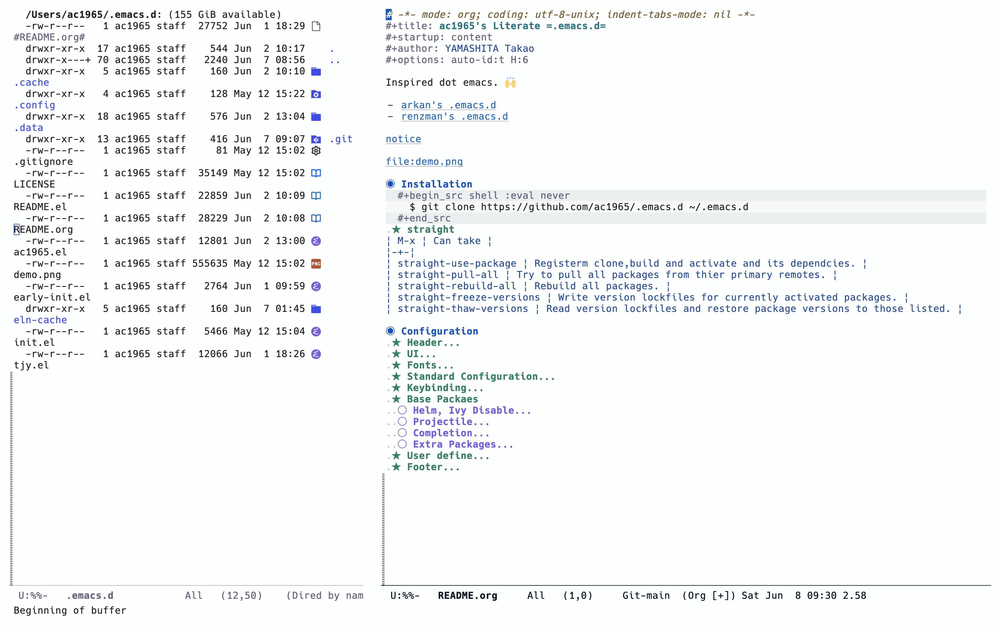

# -*- mode: org; coding: utf-8-unix; indent-tabs-mode: nil -*-
#+title: ac1965's =emacs=
#+startup: content
#+author: YAMASHITA Takao
#+options: auto-id:t H:6

Inspired dot emacs. :raised_hands:

- [[https://github.com/arkhan/emacs.d][arkan's .emacs.d]]
- [[https://github.com/renzmann/.emacs.d][renzman's .emacs.d]]

[[https://github.com/raxod502/straight.el#lockfile-management][notice]]

* Installation
  #+begin_src sh
    $ git clone https://github.com/ac1965/.emacs.d ~/.emacs.d
  #+end_src

* Configuration
** Header
   #+begin_src emacs-lisp
     ;;; README.el --- Emacs.d -*- lexical-binding: t; -*-

     ;; Copyright (C) 2014-2024 YAMASHITA Takao

     ;; Author: YAMASHITA Takao <tjy1965@gmail.com>
     ;; Keywords: emacs.d
     ;; $Lastupdate: 2024/02/18 13:20:50 $

     ;; This file is not part of GNU Emacs.

     ;; This program is free software; you can redistribute it and/or modify it under
     ;; the terms of the GNU General Public License as published by the Free Software
     ;; Foundation; either version 3 of the License, or (at your option) any later
     ;; version.

     ;; This program is distributed in the hope that it will be useful, but WITHOUT
     ;; ANY WARRANTY; without even the implied warranty of MERCHANTABILITY or FITNESS
     ;; FOR A PARTICULAR PURPOSE. See the GNU General Public License for more
     ;; details.

     ;; You should have received a copy of the GNU General Public License along with
     ;; GNU Emacs; see the file COPYING. If not, write to the Free Software
     ;; Foundation, Inc., 51 Franklin Street, Fifth Floor, Boston, MA 02110-1301,
     ;; USA.

     ;;; Commentary:

     ;;; License: GPLv3

     ;;; Code:

   #+end_src

** UI
   #+begin_src emacs-lisp
     (leaf UI
       :config
       ;; https://github.com/nex3/perspective-el
       (leaf *display-buffer-base-action
         :config
         (customize-set-variable
          'display-buffer-base-action
          '((display-buffer-reuse-window display-buffer-same-window)
            (reusable-frames . t)))
         (customize-set-variable 'even-window-sizes nil))

       ;; https://protesilaos.com
       (leaf ef-themes
         :straight t
         :config
         (load-theme 'ef-frost t))

       ;; modeline
       (leaf *modeline
         :config
         (leaf minions
           :straight t
           :config
           (minions-mode)
           (setq minions-mode-line-lighter "[+]"))
         (setq display-time-interval 1)
         (setq display-battery-mode t
               display-time-day-and-date t
               display-time-24hr-format t)
         (display-time-mode 1))

       ;; spacious-padding
       (leaf spacious-padding
         :straight t
         :config
         ;; These is the default value, but I keep it here for visiibility.
         (setq spacious-padding-widths
               '( :internal-border-width 15
                  :header-line-width 4
                  :mode-line-width 6
                  :tab-width 4
                  :right-divider-width 30
                  :scroll-bar-width 4))

         ;; Read the doc string of `spacious-padding-subtle-mode-line' as it
         ;; is very flexible and provides several examples.
         (setq spacious-padding-subtle-mode-line
               `( :mode-line-active 'default
                  :mode-line-inactive vertical-border))

         (spacious-padding-mode 1)

         ;; Set a key binding if you need to toggle spacious padding.
         (define-key global-map (kbd "<f7>") #'spacious-padding-mode))

       ;; golden-ratio
       (leaf golden-ratio
         :straight t
         :global-minor-mode t))
   #+end_src

** Fonts
|abcdef ghijkl|
|ABCDEF GHIJKL|
|'";:-+ =/\~`?|
|∞≤≥∏∑∫ ×±⊆⊇|
|αβγδεζ ηθικλμ|
|ΑΒΓΔΕΖ ΗΘΙΚΛΜ|
|日本語 の美観|
|あいう えおか|
|アイウ エオカ|
|ｱｲｳｴｵｶ ｷｸｹｺｻｼ|
#+TBLFM:

| hoge                 | hogeghoge | age               |
|----------------------+----------+-------------------|
| 今日もいい天気ですね | お、     | 等幅になった 👍 |

   #+begin_src emacs-lisp
     (leaf Fonts
       :config
       (setq conf:font-family "Hiragino Kaku Gothic Pro"
             conf:font-name "Hiragino Kaku Gothic Pro"
             conf:font-size 16
             inhibit-compacting-font-caches t)

       (defun fc-list ()
         "Generate a list of available fonts using fc-lis"
         (if (executable-find "fc-list")
             (split-string (shell-command-to-string "fc-list --format='%{family[0]}\n' | sort | uniq") "\n")
           (progn
             (warn "fc-list no disponible en $PATH")
             nil)))

       (defun font-exists-p (font)
         "Check if a font FONT
     exists.
                    Código parcialmente sacado de https://redd.it/1xe7vr"
         (let ((font-list (or (font-family-list) (fc-list))))
           (if (member font font-list)
               t
             nil)))

       (defun font-pt-to-height (pt)
         "Transforms a height in PT points to the height of `face-attribute '."
         ;; the value is 1 / 10pt, therefore 100 would be equivalent to 10pt, etc.
         (truncate (* pt 10)))

       (defun font-setup (&optional frame)
         (cond ((font-exists-p conf:font-name)
                (set-face-attribute 'default frame :height (font-pt-to-height conf:font-size) :font conf:font-name)
                (when (featurep 'nerd-icons)
                  (set-fontset-font t 'unicode (font-spec :family "nerd-icons") nil 'append)
                  (set-fontset-font t 'unicode (font-spec :family "file-icons") nil 'append)
                  (set-fontset-font t 'unicode (font-spec :family "Material Icons") nil 'append)
                  (set-fontset-font t 'unicode (font-spec :family "github-octicons") nil 'append)
                  (set-fontset-font t 'unicode (font-spec :family "FontAwesome") nil 'append)
                  (set-fontset-font t 'unicode (font-spec :family "Weather Icons") nil 'append)))))

       (defun font-setup-frame (frame)
         "set the font for each new FRAME frame created."
         (select-frame frame)
         (when (display-graphic-p)
           (font-setup frame)))

       ;; nerd-icons
       (leaf nerd-icons
         :straight t
         :require t)

       ;; nerd-icons-dired
       (leaf nerd-icons-dired
         :straight t
         :config
         (add-hook 'dired-mode-hook #'nerd-icons-dired-mode))

       (leaf *emoji
         :config
         (leaf emojify
           :straight t
           :hook (org-mode-hook . emojify-mode)))

       (if (daemonp)
           (add-hook 'after-make-frame-functions #'font-setup-frame)
         (font-setup)))
   #+end_src
** Standard Configuration
   #+begin_src emacs-lisp
     ;; Base Configuration

     (leaf StandardConfiguration
       :config
       (setq inhibit-startup-screen t
             use-dialog-box nil
             use-file-dialog nil
             initial-scratch-message nil
             large-file-warning-threshold (* 15 1024 1024))

       (setq use-short-answers t
             auto-save-default nil
             auto-save-list-file-prefix nil
             backup-inhibited t
             vc-follow-symlinks t
             create-lockfiles nil
             comment-style 'indent
             default-directory "~/"
             font-lock-support-mode 'jit-lock-mode
             frame-resize-pixelwise t
             major-mode 'text-mode
             make-backup-files nil
             ring-bell-function 'ignore
             confirm-kill-emacs 'y-or-n-p
             completion-cycle-threshold 3
             tab-always-indent 'complete)

       (setq-default indent-tabs-mode nil
                     tab-width 4
                     eshell-history-file-name (concat no-littering-var-directory "history")
                     url-configuration-directory (concat no-littering-var-directory "url/")
                     savehist-file (concat no-littering-var-directory "history")
                     frame-title-format (list (user-login-name) "@" (system-name) " %b [%m]"))

       (when (display-graphic-p)
         (when (fboundp 'menu-bar-mode)
           (menu-bar-mode 1))
         (when (fboundp 'tool-bar-mode)
           (tool-bar-mode -1))
         (when (fboundp 'scroll-bar-mode)
           (scroll-bar-mode -1))
         (set-frame-parameter nil 'fullscreen 'fullboth))

       (set-coding-system-priority 'utf-8)
       (when (member system-type '(darwin))
         (set-terminal-coding-system 'utf-8-unix)
         (set-keyboard-coding-system 'utf-8-unix)
         (setq-default default-process-coding-system '(utf-8 . utf-8))
         (setq-default buffer-file-coding-system 'utf-8-auto-unix
                       x-select-request-type '(UTF8_STRING COMPOUND_TEXT TEXT STRING)))

       ;; narrowing
       (put 'narrow-to-defun 'disabled nil)
       (put 'narrow-to-page 'disabled nil)
       (put 'narrow-to-region 'disabled nil)
       (put 'upcase-region 'disabled nil)
       (put 'set-goal-column 'disabled nil)

       (if (fboundp 'normal-erase-is-backspace-mode)
           (normal-erase-is-backspace-mode 0))

       (toggle-indicate-empty-lines)
       (delete-selection-mode)
       (blink-cursor-mode -1)
       (add-hook 'before-save-hook 'delete-trailing-whitespace)

       (set-default 'truncate-lines t)

       (line-number-mode +1)
       (column-number-mode +1)
       (custom-set-variables '(display-line-numbers-width-start t))

       (global-font-lock-mode +1)
       (global-prettify-symbols-mode)
       (electric-pair-mode t)
       (transient-mark-mode 1)

       (if (fboundp 'normal-erase-is-backspace-mode)
           (normal-erase-is-backspace-mode 0))

       (when (functionp 'mac-auto-ascii-mode)
         (mac-auto-ascii-mode 1))

       ;; editorconfig
       (leaf editorconfig)

       ;; visual-line-mode
       (leaf visual-line-mode
         :config
         (global-visual-line-mode t)
         (diminish 'visual-line-mode nil))

       ;; pbcopy (macOS)
       (leaf pbcopy
         :straight t
         :if (memq window-system '(mac ns)))

       ;; dired-filter
       (leaf dired-filter
         :doc "dired-filrter"
         :straight t)

       ;; delsel
       (leaf delsel
         :doc "delete selection if you insert"
         :tag "builtin"
         :global-minor-mode delete-selection-mode)

       ;; show-paren-mode
       (leaf paren
         :doc "highlight matching paren"
         :tag "builtin"
         :custom ((show-paren-delay . 0)
                  (show-paren-style . 'expression))
         :global-minor-mode show-paren-mode)

       (leaf simple
         :doc "basic editing commands for Emacs"
         :tag "builtin" "internal"
         :custom ((kill-ring-max . 100)
                  (kill-read-only-ok . t)
                  (kill-whole-line . t)
                  (eval-expression-print-length . nil)
                  (eval-expression-print-level . nil)))

       (leaf buffer-move
         :straight t
         :bind (("C-s-<up>" . buf-move-up)
                ("C-s-<down>" . buf-move-down)
                ("C-s-<left>" . buf-move-left)
                ("C-s-<right>" . buf-move-right)
                )
         )

       ;; switch windows
       (leaf switch-window
         :straight t
         :bind (("C-x o" . switch-window)
                ("C-x 1" . switch-window-then-maximize)
                ("C-x 2" . switch-window-then-split-below)
                ("C-x 3" . switch-window-then-split-right)
                ("C-x 0" . switch-window-then-delete)))

       ;; midnight
       (leaf midnight
         :custom
         ((clean-buffer-list-delay-general . 1))
         :hook
         (emacs-startup-hook . midnight-mode))

       ;; duplicate string no kill-ring
       (leaf *advices
         :config
         (defun my:no-kill-new-duplicate (yank)
           (setq kill-ring (delete yank kill-ring)))
         (advice-add 'kill-new :before #'my:no-kill-new-duplicate))

       ;; auto-save-buffers-enhanced
       (leaf auto-save-buffers-enhanced
         :straight t
         :bind
         ("s-b" . auto-save-buffers-enhanced-toggle-activity)
         :init
         (setq auto-save-buffers-enhanced-interval 1)
         (auto-save-buffers-enhanced t))

       ;; autorevert
       (leaf autorevert
         :custom
         ((auto-revert-interval . 0.1))
         :hook
         (emacs-startup-hook . global-auto-revert-mode))

       ;; abbrev
       (leaf abbrev
         :diminish abbrev-mode
         :pre-setq `((abbrev-file-name . ,(concat no-littering-var-directory "abbrev.el"))
                     (save-abbrevs . 'silently)
                     (default-abbrev-mode . t)
                     (save-abbrevs . t))
         :config
         (unless (file-exists-p abbrev-file-name)
           (with-temp-buffer
             (write-file abbrev-file-name)))
         (when (file-exists-p abbrev-file-name)
           ``  (quietly-read-abbrev-file))

         (abbrev-mode t))

       ;; recentf
       (leaf recentf
         :pre-setq `((recentf-save-file . ,(concat no-littering-var-directory "recentf"))
                     (recentf-exclude . '("\\.?cache" ".cask" "url" "COMMIT_EDITMSG\\'" "bookmarks"
                                          "\\.\\(?:gz\\|gif\\|svg\\|png\\|jpe?g\\|bmp\\|xpm\\)$"
                                          "^/tmp/" "^/ssh:" "^/sudo:" "^/scp:"
                                          "^/scpx:" "^/media/data/org/"
                                          "~/.emacs.d/.cache/"))
                     (recentf-max-saved-items . 10)
                     (recentf-max-menu-items . 10)
                     (recentf-keep . '(file-remote-p file-readable-p))
                     (recentf-auto-cleanup . 'never))
         :config (recentf-mode +1))

       ;; saveplace
       (leaf saveplace
         :pre-setq `(save-place-file . ,(concat no-littering-var-directory "saveplace.el"))
         :setq-default (save-place . t)
         :init (save-place-mode))

       ;; semantic
       (leaf semantic
         :leaf-defer nil
         :setq `(semanticdb-default-save-directory . ,(concat no-littering-var-directory "semanticdb/"))
         :init
         (add-to-list 'semantic-default-submodes
                      'global-semantic-idle-summary-mode)
         (semantic-mode 1))

       ;; tramp
       (leaf tramp
         :pre-setq `((tramp-persistency-file-name . ,(concat no-littering-var-directory "tramp"))
                     (tramp-auto-save-directory . ,(concat no-littering-var-directory "tramp-autosave")))
         :setq ((tramp-default-method . "scp")
                (tramp-encoding-shell . "/bin/bash")
                (tramp-debug-buffer . t)
                (tramp-verbose . 10)
                (tramp-shell-prompt-pattern . "\\(?:^\\|\r\\)[^]#$%>\n]*#?[]#$%>] *\\(^[\\[[0-9;]*[a-zA-Z] *\\)*")
                (tramp-use-ssh-controlmaster-options . nil)
                (tramp-password-prompt-regexp . '(concat
                                                  "^.*"
                                                  (regexp-opt
                                                   '("passphrase" "Passphrase"
                                                     "password" "Password"
                                                     "Verification code")
                                                   t)
                                                  ".*:\0? *"))))

       ;; server
       (leaf server
         :require t
         :config
         (unless (server-running-p)
           (server-start)))

       ;; expand-region
       (leaf expand-region
         :straight t
         :bind (("C-=" . er/expand-region)))

       ;; aggressive-indent
       (leaf aggressive-indent
         :straight t
         :global-minor-mode global-aggressive-indent-mode)

       ;; rg
       (leaf rg
         :straight t)

       ;; dumb-jump
       (leaf dumb-jump
         :straight t
         :after rg
         :custom ((dumb-jump-force-searcher . 'rg))
         :hook ((xref-backend-functions . dumb-jump-xref-activate)))

       ;; multiple-cursors
       (leaf multiple-cursors
         :straight t
         :bind (("C-S-c C-S-c" . mc/edit-lines)
                ("C->" . mc/mark-next-like-this)
                ("C-<" . mc/mark-previous-like-this)
                ("C-c C-<" . mc/mark-all-like-this)))

       ;; neotree
       (leaf neotree
         :straight t
         :bind (("<f8>" . neotree-toggle)))

       ;; tree-sitter
       (leaf tree-sitter
         :straight (tree-sitter :type git :host github :repo "emacs-tree-sitter/elisp-tree-sitter" :branch "master")
         :config
         (leaf tree-sitter-lang
           :straight (tree-sitter-langs :type git :host github :repo "emacs-tree-sitter/tree-sitter-langs" :branch "master"))
         (global-tree-sitter-mode)
         (add-hook 'tree-sitter-after-on-hook #'tree-sitter-hl-mode)
         ;;
         (tree-sitter-require 'tsx)
         (add-to-list 'tree-sitter-major-mode-language-alist '(typescript-tsx-mode . tsx))
         ;; add hi
         (tree-sitter-hl-add-patterns 'tsx
           [
            ;; styled.div``
            (call_expression
             function: (member_expression
                        object: (identifier) @function.call
                        (.eq? @function.call "styled"))
             arguments: ((template_string) @property.definition
                         (.offset! @property.definition 0 1 0 -1)))
            ;; styled(Component)``
            (call_expression
             function: (call_expression
                        function: (identifier) @function.call
                        (.eq? @function.call "styled"))
             arguments: ((template_string) @property.definition
                         (.offset! @property.definition 0 1 0 -1)))
            ])
         ))

     ;; tools
     (defun  toggle-linum-lines () ;; ("C-c l"    . toggle-linum-lines)
       "toggle display line number"
       (interactive)
       (display-line-numbers-mode
        (if display-line-numbers-mode -1 1)))

     (defun toggle-window-split () ;;("s-."      . toggle-window-split)
       (interactive)
       (if (= (count-windows) 2)
           (let* ((this-win-buffer (window-buffer))
                  (next-win-buffer (window-buffer (next-window)))
                  (this-win-edges (window-edges (selected-window)))
                  (next-win-edges (window-edges (next-window)))
                  (this-win-2nd
                   (not (and (<= (car this-win-edges)
                                 (car next-win-edges))
                             (<= (cadr this-win-edges)
                                 (cadr next-win-edges)))))
                  (splitter
                   (if (= (car this-win-edges)
                          (car (window-edges (next-window))))
                       'split-window-horizontally
                     'split-window-vertically)))
             (delete-other-windows)
             (let ((first-win (selected-window)))
               (funcall splitter)
               (if this-win-2nd (other-window 1))
               (set-window-buffer (selected-window) this-win-buffer)
               (set-window-buffer (next-window) next-win-buffer)
               (select-window first-win)
               (if this-win-2nd (other-window 1))))))

     (defun dired-view-file-other-window () ;; add-hook 'dired-load-hook
       (interactive)
       (let ((file (dired-get-file-for-visit)))
         (if (file-directory-p file)
             (or (and (cdr dired-subdir-alist)
                      (dired-goto-subdir file))
                 (dired file))
           (view-file-other-window file))))
   #+end_src
** Keybinding
   https://caiorss.github.io/Emacs-Elisp-Programming/Keybindings.html
   #+begin_src emacs-lisp
     (leaf KeyBinding
       :config
       (leaf-keys (("C-h"      . backward-delete-char)
                   ("C-?"      . help)
                   ("C-/"      . undo)
                   ("C-c ;"    . comment-region)
                   ("C-c :"    . uncomment-region)
                   ("C-c o"    . find-file)
                   ("C-c k"    . kill-buffer-and-window)
                   ("C-c r"    . replace-string)
                   ("C-c l"    . toggle-linum-lines)
                   ("C-c v g"  . magit-status)
                   ("C-c M-r"  . replace-regexp)
                   ("C-c M-a"  . align-regexp)
                   ("s-n"      . find-file-other-frame)
                   ("s-m"      . make-frame)
                   ("C-."      . other-window)
                   ("s-."      . toggle-window-split)
                   ("s-j"      . find-file-other-window)
                   ("C-+"      . text-scale-increase)
                   ("C--"      . text-scale-decrease)
                   ("C-q"      . kill-emacs)
                   ("C-c c"    . org-capture)
                   ("M-q"      . save-buffers-kill-emacs)
                   ("C-s-<up>"   . scroll-down-command)
                   ("C-s-<down>" . scroll-up-command)
                   ("s-<up>"   . beginning-of-buffer)
                   ("s-<down>" . end-of-buffer)
                   ("s-<left>" . centaur-tabs-backward)
                   ("s-<right>" . centaur-tabs-forward)
                   ("s-<wheel-up>" . scroll-other-window)
                   ("s-<wheel-down>" . scroll-other-window-down)
                   ))

       ;; which-key
       (leaf which-key
         :straight t
         :global-minor-mode t
         :config
         (which-key-setup-side-window-right)
         (ffap-bindings))

       (global-unset-key (kbd "C-s"))

       (add-hook 'dired-mode-hook (lambda ()
                                    (define-key dired-mode-map "z"
                                                'dired-view-file-other-window))))
   #+end_src
** Base Packaes
*** Helm, Ivy Disable
   #+begin_src emacs-lisp
     (leaf helm :defer-config (helm-mode -1))
     (leaf ivy :defer-config (ivy-mode -1))
   #+end_src

*** Projectile
   #+begin_src emacs-lisp
     (leaf projectile
       :straight t
       :config
       (projectile-mode +1)
       (define-key projectile-mode-map (kbd "C-c p") 'projectile-command-map)
       (setq projectile-switch-project-action #'projectile-vc))
   #+end_src

*** Completion
Vertico with orderless and marginali
- [[https://github.com/minad/vertico][https://github.com/minad/vertico]]
- [[https://github.com/oantolin/orderless][https://github.com/oantolin/orderless]]
- [[https://github.com/minad/marginalia][https://github.com/minad/marginalia]]
#+begin_src emacs-lisp
  (leaf Completion
    :config
    ;; corfu
    (leaf corfu
      :straight t
      :init
      (setq completion-cycle-threshold 3)
      (setq tab-always-indent 'complete)
      :global-minor-mode (global-corfu-mode))

    ;; vertio
    (leaf vertico
      :straight (vertico :files (:defaults "extensions/*")
                         :includes (vertico-directory)
                         )
      :init
      (vertico-mode)
      (setq vertico-count 15)
      :config
      ;; vertico-directory
      (leaf vertico-directory
        :straight t
        :config
        (define-key vertico-map (kbd "C-l") #'vertico-directory-up)
        (define-key vertico-map "RET" #'vertico-directory-enter)  ;; enter dired
        (define-key vertico-map "DEL" #'vertico-directory-delete-char)
        (define-key vertico-map "M-DEL" #'vertico-directory-delete-word)
        :hook
        (rfn-eshadow-update-overlay-hook . vertico-directory-tidy)))

    ;; orderless
    (leaf orderless
      :straight t
      :init
      (setq completion-styles '(orderless)
            completion-category-defaults nil
            completion-category-overrides '((file (styles partial-completion)))))

    ;; marginalia
    (leaf marginalia
      :straight t
      :global-minor-mode marginalia-mode
      :after vertico
      :custom
      (marginalia-annotators '(marginalia-annotators-heavy marginalia-annotators-light nil))
      :init
      (define-key minibuffer-local-map (kbd "C-M-a") #'marginalia-cycle))

    ;; nerd-icons-completion
    (leaf nerd-icons-completion
      :straight t
      :config
      (nerd-icons-completion-marginalia-setup)
      (nerd-icons-completion-mode 1))

    ;; nerd-icons-corfu
    (leaf nerd-icons-corfu
      :straight t
      :config
      (add-to-list 'corfu-margin-formatters #'nerd-icons-corfu-formatter))

    ;; cape
    (leaf cape
      :straight t
      :config
      (add-to-list 'completion-at-point-functions #'cape-file)
      (add-to-list 'completion-at-point-functions #'cape-tex)
      ;; (add-to-list 'completion-at-point-functions #'cape-dabbrev)
      (add-to-list 'completion-at-point-functions #'cape-keyword)
      (add-to-list 'completion-at-point-functions #'cape-abbrev)
      (add-to-list 'completion-at-point-functions #'cape-ispell)
      (add-to-list 'completion-at-point-functions #'cape-symbol)
      ;; Silence the pcomplete capf, no errors or messages!
      (advice-add 'pcomplete-completions-at-point :around #'cape-wrap-silent)
      ;; Ensure that pcomplete does not write to the buffer
      ;; and behaves as a pure `completion-at-point-function'.
      (advice-add 'pcomplete-completions-at-point :around #'cape-wrap-purify))

    ;; kind-icon
    (leaf kind-icon
      :straight t
      :config
      (setq kind-icon-default-face 'corfu-default)
      (add-to-list 'corfu-margin-formatters #'kind-icon-margin-formatter))

    ;; embark
    (leaf embark
      :straight t
      :bind
      (("M-." . embark-act)
       ("C-` d" . embark-dwim)
       ("C-` b" . embark-bindings)
       )
      :init
      (setq prefix-help-command #'embark-prefix-help-command)
      :config
      (add-to-list 'display-buffer-alist
                   '("\\`\\*Embark Collect \\(Live\\|Completions\\)\\*"
                     nil
                     (window-parameters (mode-line-format . none))))
      (leaf embark-consult
        :straight t
        :hook
        (embark-collect-mode . consult-preview-at-point-mode)))

    ;; affe
    (leaf affe
      :straight t
      :after consult
      :config
      (consult-customize affe-grep :preview-key (kbd "M-."))
      (defvar affe-orderless-regexp "")
      (defun affe-orderless-regexp-compiler (input _type)
        (setq affe-orderless-regexp (orderless-pattern-compiler input))
        (cons affe-orderless-regexp
              (lambda (str) (orderless--highlight affe-orderless-regexp str))))
      (setq affe-regexp-compiler #'affe-orderless-regexp-compiler))

    ;; consult
    (leaf consult
      :straight t
      :init
      (setq consult-goto-line-numbers nil)
      :bind
      (("C-s l" . consult-line)
       ("C-s L" . consult-line-multi)
       ("C-c b" . consult-buffer)
       ("C-c i" . consult-imenu)
       ("C-c I" . consult-imenu-multi)
       ("C-c r" . consult-recent-file)
       ("C-c g" . consult-goto-line)
       ("M-g o" . consult-outline)
       ))

    (leaf init_hook
      :preface
      (defun after-init-hook nil
        (vertico-mode)
        (marginalia-mode)
        (savehist-mode))
      :hook ((after-init-hook . after-init-hook)))

    )
   #+end_src

*** Extra Packages
  #+begin_src emacs-lisp
    ;; magit
    (leaf magit
      :straight t
      :bind (("C-x g" . magit-status)
             ("C-x M-g" . magit-dispatch-popup))
      :config
      (defun mu-magit-kill-buffers ()
        "Restore window configuration and kill all Magit buffers."
        (interactive)
        (let ((buffers (magit-mode-get-buffers)))
          (magit-restore-window-configuration)
          (mapc #'kill-buffer buffers)))
      (bind-key "q" #'mu-magit-kill-buffers magit-status-mode-map))

    ;; markdown-mode
    (leaf markdown-mode
      :straight t)

    ;; yasnippet
    (leaf yasnippet
      :straight t
      :config
      (yas-global-mode 1))
  #+end_src
** User define
  #+begin_src emacs-lisp
    
    (setq user-specific-config (concat my:d user-login-name ".el"))
    (if (file-exists-p user-specific-config) (load user-specific-config))
    (if (file-exists-p custom-file) (load custom-file))
  #+end_src
** Footer
  #+begin_src emacs-lisp
    (provide 'README)

    ;;; README.el ends here
  #+end_src
i
