# -*- mode: org; coding: utf-8; -*-
#+TITLE: Modern Emacs Configuration — 設計ドキュメント
#+AUTHOR: YAMASHITA, Takao
#+EMAIL: tjy1965@gmail.com
#+LANGUAGE: ja
#+OPTIONS: toc:3 num:t ^:nil
#+STARTUP: overview
#+PROPERTY: header-args :results silent :exports code :mkdirp yes :padline no :tangle no
#+PROPERTY: header-args:dot :exports results :results file :mkdirp yes

* 概要

このドキュメントは =emacs_design_deep_v3.pptx= の内容を Org 形式にまとめたものです。
図はすべて =svg/= ディレクトリに Graphviz =dot= 言語から生成した SVG として保存してあります。
Emacs の =ob-dot= があれば =C-c C-c= で再生成できます。

#+begin_example
emacs-design-doc/
├── design.org
└── svg/
    ├── 01_boot_flow.svg
    ├── 02_condition_case.svg
    ├── 03_session_facade.svg
    ├── 04_gc_strategy.svg
    ├── 05_autosave_flow.svg
    ├── 06_auth_resolution.svg
    ├── 07_capf_dispatch.svg
    ├── 08_lsp_agnostic.svg
    ├── 09_utils_claude.svg
    ├── 10_orgtangle_hugo.svg
    ├── 11_leader_keymap.svg
    └── 12_dev_ai_timing.svg
#+end_example

* 起動シーケンス

** 3フェーズの全体像

Emacs の起動は内部的に 3 段階に分かれています。

- *Phase 1 (early-init.el)* — フレームが描画される前の最初期処理。
  =package.el= を無効化して、ディレクトリを準備して、GC を一時的に緩めます。
- *Phase 2 (init.el)* — =straight.el= と =leaf= をブートストラップして、
  モジュールシステムを起動する手前の準備をします。
- *Phase 3 (modules.el)* — 75 本のモジュールを決められた順番でロードします。
  1 本失敗しても残りは続きます。

** early-init.el の 10 セクション

| セクション | 内容 | コード例 |
|------------+------+---------|
| §1 | =package.el= 無効化 | =(setq package-enable-at-startup nil)= |
| §2–3 | ベースディレクトリ + straight ベース | =my:d / .cache/build-31.0= |
| §4–5 | macOS Homebrew + native-comp | =HOMEBREW_PREFIX= 探索, =eln-load-path= |
| §6–7 | =no-littering= 互換変数の事前設定 | =no-littering-var-directory= |
| §8 | GC ガード | =file-name-handler-alist= を nil に退避 |
| §9 | バックアップポリシー | =version-control t=, =kept-new-versions 6= |
| §10 | 早期 UI | =default-frame-alist= でツールバーオフ |

** init.el の 10 ステップ

| ステップ | 内容 | 注意点 |
|----------+------+--------|
| §1–2 | URL パス設定 + straight ブートストラップ | 初回のみネットワークアクセス |
| §3–4 | =leaf= + Org ブートストラップ | =leaf-keywords-init= 必須 |
| §5 | macOS 環境変数取得 | ='("-l")= のみ。=PATH= と =LANG= だけ取得 |
| §6–7 | パフォーマンス + GCMH | =read-process-output-max= 4MiB |
| §8 | 組み込みポリシー | =use-short-answers=, =C-z= アンバインド |
| §9 | パーソナルオーバーレイ | =user.el= + =ac1965.el= をロード |
| §10 | モジュール起動 | =(require 'modules nil t)= |

* modules.el — Delete-Safety の実装

=modules.el= は設定システムの司令塔です。
一番大事なのは「1 本壊れても全体が止まらない」という delete-safety の保証で、
その核心が =condition-case= による各モジュールの隔離です。

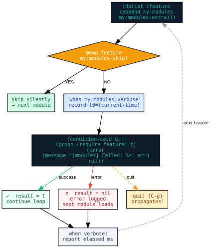

- =error= だけを捕まえます。=quit= (=C-g=) は意図的に伝播させます。
  ユーザーが中断したいときは中断できるようにしておく必要があるので。
- =my:modules-verbose= が非 nil なら各モジュールのロード時間をミリ秒単位で表示します。
- =my:modules-skip= にシンボルを入れておくと、そのモジュールを静かにスキップできます。
  たとえば =dev-docker= を使わないデバイスでは省略できます。
- =my:modules-extra= は =personal/user.el= が追記します。正規リストの後ろに追加されます。

#+begin_src emacs-lisp
;; modules.el の核心部分
(dolist (feature (append my:modules my:modules-extra))
  (unless (memq feature my:modules-skip)
    (let ((t0 (current-time)))
      (condition-case err
          (progn (require feature) t)
        (error
         (message "[modules] Failed to load %s: %s"
                  feature (error-message-string err))
         nil))
      (when my:modules-verbose
        (message "%-24s %s"
                 feature
                 (modules--format-seconds
                  (float-time (time-subtract (current-time) t0))))))))
#+end_src

* core-session — Facade パターンと Dual-Timer スケジューラ

セッションのバックグラウンドジョブ管理には Facade パターンを使っています。
外部モジュールは =core-session.el= (公開 API) だけを =require= して、
実装の詳細は =core-session-private.el= に完全に隠蔽されています。

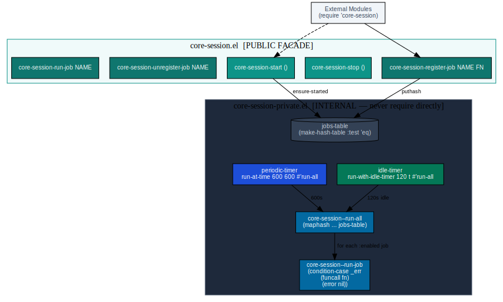

** 2 チャンネルタイマー設計

| タイマー | 実装 | 周期 | 用途 |
|----------+------+------+------|
| 定期タイマー | =(run-at-time 600 600 ...)= | 600 秒ごと | セッション定期メンテ |
| アイドルタイマー | =(run-with-idle-timer 120 t ...)= | 120 秒アイドル後 | バックグラウンド処理 |

ジョブは =make-hash-table :test 'eq= で管理されています。
=maphash= を使って走査するので、中間リストのアロケーションが不要です。

#+begin_src emacs-lisp
;; core-session-private.el より
(defun core-session--run-all ()
  "全ての有効ジョブを実行する。maphash で走査し中間リストを作らない。"
  (maphash (lambda (_name meta)
             (when (plist-get meta :enabled)
               (condition-case _err
                   (funcall (plist-get meta :fn))
                 (error nil))))
           core-session--jobs-table))
#+end_src

* GC Strategy — 3 層の協調設計

GC 管理は 3 つのモジュールが役割を分担しています。

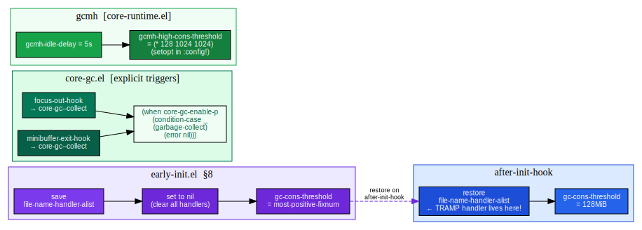

| 層 | ファイル | タイミング | 内容 |
|----+----------+------------+------|
| 起動ガード | =early-init.el §8= | 起動時 | =file-name-handler-alist= を nil に退避。=after-init-hook= で復元 |
| 明示トリガー | =core-gc.el= | フォーカス喪失 / ミニバッファ終了 | =garbage-collect= を =condition-case= で安全に実行 |
| アイドル管理 | =gcmh= (=core-runtime.el=) | アイドル 5 秒後 | 128MiB 閾値。=leaf :custom= では式評価不可なので =:config= で =setopt= |

#+begin_quote
*落とし穴:* =gcmh-high-cons-threshold= に =(* 128 1024 1024)= を渡すとき、
=leaf :custom= に書くと式がリテラルとして格納されてしまいます。
=:config= 内で =(setopt gcmh-high-cons-threshold (* 128 1024 1024))= と書くのが正解です。
#+end_quote

* Auto-Save Subsystem — Fix CH/CI で整備した保存サブシステム

=core-editing.el= の自動保存サブシステムは 3 つのトリガーと 4 段階の除外判定で構成されています。

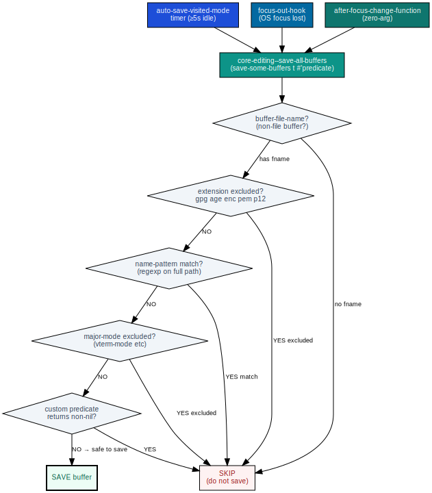

** 保存トリガー

| トリガー | 仕組み |
|----------+--------|
| アイドル ≥5 秒 | =auto-save-visited-mode= のタイマー。=core-autosave-interval= (defcustom, デフォルト 5) で調整 |
| OS フォーカス喪失 | =focus-out-hook= → =core-editing--save-on-focus-out= |
| フォーカス変更後 | =after-focus-change-function= (ゼロ引数規約) |

** 除外 defcustom 変数

| 変数名 | デフォルト | 説明 |
|--------+------------+------|
| =core-autosave-exclude-extensions= | ="gpg" "age" "enc" "pem"...= | 拡張子で除外 |
| =core-autosave-exclude-name-patterns= | =nil= | フルパスに対する正規表現リスト |
| =core-autosave-exclude-modes= | =nil= | 除外するメジャーモード一覧 |
| =core-autosave-exclude-predicates= | =nil= | =(buf) → bool= な関数リスト |

いずれも =personal/user.el= で =setopt= を使って上書きできます。

* auth Layer — 認証情報の解決フロー

認証まわりは 3 つのモジュールが連携します。
特に aidermacs の API キー取得は =after-init-hook= の発火順序に依存する繊細な設計です。

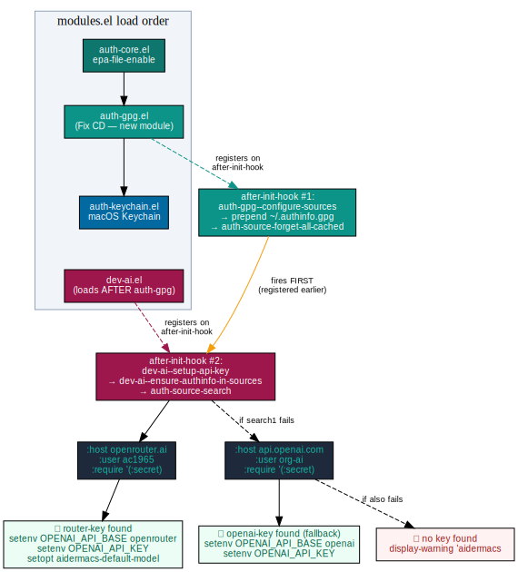

** ~/.authinfo.gpg に必要なエントリ

#+begin_example
# Anthropic Claude API (utils-claude.el 用)
machine api.anthropic.com login apikey password sk-ant-...

# OpenRouter (aidermacs 優先バックエンド)
machine openrouter.ai login ac1965 password sk-or-...

# OpenAI (aidermacs フォールバック)
machine api.openai.com login org-ai password sk-proj-...
#+end_example

=login= フィールドは =:user= 引数に完全一致しないと =auth-source-search= が何も返しません。
Fix CF で発覚したハマりどころです。

** after-init-hook の発火順序

=auth-gpg= が =dev-ai= よりも =modules.el= で先にロードされることを利用しています。

#+begin_example
auth-gpg ロード → after-init-hook に configure-sources を登録
dev-ai   ロード → after-init-hook に setup-api-key を登録
  ↓ after-init-hook 発火
  #1: auth-gpg--configure-sources → ~/.authinfo.gpg を auth-sources 先頭に追加
  #2: dev-ai--setup-api-key → auth-source-search が成功 ✓
#+end_example

=dev-ai= の =:init= で検索していた旧実装ではこの順序が保証できず、
常に "no key found" になっていました (Fix CF-2)。

* completion Layer — CAPF スタックと Org SRC ブロック補完

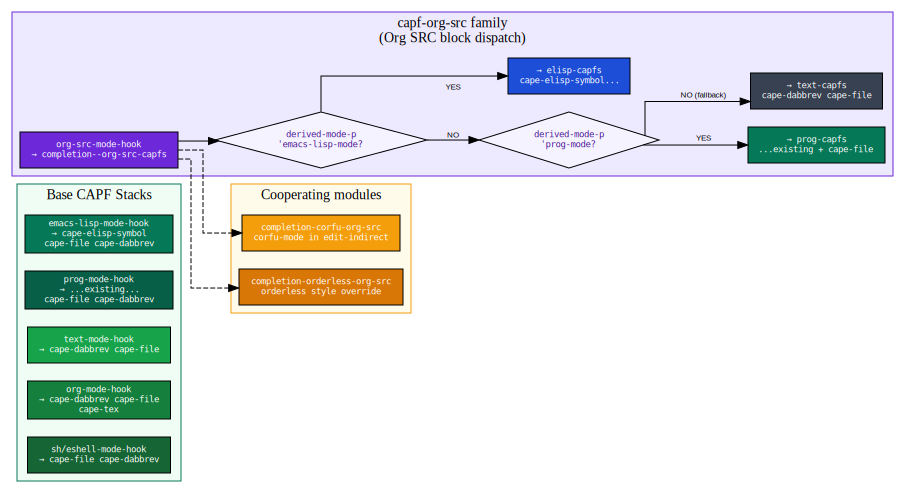

** ベース CAPF スタック

| フック | 関数 | CAPF スタック |
|--------+------+--------------|
| =emacs-lisp-mode-hook= | =completion--elisp-capfs= | =cape-elisp-symbol cape-file cape-dabbrev= |
| =prog-mode-hook= | =completion--prog-capfs= | 既存スタック + =cape-file cape-dabbrev= |
| =text-mode-hook= | =completion--text-capfs= | =cape-dabbrev cape-file= |
| =org-mode-hook= | =completion--org-capfs= | =cape-dabbrev cape-file cape-tex= |
| =sh-mode / eshell= | =completion--shell-capfs= | =cape-file cape-dabbrev= |

** capf-org-src ファミリー (4 モジュール協調)

Org の =#+begin_src= ブロック内で言語固有の補完が効くのは、このファミリーのおかげです。

| モジュール | 役割 |
|------------+------|
| =completion-capf-org-src= | =org-src-mode-hook= でモードを見てディスパッチ |
| =completion-capf-org-src-lang= | 言語別 CAPF 設定リスト |
| =completion-corfu-org-src= | =edit-indirect= バッファで =corfu-mode= 有効化 |
| =completion-orderless-org-src= | Org src ブロックのみ =orderless= スタイル適用 |

* dev Layer — LSP バックエンド非依存設計

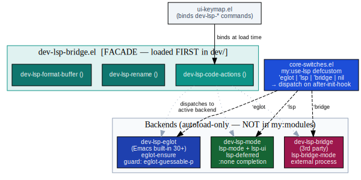

=dev-lsp-bridge.el= を =dev/= セクションの先頭に置くことで、
=ui-keymap.el= がバックエンドを知らなくても =dev-lsp-code-actions= などにキーをバインドできます。

** autoload-only モジュール

これらは =my:modules= に含まれません。=core-switches.el= 経由で遅延ロードされます。

| モジュール | 宣言先 | トリガー |
|------------+--------+---------|
| =dev-lsp-eglot= | =core-switches= | =(my:use-lsp 'eglot)= |
| =dev-lsp-mode= | =core-switches= | =(my:use-lsp 'lsp)= |
| =dev-lsp-bridge= (3rd party) | =core-switches= | =(my:use-lsp 'bridge)= |
| =ui-doom-modeline= | =core-switches= | =(my:use-ui 'doom)= |
| =ui-nano-modeline= | =core-switches= | =(my:use-ui 'nano)= |
| =ui-nano-palette= | =ui-theme= | =(require 'ui-nano-palette nil t)= |

* utils-claude.el — Claude API HTTP クライアント

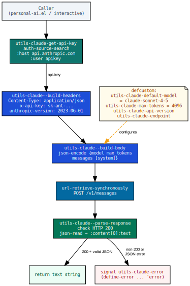

** 公開 API

#+begin_src emacs-lisp
;; 同期リクエスト
(utils-claude-request-sync MESSAGES &optional MODEL MAX-TOKENS SYSTEM)
;; → 応答テキスト文字列を返す。失敗時は utils-claude-error をシグナル。

;; 非同期リクエスト
(utils-claude-request MESSAGES CALLBACK &optional MODEL MAX-TOKENS SYSTEM)
;; → CALLBACK は (text) または (nil err) で呼ばれる。
#+end_src

** defcustom 変数

| 変数 | デフォルト値 |
|------+-------------|
| =utils-claude-default-model= | ="claude-sonnet-4-5"= |
| =utils-claude-max-tokens= | =4096= |
| =utils-claude-api-version= | ="2023-06-01"= |
| =utils-claude-endpoint= | =https://api.anthropic.com/v1/messages= |

エラーは =(define-error 'utils-claude-error ...)= で定義した独自条件です。
呼び出し側は =(condition-case err ... (utils-claude-error ...))= でラップしてください。

* orgx Layer — Auto-Tangle & Auto-Hugo

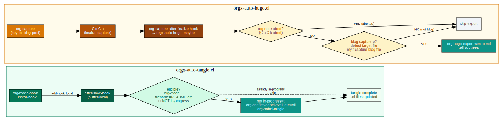

** orgx-auto-tangle

=after-save-hook= をバッファローカルに登録しているので =README.org= 以外には影響しません。
再帰ループ防止のため =orgx-auto-tangle--in-progress= をバッファローカルフラグとして使っています。

#+begin_src emacs-lisp
(defvar-local orgx-auto-tangle--in-progress nil)

(defun orgx-auto-tangle--maybe ()
  (when (and (orgx-auto-tangle--eligible-p)
             (not orgx-auto-tangle--in-progress))
    (let ((orgx-auto-tangle--in-progress t)
          (org-confirm-babel-evaluate nil)
          (inhibit-modification-hooks t))
      (condition-case err
          (org-babel-tangle)
        (error (message "[auto-tangle] %s" err))))))
#+end_src

** orgx-auto-hugo

=after-save-hook= ではなく =org-capture-after-finalize-hook= を使っています。
キャプチャ編集中の自動保存で ox-hugo がトリガーされると未完成エントリがエクスポートされてしまうためです。
=org-note-abort= が非 nil なら (=C-c C-k= でキャンセルされた場合) エクスポートをスキップします。

* ui-leader.el — M-SPC リーダーキー階層

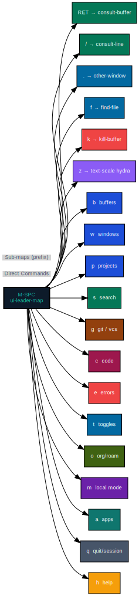

=M-SPC= を起点に 13 個のサブマップが並んでいます。
元が =C-c SPC= (3 キー) だったのを =M-SPC= (2 キー) に変更して、
全リーダーコマンドのキーストロークを 1 つ短縮しています。

キーマップの定義はロード時に即座に実行されます。=after-init-hook= には遅延させません。
=ui-keymap.el= がロードされる前にマップが確定している必要があるためです。

* dev-ai.el — aidermacs の認証タイミング修正 (Fix CF)

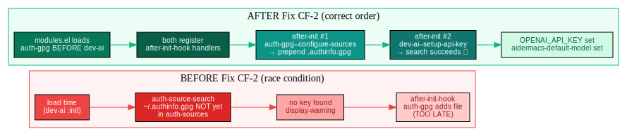

** 修正前後のサマリー

| | Before Fix CF-2 | After Fix CF-2 |
|---+-----------------+----------------|
| いつ検索するか | =:init= (モジュールロード時) | =after-init-hook= |
| =~/.authinfo.gpg= の状態 | まだ =auth-sources= に未追加 | =auth-gpg= が先に追加済み |
| 結果 | 常に "no key found" | 鍵取得成功 |

** dev-ai--setup-api-key の cond ロジック

#+begin_src emacs-lisp
(cond
 ;; 優先: OpenRouter
 (router-key
  (setenv "OPENAI_API_BASE" "https://openrouter.ai/api/v1")
  (setenv "OPENAI_API_KEY"  router-key)
  (setopt aidermacs-default-model "openrouter/anthropic/claude-sonnet-4-5"))
 ;; フォールバック: OpenAI 直接
 (openai-key
  (setenv "OPENAI_API_BASE" "https://api.openai.com/v1")
  (setenv "OPENAI_API_KEY"  openai-key)
  (setopt aidermacs-default-model "gpt-4o-mini"))
 ;; どちらも見つからない場合
 (t
  (display-warning 'aidermacs "No API key found in auth-source.")))
#+end_src

* 命名規則と変数代入ポリシー

** 命名規則

| プレフィックス | スコープ | 例 |
|----------------+----------+----|
| =my/= | 公開インタラクティブコマンド | =my/eww-search=, =my/auth-gpg-verify= |
| =<module>-= | モジュール公開 API | =core-treesit-install-all=, =ui-font-apply= |
| =<module>--= | モジュール内部実装 | =core-native--collect=, =modules--require-safe= |
| =my:d:*= | パス / ディレクトリ変数 | =my:d=, =my:d:var=, =my:d:org= |
| =my:modules= | 正規リスト定数 | =defconst= で定義。変更禁止 |

禁止パターン: =my/<topic>--= の複合形。公開名前空間 (=my/=) とプライベートスコープ (=--=) を混ぜてはいけません。

** setopt vs setq

| 使うべき形 | 対象 | 補足 |
|------------+------+------|
| =setopt= | =defcustom= 変数 | セッターと型チェックを通す |
| =setq= | =defvar=, 内部状態変数 | セッターが不要な場合 |
| =setopt= (=:config= 内) | 実行時評価が必要な =defcustom= パス | =:custom= では式評価不可 |
| =setq-local= | バッファローカルな =defcustom= 上書き | Makefile の =indent-tabs-mode= など |
| =customize-save-variable= | セッションをまたいで永続化が必要な =defcustom= | =personal-messages-last-archived= など |

=setq= が正解な =defcustom= 例外:
=org-agenda-files=, =org-capture-templates=, =org-todo-keywords=, =org-refile-targets=, =org-roam-db-connector=。
バッククォートや実行時評価が =setopt= の型チェッカーと相性が悪いためです。

* Coding Rules R1–R8

** R1 — lexical-binding

全ファイルの 1 行目に =;; -*- lexical-binding: t; -*-= を必ず書きます。
ないとラムダが動的スコープで動いてクロージャのバグが出ます。

** R2 — =provide= シンボルとファイル名の一致

#+begin_src emacs-lisp
;;; core-treesit.el
(provide 'core-treesit)  ; ファイル名と一致させる
#+end_src

** R3 — 組み込みパッケージに =:straight nil=

#+begin_src emacs-lisp
(leaf saveplace :straight nil
  :pre-setq
  `((save-place-file . ,(concat no-littering-var-directory "saveplace"))))
#+end_src

** R4 — =leaf= キーワード順序

#+begin_example
:straight → :ensure → :after → :require →
:pre-setq → :custom → :bind → :hook → :init → :config
#+end_example

** R5 — 公開 =defun= のドキュメント文字列

Fix W で 19 モジュール、50 関数に追記しました。インタラクティブコマンドは必ずドキュメントを書きます。

** R6 — =setopt= / =setq=

上の「命名規則と変数代入ポリシー」セクション参照。

** R7 — 命名規則

上の「命名規則と変数代入ポリシー」セクション参照。

** R8 — =keymap-set= API (Emacs 29+)

#+begin_src emacs-lisp
;; ✓ 正しい書き方
(keymap-global-set "C-s" #'consult-line)
(keymap-set dired-mode-map "TAB" #'dirvish-subtree-toggle)

;; ✗ 古い書き方 (Fix CA/CB で移行済み)
(global-set-key (kbd "C-s") 'consult-line)
#+end_src

* Changelog Fix A→CJ — カテゴリ別サマリー

| カテゴリ | 重大度 | 件数 | 代表 Fix | 根本原因 |
|----------+--------+------+----------+---------|
| =setq= → =setopt= | 🟡 Minor | 32 | G H K M P Q R S T U V | =defcustom= のセッター・型検証バイパス |
| 匿名 λ → named =defun= | 🟠 Medium | 17 | 3 4 5 6 7 8 10b B E | フック削除不可、byte-compiler 不可視 |
| 公開 API 違反 | 🔴 Critical | 3 | Fix 1 2 | =eglot--servers= 内部変数アクセス、存在しないフック名 |
| 命名規則違反 | 🟠 Medium | 17 | Fix X/Y | =my/xxx--= 禁止形 17 件一括リネーム |
| =leaf :custom= → =:config + setopt= | 🟡 Minor | 9 | AI AJ AK | =:custom= で式評価不可 → リテラル格納バグ |
| 認証・タイミング | 🔴 Critical | 4 | BJ CF CJ | env 経由 API キー廃止、=:init= → =after-init-hook= |
| 前方互換性 | 🟠 Medium | 14 | CA CB BZ | =global-set-key+kbd= 廃止、=when-let*= 統一 |
| ドキュメント文字列 | 🟡 Minor | 50 | Fix W | 公開 =defun= 50 件にドキュメント追記 |
| バックアップ / 自動保存 | 🟠 Medium | 3 | CG CH CI | バックアップ無効化、1秒間隔、除外ルールなし |
| 新規モジュール追加 | 🟠 Medium | 2 | CD BK | =auth-gpg.el=、Makefile =checkdoc= / =lint= |

* まとめ

| キーワード | 要点 |
|------------+------|
| Boot | 3 フェーズ完全決定論的。=my:modules= リストが唯一の起動順序定義 |
| Isolation | =condition-case= 隔離で delete-safe。1 本壊れても 74 本が続く |
| GC | 3 層協調: 起動ガード → 明示トリガー → gcmh アイドル管理 |
| Auth | =auth-gpg.el= が 3 箇所の =auth-source-search= を一元管理 |
| CAPF | 6 モードスタック + =capf-org-src= ファミリー 4 モジュール協調 |
| LSP | =dev-lsp-bridge= ファサード。=core-switches= で実行時切り替え |
| Credentials | =utils-claude= + =dev-ai= は =after-init-hook= のタイミングに依存 |
| Rules | R1–R8 + setopt/setq 判定 + 命名規則 → 80 件の修正で強化済み |

=README.org= が唯一の真実の源です。
すべての =.el= ファイルはタングルされた成果物なので、直接編集しても =make tangle= で上書きされます。
