# -*- mode: org; coding: utf-8; -*-
#+TITLE: Modern Emacs Configuration — 設計ドキュメント
#+AUTHOR: YAMASHITA, Takao
#+EMAIL: tjy1965@gmail.com
#+LANGUAGE: ja
#+OPTIONS: toc:3 num:t ^:nil
#+STARTUP: overview
#+PROPERTY: header-args :results silent :exports code :mkdirp yes :padline no :tangle no
#+PROPERTY: header-args:dot :exports results :results file :mkdirp yes
#+LATEX_COMPILER: lualatex
#+LATEX_CLASS_OPTIONS: [11pt]
#+LATEX_HEADER: \usepackage[a4paper,margin=20mm]{geometry}
#+LATEX_HEADER: \usepackage{luatexja}
#+LATEX_HEADER: \usepackage{luatexja-fontspec}
#+LATEX_HEADER: \usepackage{newunicodechar}
#+LATEX_HEADER: \usepackage{pifont}
#+LATEX_HEADER_EXTRA: \newfontfamily\EmojiFont{Apple Color Emoji}
#+LATEX_HEADER_EXTRA: \sloppy
#+LATEX_HEADER_EXTRA: \newfontfamily\KeySymbolFont{Apple Symbols}
#+LATEX_HEADER_EXTRA: \ltjdefcharrange{20}{"21A9,"21E5,"21EA,"2303,"2318,"2325,"232B,"238B,"21E7,"2699,"2717,"2B60,"2713}
#+LATEX_HEADER_EXTRA: \ltjsetparameter{jacharrange={-20}}
#+LATEX_HEADER_EXTRA: \newunicodechar{⌥}{{\KeySymbolFont ⌥}}
#+LATEX_HEADER_EXTRA: \newunicodechar{⌃}{{\KeySymbolFont ⌃}}
#+LATEX_HEADER_EXTRA: \newunicodechar{⇪}{{\KeySymbolFont ⇪}}
#+LATEX_HEADER_EXTRA: \newunicodechar{⌫}{{\KeySymbolFont ⌫}}
#+LATEX_HEADER_EXTRA: \newunicodechar{✓}{\ding{51}}
#+LATEX_HEADER_EXTRA: \newunicodechar{✗}{\ding{55}}

#+begin_comment
SVG 埋め込みの依存(事前変換方式。shell-escape 方式から変更 — 経緯は下記):

- 当初 \usepackage[inkscapelatex=false]{svg} + -shell-escape で試したが、
  inkscapelatex=false は「Inkscape に LaTeX テキストを処理させるか」を
  切り替えるだけのオプションであり、svg パッケージ自体は変換手段として
  常に Inkscape 本体の CLI を要求する（rsvg-convert 等への切り替え手段は
  svg パッケージには無い）。mactex-no-gui 環境には Inkscape が無いため
  実際にビルドすると `Inkscape version not detected` で失敗する
  （2026-07 に実際に発生・特定済み）。
- そのため svg パッケージ／shell-escape は使わず、SVG を事前に（LaTeX の
  外側で）PDF へ変換しておき、本文の画像リンクは通常の graphicx の
  \includegraphics{...} として扱う方式に変更した。
- 変換コマンド（rsvg-convert は librsvg 同梱、CLI のみで GUI 不要）:
    brew install librsvg
    for f in svg/*.svg; do rsvg-convert -f pdf -o "${f%.svg}.pdf" "$f"; done
  更新分だけ変換したい場合:
    for f in svg/*.svg; do
      pdf="${f%.svg}.pdf"
      [ "$f" -nt "$pdf" ] && rsvg-convert -f pdf -o "$pdf" "$f"
    done
- 本文中の [[file:svg/NN_*.svg]] リンクは書き換えていない。org（ox-latex.el
  本体）は *.svg リンクを検出すると \includegraphics{svg/NN_*.svg} を組み立てた
  直後に、自前で \includesvg{svg/NN_*}（拡張子も除去済み）へ書き換えてから
  出力する。これは orgx/orgx-export.el 側のフィルタが動く前に起きるため、
  フィルタ orgx-export--svg-to-pdf-graphics（org-export-filter-link-functions
  経由）は \includegraphics ではなく \includesvg をマッチ対象にし、
  \includegraphics{svg/NN_*.pdf} へ書き戻している。したがって本文側の画像
  リンクを個別に書き換える必要はないが、対応する svg/NN_*.pdf を事前に
  生成しておくことが前提になる（上記コマンド、または `make figures` を
  図の更新時に実行すること。Makefile 側に組み込み済み）。
#+end_comment

* 概要

このドキュメントは =designs_spec.pptx= の内容を Org 形式にまとめたもの。
=README.org= が唯一の真実の源（single source of truth）なので、こっちはあくまで「早見表」的な立ち位置。
中身がズレたら README.org 側が正しいので、そちらに合わせて随時直していく。

図はぜんぶ =svg/= ディレクトリに、Graphviz =dot= から生成した SVG として置いてある。
Emacs に =ob-dot= が入っていれば =C-c C-c= で再生成できる。

#+begin_example
.emacs.d/
├── design_spec.org
└── svg/
    ├── 01_boot_flow.svg
    ├── 02_condition_case.svg
    ├── 03_session_facade.svg
    ├── 04_gc_strategy.svg
    ├── 05_autosave_flow.svg
    ├── 06_auth_resolution.svg
    ├── 07_capf_dispatch.svg
    ├── 08_lsp_agnostic.svg
    ├── 09_utils_claude.svg
    ├── 10_orgtangle_hugo.svg
    ├── 11_leader_keymap.svg
    ├── 12_dev_ai_timing.svg
    └── 13_personal_override_contract.svg
#+end_example

* 起動シーケンス

** 3フェーズの全体像

Emacs の起動は内部的に 3 段階に分かれてる。

- *Phase 1 (early-init.el)* — フレームが描画される前の最初期処理。
  =package.el= を無効化して、ディレクトリを整えて、GC を一時的に緩める。
- *Phase 2 (init.el)* — =straight.el= と =leaf= をブートストラップして、
  モジュールシステムを起動する手前の下ごしらえをする。
- *Phase 3 (modules.el)* — 74 本のモジュールを決められた順番でロードする。
  1 本コケても残りの 73 本は続く（delete-safety、後述）。

#+begin_quote
*以前との違い:* 「75 本」としていたが、README.org の =my:modules= を数え直したら 74 本
だった（core 14 / ui 11 / auth 3 / completion 12 / orgx 8 / vcs 4 / dev 13 / utils 9）。
デッドコード削除で =core-tools= / =core-api= / =utils-path= / =utils-async= の 4 モジュールが
=my:modules= から抜けた結果の数字なので、実装側の変更を追いかけそこねていただけ。
#+end_quote

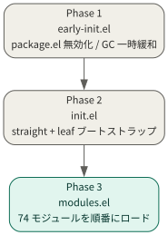

** early-init.el の 11 セクション

11 セクション構成（以前は 10 セクションだったが、起動時エコーエリアの警告対策で 1 つ増えた）。

| セクション | 内容 | コード例 |
|------------+------+---------|
| §1 | =package.el= 無効化 | =(setq package-enable-at-startup nil)= |
| §2 | 基本ディレクトリ | =my:d= の決定、=my:d:lisp= を =load-path= に追加 |
| §3 | 状態ディレクトリ | =my:d:cache= / =my:d:eln-cache= / =my:d:treesit= 等の作成 |
| §4 | straight.el のベース | straight のビルド先ディレクトリ設定 |
| §5 | macOS Homebrew ツールチェーン | =HOMEBREW_PREFIX= 探索 |
| §6 | ネイティブコンパイル | =eln-load-path= まわりの設定 |
| §7 | no-littering との互換性 | =no-littering-var-directory= の事前設定 |
| §8 | 起動性能（GC ガード） | =file-name-handler-alist= を nil に退避、GC 閾値を一時的に緩和 |
| §9 | バックアップ / 自動保存 | =version-control t=、=kept-new-versions 6=、legacy =#file#= 方式は無効化 |
| §10 | 早期 UI の既定値 | =default-frame-alist= でツールバーオフ、フルスクリーンは初回のみ適用 |
| §11 | 起動時エコー | ログインユーザー名を =inhibit-startup-echo-area-message= に設定（文字列必須） |

** init.el の 10 ステップ

| ステップ | 内容 | 注意点 |
|----------+------+--------|
| §1 | URL 状態ディレクトリ | =url.el= のロードより前に設定する必要がある |
| §2 | straight.el ブートストラップ | 初回のみネットワークアクセスが発生 |
| §3 | leaf のブートストラップ | =leaf-keywords-init= 必須 |
| §4 | Org（組み込みを使用） | =straight-use-package 'org= は削除済み。Org は Emacs 同梱のものを使う（後述） |
| §5 | macOS 環境変数の取り込み | ='("-l")= のみ。取得するのは =PATH= と =LANG= だけ |
| §6 | 起動性能パラメータ + GCMH | =read-process-output-max= 4MiB、=gcmh-idle-delay= 5秒 |
| §7 | コア組み込み機能のポリシー | =use-short-answers=、=C-z= アンバインド等 |
| §8 | パーソナルオーバーレイ | =my:modules-extra= 宣言後に =user.el= / =ac1965.el= をロード |
| §9 | モジュール起動 | =(require 'modules nil t)= |
| §10 | 起動メトリクス | 起動所要時間と GC 回数を表示 |

*Org を組み込みに戻した理由（§4）*

以前は =init.el= で =(straight-use-package 'org)= していたが、これは撤去した。理由は次のとおり。

- 使っている Org 関連パッケージ（ox-hugo、org-roam、org-modern 等）はどれも組み込み Org で動く。bleeding-edge な Org を要求するものはない。
- straight 版だと「組み込み Org の autoload に一度でも触れたら壊れる」という "mixed Org version" 問題を抱え込む。決定論的起動という原則にとって負債でしかない。
- straight が依存関係解決の過程で Org を勝手に clone してしまう問題があったので、 =straight-built-in-pseudo-packages= に =org= を追加して対処済み（設定は =early-init.el= 側、straight のブートストラップより前である必要がある）。

* modules.el — Delete-Safety の実装

=modules.el= は設定システムの司令塔。
一番大事なのは「1 本壊れても全体が止まらない」という delete-safety の保証で、
その核心が =condition-case= による各モジュールの隔離。

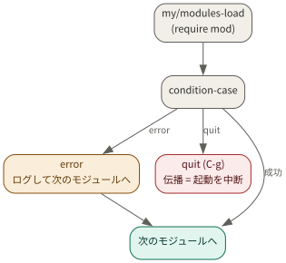

- =error= だけを捕まえる。 =quit= (=C-g=) は意図的に伝播させる。
  ユーザーが中断したいときは中断できるようにしておく必要があるので。
- =my:modules-verbose= が非 nil なら各モジュールのロード時間をミリ秒単位で表示する。
- =my:modules-skip= にシンボルを入れておくと、そのモジュールを静かにスキップできる。
  たとえば =dev-docker= を使わないデバイスでは省略できる。
- =my:modules-extra= は =personal/user.el= が追記する。正規リストの後ろに追加される。
  ちなみにこれは =setopt= ではなく =setq= で代入する。理由は、personal オーバーレイが走る時点では
  まだ =defcustom= が評価されていない（ =modules.el= のロードより前）ため、 =setopt= を使うと
  =void-variable= になってしまうから。

#+begin_src emacs-lisp
;; modules.el の核心部分 — my/modules-load
(defun my/modules-load ()
  "Load all modules defined by `my:modules`, respecting options."
  (let* ((all (append my:modules my:modules-extra))
         (final (seq-remove (lambda (m) (not (modules--should-load-p m))) all))
         (skipped (seq-remove (lambda (m) (memq m final)) all))
         (ok 0) (ng 0)
         (failed '())
         (t0 (and my:modules-verbose (current-time))))
    (dolist (mod final)
      (let ((m0 (and my:modules-verbose (current-time))))
        (if (modules--require-safe mod)
            (setq ok (1+ ok))
          (setq ng (1+ ng))
          (push mod failed))
        (when my:modules-verbose
          (message "[modules] %-24s %s"
                   mod
                   (modules--format-seconds
                    (float-time (time-subtract (current-time) m0)))))))
    (when my:modules-verbose
      (message "[modules] loaded=%d skipped=%d failed=%d total=%s"
               ok (length skipped) ng
               (modules--format-seconds
                (float-time (time-subtract (current-time) t0)))))
    ok))
#+end_src

#+begin_quote
*以前との違い:* ここに載せていたのは =dolist= で回すだけの簡略版だったが、実装は
=modules--should-load-p= / =modules--require-safe= / =modules--format-seconds= の 3 つの
ヘルパーに分割された =my/modules-load= になっている。ロード成功・失敗・スキップの件数を
集計して起動完了時にまとめて報告する点が増えた（ =[modules]= プレフィックスで
loaded / skipped / failed の件数をまとめて出す 1 行サマリ）。 =condition-case= で =error= だけを捕まえて =quit= は伝播させる、という
delete-safety の核はそのまま。
#+end_quote

* core-session — Facade パターンと Dual-Timer スケジューラ

セッションのバックグラウンドジョブ管理は Facade パターンで実装している。
外部モジュールは =core-session.el= （公開 API）だけを =require= して、
実装の詳細は =core-session-private.el= に完全に隠蔽されている。

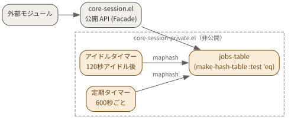

** 2 チャンネルタイマー設計

| タイマー | 実装 | 周期 | 用途 |
|----------+------+------+------|
| 定期タイマー | =(run-at-time 600 600 ...)= | 600 秒ごと | セッション定期メンテ |
| アイドルタイマー | =(run-with-idle-timer 120 t ...)= | 120 秒アイドル後 | バックグラウンド処理 |

ジョブは =make-hash-table :test 'eq= で管理する。
=maphash= で走査するので、中間リストのアロケーションが不要。

#+begin_src emacs-lisp
;; core-session-private.el より
(defun core-session--run-all ()
  "全ての有効ジョブを実行する。maphash で走査し中間リストを作らない。"
  (maphash (lambda (_name meta)
             (when (plist-get meta :enabled)
               (condition-case _err
                   (funcall (plist-get meta :fn))
                 (error nil))))
           core-session--jobs-table))
#+end_src

#+begin_quote
*既知の問題:* 現状、このジョブスケジューラは機能的に空転している。
=core-session-register-job= を呼んでいる箇所が設定全体のどこにも無いため、
=core-session--jobs-table= は常に空で、2 本のタイマーは空のハッシュテーブルを律儀に走査し続けている
だけの状態。実害は無いが無駄ではある。スケジューラ自体を削除するか、将来のジョブ登録用の
拡張ポイントとして温存するかは未決。
#+end_quote

* GC Strategy — 3 層の協調設計

GC 管理は 3 つのモジュールが役割を分担している。

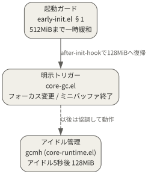

| 層 | ファイル | タイミング | 内容 |
|----+----------+------------+------|
| 起動ガード | =early-init.el §8= | 起動時 | =file-name-handler-alist= を nil に退避。しきい値を一時的に 512MiB まで緩め、=after-init-hook= で 128MiB に戻す |
| 明示トリガー | =core-gc.el= | フォーカス変更 / ミニバッファ終了 | =garbage-collect= を =condition-case= で安全に実行 |
| アイドル管理 | =gcmh= (=core-runtime.el=) | アイドル 5 秒後 | 128MiB 閾値。=leaf :custom= では式評価不可なので =:config= で =setopt= |

#+begin_quote
*落とし穴:* =gcmh-high-cons-threshold= に =(* 128 1024 1024)= を渡すとき、
=leaf :custom= に書くと cdr 位置がそのままクォートされてリテラルのリストとして代入されてしまい、
=gcmh-mode= の内部で =Wrong type argument: integerp, nil= を引き起こす。
=:config= 内で =(setopt gcmh-high-cons-threshold (* 128 1024 1024))= と書くのが正解。
#+end_quote

* Auto-Save Subsystem — 3 つの機構の組み合わせ

=core-editing.el= の自動保存サブシステムは、互いに補完し合う 3 つの機構で構成されている。

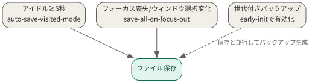

** 保存トリガー

| トリガー | 仕組み |
|----------+--------|
| アイドル ≥5 秒 | =auto-save-visited-mode= のタイマー。=core-autosave-interval= (defcustom, デフォルト 5) で調整可能。旧来の =#file#= スクラッチファイル方式は置き換え済み |
| フォーカス喪失 / ウィンドウ選択の変化 | =core-editing--save-all-on-focus-out= が =after-focus-change-function= と =window-selection-change-functions= の両方をトリガーに、変更済みの全ファイルバッファを保存する |
| 世代付きバックアップ | early-init で有効化。=backup-directory-alist= は no-littering ロード後に =var/backup/= 配下へ集約される |

#+begin_quote
*経緯:* もともとは =focus-out-hook= も併用していたが、Emacs 27.1 でこのフックは廃止済みで
（ =handle-focus-out= が互換のために今も呼んではくれるが）、それに引きずられて 2 つの不具合を
抱え込んでいた。1 つはフォーカス喪失のたびに保存処理が二重に走る二重保存、もう 1 つは
フォーカスを「取得した」ときにも保存が走ってしまう問題。 =(not (frame-focus-state))= の判定を
追加したうえで =focus-out-hook= への登録は撤去し、 =after-focus-change-function= 側に一本化した。
#+end_quote

** 除外 defcustom 変数

| 変数名 | デフォルト | 説明 |
|--------+------------+------|
| =core-autosave-save-on-focus-out= | =t= | フォーカス喪失時の保存そのものを無効化するトグル |
| =core-autosave-exclude-extensions= | ="gpg" "age" "enc" "pem" "p12" "pfx"= | 拡張子で除外。暗号化ファイルや証明書を自動保存で平文上書きしないため |
| =core-autosave-exclude-name-patterns= | =nil= | フルパスに対する正規表現リスト |
| =core-autosave-exclude-modes= | =nil= | 除外するメジャーモード一覧 |
| =core-autosave-exclude-predicates= | =nil= | =(buf) → bool= な関数リスト |

いずれも =personal/user.el= で =setopt= を使って上書きできる。

* auth Layer — 認証情報の解決フロー

認証まわりは 3 つのモジュールが連携する。

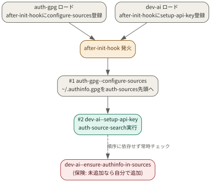

** ~/.authinfo.gpg に必要なエントリ

#+begin_example
# Anthropic Claude API (utils-claude.el 用)
machine api.anthropic.com login apikey password sk-ant-...

# OpenRouter (aidermacs 優先バックエンド)
machine openrouter.ai login ac1965 password sk-or-...

# OpenAI (aidermacs フォールバック)
machine api.openai.com login org-ai password sk-proj-...
#+end_example

=login= フィールドは =:user= 引数に完全一致しないと =auth-source-search= が何も返さない。
不一致でもエラーにはならず黙って空を返すだけなので、「キーを書いたのに認識されない」ときは
まずここを疑う。

** after-init-hook 頼みだけじゃない、二段構えの安全策

=auth-gpg= が =dev-ai= よりも先に =modules.el= でロードされ、両者とも =after-init-hook= に
処理を登録している。ただし =add-hook= は APPEND を渡さない限り新しい関数をフックリストの
*先頭* に追加するため、同じ DEPTH（既定 0）のままでは「後から登録した関数ほど先に走る」
——つまり *ロード順の逆* になる。この前提を誤って「先に登録した auth-gpg の処理が先に走る」
と思い込んでいたのが後述の「dev-ai.el — aidermacs の認証タイミング」節で説明した実機バグの
原因で、現在は =dev-ai--setup-api-key= の登録に DEPTH =10= を明示し、既定 DEPTH（0）の
=auth-gpg--configure-sources= より確実に後で走るようにしてある。

#+begin_example
auth-gpg ロード → after-init-hook に configure-sources を DEPTH 0 で登録
dev-ai   ロード → after-init-hook に setup-api-key を DEPTH 10 で登録
  ↓ after-init-hook 発火（DEPTH の昇順で実行）
  #1 (depth 0):  auth-gpg--configure-sources → ~/.authinfo.gpg を auth-sources 先頭に追加
  #2 (depth 10): dev-ai--setup-api-key → auth-source-search が成功 ✓
#+end_example

DEPTH による順序保証に加えて、 =dev-ai--setup-api-key= 自身にも
=dev-ai--ensure-authinfo-in-sources= を仕込んであり、検索前に「 =auth-gpg-file= （未ロードなら
=~/.authinfo.gpg= にフォールバック）が =auth-sources= に入っているか」を自前でチェックして、
無ければ先頭に追加してキャッシュをクリアする。つまり *auth-gpg の実行が何らかの理由で
スキップされても* 、dev-ai 側だけで検索が成功するように二重に保険を掛けてある。

** auth-keychain.el — 独自バックエンドから組み込みへの置き換え

#+begin_quote
*落とし穴（実機で踏んだ）:* =M-x my/auth-gpg-verify= を実行すると
=⛔ Error excessive-lisp-nesting= 、そして =Command attempted to use minibuffer
while in minibuffer= が発生した。バックトレースを取ると、 =auth-source-backend-parse=
と =auth-keychain--make-backend= が交互に無限に呼び合っていた。

原因は =auth-keychain--make-backend= （ =auth-source-backend-parser-functions= に
登録される関数）の実装ミス。 =auth-source-backend-parse= はディスパッチャで、
=auth-source-backend-parser-functions= を先頭から順に試して最初に非nilを返した
関数の結果を使う。ところが =auth-keychain--make-backend= は、eieio の
コンストラクタで直接オブジェクトを組み立てる代わりに、このディスパッチャ自身を
再帰的に呼び出していた。呼び出すたびに =auth-source-backend-parser-functions= には
まだ =auth-keychain--make-backend= 自身が残っているため、二度と終わらない。

調査の過程で、この Emacs（32.0.50、開発版）には *組み込みの* macOS Keychain
バックエンド（ =auth-source-backends-parser-macos-keychain= ）が既に存在すると
判明した。 =security(1)= を独自に呼ぶ実装は、この組み込み機能が入る前に書かれた
ものだったと見られる。バグを個別に直すのではなく、独自実装を丸ごと廃止して
組み込みバックエンドへの委譲に置き換えた。
#+end_quote

*:host の意味づけがバックエンド種別で変わる罠:* 組み込みの macOS Keychain
バックエンドには =macos-keychain-internet= と =macos-keychain-generic= の
2種類があり、 =:host= の意味が異なる。

- =macos-keychain-internet= — =:host= は素直に =security find-internet-password -s HOST=
  の =-s= （サービス名）に渡る。 =auth-gpg= や =dev-ai= など他のバックエンドと同じ
  「 =:host= = 対象ホスト」という意味づけ。
- =macos-keychain-generic= — =:host= は =-c HOST= （Keychain の「creator」フィールド）に
  マップされ、 =-s= （サービス名）の方には代わりに =:port= を渡す必要がある。他のコードが
  素直に =:host= だけ渡すと *サイレントに何も見つからない* 。

このねじれのため =macos-keychain-internet= を採用し、Keychain エントリは
=security add-internet-password= で保存する必要がある（旧実装が使っていた
=add-generic-password= とは別物）。 =auth-keychain--startup-init= は
=(add-to-list 'auth-sources 'macos-keychain-internet t)= を呼ぶだけの薄いラッパーに
なり、 =auth-source-macos-keychain-search= の呼び出しは Emacs 本体に委ねる。

* completion Layer — CAPF スタックと Org SRC ブロック補完

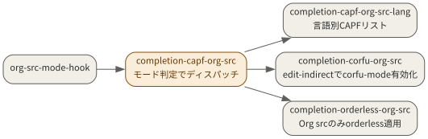

** ベース CAPF スタック

| フック | 関数 | CAPF スタック |
|--------+------+--------------|
| =emacs-lisp-mode-hook= / =lisp-interaction-mode-hook= | =completion--elisp-capfs= | =cape-elisp-symbol cape-file cape-dabbrev= |
| =prog-mode-hook= | =completion--prog-capfs= | 既存スタック + =cape-file cape-dabbrev= |
| =text-mode-hook= | =completion--text-capfs= | =cape-dabbrev cape-file= |
| =org-mode-hook= | =completion--org-capfs= | =cape-dabbrev cape-file cape-tex= |
| =sh-mode-hook= / =eshell-mode-hook= | =completion--shell-capfs= | =cape-file cape-dabbrev= |

** capf-org-src ファミリー (4 モジュール協調)

Org の =#+begin_src= ブロック内で言語固有の補完が効くのは、このファミリーのおかげ。

| モジュール | 役割 |
|------------+------|
| =completion-capf-org-src= | =org-src-mode-hook= でモードを見てディスパッチ |
| =completion-capf-org-src-lang= | 言語別 CAPF 設定リスト |
| =completion-corfu-org-src= | =edit-indirect= バッファで =corfu-mode= 有効化 |
| =completion-orderless-org-src= | Org src ブロックのみ =orderless= スタイル適用 |

** completion-core.el — orderless による補完スタイルの基盤

CAPF スタックより手前でロードされる、補完スタイルの土台。 =orderless= を導入し
=completion-styles= を =(orderless basic)= にするだけの薄いモジュールだが、
=completion-category-overrides= はあえてここでは設定しない。正式な上書きテーブル
（file・symbol・keyword・tex・dabbrev）は本モジュールより後にロードされる
completion-capf.el 側にあり、両方で定義すると「後勝ち」で completion-capf.el が
静かに勝ってしまうため、正となる情報源を1つに絞っている。

Emacs 31 以降では、Vertico が既に担っている候補表示と二重に出ないよう
=completion-eager-display= / =completion-eager-update= を nil に固定し、
=completion-pcm-leading-wildcard= を有効化して partial-completion を
substring（どこでも一致）的に振る舞わせる。 =flex= スタイルも Emacs 31 で
再実装（高速化・ランキング改善）されたため、orderless のディスパッチャに
頼らず file カテゴリで直接使う。

* dev Layer — LSP バックエンド非依存設計

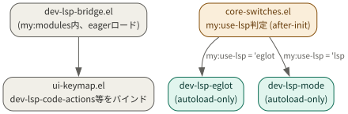

=dev-lsp-bridge.el= を =dev/= セクションの先頭に置くことで、
=ui-keymap.el= がバックエンドを知らなくても =dev-lsp-code-actions= などにキーをバインドできる。
これは =my:modules= に載っている（＝eager ロードされる）通常のモジュールで、後述の
autoload-only とは別枠。

** autoload-only モジュール

これらは =my:modules= に含まれない。 =core-switches.el= 経由で、必要になったときだけ遅延ロードされる。

| モジュール | 宣言先 | トリガー |
|------------+--------+---------|
| =dev-lsp-eglot= | =core-switches= | after-init 時に =(my:use-lsp 'eglot)= |
| =dev-lsp-mode= | =core-switches= | after-init 時に =(my:use-lsp 'lsp)= |
| =ui-doom-modeline= | =core-switches= | after-init 時に =(my:use-ui 'doom)= |
| =ui-nano-modeline= | =core-switches= | after-init 時に =(my:use-ui 'nano)= |
| =ui-nano-palette= | =ui-theme= | =(require 'ui-nano-palette nil t)= |

=my:use-lsp= は =none= / =eglot= / =lsp= の 3 択、 =my:use-ui= は =none= / =doom= / =nano= の 3 択。
これらのモジュールは =leaf= 宣言で =:require t= を使ってはいけない。autoload 宣言が
load-path 上の可用性を保証してくれるので、そこで =:require t= を書くと遅延ロードの意味が無くなる。

* utils-claude.el — Claude API HTTP クライアント

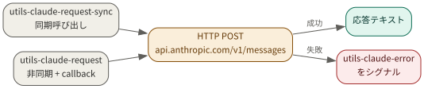

** 公開 API

#+begin_src emacs-lisp
;; 同期リクエスト
(utils-claude-request-sync MESSAGES &optional MODEL MAX-TOKENS SYSTEM)
;; → 応答テキスト文字列を返す。失敗時は utils-claude-error をシグナル。

;; 非同期リクエスト
(utils-claude-request MESSAGES CALLBACK &optional MODEL MAX-TOKENS SYSTEM)
;; → CALLBACK は (text) または (nil err) で呼ばれる。
#+end_src

** defcustom 変数

| 変数 | デフォルト値 |
|------+-------------|
| =utils-claude-default-model= | ="claude-sonnet-4-5"= |
| =utils-claude-max-tokens= | =4096= |
| =utils-claude-api-version= | ="2023-06-01"= |
| =utils-claude-endpoint= | =https://api.anthropic.com/v1/messages= |

エラーは =(define-error 'utils-claude-error "Claude API error" 'error)= で定義した独自条件。
呼び出し側は =(condition-case err ... (utils-claude-error ...))= でラップすること。

* orgx Layer — Auto-Tangle & Auto-Hugo

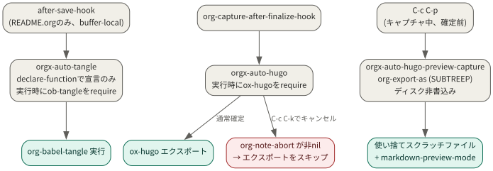

orgx 層は全部で 12 モジュール。 =my:modules= に入ってる正規モジュールは 8 つで、残る 4 つ
（ =orgx-typography= / =orgx-brain= / =orgx-roam-ui= / =orgx-citar= ）はオプション拡張として =my:modules-extra=
経由で足すかどうかを選ぶ形。 =orgx-roam-ui= は既定では外してある——理由は次の「Org の遅延ロード」参照。

** Org の遅延ロード

Org を組み込みに戻しただけでは、orgx 層に Org を無条件で読み込む経路が 5 つ残っていた。
すべて遅延化してある。

- =orgx-core= の =(leaf org :require t)= — :require t を削除。 =:custom= は Custom が
  値を先行登録し、 =:config= は leaf が =with-eval-after-load 'org= へ包む。
- =orgx-export= の =(leaf ox :straight nil :require t)= — 削除。 =ox= は =ox-hugo= が
  自身で require する。
- =orgx-export= の =(leaf ox-hugo :require t)= — :require t を削除。エクスポートは
  =org-hugo-export-wim-to-md= の autoload から起動する。
- =orgx-export= の =(leaf ob-mermaid :require t)= — leaf は導入のみ。
  =orgx-export--register-mermaid= を =with-eval-after-load 'org= に置き、org のロード時に
  require → =setopt= → 言語登録の順で実行する。
- =orgx-auto-tangle= と =orgx-auto-hugo= は、トップレベルで =(require 'org)= / =(require 'ob-tangle)=
  / =(require 'ox-hugo)= を *しない* 。代わりに =declare-function= でバイトコンパイラ向けの宣言だけ
  済ませておき、実際の =require= は関数が実行されるタイミング（フック発火時）まで遅らせる。

#+begin_quote
*以前との違い:* =orgx-export= 側の =ox-hugo= の =:require t= 削除は、実は README.org の
Changelog には「完了した」と書かれていたのに、実際のコードには反映されていなかった
（ =orgx-auto-hugo.el= 側は同じ理由で正しく遅延化されていたのに、こちらだけ直し忘れて
いたと見られる）。ドキュメント（Changelog）とコードが食い違っていた実例で、
=check_fboundp_guards.py= のような機械的検査ではこの種の乖離は検出できない
（ =fboundp= ガードの話ではないため）。修正済みで、今はコードも上記の通り。
#+end_quote

どちらのフックも、発火する時点で Org は必ずロード済みという前提が成り立つ
（ =orgx-auto-tangle= は =org-mode-hook= 経由でしか登録されないし、 =orgx-auto-hugo= の
=org-capture-after-finalize-hook= も同様）ので、この遅延化は安全 *だが、それはあくまで
プログラムから呼ばれる経路の話* 。

#+begin_quote
*落とし穴（実機で踏んだ）:* =ox-hugo= の =:require t= を外した直後、 =M-x
org-hugo-export-wim-to-md= のような直接呼び出しは autoload 経由で問題なく動くのに、
=C-c C-e= の対話的ディスパッチメニューに Hugo の項目が出なくなった
（ =C-c C-e H A= が選べない）。原因は =org-export-dispatch= が
=org-export-registered-backends= を直接見てメニューを組み立てる点で、この一覧への
登録（ =org-export-define-derived-backend= ）は =ox-hugo.el= が *実際にロードされた*
副作用として起きるのであって、個々のコマンドの autoload cookie では発生しない。
つまり「関数呼び出しの autoload」と「バックエンドのメニュー登録」は別物で、
後者は :require t を外すと起動時だけでなく *ずっと* 登録されないままになる。

対処として、 =org-export-dispatch= 自体に =:before= advice を付け、メニューを開く
直前にだけ =ox-hugo= を require するようにした（ =orgx-export--ensure-ox-hugo-before-dispatch= ）。
通常起動時のコストは避けたまま、対話的なディスパッチメニューでも Hugo が正しく
選べるようにしている。
#+end_quote

ただし、既定構成では起動直後のアイドル時間に =orgx-extensions= が =org-roam-db-autosync-mode=
を有効化するため、結局 Org はそこそこ早めにロードされる。org-roam を使わない構成
（ =my:modules-skip= に =orgx-extensions= を追加）なら、Org を本当に使うまで完全に遅延できる。

** orgx-auto-tangle

=after-save-hook= をバッファローカルに登録しているので =README.org= 以外には影響しない。
再帰ループ防止のため =orgx-auto-tangle--in-progress= をバッファローカルフラグとして使っている。

#+begin_src emacs-lisp
(declare-function org-babel-tangle "ob-tangle" (&optional arg target-file lang-re))
(defvar-local orgx-auto-tangle--in-progress nil)

(defun orgx-auto-tangle--maybe ()
  (when (and (orgx-auto-tangle--eligible-p)
             (not orgx-auto-tangle--in-progress))
    (require 'ob-tangle)
    (let ((orgx-auto-tangle--in-progress t)
          (org-confirm-babel-evaluate nil)
          (inhibit-modification-hooks t))
      (condition-case err
          (org-babel-tangle)
        (error (message "[orgx-auto-tangle] error: %s" (error-message-string err)))))))
#+end_src

#+begin_quote
*Emacs 31 での追加対策:* =README.org= は約 1.3 万行、tangle 先はおよそ 90 ファイル。保存が
連続すると（ =auto-save-visited-mode= に加えて明示の =C-x C-s= が重なるなど）全 tangle が
2 回走ってしまうことがあった。 =timeout.el= の =timeout-throttle= で一定間隔内の連続呼び出しを
1 回にまとめている。実行中フラグ自体は非再入性の担保として引き続き必要（スロットリングは
頻度制限であって非再入性の保証ではないため）。
#+end_quote

** orgx-auto-hugo

=after-save-hook= ではなく =org-capture-after-finalize-hook= を使う。
キャプチャ編集中の自動保存で ox-hugo がトリガーされると未完成エントリがエクスポートされて
しまうため。 =org-note-abort= が非 nil なら（ =C-c C-k= でキャンセルされた場合）エクスポートを
スキップする。 =ox-hugo= のロードも同様に、トップレベルの =require= ではなく関数内部まで遅延している。

*確定前の手動ブラウザプレビュー:* =org-capture-mode-map= に =C-c C-p=
（ =orgx-auto-hugo-preview-capture= ）を割り当ててある。 =org-hugo-export-wim-to-md=
は使わない — キャプチャ対象ファイルが =#+HUGO_BASE_DIR= を持っていることが多く、
一時ディレクトリへの動的束縛より優先されて実 content へ書き出されてしまう危険があるため。
代わりに =org-export-as= を SUBTREEP 付きで直接呼び、現在のエントリだけをディスクに触れず
文字列化する。結果はキャプチャセッションごとの使い捨てスクラッチファイル（保持先は
バッファローカル変数ではなく =org-capture-put= のセッションプロパティ。バッファは確定・中断の
どちらでもフック前後に kill されうるため）に書き出し、そこで =markdown-preview-mode= を
有効化する。セッション終了時（確定・中断どちらでも）は =orgx-auto-hugo-preview--cleanup= が
スクラッチディレクトリを削除する。

*落とし穴（実機で踏んだ）:* =markdown-preview-mode= はブラウザへの更新送信
（スクロール同期）でプレビューバッファの *ウィンドウ* を参照する。 =find-file-noselect=
だけで作った、一度も表示されていないバッファに対して呼ぶと "Wrong type argument:
number-or-marker-p, nil" で失敗する（スクラッチファイル自体は正しく書き込まれるが、
送信だけ失敗する）。対処として、更新中だけスクラッチバッファを実ウィンドウに
=pop-to-buffer= し、直後にフォーカスをキャプチャバッファへ戻してタイピングを
妨げないようにしている。

** orgx-citar.el — citar / org-cite による文献引用管理

=citar= を =org-cite-insert-processor= / =org-cite-follow-processor= /
=org-cite-activate-processor= すべてのバックエンドとして登録する薄いモジュール。
=citar-embark= を =:after (citar embark)= で連結し、 =citar-embark-mode= を有効化して
=embark-act= 経由の文献アクション（開く・引用挿入など）を追加する。

=orgx-brain= と同じく =my:modules= には現れず、 =personal/user.el= が
=my:modules-extra= 経由で足すオプション拡張。理由も同じで、Org を起動直後に
引き込む正規モジュールを増やしたくないため。

*my:d:org-biblio の新設:* =citar-bibliography= の初期実装はホームディレクトリを
直書きした固定パス（ =~/org/roam/biblio/gov-standards.json= ）だった。orgx-core.el
の他の派生パス変数（ =my:d:org-journal= / =my:d:org-roam= / =my:d:org-pictures= ）に
揃え、 =my:d:org-biblio= （ =my:d:org= 配下、 =my/ensure-directory-exists= でディレクトリ
作成も保証）を新設してこれを置き換えた。personal 層でのパス上書き（macOS/WSL の
分岐など）が =my:d:org= 系のどの変数にも一律で効くようにするための、既存の
「上書きの契約」（ =orgx-core= 節冒頭のコメント参照）に合わせた対応。

#+begin_quote
*落とし穴（実機で踏んだ）:* 初版は =citar-bibliography= と =org-cite-global-bibliography=
も =:custom= に含めていたが、起動時に =⛔ Error (leaf): Attempt modify list= が出て
両変数とも設定されなかった。原因は leaf 内部の =leaf-normalize-list-in-list= —
=:custom= のペアは =(SYM . VALUE)= という真の dotted pair か、 =(SYM . 'quoted-value)=
のような特別扱いされる形でなければならず、 =(citar-bibliography . (list
(expand-file-name "gov-standards.json" my:d:org-biblio)))= のように任意の関数呼び出し
式を値にすると、Lisp リーダはこれを単なる 3 要素の proper list
=(citar-bibliography list (expand-file-name ...))= として読む。leaf はこれを
「複数の変数に同じ値を配る省略記法」（ =((a b c) . d) => ((a . d) (b . d) (c . d))= ）
と誤認し、 =citar-bibliography= ・ =list= ・ =expand-file-name= ・ =my:d:org-biblio=
を別々の変数として =nil= に =customize-set-variable= しようとして失敗する。

これは =org-todo-keywords= / =org-refile-targets= / =org-capture-templates= を
=:custom= ではなく =setq= に置いている、orgx-core 節および「setopt vs setq」節の
コーディング規則 §6 の例外と同じ種類の問題。値が実行時評価式（ =expand-file-name= の
呼び出しなど）を含む defcustom は =:custom= に置けない。対処として
=citar-bibliography= と =org-cite-global-bibliography= を =:config= 内の =setopt=
に移した。 =:custom= の生成コードは常に =:config= の本体より前に展開されるため、
=org-cite-global-bibliography= （ =citar-bibliography= の値をそのまま使う）を
=:custom= に残すと =citar-bibliography= 代入前の古い値を読んでしまう——この2つは
まとめて =:config= に置き、代入順序も保証する必要がある。
#+end_quote

* ui Layer — フォント・テーマ・ウィンドウ管理

=ui-leader.el=（キーマップ、次節）より土台にある3モジュール。

** ui-font.el — フォント設定

OS ごとのフォールバックを持つフォント適用モジュール。 =ui-font-apply= が等幅・
可変ピッチ・絵文字のフェイスをまとめて設定し、 =after-init-hook= と
=after-make-frame-functions= の両方にフックする（デーモンモード対応。デーモン時は
フレームごとに適用し直す必要があるため =after-make-frame-functions= 経由に切り替える）。

*設計上の注記:* デーモン分岐には元は無名 lambda を使っていたが、名前付き関数
=ui-font--apply-to-frame= へ抽出済み。無名関数のままだと hook から除去も検査も
できないため。

** ui-theme.el — Nano テーマとフェイスポリシー

Nano テーマのロードと、太字・斜体・括弧対応ハイライトなどのフェイスポリシーを
まとめる。 =ui-nano-palette= への依存は =fboundp= ガード越しの疎結合 —
=my:use-ui= が ='doom= や ='none= のときに nano パレットのロードを強制しない設計。

*ui-nano-palette の正式なロード経路は ui-theme.el のみ:* ui-theme は常に
=my:modules= に含まれるため無条件にロードされ、その中の
=(require 'ui-nano-palette nil t)= が唯一の初回ロード起点になる。
=ui-nano-modeline.el= や =dev-term.el= は =with-eval-after-load= で反応するだけで、
自分から require してはならない。

テーマ再読込（ =enable-theme=）やフレーム生成のたびにフェイスを再適用するため、
=enable-theme-functions=（Emacs 30+）があればそちらに、無ければ
=advice-add 'enable-theme :after= にフォールバックしてフックする。

** ui-window.el — ウィンドウ管理の補助

黄金比風の自動リサイズ（ =zoom= ）、セッション間のレイアウト永続化
（ =desktop-save-mode= ）、ウィンドウ構成の undo/redo（ =winner-mode= ）、
名前付きスナップショット（ =my/save-window-layout= / =my/restore-window-layout= ）
の4つを束ねるモジュール。 =desktop= 関連の8変数はすべて defcustom なので、
setter と型検証を効かせるため let 内でも素の =setq= ではなく =setopt= を使っている。

* ui-leader.el — M-SPC リーダーキー階層

#+ATTR_LATEX: :height 0.85\textheight :placement [h!]
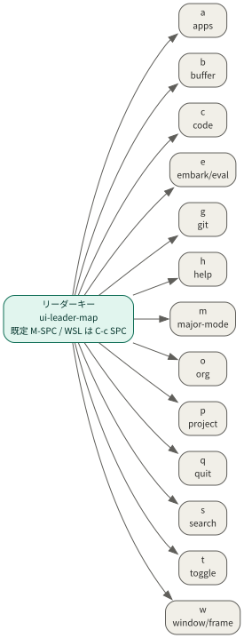

=M-SPC= を起点に 13 個のサブマップ（ =a b c e g h m o p q s t w= ）が並んでる。
元は =C-c SPC= （3 キー）だったのを =M-SPC= （2 キー）に変更して、
全リーダーコマンドのキーストロークを 1 つ短縮した。これは =ui-leader.el= が持つ既定値で、
WSL では =personal/device-wsl.el= がこれを =C-c SPC= に張り替える（後述の personal Layer の節）。

キーマップの定義はロード時に即座に実行される。 =after-init-hook= には遅延させない。
=ui-keymap.el= がロードされる前にマップが確定している必要があるため。

** ui-global-keys.el / completion-embark.el — リーダー外のグローバルキー

リーダー（ =M-SPC= ）体系とは別に、単発和音として直接バインドしている一群がある。
以前は「高頻度の単一和音のみに絞る」方針で =C-c b/k/o/r= を =M-SPC= 側に統合していたが
（本ドキュメントでも「元は3キーだったのを2キーに」という話は上の通り）、2026-07 に
ty07.net の備忘録記事（Emacsショートカットキー一覧）と =README.org= を突き合わせた際に、
以下を追加で直接バインドし直した。

| キー | コマンド | 備考 |
|------+----------+------|
| =s-o= | =find-file-other-frame= | macOS 風フレーム操作 |
| =s-m= | =make-frame-command= | 同上 |
| =s-w= | =delete-frame= | 同上 |
| =s-.= | =window-toggle-split-direction= | Emacs 27+ のみ。 =fboundp= で防御 |
| =s-j= | =find-file-other-window= | 同上 |
| =C-c o= | =find-file= | 再導入。 =M-SPC= 側に対応物が無かったため重複にならない |
| =C-c v= | =find-file-read-only= | 同上 |
| =C-c k= | =kill-buffer-and-window= | =M-SPC k= の =my/smart-kill-buffer= （保存確認して kill、ウィンドウは残す）とは別物。こちらはウィンドウごと閉じる |
| =C-c r= | =query-replace= | =M-SPC s r= の =consult-ripgrep= とは別物（バッファ内置換 vs プロジェクト検索） |
| =M-g g= | =consult-goto-line= | |
| =C-c ;= / =C-c := | =comment-region= / =uncomment-region= | |
| =C-c M-a= | =align-regexp= | |
| =C-s-<up>= / =C-s-<down>= | =scroll-down-command= / =scroll-up-command= | 現在のウィンドウ |
| =s-<wheel-up>= / =s-<wheel-down>= | =scroll-other-window-down= / =scroll-other-window= | 他のウィンドウ |
| =C-+= / =C--= | =text-scale-increase= / =text-scale-decrease= | |
| =s-/= / =s-;= / =C-<f2>= | =embark-act= / =embark-dwim= / =embark-bindings= | =completion-embark.el= 側の =leaf embark= に =:bind= として設置。パッケージ固有なので =ui-global-keys.el= には置かない |

*以前との違い:* 「 =C-c b/k/o/r= は全部 =M-SPC= に統合済み」という以前の記述は、 =o= / =v=
（元々 =M-SPC= 側に対応物が存在しなかった）、 =k= / =r= （それぞれ =kill-buffer-and-window= /
=query-replace= という、既存の =M-SPC= 側コマンドとは別物）については、もう正確ではない。
=b= （バッファ切り替え系）だけは引き続き =M-SPC= 経由のみで、直接和音には戻していない。
「単一和音は最高頻度のものに限る」という方針自体は変えておらず、今回追加した一群も
「ty07.net の備忘録に載るくらい日常的に使う操作」という基準で絞り込んだ結果。

* dirvish — キーバインド一覧と IME(sis) 表示

=dirvish-override-dired-mode= (=core/core-editing.el=) により、 =dired-mode= の
バッファは常に dirvish として開かれる。したがってここに挙げるキーは
=dirvish-mode-map= だけでなく、明示的な上書きが無いものは =dired-mode-map=
（utils-dired.el／dired.el 標準）由来のものも含む。

| キー | コマンド | 定義元 | 備考 |
|------+----------+--------+------|
| =RET= | =my/dired-get-file-or-dir= | =utils-dired.el= | =dirvish-find-file= で既存 dirvish セッション内を移動。未ロード時は =dired-find-file= にフォールバック |
| =TAB= | =dirvish-subtree-toggle= | =ui-keymap.el= (=local-leader-binds= 内で上書き) | サブツリーの展開/折りたたみ |
| =i= | =dirvish-subtree-toggle= | 同上 | =TAB= と同義の別キー |
| =o= | =dired-find-file-other-window= | 同上 | 別ウィンドウで開く（編集可能、カレントウィンドウは維持） |
| =O= | =ui-keymap--dirvish-open-read-only= | 同上 | =dired-find-file-other-window= の後に =read-only-mode= を適用 |
| =z= | =ui-keymap--dirvish-view-file-other-window= | 同上 | =view-file-other-window= を呼び、最初から =view-mode= で別ウィンドウに開く。dired 標準の =z= (=dired-do-compress=) を上書き |
| =q= | =dirvish-quit= | 同上 | セッション終了 |
| =v= | =dired-view-file= | dired 標準（上書きなし） | *カレントウィンドウを置換*して =view-mode= で開く。一覧を維持したい場合は =z= を使う |

=O= と =z= の違い: =O= は「編集可能なバッファを開いてから read-only-mode を後付けする」経路、
=z= は最初から =view-mode= として開く経路（ =q= で閉じるとウィンドウ配置ごと片付く）。
=view-file-other-window= (=z=) は内部的に =display-buffer= を経由するため、
=display-buffer-alist= (=ui-keymap.el=) に =view-mode= バッファ向けの固定ルールを
追加してあり、常に右側の専用サイドウィンドウ（幅 50%、 =dedicated= ）に出る。
フレーム最大化運用では分割方向が実行ごとに揺れやすいため、これで毎回同じ位置に固定される。

** IME(sis) 状態の表示

dirvish は編集バッファの nano-modeline パイプラインを経由しない独自の
mode-line（ =dirvish-mode-line-format= ）を持つため、ウィンドウ最大化時など
見た目の手がかりが少ない状況では IME（英字／日本語）状態が判別できない問題があった。

対応として、 =dirvish-mode-line-format= の =:right= に =ime= セグメントを追加した
（ =core/core-editing.el= の =leaf dirvish= :custom）。セグメント本体は
=personal/ac1965.el= 側で =dirvish-define-mode-line= により定義し、新たに
=macism= や =osascript= を呼ぶのではなく、編集バッファの nano-modeline と同じ
キャッシュ変数 =ac1965--sis-indicator= (=sis-change-hook= が更新) をそのまま
読むだけにしてある。プロセス起動コストはゼロで、表示内容は編集バッファ側と
常に一致する。

* dev-ai.el — aidermacs の認証タイミング

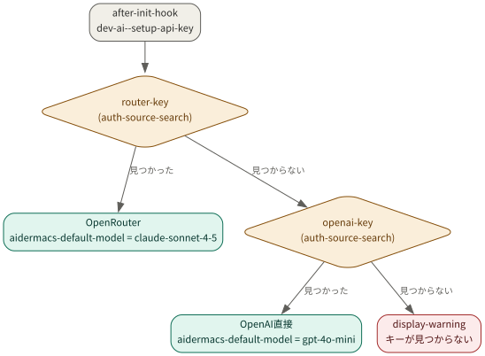

** キー検索は :init ではなく after-init-hook で

以前は =:init= （モジュールロード時）で API キーを検索していたが、その時点ではまだ
=~/.authinfo.gpg= が =auth-sources= に追加されておらず、常に "no key found" になっていた。
=after-init-hook= に移したうえで、auth Layer の節で触れた =dev-ai--ensure-authinfo-in-sources=
による自前チェックも加えた。

#+begin_quote
*落とし穴（実機で踏んだ）:* 上の対処だけでは直らなかった。 =add-hook= は APPEND 引数を
渡さない限り新しい関数を *フックリストの先頭* に追加するため、同じ DEPTH（既定 0）内では
「後から登録した関数ほど先に走る」。 =auth-core= （ =epa-file-enable= を呼ぶ）と =auth-gpg=
（ =~/.authinfo.gpg= を =auth-sources= に追加する）はどちらも =my:modules= 上では
=dev-ai= より前にロードされるが、3 つとも =after-init-hook= への登録時に DEPTH を
指定していなかったため、実際の実行順は「ロード順」ではなく「登録順の逆」になっていた。
結果、 =dev-ai--setup-api-key= が =auth-core--startup-init= より *先に* 走り、
epa-file が未初期化のまま =auth-source-search= が =~/.authinfo.gpg= を読みに行くため
復号に失敗し、"No API key found" の警告が出る——しかしファイル自体は（復号できないまま）
開かれる、という一見矛盾した挙動になっていた。design_spec.org のこの節が「実行順序に
依存しない」と書いていたのは実装が追いついていなかったための誤りで、現在は下記の対処で
実際に順序非依存になっている。

対処として =dev-ai--setup-api-key= の登録に DEPTH =10= を明示した
（ =(add-hook 'after-init-hook #'dev-ai--setup-api-key 10)= ）。DEPTH は
=personal/ac1965.el= の =ac1965--bind-leader-keys= と同じ仕組みで、既定 DEPTH（0）の
フックがすべて走り終えたあとに実行されることを、モジュールのロード順に関係なく保証する。
=dev-ai--ensure-authinfo-in-sources= は =auth-gpg--configure-sources= の実行結果に
頼らない自前の安全策として引き続き残してあるが、 =epa-file-enable= 自体は
=auth-core--startup-init= 側でしか行わないため、DEPTH による実行順の保証が本質的な修正。
#+end_quote

** dev-ai--setup-api-key の cond ロジック

#+begin_src emacs-lisp
(cond
 ;; 優先: OpenRouter
 (router-key
  (setenv "OPENAI_API_BASE" "https://openrouter.ai/api/v1")
  (setenv "OPENAI_API_KEY"  router-key)
  (setopt aidermacs-default-model "openrouter/anthropic/claude-sonnet-4-5"))
 ;; フォールバック: OpenAI 直接
 (openai-key
  (setenv "OPENAI_API_BASE" "https://api.openai.com/v1")
  (setenv "OPENAI_API_KEY"  openai-key)
  (setopt aidermacs-default-model "gpt-4o-mini"))
 ;; どちらも見つからない場合
 (t
  (display-warning 'aidermacs "No API key found in auth-source.")))
#+end_src

* personal/ Layer — マシン固有オーバーレイ

=lisp/= 配下が「共有ポリシー」なら、 =personal/= は「このユーザー・この機械でしか意味を
持たない設定」の置き場。フォント、API キーの参照先、macOS 固有の挙動などを =lisp/= に
混ぜると他の環境で不可解な動きをするので、境界をはっきり分けてある。

| 特性 | 内容 |
|------+------|
| バージョン管理 | 共有コミットには含めない（各自でカスタマイズする前提） |
| 編集の安全性 | 変更しても他ユーザーには影響しない |
| ロード順 | =init.el= §8（ =modules.el= を require する §9 より *前* ） |

ロード順が「モジュールより前」というのが地味に重要で、 =my:modules-extra= への
追記や =my:d:org*= 系パス変数の上書きが、後続の =defvar= に対して先勝ちできるのは
この順序があってこそ。

| ファイル | 目的 |
|----------+------|
| =personal/user.el= | 全マシン共通の個人設定。ロケール初期化、WSL 判定 =my:wsl-p= 、デバイスファイルの読み込み分岐 |
| =personal/ac1965.el= | ログイン名に対応する識別情報・パス上書き・フォント・UI/LSP スイッチ |
| =personal/device-darwin.el= | macOS 固有: IME（sis）、マウス／トラックパッド、Apple Music 操作 |
| =personal/device-wsl.el= | WSL 固有: クリップボード連携、既定ブラウザ、Explorer 連携 |
| =personal/personal-messages.el= | macOS Messages.app のアーカイバ（org-roam へ） |
| =personal/personal-ai.el= | Org Babel の =claude= 言語と、対話的な Claude 連携コマンド |

** personal/user.el — 共通オーバーレイと my:modules-extra

全マシンで読み込まれる唯一のファイル。ここでやってることは主に 3 つ。

- =my:modules-extra= に =ui-visual-aids= / =orgx-typography= / =orgx-brain= / =ui-macos= を追記する。
  =orgx-roam-ui= はあえて入れていない。理由は auth Layer の節でも触れた「Org の遅延ロードを
  崩す」問題と同じで、 orgx の節を参照。
- =set-language-environment "Japanese"= → =prefer-coding-system 'utf-8= の順で呼んで、
  日本語ファイル検出のためのコーディングシステム優先順位を整える。 =set-locale-environment=
  だけでは Emacs 内部の優先順位リストまでは変わらないので、この 2 段構えが必要。
- =my:wsl-p= を定義して、 =device-<system-type>.el= か =device-wsl.el= かを振り分ける。
  WSL 上の =system-type= は素の Linux と同じ =gnu/linux= になってしまうので、
  =system-type= だけでは判定できず、環境変数 =WSL_DISTRO_NAME= を見て判定している。

#+begin_quote
*落とし穴:* =personal-messages= の自動アーカイブは =with-eval-after-load 'org= で
Org 準備完了まで遅延させたうえで、 =run-with-idle-timer= の REPEAT 引数に =600= （10 分）
を渡している。ここに =t= を渡すと「アイドルになるたびに毎回発火」という意味になり、
意図よりはるかに高頻度で走ってしまう。地味だが踏みやすい罠。
#+end_quote

** personal/ac1965.el — ログイン単位の上書き

=my:d:org= / =my:d:org-journal= / =my:d:org-roam= / =my:f:capture-blog-file= を上書きしている。
これができるのは、本ファイルが =orgx-core.el= （モジュールロード）より *前* にロードされるため。
=defvar= は既存の束縛を上書きしないので、ここで先に =setq= しておけば =orgx-core= 側の
=defvar= は何もしなくなる、という「上書きの契約」（orgx Layer の節を参照）がそのまま効いている。

上書き先のパスは =my:wsl-p= で分岐していて、macOS と WSL で別の値になる。

| 変数 | macOS | WSL |
|------+-------+-----|
| =my:d:org= | =/Users/ac1965/Documents/org/= | =/home/ac1965/org/= |
| =my:d:org-journal= | =/Users/ac1965/Documents/org/journal/= | =/home/ac1965/org/journal/= |
| =my:d:org-roam= | =/Users/ac1965/Documents/org/org-roam/= | =/home/ac1965/org/org-roam/= |
| =my:f:capture-blog-file= | =/Users/ac1965/Projects/blog/mysite/all-posts.org= | =/home/ac1965/Projects/blog/mysite/all-posts.org= |

WSL 側の =my:f:capture-blog-file= はホームパスを機械的に置き換えただけの値なので、
=~/Projects/blog/mysite/= を WSL 側で clone していない場合は実在しないパスになる。
その場合は個別に上書きするか、 =orgx-core.el= 側の nil ガードに委ねて未設定のままにする。

#+begin_quote
*以前との違い:* もともとこのファイルは macOS の =/Users/ac1965/Documents/org/= 決め打ちだった。
WSL でも同じ =ac1965.el= を共有する必要が出てきたため、 =(if (my:wsl-p) ... ...)= で
macOS 用と WSL 用の =setq= を分岐する形に変えた。 =my:wsl-p= は本ファイルより前にロードされる
=personal/user.el= 側の定義を参照しているので、この位置から呼んでも問題ない。
#+end_quote

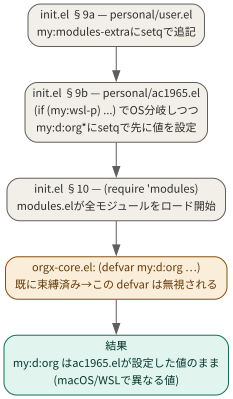

図の要点はシンプルで、 =init.el= §8a/§8b でパス変数に =setq= してしまえば（今は OS 分岐を
挟むだけで、setq すること自体は変わらない）、その後 §9 で走る =modules.el= 経由の
=orgx-core.el= が同じ変数を =defvar= で宣言し直しても「先に束縛されているから無視される」
だけ、というだけの話。順序が逆転する（ =personal/= より先に =orgx-core.el= がロードされる）と、
この契約は即座に壊れる。

フォントは =JetBrains Mono= （等幅）＋ =Noto Sans JP= （可変）、サイズ 18。UI/LSP は
=my:use-ui 'nano= と =my:use-lsp 'eglot= を選択している（autoload-only モジュールの節を参照）。
なお、フォント設定は今のところ OS 分岐していない（ =ui-font-emoji= の =Apple Color Emoji= は
macOS 専用フォントだが、WSL 向けの上書きはまだ入っていない）。

このファイルにはマシン固有の小物も同居している。 =.ps1= → =powershell-mode= 、
=.bas= → =visual-basic-mode= の拡張子登録、nano-modeline 右セグメントに時計・文字コード・
IME インジケータを出す =ac1965--nano-time-encoding= のオーバーライド、ブログ執筆用の
タグ補完コマンドなど。いずれも「このホストでしか要らない」ものなので、共有の
=personal/user.el= を汚さずここに閉じ込めてある。

** personal/device-darwin.el / device-wsl.el — OS ごとの分岐

=my:wsl-p= の判定結果で、どちらか一方だけがロードされる（両方同時にロードされることはない）。

*** device-darwin.el

- IME 切替は =sis= （smart-input-source）。 =macism= の有無にかかわらず =sis= 自体は
  常にロードする。理由は nano-modeline の IME インジケータが =sis--current= を必要と
  するため。 =macism= が実際に見つかったときだけ ISM とグローバルモードを有効化する。
- Logitech MX Ergo S 向けにスクロール量・慣性・マージンを調整。
- AppleScript 経由で Apple Music を操作するコマンド群と、それをまとめた
  =hydra-apple-music= （ =M-SPC a a= ）。

*** device-wsl.el

リーダーキーを =M-SPC= から =C-c SPC= へ *丸ごと張り替えている* 。Windows 側で Alt+Space が
システムメニューのショートカットと衝突しやすく、人間工学的にも押しにくいという理由。

#+begin_quote
*以前との違い（実機で踏んだバグ）:* このドキュメントには以前、「 =ui-leader--bind-root= 等は
本ファイルより前にロード済みだから、 =keymap-global-unset= で旧バインドを解除してから
=setopt ui-leader-key= して張り直せばよい」と書いてあった。これは *前提が逆* だった。

実際のロード順は =init.el= §8（ personal オーバーレイ）→ §9（ =(require 'modules)= ）で、
=device-wsl.el= は =personal/user.el= の内部から §8 の時点で同期的にロードされる。一方
=ui-leader.el= は =ui= 層のモジュールなので §9 の =modules.el= 経由でしか読み込まれない。
つまり =device-wsl.el= のトップレベルが評価される時点では =ui-leader-key= も
=ui-leader-map= も =boundp= ですらなく、旧実装の =(when (and (boundp 'ui-leader-key) ...) ...)=
は条件不成立で *黙ってスキップ* されていた。その後 §9 で =ui-leader.el= がロードされ、
=ui-leader--bind-root= が既定値 =M-SPC= で結線して終わり——つまりリーダーキーは
=C-c SPC= に切り替わらず =M-SPC= のまま残っていた。デバッガにも警告にも出ない、
静かな不具合だった。

対処として、トップレベル直書きをやめ、 =(with-eval-after-load 'ui-leader ...)= で
「 =ui-leader= がロードされ =ui-leader--bind-root= が =M-SPC= で一度結線した *直後* 」に
確実に実行されるよう変更した。これなら =personal/user.el= → =modules.el= という実際の
ロード順序に依存せず、常に「結線の後」に上書きできる。ちなみに =utils-ime.el= の
=utils-ime--install-leader= （IME 切替でリーダーを包む処理）も同じ理由で元から
=with-eval-after-load 'ui-leader= を使っており、今回の修正はそれと同じパターンに揃えた形。
#+end_quote

このファイルはもう 1 つ変わったことをしていて、 =ui-global-keys.el= が定義する =s-= 系
（macOS Super キー）バインドが WSL では実質デッドコードになる問題に対処している。
=ui-global-keys.el= 自体には手を入れず、高頻度クラスタ（undo/redo、バッファ間移動、
他ウィンドウのスクロール）は =C-M-= 系または =C-z= （core init で unset 済みなので
衝突なく再利用できる）に、低頻度クラスタ（フレーム／ウィンドウ管理）は既存の
=ui-leader-w-map= （WSL では =C-c SPC w= ）に統合する、という 2 段階の代替バインドを
=after-init-hook= で追加登録する形。

その他、 =win32yank.exe= 経由のクリップボード連携、 =wslview= 経由のブラウザ起動、
Explorer 連携コマンド（ =device-wsl-open-in-explorer= 、 =device-wsl-copy-windows-path= ）、
それらをまとめた =hydra-wsl= （リーダー =a w= ）を提供する。

** personal/personal-messages.el — Messages.app アーカイバ

macOS の =~/Library/Messages/chat.db= を =sqlite3= 経由で読み、新着メッセージを
=org-roam= 配下へ日付＋相手名のファイルとして追記していくアーカイバ。

- =personal-messages-last-archived= はセッションをまたいで持続させたい =defcustom= の
  例外パターン。 =setopt= ではなく =customize-save-variable= で書き込む（変数代入ポリシー
  の節にある setopt/setq の表とは別枠で、「永続化が要る defcustom」という第 3 のケース）。
- =darwin= かつ =chat.db= が読めて =sqlite3= が使える場合のみ動く。それ以外の環境では
  黙って no-op。

** personal/personal-ai.el — Org Babel の claude 言語

=utils-claude= （utils 層）に HTTP 通信をすべて委譲したうえで、2 つの使い方を提供している。

- Org Babel 言語 =claude= を登録。 =#+begin_src claude :system "..." :model "..." :tokens N=
  のブロック本文をユーザーメッセージとして送り、応答をブロック結果として挿入する。
- 対話コマンド 3 つ: =my/claude-refactor-defun= （ポイント位置の defun をリファクタ
  提案）、 =my/claude-complete-docstring= （docstring 生成）、
  =my/claude-analyze-require-graph= （カレントバッファの =require= を層構造と突き合わせて
  上位層への依存違反を報告する）。結果はすべて専用の =*Claude Output*= バッファ（org-mode）
  に追記される。

=my/claude-analyze-require-graph= がチェックする層順は
=early-init → core → ui → auth → completion → orgx → vcs → dev → utils → personal= の
10 層。これは =Layer Ownership= の設計原則をコマンドとして実装したもの、という位置づけ。

* 命名規則と変数代入ポリシー

** 命名規則

| プレフィックス | スコープ | 例 |
|----------------+----------+----|
| =my/= | 公開インタラクティブコマンド | =my/eww-search=, =my/auth-gpg-verify= |
| =<module>-= | モジュール公開 API | =core-treesit-install-all=, =ui-font-apply= |
| =<module>--= | モジュール内部実装 | =core-native--collect=, =modules--require-safe= |
| =my:d:*= | パス / ディレクトリ変数 | =my:d=, =my:d:var=, =my:d:org= |
| =my:modules= | 正規リスト定数 | =defconst= で定義。変更禁止 |

禁止パターン: =my/<topic>--= の複合形。公開名前空間 (=my/=) とプライベートスコープ (=--=) を混ぜてはいけない。

** setopt vs setq

| 使うべき形 | 対象 | 補足 |
|------------+------+------|
| =setopt= | =defcustom= 変数 | セッターと型チェックを通す |
| =setq= | =defvar=, 内部状態変数 | セッターが不要な場合 |
| =setopt= (=:config= 内) | 実行時評価が必要な =defcustom= パス | =:custom= では式評価不可 |
| =setq-local= | バッファローカルな =defcustom= 上書き | Makefile の =indent-tabs-mode= など |
| =customize-save-variable= | セッションをまたいで永続化が必要な =defcustom= | =personal-messages-last-archived= など |

=setq= が正解な =defcustom= 例外は、次の 3 つに限定される: =org-todo-keywords= 、
=org-refile-targets= 、 =org-capture-templates= 。いずれもバッククォートや =(function ...)=
による実行時評価を含む値を持つため、 =setopt= の型チェッカが値の完全な評価前に誤検知してしまう。
=:custom= や =:pre-setq= に移すこともできない。

#+begin_quote
*注意（以前との違い）:* =org-roam-db-connector= は setq 例外ではなく、現在は普通に =setopt=
で設定している（Emacs 31.0.50 で =sqlitep= の挙動が変わったことへの対応として、 =:config= 内で
=setopt org-roam-db-connector ...= と明示的に固定している）。また =org-agenda-files= は setq で
代入するが、これは型チェッカ回避のためではなく、「モジュールロード時は inbox.org だけの
フォールバック値、 =after-init-hook= で完全な一覧に差し替える」という 2 フェーズ構成のための
別理由による setq なので、上の 3 つの例外とは性質が違う。
#+end_quote

* Coding Rules

以前は R1–R8 という番号を振っていたが、Changelog の Fix ID 方式廃止（後述）に合わせて
番号付けはやめ、README.org 側のスタイルに合わせて素の箇条書きに統一した。

** lexical-binding

全ファイルの 1 行目に =;; -*- lexical-binding: t; -*-= を必ず書く。
ないとラムダが動的スコープで動いてクロージャのバグが出る。

** =provide= シンボルとファイル名の一致

#+begin_src emacs-lisp
;;; core-treesit.el
(provide 'core-treesit)  ; ファイル名と一致させる
#+end_src

** 組み込みパッケージに =:straight nil=

#+begin_src emacs-lisp
(leaf saveplace :straight nil
  :pre-setq
  `((save-place-file . ,(concat no-littering-var-directory "saveplace"))))
#+end_src

** =leaf= キーワード順序

#+begin_example
:straight → :ensure → :after → :require →
:pre-setq → :custom → :bind → :hook → :init → :config
#+end_example

順序を守るのは好みの問題ではなく、 =:custom= より前に =:pre-setq= を置く、といった評価順の
要請があるため。

** 公開 =defun= のドキュメント文字列

インタラクティブコマンドには必ずドキュメントを書く。

** 命名規則

上の「命名規則と変数代入ポリシー」セクション参照。

** =keymap-set= API (Emacs 29+)

#+begin_src emacs-lisp
;; OK: 正しい書き方
(keymap-global-set "C-s" #'consult-line)
(keymap-set dired-mode-map "TAB" #'dirvish-subtree-toggle)

;; NG: 古い書き方（移行済み）
(global-set-key (kbd "C-s") 'consult-line)
#+end_src

* Changelog について — Fix ID 方式は廃止済み

以前はここに =Fix A→CJ= のようなコード付きの修正一覧を置いていたが、README.org 側で
Changelog を一度リセットし、コード中のコメントや散文からも Fix ID 参照（ =[Fix BZ-1]= や
=[R6 FIX]= など計 74 箇所）をすべて削除している。以後、コードから Changelog のエントリを
参照する運用はやめて、変更理由は該当箇所の Commentary に直接書き、変更履歴そのものは
Git のコミットログで追う方針になった。このドキュメントも同じ方針に合わせて、以下は
Fix ID を振らない「最近やったこと」のダイジェストにとどめる。

| カテゴリ | 内容 |
|----------+------|
| 未参照コードの削除 | 到達可能性解析で 426 定義中 30 個の到達不能コードを検出・削除（-313 行）。4 モジュールを =my:modules= から除去 |
| Org を組み込みに戻す | straight 版 Org の導入をやめ、"mixed Org version" 問題と再ビルドコストを解消 |
| Org の遅延ロード | =orgx= 層の 5 箇所の即時ロード経路をすべて遅延化 |
| org-roam-ui の local-repo 衝突解消 | =simple-httpd= と =web-server= の straight local-repo 名衝突を分離して修正 |
| straight が組み込み Org を clone する問題 | =straight-built-in-pseudo-packages= に =org= を追加して解決 |
| *scratch* の flymake 警告 | =trusted-content= 対応。=*scratch*= では flymake を無効化する方向で対処 |
| org-roam を起動時にロードしない構成へ | autosync の起動時アイドルタイマーを撤去し、コマンド起動時のみに変更 |
| core-editing のクォート漏れ修正 | =show-paren-not-in-comments-or-strings= に渡す値のクォート漏れによる起動時エラーを修正 |
| 効かない Org 強調記法の検出 | =make check-emphasis=（Python 実装）を追加。全角文字に接した強調記法の見落としを検出 |
| Emacs 30/31 の廃止シンボル追随 | 1,717 件の廃止シンボルと突き合わせ、実際に使用していた 5 件を修正（=focus-out-hook= 等） |
| tangle 先を継承できない src ブロックの検出 | =make check-tangle= を追加。見出しレベルのズレによる静かな tangle 漏れを検出 |
| ドキュメントとコードの整合 | Layer Definitions・Directory Layout 等、実コードと矛盾していた記述を洗い出して修正 |
| Changelog のリセット | Fix ID 方式を廃止。以後は Git のコミットログで履歴を追う |
| 日本語化 | README.org の散文とコード内コメントを日本語化 |

* まとめ

| キーワード | 要点 |
|------------+------|
| Boot | 3 フェーズ完全決定論的。=my:modules= リストが唯一の起動順序定義 |
| Isolation | =condition-case= 隔離で delete-safe。1 本壊れても残り 73 本が続く |
| GC | 3 層協調: 起動ガード → 明示トリガー → gcmh アイドル管理 |
| Auth | =auth-gpg.el= が =auth-source-search= を一元管理。dev-ai 側にも独立した安全策あり |
| CAPF | 6 モードスタック + =capf-org-src= ファミリー 4 モジュール協調 |
| LSP | =dev-lsp-bridge= ファサード（eager ロード）+ =core-switches= による実行時バックエンド切り替え |
| Credentials | =utils-claude= + =dev-ai= は =after-init-hook= 前提だが、hook 登録順に依存しない保険も入っている |
| Known issue | =core-session= のジョブスケジューラは現状ジョブ登録がゼロで、機能的には空転中 |
| Rules | leaf キーワード順序 + setopt/setq 判定 + 命名規則。番号付け（R1–R8）は廃止済み |

=README.org= が唯一の真実の源。
すべての =.el= ファイルはタングルされた成果物なので、直接編集しても =make reload= で上書きされる。

* リファクタリングしたい場合のプロンプト

このドキュメント（ =design_spec.org= ）まわりのメンテナンスは性質の違う 2 種類の作業に
分かれる。 =design_spec.org= 本体の内容を最新化する作業と、それを支えるビルド設定
（ =Makefile= / =.gitignore= / README.org 側の Appendix）を整える作業。1 本のプロンプトに
無理に詰め込むと、後で読み返したときに「これは何をどこまでやる指示だったか」が
分かりにくくなるので、プロンプトも 2 本に分けてある。

** design_spec.org 本体の同期

内容（本文＋Appendixの =.dot= ソース）を =README.org= に合わせて更新したいときは、
だいたい次のようなプロンプトを投げればいい。

#+begin_quote
README.org に整合するように design_spec.org をリファクタリングして。フランクな文体で。
README.org 側を正として、design_spec.org 側で仕様や実装とズレている箇所（モジュール構成、
defcustom のデフォルト値、トリガーの仕組み、Changelog の運用方針など）があれば直して。
差分がある箇所は「以前との違い」がわかるように補足してほしい。

design_spec.org の Appendix にある .dot ソース（01〜13番）も、本文の説明を直した箇所と
矛盾しないか確認して、必要なら図の中身も合わせて直して。

最後に scripts/check_emphasis.py のロジックで design_spec.org 自体（本文・Appendix の
プレーンテキスト部分）を検査して、全角文字に接して効かなくなっている
=verbatim= / ~code~ / *bold* があれば直して。
#+end_quote

#+begin_quote
*以前との違い:* 当初のプロンプトは「design_spec.org 側を正として README.org に合わせて
直して」という逆向きの文になっていた（単純な書き間違い）。実際にここまでの作業は一貫して
=README.org= 側が唯一の真実の源で、design_spec.org はそれをわかりやすく解説する立場
（「まとめ」節末尾を参照）。正しい向きに直してある。また、当初のプロンプトには
design_spec.org 自身の Appendix（.dot ソース）への言及が無かった。本文だけ直して
Appendix の図が古いまま矛盾する、という事故を防ぐため一段落追加した。
#+end_quote

やってることとしては、README.org を =grep= / =sed= で該当セクション（モジュール一覧、
early-init.el / init.el のセクション番号、defcustom のデフォルト値、Changelog の運用方針など）
を実際に確認し、design_spec.org の記述とズレていないか 1 項目ずつ突き合わせる、という地道な作業。
README.org は 1 万行を超えるので、全文を読み込ませるより「この節とこの節を確認して」と
的を絞ったほうが速い。

=check_emphasis.py= のくだりは、フランクな文体に書き換える過程で日本語の地の文が
増えたぶん、和文と =/~/*= が直接隣接する箇所が新たに生まれやすいので、忘れず流すためのステップ。
=check_emphasis.py= は元々 =README.org design_spec.org= のように複数ファイルを渡せる作りに
なっていて、design_spec.org も検査対象として想定されている。ただしこのスクリプトは *検出だけ*
で自動修正はしてくれない。 =scripts/reload.py= も同様で、こちらは =clean → tangle →
check-cookies= の 3 ステップしかやらず、強調記法のチェックは含まれていない。なので今回は
Python で検出ロジックをそのまま動かし、違反箇所に半角スペースを 1 個差し込む形で機械的に
直した（本文の意味は変えず、全角の括弧・読点と記法の間に半角スペースを入れただけ）。

** Makefile / .gitignore / README.org 側 Appendix の同期

図版（ =.dot= / =.mmd= ）のビルド設定を整えたいときは、こちらは別プロンプトにする。

#+begin_quote
design_spec.org と README.org の図版（.dot / .mmd）を tangle できるように、Makefile と
.gitignore を見直して。Makefile 側は README.org の =* Makefile= 見出し配下の src block が
ソース・オブ・トゥルースなので、単体の Makefile ファイルではなくそちらを直接編集して。
.gitignore は生成物（svg/ 配下の tangle・レンダリング済みファイル）だけを無視し、
手動管理のアセット（demo.png、emacs_keybindings_cheatsheet.svg 等）は対象外のままにして。
最後に実機で make diagrams（や関連ターゲット）を実際に走らせて動作確認して。
#+end_quote

このプロンプトを分けている理由は 2 つ。1 つは対象ファイルが根本的に違うこと
（design_spec.org 本体の同期は文章のリファクタリング、こちらはビルドスクリプトの変更で、
レビューの観点も別物）。もう 1 つは、Makefile が =README.org= からの tangle 生成物である
という事実が地味に見落としやすく、「Makefile を直して」とだけ言われると単体の Makefile
ファイルを直接編集してしまいがちなので、プロンプト側で「README.org の =* Makefile= を直せ」
と明示しておく必要があるため。実際、この点を明示しないまま作業を始めて、後から
「実は README.org 側が本体だった」と気づいて手戻りが発生したことがある。

#+begin_quote
*落とし穴（実機で踏んだ）:* Makefile の =tangle= 系ターゲット（ =dot-tangle= /
=mmd-tangle= 含む）を実際に走らせて検証する際、README.org の =* Makefile= ブロックに
埋め込まれた recipe 行のインデントが「org の見た目そろえ用スペース 2 個＋Make の
recipe 用タブ 1 個」という構成になっていた。org-babel-tangle は既定でタブを
tab-width 分のスペースに展開してから共通インデントを差し引くため、recipe 行の先頭が
タブではなくスペース列に化けて =Makefile:NN: *** missing separator= で落ちる。
=org-src-preserve-indentation= を =t= にしたうえで、recipe 行から先頭スペース 2 個を
機械的に剥がす（タブを行頭に直接置く）という 2 段構えの修正が必要だった。
「Makefile を実機で走らせて動作確認して」を省略しないのはこのため。
#+end_quote

* Appendix: 図版の .dot ソース
:PROPERTIES:
:CUSTOM_ID: appendix-dot-sources
:END:

本文中の =svg/NN_*.svg= はすべて Graphviz（ =dot= ）で生成している。以前は生成元の
=.dot= ソースを本ドキュメントに含めておらず、画像だけが =[[file:svg/...]]= で
参照される形になっていた。ここに全 13 枚分の =.dot= ソースをまとめて置く。

各コードブロックは =:tangle= で =svg/NN_*.dot= として書き出せる。SVG 自体を
再生成したいときは、tangle 後に =dot -Tsvg svg/NN_*.dot -o svg/NN_*.svg= を
実行するか、Org バッファ内で =C-c C-c= すれば =:file= 指定に従って同じ場所へ
直接出力される。日本語ラベルが =dot= のデフォルトフォントで文字化け・box からの
はみ出しを起こす環境では、 =fontname= を ="Noto Sans CJK JP"= 等の CJK 対応フォントに
差し替えること（本ドキュメントの図はすべてこのフォントで生成済み）。

** 01_boot_flow.dot — 起動シーケンス（3フェーズ）
:PROPERTIES:
:header-args:dot: :tangle svg/01_boot_flow.dot :file svg/01_boot_flow.svg :cmdline -Tsvg
:END:

#+begin_src dot
digraph boot_flow {
  rankdir=TB;
  fontname="Noto Sans CJK JP";
  node [shape=box style="rounded,filled" fontname="Noto Sans CJK JP" fontsize=11 fillcolor="#F1EFE8" color="#5F5E5A" fontcolor="#2C2C2A"];
  edge [color="#5F5E5A" fontname="Noto Sans CJK JP" fontsize=10 fontcolor="#5F5E5A"];

  p1 [label="Phase 1\nearly-init.el\npackage.el 無効化 / GC 一時緩和"];
  p2 [label="Phase 2\ninit.el\nstraight + leaf ブートストラップ"];
  p3 [label="Phase 3\nmodules.el\n74 モジュールを順番にロード" fillcolor="#E1F5EE" color="#0F6E56" fontcolor="#04342C"];

  p1 -> p2 -> p3;
}
#+end_src

** 02_condition_case.dot — modules.el の condition-case 隔離
:PROPERTIES:
:header-args:dot: :tangle svg/02_condition_case.dot :file svg/02_condition_case.svg :cmdline -Tsvg
:END:

#+begin_src dot
digraph condition_case {
  rankdir=TB;
  fontname="Noto Sans CJK JP";
  node [shape=box style="rounded,filled" fontname="Noto Sans CJK JP" fontsize=11 fillcolor="#F1EFE8" color="#5F5E5A" fontcolor="#2C2C2A"];
  edge [color="#5F5E5A" fontname="Noto Sans CJK JP" fontsize=10 fontcolor="#5F5E5A"];

  start [label="my/modules-load\n(require mod)"];
  cc [label="condition-case"];
  err [label="error\nログして次のモジュールへ" fillcolor="#FAEEDA" color="#854F0B" fontcolor="#633806"];
  quit [label="quit (C-g)\n伝播 = 起動を中断" fillcolor="#FCEBEB" color="#A32D2D" fontcolor="#501313"];
  next [label="次のモジュールへ" fillcolor="#E1F5EE" color="#0F6E56" fontcolor="#04342C"];

  start -> cc;
  cc -> err [label="error"];
  cc -> quit [label="quit"];
  cc -> next [label="成功"];
  err -> next;
}
#+end_src

** 03_session_facade.dot — core-session の Facade パターン
:PROPERTIES:
:header-args:dot: :tangle svg/03_session_facade.dot :file svg/03_session_facade.svg :cmdline -Tsvg
:END:

#+begin_src dot
digraph session_facade {
  rankdir=LR;
  fontname="Noto Sans CJK JP";
  node [shape=box style="rounded,filled" fontname="Noto Sans CJK JP" fontsize=11 fillcolor="#F1EFE8" color="#5F5E5A" fontcolor="#2C2C2A"];
  edge [color="#5F5E5A" fontname="Noto Sans CJK JP" fontsize=10 fontcolor="#5F5E5A"];

  ext [label="外部モジュール"];
  pub [label="core-session.el\n公開 API (Facade)"];

  subgraph cluster_impl {
    label="core-session-private.el（非公開）";
    style=dashed;
    color="#888780";
    fontname="Noto Sans CJK JP";
    fontsize=10;
    fontcolor="#5F5E5A";
    table [label="jobs-table\n(make-hash-table :test 'eq)" fillcolor="#FAEEDA" color="#854F0B" fontcolor="#633806"];
    periodic [label="定期タイマー\n600秒ごと" fillcolor="#FAEEDA" color="#854F0B" fontcolor="#633806"];
    idle [label="アイドルタイマー\n120秒アイドル後" fillcolor="#FAEEDA" color="#854F0B" fontcolor="#633806"];
  }

  ext -> pub;
  pub -> table;
  periodic -> table [label="maphash"];
  idle -> table [label="maphash"];
}
#+end_src

** 04_gc_strategy.dot — GC Strategy 3層協調
:PROPERTIES:
:header-args:dot: :tangle svg/04_gc_strategy.dot :file svg/04_gc_strategy.svg :cmdline -Tsvg
:END:

#+begin_src dot
digraph gc_strategy {
  rankdir=TB;
  fontname="Noto Sans CJK JP";
  node [shape=box style="rounded,filled" fontname="Noto Sans CJK JP" fontsize=11 fillcolor="#F1EFE8" color="#5F5E5A" fontcolor="#2C2C2A"];
  edge [color="#5F5E5A" fontname="Noto Sans CJK JP" fontsize=10 fontcolor="#5F5E5A"];

  guard [label="起動ガード\nearly-init.el §8\n512MiBまで一時緩和"];
  trigger [label="明示トリガー\ncore-gc.el\nフォーカス変更 / ミニバッファ終了"];
  idle [label="アイドル管理\ngcmh (core-runtime.el)\nアイドル5秒後 128MiB"];

  guard -> trigger [label="after-init-hookで128MiBへ復帰"];
  trigger -> idle [style=dashed label="以後は協調して動作"];
}
#+end_src

** 05_autosave_flow.dot — Auto-Save 3機構の合流
:PROPERTIES:
:header-args:dot: :tangle svg/05_autosave_flow.dot :file svg/05_autosave_flow.svg :cmdline -Tsvg
:END:

#+begin_src dot
digraph autosave_flow {
  rankdir=TB;
  fontname="Noto Sans CJK JP";
  node [shape=box style="rounded,filled" fontname="Noto Sans CJK JP" fontsize=11 fillcolor="#F1EFE8" color="#5F5E5A" fontcolor="#2C2C2A"];
  edge [color="#5F5E5A" fontname="Noto Sans CJK JP" fontsize=10 fontcolor="#5F5E5A"];

  idle [label="アイドル≥5秒\nauto-save-visited-mode"];
  focus [label="フォーカス喪失/ウィンドウ選択変化\nsave-all-on-focus-out"];
  backup [label="世代付きバックアップ\nearly-initで有効化"];
  save [label="ファイル保存" fillcolor="#E1F5EE" color="#0F6E56" fontcolor="#04342C"];

  idle -> save;
  focus -> save;
  backup -> save [style=dashed label="保存と並行してバックアップ生成"];
}
#+end_src

** 06_auth_resolution.dot — auth 解決フロー（二段構えの安全策）
:PROPERTIES:
:header-args:dot: :tangle svg/06_auth_resolution.dot :file svg/06_auth_resolution.svg :cmdline -Tsvg
:END:

#+begin_src dot
digraph auth_resolution {
  rankdir=TB;
  fontname="Noto Sans CJK JP";
  node [shape=box style="rounded,filled" fontname="Noto Sans CJK JP" fontsize=11 fillcolor="#F1EFE8" color="#5F5E5A" fontcolor="#2C2C2A"];
  edge [color="#5F5E5A" fontname="Noto Sans CJK JP" fontsize=10 fontcolor="#5F5E5A"];

  g1 [label="auth-gpg ロード\nafter-init-hookにconfigure-sources登録"];
  g2 [label="dev-ai ロード\nafter-init-hookにsetup-api-key登録"];
  fire [label="after-init-hook 発火" fillcolor="#FAEEDA" color="#854F0B" fontcolor="#633806"];
  s1 [label="#1 auth-gpg--configure-sources\n~/.authinfo.gpgをauth-sources先頭へ"];
  s2 [label="#2 dev-ai--setup-api-key\nauth-source-search実行" fillcolor="#E1F5EE" color="#0F6E56" fontcolor="#04342C"];
  safety [label="dev-ai--ensure-authinfo-in-sources\n(保険: 未追加なら自分で追加)" fillcolor="#FCEBEB" color="#A32D2D" fontcolor="#501313"];

  g1 -> fire;
  g2 -> fire;
  fire -> s1 -> s2;
  s2 -> safety [style=dashed label="順序に依存せず常時チェック"];
}
#+end_src

** 07_capf_dispatch.dot — capf-org-src ファミリーのディスパッチ
:PROPERTIES:
:header-args:dot: :tangle svg/07_capf_dispatch.dot :file svg/07_capf_dispatch.svg :cmdline -Tsvg
:END:

#+begin_src dot
digraph capf_dispatch {
  rankdir=LR;
  fontname="Noto Sans CJK JP";
  node [shape=box style="rounded,filled" fontname="Noto Sans CJK JP" fontsize=11 fillcolor="#F1EFE8" color="#5F5E5A" fontcolor="#2C2C2A"];
  edge [color="#5F5E5A" fontname="Noto Sans CJK JP" fontsize=10 fontcolor="#5F5E5A"];

  hook [label="org-src-mode-hook"];
  dispatch [label="completion-capf-org-src\nモード判定でディスパッチ" fillcolor="#FAEEDA" color="#854F0B" fontcolor="#633806"];
  lang [label="completion-capf-org-src-lang\n言語別CAPFリスト"];
  corfu [label="completion-corfu-org-src\nedit-indirectでcorfu-mode有効化"];
  orderless [label="completion-orderless-org-src\nOrg srcのみorderless適用"];

  hook -> dispatch;
  dispatch -> lang;
  dispatch -> corfu;
  dispatch -> orderless;
}
#+end_src

** 08_lsp_agnostic.dot — dev Layer の LSP非依存設計
:PROPERTIES:
:header-args:dot: :tangle svg/08_lsp_agnostic.dot :file svg/08_lsp_agnostic.svg :cmdline -Tsvg
:END:

#+begin_src dot
digraph lsp_agnostic {
  rankdir=TB;
  fontname="Noto Sans CJK JP";
  node [shape=box style="rounded,filled" fontname="Noto Sans CJK JP" fontsize=11 fillcolor="#F1EFE8" color="#5F5E5A" fontcolor="#2C2C2A"];
  edge [color="#5F5E5A" fontname="Noto Sans CJK JP" fontsize=10 fontcolor="#5F5E5A"];

  bridge [label="dev-lsp-bridge.el\n(my:modules内、eagerロード)"];
  keymap [label="ui-keymap.el\ndev-lsp-code-actions等をバインド"];
  switches [label="core-switches.el\nmy:use-lsp判定 (after-init)" fillcolor="#FAEEDA" color="#854F0B" fontcolor="#633806"];
  eglot [label="dev-lsp-eglot\n(autoload-only)" fillcolor="#E1F5EE" color="#0F6E56" fontcolor="#04342C"];
  lspmode [label="dev-lsp-mode\n(autoload-only)" fillcolor="#E1F5EE" color="#0F6E56" fontcolor="#04342C"];

  bridge -> keymap;
  switches -> eglot [label="my:use-lsp = 'eglot"];
  switches -> lspmode [label="my:use-lsp = 'lsp"];
}
#+end_src

** 09_utils_claude.dot — utils-claude.el の HTTPクライアント
:PROPERTIES:
:header-args:dot: :tangle svg/09_utils_claude.dot :file svg/09_utils_claude.svg :cmdline -Tsvg
:END:

#+begin_src dot
digraph utils_claude {
  rankdir=LR;
  fontname="Noto Sans CJK JP";
  node [shape=box style="rounded,filled" fontname="Noto Sans CJK JP" fontsize=11 fillcolor="#F1EFE8" color="#5F5E5A" fontcolor="#2C2C2A"];
  edge [color="#5F5E5A" fontname="Noto Sans CJK JP" fontsize=10 fontcolor="#5F5E5A"];

  sync [label="utils-claude-request-sync\n同期呼び出し"];
  async [label="utils-claude-request\n非同期 + callback"];
  http [label="HTTP POST\napi.anthropic.com/v1/messages" fillcolor="#FAEEDA" color="#854F0B" fontcolor="#633806"];
  ok [label="応答テキスト" fillcolor="#E1F5EE" color="#0F6E56" fontcolor="#04342C"];
  err [label="utils-claude-error\nをシグナル" fillcolor="#FCEBEB" color="#A32D2D" fontcolor="#501313"];

  sync -> http;
  async -> http;
  http -> ok [label="成功"];
  http -> err [label="失敗"];
}
#+end_src

** 10_orgtangle_hugo.dot — orgx の auto-tangle / auto-hugo
:PROPERTIES:
:header-args:dot: :tangle svg/10_orgtangle_hugo.dot :file svg/10_orgtangle_hugo.svg :cmdline -Tsvg
:END:

#+begin_src dot
digraph orgtangle_hugo {
  rankdir=TB;
  fontname="Noto Sans CJK JP";
  node [shape=box style="rounded,filled" fontname="Noto Sans CJK JP" fontsize=11 fillcolor="#F1EFE8" color="#5F5E5A" fontcolor="#2C2C2A"];
  edge [color="#5F5E5A" fontname="Noto Sans CJK JP" fontsize=10 fontcolor="#5F5E5A"];

  savehook [label="after-save-hook\n(README.orgのみ、buffer-local)"];
  tangle [label="orgx-auto-tangle\ndeclare-functionで宣言のみ\n実行時にob-tangleをrequire"];
  capturehook [label="org-capture-after-finalize-hook"];
  hugo [label="orgx-auto-hugo\n実行時にox-hugoをrequire"];
  tangleok [label="org-babel-tangle 実行" fillcolor="#E1F5EE" color="#0F6E56" fontcolor="#04342C"];
  hugoexport [label="ox-hugo エクスポート" fillcolor="#E1F5EE" color="#0F6E56" fontcolor="#04342C"];
  abort [label="org-note-abort が非nil\n→ エクスポートをスキップ" fillcolor="#FCEBEB" color="#A32D2D" fontcolor="#501313"];
  previewkey [label="C-c C-p\n(キャプチャ中、確定前)"];
  preview [label="orgx-auto-hugo-preview-capture\norg-export-as (SUBTREEP)\nディスク非書込み"];
  previewbuf [label="使い捨てスクラッチファイル\n+ markdown-preview-mode" fillcolor="#E1F5EE" color="#0F6E56" fontcolor="#04342C"];

  savehook -> tangle -> tangleok;
  capturehook -> hugo;
  hugo -> hugoexport [label="通常確定"];
  hugo -> abort [label="C-c C-kでキャンセル"];
  previewkey -> preview -> previewbuf;
}
#+end_src

** 11_leader_keymap.dot — ui-leader.el の M-SPC サブマップ
:PROPERTIES:
:header-args:dot: :tangle svg/11_leader_keymap.dot :file svg/11_leader_keymap.svg :cmdline -Tsvg
:END:

#+begin_src dot
digraph leader_keymap {
  rankdir=LR;
  fontname="Noto Sans CJK JP";
  node [shape=box style="rounded,filled" fontname="Noto Sans CJK JP" fontsize=10 fillcolor="#F1EFE8" color="#5F5E5A" fontcolor="#2C2C2A"];
  edge [color="#5F5E5A"];

  root [label="リーダーキー\nui-leader-map\n既定 M-SPC / WSL は C-c SPC" fillcolor="#E1F5EE" color="#0F6E56" fontcolor="#04342C"];

  a [label="a\napps"]; b [label="b\nbuffer"]; c [label="c\ncode"];
  e [label="e\nembark/eval"]; g [label="g\ngit"]; h [label="h\nhelp"];
  m [label="m\nmajor-mode"]; o [label="o\norg"]; p [label="p\nproject"];
  q [label="q\nquit"]; s [label="s\nsearch"]; t [label="t\ntoggle"];
  w [label="w\nwindow/frame"];

  root -> a; root -> b; root -> c; root -> e; root -> g; root -> h;
  root -> m; root -> o; root -> p; root -> q; root -> s; root -> t; root -> w;
}
#+end_src

** 12_dev_ai_timing.dot — dev-ai.el の認証タイミング cond ロジック
:PROPERTIES:
:header-args:dot: :tangle svg/12_dev_ai_timing.dot :file svg/12_dev_ai_timing.svg :cmdline -Tsvg
:END:

#+begin_src dot
digraph dev_ai_timing {
  rankdir=TB;
  fontname="Noto Sans CJK JP";
  node [shape=box style="rounded,filled" fontname="Noto Sans CJK JP" fontsize=11 fillcolor="#F1EFE8" color="#5F5E5A" fontcolor="#2C2C2A"];
  edge [color="#5F5E5A" fontname="Noto Sans CJK JP" fontsize=10 fontcolor="#5F5E5A"];

  hook [label="after-init-hook\ndev-ai--setup-api-key"];
  router [label="router-key\n(auth-source-search)" shape=diamond fillcolor="#FAEEDA" color="#854F0B" fontcolor="#633806"];
  or1 [label="OpenRouter\naidermacs-default-model = claude-sonnet-4-5" fillcolor="#E1F5EE" color="#0F6E56" fontcolor="#04342C"];
  openai [label="openai-key\n(auth-source-search)" shape=diamond fillcolor="#FAEEDA" color="#854F0B" fontcolor="#633806"];
  or2 [label="OpenAI直接\naidermacs-default-model = gpt-4o-mini" fillcolor="#E1F5EE" color="#0F6E56" fontcolor="#04342C"];
  warn [label="display-warning\nキーが見つからない" fillcolor="#FCEBEB" color="#A32D2D" fontcolor="#501313"];

  hook -> router;
  router -> or1 [label="見つかった"];
  router -> openai [label="見つからない"];
  openai -> or2 [label="見つかった"];
  openai -> warn [label="見つからない"];
}
#+end_src

** 13_personal_override_contract.dot — personal/ のロード順と defvar 上書きの契約
:PROPERTIES:
:header-args:dot: :tangle svg/13_personal_override_contract.dot :file svg/13_personal_override_contract.svg :cmdline -Tsvg
:END:

#+begin_src dot
digraph personal_override_contract {
  rankdir=TB;
  fontname="Noto Sans CJK JP";
  node [shape=box style="rounded,filled" fontname="Noto Sans CJK JP" fontsize=11 fillcolor="#F1EFE8" color="#5F5E5A" fontcolor="#2C2C2A"];
  edge [color="#5F5E5A" fontname="Noto Sans CJK JP" fontsize=10 fontcolor="#5F5E5A"];

  s1 [label="init.el §8a — personal/user.el\nmy:modules-extraにsetqで追記"];
  s2 [label="init.el §8b — personal/ac1965.el\n(if (my:wsl-p) ...) でOS分岐しつつ\nmy:d:org*にsetqで先に値を設定"];
  s3 [label="init.el §9 — (require 'modules)\nmodules.elが全モジュールをロード開始"];
  s4 [label="orgx-core.el: (defvar my:d:org …)\n既に束縛済み→この defvar は無視される" fillcolor="#FAEEDA" color="#854F0B" fontcolor="#633806"];
  s5 [label="結果\nmy:d:org はac1965.elが設定した値のまま\n(macOS/WSLで異なる値)" fillcolor="#E1F5EE" color="#0F6E56" fontcolor="#04342C"];

  s1 -> s2 -> s3 -> s4 -> s5;
}
#+end_src
